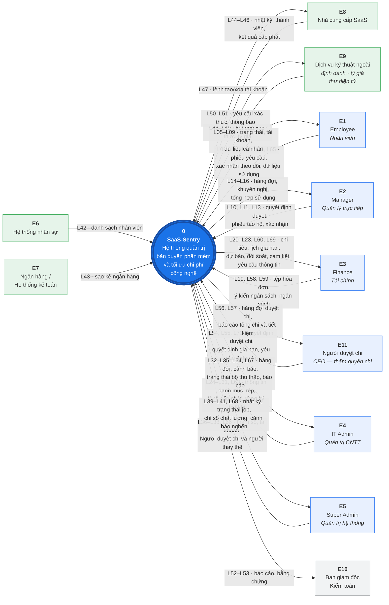

# SaaS-Sentry — Context Diagram

> **Phiên bản:** 2.3 — đồng bộ **BRD v3.10**, Định nghĩa Phạm vi v1.6, User Flows v0.7 · *(v2.2 đồng bộ BRD v3.9)* · *(v2.1 đồng bộ BRD v3.8)* · *(v2.0 đồng bộ BRD v3.5, Định nghĩa Phạm vi v1.1, User Flows v0.2)*
>
> **Thay đổi ở v2.3 — `QĐ-29b`:** Tài chính **không** nằm trên đường duyệt. **Thêm `L69`** *(hệ thống → `E3`: yêu cầu thông tin ngân sách và khoản cam kết cần ghi nhận)* và **`L70`** *(`E11` → hệ thống: yêu cầu thông tin ngân sách)*; sửa nội dung `L55`, `L56`, `L58`, `L60`; câu chuyện mục 5.2, 5.4. Tổng **65 → 67** luồng; `E3` 8 → 9, `E11` 4 → 5.
> **Phạm vi tài liệu:** **chỉ** Context Diagram (DFD mức 0). Không có DFD mức 1, không có kho dữ liệu, không mô tả bên trong hệ thống.
> **Mục đích:** một người chưa biết gì về đề tài, đọc xong file này, **tự vẽ lại được sơ đồ** và **hiểu hệ thống chạy như thế nào**.
>
> **Thay đổi ở v2.2 — theo `QĐ-27`, `QĐ-28c`, `QĐ-28d`, nhóm trưởng chốt 15/09/2026:**
> **(a) Ngừng dùng `L12` *Thông tin ủy quyền phê duyệt*** — không còn ủy quyền duyệt (`QĐ-27`). Mã **không tái sử dụng**, giữ gạch ngang trong bảng. `E2`: **7 → 6** luồng.
> **(b) Thêm `L68` *Cảnh báo nghẽn phê duyệt*** (hệ thống → `E5`) — backlog vượt ngưỡng hoặc bước quá SLA; Super Admin chỉ sửa cấu hình, **không** duyệt thay (`QĐ-27`, `FR-3.8`). `E5`: **7 → 8** luồng.
> **(c)** `L66` thêm cấu hình **người thay thế khi Người duyệt chi xung đột lợi ích** và **ngưỡng backlog** (`QĐ-28c`, `FR-3.15`); `L14` ghi rõ quá hạn chỉ nhắc/thông báo (`QĐ-28d`). Tổng luồng đang dùng giữ **65** *(65 − 1 + 1)*; tác nhân giữ **11**.
>
> **Thay đổi ở v2.1 — theo `QĐ-20` → `QĐ-25`, nhóm trưởng chốt 14/09/2026:**
> **(a) Thêm tác nhân `E11` — Người duyệt chi** (`QĐ-22`). Mã `E1` → `E10` **giữ nguyên**. Tổng tác nhân: **10 → 11**.
> **(b) Ngừng dùng hai luồng của `E3`:** `L17` *Quyết định duyệt chi phí* và `L18` *Quyết định gia hạn, giảm số lượng hoặc hủy* — hai quyết định này nay thuộc `E11` (`L54`, `L55`). Mã cũ **không tái sử dụng**, giữ gạch ngang trong bảng để truy vết.
> **(c) Thêm 14 luồng `L54` → `L67`:** duyệt chi, ý kiến ngân sách, ngân sách và khoản cam kết, xác nhận chủ động theo dõi, yêu cầu dừng thu thập, dữ liệu sử dụng trên thiết bị công ty, đăng ký thiết bị, trạng thái bộ thu thập, báo cáo. Tổng luồng đang dùng: **53 → 65** *(53 − 2 + 14)*.
> **(d) Bộ thu thập trên thiết bị nằm BÊN TRONG ranh giới hệ thống** — quyết định của nhóm trưởng ở `QĐ-20`. Trên sơ đồ, dữ liệu sử dụng đi thẳng từ `E1` Nhân viên vào vòng tròn (`L65`); thiết bị công ty không phải tác nhân ngoài. Xem mục 7.
> **(e) Bản `.drawio` được sinh lại bằng `tools/generate-context-diagram.py` từ chính các bảng mục 3, 4** — bản đặt tọa độ tay ở v2.0 render ra nhãn chồng nhau và mọi mũi tên dồn vào một điểm. Bản cũ lưu ở `SaaS-Sentry-Context-Diagram.v2.0.drawio`.
> Bỏ phòng ban khỏi `E6`, `L42` (`QĐ-23`); `L22` ghi hoãn lớp L2 (`QĐ-25`).
>
> **Thay đổi ở v2.0 — hai sửa lớn:**
> **(a) Sửa lỗi đặt tên luồng.** Sáu luồng ở v1.1 đặt tên bằng **động từ** — sai quy tắc DFD. *Khai báo danh mục*, *Xử lý phát hiện*, *Khớp danh tính*, *Quản lý tài khoản*, *Phê duyệt chi phí*, *Cập nhật trạng thái nhân sự* đã đổi thành cụm danh từ. Bổ sung **mục 1.2 quy tắc đặt tên** kèm phép tự kiểm.
> **(b) Bổ sung 15 luồng còn thiếu.** Rà lại BRD và User Flows thì sơ đồ v1.1 **bỏ sót nhiều luồng chức năng chính** — ủy quyền phê duyệt, tạo yêu cầu hộ, rút phiếu, cập nhật trạng thái nhân sự, xác nhận thông báo người lao động, cảnh báo gia hạn tới Tài chính, kết quả cấp phát từ nhà cung cấp, chỉ số chất lượng khuyến nghị. Tổng luồng: **38 → 53**. Mã luồng **đánh lại theo tác nhân** (`L01`–`L09` là `E1`, `L10`–`L16` là `E2`…) để tra nhanh.
>
> **Thay đổi ở v1.1:** gộp ba tác nhân kỹ thuật thành **`E9` Dịch vụ kỹ thuật ngoài**; `Ban giám đốc, Kiểm toán` đổi số `E12` → `E10`. Tổng tác nhân: 12 → 10.
> **Thay đổi ở v1.0:** gỡ toàn bộ phần DFD mức 1 và phụ lục ở v0.2.

---

## 1. Context Diagram là gì

Context Diagram là **sơ đồ ở mức khái quát nhất** của một hệ thống. Nó trả lời đúng ba câu hỏi:

1. **Hệ thống là cái gì** — một vòng tròn duy nhất ở giữa
2. **Ai hoặc cái gì ở bên ngoài mà hệ thống trao đổi dữ liệu** — các hình chữ nhật xung quanh
3. **Dữ liệu gì đi qua ranh giới, theo chiều nào** — các mũi tên có nhãn

Nó **không** trả lời câu *"bên trong hệ thống hoạt động ra sao"*. Đó là việc của DFD mức 1 trở đi.

### 1.1. Ba thành phần duy nhất

| Thành phần         | Hình vẽ               | Số lượng ở sơ đồ này |
| ------------------ | --------------------- | -------------------- |
| **Tiến trình**     | Vòng tròn, ghi số `0` | **Đúng 1**           |
| **Tác nhân ngoài** | Hình chữ nhật         | **11** *(10 tới v2.0)* |
| **Luồng dữ liệu**  | Mũi tên có nhãn       | **67** *(65 tới v2.2; 53 tới v2.0)* |

### 1.2. Quy tắc đặt tên luồng — nhãn phải là DANH TỪ

Đây là quy tắc hay bị làm sai nhất, và cũng dễ bị hội đồng nhặt ra nhất.

> **Luồng dữ liệu là một *thứ* đi qua ranh giới, không phải một *việc* được làm.** Nên nhãn phải là **danh từ hoặc cụm danh từ**, không phải động từ.

| ❌ Sai — động từ                  | ✅ Đúng — danh từ                        | Vì sao                                                             |
| -------------------------------- | --------------------------------------- | ------------------------------------------------------------------ |
| *Khai báo danh mục*              | **Thông tin danh mục, gói và thuê bao** | "Khai báo" là hành động; cái đi qua ranh giới là **thông tin**     |
| *Phê duyệt chi phí*              | **Quyết định duyệt chi phí**            | Cái truyền đi là **quyết định**, không phải việc phê duyệt         |
| *Khớp danh tính thủ công*        | **Kết quả khớp danh tính**              | Việc khớp diễn ra trong đầu người dùng; cái gửi vào là **kết quả** |
| *Xử lý phát hiện ngoài danh mục* | **Quyết định xử lý bản ghi phát hiện**  | Như trên                                                           |
| *Quản lý tài khoản và vai trò*   | **Thông tin tài khoản và vai trò**      | Như trên                                                           |
| *Cập nhật trạng thái nhân sự*    | **Trạng thái làm việc của nhân viên**   | Như trên                                                           |

**Phép tự kiểm:** đặt nhãn vào câu *"hệ thống nhận được ⟨nhãn⟩"* hoặc *"hệ thống gửi ra ⟨nhãn⟩"*. Nếu câu đọc xuôi thì nhãn đúng.

- ✅ *"Hệ thống nhận được **quyết định duyệt chi phí**"* — xuôi
- ❌ *"Hệ thống nhận được **phê duyệt chi phí**"* — không xuôi

> **Tên tiến trình thì ngược lại — phải là động từ + bổ ngữ** (*Xử lý yêu cầu và phê duyệt*). Ở mức 0 chỉ có một tiến trình mang tên hệ thống nên chưa áp dụng, nhưng khi làm DFD mức 1 thì phải nhớ quy tắc này.

### 1.3. Bốn quy tắc bắt buộc của mức 0

Bốn phép kiểm để tự soát sơ đồ sau khi vẽ xong:

| #   | Quy tắc                            | Vì sao                                                                           |
| --- | ---------------------------------- | -------------------------------------------------------------------------------- |
| 1   | **Chỉ có một vòng tròn**           | Nhiều vòng tròn nghĩa là đã sang mức 1                                           |
| 2   | **Không có kho dữ liệu**           | Kho dữ liệu là chuyện bên trong hệ thống; mức 0 chưa mở hộp                      |
| 3   | **Mọi mũi tên đều chạm vòng tròn** | Mũi tên nối hai tác nhân ngoài với nhau là sai — chuyện đó xảy ra ngoài hệ thống |
| 4   | **Mọi nhãn đều là danh từ**        | Xem mục 1.2                                                                      |

### 1.4. Vì sao sơ đồ này quan trọng với đề tài

Context Diagram là **hợp đồng về phạm vi**. Mọi tranh cãi kiểu *"cái này có làm không?"* đều quy về một câu: **nó nằm trong vòng tròn hay ngoài vòng tròn?**

Nó khóa lại ba thứ trước khi làm Use Case Diagram:

- **Danh sách tác nhân** — Use Case Diagram không được đẻ thêm actor nào ngoài 11 cái ở đây
- **Danh sách hệ thống ngoài** — không vẽ use case cho thứ hệ thống không kết nối tới
- **Loại và chiều dữ liệu** — không hứa những tích hợp mà ràng buộc `RB-3`, `RB-4` không cho phép

---

## 2. Sơ đồ

### 2.1. Bản rút gọn — gộp luồng theo tác nhân

Bản này để **nhìn tổng thể trong một trang**. Mỗi mũi tên gộp các luồng cùng chiều của một tác nhân; mã luồng ghi dạng khoảng.

**Quy ước màu** *(chỉ để dễ đọc, không phải ký pháp bắt buộc)*: 🟢 xanh lá — hệ thống ngoài · 🔵 xanh dương — người dùng có tài khoản đăng nhập · ⬜ xám — người nhận báo cáo, không đăng nhập.

### 2.2. Bản đầy đủ — 67 mũi tên riêng biệt

> 📎 **Xem tệp `SaaS-Sentry-Context-Diagram.drawio`** kèm theo tài liệu này. Mở bằng [draw.io](https://app.diagrams.net) hoặc phần mở rộng Draw.io Integration trong VS Code. Ảnh xuất: `SaaS-Sentry-Context-Diagram.png`.

Bản đầy đủ vẽ **mỗi luồng một mũi tên riêng**, đúng 67 mũi tên theo bảng mục 4. Đây là bản dùng cho **báo cáo cuối** — nó cho thấy hệ thống bao quát hết các luồng chức năng chính, không gộp cái nào.

**Vì sao phải có hai bản:** công cụ vẽ sơ đồ tự động không sắp xếp nổi 67 mũi tên hội tụ về một điểm — nhãn chồng lên nhau và mũi tên cắt chéo. **Hai bản có nội dung giống hệt nhau**, chỉ khác mức gộp.

**Cách sinh bản `.drawio`** *(từ v2.1)*: chạy `python tools/generate-context-diagram.py` tại thư mục này. Script **đọc thẳng bảng mục 3 và mục 4** — tác nhân, mã luồng, chiều, tên luồng — rồi đặt mỗi mũi tên vào một điểm riêng trên vòng tròn. Luồng có tên gạch ngang (`~~L17~~`) bị bỏ qua. Sửa luồng thì **sửa bảng, rồi chạy lại script**; không sửa tay file `.drawio`. Sau đó xuất ảnh: `drawio -x -f png -s 1 -o SaaS-Sentry-Context-Diagram.png SaaS-Sentry-Context-Diagram.drawio`.

---

## 3. Mười một tác nhân ngoài *(mười tới v2.0)*

**Tác nhân ngoài** là người, tổ chức hoặc hệ thống **nằm ngoài ranh giới** hệ thống nhưng có trao đổi dữ liệu với nó.

### 3.1. Bảy tác nhân người *(sáu tới v2.0)*

| Mã      | Tác nhân                              | Là ai                                                     | Số luồng     | Ràng buộc quyền hạn                                                                     |
| ------- | ------------------------------------- | --------------------------------------------------------- | ------------ | --------------------------------------------------------------------------------------- |
| **E1**  | **Employee** Nhân viên            | Người sử dụng trực tiếp tài khoản phần mềm                | 7 vào · 5 ra | Chỉ xem được dữ liệu của **chính mình** — `BR-40.1`                                     |
| **E2**  | **Manager** Quản lý trực tiếp     | Người xác nhận nhu cầu nghiệp vụ của nhân viên trực thuộc | 4 vào · 3 ra | **Không** xem nhật ký hoạt động thô, hợp đồng, dữ liệu tài chính toàn công ty — `SoD-2` |
| **E3**  | **Finance** Tài chính             | Người **kiểm soát ngân sách** và giám sát dòng tiền *(sửa ở v2.1 — không còn duyệt chi)* | 3 vào · 6 ra | **Không** thực hiện thao tác kỹ thuật, không tự cấp/thu hồi tài khoản, **không quyết chi** — `SoD-3` |
| **E11** | **Người duyệt chi** *(mới ở v2.1)* | Người có thẩm quyền chi, mặc định CEO — quyết định cuối cho khoản chi và SaaS mới | 3 vào · 2 ra | Không cấp/thu hồi seat, không duyệt yêu cầu mình là người yêu cầu hoặc thụ hưởng — `SoD-7`; câu trả lời và ghi nhận ngân sách do người khác — `SoD-8` |
| **E4**  | **IT Admin** Quản trị CNTT        | Người vận hành danh mục, cấp phát và dữ liệu              | 9 vào · 6 ra | Bên **duy nhất** thực hiện thay đổi seat, và chỉ sau khi đủ phê duyệt — `SoD-5`         |
| **E5**  | **Super Admin** Quản trị hệ thống | Người quản trị tài khoản và cấu hình hệ thống             | 4 vào · 3 ra | **Không** gán seat, **không** phê duyệt yêu cầu nghiệp vụ — `SoD-1`                     |
| **E10** | **Ban giám đốc, Kiểm toán**           | Người nhận báo cáo — **trừ** người giữ vai `E11`          | 0 vào · 2 ra | **Không có tài khoản đăng nhập** — chỉ nhận kết quả                                     |

> **Vì sao `E1` → `E5` và `E11` phải là sáu tác nhân tách biệt, không gộp:** nguyên tắc gốc của đề tài là *người quyết định nhu cầu, người quyết định chi và người thực hiện kỹ thuật là ba vai khác nhau, và không ai được duyệt yêu cầu của chính mình* (`SoD-4`, `SoD-7`, `INV-08`). Gộp bất kỳ hai tác nhân nào lại là phá nguyên tắc đó ngay từ sơ đồ.
>
> **Về `E11` và `E10`** *(v2.1)*: CEO vừa có thể là thành viên Ban giám đốc vừa giữ vai `E11`. Trên sơ đồ tách hai hộp vì chúng **trao đổi dữ liệu khác nhau**: `E11` đăng nhập và gửi quyết định vào; `E10` chỉ nhận báo cáo ra. Một người có thể đứng sau cả hai hộp — giống `E2` và `E4` có thể là cùng một người khi người đó vừa quản lý vừa là IT Admin.
>
> **Về `E2` Manager:** đây là vai trò **phái sinh** — hệ thống suy ra từ việc có nhân viên nào trỏ `manager_id` về người đó, không gán tay (`ADR-08`). Trên sơ đồ nó vẫn là tác nhân riêng vì nó **trao đổi dữ liệu khác** với hệ thống.
>
> **`E4` IT Admin có 12 luồng — nhiều nhất, và đó là đúng.** `SoD-5` quy định IT Admin là **bên duy nhất** thực hiện thay đổi seat, đồng thời cũng là người nạp mọi loại tệp và xử lý mọi hàng đợi. Nếu sơ đồ cho thấy một tác nhân khác cũng cấp phát được thì đó là lỗi mô hình.
>
> **Business Owner không phải tác nhân thứ 11.** BRD mục 4.4 nói rõ đây là **thuộc tính gắn vào ứng dụng**, không phải vai trò đăng nhập; người giữ vai trò này thường đã là `E2` hoặc `E4`.

### 3.2. Bốn hệ thống ngoài

| Mã     | Hệ thống                                          | Trao đổi gì                                                                                           | Kênh                                                  | Trạng thái                    |
| ------ | ------------------------------------------------- | ----------------------------------------------------------------------------------------------------- | ----------------------------------------------------- | ----------------------------- |
| **E6** | **Hệ thống nhân sự**                              | Danh sách nhân viên, cost center, quản lý trực tiếp *(v2.1 — bỏ phòng ban, `QĐ-23`)*                  | Tệp CSV/Excel xuất tay                                | ✅ **Bắt buộc** — `GĐ-1`       |
| **E7** | **Ngân hàng / Hệ thống kế toán**                  | Sao kê giao dịch                                                                                      | Tệp CSV                                               | ⚪ Tùy chọn                    |
| **E8** | **Nhà cung cấp SaaS** *Figma, Slack, GitHub…* | **Vào:** nhật ký hoạt động, danh sách thành viên, kết quả cấp phát **Ra:** lệnh tạo/xóa tài khoản | Tệp xuất tay **và** API với nhà cung cấp có connector | ✅ Một connector thật — GitHub |
| **E9** | **Dịch vụ kỹ thuật ngoài**                        | Ba dịch vụ gộp chung — xem bảng dưới                                                                  | API, SMTP                                             | ⚠️ Xem chi tiết từng dịch vụ   |

**Ba dịch vụ bên trong `E9`** — gộp trên sơ đồ, tách ở bảng này:

| Dịch vụ                | Luồng        | Trao đổi gì                                      | Trạng thái riêng                                                  |
| ---------------------- | ------------ | ------------------------------------------------ | ----------------------------------------------------------------- |
| Hệ thống định danh     | `L48`, `L50` | Xác thực người dùng qua OAuth 2.0 / OIDC         | ⏳ **Chưa chốt** — `QĐKT-02`, `OQ-15`                                 |
| Nguồn tỷ giá công khai | `L49`        | Tỷ giá theo ngày để quy đổi về đồng tiền báo cáo | ⚠️ **Giả định có đường lui** — `GĐ-8`. Không lấy được thì nhập tay |
| Kênh thư điện tử       | `L51`        | Nội dung thông báo và cảnh báo                   | ✅ — `FR-3.11`                                                     |

> **Vì sao gộp được ba dịch vụ này, mà không gộp `E1` → `E5`, `E11`:** tiêu chí gộp là *cùng loại dữ liệu · không có ràng buộc nghiệp vụ phân biệt · gộp không mất quyết định thiết kế nào*. Ba dịch vụ trên **không mang dữ liệu nghiệp vụ** — chúng là tiện ích kỹ thuật. Ngược lại, sáu vai trò người bị phân biệt bởi `SoD-1` → `SoD-8`: gộp lại là **xóa mất phần lõi của đề tài** ngay trên sơ đồ.
>
> **Một lợi ích phụ:** `QĐKT-02` còn treo — nếu nhóm chốt *tự làm bảng tài khoản* thì dịch vụ định danh biến mất. Nhưng hộp `E9` **vẫn tồn tại** vì còn tỷ giá và thư điện tử, nên **sơ đồ không phải sửa**.

> **`E8` là tác nhân đặc biệt, đáng nói khi bảo vệ.** Nó là tác nhân duy nhất trao đổi qua **hai kênh khác hẳn nhau**: phần lớn nhà cung cấp chỉ cho **xuất tệp thủ công**, một số ít có **API**. Đây chính là nguyên tắc thiết kế lớn nhất của đề tài — **ranh giới đặt ở định dạng dữ liệu, không đặt ở nhà cung cấp** (BRD mục 6.3). Trong ma trận tra cứu tại BRD mục 6.3.1, GitHub là nhà cung cấp duy nhất cho xuất dữ liệu hoạt động ở cấp Organization **mà không cần gói trả phí bậc cao** (`KL-1`).

---

## 4. Sáu mươi bảy luồng dữ liệu *(năm mươi ba tới v2.0)*

> **Cách đếm** *(sửa ở v2.4 — finding `DA-03`)*: **67** là số luồng **đang hoạt động**, khớp số cạnh trong `.drawio`/PNG và bảng dưới đây. Ba mã **ngừng dùng** — `L12`, `L17`, `L18` — không nằm trong con số này và **không** được tái sử dụng. 📁 *Tiêu đề cũ ghi "Sáu mươi lăm" từ trước khi thêm `L69`, `L70`; con số đó không còn đúng.*

Đây là bảng để **vẽ lại sơ đồ**. Mỗi dòng là một mũi tên.

**Cách đọc cột Chiều:** `→` tác nhân gửi **vào** hệ thống · `←` hệ thống gửi **ra** tác nhân.
**Mã luồng đánh theo tác nhân:** `L01`–`L09` thuộc `E1`, `L10`–`L16` thuộc `E2`, và cứ thế. *(v2.1)* Các luồng thêm sau — `L54` → `L67` — **nối tiếp số cuối**, không chèn vào giữa để không đánh lại mã đang được trích dẫn; bảng của từng tác nhân vẫn liệt kê đủ luồng của tác nhân đó.

### 4.1. E1 · Employee — 12 luồng

| Mã  | Chiều | Luồng dữ liệu                    | Nội dung                                                                                                   |
| --- | ----- | -------------------------------- | ---------------------------------------------------------------------------------------------------------- |
| L01 | →     | **Phiếu yêu cầu cấp quyền**      | Xin cấp mới, đổi gói, gia hạn có thời hạn — kèm lý do nghiệp vụ, cost center, thời hạn cần dùng — `FR-3.2` |
| L02 | →     | **Phiếu yêu cầu hoàn trả seat**  | Nhân viên chủ động trả lại quyền không còn dùng — `F-14`                                                   |
| L03 | →     | **Yêu cầu rút phiếu đang chờ**   | Rút yêu cầu khi chưa tới bước IT thực hiện — ngoại lệ của `F-07`                                           |
| L04 | →     | **Yêu cầu xuất dữ liệu cá nhân** | Quyền của chủ thể dữ liệu — `FR-10.2`                                                                      |
| L05 | ←     | **Trạng thái phiếu yêu cầu**     | Đang chờ ai duyệt, đã duyệt, bị từ chối kèm lý do                                                          |
| L06 | ←     | **Thông tin tài khoản được cấp** | Danh sách phần mềm đang giữ và hướng dẫn truy cập                                                          |
| L07 | ←     | **Thông báo cấp phát thất bại**  | Để người yêu cầu biết mà không chờ vô ích — `BR-12.5`                                                      |
| L08 | ←     | **Tệp dữ liệu cá nhân**          | Toàn bộ dữ liệu hệ thống lưu về chính mình — `FR-10.1`                                                     |
| L09 | ←     | **Thông báo theo dõi ứng dụng**  | Khi một ứng dụng bắt đầu được thu thập dữ liệu sử dụng — `FR-10.4`, `F-42`                                 |
| L61 | →     | **Xác nhận chủ động theo dõi**   | *(mới ở v2.1)* Nhân viên bấm xác nhận đã đọc một phiên bản thông báo; chưa có thì không nhận dữ liệu từ thiết bị — `FR-4.18`, `BR-42.4`, `INV-17` |
| L62 | →     | **Yêu cầu dừng thu thập**        | *(mới ở v2.1)* Theo quy trình quyền chủ thể dữ liệu — `BR-42.6`, `FR-10.5`                                 |
| L65 | →     | **Dữ liệu sử dụng trên thiết bị công ty** | *(mới ở v2.1)* Tên miền trong danh sách cho phép, ngày, số phút — đã lọc tại máy bởi bộ thu thập **nằm trong** ranh giới hệ thống — `FR-4.17`, `ADR-13` |

### 4.2. E2 · Manager — 6 luồng *(7 tới v2.1; ngừng `L12`)*

| Mã  | Chiều | Luồng dữ liệu                                      | Nội dung                                                                                                                                    |
| --- | ----- | -------------------------------------------------- | ------------------------------------------------------------------------------------------------------------------------------------------- |
| L10 | →     | **Quyết định phê duyệt**                           | Duyệt hoặc từ chối yêu cầu của nhân viên trực thuộc; từ chối **bắt buộc** có lý do — `BR-07.5`                                              |
| L11 | →     | **Phiếu yêu cầu tạo hộ nhân viên**                 | Quản lý tạo yêu cầu thay nhân viên mới khi onboarding — `BR-02.1`, `F-02`                                                                   |
| ~~L12~~ | → | ~~**Thông tin ủy quyền phê duyệt**~~ | 📁 **Ngừng dùng ở v2.2** — không còn ủy quyền duyệt (`QĐ-27`, BRD `FR-3.5`). Mã không tái sử dụng |
| L13 | →     | **Phiếu xác nhận Giữ / Thu hồi / Miễn trừ**        | Quyết định trên khuyến nghị; miễn trừ **bắt buộc** có thời hạn tối đa 12 tháng — `FR-3.10`                                                  |
| L14 | ←     | **Hàng đợi phê duyệt**                             | Các yêu cầu đang chờ, kèm thời hạn xử lý; quá hạn chỉ nhắc và thông báo, **không** đổi người duyệt *(v2.2 — `QĐ-28d`, `FR-3.8`)* |
| L15 | ←     | **Khuyến nghị thu hồi kèm bằng chứng**             | Số ngày không hoạt động, tên nguồn, cửa sổ bao phủ, phương pháp khớp danh tính, mức tin cậy, **hai** con số tiết kiệm tách biệt — `FR-4.14` |
| L16 | ←     | **Bảng tổng hợp sử dụng của nhân viên trực thuộc** | Chỉ dữ liệu tổng hợp, **không** có nhật ký thô — `FR-3.7`, `BR-21.1`                                                                        |

### 4.3. E3 · Finance — 9 luồng *(8 tới v2.2; 7 tới v2.0)*

| Mã  | Chiều | Luồng dữ liệu                                  | Nội dung                                                                                    |
| --- | ----- | ---------------------------------------------- | ------------------------------------------------------------------------------------------- |
| ~~L17~~ | → | ~~**Quyết định duyệt chi phí**~~              | 📁 **Ngừng dùng ở v2.1** — quyết định chi thuộc `E11`, xem `L54`. Mã không tái sử dụng     |
| ~~L18~~ | → | ~~**Quyết định gia hạn, giảm số lượng hoặc hủy**~~ | 📁 **Ngừng dùng ở v2.1** — thuộc `E11`, xem `L55`. Mã không tái sử dụng               |
| L19 | →     | **Tệp hóa đơn nhà cung cấp**                   | Để đối soát với số seat khai trong thuê bao — `F-35`                                        |
| L58 | →     | **Ý kiến ngân sách**                           | *(mới ở v2.1; sửa v2.3)* Trong hạn mức · Vượt hạn mức · Chưa có ngân sách — khi **trả lời yêu cầu thông tin** của `E11`, hoặc khi **ghi nhận sau duyệt**; **không chặn** — `FR-3.14` |
| L59 | →     | **Ngân sách theo cost center và kỳ**           | *(mới ở v2.1)* Nhập tay hoặc import — `F-36`                                                |
| L20 | ←     | **Bảng chi tiêu theo đơn vị**                  | Chi phí theo tháng/quý/năm, phân bổ theo cost center và cây người phụ trách, Budget vs Actual, **tiết kiệm** — `FR-5.1`, `FR-5.2`, `FR-5.9` *(nội dung mở rộng ở v2.1)* |
| L21 | ←     | **Lịch gia hạn và cảnh báo hạn báo hủy**       | Tính từ **hạn chót báo hủy**, không tính từ ngày gia hạn — `FR-1.4`, `F-26`                 |
| L22 | ←     | **Dự báo chi phí ba lớp**                      | *(v2.1)* Lớp L1 và L3; **lớp L2 hoãn** trong MVP — `FR-5.5`, `FR-5.7`, `QĐ-25`             |
| L23 | ←     | **Kết quả đối soát hóa đơn**                   | So sánh số seat trên hóa đơn với số khai trong thuê bao và số đang dùng — `FR-5.4`          |
| L60 | ←     | **Bảng ngân sách, thực chi và khoản cam kết**  | *(mới ở v2.1)* Ngân sách còn lại = ngân sách kỳ − thực chi − cam kết đang giữ — `FR-5.8`, `F-36` |
| L69 | ←     | **Yêu cầu thông tin ngân sách và khoản cam kết cần ghi nhận** | *(mới ở v2.3 — `QĐ-29b`)* Yêu cầu thông tin do `E11` gửi *(tùy chọn, không dừng SLA)*; khoản cam kết vừa tạo khi duyệt chi, chờ Tài chính ghi nhận song song cấp phát — `FR-3.14`, `FR-5.8` |

### 4.3b. E11 · Người duyệt chi — 5 luồng *(mới ở v2.1; 4 tới v2.2)*

| Mã  | Chiều | Luồng dữ liệu                                  | Nội dung                                                                                    |
| --- | ----- | ---------------------------------------------- | ------------------------------------------------------------------------------------------- |
| L54 | →     | **Quyết định duyệt chi**                       | Duyệt hoặc từ chối yêu cầu **có chi phí** hoặc **SaaS mới**; từ chối bắt buộc có lý do — `FR-3.13`, `BR-09.4` |
| L55 | →     | **Quyết định gia hạn, giảm số lượng hoặc hủy** | Trên snapshot ngân sách kèm số liệu sử dụng *(sửa v2.3 — `QĐ-29b`)* — `F-27`, `BR-27.4`    |
| L70 | →     | **Yêu cầu thông tin ngân sách**                | *(mới ở v2.3 — `QĐ-29b`)* Tùy chọn; bước duyệt chi vẫn của `E11`, SLA không dừng — `FR-3.14`, `BR-07.9` |
| L56 | ←     | **Hàng đợi duyệt chi**                         | Kèm **snapshot ngân sách** *(ngân sách, thực chi, cam kết đang giữ, còn lại, đang chờ duyệt)*, nhu cầu đã được quản lý xác nhận, câu trả lời của Tài chính nếu có, thời hạn xử lý — `FR-3.14` *(sửa v2.3)* |
| L57 | ←     | **Báo cáo tổng chi, tiết kiệm và tóm tắt quy trình** | Hai con số tiết kiệm tách riêng — `FR-5.9`, `FR-5.11`                                  |

### 4.4. E4 · IT Admin — 15 luồng

| Mã  | Chiều | Luồng dữ liệu                                  | Nội dung                                                                                                                     |
| --- | ----- | ---------------------------------------------- | ---------------------------------------------------------------------------------------------------------------------------- |
| L24 | →     | **Thông tin danh mục, gói và thuê bao**        | Ứng dụng, nhà cung cấp, mô hình giá, số seat, **hạn chót báo hủy**, cờ nhóm dịch vụ liên lạc — `FR-1.1` → `FR-1.3`, `FR-1.8` |
| L25 | →     | **Tệp dữ liệu tải lên**                        | Tệp nhân sự, nhật ký sử dụng, hợp đồng, hóa đơn — `FR-7.1`                                                                   |
| L26 | →     | **Phiếu xác nhận bước xem trước**              | **Bắt buộc** trước khi ghi dữ liệu thật — `FR-7.2`                                                                           |
| L27 | →     | **Lệnh cấp và thu hồi seat**                   | Thực hiện sau khi yêu cầu đủ phê duyệt; kèm xác nhận hoàn tất với kênh thủ công — `FR-2.3`, `FR-2.4`, `BR-10.1`              |
| L28 | →     | **Trạng thái làm việc của nhân viên**          | Đang làm, nghỉ dài, đã nghỉ việc — cập nhật tay, không tích hợp HRM — `F-04`, `F-05`, `OQ-04`                                |
| L29 | →     | **Quyết định xử lý bản ghi phát hiện**         | Đã duyệt / Chưa duyệt / Báo nhầm — `FR-6.9`                                                                                  |
| L30 | →     | **Kết quả khớp danh tính thủ công**            | Gán định danh phía nhà cung cấp về đúng nhân viên nội bộ — `FR-4.5`, `BR-18.3`                                               |
| L31 | →     | **Phiếu xác nhận đã thông báo người lao động** | Điều kiện để được ghi dữ liệu hoạt động — `BR-42.2`, `F-42`                                                                  |
| L63 | →     | **Thông tin đăng ký thiết bị công ty**         | *(mới ở v2.1)* Thiết bị ↔ nhân viên, có ngày hiệu lực — `FR-4.18`, `F-45`                                                    |
| L32 | ←     | **Hàng đợi tác vụ cấp phát**                   | Tác vụ chờ thực hiện, tác vụ thất bại, việc quá hạn — `FR-2.5`, `F-12`                                                       |
| L33 | ←     | **Cảnh báo hạn chót báo hủy**                  | Kèm các khuyến nghị lãng phí đang mở của chính thuê bao đó — `BR-26.2`                                                       |
| L34 | ←     | **Bản ghi sai lệch với nhà cung cấp**          | Hai loại: có trong hệ thống mà nhà cung cấp không có, và **có ở nhà cung cấp mà hệ thống không biết** — `FR-2.6`             |
| L35 | ←     | **Hàng đợi định danh chưa khớp**               | Định danh không map được; **không** được dùng để kết luận — `FR-4.6`, `INV-12`                                               |
| L64 | ←     | **Trạng thái bộ thu thập**                     | *(mới ở v2.1)* Thiết bị đã đăng ký, đã xác nhận, lần gửi gần nhất, bản ghi bị từ chối kèm lý do — `FR-0.4`, `F-45`          |
| L67 | ←     | **Báo cáo hiệu suất sử dụng và chất lượng dữ liệu** | *(mới ở v2.1)* `KPI-3`, G1 → G4, chi phí trên mỗi người dùng có hoạt động, độ mới nguồn — `FR-5.10`, `FR-5.12`, `F-47` |

### 4.5. E5 · Super Admin — 8 luồng *(7 tới v2.1)*

| Mã  | Chiều | Luồng dữ liệu                                     | Nội dung                                                                                      |
| --- | ----- | ------------------------------------------------- | --------------------------------------------------------------------------------------------- |
| L36 | →     | **Tham số cấu hình ngưỡng và chính sách**         | Ngưỡng phát hiện, thời hạn SLA phê duyệt, chính sách lưu giữ, ngưỡng sai số dự báo — `FR-8.2` |
| L37 | →     | **Thông tin tài khoản và vai trò**                | Tạo, khóa tài khoản đăng nhập; gán vai trò — `FR-8.1`                                         |
| L38 | →     | **Quyết định bật thu thập cho ứng dụng liên lạc** | Hành động **có chủ đích**, ghi nhật ký kèm lý do và cơ sở pháp lý — `ADR-10`, `BR-06.5`       |
| L66 | →     | **Cấu hình Người duyệt chi, người thay thế khi xung đột và nội dung thông báo theo dõi** | *(mới ở v2.1; mở rộng v2.2)* Cấu hình, **không** phải phê duyệt — người giữ vai Người duyệt chi, người thay thế khi Người duyệt chi là người yêu cầu/thụ hưởng, ngưỡng backlog — `FR-3.13`, `FR-3.15`, `FR-8.2`, `SoD-1` |
| L39 | ←     | **Nhật ký kiểm toán**                             | Ai làm gì, khi nào, đổi từ gì sang gì. **Chỉ ghi thêm** — `FR-8.3`, `INV-05`                  |
| L40 | ←     | **Trạng thái tác vụ nền**                         | Lần chạy gần nhất, kết quả, số bản ghi xử lý, lỗi — `FR-8.4`                                  |
| L41 | ←     | **Chỉ số chất lượng khuyến nghị**                 | Tỷ lệ khuyến nghị bị bác bỏ; **không** hiển thị cho Manager — `KPI-5`, `FR-0.3`               |
| L68 | ←     | **Cảnh báo nghẽn phê duyệt**                      | *(mới ở v2.2)* Người duyệt có backlog vượt ngưỡng hoặc bước quá SLA; Super Admin chỉ sửa cấu hình hoặc ghi sự cố, **không** duyệt thay — `QĐ-27`, `FR-3.8`, `FR-5.11`, `BR-13.8` |

### 4.6. E6 → E9 · Bốn hệ thống ngoài — 10 luồng

| Mã  | Chiều | Tác nhân | Luồng dữ liệu                             | Nội dung                                                                                     |
| --- | ----- | -------- | ----------------------------------------- | -------------------------------------------------------------------------------------------- |
| L42 | →     | E6       | **Danh sách nhân viên và cơ cấu tổ chức** | Mã NV, họ tên, email công việc, cost center, quản lý trực tiếp, ngày vào/nghỉ *(v2.1 — bỏ phòng ban)* |
| L43 | →     | E7       | **Sao kê giao dịch ngân hàng**            | Ngày, mô tả giao dịch, số tiền, loại tiền tệ — nguồn bằng chứng cho phát hiện ngoài danh mục |
| L44 | →     | E8       | **Bản xuất nhật ký hoạt động**            | Định danh phía nhà cung cấp, ngày hoạt động cuối **hoặc** dòng sự kiện — `FR-4.1`            |
| L45 | →     | E8       | **Danh sách thành viên**                  | Qua API, phục vụ **đối soát** — `FR-2.6`, `F-28`                                             |
| L46 | →     | E8       | **Kết quả thực thi cấp phát**             | Thành công, lỗi tạm thời, lỗi vĩnh viễn, hết hạn mức — `F-12`                                |
| L47 | ←     | E8       | **Lệnh tạo và xóa tài khoản**             | Qua API với nhà cung cấp có connector — BRD mục 6.2                                          |
| L48 | →     | E9       | **Kết quả xác thực**                      | Danh tính người đăng nhập                                                                    |
| L49 | →     | E9       | **Tỷ giá theo ngày**                      | Để quy đổi về đồng tiền báo cáo — `ADR-03`                                                   |
| L50 | ←     | E9       | **Yêu cầu xác thực**                      | OAuth 2.0 / OIDC                                                                             |
| L51 | ←     | E9       | **Nội dung thông báo**                    | Thông báo trạng thái, cảnh báo, hàng đợi xác nhận                                            |

### 4.7. E10 · Ban giám đốc, Kiểm toán — 2 luồng

| Mã  | Chiều | Luồng dữ liệu                         | Nội dung                                            |
| --- | ----- | ------------------------------------- | --------------------------------------------------- |
| L52 | ←     | **Báo cáo chi tiêu và tiết kiệm**     | Tổng chi tiêu phần mềm và số tiết kiệm đã thực hiện |
| L53 | ←     | **Bằng chứng rà soát quyền truy cập** | Phục vụ kiểm toán và bộ phận bảo mật                |

### 4.8. Bốn luồng đáng chỉ tay vào khi bảo vệ

| Luồng                                                       | Vì sao đáng nói                                                                                                                                                                                                  |
| ----------------------------------------------------------- | ---------------------------------------------------------------------------------------------------------------------------------------------------------------------------------------------------------------- |
| **`L45` — danh sách thành viên, chiều VÀO từ nhà cung cấp** | Nhiều người vẽ mũi tên tới nhà cung cấp chỉ một chiều đi ra. Chiều vào mới là chỗ có giá trị: sai lệch loại *"có ở nhà cung cấp nhưng hệ thống không biết"* nghĩa là **có người được cấp quyền ngoài quy trình** |
| **`L21` và `L33` — cảnh báo tính từ hạn chót báo hủy**      | Nếu hợp đồng buộc báo hủy trước 30 ngày mà hệ thống cảnh báo trước ngày gia hạn 7 ngày, thì đó là **một cảnh báo vô dụng được gửi đúng giờ**. Cảnh báo đi tới **cả** `E3` và `E4` — `F-26`                       |
| **`L26` — phiếu xác nhận bước xem trước**                   | Chỗ chặn mọi kết luận sai trên dữ liệu thiếu. Không có nó thì hệ thống chạy trơn tru nhưng kết luận sai, và không ai biết                                                                                        |
| **`L31` — xác nhận đã thông báo người lao động**            | **Không phải tính năng cho đẹp** — biện pháp thiết kế hiện thực yêu cầu *"người lao động biết rõ"* của Điều 25 khoản 3 Luật 91/2025/QH15 *(sửa chữ ở v2.1: không khẳng định có nó là đã hợp pháp)* — `BR-42.1` |
| **`L61` và `L65` — xác nhận chủ động rồi mới có dữ liệu thiết bị** *(v2.1)* | Thứ tự hai mũi tên này là cả `INV-17`: `L65` **không được tồn tại** cho một nhân viên chưa có `L61`. Và `L65` chỉ mang tên miền, ngày, số phút — máy chủ không bao giờ nhận URL hay nội dung (`ADR-13`) |
| **`L54` đến từ `E11`, không từ `E3`** *(v2.1; sửa v2.3)*     | Tài chính gửi **ý kiến** (`L58`) — chỉ khi được hỏi (`L70` → `L69`) hoặc khi ghi nhận sau duyệt; người có thẩm quyền chi gửi **quyết định** (`L54`). Hai mũi tên từ hai hộp khác nhau chính là góp ý của mentor thể hiện trên sơ đồ |

---

## 5. Hệ thống chạy như thế nào — đọc sơ đồ thành câu chuyện

Sơ đồ ở mục 2 mô tả một vòng đời khép kín. Đọc theo thứ tự này thì hiểu được hệ thống làm gì.

### 5.1. Bước đầu — đổ dữ liệu nền vào

Doanh nghiệp bắt đầu từ con số không. `E4` nhập danh sách nhân viên lấy từ `E6` **(L42 → L25)**, xác nhận bước xem trước **(L26)**, rồi khai báo các ứng dụng đang dùng cùng hợp đồng và số seat đã mua **(L24)**.

> **Đây là điểm đáng nhấn nhất của cả đề tài.** Ngay sau các luồng này — **chưa cần một dòng nhật ký nào từ bên ngoài** — hệ thống đã trả lời được hai câu hỏi ra tiền: *bao nhiêu seat đã mua mà chưa gán cho ai*, và *bao nhiêu seat còn nằm trong tay người đã nghỉ việc*. Cả ba nguồn đều là **dữ liệu nội bộ doanh nghiệp đã có sẵn**, không cần xin phép nhà cung cấp nào. Đó là lý do đề tài khả thi dù ràng buộc `RB-3` chặn phần lớn nguồn dữ liệu hoạt động.

### 5.2. Vòng cấp quyền — làm đường chính thức nhanh hơn đường tắt

`E1` gửi phiếu yêu cầu **(L01)**, hoặc `E2` gửi hộ khi onboarding **(L11)**. Hệ thống định tuyến tới `E2` **(L14 → L10)**; nếu người duyệt vắng thì hệ thống nhắc, thông báo và cảnh báo nghẽn cho `E5` **(L68)** — không ủy quyền, không đổi người *(sửa ở v2.2)*. *(v2.3 — `QĐ-29b`)* Phát sinh chi phí thì `E11` nhận hàng đợi kèm snapshot ngân sách **(L56)** và quyết định **(L54)**; nếu cần, `E11` hỏi Tài chính **(L70 → L69)** và `E3` trả lời **(L58)** — bước vẫn của `E11`, SLA không dừng. SaaS chưa có trong danh mục cũng đi qua `E11`, kể cả khi miễn phí. Duyệt xong, khoản cam kết tới `E3` để ghi nhận **(L69 → L58)** song song với cấp phát, và hiện trên bảng của `E3` **(L60)**.

Đủ phê duyệt rồi mới tới `E4` thực hiện **(L32 → L27)**, hệ thống gọi API tạo tài khoản ở `E8` **(L47)** và nhận kết quả về **(L46)**. `E1` nhận thông báo suốt quá trình **(L05)**, kể cả khi cấp phát thất bại **(L07)**. Nếu đổi ý, `E1` rút phiếu **(L03)**.

> **Vì sao vòng này tồn tại:** nhân viên đi đường vòng mua phần mềm bằng thẻ cá nhân **không phải vì muốn phá luật**, mà vì đường chính thức mất ba ngày còn tự đăng ký mất ba phút. Nên đây không phải một module quản lý giấy tờ — nó là **biện pháp xử lý nguyên nhân gốc** của Shadow IT.

### 5.3. Vòng phát hiện lãng phí — có bằng chứng, không kết tội

Trước khi thu thập, `E4` phải xác nhận đã thông báo người lao động **(L31)**, và `E1` nhận được thông báo đó **(L09)**. Sau đó `E4` mới nạp bản xuất nhật ký từ `E8` **(L44 → L25 → L26)**.

*(v2.1)* Nguồn thứ hai là **bộ thu thập trên thiết bị công ty**: `E4` đăng ký thiết bị **(L63)**, `E1` nhận thông báo **(L09)** và **bấm xác nhận (L61)**; chỉ sau đó dữ liệu sử dụng mới vào **(L65)**. `E1` có thể yêu cầu dừng **(L62)**. `E4` theo dõi trạng thái bộ thu thập **(L64)**.

Định danh nào không khớp được thì vào hàng đợi **(L35)** và `E4` xử lý tay **(L30)** — **tuyệt đối không dùng để kết luận**. Hệ thống sinh khuyến nghị gửi `E2` **(L15)**, kèm đủ căn cứ để phản biện; `E2` cũng xem được bảng tổng hợp sử dụng của nhân viên mình **(L16)**. `E2` chọn Giữ / Thu hồi / Miễn trừ **(L13)**. Nếu thu hồi thì thành việc cho `E4` **(L32 → L27)**.

> **Nguyên tắc xuyên suốt:** hệ thống **không bao giờ nói "seat này lãng phí"**. Nó nói *"không hoạt động 87 ngày, nguồn X nhập ngày Y, bao phủ 120 ngày, khớp email chính xác"*. Người quản lý phải **phản biện được**, không phải tin.

### 5.4. Vòng hợp đồng — nơi phát hiện biến thành tiền thật

`E9` cấp tỷ giá **(L49)** để mọi con số quy về một đồng tiền. Trước hạn chót báo hủy, hệ thống cảnh báo **cả** `E4` **(L33)** và `E3` **(L21)**, kèm luôn các khuyến nghị lãng phí đang mở của chính thuê bao đó. `E3` đối soát hóa đơn **(L19 → L23)**. *(v2.3)* Quyết định gia hạn, giảm số lượng hay hủy do `E11` **(L55)** trên snapshot ngân sách; `E3` chỉ trả lời khi được hỏi và ghi nhận sau quyết định **(L69 → L58)**.

> **Đây là mắt xích quyết định giá trị của cả hệ thống.** Với hợp đồng cam kết theo năm, thu hồi seat giữa kỳ **không tiết kiệm được đồng nào** — tiền chỉ thật khi giảm số lượng tại ngày gia hạn. Một danh sách khuyến nghị tách rời khỏi lịch hợp đồng thì không bao giờ thành tiền, và đó là lý do nhiều nỗ lực tối ưu license không đi tới đâu.

### 5.5. Vòng phát hiện ngoài danh mục — đưa Shadow IT vào diện quản trị

`E7` cấp sao kê **(L43)**. Hệ thống chuẩn hóa mô tả giao dịch, đối chiếu với danh mục đã duyệt, và tạo bản ghi **cần xem xét** cho `E4` **(L34)**. `E4` quyết định **(L29)**.

> **"Đã duyệt" là kết cục bình thường và tích cực**, không phải ngoại lệ — `BR-34.1`. Shadow IT thường là tín hiệu cho thấy bộ công cụ đã phê duyệt còn thiếu. Ứng dụng được hợp thức hóa sẽ quay lại thành mục danh mục chính thức **(L24)**, khép vòng về mục 5.1.

### 5.6. Vòng đời nhân sự — vừa là chi phí vừa là lỗ hổng bảo mật

`E4` cập nhật trạng thái làm việc **(L28)**. Khi chuyển sang *đã nghỉ việc*, hệ thống liệt kê toàn bộ seat đang giữ và đẩy vào hàng đợi thu hồi **(L32)**. Khi chuyển sang *nghỉ dài*, nhân viên đó bị loại khỏi phạm vi đánh giá lãng phí để không sinh báo động giả.

### 5.7. Xuyên suốt — quản trị và tuân thủ

`E5` cấu hình ngưỡng và chính sách **(L36)**, quản lý tài khoản **(L37)**, cấu hình Người duyệt chi, người thay thế khi xung đột và nội dung thông báo theo dõi **(L66)**, nhận cảnh báo nghẽn phê duyệt **(L68)**, và là người duy nhất được bật thu thập cho nhóm ứng dụng liên lạc **(L38)**. `E4` và `E11` nhận báo cáo theo vai trò **(L67, L57)**. `E5` giám sát qua nhật ký kiểm toán **(L39)**, trạng thái tác vụ nền **(L40)** và chỉ số chất lượng khuyến nghị **(L41)**. `E9` lo xác thực **(L48, L50)** và gửi thư **(L51)**. `E10` nhận báo cáo theo kỳ **(L52, L53)**. `E1` xem và xuất được dữ liệu về chính mình **(L04, L08)**.

### 5.8. Tóm tắt một câu cho mỗi vòng

| Vòng               | Trả lời câu hỏi                                            | Xử lý nỗi đau     |
| ------------------ | ---------------------------------------------------------- | ----------------- |
| Dữ liệu nền        | Đang mua gì, ai đang giữ seat nào                          | `PP-3`            |
| Cấp quyền          | Ai được duyệt, trong bao lâu, vì lý do gì                  | `PP-5`            |
| Phát hiện lãng phí | Quyền đó có thực sự được dùng không, chắc chắn tới mức nào | `PP-1`            |
| Hợp đồng           | Còn kịp hủy không, giảm được bao nhiêu                     | `PP-2`            |
| Ngoài danh mục     | Có thứ gì đang tồn tại mà IT chưa biết không               | `PP-4`            |
| Vòng đời nhân sự   | Người đã nghỉ còn giữ quyền gì không                       | `PP-1` và bảo mật |

---

## 6. Hướng dẫn vẽ lại bằng tay

**Bước 1 — Vẽ vòng tròn giữa trang.** Ghi bên trong: số `0`, tên `SaaS-Sentry`, và một dòng mô tả.

**Bước 2 — Chia trang thành ba vùng quanh vòng tròn.**

| Vùng          | Đặt gì                                  | Số hộp |
| ------------- | --------------------------------------- | ------ |
| Bên trái      | Bốn hệ thống ngoài `E6` → `E9`          | 4      |
| Bên phải      | Sáu người dùng có tài khoản `E1` → `E5`, `E11` | 6      |
| Dưới hoặc góc | `E10` Ban giám đốc, Kiểm toán           | 1      |

**Bước 3 — Vẽ 11 hình chữ nhật**, ghi mã và tên theo bảng mục 3.

**Bước 4 — Vẽ mũi tên theo bảng mục 4.** Với mỗi dòng: mũi tên nối hộp đó với vòng tròn, chiều theo cột *Chiều*, nhãn ghi **mã + tên luồng**.

> **Mẹo bố cục:** vẽ toàn bộ luồng **vào** của một tác nhân sát nhau, rồi tới toàn bộ luồng **ra**. `E4` có 15 luồng nên chừa nhiều chỗ nhất cho nó.

**Bước 5 — Ghi chú `E8` có hai kênh.** Nhà cung cấp SaaS vừa gửi **tệp xuất tay** vừa có **API** — và phần lớn nhà cung cấp chỉ có kênh thứ nhất.

**Bước 6 — Tự soát bằng bốn quy tắc ở mục 1.3:**

- [ ] Chỉ có **một** vòng tròn?
- [ ] **Không** có kho dữ liệu nào?
- [ ] **Mọi** mũi tên đều chạm vòng tròn, không có mũi tên nào nối hai hình chữ nhật với nhau?
- [ ] **Mọi** nhãn đều là **danh từ**? Thử phép kiểm ở mục 1.2: *"hệ thống nhận được ⟨nhãn⟩"* đọc có xuôi không?

---

## 7. Cái gì KHÔNG nằm trên sơ đồ, và vì sao

| Không có trên sơ đồ                                 | Lý do                                                                                                                                                                               | Căn cứ                |
| --------------------------------------------------- | ----------------------------------------------------------------------------------------------------------------------------------------------------------------------------------- | --------------------- |
| **Automation Service**                              | Nó **nằm bên trong** ranh giới hệ thống, không phải tác nhân ngoài. Việc rule engine chạy theo lịch là chuyện bên trong vòng tròn                                                   | `SoD-6`               |
| **Bộ thu thập, thiết bị công ty** *(v2.1)*          | **Tiện ích trình duyệt** (và agent, chỉ thiết kế) do nhóm viết và phát hành, nên **nằm bên trong** ranh giới — quyết định của nhóm trưởng ở `QĐ-20`. Thiết bị chỉ là nơi phần mềm của hệ thống chạy. Dữ liệu vẫn có nguồn là người dùng `E1`, nên mũi tên `L65` đi từ `E1` | `QĐ-20`, `ADR-13`     |
| **Kho dữ liệu**                                     | Mức 0 chưa mở hộp. Kho dữ liệu xuất hiện từ DFD mức 1                                                                                                                               | Quy tắc 2, mục 1.3    |
| **Log web, firewall, proxy, CASB đầy đủ**           | Ngoài phạm vi hiện thực: vướng khung pháp lý về dữ liệu cá nhân mà nhóm chưa đủ căn cứ xử lý đúng; không có hạ tầng kiểm chứng độ bao phủ; giá trị gia tăng không tương xứng rủi ro. *(v2.1)* Khác với `L65` — tiện ích chỉ giữ tên miền trong danh sách cho phép | BRD mục 5.6.1, `F-33` |
| **Tích hợp trực tiếp hệ thống nhân sự**             | `E6` chỉ cấp **tệp xuất tay**, không có kênh API. Trạng thái nghỉ phép dài do `E4` cập nhật tay qua `L28`                                                                           | `OQ-04`, `GĐ-7`       |
| **Cổng thanh toán**                                 | Hệ thống ghi nhận quyết định mua, **không** đàm phán hay thanh toán                                                                                                                 | BRD mục 3.2           |
| **Công cụ chặn ứng dụng**                           | Vượt ranh giới trách nhiệm của một hệ thống quản trị license                                                                                                                        | BRD mục 3.2           |
| **Trang quản trị cấp platform, đăng ký tự phục vụ** | Mô hình dedicated instance — mỗi doanh nghiệp một bản cài riêng                                                                                                                     | `ADR-01`              |
| **Ứng dụng di động**                                | Chỉ web, trình duyệt máy tính để bàn                                                                                                                                                | BRD mục 1             |

> **Một điều hệ thống chủ động KHÔNG làm, đáng nói khi bảo vệ:** với nhóm ứng dụng liên lạc — Slack, Teams, Zoom, Gmail — hệ thống **mặc định không thu thập dữ liệu hoạt động**, chỉ dùng danh sách thành viên (`ADR-10`, `FR-1.8`). Muốn bật phải có quyết định có chủ đích của `E5` qua `L38`. **Cách rẻ nhất để loại một rủi ro là không tạo ra dữ liệu gây rủi ro.**

---

## 8. Việc cần chốt trước khi sang Use Case Diagram

| #   | Việc                                                                          | Ảnh hưởng                                                                                          | Trạng thái                           |
| --- | ----------------------------------------------------------------------------- | -------------------------------------------------------------------------------------------------- | ------------------------------------ |
| 1   | `QĐKT-02` — nhà cung cấp định danh: tự làm bảng tài khoản hay dùng dịch vụ ngoài | **Không đổi sơ đồ** — `E9` vẫn tồn tại vì còn tỷ giá và thư điện tử. Chỉ bỏ hai luồng `L48`, `L50` | ⏳ Đã tới hạn — `OQ-15`               |
| 2   | Vai trò nào đóng người duyệt dự phòng ở gốc cây tổ chức                       | Không đổi sơ đồ; ảnh hưởng actor của use case phê duyệt                                            | ✅ **Đã chốt `QĐ-02`** — một Employee cụ thể, duyệt với tư cách Manager *(cập nhật trạng thái ở v2.1)* |
| 4   | *(v2.1)* Actor `E11` Người duyệt chi trong Use Case Diagram                    | Use case *Duyệt chi*, *Quyết định gia hạn*; gán `E11`, không gán `E3`                               | ✅ Đã chốt `QĐ-22` |
| 3   | Business Owner có thành actor riêng không                                     | **Đề xuất: không.** Nó là thuộc tính gắn vào ứng dụng, không phải vai trò đăng nhập                | 💡 Đề xuất — BRD mục 4.4              |

---

## 9. Bảng truy vết mã

| Nhóm mã                       | Các mã dùng trong tài liệu này                                                                                                                                                                                                                                                                      | Nguồn                                    |
| ----------------------------- | --------------------------------------------------------------------------------------------------------------------------------------------------------------------------------------------------------------------------------------------------------------------------------------------------- | ---------------------------------------- |
| Tác nhân ngoài                | `E1` → `E11`                                                                                                                                                                                                                                                                                        | **Đặt mới ở tài liệu này**               |
| Luồng dữ liệu                 | `L01` → `L68`; **ngừng dùng** `L12`, `L17`, `L18`                                                                                                                                                                                                                                                          | **Đặt mới ở tài liệu này**               |
| *(v2.1)* Mã mới được trích    | `FR-0.4`, `FR-3.13`, `FR-3.14`, `FR-4.17`, `FR-4.18`, `FR-5.8` → `FR-5.12`, `FR-8.2` · `ADR-13` · `INV-17` · `SoD-7`, `SoD-8` · `F-36`, `F-45`, `F-47` · `BR-09.4`, `BR-27.4`, `BR-42.4`, `BR-42.6` · `QĐ-02`, `QĐ-20`, `QĐ-22`, `QĐ-23`, `QĐ-25` | BRD v3.8; User Flows v0.5; sổ quyết định |
| Yêu cầu chức năng             | `FR-0.3`, `FR-1.1`→`FR-1.4`, `FR-1.8`, `FR-2.3`→`FR-2.6`, `FR-3.2`, `FR-3.4`, `FR-3.5`, `FR-3.7`, `FR-3.10`, `FR-3.11`, `FR-4.1`, `FR-4.5`, `FR-4.6`, `FR-4.14`, `FR-5.1`, `FR-5.2`, `FR-5.4`, `FR-5.5`, `FR-5.7`, `FR-6.9`, `FR-7.1`, `FR-7.2`, `FR-8.1`→`FR-8.4`, `FR-10.1`, `FR-10.2`, `FR-10.4` | BRD mục 5                                |
| Quyết định kiến trúc          | `ADR-01`, `ADR-03`, `ADR-08`, `ADR-10`                                                                                                                                                                                                                                                              | BRD mục 8                                |
| Bất biến                      | `INV-05`, `INV-08`, `INV-12`                                                                                                                                                                                                                                                                        | BRD mục 5.12.2                           |
| Phân tách trách nhiệm         | `SoD-1` → `SoD-8`                                                                                                                                                                                                                                                                                   | BRD mục 4.2                              |
| Giả định, ràng buộc           | `GĐ-1`, `GĐ-7`, `GĐ-8`, `RB-3`, `RB-4`                                                                                                                                                                                                                                                              | BRD mục 3.5                              |
| Pain point, chỉ số            | `PP-1` → `PP-5`, `KPI-5`                                                                                                                                                                                                                                                                            | BRD mục 2.2, 2.4                         |
| Kết luận ma trận nhà cung cấp | `KL-1`                                                                                                                                                                                                                                                                                              | BRD mục 6.3.1                            |
| Câu hỏi mở, quyết định        | `OQ-04`, `OQ-15`, `QĐKT-02`                                                                                                                                                                                                                                                                            | BRD mục 10; Định nghĩa Phạm vi mục 6.7.1 |
| Luồng nghiệp vụ               | `F-02`, `F-04`, `F-05`, `F-07`, `F-12`, `F-13`, `F-14`, `F-26`, `F-27`, `F-28`, `F-33`, `F-35`, `F-42`                                                                                                                                                                                              | User Flows mục 1.2                       |
| Quy tắc nghiệp vụ             | `BR-02.1`, `BR-06.5`, `BR-07.5`, `BR-10.1`, `BR-12.5`, `BR-18.3`, `BR-21.1`, `BR-26.2`, `BR-34.1`, `BR-40.1`, `BR-42.1`, `BR-42.2`                                                                                                                                                                  | User Flows                               |

> **Chạy lại phép đối chiếu này mỗi khi BRD hoặc User Flows lên phiên bản mới.** Một mã chết trong tài liệu thiết kế là loại lỗi hội đồng nhặt ra rất nhanh.