# SaaS-Sentry — User Flows nghiệp vụ chi tiết

> **Phiên bản:** 0.7 — đồng bộ **BRD v3.10**, Định nghĩa Phạm vi v1.6 · _(0.6 đồng bộ BRD v3.9, Định nghĩa Phạm vi v1.5)_ · _(0.5 đồng bộ BRD v3.8, Định nghĩa Phạm vi v1.4)_ · _(v0.4 đồng bộ BRD v3.5, Định nghĩa Phạm vi v1.1, Context Diagram v0.1, UI Spec v0.1)_
>
> **Thay đổi ở v0.7 — theo `QĐ-29a`, `QĐ-29b`, Owner chốt 15/09/2026:**
>
> - **Tài chính không nằm trên đường duyệt** (`QĐ-29b`): Người duyệt chi quyết trên **snapshot ngân sách**, có thể **hỏi Tài chính** (SLA không dừng); hệ thống tạo khoản cam kết khi duyệt; **Tài chính ghi nhận ∥ IT cấp phát**. Viết lại `MF-2` B2.5/B2.5b, `MF-4` B4.3, `F-07`/`F-08`, `F-09`, `F-27`; sửa `BR-03.4`, `BR-07.6`, `BR-07.9`, `BR-09.3`, `BR-09.4`, `BR-27.4`; mục 8, 9.
> - **Nhánh không phát sinh chi phí không qua Người duyệt chi** — Owner xác nhận (`QĐ-29a`); `F-47` báo cáo quy trình thêm tổng hợp suất cấp theo nhánh này. Đóng BRD `OQ-19`, `OQ-20`.
> - Phần 11: **`UF-11`** vẽ lại và đổi tên _Tài chính kiểm soát ngân sách và theo dõi kỳ gia hạn_; **`UF-15`** vẽ lại (snapshot, nhánh hỏi Tài chính); **`UF-02`** đổi thứ tự; **`UF-08`**, **`UF-10`** đảo thứ tự hai tham chiếu; `UF-01`, `UF-04` đổi nhãn. `.drawio`, HTML, PDF sinh lại bằng tool; HTML có **lọc theo vai trò**.
> - **Không đổi phạm vi:** vẫn `48` = `43 / 3 / 2`.
>
> **Thay đổi ở v0.6 — theo `QĐ-27`, `QĐ-28a` → `QĐ-28d`, nhóm trưởng chốt 15/09/2026:**
>
> - **Bỏ ủy quyền duyệt** (`QĐ-27`): `F-13` **giữ mã**, viết lại thành _Xử lý bước duyệt nghẽn, xung đột lợi ích và xác định lại người duyệt_; `BR-13.1`, `BR-13.3`, `BR-13.5`, `BR-13.7` **nghỉ hưu**; thêm `BR-13.8` → `BR-13.10`. `MF-2`, `F-07`/`F-08`, mục 8, 9 sửa theo.
> - **Escalate chỉ là thông báo**; chỉ xác định lại người duyệt khi dữ liệu tổ chức hoặc cấu hình vai trò đổi thật (`QĐ-28d`) — `BR-07.7`, `BR-13.9`.
> - **Người thay thế khi Người duyệt chi xung đột lợi ích**, Quản trị hệ thống cấu hình trước (`QĐ-28c`) — `BR-13.10`.
> - **GitHub đo sử dụng bằng lịch sử commit và tiện ích trình duyệt**, audit log không là nguồn usage (`QĐ-28a`) — `F-17`. **Tiện ích demo bằng load unpacked** (`QĐ-28b`) — `F-45`.
> - Phần 11: **`UF-04`** vẽ lại (bỏ nhánh ủy quyền và màn hình `MGR-06`); `UF-15`, `UF-13` đổi nhãn; `UF-01` sửa bảng truy vết. `.drawio`, HTML, PDF sinh lại bằng tool.
> - **Không đổi phạm vi:** vẫn `48` = `43 / 3 / 2`.
>
> **Thay đổi ở v0.5 — theo `QĐ-20` → `QĐ-25`, nhóm trưởng chốt 14/09/2026:**
>
> - **Thêm tác nhân `DC` — Người duyệt chi** (mục 0.1). Viết lại `MF-2`, `F-07`/`F-08`, `F-09`, `F-27`: Tài chính **ghi ý kiến ngân sách**, Người duyệt chi **quyết**, khoản cam kết ghi song song với cấp phát (`QĐ-22`).
> - **Thêm bốn luồng:** `F-45` tiện ích trình duyệt ✅ · `F-46` phát hiện từ bộ thu thập ✅ · `F-47` báo cáo hiệu suất và chất lượng ✅ · `F-48` agent trên máy 📐. **`F-36` chuyển 📐 → ✅.** Phạm vi **`44` → `48` = `43 / 3 / 2`** (mục 1.2).
> - **Bỏ phòng ban** (`QĐ-23`): `F-03` giữ mã, đổi tên; `F-29` gom theo cost center và cây người phụ trách; `BR-20.1` bỏ cấp phòng ban.
> - `F-17`, `F-42` thêm nguồn bộ thu thập và **xác nhận chủ động**; `F-30` ghi **hoãn lớp L2** (`QĐ-25`).
> - ⚠️ **Chưa đồng bộ lúc chốt v0.5:** sơ đồ `UF` ở Phần 11, bản `.drawio`, `.png`, `.pdf`, `.html` — để phiên sau theo `QĐ-25`. Phần 11 có khối cảnh báo liệt kê từng `UF` bị ảnh hưởng. **✅ Đóng 14/09/2026, cùng ngày, lượt sau:** 16 `.drawio` sinh lại từ Mermaid, `.html`/`.pdf` xuất lại bằng `tools/export-user-flows.py`; chuỗi kiểm cũ đã được rút gọn tại `Docs/Reviews/review-history-summary.md`.
>   **Viết cho ai:** cả nhóm, kể cả người không viết code. Tài liệu mô tả **ai làm gì, hệ thống phản hồi ra sao, và quy tắc nào chi phối** — không nhắc màn hình, bảng dữ liệu hay công nghệ.
>   **Vì sao tách khỏi màn hình:** thiết kế giao diện còn đổi nhiều lần; luồng nghiệp vụ thì không. Gắn hai thứ vào nhau khiến mỗi lần đổi nút bấm lại phải sửa tài liệu nghiệp vụ.
>
> **Thay đổi ở v0.3 — bổ sung tầng main flow, sửa bốn lỗi tồn:**
>
> - **Bổ sung mục 1.3 → 1.11: sáu Main Flow tổng `MF-0` → `MF-5`.** Trước v0.3, tài liệu nhảy thẳng từ bản đồ năm luồng giá trị vào 43 luồng chi tiết — người đọc thấy được từng luồng nhưng không thấy được **thứ tự và chỗ nối giữa chúng**. Tầng main flow lấp đúng khoảng trống đó: mỗi main flow là một chuỗi bước end-to-end viết thuần chữ, mỗi bước trỏ xuống đúng một hoặc vài mã `F-xx` đã có.
> - **43 mã `F-xx` giữ nguyên, không đánh lại, không gộp, không tách.** BRD v3.5 và Context Diagram v0.1 đang trích các mã này; đổi mã sẽ tạo mã chết ở hai tài liệu khác. Tầng main flow chỉ **thêm bên trên**, không sửa bên dưới.
> - **Số mục cũ giữ nguyên hoàn toàn.** Phần main flow được đặt bên trong Phần 1 (mục 1.3 → 1.11) chứ không chèn thành một phần mới, để mục 1.2 vẫn là _Bảng chốt phạm vi_ (Context Diagram mục 8 trỏ vào đây) và mục 10 vẫn là _Cần team quyết_ (Context Diagram mục 7 trỏ vào đây).
> - ⚠️ **Sửa lỗi phân loại phạm vi ở mục 1.2.** v0.2 ghi _"37 hiện thực, 5 chỉ đặc tả, 1 ngoài phạm vi"_. Đếm lại trên chính bảng đó: **38 hiện thực, 3 chỉ đặc tả (`F-16`, `F-24`, `F-36`), 2 ngoài phạm vi (`F-25`, `F-33`)**. Tổng vẫn là 43 nên lỗi không lộ ra khi cộng. **Định nghĩa Phạm vi v1.1 mục 5.2 đang chép lại con số sai này và cần sửa theo.**
> - ⚠️ **Sửa mục 0.1** — tiêu đề ghi _"Sáu tác nhân"_ nhưng bảng có bảy dòng.
> - **Bổ sung `F-04` vào bản đồ mermaid mục 1.1** — v0.2 có `F-04` trong bảng phạm vi và có mục 2.4 đặc tả, nhưng thiếu trên hình.
> - **Bổ sung hai dòng `F-37`, `F-38` vào bảng tiêu chí hoàn thành mục 8** — hai luồng này ở phạm vi ✅ nhưng v0.2 không ghi tiêu chí nghiệm thu.
>
> >
>
> **Thay đổi ở v0.4 — bổ sung tầng thứ ba: user flow mức màn hình:**
>
> - **Bổ sung Phần 11: 14 user flow `UF-01` → `UF-14`**, vẽ bằng flowchart, mỗi nút là một màn hình có mã trong UI Spec. Tài liệu nay chứa **cả ba tầng** — main flow tổng (mục 1.4 → 1.9), luồng nghiệp vụ chi tiết (Phần 2 → 7), và luồng màn hình (Phần 11) — nên không còn tài liệu thứ hai để lệch.
> - **Số mục cũ giữ nguyên hoàn toàn.** Phần 11 đặt sau mục 10, không phần nào bị đánh số lại.
> - **43 mã `F-xx` và mọi mã `BR-xx.x` giữ nguyên.** Tầng `UF` chỉ nối xuống mã màn hình của UI Spec và nối lên mã `F-xx` đã có.
> - **Mỗi user flow được xếp một trong ba mức ưu tiên trình bày** (mục 11.3.1), kèm kịch bản 12 phút và bảng tra ngược _câu hỏi → mở flow nào_. Mức ưu tiên in ngay trên đầu mỗi sơ đồ, và bản `.pdf` được sắp lại theo thứ tự đó.
> - Sơ đồ trong tài liệu này và bản `.drawio` sinh từ **một tệp đặc tả duy nhất**, nên hai bản không thể lệch nhau. Bản `.drawio` (14 trang, và 14 tệp rời), bản `.png`, `.svg`, `.pdf` đi kèm riêng. _(14/09/2026 — tệp đặc tả gốc không có trong kho; từ v0.5, `.drawio` của Phần 11 sinh từ **khối Mermaid trong chính tài liệu này** bằng `tools/generate-uf-drawio.py`: 16 tệp rời. `.pdf`, `.html` chưa sinh lại — xem đầu Phần 11.)_
>
> **Thay đổi ở v0.2:** bổ sung 5 luồng mới phát sinh từ BRD v3.1–v3.4; nâng mức chi tiết của mọi luồng lên mẫu đặc tả thống nhất có quy tắc nghiệp vụ và tiêu chí hoàn thành riêng cho từng luồng.

---

## 0. Cách đọc

### 0.1. Tám ký hiệu tác nhân _(bảy tới v0.4)_

Năm dòng đầu là **tác nhân người** — có tài khoản đăng nhập. `HT` là tác nhân tự động **nằm bên trong** ranh giới hệ thống. `NCC` nằm **ngoài** ranh giới hệ thống. Ba loại này khác nhau về bản chất, không gộp chung (Context Diagram mục 0.3).

| Ký hiệu | Tác nhân                       | Là ai                                                                                                                                                                                        | Vị trí so với hệ thống  |
| ------- | ------------------------------ | -------------------------------------------------------------------------------------------------------------------------------------------------------------------------------------------- | ----------------------- |
| **NV**  | Nhân viên                      | Người cần dùng phần mềm                                                                                                                                                                      | Người dùng              |
| **QL**  | Quản lý trực tiếp              | Người xác nhận nhu cầu nghiệp vụ                                                                                                                                                             | Người dùng              |
| **TC**  | Tài chính                      | Người **kiểm soát ngân sách** — trả lời khi Người duyệt chi hỏi, ghi nhận ngân sách và khoản cam kết **sau** duyệt; **không quyết chi**, **không** nằm trên đường duyệt _(sửa ở v0.5, v0.7)_ | Người dùng              |
| **DC**  | Người duyệt chi _(mới ở v0.5)_ | Người có thẩm quyền chi, mặc định CEO — quyết định cuối cho khoản chi và SaaS mới, trên snapshot ngân sách _(v0.7)_                                                                          | Người dùng              |
| **IT**  | Quản trị viên CNTT             | Người duy nhất thực hiện thay đổi quyền                                                                                                                                                      | Người dùng              |
| **QT**  | Quản trị hệ thống              | Super Admin — cấu hình, không thao tác nghiệp vụ                                                                                                                                             | Người dùng              |
| **HT**  | Hệ thống                       | Bao gồm cả dịch vụ tự động chạy nền                                                                                                                                                          | **Bên trong** ranh giới |
| **NCC** | Nhà cung cấp                   | Figma, Slack, GitHub… — nằm ngoài hệ thống                                                                                                                                                   | **Bên ngoài** ranh giới |

### 0.2. Mẫu đặc tả dùng cho mọi luồng

Mỗi luồng có đủ bảy phần. Nếu một phần trống thì ghi rõ là trống, không bỏ đi.

```
Mã · Tên luồng                    thuộc luồng giá trị nào
Mục đích        một câu, nói kết quả chứ không nói thao tác
Kích hoạt bởi   sự kiện hoặc lịch nào làm luồng bắt đầu
Tiền điều kiện  điều gì phải đúng trước khi bắt đầu
Các bước        ai làm gì → hệ thống phản hồi gì
Quy tắc         các ràng buộc nghiệp vụ, có mã BR để trích dẫn
Ngoại lệ        nhánh rẽ và cách xử lý
Xong khi        tiêu chí nghiệm thu, dùng để viết kịch bản kiểm thử
```

### 0.3. Bốn quy tắc đúng ở mọi luồng

Không lặp lại ở từng luồng nhưng luôn áp dụng:

1. **Không ai duyệt yêu cầu của chính mình** — kể cả khi người đó có vai trò cho phép duyệt.
2. **Mọi quyết định đều được ghi lại**: ai, khi nào, quyết định gì, vì lý do gì. Nhật ký này không sửa và không xóa được.
3. **Hệ thống không tự quyết thay người** ở việc có hậu quả: không tự duyệt chi phí, không tự cấp hay thu hồi quyền, không tự kết luận vi phạm.
4. **Khi hai nguồn dữ liệu nói khác nhau, không nguồn nào tự ghi đè nguồn kia** — hệ thống sinh bản ghi sai lệch cho người xử lý (xem F-43).

### 0.4. Phân biệt hai khái niệm hay bị nhầm

| Khái niệm          | Nghĩa                                              | Ví dụ                               |
| ------------------ | -------------------------------------------------- | ----------------------------------- |
| **Quyền được cấp** | Tổ chức đã quyết định người này được dùng phần mềm | "Công ty đồng ý cho Bảo dùng Figma" |
| **Tài khoản thật** | Tài khoản đã thực sự tồn tại bên nhà cung cấp      | "Figma đã có user bao@congty.vn"    |

Hai việc này có thể lệch nhau: đã duyệt nhưng chưa tạo được tài khoản, hoặc có tài khoản mà hệ thống không biết. **Chính khoảng cách giữa chúng là nơi phát sinh mọi vấn đề vận hành thực tế.**

---

## 1. Bản đồ, phạm vi và Main Flows tổng

### 1.1. Năm luồng giá trị

**Nhìn ở mức thấp nhất — một dòng, đọc từ trái sang phải:**

```
Có dữ liệu ── Có người ── Có quyền ── Có bằng chứng dùng ── Cắt được lãng phí ── Thành tiền thật
   MF-0        MF-1       MF-2            MF-3                    MF-3                MF-4
                                                                                        │
                                                            MF-5 · nhìn xuyên mọi chặng ┘
```

Mọi thứ trong tài liệu này đều nằm ở một trong sáu chặng trên. Nếu một luồng không gắn được vào chặng nào, hoặc nó nằm ngoài phạm vi, hoặc bản đồ đang thiếu một chặng.

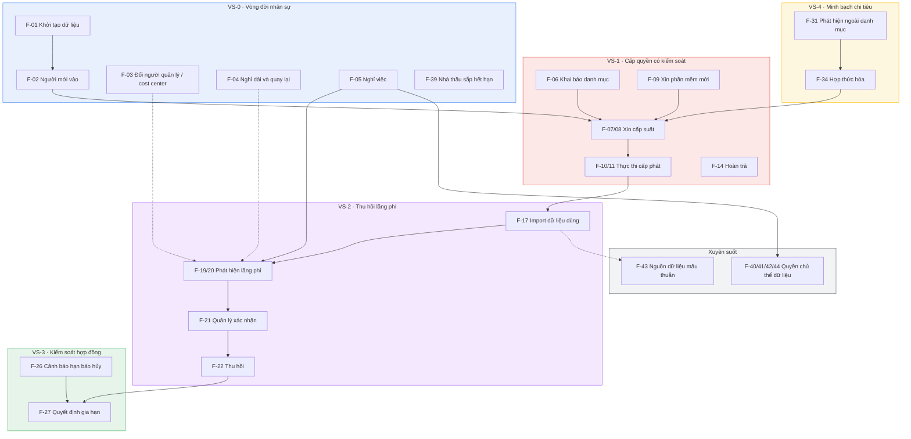

Hai mũi tên đáng chú ý:

- **C4 → D2**: thu hồi suất chỉ thành tiền thật tại kỳ gia hạn. Mắt xích quyết định giá trị của cả hệ thống.
- **E2 → B1**: một ứng dụng ngoài danh mục được hợp thức hóa sẽ quay lại thành yêu cầu mua chính thức. Vòng lặp khép kín, không phải ngõ cụt.

### 1.2. Bảng chốt phạm vi đầy đủ

**✅ Code** = hiện thực đầy đủ · **📐 Thiết kế** = chỉ đặc tả · **❌ Ngoài** = không làm

Cột **MF** cho biết luồng đó nằm trong main flow nào ở mục 1.4 → 1.9.

| Mã       | Luồng                                                                                                       | Thuộc | MF   | Phạm vi            | Chi tiết ở mục |
| -------- | ----------------------------------------------------------------------------------------------------------- | ----- | ---- | ------------------ | -------------- |
| F-01     | Khởi tạo dữ liệu ban đầu cho tổ chức                                                                        | VS-0  | MF-0 | ✅                 | 2.1            |
| F-02     | Nhân viên mới vào                                                                                           | VS-0  | MF-1 | ✅                 | 2.2            |
| F-03     | Nhân viên đổi người quản lý hoặc cost center _(đổi tên ở v0.5)_                                             | VS-0  | MF-1 | ✅                 | 2.3            |
| F-04     | Nhân viên nghỉ dài và quay lại                                                                              | VS-0  | MF-1 | ✅                 | 2.4            |
| F-05     | Nhân viên nghỉ việc                                                                                         | VS-0  | MF-1 | ✅                 | 2.5            |
| F-39     | Nhà thầu, thực tập sinh sắp hết hạn                                                                         | VS-0  | MF-1 | ✅                 | 2.6            |
| F-06     | Khai báo danh mục, gói, hợp đồng, thuê bao                                                                  | VS-1  | MF-0 | ✅                 | 3.1            |
| F-07     | Xin cấp suất — không phát sinh chi phí                                                                      | VS-1  | MF-2 | ✅                 | 3.2            |
| F-08     | Xin cấp suất — có phát sinh chi phí                                                                         | VS-1  | MF-2 | ✅                 | 3.2            |
| F-09     | Xin phần mềm chưa có trong danh mục                                                                         | VS-1  | MF-2 | ✅                 | 3.3            |
| F-10     | Thực thi cấp phát qua kết nối tự động                                                                       | VS-1  | MF-2 | ✅                 | 3.4            |
| F-11     | Thực thi cấp phát thủ công có theo dõi                                                                      | VS-1  | MF-2 | ✅                 | 3.4            |
| F-12     | Xử lý cấp phát thất bại                                                                                     | VS-1  | MF-2 | ✅                 | 3.5            |
| F-13     | Xử lý bước duyệt nghẽn, xung đột lợi ích và xác định lại người duyệt _(v0.6; tới v0.5: ủy quyền phê duyệt)_ | VS-1  | MF-2 | ✅                 | 3.6            |
| F-14     | Hoàn trả suất theo yêu cầu                                                                                  | VS-1  | MF-2 | ✅                 | 3.7            |
| F-15     | Gia hạn quyền có thời hạn                                                                                   | VS-1  | MF-2 | ✅                 | 3.7            |
| F-16     | Đổi gói — nâng hoặc hạ                                                                                      | VS-1  | MF-2 | 📐                 | —              |
| F-17     | Import dữ liệu sử dụng                                                                                      | VS-2  | MF-3 | ✅                 | 4.1            |
| F-18     | Xử lý hàng đợi chưa khớp danh tính                                                                          | VS-2  | MF-3 | ✅                 | 4.2            |
| F-19     | Phát hiện lãng phí nhóm G1, G2                                                                              | VS-2  | MF-3 | ✅                 | 4.3            |
| F-20     | Phát hiện lãng phí nhóm G3, G4                                                                              | VS-2  | MF-3 | ✅                 | 4.3            |
| F-21     | Quản lý xác nhận Giữ / Thu hồi / Miễn trừ                                                                   | VS-2  | MF-3 | ✅                 | 4.4            |
| F-22     | Thu hồi suất sau xác nhận                                                                                   | VS-2  | MF-3 | ✅                 | 4.5            |
| F-23     | Mở lại khuyến nghị khi hết hạn miễn trừ                                                                     | VS-2  | MF-3 | ✅                 | 4.5            |
| F-24     | Rà soát quyền truy cập định kỳ                                                                              | VS-2  | MF-3 | 📐                 | —              |
| F-25     | Phát hiện nhóm G5 — hạ gói theo mức dùng                                                                    | VS-2  | MF-3 | ❌                 | —              |
| F-26     | Cảnh báo trước hạn chót báo hủy                                                                             | VS-3  | MF-4 | ✅                 | 5.1            |
| F-27     | Quyết định gia hạn, giảm số lượng hoặc hủy                                                                  | VS-3  | MF-4 | ✅                 | 5.2            |
| F-28     | Đối soát với nhà cung cấp                                                                                   | VS-3  | MF-4 | ✅                 | 5.3            |
| F-29     | Bảng chi tiêu, tiết kiệm và phân bổ theo cost center _(đổi tên ở v0.5)_                                     | VS-4  | MF-5 | ✅                 | 6.1            |
| F-30     | Dự báo chi phí ba lớp                                                                                       | VS-4  | MF-5 | ✅                 | 6.2            |
| F-31     | Phát hiện phần mềm ngoài danh mục từ sao kê                                                                 | VS-4  | MF-5 | ✅                 | 6.3            |
| F-32     | Phát hiện từ dữ liệu cấp quyền của hệ định danh                                                             | VS-4  | MF-5 | ✅                 | 6.3            |
| F-33     | Phát hiện từ nhật ký truy cập web                                                                           | VS-4  | MF-5 | ❌                 | —              |
| F-34     | Hợp thức hóa ứng dụng vào danh mục                                                                          | VS-4  | MF-5 | ✅                 | 6.4            |
| F-35     | Đối soát hóa đơn với suất và mức sử dụng                                                                    | VS-4  | MF-5 | ✅                 | 6.5            |
| F-36     | Lập và theo dõi ngân sách                                                                                   | VS-4  | MF-5 | ✅ _(📐 tới v0.4)_ | 6.6            |
| F-37     | Quản trị người dùng, vai trò, cấu hình                                                                      | —     | MF-0 | ✅                 | 7.1            |
| F-38     | Nhật ký kiểm toán và giám sát tác vụ nền                                                                    | —     | MF-0 | ✅                 | 7.1            |
| F-40     | Nhân viên xem và xuất dữ liệu của chính mình                                                                | —     | MF-0 | ✅                 | 7.2            |
| F-41     | Xóa dữ liệu hoạt động của người đã nghỉ                                                                     | —     | MF-1 | ✅                 | 7.3            |
| F-42     | Thông báo khi bắt đầu theo dõi một ứng dụng                                                                 | —     | MF-3 | ✅                 | 7.4            |
| F-43     | Xử lý khi các nguồn dữ liệu mâu thuẫn                                                                       | —     | MF-0 | ✅                 | 7.5            |
| F-44     | Xóa dữ liệu quá hạn lưu giữ theo chính sách                                                                 | —     | MF-0 | ✅                 | 7.6            |
| **F-45** | Triển khai và vận hành tiện ích trình duyệt trên thiết bị công ty _(mới ở v0.5)_                            | VS-2  | MF-3 | ✅                 | 7.7            |
| **F-46** | Phát hiện SaaS ngoài danh mục từ bộ thu thập _(mới ở v0.5)_                                                 | VS-4  | MF-5 | ✅                 | 7.8            |
| **F-47** | Xem báo cáo hiệu suất và chất lượng _(mới ở v0.5)_                                                          | VS-4  | MF-5 | ✅                 | 7.9            |
| **F-48** | Agent trên máy công ty _(mới ở v0.5)_                                                                       | VS-2  | MF-3 | 📐                 | 7.10           |

**Tổng: 48 luồng — 43 hiện thực, 3 chỉ đặc tả thiết kế, 2 ngoài phạm vi.**

> 🆕 **Cập nhật 14/09/2026 — v0.5, theo `QĐ-20`, `QĐ-22`, `QĐ-24`:** đếm từng nhóm trên bảng trên — **✅ 43** _(39 cũ + `F-36` + `F-45` + `F-46` + `F-47`)_ · **📐 3** — `F-16`, `F-24`, `F-48` · **❌ 2** — `F-25`, `F-33`. `F-33` **vẫn ngoài phạm vi**: nhật ký truy cập web đầy đủ khác tiện ích trình duyệt lọc theo danh sách cho phép (`F-45`, `F-46`). Hoãn lớp L2 (`QĐ-25`) **không** đổi số luồng — `F-30` vẫn ✅ với L1 và L3. 📁 _Dòng tổng `44 — 39 / 3 / 2` và hai ghi chú dưới là lịch sử._

> 🆕 **`F-44` thêm ngày 09/09/2026.** Trước đó `FR-10.3` _(xóa dữ liệu quá hạn lưu giữ theo chính sách BRD mục 7.5)_ **không có luồng nào phủ**: `F-41` chỉ phủ nhánh sự kiện _nghỉ việc_ của `FR-10.6`, còn nhánh **định kỳ khi nhân viên vẫn đang làm việc** thì không ai nhận. Đã cân nhắc mở rộng `F-41` và **loại**, vì `F-41` là một bước trong vòng đời nhân sự (`MF-1`, `WF-07`) còn `F-44` là **tác vụ vòng đời dữ liệu độc lập**, chạy theo lịch, không gắn với sự kiện nhân sự nào. Nhồi hai thứ vào một mã sẽ làm tên luồng rộng hơn chỗ nó được gọi. **Không đổi chính sách BRD** — `F-44` chỉ hiện thực `FR-10.3` vốn đã có.
>
> ✅ **`F-44` ĐÃ ĐƯỢC PHÊ DUYỆT — `QĐ-14`, nhóm trưởng, 10/09/2026.** Phê duyệt theo nội dung hiện hành tại mục 7.6; giữ `F-44` thuộc `MF-0`, phạm vi `44` — `39 / 3 / 2`, và phân loại không tạo workflow riêng. Không thay đổi nội dung nghiệp vụ `F-44`. Xem `QĐ-14` trong `Decisions/project-decisions.md`.

> 📁 **Lịch sử — tại thời điểm v0.3 (07/09/2026), khi phạm vi còn là 43 luồng.** Khi đó v0.2 và Định nghĩa Phạm vi v1.1 mục 5.2 đều ghi _37 / 5 / 1_; đếm lại trên chính bảng trên cho **38 / 3 / 2**, tổng 43, nên lỗi không lộ ra khi cộng. ✅ **Đã xử lý xong:** Định nghĩa Phạm vi đã sửa ở v1.2 và cập nhật tiếp ngày 09/09/2026. **Con số hiện hành là `44` — `39 / 3 / 2`**, xem dòng tổng ngay trên. Yêu cầu _"cần sửa Định nghĩa Phạm vi v1.1"_ của ghi chú cũ **đã hết hiệu lực**, giữ lại chỉ để truy vết bài học: đối chiếu tổng không thay được đối chiếu từng nhóm.

### 1.3. Ba tầng của tài liệu và cách đọc main flow

| Tầng               | Nội dung                             | Ở đâu             | Dùng khi nào                                                 |
| ------------------ | ------------------------------------ | ----------------- | ------------------------------------------------------------ |
| **L0**             | Một dòng sáu chặng                   | Mục 1.1           | Slide mở đầu, câu trả lời 10 giây                            |
| **L1 · Main flow** | Sáu chuỗi bước end-to-end, thuần chữ | **Mục 1.4 → 1.9** | Giải thích hệ thống chạy thế nào; chương phân tích nghiệp vụ |
| **L2 · Flow con**  | 48 luồng `F-xx` có đủ bảy phần       | Phần 2 → 7        | Viết đặc tả, viết kịch bản kiểm thử, chia việc               |

**Vì sao cần tầng L1.** Bốn mươi tám luồng chi tiết trả lời được câu _"luồng này chạy ra sao"_ nhưng không trả lời được câu _"cái gì nối vào cái gì"_. Người đọc lần đầu — giảng viên hướng dẫn, hội đồng, thành viên mới — cần thấy mạch trước khi thấy chi tiết. Đây cũng là cách phân rã quy trình theo cấp mà các khung công nghiệp dùng chung: một cấp cao đủ ngắn để nhớ, mỗi bước của nó phân rã xuống cấp thấp hơn, và **mỗi phần tử cấp thấp thuộc về đúng một phần tử cấp trên**.

**Ký pháp dùng trong mục 1.4 → 1.9:**

| Ký hiệu       | Nghĩa                                                                          |
| ------------- | ------------------------------------------------------------------------------ |
| `├─` `└─` `│` | Bước tuần tự và nhánh rẽ trong cùng một main flow                              |
| `──>`         | Đi tới bước khác, luồng khác, hoặc main flow khác                              |
| `[F-xx]`      | Bước này được đặc tả chi tiết ở flow con mã `F-xx`                             |
| `(BR-xx.x)`   | Quy tắc nghiệp vụ chi phối bước này                                            |
| `◆`           | Điểm rẽ nhánh do **người** quyết định                                          |
| `⚙`           | Bước do **hệ thống** hoặc tác vụ nền tự chạy, không ai bấm nút                 |
| `⏱`           | Bước có thời hạn xử lý; quá hạn thì nhắc và thông báo — không đổi người (v0.6) |
| `⛔`          | **Cổng chặn** — không đủ điều kiện thì dừng, không đi tiếp                     |
| `⭐`          | Mắt xích tạo ra giá trị lớn nhất, đáng chỉ tay vào khi bảo vệ                  |
| `↺`           | Vòng lặp quay lại một main flow đã đi qua                                      |
| `★ D-x`       | Bước này nằm trong chuỗi demo bắt buộc `D-x`                                   |

> **Cách dùng khi trình bày:** một main flow vừa một slide. Đọc từ trên xuống, dừng lại ở các `⛔` và `⭐` — đó là chỗ thể hiện nhóm hiểu vấn đề, phần còn lại chỉ là trình tự.

---

### 1.4. `MF-0` · Nền móng và quản trị

> **Mục đích:** đưa tổ chức từ chỗ chưa có dữ liệu tới chỗ năm main flow còn lại chạy được.
> **Chạy khi nào:** một lần lúc triển khai; sau đó chạy lại từng phần mỗi khi thêm ứng dụng hoặc thuê bao mới.
> **Không có main flow này thì:** không có main flow nào khác bắt đầu được.

```
BẮT ĐẦU · Tổ chức chưa có dữ liệu trong hệ thống
 │
 ├─ B0.1  QT tạo tài khoản đăng nhập, gán vai trò, cấu hình ........... [F-37]
 │        đồng tiền báo cáo · múi giờ · ngưỡng · thời hạn xử lý
 │        · chính sách lưu giữ · ngưỡng sai số dự báo
 │        └─ ⛔ QT KHÔNG gán suất, KHÔNG duyệt yêu cầu nghiệp vụ (BR-37.1)
 │
 ├─ B0.2  IT nhập file nhân sự ──> dựng cây tổ chức ................... [F-01] B1
 │        ├─ ⛔ thiếu cột đơn vị chịu chi phí ──> CHẶN, không cho tiếp
 │        │      (không có cột này thì toàn bộ báo cáo chi phí vô nghĩa)
 │        └─ thiếu quản lý trực tiếp ──> cho tiếp, dùng người duyệt dự phòng ở gốc
 │
 ├─ B0.3  IT khai báo danh mục · gói · thuê bao · hợp đồng ............ [F-06]
 │        ├─ ⛔ chưa chỉ định Business Owner ──> CHẶN (BR-06.1)
 │        ├─ ◆ ba câu hỏi phân loại: nhắn tin? gọi/họp? hộp thư?
 │        │    └─ CÓ bất kỳ câu nào ──> gắn cờ nhóm dịch vụ liên lạc
 │        │         └─ mặc định KHÔNG thu thập dữ liệu hoạt động (BR-06.2)
 │        │              ──> ứng dụng này chỉ phát hiện được G1, G2 ở MF-3
 │        ├─ ◆ mô hình giá KHÔNG theo đầu người
 │        │    └─ MF-3 không áp dụng; giao diện hiện "không áp dụng",
 │        │       KHÔNG hiện số 0 (BR-06.4)
 │        └─ tự động gia hạn mà thiếu hạn chót báo hủy ──> cảnh báo ──> MF-4
 │
 ├─ B0.4  IT ghi nhận hiện trạng: ai đang giữ suất nào ............... [F-01] B4
 │        ├─ ⛔ chưa xong B0.2 và B0.3 thì KHÔNG cho làm bước này (BR-01.1)
 │        └─ bản ghi ở bước này được phép KHÔNG có yêu cầu nguồn,
 │           nhưng phải đánh dấu là dữ liệu khởi tạo (BR-01.2)
 │
 ├─ B0.5 ⚙ Hệ thống chạy lần đánh giá đầu tiên cho G1 và G2 ──────────> MF-3
 │        └─ ⭐ TỚI ĐÂY HỆ THỐNG ĐÃ TẠO GIÁ TRỊ ĐO ĐƯỢC
 │           mà chưa cần một dòng nhật ký bên ngoài nào: biết ngay bao nhiêu
 │           suất đã mua chưa gán, bao nhiêu suất nằm trong tay người đã nghỉ
 │
 └─ B0.6  (tùy chọn) IT import file nhật ký sử dụng ─────────────────> MF-3
          ├─ ⛔ lần đầu cho một ứng dụng ──> phải thông báo NLĐ trước [F-42]
          └─ (tùy chọn, v0.5) IT đăng ký thiết bị cho tiện ích trình duyệt ── [F-45]
                 ⛔ nhân viên XÁC NHẬN CHỦ ĐỘNG trước, chưa có thì không nhận dữ liệu
                 agent trên máy ...................................... [F-48] 📐

CHẠY NGẦM SUỐT VÒNG ĐỜI HỆ THỐNG — không có điểm bắt đầu, không có điểm kết thúc
 ├─ ⚙ Nhật ký kiểm toán chỉ ghi thêm · giám sát trạng thái tác vụ nền . [F-38]
 │     └─ ⛔ tác vụ nền thất bại phải hiện lên, không im lặng bỏ qua (BR-38.2)
 ├─ NV mở trang "dữ liệu của tôi", yêu cầu xuất dữ liệu ............... [F-40]
 │     └─ ghi thời điểm tiếp nhận và thời điểm hoàn tất (BR-40.2)
 ├─ ⚙ Quét hằng ngày, xóa dữ liệu QUÁ HẠN LƯU GIỮ .................... [F-44]
 │     ├─ hoạt động chi tiết > 6 tháng ──> xóa, kể cả người ĐANG LÀM VIỆC
 │     │      ⛔ đây là nhánh ĐỊNH KỲ, khác nhánh 30 ngày sau nghỉ việc [F-41]
 │     ├─ tổng hợp phi định danh > 24 tháng · bằng chứng discovery từ sao kê,
 │     │      hóa đơn > 24 tháng ──> XÓA THẬT, không phải ngoại lệ (BRD 7.5)
 │     ├─ ⛔ NGOẠI LỆ DUY NHẤT: nhật ký kiểm toán — chỉ ghi thêm (BR-44.3)
 │     ├─ hồ sơ tài chính phân hệ 5.1/5.5 (hợp đồng, hóa đơn thanh toán,
 │     │      thuê bao, bản ghi chi phí) NGOÀI bảng lưu giữ 7.5 ──> job không quét
 │     └─ ghi nhật ký SỐ BẢN GHI ĐÃ XÓA và thời điểm (BR-44.4)
 └─ ⚙ Hai nguồn dữ liệu nói khác nhau ──> sinh bản ghi cho người xử lý  [F-43]
       ├─ ⛔ giữ nguyên CẢ HAI giá trị, không ghi đè (BR-43.1)
       ├─ ⛔ mỗi bản ghi mâu thuẫn phải có người chịu trách nhiệm
       └─ ⛔ mâu thuẫn KHÔNG được tự đóng theo thời gian (BR-43.3)

XONG KHI: bảng điều khiển hiển thị tổng chi phí, tổng số suất,
          và ít nhất MỘT cảnh báo có thật sinh từ dữ liệu vừa nhập.
```

> **Điểm cần nói khi trình bày `MF-0`:** thứ tự `B0.2 → B0.3 → B0.4` không đổi được, và `B0.5` là chỗ chứng minh đề tài khả thi. Nếu hệ thống chỉ có giá trị sau khi lấy được nhật ký từ nhà cung cấp thì nó phụ thuộc vào thứ mà phần lớn doanh nghiệp vừa không mua nổi — đó là rủi ro lớn nhất của phân hệ Usage, và `B0.5` là câu trả lời cho nó.

---

### 1.5. `MF-1` · Vòng đời nhân sự

> **Mục đích:** giữ cho quyền truy cập và chi phí luôn khớp với trạng thái thật của từng con người.
> **Kích hoạt bởi:** IT cập nhật hồ sơ nhân sự, hoặc tác vụ nền quét ngày kết thúc hằng ngày.
> **Vì sao đứng trước `MF-2`:** không có cây tổ chức thì không biết ai duyệt cho ai, và toàn bộ luồng phê duyệt không chạy được.

```
NGƯỜI MỚI VÀO ...................................................... [F-02]
 │  IT tạo hồ sơ: đơn vị chịu chi phí · quản lý · ngày vào  (v0.5 — bỏ phòng ban)
 │   └─ ⛔ chưa có email công việc ──> CHẶN (email là khóa ánh xạ sang NCC)
 │  QL tạo yêu cầu hộ, chọn nhiều ứng dụng cùng lúc ────────────────> MF-2
 │   ├─ tách thành các yêu cầu riêng theo ứng dụng, gộp chung một mã lô
 │   ├─ người yêu cầu và người thụ hưởng là HAI trường khác nhau (BR-02.1)
 │   └─ ⛔ QL tạo hộ thì KHÔNG tự duyệt bước quản lý ──> lên cấp trên (BR-02.2)
 │
 ↓
ĐANG LÀM VIỆC ── trạng thái ổn định, mọi nhánh dưới đây quay về đây hoặc đi ra
 │
 ├─ ◆ ĐỔI NGƯỜI QUẢN LÝ HOẶC COST CENTER ........................... [F-03]
 │   │  IT cập nhật, kèm NGÀY HIỆU LỰC
 │   ├─ ⚙ KHÔNG ghi đè — đóng giai đoạn cũ, mở giai đoạn mới (BR-03.2)
 │   ├─ chi phí trước ngày hiệu lực vẫn thuộc đơn vị cũ ───────────> MF-5
 │   ├─ yêu cầu đang chờ duyệt chuyển sang QL mới ─────────────────> MF-2
 │   │     └─ ⛔ đã tới bước tài chính hoặc bước IT thì KHÔNG chuyển (BR-03.4)
 │   ├─ suất ĐI THEO NGƯỜI; QL mới nhận danh sách để xem lại ──────> MF-3
 │   ├─ ⛔ người này đang là QL của người khác ──> CHẶN tới khi có người kế nhiệm
 │   └─ người này là Business Owner ──> cảnh báo, nhắc chỉ định người thay
 │
 ├─ ◆ NGHỈ DÀI VÀ QUAY LẠI ......................................... [F-04]
 │   │  IT đổi trạng thái, ghi ngày dự kiến quay lại
 │   ├─ ⚙ LOẠI khỏi phạm vi đánh giá lãng phí ────────> MF-3 cổng lọc số 3
 │   ├─ khuyến nghị đang mở ──> TẠM DỪNG, không đóng
 │   ├─ quay lại ──> đưa lại vào phạm vi, nhưng thời gian nghỉ
 │   │     KHÔNG tính vào số ngày không hoạt động (BR-04.1)
 │   └─ ⛔ quá thời hạn dự kiến ──> nhắc IT, hệ thống KHÔNG tự đổi trạng thái
 │
 ├─ ◆ NGƯỜI LÀM CÓ THỜI HẠN SẮP HẾT HẠN ............................ [F-39]
 │   │  ⚙ quét hằng ngày; còn 7 ngày thì báo IT và QL
 │   │  ⛔ quyền cấp cho nhà thầu, freelancer, TTS BẮT BUỘC có ngày kết thúc
 │   ├─ QL chọn gia hạn ──> tạo yêu cầu loại gia hạn ──────> MF-2 B2.1 [F-15]
 │   │     └─ ⛔ gia hạn quá 12 tháng liên tiếp ──> xác nhận thêm (BR-39.4)
 │   │          (dấu hiệu người này thực chất là nhân viên chính thức)
 │   └─ QL không làm gì ──> tới hạn thì vào hàng đợi cần thu hồi ──> MF-3 B3.5
 │         ├─ ⛔ hệ thống KHÔNG tự thu hồi khi tới hạn (BR-39.2)
 │         │      tự thu hồi có thể cắt quyền của người đang làm dở việc
 │         └─ quá hạn chưa xử lý ──> nổi lên bảng điều khiển IT như một mục nợ
 │
 └─ ◆ NGHỈ VIỆC .......................................... [F-05]  ★ D-3
     │  IT chuyển sang "đang bàn giao", đặt ngày làm việc cuối
     │  ⛔ trạng thái đã nghỉ việc BẮT BUỘC có ngày nghỉ (BR-05.3)
     ├─ ⚙ liệt kê toàn bộ suất đang giữ ──> gửi QL kèm hạn xử lý
     ├─ QL xác nhận đã bàn giao dữ liệu trước khi IT thu hồi
     ├─ ⛔ người này là QL của người khác ──> chuyển yêu cầu cho người kế nhiệm
     ├─ ⛔ người này là Business Owner ──> cảnh báo, chỉ định người thay
     ├─ nghỉ đột ngột, không có giai đoạn bàn giao ──> cho chuyển thẳng
     │
     ├─ ⚙ TỚI NGÀY LÀM VIỆC CUỐI
     │    └─ sinh lãng phí nhóm G2 cho MỌI suất còn lại ────────────> MF-3
     │       ├─ ⭐ độ tin cậy TUYỆT ĐỐI, bỏ qua mọi ngưỡng ngày (BR-05.1)
     │       └─ ⛔ G2 KHÔNG cần QL xác nhận ──> thẳng tới IT (BR-05.2)
     │            người đã nghỉ thì không có gì để bàn
     │
     ├─ IT thu hồi hàng loạt ────────────────────────────> MF-3 B3.5 [F-22]
     │    └─ ⛔ bắt buộc GÕ SỐ LƯỢNG để xác nhận + lý do chung (BR-05.4)
     │
     └─ ⚙ SAU 30 NGÀY kể từ ngày làm việc cuối ...................... [F-41]
          ├─ xóa dữ liệu hoạt động chi tiết — ⛔ xóa THẬT, không đánh dấu ẩn
          └─ GIỮ LẠI: dữ liệu tổng hợp phi định danh + nhật ký kiểm toán

XONG KHI: không còn suất nào gắn với người đã nghỉ, số tiết kiệm được ghi vào
          báo cáo, và sau 30 ngày dữ liệu hoạt động chi tiết không còn trong hệ thống.
```

> **`F-05` là kịch bản demo giá trị nhất** — nó vừa là chi phí vừa là lỗ hổng bảo mật, và độ chắc chắn tuyệt đối vì chỉ dùng dữ liệu nội bộ. Không cần xin API của nhà cung cấp nào để chứng minh nó đúng.

---

### 1.6. `MF-2` · Cấp quyền có kiểm soát ★ D-1

> **Mục đích:** làm cho đường chính thức nhanh hơn đường tắt.
> **Kích hoạt bởi:** nhân viên cần một công cụ; hoặc quản lý xin hộ người mới (`MF-1`); hoặc hợp thức hóa một ứng dụng ngoài danh mục (`MF-5`).
> **Đo bằng:** `KPI-2` — thời gian trung bình từ lúc gửi yêu cầu tới lúc có tài khoản.

```
KÍCH HOẠT · NV cần một công cụ
 │
 ├─ ◆ Công cụ đã có trong danh mục đã duyệt chưa?
 │    │
 │    ├─ CHƯA CÓ ──> XIN PHẦN MỀM MỚI ............................ [F-09]
 │    │    ├─ NV khai: tên · trang chủ · mục đích · LOẠI DỮ LIỆU sẽ đưa vào
 │    │    │      (câu hỏi về loại dữ liệu là điểm khác so với F-07)
 │    │    ├─ QL xác nhận nhu cầu nghiệp vụ
 │    │    ├─ ⛔ IT ĐÁNH GIÁ danh mục và rủi ro   ← vai trò 1 của IT
 │    │    │    ├─ đã có công cụ tương đương ──> KHÔNG DUYỆT + gợi ý thay thế
 │    │    │    │     (BR-09.2: đây là kết quả HỢP LỆ và TÍCH CỰC)
 │    │    │    └─ dữ liệu nhạy cảm cao ──> cần ý kiến Business Owner nhóm đó
 │    │    ├─ TC GHI Ý KIẾN NGÂN SÁCH — chỉ khi có chi phí, KHÔNG chặn
 │    │    ├─ ⏱ DC NGƯỜI DUYỆT CHI QUYẾT — kể cả SaaS MIỄN PHÍ (BR-09.4)
 │    │    │     vì thêm một SaaS là thêm một nơi dữ liệu công ty nằm
 │    │    └─ IT THỰC HIỆN: thêm vào danh mục ──> MF-0 B0.3 [F-06] ──┐
 │    │         ⛔ BR-09.1: đánh giá rủi ro và triển khai/cấp phát     │
 │    │            là HAI trách nhiệm IT khác nhau, KHÔNG gộp.         │
 │    │            Đánh giá của IT và ý kiến ngân sách của Tài chính   │
 │    │            chỉ là dữ liệu đầu vào: Tài chính KHÔNG duyệt và    │
 │    │            KHÔNG từ chối yêu cầu mua — chỉ Người duyệt chi     │
 │    │            mới có quyền quyết định cuối cùng. Thiếu đánh giá   │
 │    │            rủi ro thì Người duyệt chi có thể phải quyết định   │
 │    │            chi cho ứng dụng chưa được đánh giá đầy đủ          │
 │    └─ ĐÃ CÓ ────────────────────────────────────────────────────────┤
 │                                                                     │
 ├─ B2.1  NV chọn phần mềm, nhập lý do · đơn vị chịu chi phí ──────────┘
 │        · khoảng thời gian cần dùng
 │        ├─ ⛔ đã có quyền đang hiệu lực cho ứng dụng đó
 │        │      ──> CHẶN ngay từ bước 1, hiện thông tin quyền đang có (BR-07.3)
 │        └─ thời hạn cần dùng > 12 tháng ──> xác nhận thêm (BR-07.4)
 │
 ├─ B2.2 ⚙ HỆ THỐNG HIỆN TRƯỚC KHI GỬI
 │        chi phí quy đổi · chuỗi người duyệt · thời gian dự kiến từng bước
 │        └─ ⛔ BƯỚC NÀY KHÔNG ĐƯỢC BỎ (BR-07.1)
 │              ⭐ biện pháp rẻ nhất để giảm yêu cầu thừa, và là chỗ biến
 │                 thời hạn xử lý từ con số nội bộ thành lời hứa nhìn thấy được
 │
 ├─ B2.3  NV gửi ──> ⚙ CHỐT CỨNG chính sách duyệt vào yêu cầu (BR-07.2)
 │        │   QT sửa chính sách giữa chừng thì yêu cầu đang chạy vẫn theo luật cũ
 │        └─ ◆ còn suất trống không?
 │             ├─ CÒN ──> chính sách không phát sinh chi phí .......... [F-07]
 │             └─ HẾT ──> VẪN CHO GỬI, gắn cờ phát sinh chi phí ....... [F-08]
 │
 ├─ B2.4 ⏱ ◆ QUẢN LÝ TRỰC TIẾP QUYẾT ĐỊNH
 │        │  ⭐ hiển thị kèm các suất người này đang giữ ở phần mềm
 │        │     CÙNG NHÓM CHỨC NĂNG — phát hiện trùng lặp TRƯỚC khi tiêu tiền
 │        │     rẻ hơn nhiều so với phát hiện sau sáu tháng qua báo cáo
 │        ├─ Duyệt ────────────────────────────────────> B2.5
 │        ├─ Từ chối ──> ⛔ BẮT BUỘC có lý do (BR-07.5) ──> KẾT THÚC
 │        ├─ người yêu cầu chính là QL ──> chuyển lên cấp trên một bậc
 │        ├─ không có QL trực tiếp ──> người duyệt dự phòng ở gốc cây,
 │        │      nói rõ cho người yêu cầu biết
 │        ├─ QL vắng mặt hoặc nghẽn ──> ⛔ KHÔNG ủy quyền, KHÔNG đổi người (v0.6 — QĐ-27)
 │        │      ├─ nhắc QL, thông báo cấp trên của QL ..................... [F-13]
 │        │      └─ vượt ngưỡng backlog hoặc quá SLA ──> cảnh báo QT,
 │        │             đưa vào bảng theo dõi nghẽn; QT KHÔNG duyệt thay (BR-13.8)
 │        ├─ QL nghỉ việc hoặc manager_id của NV đổi giữa chừng
 │        │      ──> XÁC ĐỊNH LẠI người duyệt theo cây mới (BR-13.9) ────> MF-1
 │        │      ⛔ đồng hồ thời hạn KHÔNG đặt lại — thời hạn thuộc về BƯỚC (BR-13.2)
 │        ├─ NV rút yêu cầu ──> cho phép nếu chưa tới bước IT thực hiện
 │        └─ ⏱ QUÁ HẠN ──> nhắc → THÔNG BÁO cấp trên (escalate = thông báo, QĐ-28d)
 │               ⛔ KHÔNG BAO GIỜ TỰ DUYỆT, KHÔNG ĐỔI NGƯỜI (BR-07.7)
 │
 ├─ B2.5 ◆ HẾT SUẤT GIỮA LUỒNG?          ← chỉ khi phát sinh chi phí (v0.7 — QĐ-29b)
 │        └─ hết suất ──> ⛔ CHÈN bước duyệt chi vào CHUỖI HIỆN CÓ,
 │              KHÔNG hủy yêu cầu bắt làm lại (BR-07.6)
 │              ⭐ bắt QL duyệt lại thứ họ đã duyệt chính là loại ma sát
 │                 sinh ra Shadow IT
 │        ⛔ TÀI CHÍNH KHÔNG NẰM TRÊN ĐƯỜNG DUYỆT (v0.7 — QĐ-29b)
 │
 ├─ B2.5b ⏱ ◆ DC NGƯỜI DUYỆT CHI QUYẾT    ← chỉ chạy khi phát sinh chi phí (v0.5)
 │        │  SNAPSHOT NGÂN SÁCH cạnh nút quyết: ngân sách · thực chi · cam kết đang giữ
 │        │     · còn lại · đang chờ duyệt · nhu cầu đã được QL xác nhận (FR-3.14)
 │        ├─ Cần thêm thông tin ──> HỎI TÀI CHÍNH (tùy chọn) ─────────> [F-08]
 │        │      bước VẪN của DC · ⛔ SLA KHÔNG dừng, KHÔNG đặt lại (BR-07.9)
 │        │      TC trả lời trong hạn mức / vượt / chưa có — KHÔNG duyệt, KHÔNG chặn
 │        ├─ Duyệt ──> hệ thống tạo KHOẢN CAM KẾT Đang giữ
 │        │      ──> song song: TC GHI NHẬN ngân sách ∥ ───> B2.6 (IT KHÔNG chờ TC)
 │        ├─ Từ chối ──> ⛔ BẮT BUỘC có lý do ──> KẾT THÚC, không tạo cam kết
 │        ├─ DC là người yêu cầu hoặc người thụ hưởng ──> bước duyệt chi TẠO THẲNG
 │        │      cho người thay thế khi xung đột, QT cấu hình TRƯỚC (BR-13.10, QĐ-28c)
 │        │      ⛔ không ai trong luồng tự chọn · không ứng viên song song
 │        │      chưa cấu hình ──> chờ có kiểm soát (SoD-7, FR-3.12)
 │        ├─ QL trực tiếp CHÍNH LÀ DC ──> vẫn HAI bước riêng, nhật ký gắn cờ (BR-07.8)
 │        ├─ DC vắng mặt hoặc nghẽn ──> KHÔNG dùng người thay thế; nhắc,
 │        │      cảnh báo QT (BR-13.8) — người thay thế CHỈ dành cho xung đột
 │        └─ ⏱ QUÁ HẠN ──> nhắc → thông báo, ⛔ KHÔNG TỰ DUYỆT, KHÔNG ĐỔI NGƯỜI
 │              ⚠️ một DC duy nhất có thể thành nút thắt — đo riêng trong KPI-2
 │
 ├─ B2.6 ⏱ IT THỰC THI CẤP PHÁT           ← vai trò 2 của IT
 │        │  kiểm tra còn chỗ trong MỘT giao dịch có khóa
 │        ├─ ◆ ứng dụng có kết nối tự động không?
 │        │    ├─ CÓ ──> hệ thống gọi nhà cung cấp ................... [F-10]
 │        │    │      bằng chứng lưu nhật ký: nội dung phản hồi của nhà cung cấp
 │        │    │      ├─ ⛔ phản hồi API thành công KHÔNG PHẢI là hoàn tất.
 │        │    │      │     Với nhà cung cấp mà thao tác cấp quyền chỉ tạo
 │        │    │      │     LỜI MỜI CHỜ CHẤP NHẬN, phải ĐỐI SOÁT danh sách
 │        │    │      │     thành viên rồi mới ghi hoàn tất (BRD 6.3, QĐ-03)
 │        │    │      ├─ đang chờ chấp nhận ──> giữ tác vụ ở trạng thái
 │        │    │      │     "chờ chấp nhận"; suất VẪN CHIẾM CHỖ (BR-10.4)
 │        │    │      │     ──> kết thúc riêng: "đã gửi lời mời, CHƯA hoàn tất"
 │        │    │      └─ ⭐ đây là vế đối xứng của BR-10.1 cho kênh tự động:
 │        │    │            không coi phản hồi máy là bằng chứng đã cấp xong
 │        │    └─ KHÔNG ──> sinh việc làm tay có theo dõi ............ [F-11]
 │        │           ├─ IT bấm "tôi đang xử lý" ──> thao tác trên trang
 │        │           │    quản trị NCC ──> bấm "đã hoàn tất"
 │        │           └─ ⛔ hệ thống KHÔNG tự chuyển sang hoàn tất;
 │        │                phải có TÊN NGƯỜI THẬT xác nhận (BR-10.1)
 │        │    ⭐ hai kênh dùng CHUNG một hàng đợi và một cách đo (BR-10.3)
 │        │       — phần lớn phần mềm doanh nghiệp VN không có kết nối
 │        │         tự động, nên kênh thủ công quan trọng hơn kênh tự động
 │        │
 │        ├─ ⛔ quyền VẪN CHIẾM CHỖ suốt thời gian đang thực hiện,
 │        │      kể cả khi thất bại (BR-10.4) — nhả chỗ thì người khác
 │        │      được gán, và khi thử lại thành công sẽ vượt hạn mức
 │        │
 │        └─ THẤT BẠI ──> phân bốn loại lỗi ......................... [F-12]
 │             ├─ tạm thời ──> thử lại tự động, tối đa 6 lần, giãn cách tăng
 │             ├─ vĩnh viễn ──> ⛔ KHÔNG thử lại, báo người thật ngay (BR-12.1)
 │             ├─ xác thực ──> không thử lại, báo QT
 │             ├─ hết hạn mức ──> đẩy sang nhánh mua thêm suất ──> B2.5
 │             ├─ mua hoặc cấp phát thất bại hẳn sau khi đã duyệt chi
 │             │     ──> ⛔ GIẢI PHÓNG khoản cam kết (BRD FR-5.8)
 │             ├─ ⛔ việc thất bại KHÔNG biến mất khỏi tầm nhìn (BR-12.2)
 │             ├─ ⛔ quá 7 ngày chưa xử lý ──> nổi lên bảng điều khiển
 │             └─ NGƯỜI YÊU CẦU CŨNG ĐƯỢC BÁO, để họ không chờ vô ích
 │
 ├─ B2.7 ✅ NV CÓ QUYỀN — thông báo kèm hướng dẫn truy cập
 │        └─ ⚙ ghi thời gian xử lý toàn trình, TÁCH THEO TỪNG BƯỚC ──> KPI-2
 │
 └─ SAU KHI CÓ QUYỀN
      ├─ quyền vào tầm ngắm của phân hệ phát hiện ─────────────────> MF-3
      ├─ NV tự trả, hoặc QL xác nhận không còn nhu cầu ............. [F-14]
      │     ├─ ⛔ không cho thu hồi "không lý do" — mọi thu hồi phải gắn
      │     │      với một nguồn quyết định truy được (BR-14.1)
      │     └─ ⛔ suất về trạng thái trống CHỈ SAU KHI tài khoản thật đã
      │            bị xóa, hoặc IT xác nhận không cần xóa (BR-14.2)
      ├─ quyền có thời hạn, sắp hết ──> gia hạn .................... [F-15]
      │     └─ ⛔ gia hạn tạo bản ghi quyết định MỚI, không sửa ngày
      │            trên bản ghi cũ
      └─ đổi gói nâng hoặc hạ ..................... [F-16] 📐 chỉ đặc tả

XONG KHI: người yêu cầu nhận được thông báo có quyền truy cập, và hệ thống
          ghi được tổng thời gian từ lúc gửi tới lúc xong, tách theo từng bước.
```

---

### 1.7. `MF-3` · Thu hồi lãng phí có bằng chứng ★ D-2

> **Mục đích:** đưa ra khuyến nghị thu hồi mà người nhận **phản biện được**, không phải phải tin.
> **Kích hoạt bởi:** tác vụ nền chạy theo lịch (G1, G2 hằng ngày; G3, G4 hằng tuần); hoặc IT import file nhật ký.
> **Đo bằng:** `KPI-3` tỷ lệ suất đang hoạt động trên tổng suất đã mua · `KPI-5` tỷ lệ khuyến nghị bị bác bỏ · `TC-2` số báo động giả bằng 0.

```
HAI ĐƯỜNG VÀO — khác nhau ở chỗ CÓ CẦN DỮ LIỆU NGOÀI KHÔNG

ĐƯỜNG A · chỉ dùng dữ liệu nội bộ      │ ĐƯỜNG B · cần nhật ký sử dụng
 ⚙ chạy hằng ngày ............ [F-19]  │  B3.1 IT import file .......... [F-17]
 │                                     │   │
 │ G1 · suất đã mua CHƯA GÁN cho ai    │   ├─ ⛔ LẦN ĐẦU cho một ứng dụng
 │      ──> nhắm vào THUÊ BAO,         │   │    ──> phải thông báo NLĐ TRƯỚC,
 │          không nhắm vào người;      │   │        chặn trước bước ghi .. [F-42]
 │          hành động = giảm số lượng  │   │    ├─ nội dung tối thiểu: ứng dụng
 │          tại kỳ gia hạn (BR-19.1)   │   │    │   nào · dữ liệu gì · mục đích
 │      độ chắc chắn: TUYỆT ĐỐI        │   │    │   · lưu bao lâu · xem lại ở đâu
 │                                     │   │    ├─ ⛔ KHÔNG cho ghi dữ liệu
 │ G2 · suất của người ĐÃ NGHỈ VIỆC    │   │    │      trước khi thông báo được
 │      <──────────────── MF-1 [F-05]  │   │    │      ghi nhận (BR-42.2)
 │      ⛔ bỏ qua MỌI ngưỡng ngày      │   │    └─ ⭐ đây KHÔNG phải tính năng
 │      ⛔ KHÔNG cần QL xác nhận,      │   │         tùy chọn mà là ĐIỀU KIỆN để
 │         chuyển thẳng IT (BR-05.2)   │   │         việc thu thập hợp pháp
 │      độ chắc chắn: TUYỆT ĐỐI        │   │
 │                                     │   ├─ ⛔ ứng dụng nhóm dịch vụ liên lạc
 │                                     │   │    ──> KHÔNG import, trừ khi đã bật
 │                                     │   │        có chủ đích (BR-17.8)
 │                                     │   │
 │                                     │   ├─ KHUNG IMPORT SÁU BƯỚC
 │                                     │   │   Tải lên (tính mã băm)
 │                                     │   │    ──> Đọc theo mẫu cấu hình
 │                                     │   │    ──> Khớp danh tính
 │                                     │   │    ──> ⛔ XEM TRƯỚC, bắt buộc xác nhận
 │                                     │   │    ──> Ghi dữ liệu
 │                                     │   │    ──> Tính lại tình trạng sử dụng
 │                                     │   │   └─ hủy ở bước xem trước
 │                                     │   │       ──> KHÔNG ghi một dòng nào
 │                                     │   │
 │                                     │   ├─ ⛔ KHOẢNG THỜI GIAN BAO PHỦ bắt buộc
 │                                     │   │    khai; file không tự chứa thì IT
 │                                     │   │    khai tay, không cho bỏ qua (BR-17.1)
 │                                     │   ├─ ⛔ mẫu cấu hình bắt buộc khai NGUỒN
 │                                     │   │    HIỂU "HOẠT ĐỘNG" LÀ GÌ (BR-17.5)
 │                                     │   │    Atlassian tính "xem một trang từ
 │                                     │   │    2 giây" là hoạt động — nhận con số
 │                                     │   │    mà không biết nghĩa của nó thì
 │                                     │   │    mọi người đều "đang dùng"
 │                                     │   ├─ ⛔ sự kiện chỉ mang tính XÁC THỰC
 │                                     │   │    KHÔNG tính là hoạt động (BR-17.4)
 │                                     │   ├─ ⭐ dữ liệu hoạt động gắn vào QUYỀN
 │                                     │   │    ĐANG HIỆU LỰC TẠI NGÀY XẢY RA
 │                                     │   │    SỰ KIỆN, KHÔNG gắn vào con người
 │                                     │   │    (BR-17.6)  <─────── MF-2 B2.7
 │                                     │   │
 │                                     │   └─ định danh chưa khớp ──> hàng đợi [F-18]
 │                                     │        ├─ giữ CẢ chuỗi gốc lẫn bản đã
 │                                     │        │    chuẩn hóa (BR-18.2)
 │                                     │        ├─ khớp thủ công bắt buộc ghi
 │                                     │        │    tên người xác nhận
 │                                     │        ├─ ⛔ một định danh khớp về hai
 │                                     │        │    nhân viên ──> CHẶN (BR-18.4)
 │                                     │        └─ ⛔ bản ghi chưa khớp KHÔNG BAO
 │                                     │             GIỜ dùng để kết luận (BR-18.1)
 │                                     │
 │                                     │  G3 · đã gán nhưng CHƯA TỪNG dùng — cao
 │                                     │  G4 · từng dùng nhưng ĐÃ NGỪNG — trung bình
 │                                     │  ⚙ chạy hằng tuần ............ [F-20]
 └───────────────────┬─────────────────┘
                     ↓
 B3.2 ⚙ TÁM CỔNG LỌC — chạy TRƯỚC mọi đánh giá
      1 gói tính theo đầu người?      5 cấp sau khi dữ liệu bắt đầu?
      2 tài khoản máy móc?            6 nguồn quá cũ?
      3 đang nghỉ dài?  <── MF-1      7 đang miễn trừ?
      4 vừa cấp, còn ân hạn?          8 đã có khuyến nghị đang mở?
      ├─ không qua cổng ──> bỏ qua, GHI LÝ DO (không im lặng bỏ)
      └─ ⛔ cổng 6 làm CẢ LẦN CHẠY DỪNG cho ứng dụng đó, báo dữ liệu lỗi thời
             — KHÔNG âm thầm chạy với dữ liệu cũ (BR-20.4)
      ⭐ tám cổng lọc quan trọng ngang với chính thuật toán phát hiện:
         chứng minh hệ thống KHÔNG BÁO ĐỘNG GIẢ có giá trị hơn chứng minh
         nó tìm ra nhiều (TC-2)
                     ↓
 B3.3 ⚙ SINH KHUYẾN NGHỊ
      ├─ ⛔ bằng chứng là BẢN CHỤP tại thời điểm sinh, không phải con trỏ
      │      tới nguồn (BR-20.3) — nguồn bị import đè thì khuyến nghị cũ
      │      sẽ hiển thị căn cứ của dữ liệu mới
      ├─ ngưỡng phân giải theo thứ tự:
      │      từng ứng dụng > tổ chức > mặc định hệ thống  (v0.5 — bỏ phòng ban)
      ├─ mức THEO DÕI     · 30–59 ngày ──> ⛔ CHỈ hiện bảng điều khiển
      │                                       CỦA IT, KHÔNG hiện màn hình QL,
      │                                       KHÔNG gửi thông báo (BR-20.5;
      │                                       FR-4.12 chốt ở QĐ-09)
      ├─ mức CẦN XEM XÉT  · từ 60 ngày ──> gửi QL
      └─ mức CẦN XỬ LÝ    · từ 90 ngày, hoặc chưa từng dùng, hoặc đã nghỉ
                                        ──> gửi QL và IT
      ⭐ nếu mọi phát hiện đều gửi thư, quản lý sẽ lọc vào thùng rác trong tuần đầu
                     ↓
 B3.4 ◆ QUẢN LÝ XÁC NHẬN ......................................... [F-21]
      │  gộp theo tuần, nhóm theo NHÂN VIÊN (không nhóm theo ứng dụng)
      │  hiển thị đầy đủ: số ngày không hoạt động · tên nguồn · ngày import
      │  · độ dài cửa sổ bao phủ · phương pháp khớp danh tính
      │  · định nghĩa "hoạt động" của nguồn · mức tin cậy
      │  · HAI con số tiết kiệm TÁCH BIỆT
      │  ├─ ⛔ QL KHÔNG xem được nhật ký hoạt động thô (BR-21.1)
      │  └─ ⭐ BẮT BUỘC nêu rõ giới hạn dữ liệu (BR-21.4), ví dụ
      │        "nguồn chỉ bao phủ 30 ngày — chưa đủ để kết luận chưa từng dùng"
      │        một khuyến nghị sai trình bày với giọng chắc nịch sẽ làm hỏng
      │        niềm tin vào cả trăm khuyến nghị đúng còn lại
      │
      ├─ GIỮ LẠI ──> đóng lần này, ⛔ chu kỳ sau VẪN HỎI LẠI (BR-21.5)
      │                "giữ lại" là phát biểu CÓ THỜI HẠN
      ├─ THU HỒI ──────────────────────────────────> B3.5
      ├─ TẠM MIỄN TRỪ ──> ⛔ BẮT BUỘC ngày hết hạn, tối đa 12 tháng
      │      chặn ở CẢ BA TẦNG: giao diện, dịch vụ, cơ sở dữ liệu (BR-21.3)
      │      └─ ⚙ báo trước 7 ngày · tới hạn ──> mở lại khuyến nghị .. [F-23]
      ├─ chọn hàng loạt ──> ⛔ bắt buộc MỘT lý do chung, không để trống
      └─ ⚙ khuyến nghị bị dữ liệu mới phủ định ──> đóng IM LẶNG (BR-21.6)
             số lượng khuyến nghị bị phủ định là một chỉ số chất lượng
             của rule engine ──> KPI-5

      ↑ G2 KHÔNG đi qua bước B3.4 — chuyển thẳng từ B3.3 xuống B3.5
                     ↓
 B3.5  IT THU HỒI ................................................ [F-22]
      ├─ thực hiện qua kênh tự động hoặc thủ công ──> dùng lại MF-2 B2.6
      ├─ IT có quyền KHÔNG đồng ý với xác nhận của QL, nhưng phải ghi lý do
      └─ ⛔ suất về trạng thái trống CHỈ SAU KHI tài khoản thật đã bị xóa
                     ↓
 B3.6 💰 GHI NHẬN TIẾT KIỆM — ⛔ ĐÚNG LOẠI, KHÔNG BAO GIỜ CỘNG HAI LOẠI
      ├─ THỰC HIỆN NGAY  · chỉ > 0 khi gói theo tháng, hoặc hợp đồng
      │                     cho giảm giữa kỳ (BR-20.2)
      └─ TẠI KỲ GIA HẠN  · mọi trường hợp còn lại ──────────────────> MF-4
            ⭐ ĐÂY LÀ MẮT XÍCH QUYẾT ĐỊNH GIÁ TRỊ CỦA CẢ HỆ THỐNG
               một danh sách khuyến nghị tách rời khỏi lịch hợp đồng
               thì phát hiện đúng nhưng không bao giờ thành tiền
      └─ ⛔ số ghi vào báo cáo là số THỰC TẾ THU ĐƯỢC, không phải số
             ước tính ban đầu (BR-22.2)

CHẠY SONG SONG
 ├─ Rà soát quyền truy cập định kỳ .............. [F-24] 📐 chỉ đặc tả
 └─ Phát hiện G5 hạ gói theo mức dùng ........... [F-25] ❌ ngoài phạm vi

XONG KHI: mỗi khuyến nghị kèm đủ căn cứ để người nhận phản biện được,
          và không có khuyến nghị nào sinh ra từ dữ liệu chưa đủ điều kiện.
```

---

### 1.8. `MF-4` · Kiểm soát hợp đồng và kỳ gia hạn

> **Mục đích:** không bao giờ bị gia hạn ngoài ý muốn, và biến khuyến nghị của `MF-3` thành tiền thật.
> **Kích hoạt bởi:** tác vụ chạy hằng ngày quét hạn chót báo hủy.
> **Đo bằng:** `KPI-4` — số thuê bao gia hạn mà không có quyết định được ghi nhận.

```
 ⚙ TÁC VỤ CHẠY HẰNG NGÀY — quét hạn chót báo hủy của mọi thuê bao
 │  ⛔ BR-26.1: đếm từ HẠN CHÓT BÁO HỦY, KHÔNG đếm từ ngày gia hạn
 │     cảnh báo trước ngày gia hạn 7 ngày trong khi hợp đồng buộc báo hủy
 │     trước 30 ngày là MỘT CẢNH BÁO VÔ DỤNG ĐƯỢC GỬI ĐÚNG GIỜ
 │
 ├─ ◆ dữ liệu về hạn báo hủy đang ở tình trạng nào?
 │    ├─ có rõ ràng ──> cảnh báo theo mốc đó
 │    ├─ chỉ có số ngày báo trước trong hợp đồng ──> suy ra,
 │    │     ⛔ GHI RÕ là số liệu suy ra, chưa xác nhận
 │    └─ không có cả hai, mà hợp đồng tự gia hạn
 │          ──> ⛔ KHÔNG SUY ĐOÁN. Hiện cảnh báo thiếu dữ liệu
 │
 ├─ B4.1  T−15 ngày ──> báo IT · TC · Business Owner ............... [F-26]
 ├─ B4.2  T−7 ngày  ──> báo thêm QT
 │        └─ ⭐ MỖI MỐC CẢNH BÁO HIỂN THỊ KÈM CÁC KHUYẾN NGHỊ LÃNG PHÍ
 │              ĐANG MỞ CỦA CHÍNH THUÊ BAO ĐÓ (BR-26.2)  <────────── MF-3
 │              "gói này sắp gia hạn, và đang có 6 suất không ai dùng"
 │              — đây là nơi hai phân hệ gặp nhau và tạo ra giá trị lớn nhất
 │                của toàn hệ thống: thông tin ĐỦ ĐỂ RA QUYẾT ĐỊNH giảm số lượng
 │
 ├─ B4.3 ◆ DC QUYẾT ĐỊNH TRÊN SNAPSHOT NGÂN SÁCH ................... [F-27]
 │        │  Người duyệt chi (DC) quyết, hệ thống hiển thị snapshot ngân sách,
 │        │  số liệu sử dụng và so sánh số suất kỳ này với kỳ trước;
 │        │  DC có thể HỎI TC — KHÔNG chặn; TC ghi nhận SAU quyết định (QĐ-29b)
 │        ├─ GIA HẠN NGUYÊN TRẠNG ──> tạo BẢN GHI THUÊ BAO MỚI,
 │        │     bản ghi cũ chuyển sang hết hạn
 │        │     ⛔ KHÔNG sửa đè ngày trên bản ghi cũ (BR-27.1) — sửa đè
 │        │        sẽ xóa mất lịch sử giá và số lượng
 │        ├─ GIA HẠN + GIẢM SỐ LƯỢNG ──> 💰 GHI NHẬN TIẾT KIỆM THẬT ──> MF-5
 │        │     ⛔ chỉ ghi nhận khi số suất kỳ mới THẤP HƠN kỳ cũ (BR-27.2)
 │        ├─ HỦY DỊCH VỤ ──> gửi thông báo hủy trước hạn
 │        │     └─ ⛔ kiểm tra còn quyền nào đang hiệu lực không,
 │        │            cảnh báo người đang dùng (BR-27.3)
 │        └─ ⛔ KHÔNG AI XỬ LÝ ──> tự động gia hạn,
 │               GHI NHẬN LÀ MỘT SỰ CỐ ──────────────────────────> KPI-4
 │
 ├─ B4.4 ⚙ chuyển các quyền đang hiệu lực sang thuê bao mới,
 │        trong CÙNG MỘT giao dịch
 │
 └─ CHẠY SONG SONG · ⚙ ĐỐI SOÁT VỚI NHÀ CUNG CẤP .................. [F-28]
      │  ⛔ CHỈ đối soát ứng dụng CÓ kết nối tự động; ứng dụng không có
      │     kết nối KHÔNG sinh sai lệch giả (BR-28.1)
      ├─ hệ thống CÓ, nhà cung cấp KHÔNG có ──> mức TRUNG BÌNH
      │     người dùng không truy cập được dù đã được duyệt
      │     ──> IT cấp lại, hoặc xác nhận không cần
      ├─ nhà cung cấp CÓ, hệ thống KHÔNG BIẾT ──> ⚠ MỨC RẤT CAO
      │     ⭐ "CÓ NGƯỜI ĐƯỢC CẤP QUYỀN NGOÀI QUY TRÌNH"
      │     ──> IT điều tra ──> hợp thức hóa ──> MF-5 B5.6, hoặc thu hồi ──> MF-3
      └─ ⛔ hệ thống KHÔNG tự sửa để hai bên khớp nhau (BR-28.2) ──> [F-43]
             tự đồng bộ cho khớp là xóa mất chính bằng chứng của vấn đề

XONG KHI: mọi thuê bao có tự động gia hạn đều có một quyết định được ghi nhận
          TRƯỚC hạn báo hủy; và mọi sai lệch đều có quyết định của người thật.
```

---

### 1.9. `MF-5` · Minh bạch chi tiêu và phát hiện ngoài danh mục ★ D-4

> **Mục đích:** Tài chính trả lời được _"khoản này của ai, phục vụ việc gì"_, và bộ phận CNTT thấy được thứ đang tồn tại ngoài hệ thống.
> **Kích hoạt bởi:** nhánh 1 luôn sẵn sàng, không có điểm bắt đầu; nhánh 2 bắt đầu khi có file sao kê hoặc dữ liệu cấp quyền.
> **Đo bằng:** `KPI-1` — tỷ lệ chi tiêu nằm trong danh mục đã duyệt.

```
NHÁNH 1 · BẢNG CHI TIÊU — luôn sẵn sàng, không có điểm bắt đầu
 │
 ├─ B5.1  Phân bổ chi phí theo cost center và cây người phụ trách .. [F-29]
 │   ├─ ⭐ gói theo đầu người ──> quy về cost center của nhân viên
 │   │     TẠI THỜI ĐIỂM PHÁT SINH, không phải cost center hiện tại (BR-29.3)
 │   │     <──────────────────────────────── MF-1 B "đổi người quản lý / cost center"
 │   │     bỏ ràng buộc này thì báo cáo tháng trước sẽ đổi số mỗi lần
 │   │     ai đó đổi cost center
 │   ├─ gói cố định và gói dùng chung ──> chia theo tỷ lệ khai ở cấp thuê bao
 │   ├─ ⛔ luôn hiển thị CƠ SỞ GHI NHẬN đang xem: theo kỳ hay theo dòng tiền
 │   │     (BR-29.2) — không để người dùng đọc một con số mà không biết nó là gì
 │   ├─ mọi số tiền theo đồng tiền báo cáo; di chuột hiện nguyên tệ + tỷ giá
 │   ├─ hiển thị THỜI ĐIỂM DỮ LIỆU CẬP NHẬT GẦN NHẤT; chỉ gọi là thời gian
 │   │     thực khi nguồn thực sự hỗ trợ (BR-29.5)
 │   ├─ ⭐ cột "CHI PHÍ TRÊN MỖI SUẤT ĐANG HOẠT ĐỘNG"  <──────────── MF-3
 │   │     không phải trên mỗi suất ĐÃ MUA — đây là con số tài chính quan tâm
 │   │     nhất mà hầu như không hệ thống nào hiển thị: nó cho thấy ngay
 │   │     ứng dụng nào đang trả tiền cho không khí
 │   └─ mọi con số BẤM ĐƯỢC để xem căn cứ tính
 │
 └─ B5.2  Dự báo chi phí ba lớp ................................... [F-30]
     ├─ L1 · chi phí ĐÃ CAM KẾT ──> công thức xác định từ hợp đồng
     │     ⛔ KHÔNG dùng mô hình thống kê cho lớp này (BR-30.1) — dùng sẽ
     │        cho kết quả KÉM CHÍNH XÁC HƠN đọc thẳng hợp đồng
     ├─ L2 · biến động theo mức tiêu thụ ──> ⛔ QUA CỔNG KIỂM CHỨNG
     │     ├─ < 12 tháng dữ liệu ──> "chưa đủ dữ liệu lịch sử để dự báo
     │     │      có kiểm chứng"
     │     └─ sai số kiểm chứng lùi > ngưỡng (mặc định 20%)
     │            ──> ⛔ ẨN dự báo mô hình, chỉ hiện khoảng kịch bản,
     │                NÊU RÕ LÝ DO ẨN
     ├─ L3 · phụ thuộc quyết định ──> ba kịch bản theo giả định người dùng nhập
     └─ ⛔ KHÔNG hiển thị con số dự báo TRẦN TRỤI trong bất kỳ trường hợp nào
            luôn kèm bốn thứ: khoảng dữ liệu · giả định · sai số đo được
            · thời điểm tính (BR-30.2, BR-30.3)

NHÁNH 2 · PHÁT HIỆN NGOÀI DANH MỤC — có điểm bắt đầu rõ ràng
 │
 ├─ B5.3  Nguồn bằng chứng
 │   ├─ TC import sao kê, danh sách hóa đơn ...................... [F-31]
 │   ├─ IT import dữ liệu cấp quyền của hệ định danh ............. [F-32]
 │   └─ nhật ký truy cập web, proxy, CASB ....... [F-33] ❌ NGOÀI PHẠM VI
 │        ba lý do: vướng khung pháp lý · không có hạ tầng kiểm chứng
 │        · giá trị không tương xứng rủi ro
 │
 ├─ B5.4 ⚙ Chuẩn hóa mô tả giao dịch về tên nhà cung cấp
 │   │    ⛔ mức tin cậy tính TỪ PHƯƠNG PHÁP KHỚP, không lấy con số
 │   │       do mô hình tự khai
 │   ├─ khớp chính xác từ điển ....... CAO         ──> tự động chuẩn hóa
 │   ├─ khớp theo mẫu ................ KHÁ         ──> tự động, có thể xem lại
 │   ├─ khớp mờ ...................... TRUNG BÌNH  ──> hàng đợi xem lại
 │   └─ gợi ý bởi mô hình ngôn ngữ ... THẤP        ──> ⛔ BẮT BUỘC người xác nhận
 │   └─ ⛔ lưu CẢ giá trị thô LẪN giá trị đã chuẩn hóa, kèm phương pháp khớp,
 │          để giải trình được (BR-31.4)
 │
 ├─ B5.5 ⚙ Đối chiếu với danh mục đã duyệt ──> sinh bản ghi "cần xem xét"
 │   ├─ ⛔ đây KHÔNG PHẢI kết luận vi phạm — là "CÓ DẤU HIỆU một phần mềm
 │   │      chưa nằm trong danh mục", chờ người xem xét (BR-31.1)
 │   ├─ ⛔ mỗi nhà cung cấp chỉ có MỘT bản ghi đang mở; xuất hiện lại thì
 │   │      cập nhật lần thấy gần nhất và số lần (BR-31.2)
 │   └─ phân tầng rủi ro theo: mức nhạy cảm dữ liệu · số nhân viên liên quan
 │          · ứng dụng có hỗ trợ đăng nhập tập trung không
 │
 ├─ B5.6 ◆ IT XỬ LÝ — hỏi QL bối cảnh nghiệp vụ nếu liên quan nhiều người dùng
 │   │
 │   ├─ BÁO NHẦM ──> đóng; ⛔ xuất hiện lại thì MỞ LẠI (BR-31.3)
 │   │
 │   ├─ CHƯA DUYỆT ──> thu hồi, hướng người dùng sang công cụ sẵn có
 │   │
 │   └─ ĐÃ DUYỆT = HỢP THỨC HÓA ................................. [F-34]
 │         ⭐ BR-34.1: đây là KẾT CỤC BÌNH THƯỜNG VÀ TÍCH CỰC, không phải
 │            ngoại lệ — Shadow IT thường là tín hiệu bộ công cụ đã duyệt
 │            còn thiếu
 │         ├─ khai báo đầy đủ vào danh mục ────────────> MF-0 B0.3 [F-06]
 │         │     Business Owner · mức nhạy cảm · ba câu hỏi phân loại
 │         ├─ tạo yêu cầu mua chính thức để hợp thức hóa chi phí
 │         │     đang phát sinh ───────────────────────> MF-2 B2.1
 │         └─ người đang dùng ──> ghi nhận thành quyền chính thức,
 │               ⛔ KHÔNG bắt xin lại từ đầu (BR-34.2)
 │         ↺ VÒNG LẶP KHÉP KÍN — không phải ngõ cụt
 │
 ├─ B5.7  Đối soát hóa đơn ...................................... [F-35]
 │   │  ghép dòng hóa đơn về thuê bao tương ứng
 │   ├─ hiện BA con số cạnh nhau: trên hóa đơn · khai trong thuê bao
 │   │      · đang thực sự dùng
 │   ├─ ⛔ hệ thống KHÔNG tự sửa thuê bao theo hóa đơn (BR-35.1) ──> [F-43]
 │   └─ chênh lệch phải quy được về MỘT trong ba nguyên nhân:
 │          đã mua thêm chưa cập nhật · nhà cung cấp tính sai · dữ liệu nội bộ sai
 │
 ├─ Lập và theo dõi ngân sách, khoản cam kết .... [F-36] ✅ (📐 tới v0.4)
 ├─ Phát hiện SaaS ngoài danh mục từ bộ thu thập . [F-46] ✅ (mới ở v0.5)
 └─ Báo cáo hiệu suất và chất lượng ............. [F-47] ✅ (mới ở v0.5)

XONG KHI: mọi con số trên bảng bấm được để xem căn cứ tính; mỗi bản ghi phát
          hiện có người chịu trách nhiệm và một quyết định cuối, không tự đóng.
```

---

### 1.10. Bảng truy vết Main flow ↔ Flow con

Mỗi mã `F-xx` có **đúng một** main flow chủ sở hữu. Cột cuối ghi các main flow khác **gọi tới** luồng đó — đây là chỗ để kiểm tra không có luồng nào mồ côi và không có luồng nào bị hai chỗ cùng nhận.

| Main flow                       | Luồng con thuộc về                                                         | Số luồng               | Được gọi từ                                                      | Chuỗi demo |
| ------------------------------- | -------------------------------------------------------------------------- | ---------------------- | ---------------------------------------------------------------- | ---------- |
| **MF-0** Nền móng và quản trị   | F-01, F-06, F-37, F-38, F-40, F-43, **F-44**                               | 7                      | MF-2 gọi F-06 · MF-5 gọi F-06 · MF-4 gọi F-43 · MF-5 gọi F-43    | —          |
| **MF-1** Vòng đời nhân sự       | F-02, F-03, F-04, F-05, F-39, F-41                                         | 6                      | —                                                                | **D-3**    |
| **MF-2** Cấp quyền có kiểm soát | F-07, F-08, F-09, F-10, F-11, F-12, F-13, F-14, F-15, F-16                 | 10                     | MF-1 gọi F-15 · MF-3 dùng lại B2.6 (F-10, F-11)                  | **D-1**    |
| **MF-3** Thu hồi lãng phí       | F-17, F-18, F-19, F-20, F-21, F-22, F-23, F-24, F-25, F-42, **F-45, F-48** | 12                     | MF-0 gọi F-42 · MF-1 gọi F-22                                    | **D-2**    |
| **MF-4** Kiểm soát hợp đồng     | F-26, F-27, F-28                                                           | 3                      | —                                                                | —          |
| **MF-5** Minh bạch chi tiêu     | F-29, F-30, F-31, F-32, F-33, F-34, F-35, F-36, **F-46, F-47**             | 10                     | MF-4 gọi B5.6 khi hợp thức hóa · **MF-4 gọi `F-35`** qua `WF-16` | **D-4**    |
|                                 | **Tổng**                                                                   | **48** _(44 tới v0.4)_ |                                                                  | 4 chuỗi    |

**Đối chiếu ngược — mỗi main flow phục vụ pain point nào:**

| Main flow | Pain point xử lý                            | Năng lực   | Chỉ số đo                    |
| --------- | ------------------------------------------- | ---------- | ---------------------------- |
| MF-0      | _(nền móng — không xử lý PP nào trực tiếp)_ | —          | điều kiện để mọi KPI đo được |
| MF-1      | PP-1 nhóm G2                                | NL-2       | KPI-3                        |
| MF-2      | PP-5 quy trình chậm, PP-4 gián tiếp         | NL-3       | KPI-2                        |
| MF-3      | PP-1 ghost seat                             | NL-2, NL-4 | KPI-3, KPI-5, TC-2           |
| MF-4      | PP-2 auto-renewal                           | NL-1       | KPI-4                        |
| MF-5      | PP-3 bất đối xứng, PP-4 Shadow IT           | NL-5, NL-6 | KPI-1                        |

> Không có main flow nào không gắn với một pain point, trừ `MF-0` — và `MF-0` không gắn được là **đúng**, vì nó là điều kiện tiên quyết chứ không phải năng lực nghiệp vụ. Nếu buộc `MF-0` phải gắn với một pain point thì đó là dấu hiệu bảng đang được ép cho đẹp.

### 1.11. Năm mắt xích nối giữa các main flow

Đây là phần mà 48 luồng chi tiết **không thể hiện được**, và là lý do tầng main flow tồn tại. Mỗi mắt xích dưới đây là một chỗ mà bỏ đi thì hệ thống vẫn chạy, vẫn không báo lỗi, chỉ **mất tác dụng**.

| #     | Mắt xích                                                     | Từ → Tới                                 | Vì sao đây là chỗ chết người                                                                                                                                                                                                                                                                                |
| ----- | ------------------------------------------------------------ | ---------------------------------------- | ----------------------------------------------------------------------------------------------------------------------------------------------------------------------------------------------------------------------------------------------------------------------------------------------------------- |
| **1** | ⭐ Khuyến nghị thu hồi → kỳ gia hạn                          | `MF-3` B3.6 → `MF-4` B4.2                | Với hợp đồng cam kết theo năm, thu hồi suất giữa kỳ **không tiết kiệm được đồng nào**. Tiền chỉ thật khi giảm số lượng tại ngày gia hạn. Một danh sách khuyến nghị tách rời khỏi lịch hợp đồng là phát hiện đúng nhưng không bao giờ thành tiền — đây là lý do nhiều nỗ lực tối ưu license không đi tới đâu |
| **2** | Nhật ký hoạt động neo vào **quyền**, không neo vào **người** | `MF-2` B2.7 → `MF-3` B3.1                | `BR-17.6`. Một người có thể được cấp suất, trả lại, rồi được cấp lại — ba lần cấp quyền riêng biệt. Neo vào người thì lần cấp mới thừa hưởng lịch sử lần cũ và **không bao giờ** bị phát hiện. Lỗi này không gây báo lỗi, không hiện trong nhật ký, chỉ làm phân hệ âm thầm mất tác dụng                    |
| **3** | Đơn vị chịu chi phí lấy **tại thời điểm phát sinh**          | `MF-1` F-03 → `MF-5` B5.1                | `BR-29.3`. Lấy đơn vị hiện tại thì báo cáo tháng trước đổi số mỗi lần có người đổi cost center, và mọi báo cáo đã phát hành thành vô nghĩa                                                                                                                                                                  |
| **4** | Hợp thức hóa quay lại thành yêu cầu mua                      | `MF-5` B5.6 → `MF-2` B2.1 và `MF-0` B0.3 | Vòng lặp khép kín. Nếu phát hiện Shadow IT chỉ dừng ở việc "ghi nhận rồi để đó", phân hệ trở thành một danh sách buộc tội không dẫn tới hành động nào                                                                                                                                                       |
| **5** | Thông báo phải đi **trước** dữ liệu                          | `MF-0` B0.6 → `MF-3` `F-42`              | `BR-42.1`. Đây không phải tính năng tùy chọn mà là **điều kiện để việc thu thập dữ liệu hợp pháp**. Bỏ nó thì cả phân hệ phát hiện mất cơ sở                                                                                                                                                                |

---

## 2. VS-0 — Vòng đời nhân sự

_Thuộc `MF-1`, trừ `F-01` thuộc `MF-0`. Xem mạch tổng ở mục 1.5._

### 2.1. F-01 · Khởi tạo dữ liệu ban đầu

|                    |                                                                                                  |
| ------------------ | ------------------------------------------------------------------------------------------------ |
| **Mục đích**       | Đưa doanh nghiệp từ trạng thái chưa có dữ liệu tới trạng thái hệ thống tạo được cảnh báo có thật |
| **Kích hoạt bởi**  | Lần đầu triển khai                                                                               |
| **Tiền điều kiện** | Có một tài khoản quản trị hệ thống đã tạo; tổ chức đã cấu hình đồng tiền báo cáo và múi giờ      |

**Các bước:**

| #   | Ai  | Làm gì                                                                                                                                                     | Hệ thống phản hồi                                                                                              |
| --- | --- | ---------------------------------------------------------------------------------------------------------------------------------------------------------- | -------------------------------------------------------------------------------------------------------------- |
| 1   | IT  | Nhập file nhân sự: mã, họ tên, email công việc, đơn vị chịu chi phí, quản lý trực tiếp, ngày vào _(v0.5 — cột phòng ban nếu có chỉ lưu làm nhãn hiển thị)_ | Dựng cây tổ chức; báo số nhân viên không xác định được quản lý                                                 |
| 2   | IT  | Khai báo từng ứng dụng đang dùng                                                                                                                           | Yêu cầu điền người sở hữu nghiệp vụ và mức nhạy cảm dữ liệu; hỏi ứng dụng có thuộc nhóm dịch vụ liên lạc không |
| 3   | IT  | Nhập hợp đồng, gói, số suất đã mua, kỳ hạn, **hạn chót báo hủy**                                                                                           | Cảnh báo nếu thuê bao tự động gia hạn mà thiếu hạn báo hủy                                                     |
| 4   | IT  | Ghi nhận hiện trạng ai đang giữ suất nào                                                                                                                   | Tính ngay số suất trống; đánh dấu các bản ghi này là dữ liệu khởi tạo                                          |
| 5   | HT  | —                                                                                                                                                          | **Chạy lần đánh giá đầu tiên cho nhóm G1 và G2**, hiển thị kết quả lên bảng điều khiển                         |
| 6   | IT  | Import file nhật ký sử dụng nếu lấy được                                                                                                                   | Nêu rõ nguồn này phát hiện được nhóm lãng phí nào                                                              |

**Quy tắc nghiệp vụ:**

| Mã      | Nội dung                                                                                                                                              |
| ------- | ----------------------------------------------------------------------------------------------------------------------------------------------------- |
| BR-01.1 | Không cho sang bước 4 nếu bước 1 và bước 3 chưa xong — không thể gán suất khi chưa có người và chưa có thuê bao                                       |
| BR-01.2 | Bản ghi cấp quyền nhập ở bước 4 được phép **không có** yêu cầu nguồn, và phải đánh dấu là dữ liệu khởi tạo để phân biệt với bản ghi sinh từ quy trình |
| BR-01.3 | Mọi bước dùng chung khung import sáu bước, gồm cả bước xem trước bắt buộc — không có luồng nhập liệu riêng cho khởi tạo                               |
| BR-01.4 | Trạng thái rỗng của mọi màn hình chính phải dẫn về đúng bước khởi tạo còn thiếu, không hiển thị trang trắng                                           |

**Ngoại lệ:**

| Tình huống                                             | Xử lý                                                                     |
| ------------------------------------------------------ | ------------------------------------------------------------------------- |
| Nhân viên không xác định được quản lý trực tiếp        | Cho phép tiếp tục; những người này sẽ dùng người duyệt dự phòng ở gốc cây |
| Không có dữ liệu hợp đồng, chỉ biết đang dùng ứng dụng | Cho tạo thuê bao ở trạng thái nháp, đánh dấu thiếu dữ liệu tài chính      |
| File nhân sự thiếu cột đơn vị chịu chi phí             | Chặn — không có cột này thì toàn bộ báo cáo chi phí vô nghĩa              |

> **Điểm cần nhấn:** sau **bước 5**, hệ thống đã tạo giá trị đo được mà **chưa cần một dòng nhật ký bên ngoài nào**. Nó biết ngay bao nhiêu suất đã mua chưa gán, và bao nhiêu suất còn nằm trong tay người đã nghỉ. Bước 6 chỉ mở khóa thêm hai nhóm lãng phí tinh vi hơn. Điều này quan trọng vì nó cho thấy hệ thống **không phụ thuộc hoàn toàn** vào việc lấy được nhật ký từ nhà cung cấp — vốn là rủi ro lớn nhất của phân hệ Usage.

**Xong khi:** bảng điều khiển hiển thị được tổng chi phí phần mềm, tổng số suất, và **ít nhất một cảnh báo có thật** sinh từ dữ liệu vừa nhập.

---

### 2.2. F-02 · Nhân viên mới vào

|                    |                                                            |
| ------------------ | ---------------------------------------------------------- |
| **Mục đích**       | Người mới có đủ công cụ trong ngày đầu, không phải chờ     |
| **Kích hoạt bởi**  | IT thêm nhân viên mới, hoặc quản lý tạo yêu cầu onboarding |
| **Tiền điều kiện** | Đã có cây tổ chức và danh mục ứng dụng                     |

**Các bước:**

| #   | Ai  | Làm gì                                                                                            | Hệ thống phản hồi                                                      |
| --- | --- | ------------------------------------------------------------------------------------------------- | ---------------------------------------------------------------------- |
| 1   | IT  | Tạo hồ sơ nhân viên, gán đơn vị chịu chi phí, quản lý trực tiếp, ngày vào _(v0.5 — bỏ phòng ban)_ | Tạo bản ghi quan hệ tổ chức có hiệu lực từ ngày vào                    |
| 2   | QL  | Tạo yêu cầu hộ cho nhân viên mới, chọn nhiều ứng dụng cùng lúc                                    | Tách thành các yêu cầu riêng theo từng ứng dụng, gộp chung một mã lô   |
| 3   | HT  | —                                                                                                 | Mỗi yêu cầu chạy luồng phê duyệt riêng theo chính sách của ứng dụng đó |
| 4   | IT  | Xử lý các yêu cầu đã duyệt                                                                        | Gộp hiển thị theo người để IT làm một lượt                             |

**Quy tắc nghiệp vụ:**

| Mã      | Nội dung                                                                                                                            |
| ------- | ----------------------------------------------------------------------------------------------------------------------------------- |
| BR-02.1 | Quản lý được tạo yêu cầu hộ, nhưng **người thụ hưởng vẫn là nhân viên mới** — hai trường người yêu cầu và người thụ hưởng khác nhau |
| BR-02.2 | Quản lý tạo hộ thì **không tự duyệt bước quản lý** của chính yêu cầu đó; yêu cầu chuyển lên cấp trên                                |
| BR-02.3 | Yêu cầu cho người chưa tới ngày vào làm được phép tạo trước, nhưng ngày hiệu lực của quyền không sớm hơn ngày vào                   |

**Ngoại lệ:** nhân viên mới chưa có email công việc → chặn bước 2, vì email là khóa ánh xạ chính sang nhà cung cấp.

**Xong khi:** nhân viên đăng nhập được vào toàn bộ ứng dụng đã duyệt trong ngày làm việc đầu tiên, và mỗi quyền đều truy được về một yêu cầu.

---

### 2.3. F-03 · Nhân viên đổi người quản lý hoặc cost center

> **Đổi tên ở v0.5 — `QĐ-23`.** Tên cũ _"Nhân viên chuyển phòng ban"_. Hệ thống không còn quản lý phòng ban; mã `F-03` **giữ nguyên** vì BRD, Context Diagram và Business Workflows đang trích. Nội dung luồng không đổi bản chất: vẫn là thay đổi quan hệ tổ chức có ngày hiệu lực.

|                    |                                                          |
| ------------------ | -------------------------------------------------------- |
| **Mục đích**       | Giữ cho chi phí được quy đúng đơn vị theo từng thời điểm |
| **Kích hoạt bởi**  | IT cập nhật quan hệ tổ chức                              |
| **Tiền điều kiện** | Nhân viên đang ở trạng thái đang làm việc                |

**Các bước:**

| #   | Ai  | Làm gì                                                                  | Hệ thống phản hồi                                                                  |
| --- | --- | ----------------------------------------------------------------------- | ---------------------------------------------------------------------------------- |
| 1   | IT  | Cập nhật đơn vị chịu chi phí và/hoặc quản lý mới, kèm **ngày hiệu lực** | **Không ghi đè** dữ liệu cũ — đóng giai đoạn cũ, mở giai đoạn mới                  |
| 2   | HT  | —                                                                       | Chi phí trước ngày hiệu lực vẫn thuộc đơn vị cũ; từ ngày hiệu lực thuộc đơn vị mới |
| 3   | HT  | —                                                                       | Chuyển các yêu cầu đang chờ duyệt sang quản lý mới, thông báo cả hai người         |
| 4   | HT  | —                                                                       | Lập danh sách suất người này đang giữ, gửi quản lý mới xem lại                     |

**Quy tắc nghiệp vụ:**

| Mã      | Nội dung                                                                                                                                             |
| ------- | ---------------------------------------------------------------------------------------------------------------------------------------------------- |
| BR-03.1 | Ngày hiệu lực được phép đặt trong quá khứ, nhưng phải cảnh báo là sẽ làm thay đổi báo cáo chi phí đã phát hành                                       |
| BR-03.2 | Các giai đoạn quan hệ tổ chức của cùng một nhân viên **không được chồng lấn** nhau                                                                   |
| BR-03.3 | Suất **đi theo người**; chỉ đơn vị chịu chi phí thay đổi. Nhưng quản lý mới nhận danh sách để xem lại                                                |
| BR-03.4 | Yêu cầu đã tới bước duyệt chi hoặc bước IT thì **không** chuyển approver — giữ nguyên để không mất tính liên tục của quyết định _(sửa ở v0.5, v0.7)_ |

**Ngoại lệ:**

| Tình huống                                           | Xử lý                                                                 |
| ---------------------------------------------------- | --------------------------------------------------------------------- |
| Người này đang là quản lý của người khác             | Chặn cho tới khi chỉ định người kế nhiệm cho các nhân viên trực thuộc |
| Người này là người sở hữu nghiệp vụ của một ứng dụng | Cảnh báo, cho phép tiếp tục nhưng nhắc chỉ định người thay            |

**Xong khi:** báo cáo chi phí của tháng trước ngày đổi vẫn hiển thị cost center cũ, tháng sau hiển thị cost center mới, và báo cáo theo cây người phụ trách phản ánh đúng người quản lý tại từng thời điểm.

---

### 2.4. F-04 · Nhân viên nghỉ dài và quay lại

|                   |                                                                 |
| ----------------- | --------------------------------------------------------------- |
| **Mục đích**      | Không sinh khuyến nghị thu hồi sai với người đang nghỉ phép dài |
| **Kích hoạt bởi** | IT cập nhật trạng thái sang nghỉ dài, và sau đó quay lại        |

| #   | Ai  | Làm gì                                                  | Hệ thống phản hồi                                                                             |
| --- | --- | ------------------------------------------------------- | --------------------------------------------------------------------------------------------- |
| 1   | IT  | Đổi trạng thái sang nghỉ dài, ghi ngày dự kiến quay lại | **Loại nhân viên khỏi phạm vi đánh giá lãng phí** kể từ thời điểm này                         |
| 2   | HT  | —                                                       | Các khuyến nghị đang mở của người này chuyển sang trạng thái tạm dừng, không đóng             |
| 3   | IT  | Đổi trạng thái về đang làm việc khi người đó quay lại   | Đưa lại vào phạm vi đánh giá, nhưng **thời gian nghỉ không tính vào số ngày không hoạt động** |

**Quy tắc nghiệp vụ:**

| Mã      | Nội dung                                                                                                                            |
| ------- | ----------------------------------------------------------------------------------------------------------------------------------- |
| BR-04.1 | Số ngày không hoạt động tính bằng tổng ngày trừ đi khoảng thời gian nghỉ dài — nếu không, người vừa nghỉ ba tháng về sẽ bị báo ngay |
| BR-04.2 | Trạng thái nghỉ dài do IT cập nhật tay; hệ thống **không** tích hợp hệ thống nhân sự                                                |
| BR-04.3 | Nghỉ dài quá thời hạn dự kiến mà chưa cập nhật thì hệ thống nhắc IT, không tự đổi trạng thái                                        |

**Xong khi:** người vừa quay lại sau kỳ nghỉ dài không xuất hiện trong hàng đợi khuyến nghị trong vòng thời gian ân hạn.

---

### 2.5. F-05 · Nhân viên nghỉ việc

**Đây là kịch bản demo giá trị nhất** — vừa là chi phí vừa là lỗ hổng bảo mật, và độ chắc chắn tuyệt đối vì chỉ dùng dữ liệu nội bộ.

|                   |                                                      |
| ----------------- | ---------------------------------------------------- |
| **Mục đích**      | Không để người đã rời công ty còn giữ quyền truy cập |
| **Kích hoạt bởi** | IT chuyển trạng thái sang đang bàn giao              |

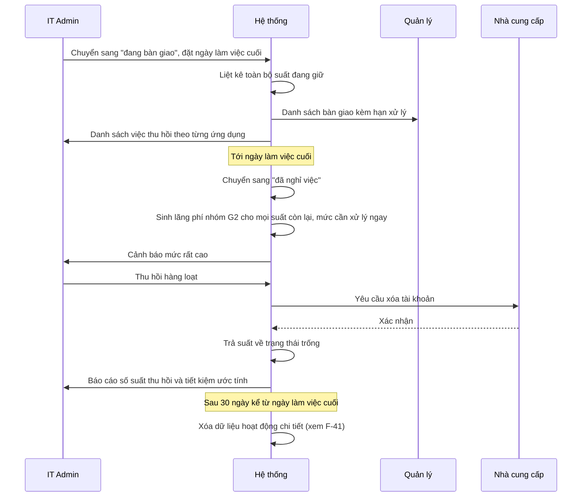

**Quy tắc nghiệp vụ:**

| Mã      | Nội dung                                                                                                                                 |
| ------- | ---------------------------------------------------------------------------------------------------------------------------------------- |
| BR-05.1 | Khuyến nghị nhóm G2 có mức độ tin cậy tuyệt đối và mức xử lý cao nhất, **bỏ qua mọi ngưỡng ngày**                                        |
| BR-05.2 | G2 **không cần** quản lý xác nhận — chuyển thẳng cho IT thực hiện. Người đã nghỉ thì không có gì để bàn                                  |
| BR-05.3 | Trạng thái đã nghỉ việc bắt buộc có ngày nghỉ; không cho để trống                                                                        |
| BR-05.4 | Thu hồi hàng loạt yêu cầu **gõ số lượng để xác nhận** và nhập lý do chung                                                                |
| BR-05.5 | Dữ liệu hoạt động chi tiết bị xóa sau 30 ngày kể từ ngày làm việc cuối; dữ liệu tổng hợp phi định danh và nhật ký kiểm toán được giữ lại |

**Ngoại lệ:**

| Tình huống                                           | Xử lý                                                                 |
| ---------------------------------------------------- | --------------------------------------------------------------------- |
| Nhà cung cấp không xóa được tự động                  | Sinh việc làm tay cho IT, vẫn nằm trong cùng hàng đợi, không biến mất |
| Có dữ liệu cần bàn giao trước khi xóa tài khoản      | Quản lý xác nhận đã bàn giao trước khi IT thu hồi                     |
| Người này là quản lý của người khác                  | Chuyển các yêu cầu đang chờ sang người kế nhiệm, không để treo        |
| Người này là người sở hữu nghiệp vụ của một ứng dụng | Cảnh báo IT chỉ định người thay thế, không để trống                   |
| Nghỉ việc đột ngột, không có giai đoạn bàn giao      | Cho chuyển thẳng sang đã nghỉ; hệ thống sinh G2 ngay                  |

**Xong khi:** không còn suất nào gắn với người đã nghỉ, số tiết kiệm được ghi vào báo cáo, và sau 30 ngày dữ liệu hoạt động chi tiết của người đó không còn trong hệ thống.

---

### 2.6. F-39 · Nhà thầu và thực tập sinh sắp hết hạn

|                    |                                                                    |
| ------------------ | ------------------------------------------------------------------ |
| **Mục đích**       | Không để quyền của người làm có thời hạn tồn tại quá ngày kết thúc |
| **Kích hoạt bởi**  | Tác vụ chạy hằng ngày quét ngày kết thúc dự kiến                   |
| **Tiền điều kiện** | Bản ghi cấp quyền có ngày kết thúc dự kiến                         |

| #   | Ai  | Làm gì                                          | Hệ thống phản hồi                                                            |
| --- | --- | ----------------------------------------------- | ---------------------------------------------------------------------------- |
| 1   | HT  | Quét mọi quyền có ngày kết thúc dự kiến         | Lọc những bản ghi còn 7 ngày là hết hạn                                      |
| 2   | HT  | —                                               | Thông báo IT và quản lý trực tiếp, kèm hai lựa chọn: gia hạn hoặc để hết hạn |
| 3   | QL  | Chọn gia hạn có thời hạn mới, hoặc không làm gì | Gia hạn thì tạo yêu cầu loại gia hạn; không làm gì thì tiếp tục đếm          |
| 4   | HT  | Tới ngày hết hạn mà chưa gia hạn                | Đưa quyền vào hàng đợi cần thu hồi, **không tự thu hồi**                     |
| 5   | IT  | Thu hồi                                         | Chạy tiếp theo F-22                                                          |

**Quy tắc nghiệp vụ:**

| Mã      | Nội dung                                                                                                     |
| ------- | ------------------------------------------------------------------------------------------------------------ |
| BR-39.1 | Quyền cấp cho nhà thầu, freelancer, thực tập sinh **bắt buộc** có ngày kết thúc dự kiến — không cho để trống |
| BR-39.2 | Hệ thống **không tự thu hồi** khi tới hạn. Tự thu hồi có thể cắt quyền của người đang làm dở việc            |
| BR-39.3 | Quá hạn mà chưa xử lý thì nổi lên bảng điều khiển IT như một mục nợ, không im lặng                           |
| BR-39.4 | Gia hạn quá 12 tháng liên tiếp phải có xác nhận thêm — dấu hiệu người này thực chất là nhân viên chính thức  |

**Xong khi:** không có quyền nào của người làm có thời hạn tồn tại quá 7 ngày sau ngày kết thúc mà không có quyết định được ghi nhận.

---

## 3. VS-1 — Cấp quyền có kiểm soát

_Thuộc `MF-2`, trừ `F-06` thuộc `MF-0`. Xem mạch tổng ở mục 1.6._

### 3.1. F-06 · Khai báo danh mục, gói, hợp đồng, thuê bao

|                   |                                                 |
| ----------------- | ----------------------------------------------- |
| **Mục đích**      | Dựng dữ liệu nền để các luồng khác chạy được    |
| **Kích hoạt bởi** | IT thêm ứng dụng mới, hoặc hợp thức hóa từ F-34 |

| #   | Ai  | Làm gì                                                                                                        | Hệ thống phản hồi                                                |
| --- | --- | ------------------------------------------------------------------------------------------------------------- | ---------------------------------------------------------------- |
| 1   | IT  | Khai báo ứng dụng: tên, nhà cung cấp, tên miền, mức nhạy cảm dữ liệu, người sở hữu nghiệp vụ                  | Gợi ý nhà cung cấp từ từ điển dùng chung                         |
| 2   | IT  | Trả lời ba câu hỏi phân loại: có nhắn tin người-với-người không, có gọi hoặc họp không, có phải hộp thư không | Nếu có bất kỳ câu nào → **gắn cờ nhóm dịch vụ liên lạc**         |
| 3   | IT  | Khai báo gói, kèm **mô hình giá**                                                                             | Mô hình giá quyết định các phân hệ sau có áp dụng được hay không |
| 4   | IT  | Khai báo thuê bao: số suất, đơn giá, kỳ hạn, **hạn chót báo hủy**, cờ tự động gia hạn, cờ cho giảm giữa kỳ    | Cảnh báo nếu tự động gia hạn mà thiếu hạn báo hủy                |
| 5   | IT  | Đính kèm hợp đồng và hóa đơn gốc                                                                              | Lưu có kiểm soát truy cập, không để công khai                    |

**Quy tắc nghiệp vụ:**

| Mã      | Nội dung                                                                                                                                                         |
| ------- | ---------------------------------------------------------------------------------------------------------------------------------------------------------------- |
| BR-06.1 | Người sở hữu nghiệp vụ **bắt buộc** và phải là người đang làm việc                                                                                               |
| BR-06.2 | Cờ nhóm dịch vụ liên lạc quyết định chế độ xử lý dữ liệu: nhóm này **mặc định không thu thập dữ liệu hoạt động**, chỉ dùng danh sách thành viên                  |
| BR-06.3 | Bình luận trong tài liệu, ghi chú trong công cụ quản lý công việc, nhận xét trên bản thiết kế **không** tính là nhắn tin                                         |
| BR-06.4 | Mô hình giá không phải theo đầu người thì các phân hệ phát hiện lãng phí và đếm suất **không áp dụng** — giao diện hiển thị "không áp dụng", không hiển thị số 0 |
| BR-06.5 | Bật thu thập dữ liệu hoạt động cho nhóm liên lạc cần xác nhận của quản trị hệ thống, ghi nhật ký kiểm toán kèm lý do                                             |

**Ngoại lệ:** ứng dụng không có trong từ điển nhà cung cấp → cho khai báo tự do, đồng thời đề xuất bổ sung vào từ điển.

**Xong khi:** ứng dụng xuất hiện trong danh mục để nhân viên chọn được ở F-07, và lịch cảnh báo gia hạn đã có mốc.

---

### 3.2. F-07 và F-08 · Xin cấp suất

Hai luồng chỉ khác nhau ở chỗ F-08 có thêm **bước duyệt chi của Người duyệt chi** vì phát sinh chi phí; Tài chính **không** nằm trên đường duyệt — chỉ trả lời khi Người duyệt chi hỏi và ghi nhận ngân sách **sau** khi đã duyệt. _(Viết lại ở v0.7 — `QĐ-29b`. v0.5 → v0.6: Tài chính ghi ý kiến trước Người duyệt chi. Tới v0.4, Tài chính là người duyệt chi phí.)_

|                    |                                                                               |
| ------------------ | ----------------------------------------------------------------------------- |
| **Mục đích**       | Làm cho đường chính thức nhanh hơn đường tắt                                  |
| **Kích hoạt bởi**  | Nhân viên gửi yêu cầu, hoặc quản lý gửi hộ                                    |
| **Tiền điều kiện** | Nhân viên đang làm việc hoặc nghỉ dài; ứng dụng đang hoạt động trong danh mục |

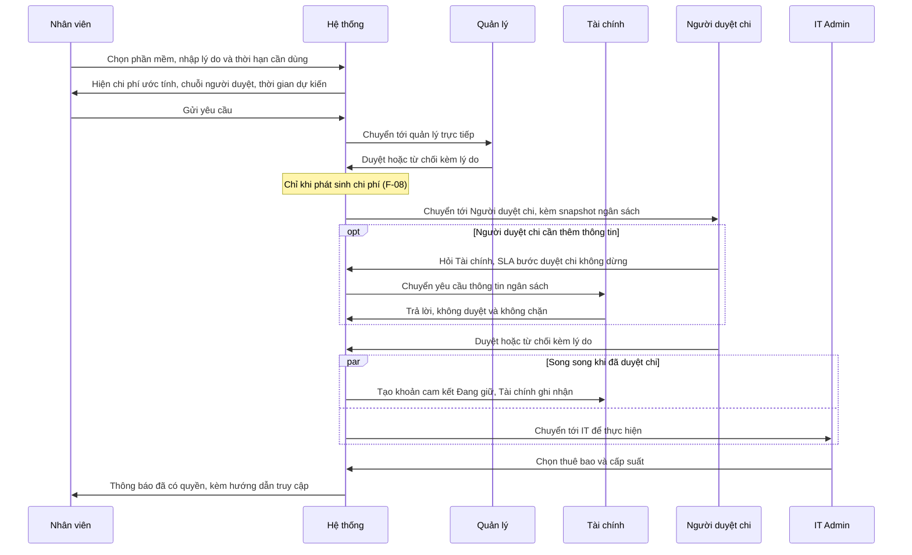

**Các bước chi tiết:**

| #   | Ai      | Làm gì                                                                                                                    | Hệ thống phản hồi                                                                                                                                                                                                              |
| --- | ------- | ------------------------------------------------------------------------------------------------------------------------- | ------------------------------------------------------------------------------------------------------------------------------------------------------------------------------------------------------------------------------ |
| 1   | NV      | Chọn phần mềm từ danh mục đã duyệt                                                                                        | Hiện ngay tình trạng: còn suất, hết suất, hoặc không áp dụng                                                                                                                                                                   |
| 2   | NV      | Nhập lý do nghiệp vụ, đơn vị chịu chi phí, khoảng thời gian cần dùng                                                      | Mặc định đơn vị theo quan hệ tổ chức hiện hành                                                                                                                                                                                 |
| 3   | HT      | —                                                                                                                         | **Hiện chi phí quy đổi và chuỗi người duyệt kèm thời gian dự kiến, trước khi gửi**                                                                                                                                             |
| 4   | NV      | Gửi                                                                                                                       | Chọn chính sách duyệt, **chốt cứng** chính sách đó vào yêu cầu, sinh toàn bộ bước, đặt thời hạn từng bước                                                                                                                      |
| 5   | QL      | Xem và quyết định                                                                                                         | Hiển thị kèm **các suất người này đang giữ ở phần mềm cùng nhóm chức năng**                                                                                                                                                    |
| 6   | DC      | **Duyệt chi hoặc từ chối kèm lý do** _(chỉ F-08)_                                                                         | Hiển thị **snapshot ngân sách**: ngân sách kỳ · thực chi · khoản cam kết đang giữ · còn lại · đang chờ duyệt của cost center, cùng nhu cầu đã được quản lý xác nhận. Chưa có ngân sách thì ghi rõ, không hiện 0 _(sửa ở v0.7)_ |
| 6b  | TC      | _(tùy chọn, chỉ khi Người duyệt chi hỏi)_ **Trả lời yêu cầu thông tin**: Trong hạn mức · Vượt hạn mức · Chưa có ngân sách | Bước duyệt chi **vẫn** của Người duyệt chi; SLA **không** dừng; câu trả lời **không chặn** _(mới ở v0.7)_                                                                                                                      |
| 8   | HT + TC | Hệ thống tạo **khoản cam kết**; Tài chính **ghi nhận ngân sách chính thức** _(chỉ F-08, song song với bước 9)_            | Khoản cam kết ở trạng thái _Đang giữ_, gắn đúng yêu cầu này. Ghi _Vượt hạn mức_/_Chưa có ngân sách_ ⟹ thông báo Người duyệt chi, **không** hoàn tác, **không** dừng cấp phát _(sửa ở v0.7)_                                    |
| 9   | IT      | Chọn thuê bao và cấp suất                                                                                                 | Kiểm tra còn chỗ trong một giao dịch có khóa                                                                                                                                                                                   |
| 10  | HT      | —                                                                                                                         | Thông báo, ghi nhật ký, tính thời gian xử lý toàn trình **tách theo từng bước**                                                                                                                                                |

**Quy tắc nghiệp vụ:**

| Mã       | Nội dung                                                                                                                                                                                                                                                                                                                                                                                                                           |
| -------- | ---------------------------------------------------------------------------------------------------------------------------------------------------------------------------------------------------------------------------------------------------------------------------------------------------------------------------------------------------------------------------------------------------------------------------------- |
| BR-07.1  | Bước 3 **không được bỏ**. Người yêu cầu phải nhìn thấy con số và thời gian dự kiến trước khi gửi — biện pháp rẻ nhất để giảm yêu cầu thừa                                                                                                                                                                                                                                                                                          |
| BR-07.2  | Chính sách duyệt được **chốt cứng tại thời điểm gửi**. Nếu quản trị hệ thống sửa chính sách giữa chừng, yêu cầu đang chạy vẫn theo luật cũ. _(v0.6 — phân phạm vi với `QĐ-28d`)_ Thứ được chốt là **nhánh và chuỗi loại bước**; **người cụ thể** giữ một bước đang chờ vẫn được xác định lại khi có sự kiện dữ liệu theo `BR-13.9`                                                                                                 |
| BR-07.3  | Một nhân viên không được có hai quyền đang hiệu lực trên cùng một thuê bao                                                                                                                                                                                                                                                                                                                                                         |
| BR-07.4  | Thời hạn cần dùng quá 12 tháng phải có xác nhận thêm                                                                                                                                                                                                                                                                                                                                                                               |
| BR-07.5  | Từ chối **bắt buộc** có lý do; duyệt thì không bắt buộc                                                                                                                                                                                                                                                                                                                                                                            |
| BR-07.6  | Hết suất giữa luồng thì **chèn thêm bước duyệt chi vào chuỗi hiện có**, không hủy yêu cầu bắt làm lại _(sửa ở v0.5, v0.7)_                                                                                                                                                                                                                                                                                                         |
| BR-07.7  | Quá hạn xử lý thì nhắc người được giao và **thông báo** cấp trên — _escalate chỉ là thông báo_, **không đổi người duyệt**. **Không bao giờ tự duyệt** _(sửa ở v0.6 — `QĐ-28d`, BRD `FR-3.8`)_                                                                                                                                                                                                                                      |
| BR-07.8  | _(mới ở v0.5)_ **Quản lý trực tiếp chính là Người duyệt chi** ⟹ vẫn **hai bước riêng** cho cùng một người, nhật ký **gắn cờ _cùng người_**. Người duyệt chi là người yêu cầu hoặc người thụ hưởng ⟹ không tự duyệt; bước duyệt chi **tạo thẳng cho người thay thế khi xung đột** đã cấu hình trước (`BR-13.10`), chưa cấu hình thì chờ có kiểm soát — BRD `SoD-7`, `FR-3.15`, `FR-3.12` _(sửa ở v0.6 — trước đó đi theo ủy quyền)_ |
| BR-07.9  | _(mới ở v0.5; viết lại ở v0.7 — `QĐ-29b`)_ **Tài chính không nằm trên đường duyệt.** Người duyệt chi quyết trên snapshot ngân sách; **hỏi Tài chính là tùy chọn**, bước vẫn thuộc Người duyệt chi, **SLA không dừng, không đặt lại**; câu trả lời và ghi nhận sau duyệt **không chặn** — Người duyệt chi quyết cả khi _Chưa có ngân sách_ hoặc Tài chính chưa trả lời — BRD `FR-3.14`                                              |
| BR-07.10 | _(mới ở v0.5)_ Khoản cam kết **chỉ sinh khi duyệt chi**. Từ chối thì không sinh; yêu cầu bị hủy hoặc cấp phát thất bại hẳn thì **giải phóng** — BRD `FR-5.8`, `INV-16`                                                                                                                                                                                                                                                             |

**Ngoại lệ:**

| Tình huống                                                                                     | Xử lý                                                                                                                             |
| ---------------------------------------------------------------------------------------------- | --------------------------------------------------------------------------------------------------------------------------------- |
| Đã có quyền cho ứng dụng đó                                                                    | Chặn ngay từ bước 1, hiện thông tin quyền đang có                                                                                 |
| Hết suất trống                                                                                 | **Vẫn cho gửi**, gắn cờ phát sinh chi phí, chuyển sang chính sách có bước duyệt chi _(sửa ở v0.5, v0.7)_                          |
| Người duyệt chi vắng mặt hoặc nghẽn _(sửa ở v0.6)_                                             | **Không** ủy quyền, **không** dùng người thay thế khi xung đột; nhắc, thông báo, cảnh báo Quản trị hệ thống — xem F-13, `BR-13.8` |
| Yêu cầu bị hủy hoặc cấp phát thất bại hẳn sau khi đã duyệt chi _(v0.5)_                        | Giải phóng khoản cam kết, ghi nhật ký                                                                                             |
| Tài chính ghi nhận _Vượt hạn mức_ hoặc _Chưa có ngân sách_ sau khi đã duyệt chi _(mới ở v0.7)_ | Thông báo Người duyệt chi; quyết định và cấp phát giữ nguyên                                                                      |
| Không có quản lý trực tiếp                                                                     | Dùng người duyệt dự phòng ở gốc cây, nói rõ cho người yêu cầu biết                                                                |
| Người yêu cầu chính là quản lý                                                                 | Chuyển lên cấp trên một bậc _(định tuyến theo cây `FR-3.3`, không phải ủy quyền)_                                                 |
| Người duyệt chi là người yêu cầu hoặc người thụ hưởng _(mới ở v0.6)_                           | Bước duyệt chi tạo cho người thay thế khi xung đột; chưa cấu hình thì chờ có kiểm soát — `BR-13.10`                               |
| Người duyệt vắng mặt hoặc nghẽn _(sửa ở v0.6)_                                                 | **Không** đổi người; nhắc, thông báo cấp trên, cảnh báo Quản trị hệ thống khi vượt ngưỡng backlog — xem F-13, `BR-13.8`           |
| Người yêu cầu rút yêu cầu                                                                      | Cho phép nếu chưa tới bước IT thực hiện                                                                                           |
| Người duyệt nghỉ việc giữa chừng, hoặc `manager_id` của người yêu cầu đổi _(sửa ở v0.6)_       | Xác định lại người duyệt theo cây tổ chức mới, SLA không đặt lại — xem F-13, `BR-13.9`                                            |

> **Ba chi tiết tạo ra khác biệt.** Bước 3 đặt kỳ vọng đúng và biến thời hạn xử lý thành lời hứa nhìn thấy được. Bước 5 cho quản lý thấy người này đang giữ công cụ tương tự nào — phát hiện trùng lặp _trước khi_ tiêu tiền rẻ hơn nhiều so với phát hiện sau sáu tháng qua báo cáo. BR-07.6 tránh bắt quản lý duyệt lại thứ họ đã duyệt, vốn là loại ma sát sinh ra Shadow IT.

**Xong khi:** người yêu cầu nhận được thông báo có quyền truy cập, và hệ thống ghi được tổng thời gian từ lúc gửi tới lúc xong, tách theo từng bước. _(v0.5)_ Với `F-08`: có đúng **một** khoản cam kết ở trạng thái _Đang giữ_ gắn với yêu cầu, và bước duyệt chi được đo riêng.

---

### 3.3. F-09 · Xin phần mềm chưa có trong danh mục

|                   |                                                           |
| ----------------- | --------------------------------------------------------- |
| **Mục đích**      | Cho Shadow IT một đường chính thức thay vì chặn nó        |
| **Kích hoạt bởi** | Nhân viên không tìm thấy phần mềm cần dùng trong danh mục |

| #   | Ai      | Làm gì                                                                                                                                                             | Ghi chú                                          |
| --- | ------- | ------------------------------------------------------------------------------------------------------------------------------------------------------------------ | ------------------------------------------------ |
| 1   | NV      | Nhập tên phần mềm, trang chủ, mục đích, **loại dữ liệu sẽ đưa vào**                                                                                                | Câu hỏi về loại dữ liệu là điểm khác so với F-07 |
| 2   | QL      | Xác nhận nhu cầu nghiệp vụ                                                                                                                                         |                                                  |
| 3   | IT      | **Đánh giá danh mục và rủi ro** — đã có công cụ tương đương chưa, mức nhạy cảm dữ liệu, có hỗ trợ đăng nhập tập trung không                                        | Bước riêng, không gộp với bước thực hiện         |
| 4   | DC      | **Duyệt hoặc từ chối** — **luôn chạy, kể cả SaaS miễn phí** _(mới ở v0.5)_; có chi phí thì thấy snapshot ngân sách và có thể hỏi Tài chính _(v0.7)_                | Xem `BR-09.4`, `BR-07.9`                         |
| 5   | IT + TC | IT thêm vào danh mục theo F-06, tạo thuê bao, cấp suất; **song song** hệ thống tạo khoản cam kết và Tài chính ghi nhận ngân sách **nếu có chi phí** _(sửa ở v0.7)_ | IT không chờ Tài chính                           |

**Quy tắc nghiệp vụ:**

| Mã      | Nội dung                                                                                                                                                                                                                                                                                                     |
| ------- | ------------------------------------------------------------------------------------------------------------------------------------------------------------------------------------------------------------------------------------------------------------------------------------------------------------ |
| BR-09.1 | Bước 3 và bước 5 là **hai vai trò khác nhau của cùng bộ phận**: đánh giá được phép dùng hay không, và thực hiện. Không gộp                                                                                                                                                                                   |
| BR-09.2 | Kết quả "không duyệt" là kết quả hợp lệ và tích cực nếu công ty đã có công cụ tương đương — khi đó hệ thống hướng người yêu cầu sang công cụ sẵn có                                                                                                                                                          |
| BR-09.3 | Ứng dụng chạm dữ liệu ở mức nhạy cảm cao phải có ý kiến của người sở hữu nghiệp vụ nhóm tương ứng trước bước 4 _(bước duyệt chi)_                                                                                                                                                                            |
| BR-09.4 | _(mới ở v0.5 — `QĐ-22`)_ **SaaS chưa có trong danh mục luôn đi qua Người duyệt chi, kể cả gói miễn phí** — thêm một SaaS nghĩa là thêm một nơi dữ liệu công ty nằm và thêm một đối tượng phải quản trị. Snapshot ngân sách, khoản cam kết và ghi nhận của Tài chính **chỉ có khi có chi phí** _(sửa ở v0.7)_ |

> **Vì sao IT xuất hiện hai lần:** gộp lại sẽ khiến người quyết chi phải duyệt tiền cho một ứng dụng chưa ai đánh giá rủi ro — sai thứ tự nghiệp vụ, và sẽ bị hỏi ngay khi bảo vệ.

**Xong khi:** ứng dụng được thêm vào danh mục **hoặc** có quyết định không duyệt kèm lý do và gợi ý thay thế.

---

### 3.4. F-10 và F-11 · Thực thi cấp phát

**Vì sao luồng thủ công quan trọng hơn luồng tự động:** phần lớn phần mềm doanh nghiệp Việt Nam đang dùng **không** có sẵn kết nối tự động. Nếu hệ thống chỉ hỗ trợ tự động, nó chỉ dùng được cho vài ứng dụng.

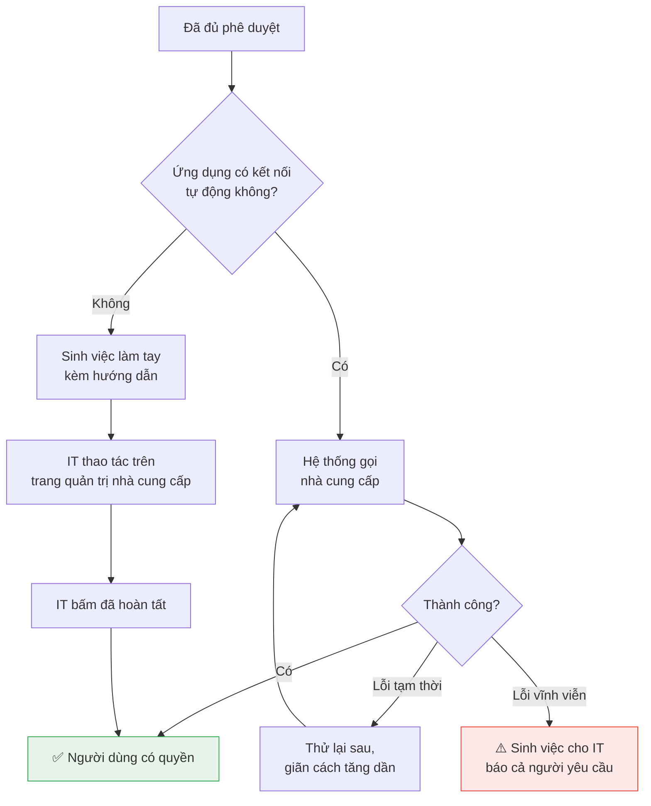

**Hai kênh, cùng một cách theo dõi:**

| Bước       | Kênh tự động                                                                                                                                                                                                                                    | Kênh thủ công                                |
| ---------- | ----------------------------------------------------------------------------------------------------------------------------------------------------------------------------------------------------------------------------------------------- | -------------------------------------------- |
| Nhận việc  | Worker nhặt khỏi hàng đợi                                                                                                                                                                                                                       | IT bấm "tôi đang xử lý"                      |
| Thực hiện  | Gọi giao diện lập trình của nhà cung cấp                                                                                                                                                                                                        | IT thao tác trên trang quản trị              |
| Hoàn tất   | **Không phải khi API trả về thành công.** Với nhà cung cấp mà thao tác cấp quyền tạo ra **lời mời chờ chấp nhận**, phản hồi thành công chỉ chứng minh _lời mời đã gửi_. Chỉ hoàn tất khi **đối soát thấy tài khoản trong danh sách thành viên** | IT bấm "đã hoàn tất", ghi tên người xác nhận |
| Bằng chứng | Nội dung phản hồi lưu vào nhật ký                                                                                                                                                                                                               | Ghi chú tùy chọn                             |

**Quy tắc nghiệp vụ:**

| Mã      | Nội dung                                                                                                                                                         |
| ------- | ---------------------------------------------------------------------------------------------------------------------------------------------------------------- |
| BR-10.1 | Với kênh thủ công, hệ thống **không** tự chuyển sang hoàn tất; phải có tên người thật xác nhận                                                                   |
| BR-10.2 | Khóa chống gọi trùng sinh từ dữ liệu nghiệp vụ, không sinh ngẫu nhiên — sinh ngẫu nhiên mỗi lần thử lại thì không chống được gì                                  |
| BR-10.3 | Hai kênh dùng chung một hàng đợi và một cách đo, để so sánh được thời gian xử lý giữa ứng dụng có kết nối và ứng dụng làm tay                                    |
| BR-10.4 | Quyền vẫn **chiếm chỗ** trong suốt thời gian đang thực hiện, kể cả khi thất bại — nếu nhả chỗ, người khác sẽ được gán và khi thử lại thành công thì vượt hạn mức |

**Xong khi:** có bằng chứng **tài khoản đã tồn tại phía nhà cung cấp** — bằng **xác nhận của người thật** (kênh thủ công), hoặc bằng **kết quả đối soát danh sách thành viên** (kênh tự động). **Riêng phản hồi thành công của lời gọi API thì chưa đủ.**

> 🔗 **Ràng buộc từ BRD mục 6.3 và `QĐ-03` — sửa ở lượt review diagram 08/09/2026.** Bản trước của mục này ghi _"Hoàn tất = nhà cung cấp trả về thành công"_ và _"Xong khi: … hoặc phản hồi thành công"_. Câu đó **mâu thuẫn với BRD mục 6.3**, vốn quy định: _"`ProvisioningTask` **không được** chuyển sang trạng thái hoàn tất chỉ vì `PUT` trả về thành công — cần một bước đối soát lại bằng `GET .../members` hoặc bằng trạng thái membership."_
>
> **Vì sao:** với API thành viên tổ chức của GitHub, `PUT /orgs/{org}/memberships/{username}` cho người **chưa** là thành viên sẽ **gửi lời mời**, và tư cách thành viên ở trạng thái **`pending` cho tới khi người đó chấp nhận** _(kiểm chứng tại `docs.github.com/en/rest/orgs/members`)_. Đây là **ràng buộc của nhà cung cấp**, không phải lựa chọn thiết kế của nhóm.
>
> **Hệ quả cho ba loại "thành công" — không được đánh đồng:**
>
> | Thứ được xác nhận                                             | Nghĩa là gì                         | Đủ để hoàn tất `ProvisioningTask`?               |
> | ------------------------------------------------------------- | ----------------------------------- | ------------------------------------------------ |
> | **Phản hồi API** thành công                                   | Yêu cầu đã được nhà cung cấp nhận   | ❌ **Không**                                     |
> | **Trạng thái phía nhà cung cấp** là `pending`                 | Lời mời đã gửi, chưa được chấp nhận | ❌ **Không** — suất vẫn chiếm chỗ theo `BR-10.4` |
> | **Trạng thái phía nhà cung cấp** là thành viên đang hoạt động | Tài khoản đã tồn tại thật           | ✅ **Có**                                        |
>
> **Đối xứng với `BR-10.1`:** `BR-10.1` đã cấm **kênh thủ công** tự chuyển sang hoàn tất khi chưa có người thật xác nhận. Ràng buộc trên là vế còn thiếu cho **kênh tự động**: không được coi phản hồi máy là bằng chứng đã cấp xong.
>
> **Nơi thể hiện:** `UF-08` và `WF-09a` có kết thúc riêng _"đã gửi lời mời, chờ chấp nhận"_; `UF-14` và `WF-16` có guard **bỏ qua** suất đang có lời mời chờ, để không sinh sai lệch giả _(nhóm trưởng chốt 08/09/2026)_. **Không đặt thêm thời hạn hay số lần thử mới** — chỉ dùng nhịp đối soát đã có.

---

### 3.5. F-12 · Xử lý cấp phát thất bại

**Bốn loại lỗi, xử lý khác nhau:**

| Loại        | Ví dụ                                     | Xử lý                                             | Thông điệp hiển thị                                            |
| ----------- | ----------------------------------------- | ------------------------------------------------- | -------------------------------------------------------------- |
| Tạm thời    | Nhà cung cấp phản hồi chậm                | Thử lại tự động, tối đa 6 lần, giãn cách tăng dần | "Nhà cung cấp phản hồi chậm. Đã thử 3/6 lần, lần kế lúc 10:24" |
| Vĩnh viễn   | Email sai định dạng, tài khoản đã tồn tại | **Không thử lại**, báo người thật ngay            | "Nhà cung cấp từ chối: email đã tồn tại trong tổ chức"         |
| Xác thực    | Kết nối tới nhà cung cấp hết hạn          | Không thử lại, báo quản trị hệ thống              | "Kết nối tới Figma đã hết hạn"                                 |
| Hết hạn mức | Nhà cung cấp báo vượt số license          | Không thử lại, đẩy sang nhánh mua thêm suất       | "Đã dùng hết số license Figma đã mua"                          |

**Quy tắc nghiệp vụ:**

| Mã      | Nội dung                                                                                                                           |
| ------- | ---------------------------------------------------------------------------------------------------------------------------------- |
| BR-12.1 | Thử lại một lỗi vĩnh viễn là vô nghĩa và gây hại — nó tạo sáu dòng nhật ký giống nhau và trì hoãn thời điểm có người thật nhìn vào |
| BR-12.2 | Việc thất bại **không biến mất khỏi tầm nhìn**; nằm trong hàng đợi cho tới khi có người quyết định thử lại hay đóng lại            |
| BR-12.3 | Thất bại quá 7 ngày chưa xử lý thì nổi lên bảng điều khiển như một mục nợ                                                          |
| BR-12.4 | Thông báo lỗi cho người dùng cuối bằng tiếng Việt, không hiện mã lỗi kỹ thuật; mã lỗi để trong phần chi tiết mở rộng cho IT        |
| BR-12.5 | Người yêu cầu **cũng được báo** khi cấp phát thất bại — để họ biết mà không chờ vô ích                                             |

**Xong khi:** mọi việc thất bại đều có một quyết định được ghi nhận — thử lại, chuyển sang làm tay, hoặc đóng kèm lý do.

---

### 3.6. F-13 · Xử lý bước duyệt nghẽn, xung đột lợi ích và xác định lại người duyệt _(tới v0.5: “Ủy quyền phê duyệt”)_

> **Viết lại ở v0.6 — `QĐ-27`, `QĐ-28c`, `QĐ-28d`.** Giữ mã `F-13` vì BRD, Context Diagram và Business Workflows đang trích. **Không còn ủy quyền duyệt**: người được giao tự nhận và tự quyết. Luồng này mô tả ba việc hệ thống làm thay cho ủy quyền — nhắc và cảnh báo khi nghẽn, tạo bước cho người thay thế **chỉ** khi Người duyệt chi xung đột lợi ích, và xác định lại người duyệt **chỉ** khi dữ liệu tổ chức hoặc cấu hình vai trò đổi thật.

|                    |                                                                                                           |
| ------------------ | --------------------------------------------------------------------------------------------------------- |
| **Mục đích**       | Giữ luồng không treo vô hạn mà **không** chuyền quyền duyệt, để việc của ai người đó nhận                 |
| **Kích hoạt bởi**  | Bước quá SLA · backlog vượt ngưỡng · Người duyệt chi là người yêu cầu/thụ hưởng · sự kiện dữ liệu tổ chức |
| **Tiền điều kiện** | Request đã được gửi và chính sách duyệt đã chốt (`BR-07.2`)                                               |

| #   | Ai              | Làm gì                                                                                                                                                                                    | Hệ thống phản hồi                                                                                                                                                                                       |
| --- | --------------- | ----------------------------------------------------------------------------------------------------------------------------------------------------------------------------------------- | ------------------------------------------------------------------------------------------------------------------------------------------------------------------------------------------------------- |
| 1   | HT              | Khi tạo bước duyệt chi: kiểm Người duyệt chi có phải người yêu cầu hoặc người thụ hưởng không                                                                                             | Có ⟹ **tạo thẳng** bước cho **người thay thế khi xung đột** Quản trị hệ thống đã cấu hình; ghi lý do _xung đột lợi ích_. Chưa cấu hình hoặc người thay thế cũng xung đột ⟹ chờ có kiểm soát (`BR-13.6`) |
| 2   | HT              | Mỗi bước đang chờ: theo dõi người được giao, thời điểm nhận, tuổi SLA, số lần nhắc                                                                                                        | Quá SLA ⟹ nhắc người được giao, **thông báo** cấp trên của người đó (nếu có). **Không** đổi người                                                                                                       |
| 3   | HT              | Số bước đang chờ của một người vượt ngưỡng backlog, hoặc có bước quá SLA                                                                                                                  | Cảnh báo Quản trị hệ thống, đưa vào **bảng theo dõi nghẽn** (BRD `FR-5.11`)                                                                                                                             |
| 4   | QT              | Xem bảng theo dõi nghẽn                                                                                                                                                                   | Chỉ được sửa cấu hình, dữ liệu tổ chức, hoặc ghi nhận sự cố. **Không** có nút duyệt thay                                                                                                                |
| 5   | HT              | Nhận sự kiện dữ liệu: `manager_id` của người yêu cầu đổi · người được giao nghỉ việc · QT đổi người giữ vai Người duyệt chi, người thay thế khi xung đột, hoặc người duyệt dự phòng ở gốc | **Xác định lại** người duyệt của bước đang chờ theo đúng quy tắc định tuyến gốc; ghi sự kiện nguồn, người cũ, người mới. SLA **không** đặt lại                                                          |
| 6   | Người được giao | Tự nhận và quyết định                                                                                                                                                                     | Người quyết thực tế **phải trùng** người được giao hiện hành                                                                                                                                            |

**Quy tắc nghiệp vụ:**

| Mã          | Nội dung                                                                                                                                                                                                                                                                                                                                                                                                                                        |
| ----------- | ----------------------------------------------------------------------------------------------------------------------------------------------------------------------------------------------------------------------------------------------------------------------------------------------------------------------------------------------------------------------------------------------------------------------------------------------- |
| ~~BR-13.1~~ | 📁 **Nghỉ hưu ở v0.6** — chặn ủy quyền vòng tròn; không còn ủy quyền (`QĐ-27`)                                                                                                                                                                                                                                                                                                                                                                  |
| BR-13.2     | Mọi lần xác định lại người duyệt **không đặt lại đồng hồ thời hạn xử lý**. Thời hạn thuộc về bước, không thuộc về người _(tới v0.5 phát biểu cho ủy quyền; nghĩa gốc giữ nguyên)_                                                                                                                                                                                                                                                               |
| ~~BR-13.3~~ | 📁 **Nghỉ hưu ở v0.6** — ràng buộc của người được ủy quyền; không còn ủy quyền. Nguyên tắc không tự duyệt vẫn giữ ở `SoD-4`, `INV-08`                                                                                                                                                                                                                                                                                                           |
| BR-13.4     | Nhật ký ghi tách **người được giao** và **người quyết thực tế**, cộng lịch sử mọi lần xác định lại. Từ v0.6 hai người phải trùng nhau tại lúc quyết — lệch là lỗi phân quyền, không phải ủy quyền                                                                                                                                                                                                                                               |
| ~~BR-13.5~~ | 📁 **Nghỉ hưu ở v0.6** — người được ủy quyền trùng người yêu cầu (`QĐ-12`, bị `QĐ-27` thay thế)                                                                                                                                                                                                                                                                                                                                                 |
| BR-13.6     | **Hết người duyệt hợp lệ trong cả chuỗi ⟹ giữ Request ở trạng thái chờ**, gắn cờ _chưa có người duyệt hợp lệ_, nhắc và **thông báo** theo `FR-3.8`, **báo Quản trị hệ thống cấu hình lại**. Không tự duyệt, không tự từ chối, không giao quyền duyệt cho Quản trị hệ thống _(`SoD-1`)_ — `QĐ-13`, BRD `FR-3.12` _(sửa ở v0.6: bỏ chữ “leo cấp”)_                                                                                                |
| ~~BR-13.7~~ | 📁 **Nghỉ hưu ở v0.6** — Người duyệt chi ủy quyền được; không còn ủy quyền                                                                                                                                                                                                                                                                                                                                                                      |
| BR-13.8     | _(mới ở v0.6 — `QĐ-27`, `QĐ-28d`)_ **Nghẽn chỉ được xử lý bằng nhắc, thông báo và cảnh báo.** Không ủy quyền, không đổi người, không tự duyệt, không tự từ chối. Quản trị hệ thống **không** được duyệt thay — BRD `FR-3.5`, `FR-3.8`                                                                                                                                                                                                           |
| BR-13.9     | _(mới ở v0.6 — `QĐ-28d`)_ **Chỉ xác định lại người duyệt khi có sự kiện dữ liệu thật** — `manager_id` đổi, người được giao nghỉ việc hoặc không còn hợp lệ, Quản trị hệ thống đổi cấu hình vai trò. Nghỉ phép, vắng mặt, backlog cao **không** phải sự kiện — BRD `FR-3.16`                                                                                                                                                                     |
| BR-13.10    | _(mới ở v0.6 — `QĐ-28c`)_ **Người thay thế khi xung đột** là cấu hình tĩnh của Quản trị hệ thống, lập trước. Chỉ áp khi Người duyệt chi là người yêu cầu hoặc người thụ hưởng; **không** do Quản lý, Người duyệt chi hay người yêu cầu chọn; **không** áp cho backlog; **không** tạo ứng viên song song; **không** dùng để né SLA — bước được tạo thẳng cho người thay thế ngay từ đầu. Người thay thế chịu đủ `SoD-7`, `SoD-8` — BRD `FR-3.15` |

**Ngoại lệ:**

| Tình huống                                                              | Xử lý                                                                                                                                                                                   |
| ----------------------------------------------------------------------- | --------------------------------------------------------------------------------------------------------------------------------------------------------------------------------------- |
| Người duyệt chi nghỉ phép dài                                           | Không phải sự kiện dữ liệu, không phải xung đột ⟹ nhắc và cảnh báo backlog; nếu tổ chức muốn đổi người giữ vai thì Quản trị hệ thống đổi **cấu hình**, việc xác định lại theo `BR-13.9` |
| Người thay thế khi xung đột nghỉ việc trong lúc đang giữ bước           | Sự kiện dữ liệu ⟹ xác định lại theo `BR-13.9`; không còn ai hợp lệ ⟹ `BR-13.6`                                                                                                          |
| Quản lý trực tiếp cũng là Người duyệt chi, **không** phải người yêu cầu | Không phải xung đột ⟹ giữ hai bước, gắn cờ _cùng người_ (`BR-07.8`)                                                                                                                     |

> **Vì sao người thay thế khi xung đột không phải ủy quyền:** ủy quyền là người đang giữ quyền **tự chọn** người thay, theo **thời gian vắng mặt**, áp lên **mọi** bước. Người thay thế ở đây là **cấu hình tổ chức** lập trước, áp theo **điều kiện xung đột trên đúng một Request**, và không ai trong luồng chọn được.

**Xong khi:** không bước nào bị đổi người vì nghẽn; mọi lần xác định lại truy được về một sự kiện dữ liệu; khoản chi mà Người duyệt chi là người yêu cầu hoặc thụ hưởng vẫn đi tới được một quyết định; và **không có đường nào dẫn tới việc một người tự duyệt yêu cầu của chính mình**.

---

### 3.7. F-14 và F-15 · Hoàn trả và gia hạn có thời hạn

| Luồng                        | Kích hoạt bởi                                             | Điểm cần chú ý                                                                     |
| ---------------------------- | --------------------------------------------------------- | ---------------------------------------------------------------------------------- |
| **F-14 Hoàn trả**            | Nhân viên tự trả, hoặc quản lý xác nhận không còn nhu cầu | Nguồn quyết định phải truy được: yêu cầu hoàn trả, xác nhận thu hồi, hay nghỉ việc |
| **F-15 Gia hạn có thời hạn** | Sắp tới ngày kết thúc dự kiến                             | Gia hạn tạo bản ghi quyết định mới, không sửa ngày trên bản ghi cũ                 |

**Quy tắc nghiệp vụ:**

| Mã      | Nội dung                                                                                                  |
| ------- | --------------------------------------------------------------------------------------------------------- |
| BR-14.1 | Không cho thu hồi "không lý do" — mọi thu hồi phải gắn với một nguồn quyết định                           |
| BR-14.2 | Suất được nhả về trạng thái trống **chỉ sau khi** tài khoản thật đã bị xóa hoặc IT xác nhận không cần xóa |
| BR-15.1 | Gia hạn quá 12 tháng liên tiếp cần xác nhận thêm                                                          |

**Xong khi:** suất về trạng thái trống và có thể tái phân bổ, hoặc được ghi nhận để giảm số lượng tại kỳ gia hạn.

---

## 4. VS-2 — Thu hồi lãng phí có bằng chứng

_Thuộc `MF-3`. Xem mạch tổng ở mục 1.7._

### 4.1. F-17 · Import dữ liệu sử dụng

|                    |                                                                                                      |
| ------------------ | ---------------------------------------------------------------------------------------------------- |
| **Mục đích**       | Đưa dữ liệu hoạt động từ bên ngoài vào **mà không kết luận sai trên dữ liệu thiếu**                  |
| **Kích hoạt bởi**  | IT tải file lên; _(v0.5)_ hoặc **bộ thu thập trên thiết bị gửi bản tổng hợp theo ngày** — xem `F-45` |
| **Tiền điều kiện** | Ứng dụng đã có trong danh mục và có mẫu cấu hình nguồn                                               |

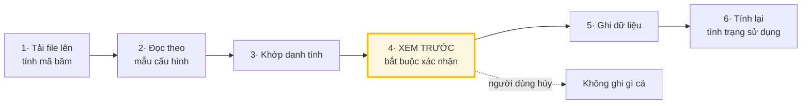

**Nội dung bắt buộc của bước 4 — không được rút gọn:**

| Hệ thống cho biết                              | Vì sao quan trọng                                 |
| ---------------------------------------------- | ------------------------------------------------- |
| Số dòng hợp lệ, số dòng lỗi kèm lý do          | Tải về được danh sách lỗi để sửa                  |
| Số dòng trùng sẽ bỏ qua                        |                                                   |
| Số định danh **chưa khớp** được                | Những dòng này **không** được dùng để kết luận    |
| **Khoảng thời gian file này bao phủ**          | Quyết định suất nào đánh giá được, suất nào không |
| Số quyền sẽ bị ảnh hưởng                       | Cho thấy quy mô tác động trước khi ghi            |
| **Nguồn này phát hiện được nhóm lãng phí nào** | Không để người dùng kỳ vọng sai                   |
| **Nguồn này hiểu "hoạt động" là gì**           | Xem BR-17.5                                       |

**Quy tắc nghiệp vụ:**

| Mã      | Nội dung                                                                                                                                                                                                                                                                                                                                      |
| ------- | --------------------------------------------------------------------------------------------------------------------------------------------------------------------------------------------------------------------------------------------------------------------------------------------------------------------------------------------- |
| BR-17.1 | Khoảng thời gian bao phủ **bắt buộc**. File không tự chứa thì IT khai tay, không cho bỏ qua                                                                                                                                                                                                                                                   |
| BR-17.2 | Chuẩn hóa múi giờ về múi giờ tổ chức **trước khi** cắt theo ngày                                                                                                                                                                                                                                                                              |
| BR-17.3 | Chuẩn hóa email theo đúng một hàm dùng chung, áp cả khi tạo ánh xạ lẫn khi đối chiếu                                                                                                                                                                                                                                                          |
| BR-17.4 | Sự kiện chỉ mang tính xác thực — đăng nhập, chuyển hướng đăng nhập một lần — **không** tính là hoạt động                                                                                                                                                                                                                                      |
| BR-17.5 | Mẫu cấu hình **bắt buộc** khai báo nguồn hiểu "hoạt động" là gì. Nguồn có định nghĩa lỏng bị hạ mức tin cậy                                                                                                                                                                                                                                   |
| BR-17.6 | Dữ liệu hoạt động gắn vào **quyền đang hiệu lực tại ngày xảy ra sự kiện**, không gắn vào con người                                                                                                                                                                                                                                            |
| BR-17.7 | Lỗi ở một dòng không làm hỏng cả file                                                                                                                                                                                                                                                                                                         |
| BR-17.8 | Không import dữ liệu hoạt động cho ứng dụng có cờ nhóm dịch vụ liên lạc, trừ khi đã được bật có chủ đích                                                                                                                                                                                                                                      |
| BR-17.9 | _(mới ở v0.5 — `QĐ-20`)_ Dữ liệu từ bộ thu thập **không đi qua bước xem trước** vì đến tự động theo ngày, nhưng vẫn qua đủ **khớp danh tính, cửa sổ bao phủ, định nghĩa hoạt động**; và **bị từ chối ngay tại cổng nhận** nếu thiết bị chưa đăng ký, nhân viên chưa xác nhận, hoặc bản ghi mang trường ngoài lược đồ — BRD `INV-17`, `ADR-13` |

> **BR-17.6 là chi tiết dễ bỏ sót nhất của cả phân hệ.** Một nhân viên có thể được cấp suất, trả lại, rồi được cấp lại — ba lần cấp quyền riêng biệt. Nếu gắn nhật ký vào con người rồi lấy ngày hoạt động gần nhất, lần cấp mới sẽ thừa hưởng lịch sử của lần cũ và **không bao giờ** bị phát hiện. Lỗi này không gây báo lỗi, không hiện trong nhật ký, chỉ làm phân hệ âm thầm mất tác dụng.
>
> **BR-17.5 xuất phát từ một phát hiện thực tế:** Atlassian tính "xem một trang từ 2 giây" là hoạt động. Nhận con số ngày hoạt động cuối mà không biết nó nghĩa là gì thì mọi người đều "đang dùng".

**Ngoại lệ:**

| Tình huống                               | Xử lý                                                              |
| ---------------------------------------- | ------------------------------------------------------------------ |
| Mã băm trùng file đã import              | Cảnh báo, cho ghi đè có chủ đích, không chặn cứng                  |
| Chưa có mẫu cấu hình cho nhà cung cấp    | Hướng dẫn tạo mẫu mới bằng giao diện ánh xạ cột — **không sửa mã** |
| Người dùng hủy ở bước 4                  | Không ghi một dòng nào                                             |
| Hai file cùng ứng dụng, cửa sổ chồng lấn | Xem F-43                                                           |

**Xong khi:** không dòng nào được ghi trước khi người dùng xác nhận, và sau khi ghi thì tình trạng sử dụng của các quyền liên quan đã được tính lại.

> **Ví dụ nguồn GitHub — v0.6, `QĐ-28a`.** GitHub có **hai** nguồn usage riêng, mỗi nguồn khai cửa sổ bao phủ và định nghĩa hoạt động riêng: **(1) lịch sử commit** vào repo của org — hoạt động = có commit trong ngày, định danh là `login`; **(2) tiện ích trình duyệt** với `github.com` theo `F-45`. Ngày hoạt động cuối lấy **muộn nhất trong các nguồn còn đủ độ mới và đã khớp danh tính**. **Audit log organization không phải nguồn usage** — nó chỉ ghi hành động quản trị. Không có commit hoặc không có dữ liệu tiện ích mà cửa sổ không đủ thì là _không có dữ liệu_, **không** phải _không hoạt động_ (BRD `FR-4.10`).

---

### 4.2. F-18 · Xử lý hàng đợi chưa khớp danh tính

| #   | Ai  | Làm gì                                 | Hệ thống phản hồi                                                              |
| --- | --- | -------------------------------------- | ------------------------------------------------------------------------------ |
| 1   | HT  | Sau mỗi lần import                     | Đưa các định danh không khớp vào hàng đợi, kèm chuỗi gốc nguyên văn            |
| 2   | IT  | Xem chuỗi gốc, tìm nhân viên tương ứng | Gợi ý ứng viên gần đúng                                                        |
| 3   | IT  | Gán tay, hoặc đánh dấu bỏ qua          | Ghi phương pháp khớp là thủ công, mức tin cậy tương ứng, và tên người xác nhận |
| 4   | HT  | —                                      | **Chạy lại tổng hợp** cho các quyền liên quan tới định danh vừa khớp           |

**Quy tắc nghiệp vụ:**

| Mã      | Nội dung                                                                                                                          |
| ------- | --------------------------------------------------------------------------------------------------------------------------------- |
| BR-18.1 | Bản ghi chưa khớp **không bao giờ** được dùng để kết luận về bất kỳ ai                                                            |
| BR-18.2 | Giữ **cả chuỗi gốc lẫn bản đã chuẩn hóa** — khi IT phải giải thích vì sao kết luận `baovh` là Vũ Hoàng Bảo, họ cần thấy chuỗi gốc |
| BR-18.3 | Khớp thủ công bắt buộc ghi tên người xác nhận                                                                                     |
| BR-18.4 | Một định danh khớp về hai nhân viên khác nhau thì chặn, đưa lên cho người xử lý                                                   |

**Xong khi:** hàng đợi chưa khớp có xu hướng giảm sau mỗi kỳ import, và không có kết luận nào được sinh từ dữ liệu chưa khớp.

---

### 4.3. F-19 và F-20 · Phát hiện lãng phí

**Bốn nhóm, khác nhau về nguồn dữ liệu và độ chắc chắn:**

| Nhóm   | Là gì                                | Cần dữ liệu ngoài | Độ chắc chắn | Ai quyết định      |
| ------ | ------------------------------------ | ----------------- | ------------ | ------------------ |
| **G1** | Suất đã mua chưa gán cho ai          | ❌                | Tuyệt đối    | IT, tại kỳ gia hạn |
| **G2** | Suất của người **đã nghỉ việc**      | ❌                | Tuyệt đối    | IT, thu hồi ngay   |
| **G3** | Suất đã gán nhưng **chưa từng** dùng | ✅                | Cao          | Quản lý xác nhận   |
| **G4** | Suất từng dùng nhưng **đã ngừng**    | ✅                | Trung bình   | Quản lý xác nhận   |

**Tám cổng lọc chạy trước mọi đánh giá:**

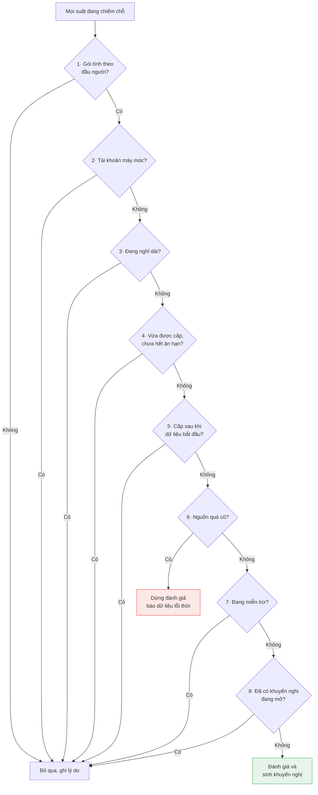

**Ba mức độ, và không phải mức nào cũng gửi thông báo:**

| Mức         | Điều kiện mặc định                                 | Gửi thông báo                                                                            |
| ----------- | -------------------------------------------------- | ---------------------------------------------------------------------------------------- |
| Theo dõi    | Không dùng 30–59 ngày                              | ❌ Chỉ hiện trên bảng điều khiển **của IT Admin** — không hiện trên màn hình của quản lý |
| Cần xem xét | Từ 60 ngày                                         | ✅ Gửi quản lý                                                                           |
| Cần xử lý   | Từ 90 ngày, hoặc chưa từng dùng, hoặc đã nghỉ việc | ✅ Gửi quản lý và IT                                                                     |

**Quy tắc nghiệp vụ:**

| Mã      | Nội dung                                                                                                                                                                                                                                                                          |
| ------- | --------------------------------------------------------------------------------------------------------------------------------------------------------------------------------------------------------------------------------------------------------------------------------- |
| BR-19.1 | G1 nhắm vào **thuê bao**, không nhắm vào người — hành động là giảm số lượng tại kỳ gia hạn                                                                                                                                                                                        |
| BR-19.2 | G2 bỏ qua mọi ngưỡng ngày và không cần quản lý xác nhận                                                                                                                                                                                                                           |
| BR-20.1 | Ngưỡng phân giải theo thứ tự: từng ứng dụng > tổ chức > mặc định hệ thống _(sửa ở v0.5 — bỏ cấp phòng ban, `QĐ-23`)_                                                                                                                                                              |
| BR-20.2 | Số tiết kiệm thực hiện được ngay chỉ lớn hơn 0 khi gói theo tháng hoặc hợp đồng cho giảm giữa kỳ                                                                                                                                                                                  |
| BR-20.3 | Bằng chứng là **bản chụp tại thời điểm sinh**, không phải con trỏ tới nguồn — nếu nguồn bị import đè, khuyến nghị cũ sẽ hiển thị căn cứ của dữ liệu mới                                                                                                                           |
| BR-20.4 | Cổng lọc số 6 làm cả lần chạy dừng cho ứng dụng đó, **không** âm thầm chạy với dữ liệu cũ                                                                                                                                                                                         |
| BR-20.5 | Mức "theo dõi" **không gửi thông báo** — nếu mọi phát hiện đều gửi thư, quản lý sẽ lọc vào thùng rác trong tuần đầu. **Chốt ở `QĐ-09`, đã ghi vào `FR-4.12`:** mức này **chỉ IT Admin thấy**, không hiện trên màn hình của quản lý; quản lý chỉ nhận từ mức _cần xem xét_ trở lên |

> **Tám cổng lọc quan trọng ngang với chính thuật toán phát hiện.** Chứng minh hệ thống **không báo động giả** có giá trị hơn chứng minh nó tìm ra nhiều.

**Xong khi:** mỗi khuyến nghị kèm đủ căn cứ để người nhận phản biện được, và không có khuyến nghị nào sinh ra từ dữ liệu chưa đủ điều kiện.

---

### 4.4. F-21 · Quản lý xác nhận

| #   | Ai  | Làm gì                                | Hệ thống phản hồi                                                                                                                                                                                       |
| --- | --- | ------------------------------------- | ------------------------------------------------------------------------------------------------------------------------------------------------------------------------------------------------------- |
| 1   | HT  | Gửi hàng đợi xác nhận, gộp theo tuần  | Nhóm theo **nhân viên**, không nhóm theo ứng dụng                                                                                                                                                       |
| 2   | QL  | Xem từng dòng                         | Hiển thị đầy đủ: số ngày không hoạt động, tên nguồn, ngày import, độ dài cửa sổ bao phủ, phương pháp khớp danh tính, định nghĩa hoạt động của nguồn, mức tin cậy, và **hai** con số tiết kiệm tách biệt |
| 3   | QL  | Chọn Giữ lại / Thu hồi / Tạm miễn trừ | Bắt buộc nhập lý do                                                                                                                                                                                     |
| 4   | HT  | —                                     | Thu hồi thì chuyển việc cho IT; miễn trừ thì đặt lịch mở lại                                                                                                                                            |

**Ba lựa chọn và hệ quả:**

| Lựa chọn         | Nghĩa            | Hệ quả                                                     |
| ---------------- | ---------------- | ---------------------------------------------------------- |
| **Giữ lại**      | Vẫn cần suất này | Đóng khuyến nghị lần này, **nhưng chu kỳ sau vẫn hỏi lại** |
| **Thu hồi**      | Không cần nữa    | Chuyển cho IT thực hiện                                    |
| **Tạm miễn trừ** | Chưa quyết được  | **Bắt buộc có ngày hết hạn**, tối đa 12 tháng              |

**Quy tắc nghiệp vụ:**

| Mã      | Nội dung                                                                                                        |
| ------- | --------------------------------------------------------------------------------------------------------------- |
| BR-21.1 | Quản lý **không** xem được nhật ký hoạt động thô — chỉ thấy số liệu tổng hợp                                    |
| BR-21.2 | Chọn hàng loạt phải nhập **một** lý do chung, không cho để trống                                                |
| BR-21.3 | Miễn trừ không có ngày hết hạn bị chặn ở cả ba tầng: giao diện, dịch vụ, cơ sở dữ liệu                          |
| BR-21.4 | Hiển thị phải nêu rõ giới hạn dữ liệu, ví dụ _"nguồn chỉ bao phủ 30 ngày — chưa đủ để kết luận chưa từng dùng"_ |
| BR-21.5 | "Giữ lại" **không** đóng vĩnh viễn; chu kỳ sau vẫn hỏi nhưng hiển thị kèm quyết định lần trước                  |
| BR-21.6 | Khuyến nghị bị dữ liệu mới phủ định thì đóng **im lặng**, không thông báo                                       |

> **BR-21.4 quyết định phân hệ này sống hay chết.** Quản lý là người có bối cảnh mà hệ thống không có; họ chỉ hợp tác nếu tin rằng hệ thống đang nói thật về mức độ chắc chắn của nó. Một khuyến nghị sai được trình bày với giọng chắc nịch sẽ làm hỏng niềm tin vào cả trăm khuyến nghị đúng còn lại.
>
> **BR-21.5** — "giữ lại" là phát biểu có thời hạn: _tại thời điểm này tôi vẫn cần_. Nếu đóng vĩnh viễn, sau vài chu kỳ phần lớn suất lãng phí sẽ nằm trong vùng không bao giờ được hỏi lại.
>
> **BR-21.6** — gửi thông báo _"khuyến nghị hôm trước không còn đúng"_ chỉ làm giảm niềm tin. Đóng im lặng, vẫn ghi nhật ký, và **số lượng khuyến nghị bị phủ định là một chỉ số chất lượng của rule engine**.

**Xong khi:** mọi khuyến nghị mức cần xem xét trở lên đều có một quyết định kèm lý do trong vòng một chu kỳ.

---

### 4.5. F-22 và F-23 · Thu hồi và mở lại khuyến nghị

| Luồng            | Nội dung                                                                    | Điểm cần chú ý                                                     |
| ---------------- | --------------------------------------------------------------------------- | ------------------------------------------------------------------ |
| **F-22 Thu hồi** | IT nhận việc từ xác nhận của quản lý, thực hiện thu hồi theo F-10 hoặc F-11 | Ghi số tiết kiệm **đúng loại** — thực hiện ngay hay tại kỳ gia hạn |
| **F-23 Mở lại**  | Tới ngày hết hạn miễn trừ, hệ thống sinh khuyến nghị mới                    | Ghi chú "đã từng miễn trừ tới ngày X vì lý do Y"                   |

**Quy tắc nghiệp vụ:**

| Mã      | Nội dung                                                                                     |
| ------- | -------------------------------------------------------------------------------------------- |
| BR-22.1 | IT có quyền không đồng ý với xác nhận của quản lý, nhưng phải ghi lý do                      |
| BR-22.2 | Số tiết kiệm ghi nhận vào báo cáo là số **thực tế thu được**, không phải số ước tính ban đầu |
| BR-23.1 | Thông báo trước 7 ngày khi miễn trừ sắp hết hạn, để quản lý chuẩn bị                         |

**Xong khi:** suất về trạng thái trống, khuyến nghị đóng ở trạng thái đã xử lý, và số tiết kiệm được ghi đúng loại.

---

## 5. VS-3 — Kiểm soát hợp đồng

_Thuộc `MF-4`. Xem mạch tổng ở mục 1.8._

### 5.1. F-26 · Cảnh báo trước hạn chót báo hủy

|                   |                                       |
| ----------------- | ------------------------------------- |
| **Mục đích**      | Không bao giờ bị gia hạn ngoài ý muốn |
| **Kích hoạt bởi** | Tác vụ chạy hằng ngày                 |

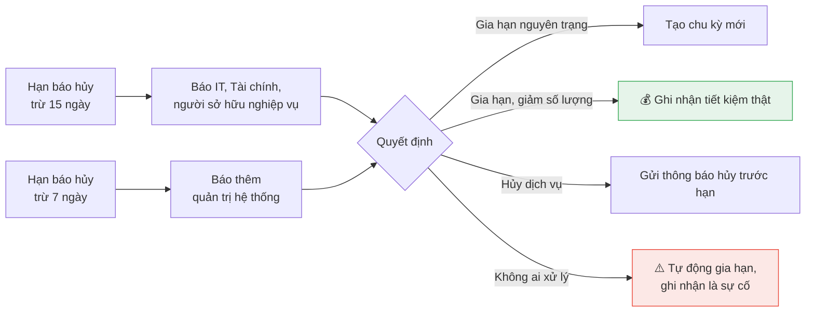

**Ba tình huống về dữ liệu:**

| Tình huống                                     | Xử lý                                                  |
| ---------------------------------------------- | ------------------------------------------------------ |
| Có hạn chót báo hủy rõ ràng                    | Cảnh báo theo mốc đó                                   |
| Không có, nhưng hợp đồng ghi số ngày báo trước | Suy ra, và **ghi rõ là số liệu suy ra, chưa xác nhận** |
| Không có cả hai, mà hợp đồng tự gia hạn        | **Không suy đoán.** Hiện cảnh báo thiếu dữ liệu        |

**Quy tắc nghiệp vụ:**

| Mã      | Nội dung                                                                                                           |
| ------- | ------------------------------------------------------------------------------------------------------------------ |
| BR-26.1 | Cảnh báo tính từ **hạn chót báo hủy**, không tính từ ngày gia hạn                                                  |
| BR-26.2 | Mỗi mốc cảnh báo hiển thị kèm **các khuyến nghị lãng phí đang mở của chính thuê bao đó**                           |
| BR-26.3 | Thuê bao tự gia hạn mà không có quyết định được ghi nhận trước hạn báo hủy được đếm vào chỉ số KPI-4 như một sự cố |

> Cảnh báo trước ngày gia hạn 7 ngày trong khi hợp đồng buộc báo hủy trước 30 ngày là **một cảnh báo vô dụng được gửi đúng giờ** — nó tạo cảm giác an toàn giả.
>
> **BR-26.2 là nơi hai phân hệ gặp nhau** và tạo ra giá trị lớn nhất của toàn hệ thống: quản lý thấy _"gói này sắp gia hạn, và đang có 6 suất không ai dùng"_ — thông tin đủ để ra quyết định giảm số lượng.

**Xong khi:** mọi thuê bao có tự động gia hạn đều có một quyết định được ghi nhận trước hạn báo hủy.

---

### 5.2. F-27 · Quyết định gia hạn

| #   | Ai                                     | Làm gì                                                                                       | Hệ thống phản hồi                                                                                             |
| --- | -------------------------------------- | -------------------------------------------------------------------------------------------- | ------------------------------------------------------------------------------------------------------------- |
| 1   | IT và TC                               | Xem mốc gia hạn kèm khuyến nghị lãng phí đang mở                                             | Hiển thị so sánh số suất kỳ này với kỳ trước                                                                  |
| 1b  | TC                                     | _(tùy chọn, khi Người duyệt chi hỏi)_ **Trả lời yêu cầu thông tin ngân sách** _(sửa ở v0.7)_ | Không chặn, SLA của Người duyệt chi không dừng                                                                |
| 2   | **DC** _(sửa ở v0.5 — tới v0.4 là TC)_ | Quyết định: gia hạn nguyên trạng, giảm số lượng, hoặc hủy                                    | Hiển thị cạnh nút quyết: **snapshot ngân sách**, khuyến nghị đang mở, tiết kiệm tại kỳ gia hạn _(sửa ở v0.7)_ |
| 3   | HT                                     | —                                                                                            | Gia hạn thì **tạo bản ghi thuê bao mới**, bản ghi cũ chuyển sang hết hạn                                      |
| 4   | HT                                     | —                                                                                            | Chuyển các quyền đang hiệu lực sang thuê bao mới trong cùng một giao dịch                                     |

**Quy tắc nghiệp vụ:**

| Mã      | Nội dung                                                                                                                                                                                                                                                             |
| ------- | -------------------------------------------------------------------------------------------------------------------------------------------------------------------------------------------------------------------------------------------------------------------- |
| BR-27.1 | Gia hạn **không sửa đè** ngày trên bản ghi cũ — sửa đè sẽ xóa mất lịch sử giá và số lượng                                                                                                                                                                            |
| BR-27.2 | Số tiết kiệm thật chỉ được ghi nhận khi số suất kỳ mới **thấp hơn** kỳ cũ                                                                                                                                                                                            |
| BR-27.3 | Hủy dịch vụ phải kiểm tra còn quyền nào đang hiệu lực không, và cảnh báo người đang dùng                                                                                                                                                                             |
| BR-27.4 | _(mới ở v0.5 — `QĐ-22`; sửa ở v0.7 — `QĐ-29b`)_ Quyết định gia hạn, giảm, hủy thuộc **Người duyệt chi**, trên snapshot ngân sách; hỏi Tài chính là tùy chọn, Tài chính ghi nhận **sau** quyết định. Cùng một nguyên tắc với luồng mua mới — BRD `FR-3.13`, `FR-3.14` |

**Xong khi:** có bản ghi thuê bao kỳ mới với số suất phản ánh đúng quyết định, và so sánh được với kỳ trước.

---

### 5.3. F-28 · Đối soát với nhà cung cấp

| Loại lệch                                | Nghĩa                                           | Mức nghiêm trọng | Xử lý                                  |
| ---------------------------------------- | ----------------------------------------------- | ---------------- | -------------------------------------- |
| Hệ thống có, nhà cung cấp không có       | Người dùng không truy cập được dù đã được duyệt | Trung bình       | IT cấp lại hoặc xác nhận không cần     |
| **Nhà cung cấp có, hệ thống không biết** | **Có người được cấp quyền ngoài quy trình**     | **Cao**          | IT điều tra, hợp thức hóa hoặc thu hồi |

**Quy tắc nghiệp vụ:**

| Mã      | Nội dung                                                                                        |
| ------- | ----------------------------------------------------------------------------------------------- |
| BR-28.1 | Chỉ đối soát ứng dụng có kết nối tự động; ứng dụng không có kết nối **không sinh sai lệch giả** |
| BR-28.2 | Hệ thống **không tự sửa** để hai bên khớp nhau — xem F-43                                       |
| BR-28.3 | Sai lệch loại "có ở nhà cung cấp nhưng hệ thống không biết" gửi thông báo mức rất cao           |

**Xong khi:** mọi sai lệch đều có một quyết định của người thật, không có sai lệch nào tự đóng.

---

## 6. VS-4 — Minh bạch chi tiêu

_Thuộc `MF-5`. Xem mạch tổng ở mục 1.9._

### 6.1. F-29 · Bảng chi tiêu, tiết kiệm và phân bổ

|                   |                                                                                                                                                     |
| ----------------- | --------------------------------------------------------------------------------------------------------------------------------------------------- |
| **Mục đích**      | Tài chính và Người duyệt chi trả lời được "khoản này của ai, phục vụ việc gì, và hệ thống đã tiết kiệm được bao nhiêu" _(mở rộng ở v0.5 — `QĐ-24`)_ |
| **Kích hoạt bởi** | Người dùng mở bảng điều khiển                                                                                                                       |

**Quy tắc nghiệp vụ:**

| Mã      | Nội dung                                                                                                                                                                                                                                                      |
| ------- | ------------------------------------------------------------------------------------------------------------------------------------------------------------------------------------------------------------------------------------------------------------- |
| BR-29.1 | Mọi số tiền hiển thị theo đồng tiền báo cáo; di chuột thì hiện nguyên tệ và tỷ giá đã dùng                                                                                                                                                                    |
| BR-29.2 | Bảng luôn hiển thị **cơ sở ghi nhận đang xem** — theo kỳ hay theo dòng tiền — không để người dùng đọc một con số mà không biết nó là gì                                                                                                                       |
| BR-29.3 | Chi phí của gói theo đầu người quy về **cost center** của nhân viên **tại thời điểm phát sinh**, không phải cost center hiện tại _(sửa chữ ở v0.5)_                                                                                                           |
| BR-29.4 | Chi phí của gói cố định và gói dùng chung chia theo tỷ lệ khai ở cấp thuê bao                                                                                                                                                                                 |
| BR-29.5 | Hiển thị **thời điểm dữ liệu cập nhật gần nhất**; chỉ gọi là thời gian thực khi nguồn thực sự hỗ trợ                                                                                                                                                          |
| BR-29.6 | _(mới ở v0.5 — `QĐ-23`, `QĐ-24`)_ Thêm các chiều nhóm **theo ứng dụng, nhà cung cấp, và cây người phụ trách** — tổng chi của mọi người dưới quyền một người, theo quan hệ quản lý có hiệu lực tại thời điểm phát sinh. **Không** có chiều nhóm theo phòng ban |
| BR-29.7 | _(mới ở v0.5)_ Tách ba con số **ngân sách — thực chi — khoản cam kết đang giữ**. Bảng **tiết kiệm** luôn đặt cạnh tổng chi, với _tiết kiệm thực hiện ngay_ và _tiết kiệm tại kỳ gia hạn_ **tách riêng, không cộng** — BRD `FR-5.8`, `FR-5.9`                  |

> Cột **chi phí trên mỗi suất đang hoạt động** — chứ không phải trên mỗi suất đã mua — là con số tài chính quan tâm nhất mà hầu như không hệ thống nào hiển thị. Nó cho thấy ngay ứng dụng nào đang trả tiền cho không khí.

**Xong khi:** mọi con số trên bảng đều bấm được để xem căn cứ tính.

---

### 6.2. F-30 · Dự báo chi phí ba lớp

| Lớp    | Nội dung                            | Cơ chế                                                                                                                                                            |
| ------ | ----------------------------------- | ----------------------------------------------------------------------------------------------------------------------------------------------------------------- |
| **L1** | Chi phí đã cam kết                  | Công thức xác định từ hợp đồng                                                                                                                                    |
| **L2** | Chi phí biến động theo mức tiêu thụ | Mô hình xu hướng **có cổng kiểm chứng** — ⏸️ **hoãn, không hiện thực trong MVP** _(v0.5 — `QĐ-25`)_; giao diện ghi rõ _"dự báo theo mô hình chưa được hiện thực"_ |
| **L3** | Chi phí phụ thuộc quyết định        | Ba kịch bản theo giả định người dùng nhập                                                                                                                         |

**Cổng kiểm chứng cho L2:**

| Điều kiện                                        | Không đạt thì sao                                                    |
| ------------------------------------------------ | -------------------------------------------------------------------- |
| Có tối thiểu 12 tháng dữ liệu                    | Hiện _"chưa đủ dữ liệu lịch sử để dự báo có kiểm chứng"_             |
| Sai số kiểm chứng lùi trong ngưỡng, mặc định 20% | **Ẩn dự báo mô hình**, chỉ hiển thị khoảng kịch bản, nêu rõ lý do ẩn |

**Quy tắc nghiệp vụ:**

| Mã      | Nội dung                                                                                                                                    |
| ------- | ------------------------------------------------------------------------------------------------------------------------------------------- |
| BR-30.1 | Không dùng mô hình thống kê cho lớp L1 — dùng sẽ cho kết quả **kém chính xác hơn** đọc thẳng hợp đồng                                       |
| BR-30.2 | **Không** hiển thị con số dự báo trần trụi trong bất kỳ trường hợp nào; luôn kèm khoảng dữ liệu, giả định, sai số đo được và thời điểm tính |
| BR-30.3 | Sai số đo được hiển thị cạnh dự báo, không chỉ dùng ngầm để bật tắt                                                                         |

**Xong khi:** dự báo hoặc hiển thị kèm đủ bốn thông tin bắt buộc, hoặc không hiển thị kèm lý do rõ ràng. _(v0.5)_ Trong MVP: L1 và L3 hiển thị đủ; L2 hiển thị lý do chưa hiện thực.

---

### 6.3. F-31 và F-32 · Phát hiện phần mềm ngoài danh mục

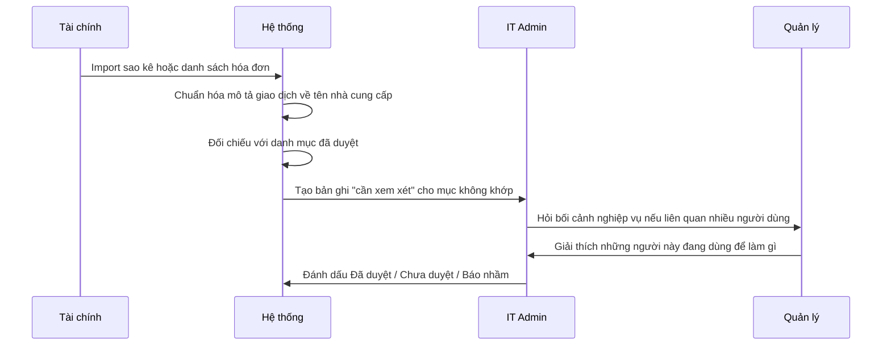

**Mức độ tin cậy tính từ phương pháp khớp, không lấy con số do mô hình tự khai:**

| Phương pháp                | Tin cậy    | Xử lý                       |
| -------------------------- | ---------- | --------------------------- |
| Khớp chính xác từ điển     | Cao        | Tự động chuẩn hóa           |
| Khớp theo mẫu              | Khá        | Tự động, có thể xem lại     |
| Khớp mờ                    | Trung bình | Đưa vào hàng đợi xem lại    |
| Gợi ý bởi mô hình ngôn ngữ | Thấp       | **Bắt buộc** người xác nhận |

**Quy tắc nghiệp vụ:**

| Mã      | Nội dung                                                                                                                     |
| ------- | ---------------------------------------------------------------------------------------------------------------------------- |
| BR-31.1 | Bản ghi phát hiện **không phải** kết luận vi phạm — là "có dấu hiệu một phần mềm chưa nằm trong danh mục", chờ người xem xét |
| BR-31.2 | Mỗi nhà cung cấp chỉ có một bản ghi đang mở; xuất hiện lại thì cập nhật lần thấy gần nhất và số lần, không tạo bản ghi mới   |
| BR-31.3 | Bản ghi đã đóng ở trạng thái báo nhầm mà xuất hiện lại thì được mở lại                                                       |
| BR-31.4 | Lưu **cả giá trị thô lẫn giá trị đã chuẩn hóa** kèm phương pháp khớp, để giải trình được                                     |
| BR-31.5 | Phân tầng rủi ro theo mức nhạy cảm dữ liệu, số nhân viên liên quan, và ứng dụng có hỗ trợ đăng nhập tập trung không          |

**Xong khi:** mỗi bản ghi có người chịu trách nhiệm và một quyết định cuối, không có bản ghi nào tự đóng.

---

### 6.4. F-34 · Hợp thức hóa ứng dụng vào danh mục

| #   | Ai  | Làm gì                                                                              | Hệ thống phản hồi                                                 |
| --- | --- | ----------------------------------------------------------------------------------- | ----------------------------------------------------------------- |
| 1   | IT  | Quyết định hợp thức hóa                                                             | Chuyển sang luồng F-06 để khai báo đầy đủ                         |
| 2   | IT  | Chỉ định người sở hữu nghiệp vụ, mức nhạy cảm dữ liệu, trả lời ba câu hỏi phân loại |                                                                   |
| 3   | HT  | —                                                                                   | Tạo yêu cầu mua chính thức để hợp thức hóa chi phí đang phát sinh |
| 4   | HT  | —                                                                                   | Đóng bản ghi phát hiện ở trạng thái đã duyệt                      |

**Quy tắc nghiệp vụ:**

| Mã      | Nội dung                                                                                                                           |
| ------- | ---------------------------------------------------------------------------------------------------------------------------------- |
| BR-34.1 | "Đã duyệt" là **kết cục bình thường và tích cực**, không phải ngoại lệ. Shadow IT thường là tín hiệu bộ công cụ đã duyệt còn thiếu |
| BR-34.2 | Người đang dùng ứng dụng đó được ghi nhận thành quyền chính thức, không bắt xin lại từ đầu                                         |

**Xong khi:** ứng dụng có mặt trong danh mục với đầy đủ thông tin, và những người đang dùng có quyền chính thức.

---

### 6.5. F-35 · Đối soát hóa đơn

| #   | Ai  | Làm gì         | Hệ thống phản hồi                                                                 |
| --- | --- | -------------- | --------------------------------------------------------------------------------- |
| 1   | TC  | Import hóa đơn | Ghép dòng hóa đơn về thuê bao tương ứng                                           |
| 2   | HT  | —              | So sánh số suất trên hóa đơn với số suất khai trong thuê bao và số suất đang dùng |
| 3   | TC  | Xem chênh lệch | Hiển thị ba con số cạnh nhau, không tự sửa cái nào                                |

**Quy tắc nghiệp vụ:**

| Mã      | Nội dung                                                                                                                        |
| ------- | ------------------------------------------------------------------------------------------------------------------------------- |
| BR-35.1 | Hệ thống **không tự sửa** thuê bao theo hóa đơn — xem F-43                                                                      |
| BR-35.2 | Chênh lệch phải quy được về một trong ba nguyên nhân: đã mua thêm chưa cập nhật, nhà cung cấp tính sai, hoặc dữ liệu nội bộ sai |

**Xong khi:** mọi dòng hóa đơn đều ghép được về một thuê bao, hoặc được đánh dấu là chi phí ngoài danh mục. _(v0.5)_ Hóa đơn khớp một yêu cầu đã duyệt chi thì khoản cam kết tương ứng chuyển sang _Đã thành chi phí_.

---

### 6.6. F-36 · Lập và theo dõi ngân sách _(✅ từ v0.5 — tới v0.4 chỉ đặc tả)_

|                    |                                                                                                                                               |
| ------------------ | --------------------------------------------------------------------------------------------------------------------------------------------- |
| **Mục đích**       | Có ngân sách để snapshot của bước duyệt chi và ghi nhận của Tài chính có số để so _(sửa ở v0.7)_, và để thấy tiền đã chi, đã hứa chi, còn lại |
| **Kích hoạt bởi**  | Tài chính nhập ngân sách cho kỳ mới; hoặc một khoản cam kết đổi trạng thái                                                                    |
| **Tiền điều kiện** | Đã có cost center (`F-01`)                                                                                                                    |

> **Vì sao chuyển từ 📐 sang ✅ — `QĐ-22`:** _(v0.7 — `QĐ-29b`: nay là **snapshot ngân sách** của bước duyệt chi và ghi nhận của Tài chính)_ bước _ý kiến ngân sách_ của `F-08`, `F-09`, `F-27` cần một con số _ngân sách còn lại_. Không có `F-36` thì bước đó chỉ còn là ý kiến cảm tính. Phạm vi hiện thực **tối thiểu**: nhập ngân sách, xem ba con số, theo dõi khoản cam kết — **không** gồm lập kế hoạch ngân sách nhiều phiên bản hay phê duyệt ngân sách.

**Các bước:**

| #   | Ai  | Làm gì                                                                 | Hệ thống phản hồi                                                                                       |
| --- | --- | ---------------------------------------------------------------------- | ------------------------------------------------------------------------------------------------------- |
| 1   | TC  | Nhập ngân sách cho từng cost center theo kỳ, nhập tay hoặc import file | Dùng khung import có bước xem trước (`FR-7.1`)                                                          |
| 2   | HT  | —                                                                      | Tính **ngân sách còn lại = ngân sách kỳ − thực chi − khoản cam kết đang giữ**                           |
| 3   | HT  | —                                                                      | Khi Người duyệt chi duyệt một yêu cầu có chi phí: tạo khoản cam kết _Đang giữ_                          |
| 4   | HT  | —                                                                      | Hóa đơn khớp (`F-35`) ⟹ _Đã thành chi phí_; yêu cầu bị hủy hoặc cấp phát thất bại hẳn ⟹ _Đã giải phóng_ |
| 5   | TC  | Xem bảng ngân sách theo cost center và kỳ                              | Ba con số cạnh nhau; bấm vào khoản cam kết thì mở yêu cầu nguồn                                         |

**Quy tắc nghiệp vụ:**

| Mã      | Nội dung                                                                                                                             |
| ------- | ------------------------------------------------------------------------------------------------------------------------------------ |
| BR-36.1 | Mỗi khoản cam kết gắn **đúng một** yêu cầu đã được Người duyệt chi duyệt; một yêu cầu có **tối đa một** khoản cam kết — BRD `INV-16` |
| BR-36.2 | Khoản cam kết **không chuyển ngược** từ _Đã thành chi phí_                                                                           |
| BR-36.3 | Vượt ngân sách **không chặn** việc duyệt chi — chỉ hiện cảnh báo và ý kiến của Tài chính (`BR-07.9`)                                 |
| BR-36.4 | Mọi số tiền theo quy tắc đa tiền tệ của `BR-29.1`                                                                                    |

**Xong khi:** ngân sách còn lại luôn bằng ngân sách kỳ trừ thực chi trừ khoản cam kết đang giữ; không có khoản cam kết nào không gắn với một yêu cầu đã duyệt chi.

---

## 7. Luồng xuyên suốt

_`F-37`, `F-38`, `F-40`, `F-43`, `F-44` thuộc `MF-0` (mục 1.4) · `F-41` thuộc `MF-1` (mục 1.5) · `F-42` thuộc `MF-3` (mục 1.7)._

### 7.1. F-37 và F-38 · Quản trị hệ thống và nhật ký

| Luồng    | Nội dung                                                                                                                              |
| -------- | ------------------------------------------------------------------------------------------------------------------------------------- |
| **F-37** | Quản trị hệ thống quản lý tài khoản đăng nhập, gán vai trò, cấu hình ngưỡng, thời hạn xử lý, chính sách lưu giữ, ngưỡng sai số dự báo |
| **F-38** | Xem nhật ký kiểm toán và trạng thái các tác vụ nền                                                                                    |

**Quy tắc nghiệp vụ:**

| Mã      | Nội dung                                                                                                                                                                                                                                                                              |
| ------- | ------------------------------------------------------------------------------------------------------------------------------------------------------------------------------------------------------------------------------------------------------------------------------------- |
| BR-37.1 | Quản trị hệ thống **không** gán suất và **không** phê duyệt yêu cầu nghiệp vụ                                                                                                                                                                                                         |
| BR-37.2 | Sửa **chính sách duyệt** (nhánh, chuỗi loại bước) không ảnh hưởng các yêu cầu đang chạy. _(v0.6 — `QĐ-28d`)_ Đổi **người giữ vai** — Người duyệt chi, người thay thế khi xung đột, người duyệt dự phòng ở gốc — thì bước đang chờ được xác định lại theo `BR-13.9`, SLA không đặt lại |
| BR-38.1 | Nhật ký kiểm toán chỉ ghi thêm, không sửa không xóa                                                                                                                                                                                                                                   |
| BR-38.2 | Tác vụ nền thất bại phải hiện lên, không im lặng bỏ qua                                                                                                                                                                                                                               |

**Xong khi:**

- **F-37** — mỗi vai trò chỉ làm được đúng những việc thuộc vai trò đó; **tám** nguyên tắc phân tách trách nhiệm đều có ít nhất một trường hợp bị hệ thống chặn _(sáu tới v0.4)_. _(v0.5)_ Quản trị hệ thống cấu hình thêm **Người duyệt chi** và **nội dung thông báo theo dõi có đánh phiên bản**; cấu hình không phải phê duyệt.
- **F-38** — mọi thay đổi có hậu quả đều truy được về một dòng nhật ký, và mọi tác vụ nền thất bại đều hiển thị được, không có tác vụ nào hỏng trong im lặng.

---

### 7.2. F-40 · Nhân viên xem và xuất dữ liệu của chính mình

|                   |                                                           |
| ----------------- | --------------------------------------------------------- |
| **Mục đích**      | Đáp ứng quyền truy cập dữ liệu của chủ thể dữ liệu        |
| **Kích hoạt bởi** | Nhân viên mở trang cá nhân, hoặc gửi yêu cầu xuất dữ liệu |

| #   | Ai  | Làm gì                   | Hệ thống phản hồi                                                                               |
| --- | --- | ------------------------ | ----------------------------------------------------------------------------------------------- |
| 1   | NV  | Mở trang dữ liệu của tôi | Hiển thị: các suất được cấp, lịch sử yêu cầu, và dữ liệu sử dụng đã tổng hợp **của chính mình** |
| 2   | NV  | Bấm xuất dữ liệu         | Ghi nhận thời điểm tiếp nhận yêu cầu                                                            |
| 3   | HT  | —                        | Sinh file, thông báo khi xong, ghi nhận thời điểm hoàn tất                                      |

**Quy tắc nghiệp vụ:**

| Mã      | Nội dung                                                                                                                       |
| ------- | ------------------------------------------------------------------------------------------------------------------------------ |
| BR-40.1 | Nhân viên chỉ xem được dữ liệu của chính mình, không xem được của đồng nghiệp                                                  |
| BR-40.2 | Hệ thống ghi nhận **thời điểm tiếp nhận và thời điểm hoàn tất** mỗi yêu cầu, phục vụ chứng minh đáp ứng đúng thời hạn quy định |
| BR-40.3 | Dữ liệu xuất ra ở định dạng đọc được, không phải kết xuất kỹ thuật thô                                                         |

**Xong khi:** nhân viên nhận được file chứa đầy đủ dữ liệu hệ thống đang lưu về mình, và thời gian xử lý được ghi nhận.

---

### 7.3. F-41 · Xóa dữ liệu hoạt động của người đã nghỉ

|                   |                                                                                       |
| ----------------- | ------------------------------------------------------------------------------------- |
| **Mục đích**      | Đáp ứng nghĩa vụ xóa dữ liệu cá nhân của người lao động khi chấm dứt quan hệ lao động |
| **Kích hoạt bởi** | Tác vụ chạy hằng ngày                                                                 |

| #   | Ai  | Làm gì                                                      | Hệ thống phản hồi                                                  |
| --- | --- | ----------------------------------------------------------- | ------------------------------------------------------------------ |
| 1   | HT  | Quét nhân viên đã nghỉ quá 30 ngày kể từ ngày làm việc cuối | Lọc danh sách cần xóa                                              |
| 2   | HT  | —                                                           | Xóa bản ghi hoạt động chi tiết theo ngày                           |
| 3   | HT  | —                                                           | **Giữ lại** dữ liệu tổng hợp đã phi định danh và nhật ký kiểm toán |
| 4   | HT  | —                                                           | Ghi nhật ký: số bản ghi đã xóa, thời điểm thực hiện                |

**Quy tắc nghiệp vụ:**

| Mã      | Nội dung                                                                                                                                |
| ------- | --------------------------------------------------------------------------------------------------------------------------------------- |
| BR-41.1 | Xóa là **xóa thật**, không phải đánh dấu ẩn                                                                                             |
| BR-41.2 | Dữ liệu tổng hợp giữ lại phải **không truy ngược được** về cá nhân                                                                      |
| BR-41.3 | Nhật ký kiểm toán không bị xóa theo chính sách này — nó phục vụ nghĩa vụ pháp luật khác                                                 |
| BR-41.4 | Muốn giữ lâu hơn mốc 30 ngày thì phải có thỏa thuận trong hợp đồng lao động hoặc chính sách nội bộ đã thông báo, không chỉ đặt cấu hình |

**Xong khi:** sau 30 ngày kể từ ngày làm việc cuối, tìm kiếm dữ liệu hoạt động của người đó trả về rỗng, nhưng báo cáo chi phí lịch sử vẫn đúng.

---

### 7.4. F-42 · Thông báo khi bắt đầu theo dõi một ứng dụng

|                   |                                                                                       |
| ----------------- | ------------------------------------------------------------------------------------- |
| **Mục đích**      | Đáp ứng điều kiện minh bạch khi áp dụng biện pháp công nghệ để quản lý người lao động |
| **Kích hoạt bởi** | IT lần đầu import dữ liệu sử dụng cho một ứng dụng                                    |

| #   | Ai  | Làm gì                          | Hệ thống phản hồi                                                                 |
| --- | --- | ------------------------------- | --------------------------------------------------------------------------------- |
| 1   | IT  | Import lần đầu cho một ứng dụng | Phát hiện đây là lần đầu, chặn trước bước ghi                                     |
| 2   | HT  | —                               | Yêu cầu xác nhận đã thông báo cho người lao động, hoặc gửi thông báo qua hệ thống |
| 3   | HT  | —                               | Gửi thông báo tới **mọi nhân viên đang giữ suất của ứng dụng đó**                 |
| 4   | HT  | —                               | Ghi nhật ký thời điểm thông báo, sau đó mới cho phép ghi dữ liệu                  |

**Nội dung thông báo tối thiểu:**

| Mục           | Nội dung                                                |
| ------------- | ------------------------------------------------------- |
| Ứng dụng nào  | Tên ứng dụng đang bắt đầu được theo dõi                 |
| Dữ liệu gì    | Ngày hoạt động và số lượt — **không** thu thập nội dung |
| Mục đích      | Phát hiện license không dùng để cắt giảm chi phí        |
| Lưu bao lâu   | Theo chính sách lưu giữ                                 |
| Xem lại ở đâu | Dẫn tới F-40                                            |

**Quy tắc nghiệp vụ:**

| Mã      | Nội dung                                                                                                                                                                                                                                                                                          |
| ------- | ------------------------------------------------------------------------------------------------------------------------------------------------------------------------------------------------------------------------------------------------------------------------------------------------- |
| BR-42.1 | Đây **không phải tính năng tùy chọn**. _(Sửa ở v0.5:)_ Nó là **biện pháp thiết kế** hiện thực yêu cầu _"người lao động biết rõ biện pháp đó"_ của **Điều 25 khoản 3 Luật 91/2025/QH15, đã đọc nguyên văn**. Tài liệu **không** khẳng định có nó thì việc thu thập đã hợp pháp — xem BRD mục 7.7.7 |
| BR-42.2 | Không cho ghi dữ liệu trước khi thông báo được ghi nhận                                                                                                                                                                                                                                           |
| BR-42.3 | Nhân viên được cấp suất **sau** thời điểm thông báo cũng nhận thông báo tại thời điểm được cấp                                                                                                                                                                                                    |
| BR-42.4 | _(mới ở v0.5 — `QĐ-20`)_ Với **bộ thu thập trên thiết bị**, thông báo **đơn thuần là không đủ**: nhân viên phải **bấm xác nhận chủ động**, hệ thống lưu **phiên bản nội dung thông báo và thời điểm**. Chưa xác nhận thì **không nhận dữ liệu** từ thiết bị đó — BRD `FR-4.18`, `INV-17`          |
| BR-42.5 | _(mới ở v0.5)_ Nội dung thông báo đổi ⟹ **phiên bản mới** ⟹ nhân viên phải xác nhận lại trước khi thiết bị tiếp tục gửi dữ liệu                                                                                                                                                                   |
| BR-42.6 | _(mới ở v0.5)_ Nhân viên có **nút yêu cầu dừng thu thập**; yêu cầu đi theo quy trình quyền chủ thể dữ liệu (`F-40`, BRD `FR-10.5`)                                                                                                                                                                |

**Xong khi:** không có dữ liệu hoạt động nào được ghi cho một ứng dụng mà chưa có bản ghi thông báo tương ứng.

---

### 7.5. F-43 · Xử lý khi các nguồn dữ liệu mâu thuẫn

|                   |                                                                       |
| ----------------- | --------------------------------------------------------------------- |
| **Mục đích**      | Không để hệ thống tự xóa mất bằng chứng của một vấn đề nghiệp vụ thật |
| **Kích hoạt bởi** | Bất kỳ lúc nào hai nguồn nói khác nhau                                |

**Nguyên tắc phân định:**

> **Dữ liệu nội bộ đã qua quy trình phê duyệt là nguồn chân lý về _ý định_. Dữ liệu từ nhà cung cấp là nguồn chân lý về _thực tế_. Khi hai thứ lệch nhau, đó là một sự kiện nghiệp vụ cần người xử lý, không phải lỗi dữ liệu cần tự sửa.**

**Bảy tình huống:**

| Tình huống                                                   | Nguồn nào thắng                             | Hệ thống làm gì                                     |
| ------------------------------------------------------------ | ------------------------------------------- | --------------------------------------------------- |
| Nhân sự nói đã nghỉ, nhà cung cấp vẫn còn tài khoản          | Nhân sự thắng **về trạng thái nhân viên**   | Sinh lãng phí G2 mức cần xử lý ngay                 |
| Nhà cung cấp có tài khoản, hệ thống không có quyền tương ứng | **Không nguồn nào thắng**                   | Sinh sai lệch; **không** tự tạo quyền               |
| Hệ thống có quyền, nhà cung cấp không có tài khoản           | **Không nguồn nào thắng**                   | Sinh sai lệch                                       |
| Số suất trên hóa đơn khác số suất khai trong thuê bao        | **Không nguồn nào thắng**                   | Đưa vào màn hình đối soát; **không** tự sửa         |
| File nhân sự mới thiếu một người đang giữ suất               | **Không nguồn nào thắng**                   | Không tự đánh dấu đã nghỉ, không tự xóa             |
| Hai file nhật ký cùng ứng dụng, cửa sổ chồng lấn             | Nguồn có cửa sổ **kết thúc muộn hơn** thắng | Hợp nhất theo khóa; ghi nguồn đã dùng cho từng dòng |
| Một định danh khớp về hai nhân viên                          | **Không nguồn nào thắng**                   | Đẩy vào hàng đợi chưa khớp, không dùng để kết luận  |

**Quy tắc nghiệp vụ:**

| Mã      | Nội dung                                                              |
| ------- | --------------------------------------------------------------------- |
| BR-43.1 | Hệ thống giữ nguyên **cả hai giá trị** khi có mâu thuẫn, không ghi đè |
| BR-43.2 | Mỗi bản ghi mâu thuẫn phải có người chịu trách nhiệm xử lý            |
| BR-43.3 | Mâu thuẫn không được tự đóng theo thời gian                           |

> **Vì sao không cho tự ghi đè:** ba trong bảy tình huống trên là **dấu hiệu của một vấn đề nghiệp vụ thật** — có người được cấp quyền ngoài quy trình, có người nghỉ việc mà chưa thu hồi, hoặc hóa đơn tính sai. Nếu hệ thống tự đồng bộ cho khớp, nó xóa mất chính bằng chứng mà nó sinh ra để tìm.

**Xong khi:** mọi mâu thuẫn đều có một quyết định của người thật được ghi nhận.

### 7.6. F-44 · Xóa dữ liệu quá hạn lưu giữ theo chính sách

> **Phân biệt với `F-41` — hai luồng, hai trigger, không thay nhau được:**
>
> |               | `F-41`                               | `F-44`                                                                               |
> | ------------- | ------------------------------------ | ------------------------------------------------------------------------------------ |
> | **Nguồn**     | `FR-10.6`                            | **`FR-10.3`**                                                                        |
> | **Kích hoạt** | Nhân viên chuyển sang _đã nghỉ việc_ | **Tác vụ chạy hằng ngày**, không gắn sự kiện nhân sự                                 |
> | **Đối tượng** | Người **đã nghỉ**                    | **Mọi** chủ thể dữ liệu, gồm người **đang làm việc**                                 |
> | **Mốc**       | 30 ngày sau ngày làm việc cuối       | **6 tháng** _(hoạt động chi tiết)_ · **24 tháng** _(tổng hợp, bằng chứng discovery)_ |
> | **Thuộc**     | `MF-1` · `WF-07`                     | `MF-0` · không phải workflow _(Business Workflows mục 2.3)_                          |
>
> Hai mốc của **cùng một bản ghi hoạt động chi tiết** chạy song song; **cái nào đến trước thì cái đó xóa** (BRD mục 7.5). Với người đã nghỉ, mốc 30 ngày gần như luôn đến trước — nhưng `F-44` vẫn phải phủ, vì người **chưa** nghỉ không có mốc nào khác.

|                    |                                                                                         |
| ------------------ | --------------------------------------------------------------------------------------- |
| **Mục đích**       | Không giữ dữ liệu lâu hơn chính sách đã công bố, và chứng minh được điều đó             |
| **Kích hoạt bởi**  | Tác vụ chạy hằng ngày                                                                   |
| **Tiền điều kiện** | Quản trị hệ thống đã cấu hình chính sách lưu giữ (`F-37`); mọi bản ghi có mốc thời gian |

**Năm lớp dữ liệu trong phạm vi chính sách và cách xử lý — theo BRD mục 7.5, không diễn giải thêm:**

| Lớp dữ liệu                                                 | Thời hạn                                                           | Hành động        |
| ----------------------------------------------------------- | ------------------------------------------------------------------ | ---------------- |
| Bản ghi hoạt động chi tiết theo ngày — **mọi ứng dụng**     | **6 tháng**, hoặc 30 ngày sau ngày làm việc cuối _(`F-41`)_        | Xóa thật         |
| Bản ghi hoạt động của **nhóm dịch vụ liên lạc**             | Như trên; chỉ phát sinh khi doanh nghiệp **chủ động bật** thu thập | Xóa thật         |
| Dữ liệu tổng hợp **đã phi định danh** theo ứng dụng, đơn vị | **24 tháng**                                                       | Xóa thật         |
| Bằng chứng discovery từ sao kê, hóa đơn                     | **24 tháng**                                                       | Xóa thật         |
| **Nhật ký kiểm toán**                                       | Theo pháp luật kế toán, kiểm toán và nội quy doanh nghiệp          | ⛔ **KHÔNG xóa** |

> ⚠️ **Hai thứ khác nhau, đừng gộp — sửa 09/09/2026 sau kiểm chéo (`UF-RET-01`):**
>
> |                                                                                                                             | Là gì                                                                         | `F-44` làm gì                                                                                                                                                       | Nguồn                                      |
> | --------------------------------------------------------------------------------------------------------------------------- | ----------------------------------------------------------------------------- | ------------------------------------------------------------------------------------------------------------------------------------------------------------------- | ------------------------------------------ |
> | **Bằng chứng discovery từ sao kê, hóa đơn**                                                                                 | Dữ liệu import của phân hệ phát hiện ngoài danh mục _(BRD mục 5.6, `FR-6.3`)_ | **Xóa thật ở mốc 24 tháng.** Đây **không** phải ngoại lệ, kể cả khi bản ghi là một dòng hóa đơn                                                                     | BRD mục 7.5, hàng cuối bảng lưu giữ        |
> | **Hồ sơ tài chính của phân hệ hợp đồng và chi tiêu** — hợp đồng, tệp hóa đơn/thanh toán đính kèm, thuê bao, bản ghi chi phí | Dữ liệu doanh nghiệp của phân hệ 5.1 và 5.5 _(BRD mục 7.7.2)_                 | **Không quét tới** — chúng **không nằm trong** bảng lưu giữ BRD mục 7.5, nên không có mốc để xóa. Đây là _ngoài phạm vi chính sách_, **không** phải _được miễn xóa_ | BRD mục 7.5 _(không liệt kê)_ và mục 7.7.2 |
>
> **Ngoại lệ được ghi trong chính sách chỉ có một: nhật ký kiểm toán** — BRD mục 7.5 ghi _"chỉ ghi thêm; **không** xóa theo chính sách này"_. Muốn đặt mốc lưu giữ cho nhóm hồ sơ tài chính thì phải có **chính sách riêng, nêu tên loại hồ sơ, phạm vi và nguồn** — `F-44` không tự đặt. Đây là đồng bộ đặc tả thiết kế, **không** phải kết luận pháp lý.

**Các bước:**

| #   | Ai  | Làm gì                                          | Hệ thống phản hồi                                                                                                                                   |
| --- | --- | ----------------------------------------------- | --------------------------------------------------------------------------------------------------------------------------------------------------- |
| 1   | HT  | Quét từng lớp dữ liệu theo mốc riêng của lớp đó | Lập danh sách bản ghi quá hạn, tách theo lớp                                                                                                        |
| 2   | HT  | —                                               | Xóa thật các bản ghi quá hạn                                                                                                                        |
| 3   | HT  | —                                               | **Giữ nguyên nhật ký kiểm toán** — ngoại lệ duy nhất của chính sách. Không chạm hồ sơ tài chính phân hệ 5.1/5.5 vì chúng nằm **ngoài** bảng lưu giữ |
| 4   | HT  | —                                               | Ghi nhật ký: **số bản ghi đã xóa** theo từng lớp, thời điểm thực hiện                                                                               |
| 5   | QT  | Xem trạng thái tác vụ nền                       | Hiện lần chạy gần nhất, kết quả, số bản ghi xử lý và lỗi — dùng chung `F-38`                                                                        |

**Quy tắc nghiệp vụ:**

| Mã      | Nội dung                                                                                                                                                                                                                                                                                                                                                    |
| ------- | ----------------------------------------------------------------------------------------------------------------------------------------------------------------------------------------------------------------------------------------------------------------------------------------------------------------------------------------------------------- |
| BR-44.1 | Mốc **6 tháng** áp cho **mọi** nhân viên, không chỉ người đã nghỉ. Người đang làm việc vẫn được xóa dữ liệu hoạt động cũ hơn mốc                                                                                                                                                                                                                            |
| BR-44.2 | Xóa là **xóa thật**, không đánh dấu ẩn và không "phi định danh" bằng cách chỉ đổi tên hiển thị                                                                                                                                                                                                                                                              |
| BR-44.3 | **Ngoại lệ duy nhất của chính sách này là nhật ký kiểm toán** — chỉ ghi thêm, không xóa (BRD mục 7.5). **Bằng chứng discovery từ sao kê và hóa đơn KHÔNG phải ngoại lệ**: vẫn xóa thật ở mốc 24 tháng. Hồ sơ tài chính của phân hệ 5.1/5.5 nằm ngoài bảng lưu giữ nên tác vụ này không quét tới; đặt mốc cho chúng cần một chính sách riêng có tên và nguồn |
| BR-44.4 | Mỗi lần chạy ghi **số bản ghi đã xóa theo từng lớp** và thời điểm — đây là bằng chứng đáp ứng `FR-10.3`, không phải log kỹ thuật                                                                                                                                                                                                                            |
| BR-44.5 | Muốn giữ lâu hơn mốc đã công bố thì phải có **thỏa thuận** trong hợp đồng lao động hoặc chính sách nội bộ đã thông báo, không chỉ đổi cấu hình (`BR-41.4`)                                                                                                                                                                                                  |

**Ngoại lệ:**

| Tình huống                                                    | Xử lý                                                                                         |
| ------------------------------------------------------------- | --------------------------------------------------------------------------------------------- |
| Bản ghi vừa quá hạn 6 tháng nhưng người đó cũng vừa nghỉ việc | Không xóa hai lần; lớp dữ liệu chỉ có một trạng thái, mốc nào đến trước thì lần chạy đó xử lý |
| Tác vụ chạy thất bại                                          | Nổi lên bảng trạng thái tác vụ nền, **không im lặng bỏ qua** (`BR-38.2`)                      |
| Doanh nghiệp chưa bật thu thập cho nhóm dịch vụ liên lạc      | Không có dữ liệu loại đó để xóa; không coi là lỗi                                             |

**Xong khi:** không còn bản ghi nào cũ hơn mốc lưu giữ của lớp mình — **kể cả bằng chứng discovery từ sao kê, hóa đơn quá 24 tháng**; **nhật ký kiểm toán vẫn nguyên vẹn**; hồ sơ tài chính của phân hệ 5.1/5.5 không bị tác vụ này đụng tới vì nằm ngoài bảng lưu giữ; và mỗi lần chạy đều có con số bản ghi đã xóa theo từng lớp để trình bày.

---

### 7.7. F-45 · Triển khai và vận hành tiện ích trình duyệt trên thiết bị công ty _(mới ở v0.5 — `QĐ-20`)_

|                                             |                                                                                                                                                                                                                                             |
| ------------------------------------------- | ------------------------------------------------------------------------------------------------------------------------------------------------------------------------------------------------------------------------------------------- |
| **Mục đích**                                | Biết nhân viên **có thật sự mở** SaaS công ty đang trả tiền, mà máy chủ không bao giờ nhận dữ liệu vượt mục đích                                                                                                                            |
| **Kích hoạt bởi**                           | IT đăng ký một thiết bị công ty cho một nhân viên; sau đó tiện ích gửi bản tổng hợp mỗi ngày                                                                                                                                                |
| **Tiền điều kiện**                          | Doanh nghiệp quản lý được trình duyệt trên máy công ty cấp (BRD `GĐ-9`); đã có danh mục và từ điển nhà cung cấp; nội dung thông báo theo dõi đã được cấu hình (`F-37`)                                                                      |
| **Cách cài trong demo** _(v0.6 — `QĐ-28b`)_ | Tiện ích nạp bằng **Developer mode → Load unpacked** trên máy thành viên nhóm. **Cài bắt buộc** qua chính sách trình duyệt được quản lý là **thiết kế triển khai** tại doanh nghiệp — **chưa** triển khai hay kiểm chứng live (BRD `OQ-18`) |

**Các bước:**

| #   | Ai  | Làm gì                                                                                              | Hệ thống phản hồi                                                                                                   |
| --- | --- | --------------------------------------------------------------------------------------------------- | ------------------------------------------------------------------------------------------------------------------- |
| 1   | IT  | Đăng ký thiết bị công ty ↔ nhân viên, có ngày hiệu lực                                              | Ghi đăng ký; **chưa** nhận dữ liệu từ thiết bị                                                                      |
| 2   | HT  | —                                                                                                   | Sinh **danh sách cho phép**: tên miền của SaaS trong danh mục và từ điển, **trừ mọi ứng dụng mang cờ liên lạc**     |
| 3   | HT  | —                                                                                                   | Gửi thông báo theo dõi cho nhân viên theo `F-42`                                                                    |
| 4   | NV  | Đọc thông báo và **bấm xác nhận**                                                                   | Lưu phiên bản nội dung và thời điểm; mở cổng nhận dữ liệu cho thiết bị                                              |
| 5   | HT  | _(tiện ích trên máy)_ Đo thời gian tab thuộc danh sách đang ở phía trước khi trình duyệt không rảnh | **Bỏ ngay trên máy** mọi tên miền ngoài danh sách, URL đầy đủ, tiêu đề, nội dung                                    |
| 6   | HT  | _(tiện ích trên máy)_ Gửi bản tổng hợp theo ngày: thiết bị, tên miền, ngày, số phút làm tròn        | Cổng nhận kiểm tra: thiết bị đã đăng ký, nhân viên đã xác nhận, không có trường ngoài lược đồ — sai thì **từ chối** |
| 7   | HT  | —                                                                                                   | Đưa vào nguồn usage theo `F-17` (khớp danh tính, cửa sổ bao phủ, định nghĩa hoạt động)                              |
| 8   | IT  | Xem trạng thái bộ thu thập                                                                          | Số thiết bị đã đăng ký, đã xác nhận, lần gửi gần nhất, số bản ghi bị từ chối và lý do                               |

**Quy tắc nghiệp vụ:**

| Mã      | Nội dung                                                                                                                                              |
| ------- | ----------------------------------------------------------------------------------------------------------------------------------------------------- |
| BR-45.1 | **Chưa xác nhận thì không có dữ liệu.** Không có đường nào để dữ liệu từ thiết bị vào hệ thống trước bước 4 — BRD `INV-17`                            |
| BR-45.2 | **Lọc tại nguồn là bắt buộc**, lọc ở máy chủ chỉ là lớp phòng thủ thứ hai — BRD `ADR-13`                                                              |
| BR-45.3 | **Không bao giờ** thu: URL đầy đủ, tiêu đề trang, nội dung, phím bấm, ảnh màn hình, vị trí, tên miền ngoài danh sách                                  |
| BR-45.4 | Ứng dụng mang cờ liên lạc **không bao giờ** nằm trong danh sách cho phép — `ADR-10` giữ nguyên                                                        |
| BR-45.5 | Định nghĩa hoạt động khai báo theo `FR-4.16`: đang ở phía trước **và** không rảnh, cộng dồn **≥ N phút/ngày**                                         |
| BR-45.6 | Chỉ dùng cho tối ưu license. **Không** có màn hình xếp hạng thời gian dùng theo người; Manager chỉ thấy _có / không hoạt động_ — BRD `SoD-2`, `ĐK-09` |
| BR-45.7 | Nhân viên nghỉ việc ⟹ đăng ký thiết bị hết hiệu lực; dữ liệu xóa theo `F-41`, `F-44`                                                                  |

**Ngoại lệ:**

| Tình huống                            | Xử lý                                                                                                                                                                                                                          |
| ------------------------------------- | ------------------------------------------------------------------------------------------------------------------------------------------------------------------------------------------------------------------------------ |
| Nhân viên không xác nhận              | Không nhận dữ liệu; ứng dụng của người đó chỉ còn G1/G2 từ nguồn nhà cung cấp; hiện trên trạng thái bộ thu thập                                                                                                                |
| Nhân viên yêu cầu dừng thu thập       | Đi theo `F-40`; khi xử lý xong thì thiết bị ngừng được nhận dữ liệu                                                                                                                                                            |
| Nội dung thông báo đổi                | Phiên bản mới; nhân viên phải xác nhận lại (`BR-42.5`)                                                                                                                                                                         |
| Thiết bị không gửi dữ liệu nhiều ngày | Không suy ra _không hoạt động_; cửa sổ bao phủ của nguồn dừng ở ngày gửi cuối                                                                                                                                                  |
| Tiện ích bị gỡ                        | Trong demo _load unpacked_, người dùng gỡ được — ghi thành điểm mù, không kết luận _không hoạt động_. Việc cài bắt buộc chặn gỡ trên trình duyệt được quản lý là thiết kế triển khai, chưa kiểm chứng (`OQ-18`) _(sửa ở v0.6)_ |

**Xong khi:** không có bản ghi nào từ thiết bị chưa đăng ký hoặc nhân viên chưa xác nhận; kiểm thử gửi tên miền ngoài danh sách, ứng dụng liên lạc, hay trường ngoài lược đồ **đều bị chặn**; và ít nhất một ứng dụng chỉ có G1/G2 từ nhà cung cấp được đánh giá G3/G4 bằng dữ liệu tiện ích thật.

---

### 7.8. F-46 · Phát hiện SaaS ngoài danh mục từ bộ thu thập _(mới ở v0.5 — `QĐ-20`)_

|                    |                                                                                                       |
| ------------------ | ----------------------------------------------------------------------------------------------------- |
| **Mục đích**       | Thêm nguồn bằng chứng thứ ba _"ai đang thực sự mở"_ cho các SaaS **đã biết** nhưng chưa được duyệt    |
| **Kích hoạt bởi**  | Tác vụ tổng hợp dữ liệu bộ thu thập, chạy theo lịch                                                   |
| **Tiền điều kiện** | `F-45` đang chạy; tên miền nằm trong **từ điển nhà cung cấp** nhưng **không** thuộc danh mục đã duyệt |

| #   | Ai  | Làm gì                                                  | Hệ thống phản hồi                                                                              |
| --- | --- | ------------------------------------------------------- | ---------------------------------------------------------------------------------------------- |
| 1   | HT  | Tổng hợp tên miền trong từ điển mà không thuộc danh mục | Tạo hoặc cập nhật bản ghi phát hiện theo nhà cung cấp — **dùng chung** quy trình `F-31`/`F-32` |
| 2   | HT  | —                                                       | Ghi bằng chứng: số nhân viên đã xác nhận có mở, khoảng ngày — **không** ghi URL                |
| 3   | IT  | Xử lý như `F-31`/`F-32`                                 | Đã duyệt → `F-34`; chưa duyệt; báo nhầm                                                        |

**Quy tắc nghiệp vụ:**

| Mã      | Nội dung                                                                                                                                                                                    |
| ------- | ------------------------------------------------------------------------------------------------------------------------------------------------------------------------------------------- |
| BR-46.1 | **Chỉ tên miền đã có trong từ điển** mới được xét. Tên miền lạ chưa có trong từ điển đã bị bỏ ngay trên máy (`BR-45.3`), nên nguồn này **mù với SaaS hoàn toàn mới** — ghi rõ khi trình bày |
| BR-46.2 | Một nhà cung cấp chỉ có **một** bản ghi phát hiện đang mở, dù bằng chứng đến từ ba nguồn — BRD `INV-13`                                                                                     |
| BR-46.3 | Bản ghi phát hiện **không phải kết luận vi phạm** — BRD `FR-6.6`                                                                                                                            |

**Xong khi:** mỗi SaaS đã biết mà nhân viên đang mở ngoài danh mục đều có đúng một bản ghi phát hiện với bằng chứng từ bộ thu thập, và có quyết định của IT.

---

### 7.9. F-47 · Xem báo cáo hiệu suất và chất lượng _(mới ở v0.5 — `QĐ-24`)_

|                   |                                                                  |
| ----------------- | ---------------------------------------------------------------- |
| **Mục đích**      | Trả lời _"hệ thống chạy có hiệu quả không, và tin được tới đâu"_ |
| **Kích hoạt bởi** | Người dùng mở màn hình báo cáo                                   |

**Nội dung theo nhóm báo cáo — BRD `FR-5.10` → `FR-5.12`:**

| Nhóm                    | Chỉ số                                                                                                                                                                                                                                        | Ai xem                                                                         |
| ----------------------- | --------------------------------------------------------------------------------------------------------------------------------------------------------------------------------------------------------------------------------------------- | ------------------------------------------------------------------------------ |
| **Hiệu suất sử dụng**   | `KPI-3`; số suất theo G1 → G4; **chi phí trên mỗi người dùng có hoạt động**                                                                                                                                                                   | IT Admin; Người duyệt chi dạng tóm tắt; Manager chỉ phạm vi cấp dưới, tổng hợp |
| **Hiệu suất quy trình** | `KPI-2` tách theo từng bước — nhu cầu, đánh giá IT, duyệt chi, cấp phát; thời gian Tài chính phản hồi và ghi nhận **đo riêng**; **tỷ lệ bước quá SLA**; `KPI-4`; **tổng hợp suất cấp theo nhánh không chi phí** _(v0.7 — `QĐ-29a`, `QĐ-29b`)_ | IT Admin, Super Admin; Người duyệt chi dạng tóm tắt                            |
| **Chất lượng**          | `KPI-5`; `KPI-1`; tỷ lệ định danh đã khớp; độ mới từng nguồn; số sai lệch đang mở; tỷ lệ thuê bao thiếu hạn chót báo hủy; **trạng thái bộ thu thập**                                                                                          | IT Admin; Super Admin (gồm `KPI-5`)                                            |

**Quy tắc nghiệp vụ:**

| Mã      | Nội dung                                                                                                                                                              |
| ------- | --------------------------------------------------------------------------------------------------------------------------------------------------------------------- |
| BR-47.1 | _Chi phí trên mỗi người dùng có hoạt động_ **chỉ tính** cho gói theo đầu người **và** ứng dụng có nguồn phát hiện được G3/G4; không đủ điều kiện thì **ẩn kèm lý do** |
| BR-47.2 | **Không đặt con số mục tiêu** cho KPI — BRD `OQ-10`                                                                                                                   |
| BR-47.3 | Mọi con số bấm được để xem căn cứ tính, như `F-29`                                                                                                                    |
| BR-47.4 | Không có báo cáo nào xếp hạng nhân viên theo thời gian sử dụng (`BR-45.6`)                                                                                            |

**Xong khi:** mỗi vai trò chỉ thấy đúng nhóm báo cáo của mình; mọi chỉ số hiển thị kèm khoảng thời gian tính và thời điểm cập nhật, hoặc ẩn kèm lý do.

---

### 7.10. F-48 · Agent trên máy công ty _(mới ở v0.5 — 📐 chỉ đặc tả)_

> **📐 Không hiện thực trong MVP** — `QĐ-20`. Nâng lên ✅ bằng một quyết định riêng nếu còn thời gian hoặc GVHD yêu cầu. Khi đó cập nhật bảng mục 1.2 và số đếm ở Định nghĩa Phạm vi mục 5.2.

|                    |                                                                                      |
| ------------------ | ------------------------------------------------------------------------------------ |
| **Mục đích**       | Mở rộng `F-45` sang **ứng dụng desktop** — Figma desktop, Cursor, ứng dụng văn phòng |
| **Kích hoạt bởi**  | Như `F-45`                                                                           |
| **Tiền điều kiện** | Như `F-45`, cộng: doanh nghiệp cài được phần mềm trên máy công ty                    |

**Khác biệt so với `F-45`, còn lại áp nguyên vẹn `BR-45.1` → `BR-45.7`:**

| Mục                   | Agent                                                                                                                                                                                  |
| --------------------- | -------------------------------------------------------------------------------------------------------------------------------------------------------------------------------------- |
| Quan sát              | **Tên tiến trình** trong danh sách cho phép; thời gian cửa sổ ở phía trước khi máy không rảnh; danh sách phần mềm đã cài                                                               |
| **Không bao giờ thu** | **Tiêu đề cửa sổ** _(có thể chứa tên tài liệu, nội dung tin nhắn)_, phím bấm, ảnh màn hình, tiến trình ngoài danh sách                                                                 |
| Công nghệ đã đánh giá | ActivityWatch _(MPL-2.0, lưu cục bộ, có REST API — **mặc định ghi tiêu đề cửa sổ**, nên cần bộ xuất dữ liệu bỏ tiêu đề trước khi gửi)_; osquery để kiểm kê phần mềm và tiện ích đã cài |

**Xong khi** _(khi được nâng lên ✅)_: đạt đủ tiêu chí của `F-45`, cộng kiểm thử chứng minh **không có tiêu đề cửa sổ nào** rời khỏi máy.

---

## 8. Bảng tổng hợp tiêu chí hoàn thành

Dùng để viết kịch bản kiểm thử. Cột **MF** cho biết luồng nằm ở main flow nào.

| Luồng    | MF   | Coi là xong khi                                                                                                                                                 |
| -------- | ---- | --------------------------------------------------------------------------------------------------------------------------------------------------------------- |
| F-01     | MF-0 | Bảng điều khiển hiển thị tổng chi phí, tổng suất và ít nhất một cảnh báo có thật                                                                                |
| F-02     | MF-1 | Nhân viên mới đăng nhập được vào mọi ứng dụng đã duyệt trong ngày đầu                                                                                           |
| F-03     | MF-1 | Báo cáo chi phí tháng trước ngày chuyển vẫn hiển thị đơn vị cũ                                                                                                  |
| F-04     | MF-1 | Người vừa quay lại sau nghỉ dài không xuất hiện trong hàng đợi khuyến nghị                                                                                      |
| F-05     | MF-1 | Không còn suất nào gắn với người đã nghỉ; sau 30 ngày dữ liệu hoạt động đã xóa                                                                                  |
| F-39     | MF-1 | Không có quyền có thời hạn nào tồn tại quá 7 ngày sau hạn mà không có quyết định                                                                                |
| F-06     | MF-0 | Ứng dụng xuất hiện trong danh mục và lịch cảnh báo gia hạn đã có mốc                                                                                            |
| F-07/08  | MF-2 | Người yêu cầu nhận thông báo có quyền; đo được thời gian từng bước. _(v0.5)_ `F-08`: đúng một khoản cam kết _Đang giữ_; bước duyệt chi đo riêng                 |
| F-09     | MF-2 | Ứng dụng vào danh mục, hoặc có quyết định không duyệt kèm gợi ý thay thế                                                                                        |
| F-10/11  | MF-2 | Có bằng chứng tài khoản đã tồn tại phía nhà cung cấp                                                                                                            |
| F-12     | MF-2 | Mọi việc thất bại đều có một quyết định được ghi nhận                                                                                                           |
| F-13     | MF-2 | Không bước nào bị đổi người vì nghẽn; mọi lần xác định lại truy được về sự kiện dữ liệu; khoản chi Người duyệt chi xung đột vẫn có quyết định _(v0.6)_          |
| F-14/15  | MF-2 | Suất về trạng thái trống, hoặc được ghi nhận để giảm tại kỳ gia hạn                                                                                             |
| F-17     | MF-3 | Không dòng nào được ghi trước khi người dùng xác nhận                                                                                                           |
| F-18     | MF-3 | Không có kết luận nào sinh từ dữ liệu chưa khớp danh tính                                                                                                       |
| F-19/20  | MF-3 | Mỗi khuyến nghị kèm đủ căn cứ để phản biện được                                                                                                                 |
| F-21     | MF-3 | Mọi khuyến nghị mức cần xem xét trở lên có quyết định kèm lý do trong một chu kỳ                                                                                |
| F-22/23  | MF-3 | Suất về trống, khuyến nghị đóng, tiết kiệm ghi **đúng loại**                                                                                                    |
| F-26     | MF-4 | Mọi thuê bao tự gia hạn đều có quyết định trước hạn báo hủy                                                                                                     |
| F-27     | MF-4 | Có bản ghi thuê bao kỳ mới, so sánh được với kỳ trước; _(v0.7)_ quyết định do Người duyệt chi trên snapshot ngân sách, Tài chính ghi nhận sau                   |
| F-28     | MF-4 | Mọi sai lệch có quyết định của người thật                                                                                                                       |
| F-29     | MF-5 | Mọi con số bấm được để xem căn cứ tính                                                                                                                          |
| F-30     | MF-5 | Dự báo hiển thị kèm đủ bốn thông tin, hoặc không hiển thị kèm lý do                                                                                             |
| F-31/32  | MF-5 | Mỗi bản ghi có người chịu trách nhiệm và quyết định cuối                                                                                                        |
| F-34     | MF-5 | Ứng dụng có mặt trong danh mục đầy đủ; người đang dùng có quyền chính thức                                                                                      |
| F-35     | MF-5 | Mọi dòng hóa đơn ghép được về thuê bao, hoặc đánh dấu ngoài danh mục                                                                                            |
| **F-36** | MF-5 | **Ngân sách còn lại luôn bằng ngân sách kỳ − thực chi − cam kết đang giữ; không khoản cam kết nào mồ côi** _(✅ từ v0.5)_                                       |
| **F-37** | MF-0 | **Mỗi vai trò chỉ làm được việc thuộc vai trò đó; tám nguyên tắc phân tách trách nhiệm đều có trường hợp bị chặn** _(mới ở v0.3; tám từ v0.5)_                  |
| **F-38** | MF-0 | **Mọi thay đổi có hậu quả truy được về một dòng nhật ký; không tác vụ nền nào hỏng trong im lặng** _(mới ở v0.3)_                                               |
| F-40     | MF-0 | Nhân viên nhận được file đầy đủ dữ liệu về mình; thời gian xử lý được ghi                                                                                       |
| F-41     | MF-1 | Sau 30 ngày, dữ liệu hoạt động rỗng nhưng báo cáo chi phí lịch sử vẫn đúng                                                                                      |
| F-42     | MF-3 | Không có dữ liệu hoạt động nào được ghi mà chưa có bản ghi thông báo; _(v0.5)_ với bộ thu thập — chưa có xác nhận chủ động thì không nhận dữ liệu               |
| F-43     | MF-0 | Mọi mâu thuẫn có một quyết định của người thật                                                                                                                  |
| F-44     | MF-0 | Không còn bản ghi nào cũ hơn mốc lưu giữ của lớp mình, kể cả bằng chứng discovery quá 24 tháng; nhật ký kiểm toán vẫn nguyên vẹn                                |
| **F-45** | MF-3 | **Không bản ghi nào từ thiết bị chưa đăng ký hoặc chưa xác nhận; tên miền ngoài danh sách, ứng dụng liên lạc, trường ngoài lược đồ đều bị chặn** _(mới ở v0.5)_ |
| **F-46** | MF-5 | **Mỗi SaaS đã biết đang được mở ngoài danh mục có đúng một bản ghi phát hiện kèm quyết định** _(mới ở v0.5)_                                                    |
| **F-47** | MF-5 | **Mỗi vai trò chỉ thấy đúng nhóm báo cáo của mình; chỉ số kèm khoảng tính, hoặc ẩn kèm lý do** _(mới ở v0.5)_                                                   |

> Bảng này **không có dòng** cho `F-16`, `F-24`, `F-48` (📐 chỉ đặc tả) và `F-25`, `F-33` (❌ ngoài phạm vi) — đúng theo phạm vi ở mục 1.2. _(v0.5 — `F-36` nay có dòng vì đã chuyển sang ✅.)_

---

## 9. Mười chỗ luồng dễ đứt _(tám tới v0.4)_

| #      | Chỗ đứt                                                        | Ở main flow nào       | Hậu quả                                                                                  | Cách phòng                                                                                                                                                                                                                            |
| ------ | -------------------------------------------------------------- | --------------------- | ---------------------------------------------------------------------------------------- | ------------------------------------------------------------------------------------------------------------------------------------------------------------------------------------------------------------------------------------- |
| 1      | Người duyệt vắng hoặc nghẽn _(sửa ở v0.6)_                     | MF-2 B2.4             | Toàn bộ luồng treo, nhân viên quay lại đường tắt                                         | **Không** ủy quyền: SLA từng bước, nhắc, thông báo, cảnh báo backlog cho Quản trị hệ thống (`BR-13.8`); người duyệt dự phòng ở gốc khi không có quản lý                                                                               |
| 2      | Hết suất khi đã tới bước IT                                    | MF-2 B2.5             | Hủy phiếu bắt làm lại thì mất niềm tin vào quy trình                                     | Chèn bước duyệt chi vào luồng đang chạy _(v0.5; sửa v0.7)_                                                                                                                                                                            |
| 3      | Cấp phát thất bại rồi bị quên                                  | MF-2 B2.6             | Nhân viên đã được duyệt nhưng không bao giờ có tài khoản                                 | Việc lỗi nổi lên bảng điều khiển sau 7 ngày                                                                                                                                                                                           |
| 4      | Import thiếu khoảng bao phủ                                    | MF-3 B3.1             | Kết luận sai hàng loạt mà không có dấu hiệu gì                                           | Bắt buộc khai; chỉ đánh giá suất nằm trong cửa sổ                                                                                                                                                                                     |
| 5      | Không biết nguồn hiểu "hoạt động" là gì                        | MF-3 B3.1             | Nhận nhiễu làm tín hiệu, kết quả phát hiện về gần 0                                      | Mẫu cấu hình bắt buộc khai định nghĩa hoạt động                                                                                                                                                                                       |
| 6      | Quản lý bị ngập thông báo                                      | MF-3 B3.3             | Bỏ qua toàn bộ, phân hệ mất tác dụng dù chạy đúng                                        | Mức theo dõi không gửi thông báo; gộp theo tuần                                                                                                                                                                                       |
| 7      | Khuyến nghị tách rời khỏi lịch gia hạn                         | MF-3 B3.6 → MF-4 B4.2 | Phát hiện đúng nhưng không bao giờ thành tiền                                            | Mốc gia hạn hiển thị kèm khuyến nghị của chính thuê bao                                                                                                                                                                               |
| 8      | Thu thập dữ liệu trước khi thông báo                           | MF-0 B0.6 → MF-3 F-42 | Mất cơ sở pháp lý cho toàn bộ phân hệ phát hiện                                          | F-42 chặn ghi dữ liệu trước khi có bản ghi thông báo                                                                                                                                                                                  |
| **9**  | **Thiết bị gửi dữ liệu trước khi nhân viên xác nhận** _(v0.5)_ | MF-3 F-45             | Xử lý dữ liệu nhạy cảm trái Điều 25 khoản 3 Luật 91/2025; phạt tới 3 tỷ đồng với tổ chức | Cổng nhận từ chối theo `INV-17`; kiểm thử phủ định bắt buộc                                                                                                                                                                           |
| **10** | **Người duyệt chi duy nhất thành nút thắt** _(v0.5)_           | MF-2 B2.5b            | Yêu cầu có chi phí dồn về một người, nhân viên quay lại đường tắt                        | Nhánh không chi phí không đi qua _(Owner xác nhận — `QĐ-29a`)_; Tài chính không nằm trên đường duyệt (`QĐ-29b`); cảnh báo backlog `BR-13.8`; KPI-2 đo riêng bước duyệt chi — chậm thì mở lại ma trận nhiều mức _(v0.6 — bỏ ủy quyền)_ |

> Bảy trong tám chỗ đứt nằm ở `MF-2` và `MF-3` — đúng hai main flow phục vụ `PP-5` và `PP-1`, hai pain point có nhiều người hưởng lợi nhất và cũng là hai chuỗi demo được ưu tiên phát triển trước. Đây không phải trùng hợp: chỗ nào tạo ra nhiều giá trị nhất thì cũng là chỗ có nhiều mắt xích nhất để đứt.

---

## 10. Cần team quyết

| #      | Câu hỏi                                                                                   | Đề xuất                                                                                                                                                                                                                                                                                                                               |
| ------ | ----------------------------------------------------------------------------------------- | ------------------------------------------------------------------------------------------------------------------------------------------------------------------------------------------------------------------------------------------------------------------------------------------------------------------------------------- |
| 1      | Seat có đi theo người khi đổi người quản lý hoặc cost center không? _(sửa chữ ở v0.5)_    | Có; chỉ đổi đơn vị chịu chi phí. Quản lý mới nhận danh sách xem lại                                                                                                                                                                                                                                                                   |
| 2      | Thời gian xử lý tính theo giờ làm việc hay giờ đồng hồ?                                   | Giờ làm việc. Nếu không kịp làm thì ghi rõ giới hạn trong tài liệu                                                                                                                                                                                                                                                                    |
| 3      | ~~Rule phát hiện chạy hằng ngày hay hằng tuần?~~ **ĐÃ CHỐT**                              | ✅ **`QĐ-09` (08/09/2026)** — hằng ngày cho `G1`/`G2`, hằng tuần cho `G3`/`G4`. Đã ghi vào BRD **`FR-4.12b`**                                                                                                                                                                                                                         |
| 4      | ~~Mức "theo dõi" có hiện cho quản lý không?~~ **ĐÃ CHỐT**                                 | ✅ **`QĐ-09` (08/09/2026)** — **không**, chỉ IT Admin thấy. Đã ghi vào BRD **`FR-4.12`**; đã đồng bộ vào mục 1.7 `B3.3`, mục 4.3 và `BR-20.5` ở lượt review 09/09/2026                                                                                                                                                                |
| 5      | Cấp phát thử lại tối đa mấy lần?                                                          | 6 lần, giãn cách tăng dần, tổng khoảng 1 giờ                                                                                                                                                                                                                                                                                          |
| 6      | ~~Ai đóng vai người duyệt dự phòng ở gốc cây?~~ **ĐÃ CHỐT**                               | ✅ **`QĐ-02` (08/09/2026)** — **một Employee cụ thể do Super Admin cấu hình**, duyệt **với tư cách vai Manager**, không thêm vai trò thứ sáu. Đã ghi vào BRD **`FR-3.6`**; đã vẽ trên `UF-01` và `UF-04`. ⚠️ `WF-09` **chưa có nhánh này** — xem mục 11.20                                                                            |
| 7      | F-42 gửi thông báo qua kênh nào?                                                          | Trong ứng dụng và thư điện tử; cần chốt mẫu nội dung                                                                                                                                                                                                                                                                                  |
| **8**  | ~~**Sửa con số phạm vi ở Định nghĩa Phạm vi mục 5.2**~~ **ĐÃ XONG**                       | ✅ _Định nghĩa Phạm vi_ **v1.2 mục 5.2** nay ghi **`38 / 3 / 2`** _(kiểm 09/09/2026: khối changelog dòng 21 và mục 5.2 dòng 396 đều đã sửa)_. Đã grep BRD: **không** chỗ nào chép lại bộ số này                                                                                                                                       |
| **9**  | **`MF-0` có cần một chuỗi demo riêng không?** _(mới ở v0.3)_                              | **Không cần chuỗi riêng, nhưng `B0.5` — hệ thống sinh cảnh báo có thật khi chưa có một dòng log ngoài nào — nên được diễn ngay đầu chuỗi `D-2` để chặn trước câu hỏi _"nếu không lấy được API của nhà cung cấp thì hệ thống còn dùng được không?"_**                                                                                  |
| **10** | **Khi thầy hỏi “main flows”, nhóm đưa tài liệu nào?** _(mới ở v0.4)_                      | **Hỏi lại một câu trước khi đưa. Xem mục 11.1** — ba tầng trả lời ba câu hỏi khác nhau, đưa nhầm tầng là tự tạo ra câu hỏi vặn                                                                                                                                                                                                        |
| **11** | ~~Ai duyệt chi phí — Tài chính hay người có thẩm quyền chi?~~ **ĐÃ CHỐT** _(mới ở v0.5)_  | ✅ **`QĐ-22` (14/09/2026)** — **Người duyệt chi**, một người, mặc định CEO; Tài chính chỉ ghi ý kiến _(v0.7 — `QĐ-29b`: trả lời khi được hỏi và ghi nhận sau duyệt)_. Lưu ý: câu 6 ghi _"không thêm vai trò thứ sáu"_ là cho **người duyệt dự phòng**; `QĐ-22` thêm vai trò thứ sáu cho **một loại quyết định khác**, không mâu thuẫn |
| **12** | ~~Theo dõi nhân viên có thật sự dùng phần mềm bằng cách nào?~~ **ĐÃ CHỐT** _(mới ở v0.5)_ | ✅ **`QĐ-20` (14/09/2026)** — nhà cung cấp + tiện ích trình duyệt ✅ + agent 📐; xác nhận chủ động                                                                                                                                                                                                                                    |
| **13** | Tiện ích trình duyệt hỗ trợ trình duyệt nào? _(mới ở v0.5)_                               | Chưa chốt — BRD `OQ-17`, quyết ở thiết kế kỹ thuật `CN-17`                                                                                                                                                                                                                                                                            |

---

## 11. User flow mức màn hình

> ✅ **PHẦN 11 ĐỒNG BỘ v0.7 — 15/09/2026, theo `QĐ-29b`.** Vẽ lại **`UF-11`** _(Tài chính trả lời yêu cầu thông tin và ghi nhận sau duyệt: 21 nút · 21 cạnh)_ và **`UF-15`** _(snapshot ngân sách, nhánh hỏi Tài chính: 19→22 nút, 20→23 cạnh)_; **`UF-02`** đổi thứ tự _(Người duyệt chi trước, Tài chính ghi nhận sau)_; **`UF-08`**, **`UF-10`** đảo thứ tự hai tham chiếu `UF-15` → `UF-11`; **`UF-01`**, **`UF-04`** đổi nhãn. Bảy `.drawio` sinh lại bằng `tools/generate-uf-drawio.py`; HTML (thêm lọc theo vai trò), PDF, manifest xuất lại bằng `tools/export-user-flows.py`. Kết quả kiểm ghi ở `Docs/Reviews/current-review.md`.

> ✅ **PHẦN 11 ĐỒNG BỘ v0.6 — 15/09/2026, theo `QĐ-27`, `QĐ-28c`, `QĐ-28d`.** Sửa khối Mermaid của **`UF-04`** _(bỏ nhánh ủy quyền và `MGR-06`: 15→11 nút, 14→10 cạnh)_, **`UF-13`** _(nhãn `a5` thêm người thay thế khi xung đột và ngưỡng backlog)_, **`UF-15`** _(nhãn `a1`, `s1`, `e1`: nhắc/thông báo, người thay thế khi xung đột)_; `UF-01` chỉ sửa bảng truy vết dưới hình, Mermaid không đổi. Ba `.drawio` sinh lại bằng `tools/generate-uf-drawio.py`; HTML, PDF, manifest xuất lại bằng `tools/export-user-flows.py`. Kết quả kiểm và ảnh đã xem ghi ở `Docs/Reviews/current-review.md`.

> ✅ **PHẦN 11 ĐÃ ĐỒNG BỘ VỚI v0.5 — 14/09/2026.** Sửa khối Mermaid của `UF-01`, `UF-02`, `UF-03`, `UF-04`, `UF-06`, `UF-09`, `UF-11`, `UF-12`, `UF-13`; thêm **`UF-15`** _(Người duyệt chi — mục 11.17a)_ và **`UF-16`** _(bộ thu thập — mục 11.17b)_. 11 tệp `.drawio` tương ứng được **sinh lại từ chính khối Mermaid** bằng `tools/generate-uf-drawio.py`, render và xem lại từng trang; 5 tệp `UF-05`, `UF-07`, `UF-08`, `UF-10`, `UF-14` không đổi nghiệp vụ nên giữ nguyên **ở lượt đó**.
>
> | `UF`             | Đã sửa                                                                                                                                   | Quyết định       |
> | ---------------- | ---------------------------------------------------------------------------------------------------------------------------------------- | ---------------- |
> | `UF-01`, `UF-04` | Mốc _chờ ý kiến ngân sách_ và _chờ Người duyệt chi_ thay _chờ Tài chính_                                                                 | `QĐ-22`          |
> | `UF-02`          | Nhánh _có chi phí / miễn phí_; SaaS mới **luôn** qua Người duyệt chi (`BR-09.4`)                                                         | `QĐ-22`          |
> | `UF-11`          | Đổi tên _Tài chính ghi ý kiến ngân sách và theo dõi kỳ gia hạn_; ghi khoản cam kết (`FIN-06`); quyết định kỳ gia hạn chuyển sang `UF-15` | `QĐ-22`          |
> | `UF-13`          | Bỏ cấp _phòng ban_ ở `ADM-02`; thêm cấu hình Người duyệt chi và nội dung thông báo theo dõi                                              | `QĐ-22`, `QĐ-23` |
> | `UF-03`          | Dữ liệu bộ thu thập trong _Dữ liệu của tôi_; nhánh **yêu cầu dừng thu thập**                                                             | `QĐ-20`          |
> | `UF-06`, `UF-12` | Tham chiếu nguồn thứ hai `UF-16`; nguồn bằng chứng thứ ba ở `UF-12`                                                                      | `QĐ-20`          |
> | `UF-09`          | Bước chấm dứt đăng ký thiết bị (`BR-45.7`). _Đính chính khối cảnh báo cũ:_ kiểm lại thì `UF-09` **không** có chữ _phòng ban_             | `QĐ-20`          |
>
> ⚠️ **Đính chính lượt follow-up 14/09/2026 (sau lượt trên, trước independent verification) — `UF-08`, `UF-10` THỰC RA có đổi nghiệp vụ, dòng "không đổi nên giữ nguyên" ở trên chỉ đúng tới lượt đó.** Cả hai còn tham chiếu sai _"Tài chính duyệt/quyết định"_ sót lại từ trước `QĐ-22`:
>
> | `UF`    | Lỗi tìm thấy                                                                                          | Đã sửa                                                                                                                                                                   |
> | ------- | ----------------------------------------------------------------------------------------------------- | ------------------------------------------------------------------------------------------------------------------------------------------------------------------------ |
> | `UF-08` | Nhánh hết hạn mức license dẫn tới một tham chiếu duy nhất _"UF-11 Tài chính duyệt mua thêm suất"_     | Tách thành hai tham chiếu nối tiếp: `UF-11` _Tài chính ghi ý kiến ngân sách_ → `UF-15` _Người duyệt chi quyết định mua thêm suất_. 20→21 nút, 21→22 cạnh                 |
> | `UF-10` | Nhánh `G1` (kỳ gia hạn) dẫn tới một tham chiếu duy nhất _"UF-11 Tài chính quyết định tại kỳ gia hạn"_ | Tách thành hai tham chiếu nối tiếp: `UF-11` _Tài chính ghi ý kiến ngân sách tại kỳ gia hạn_ → `UF-15` _Người duyệt chi quyết định tại kỳ gia hạn_. 17→18 nút, 17→18 cạnh |
>
> Cùng lượt này còn sửa nhãn _"CHUYỂN PHÒNG BAN"_ ở khối `MF-1` (mục 1.5) thành _"ĐỔI NGƯỜI QUẢN LÝ HOẶC COST CENTER"_, câu _"TÀI CHÍNH QUYẾT ĐỊNH"_ ở khối `MF-4`/`F-27` (mục 1.8) thành _"TC Ý KIẾN NGÂN SÁCH → DC QUYẾT ĐỊNH"_, và hai chỗ dùng chữ _"team"_ làm đơn vị tổ chức (`B5.6` ở `MF-5`, sequence diagram mục 6.3 của `F-31`/`F-32`) thành _"nhiều người dùng"_ — không tạo lại `Team`/`Department` như thực thể. Lịch sử lượt sửa được rút gọn tại `Docs/Reviews/review-history-summary.md`.
>
> ✅ **Đóng 14/09/2026 — `SaaS-Sentry-Luong-man-hinh.html` và `SaaS-Sentry-User-Flows.pdf` nay là bản v0.5.** Dòng ⚠️ trước đây báo hai tệp này còn là bản 12/09 (v0.4) vì kho chưa có bộ sinh HTML/PDF; nay đã có `tools/export-user-flows.py`, chạy trực tiếp trên 16 tệp `.drawio` hiện hành và metadata (tiêu đề/vai trò/ưu tiên) đọc thẳng từ Phần 11 mục này — hai bản không thể lệch cách đọc nguồn với `tools/generate-uf-drawio.py`. Đã render và xem lại từng trang đã đổi (đặc biệt `UF-01`, `UF-02`, `UF-04`, `UF-11`, `UF-13`, `UF-15`, `UF-16`) và mở HTML bằng trình duyệt thật ở cả hai theme; không cắt chữ, không chồng nhãn. Băm SHA-256 input/output ở `SaaS-Sentry-User-Flows.export-manifest.json`; lịch sử review đã rút gọn tại `Docs/Reviews/review-history-summary.md`.
>
> **Cách chạy lại khi sửa nguồn:** sửa khối Mermaid trong mục 11.x rồi `python tools/generate-uf-drawio.py UF-xx` để cập nhật `.drawio`; sau đó `python tools/export-user-flows.py` (cần draw.io Desktop, mặc định dò `C:\Program Files\draw.io\draw.io.exe`, ghi đè bằng `--drawio` hoặc biến môi trường `DRAWIO_PATH`) để sinh lại cả HTML, PDF và manifest cùng lúc từ 16 `.drawio` + mục 11 của tệp này. Không sửa tay `SaaS-Sentry-Luong-man-hinh.html`, `SaaS-Sentry-User-Flows.pdf` hay tệp manifest.
>
> Mã màn hình mới `APV-01`–`APV-03`, `ITA-16`, `EMP-05` vẫn là **đề xuất** — UI Spec chưa chốt, không dùng làm mã chính thức cho tới khi Owner duyệt UI Spec.

> **Tầng thứ ba của tài liệu.** Mục 1.4 → 1.9 trả lời _hệ thống chạy thế nào_; Phần 2 → 7 trả lời _luồng nghiệp vụ nào chi phối_; Phần 11 trả lời **người dùng bấm gì và thấy màn hình nào**.
> **Dùng cho ai:** người dựng Figma và dev frontend. Mỗi nút màn hình là một frame; mỗi cạnh là một liên kết prototype.
> **Tệp đi kèm hiện hành:** 16 tệp `.drawio` rời _(14 tới v0.4)_ là nguồn xuất · `SaaS-Sentry-Luong-man-hinh.html` nhúng bản xem web · `SaaS-Sentry-User-Flows.pdf` (vector, một sơ đồ một trang). Tệp gộp và các thư mục `png/`/`svg/` đã được loại khỏi deliverable hiện hành; không khôi phục chúng chỉ để đồng nhất công cụ.

### 11.1. Khi bị hỏi “main flows”, đưa tầng nào

Câu hỏi này có một câu trả lời gọn, và nó phụ thuộc **vế sau của câu hỏi**, không phụ thuộc tài liệu nào đẹp hơn.

| Người hỏi thực sự đang hỏi                | Đưa tầng nào                                                  | Vì sao                                                                        |
| ----------------------------------------- | ------------------------------------------------------------- | ----------------------------------------------------------------------------- |
| _“Hệ thống của em chạy thế nào?”_         | **Mục 1.4 → 1.9** — sáu main flow `MF-0` → `MF-5`             | Thuần chữ, một main flow vừa một slide, trả lời được trong 30 giây            |
| _“Ai làm gì, ai bàn giao cho ai?”_        | **Business Workflows v2.3** — 22 activity diagram có swimlane | Swimlane làm tám nguyên tắc `SoD-1` → `SoD-8` của sáu vai trò hiện thành hình |
| _“Người dùng bấm gì, thấy màn hình nào?”_ | **Phần 11 này** — 16 user flow mức màn hình                   | Nút là màn hình có mã, cạnh là hành động của người dùng                       |

**Câu trả lời an toàn khi bị hỏi bất ngờ:**

> _“Nhóm em có ba tầng: main flow tổng để nắm mạch, activity diagram để thấy bàn giao giữa các vai trò, và screen flow để dựng giao diện. Thầy muốn xem tầng nào ạ?”_

Câu đó chuyển thế bị động thành chủ động và chứng minh nhóm **biết ba thứ này khác nhau** — điều phần lớn đồ án không phân biệt được.

> ⚠️ **Ba tên `MF` / `WF` / `UF` phải giữ tách bạch.** “Main flow” là `MF-0` → `MF-5`. Nếu gọi Phần 11 là main flow thì tới buổi bảo vệ sẽ có ba thứ cùng tự nhận là “luồng chính”.

**Vì sao screen flow không dùng lại swimlane.** User flow theo nghĩa UX là hành trình của **một vai trò**. Không có nhiều làn thì swimlane mất đúng thứ làm nó đáng dùng, và vẽ lại 21 `WF` ở dạng khác chỉ tạo ra tài liệu thứ hai để lệch. Ở đây bước của vai trò khác được thể hiện bằng **nút hệ thống** (người dùng chỉ thấy trạng thái), hoặc **nút chuyển sang user flow khác**.

### 11.2. Ký pháp

**Sáu loại nút:**

| Hình                                 | Loại                                  | Nghĩa                                                                                                                                                                                                                                                                        |
| ------------------------------------ | ------------------------------------- | ---------------------------------------------------------------------------------------------------------------------------------------------------------------------------------------------------------------------------------------------------------------------------- |
| Bo tròn hai đầu, viền mực            | **Bắt đầu · Kết thúc**                | Mỗi sơ đồ đúng một điểm bắt đầu; kết thúc viền xanh lá là kết cục tốt, viền đỏ là kết cục xấu                                                                                                                                                                                |
| Chữ nhật viền xanh dương, nền trắng  | **Màn hình người dùng thao tác**      | Dòng đầu in đậm là **mã màn hình trong UI Spec**                                                                                                                                                                                                                             |
| Chữ nhật viền xám, nền xám nhạt      | **Hệ thống tự xử lý**                 | Người dùng không bấm gì, chỉ thấy kết quả                                                                                                                                                                                                                                    |
| Hình thoi viền hổ phách              | **Điểm rẽ nhánh**                     | Mọi cạnh ra **bắt buộc** mang guard                                                                                                                                                                                                                                          |
| Chữ nhật viền đỏ                     | **Màn hình chặn hoặc trạng thái lỗi** | Hiện thực `NT-UI-5` của UI Spec: lỗi là công dân hạng nhất                                                                                                                                                                                                                   |
| Chữ nhật hai vạch đứng `[[UF-xx …]]` | **Điểm chuyển phạm vi**               | Chỉ sang User Flow khác; nhãn bắt buộc mang đúng một mã `UF-xx` trong 16 User Flow hiện hành (không trỏ về chính nó). **Không phải điểm kết thúc**, không kích hoạt hoặc chờ luồng kia; được phép không có cạnh ra — phạm vi sơ đồ hiện tại dừng tại đây _(chốt 15/09/2026)_ |

**Quy ước cạnh tham chiếu trong User Flows.** Cạnh liền có mũi tên là **control-flow**, biểu diễn trình tự hoặc điều hướng. Cạnh nét đứt mang nhãn **“Tham chiếu UF-xx”** chỉ là liên kết tra cứu tới flow khác, không mang nghĩa kích hoạt, gọi/trả về hoặc chờ `UF` đó. Điều kiện nghiệp vụ cho phép đi tiếp luôn nằm trên cạnh control-flow chính. Đây là quy ước riêng của User Flows; không áp nét đứt này máy móc cho UML Activity/Workflow.

**Tám quy tắc vẽ:**

1. Một sơ đồ, **một điểm bắt đầu**. Nhiều điểm bắt đầu nghĩa là đang gộp hai flow.
2. **Mọi cạnh ra của điểm rẽ nhánh mang guard**, đặt trên cạnh, không đặt trong nút.
3. Nút mang **tên hành động hoặc tên màn hình**, không mang quy tắc nghiệp vụ dài dòng; mã `BR` đặt ở dòng cuối của nút.
4. **Không nút mồ côi, không nhánh cụt.** Đường đi dừng tại một điểm chuyển phạm vi hợp lệ không phải nhánh cụt; nút hai vạch đứng thiếu mã `UF` hợp lệ là tham chiếu mồ côi.
5. Đường đi **vuông góc**, không có đường chéo.
6. **Không dùng màu làm kênh thông tin duy nhất** — hình dạng và viền đã đủ phân biệt, đúng yêu cầu tiếp cận ở UI Spec mục 9.
7. **Dưới 24 nút một sơ đồ.** Vượt ngưỡng thì tách sang một `UF` khác và liên kết bằng nút hai vạch đứng.
8. Nút hai vạch đứng và cạnh nét đứt chỉ là **tham chiếu**; không được dùng chúng thay cho điều kiện hoặc control-flow của luồng chính.

**Mười phép kiểm chạy tự động trước khi sinh và trước khi xuất.** `tools/check-user-flow-syntax.py` kiểm K1–K8 trên khối Mermaid của từng `UF`, K9–K10 trên SVG do draw.io Desktop render từ `.drawio`, cùng K0 (dòng Mermaid nhận dạng được, `.drawio` cùng tập nút và cạnh với Mermaid). `tools/generate-uf-drawio.py` từ chối ghi `.drawio` và `tools/export-user-flows.py` từ chối xuất HTML/PDF/manifest khi có bất kỳ vi phạm nào. Chạy riêng tại thư mục này: `python tools/check-user-flow-syntax.py` — exit 0 là pass.

| #   | Phép kiểm                                           |     | #   | Phép kiểm                                                                                                                              |
| --- | --------------------------------------------------- | --- | --- | -------------------------------------------------------------------------------------------------------------------------------------- |
| K1  | Đúng một điểm bắt đầu                               |     | K6  | Mọi nút trừ điểm kết thúc và điểm chuyển phạm vi có cạnh ra, và dẫn tới một trong hai; điểm chuyển phạm vi phải trỏ tới `UF` hiện hành |
| K2  | Ít nhất một điểm kết thúc                           |     | K7  | **Mọi cạnh ra của điểm rẽ nhánh có guard**                                                                                             |
| K3  | Điểm bắt đầu không có cạnh vào, có đúng một cạnh ra |     | K8  | Điểm rẽ nhánh có ít nhất hai cạnh ra                                                                                                   |
| K4  | Điểm kết thúc không có cạnh ra                      |     | K9  | Không hai nút chồng lên nhau trên hình draw.io render                                                                                  |
| K5  | Mọi nút có cạnh vào và tới được từ điểm bắt đầu     |     | K10 | Không đường cạnh nào draw.io vẽ đi xuyên qua một nút khác                                                                              |

**Kết quả lần chạy 15/09/2026:** 16 sơ đồ `UF-01` → `UF-16` · **0 vi phạm K0–K10** (`check-user-flow-syntax.py`, draw.io Desktop 29.3.0) · **16/16 khối Mermaid render được** bằng Mermaid CLI 11.17.0 (exit 0, SVG không phải sơ đồ lỗi, số nút/cạnh khớp nguồn) · **0 nút tràn chữ** trên 297 nút và 0 nhãn cạnh đè nút/nhãn khác — đo khung chữ đã dàn dòng trong Chrome headless trên SVG draw.io. _Hai phép đo chữ này chạy thủ công, chưa nằm trong pipeline tự động._ 📁 _Dòng cũ “14 sơ đồ · 0 lỗi ký pháp · 0 nút tràn chữ · 14/14” không có công cụ kiểm trong repo làm căn cứ; đã thay bằng kết quả trên._

### 11.3. Mười sáu user flow _(mười bốn tới v0.4)_

| Mã        | User flow                                                                   | Vai trò             | **Ưu tiên** | Nút | Rẽ nhánh | Màn hình đi qua                            | Demo    |
| --------- | --------------------------------------------------------------------------- | ------------------- | ----------- | --- | -------- | ------------------------------------------ | ------- |
| **UF-01** | Nhân viên xin cấp phần mềm                                                  | Employee            | **★ Mức 1** | 22  | 5        | EMP-01 · EMP-02 · EMP-03 · EMP-04          | **D-1** |
| **UF-02** | Nhân viên xin phần mềm chưa có trong danh mục                               | Employee            | Mức 2       | 20  | 3        | EMP-01 · EMP-02 · EMP-03 · SYS-02          | —       |
| **UF-03** | Nhân viên xem và xuất dữ liệu của chính mình                                | Employee            | Mức 3       | 14  | 1        | EMP-01 · EMP-03 · SYS-02 · SYS-03          | —       |
| **UF-04** | Quản lý duyệt yêu cầu cấp quyền                                             | Manager             | Mức 2       | 11  | 2        | MGR-02 · MGR-03                            | **D-1** |
| **UF-05** | Quản lý xác nhận license                                                    | Manager             | **★ Mức 1** | 15  | 2        | MGR-04                                     | **D-2** |
| **UF-06** | IT Admin nạp dữ liệu sử dụng                                                | IT Admin            | Mức 2       | 24  | 6        | ITA-07 · ITA-08                            | **D-2** |
| **UF-07** | IT Admin xử lý hàng đợi chưa khớp danh tính                                 | IT Admin            | Mức 3       | 12  | 2        | ITA-09                                     | —       |
| **UF-08** | IT Admin xử lý hàng đợi cấp phát                                            | IT Admin            | Mức 3       | 21  | 5        | ITA-05                                     | —       |
| **UF-09** | IT Admin xử lý nhân viên nghỉ việc                                          | IT Admin            | **★ Mức 1** | 18  | 2        | ITA-04 · ITA-10 · ITA-12 · ITA-13 · ITA-14 | **D-3** |
| **UF-10** | IT Admin xử lý bảng tối ưu license                                          | IT Admin            | **★ Mức 1** | 18  | 2        | ITA-04 · ITA-10                            | **D-2** |
| **UF-11** | Tài chính kiểm soát ngân sách và theo dõi kỳ gia hạn _(đổi tên v0.5, v0.7)_ | Finance             | **★ Mức 1** | 21  | 3        | FIN-03 · FIN-05 · FIN-06                   | —       |
| **UF-12** | Phát hiện và hợp thức hóa phần mềm ngoài danh mục                           | Finance + IT Admin  | **★ Mức 1** | 22  | 4        | FIN-04 · ITA-03 · ITA-07 · ITA-15          | **D-4** |
| **UF-13** | Super Admin sửa cấu hình và luồng phê duyệt                                 | Super Admin         | Mức 2       | 17  | 3        | ADM-02 · ADM-03 · SYS-04                   | —       |
| **UF-14** | IT Admin xử lý sai lệch và mâu thuẫn dữ liệu                                | IT Admin + Finance  | Mức 3       | 24  | 5        | FIN-04 · ITA-04 · ITA-05 · ITA-11 · ITA-15 | —       |
| **UF-15** | Người duyệt chi duyệt khoản chi và quyết định kỳ gia hạn _(mới v0.5)_       | Người duyệt chi     | **★ Mức 1** | 22  | 4        | APV-01 · APV-02 · APV-03 _(dự kiến)_       | **D-1** |
| **UF-16** | IT Admin triển khai bộ thu thập, nhân viên xác nhận theo dõi _(mới v0.5)_   | IT Admin + Employee | Mức 2       | 15  | 2        | ITA-16 · EMP-05 _(dự kiến)_                | **D-2** |

**Tổng: 296 nút · 51 điểm rẽ nhánh · 34 màn hình _(gồm 5 mã dự kiến)_ · 4 chuỗi demo được phủ kín.** _(Đếm lại 15/09/2026 lượt v0.7 trực tiếp từ 16 khối Mermaid bằng `tools/generate-uf-drawio.py --stats`, không đếm từ bảng — con số 297/52 của lượt trước chưa trừ 4 nút, 1 điểm rẽ nhánh bỏ ở `UF-04` v0.6; số màn hình giữ nguyên lần đếm 14/09/2026. Tới v0.4: 239 nút · 39 điểm rẽ nhánh · 27 màn hình.)_

**Bốn chuỗi demo đi qua những user flow nào:**

| Chuỗi                                      | Đi qua                                                                         |
| ------------------------------------------ | ------------------------------------------------------------------------------ |
| **D-1** Xin công cụ có phát sinh chi phí   | `UF-01` → `UF-04` → `UF-11` → **`UF-15`** → `UF-08` → quay về `UF-01` _(v0.5)_ |
| **D-2** Từ file nhật ký tới tiền tiết kiệm | `UF-06` _(và/hoặc `UF-16`)_ → `UF-07` → `UF-10` → `UF-05` → `UF-08` → `UF-11`  |
| **D-3** Nhân viên nghỉ việc                | `UF-09` → `UF-08`                                                              |
| **D-4** Phát hiện chi tiêu ngoài danh mục  | `UF-12` → `UF-02` → `UF-08`                                                    |

**Mười bốn màn hình không có screen flow, và vì sao:**

| Màn hình                                                                | Vì sao không vẽ                                                                        |
| ----------------------------------------------------------------------- | -------------------------------------------------------------------------------------- |
| `SYS-01` Đăng nhập · `SYS-05` Checklist khởi tạo                        | Tuyến tính, không có điểm rẽ nhánh nghiệp vụ                                           |
| `ITA-01`, `FIN-01` Bảng điều khiển                                      | **Năng lực tra cứu, không có sự kiện kích hoạt** — mỗi ô là điểm vào của một `UF` khác |
| `ITA-02`, `ITA-06`, `MGR-01`, `MGR-05`, `FIN-02` Danh sách và tổng quan | Như trên                                                                               |
| `FIN-06` Ngân sách · `ADM-04` Nhật ký · `ADM-05` Tác vụ nền             | Như trên                                                                               |
| `ADM-01` Người dùng và vai trò                                          | Thao tác quản trị đơn lẻ, đã nằm trong `UF-13` ở mức nguyên tắc                        |
| `ITA-03` Chi tiết ứng dụng                                              | Là đích đến của `UF-12`, không phải một hành trình riêng                               |

> Nói ra danh sách này có lợi khi bảo vệ: nó chứng minh 16 flow **được lọc**, không phải gom cho dày. Phép kiểm dùng ở đây giống hệt phép kiểm ở Business Workflows mục 2.3.

#### 11.3.1. Mức ưu tiên trình bày

Bốn tiêu chí xếp mức, theo đúng thứ tự: **① có nằm trong chuỗi demo bắt buộc không · ② phục vụ pain point nào — `PP-1` và `PP-5` có nhiều người hưởng lợi nhất · ③ mang bao nhiêu ràng buộc nghiệp vụ đặc thù · ④ có phải chỗ hội đồng hay hỏi nhất không.**

| Vai trò                       | Số flow | ★ Mức 1 — bắt buộc | Mức 2 — nếu còn thời gian | Mức 3 — chỉ khi bị hỏi |
| ----------------------------- | ------- | ------------------ | ------------------------- | ---------------------- |
| **Employee**                  | 3       | `UF-01`            | `UF-02`                   | `UF-03`                |
| **Manager**                   | 2       | `UF-05`            | `UF-04`                   | —                      |
| **IT Admin**                  | 5       | `UF-09`, `UF-10`   | `UF-06`                   | `UF-07`, `UF-08`       |
| **Finance**                   | 1       | `UF-11`            | —                         | —                      |
| **Liên vai trò** IT + Finance | 2       | `UF-12`            | —                         | `UF-14`                |
| **Super Admin**               | 1       | —                  | `UF-13`                   | —                      |

> **`IT Admin` xuất hiện ở bảy trong mười bốn flow** — năm flow riêng cộng hai flow liên vai trò, nhiều gấp đôi mọi vai trò khác. **Và đó là đúng:** UI Spec mục 3.3 ghi rõ IT Admin dùng hệ thống **hằng ngày**, còn Employee chỉ **vài lần một năm**.
>
> Nhưng khi trình bày thì **chỉ nói hai flow Mức 1** là `UF-09` và `UF-10`. Năm flow còn lại của vai trò này để mở khi bị hỏi đúng câu — xem bảng 11.3.3. Kể hết bảy flow của một vai trò là cách chắc chắn nhất để hết giờ trước khi tới `UF-11` và `UF-12`.

**Lý do xếp mức của từng flow:**

| Mức         | Mã      | User flow                                            | Vì sao                                                                                                  |
| ----------- | ------- | ---------------------------------------------------- | ------------------------------------------------------------------------------------------------------- |
| ★ **Mức 1** | `UF-01` | Nhân viên xin cấp phần mềm                           | Xương sống của D-1 và của PP-5 — bước “xem lại trước khi gửi” là biện pháp rẻ nhất giảm yêu cầu thừa    |
| ★ **Mức 1** | `UF-05` | Quản lý xác nhận license                             | Màn hình quyết định phân hệ Ghost Seat sống hay chết — nơi hệ thống nói thật về mức độ chắc chắn của nó |
| ★ **Mức 1** | `UF-09` | IT Admin xử lý nhân viên nghỉ việc                   | Kịch bản demo giá trị nhất: vừa là chi phí vừa là lỗ hổng bảo mật, và chỉ dùng dữ liệu nội bộ           |
| ★ **Mức 1** | `UF-10` | IT Admin xử lý bảng tối ưu license                   | Chỗ tiền hiện ra — bốn nhóm lãng phí và hai con số tiết kiệm không bao giờ được cộng lại                |
| ★ **Mức 1** | `UF-11` | Tài chính kiểm soát ngân sách và theo dõi kỳ gia hạn | Mắt xích biến khuyến nghị thành tiền thật; cảnh báo đếm từ hạn chót báo hủy chứ không từ ngày gia hạn   |
| ★ **Mức 1** | `UF-12` | Phát hiện và hợp thức hóa phần mềm ngoài danh mục    | D-4 — đưa Shadow IT vào diện quản trị mà không kết tội; vòng lặp khép kín về lại danh mục               |
| Mức 2       | `UF-02` | Nhân viên xin phần mềm chưa có trong danh mục        | Mở khi thầy hỏi “nhân viên cần phần mềm chưa có trong danh mục thì sao”                                 |
| Mức 2       | `UF-04` | Quản lý duyệt yêu cầu cấp quyền                      | Cùng chuỗi D-1 với UF-01 nhưng nhìn từ phía người duyệt; mở khi thầy hỏi về phân tách trách nhiệm       |
| Mức 2       | `UF-06` | IT Admin nạp dữ liệu sử dụng                         | Mở NGAY khi thầy hỏi “dữ liệu sử dụng ở đâu ra” hoặc “có xin phép người lao động không”                 |
| Mức 2       | `UF-13` | Super Admin sửa cấu hình và luồng phê duyệt          | Vai trò Super Admin chỉ có một flow; mở khi thầy hỏi về cấu hình và phân quyền                          |
| Mức 3       | `UF-03` | Nhân viên xem và xuất dữ liệu của chính mình         | Tra cứu — mở khi thầy hỏi về quyền của người lao động với dữ liệu của chính họ                          |
| Mức 3       | `UF-07` | IT Admin xử lý hàng đợi chưa khớp danh tính          | Tra cứu — mở khi thầy hỏi “khớp tài khoản bên nhà cung cấp với nhân viên bằng cách nào”                 |
| Mức 3       | `UF-08` | IT Admin xử lý hàng đợi cấp phát                     | Tra cứu — mở khi thầy hỏi “cấp phát lỗi thì sao” hoặc “ứng dụng không có API thì làm thế nào”           |
| Mức 3       | `UF-14` | IT Admin xử lý sai lệch và mâu thuẫn dữ liệu         | Tra cứu — mở khi thầy hỏi “hai nguồn dữ liệu lệch nhau thì tin cái nào”                                 |

#### 11.3.2. Kịch bản trình bày 12 phút

Sáu flow Mức 1 phủ kín cả bốn chuỗi demo; vai trò Super Admin và Người duyệt chi mở ở `UF-13` và `UF-15` khi bị hỏi. Mỗi flow hai phút, và mỗi flow chỉ cần dừng lại ở **đúng một chỗ**.

| #   | Flow    | Vai trò      | Dừng lại ở đâu — câu cần nói                                                                                                                                                                  |
| --- | ------- | ------------ | --------------------------------------------------------------------------------------------------------------------------------------------------------------------------------------------- |
| 1   | `UF-01` | Employee     | Bước 3 “xem lại”: chi phí quy đổi và chuỗi người duyệt hiện **trước** khi gửi. _“Đây là biện pháp rẻ nhất để giảm yêu cầu thừa, và nó biến thời hạn xử lý thành một lời hứa nhìn thấy được.”_ |
| 2   | `UF-05` | Manager      | Dòng cảnh báo giới hạn dữ liệu, và **hai con số tiết kiệm tách biệt**. _“Hệ thống nói thật về mức độ chắc chắn của nó — đó là lý do quản lý chịu hợp tác.”_                                   |
| 3   | `UF-09` | IT Admin     | Nhánh sinh nhóm `G2`. _“Chỗ này chỉ dùng dữ liệu nội bộ, không cần API của nhà cung cấp nào — nên nó luôn chạy được.”_                                                                        |
| 4   | `UF-10` | IT Admin     | Bốn thẻ `G1`–`G4` không trộn lẫn. _“Bốn nhóm khác nhau về nguồn dữ liệu và độ tin cậy, nên cách xử lý cũng khác nhau.”_                                                                       |
| 5   | `UF-11` | Finance      | Mốc cảnh báo hiện kèm khuyến nghị lãng phí của chính thuê bao đó. _“Đây là chỗ khuyến nghị thành tiền thật — thu hồi giữa kỳ không tiết kiệm được đồng nào.”_                                 |
| 6   | `UF-12` | Finance + IT | Nhánh “đã duyệt”. _“Hợp thức hóa là kết cục bình thường và tích cực, không phải ngoại lệ — Shadow IT thường là tín hiệu bộ công cụ đã duyệt còn thiếu.”_                                      |

> **Nếu chỉ còn 5 phút:** nói `UF-09` → `UF-10` → `UF-11`. Ba flow đó là một mạch liền — người nghỉ việc sinh lãng phí, bảng tối ưu phát hiện, kỳ gia hạn biến nó thành tiền — và trả lời được câu _“hệ thống này tạo ra giá trị gì”_ mà không cần nhắc tới một dòng nhật ký bên ngoài nào.

#### 11.3.3. Bảng tra ngược — thầy hỏi câu nào thì mở flow nào

Dùng trong phần hỏi đáp. Mười bốn câu dưới đây phủ đúng mười bốn flow.

| Câu hỏi                                                                           | Mở flow | Mức |
| --------------------------------------------------------------------------------- | ------- | --- |
| “Nhân viên xin một phần mềm thì đi qua những bước nào?”                           | `UF-01` | ★ 1 |
| “Quản lý dựa vào gì để quyết thu hồi hay giữ lại?”                                | `UF-05` | ★ 1 |
| “Người nghỉ việc thì hệ thống xử lý ra sao?”                                      | `UF-09` | ★ 1 |
| “Làm sao biết license nào đang lãng phí?”                                         | `UF-10` | ★ 1 |
| “Sao doanh nghiệp không bị gia hạn ngoài ý muốn?”                                 | `UF-11` | ★ 1 |
| “Phần mềm nhân viên tự mua thì xử lý thế nào?”                                    | `UF-12` | ★ 1 |
| “Nếu phần mềm cần dùng chưa có trong danh mục?”                                   | `UF-02` | 2   |
| “Người duyệt đi vắng thì yêu cầu có bị treo không?”                               | `UF-04` | 2   |
| **“Dữ liệu sử dụng ở đâu ra? Có xin phép người lao động không?”**                 | `UF-06` | 2   |
| “Ai đổi được ngưỡng phát hiện, và đổi rồi thì yêu cầu đang chạy có bị ảnh hưởng?” | `UF-13` | 2   |
| “Nhân viên có xem được dữ liệu hệ thống lưu về mình không?”                       | `UF-03` | 3   |
| “Khớp tài khoản bên nhà cung cấp với nhân viên bằng cách nào?”                    | `UF-07` | 3   |
| “Ứng dụng không có API thì cấp phát thế nào? Lỗi thì sao?”                        | `UF-08` | 3   |
| “Hai nguồn dữ liệu nói khác nhau thì tin nguồn nào?”                              | `UF-14` | 3   |

> **Ba câu in đậm hoặc hay bị hỏi nhất:** câu về nguồn dữ liệu và sự đồng ý của người lao động (`UF-06`), câu về khớp danh tính (`UF-07`), câu về mâu thuẫn dữ liệu (`UF-14`). Cả ba đều nằm ở Mức 2–3, tức là **không trình bày chủ động** — nhưng phải mở được trong 5 giây.

---

### 11.4. `UF-01` — Nhân viên xin cấp phần mềm

|                               |                                                                                                                                                                                             |
| ----------------------------- | ------------------------------------------------------------------------------------------------------------------------------------------------------------------------------------------- |
| **Vai trò**                   | Employee                                                                                                                                                                                    |
| **Ưu tiên trình bày**         | **MỨC 1 · Bắt buộc trình bày** — Xương sống của D-1 và của PP-5 — bước “xem lại trước khi gửi” là biện pháp rẻ nhất giảm yêu cầu thừa                                                       |
| **Màn hình đi qua**           | `EMP-01` · `EMP-02` · `EMP-03` · `EMP-04`                                                                                                                                                   |
| **Luồng nghiệp vụ tương ứng** | —                                                                                                                                                                                           |
| **Quy tắc chi phối**          | `BR-07.1` · `BR-07.2` · `BR-07.3` · `BR-07.4` · `BR-07.6` · **`BR-07.8`** _(v0.5)_ · `BR-12.5` · **`BR-13.6`** _(hết người hợp lệ)_ · **`BR-13.10`** _(người thay thế khi xung đột — v0.6)_ |
| **Chuỗi demo**                | **D-1** — Xin công cụ có phát sinh chi phí                                                                                                                                                  |
| **Quy mô**                    | 22 nút · 23 cạnh · 5 điểm rẽ nhánh                                                                                                                                                          |

```mermaid
flowchart TB
    st(["BẮT ĐẦU<br/>Nhân viên cần một công cụ"])
    a1["<b>EMP-01 · Phần mềm của tôi</b><br/>Xem các phần mềm mình<br/>đang được cấp"]
    d1{"Tìm thấy phần mềm<br/>trong danh mục?"}
    o1[["<b>UF-02</b><br/>Xin phần mềm chưa có<br/>trong danh mục"]]
    a2["<b>EMP-02 · Bước 1</b><br/>Chọn phần mềm — nhãn tình trạng<br/>suất hiện ngay ở bước này"]
    d2{"Đã có quyền đang<br/>hiệu lực cho app này?"}
    b1["<b>EMP-01</b><br/>CHẶN — hiện quyền đang có<br/>và ngày được cấp<br/>BR-07.3"]
    a3["<b>EMP-02 · Bước 2</b><br/>Lý do nghiệp vụ · đơn vị chịu chi phí<br/>· khoảng thời gian cần dùng"]
    e1(["KẾT THÚC<br/>Không tạo yêu cầu mới"])
    d3{"Thời hạn cần dùng<br/>quá 12 tháng?"}
    a4["<b>EMP-02 · Bước 2</b><br/>Xác nhận thêm lý do<br/>BR-07.4"]
    a5["<b>EMP-02 · Bước 3</b><br/>XEM LẠI — chi phí quy đổi ·<br/>chuỗi người duyệt · thời gian dự kiến<br/>BR-07.1 · bước này không được bỏ"]
    d4{"Còn suất trống?"}
    s1["Gắn cờ phát sinh chi phí,<br/>chèn bước duyệt chi<br/>BR-07.6"]
    a6["<b>EMP-02 · Bước 4</b><br/>Gửi yêu cầu"]
    s2["Chốt chính sách duyệt và xác định tuyến<br/>Hiển thị: người duyệt hợp lệ<br/>hoặc Request chờ có kiểm soát"]
    a7["<b>EMP-03 · Yêu cầu của tôi</b><br/>Theo dõi trạng thái yêu cầu"]
    a8["<b>EMP-04 · Chi tiết yêu cầu</b><br/>Timeline theo tuyến thực tế:<br/>chờ quản lý · chờ Người duyệt chi<br/>(nếu có chi phí) · đang cấp phát<br/>· hoàn tất"]
    d5{"Kết quả cuối?"}
    e2(["KẾT THÚC<br/>Đã có quyền truy cập"])
    e3(["KẾT THÚC<br/>Đã từ chối, kèm lý do"])
    e4(["KẾT THÚC<br/>Cấp phát lỗi — người yêu cầu<br/>vẫn được báo (BR-12.5)"])

    st --> a1
    a1 --> d1
    d1 -->|"không có"| o1
    d1 -->|"có"| a2
    a2 --> d2
    d2 -->|"đã có quyền"| b1
    d2 -->|"chưa có"| a3
    b1 --> e1
    a3 --> d3
    d3 -->|"quá 12 tháng"| a4
    d3 -->|"trong hạn"| a5
    a4 --> a5
    a5 --> d4
    d4 -->|"hết suất"| s1
    d4 -->|"còn suất"| a6
    s1 --> a6
    a6 --> s2
    s2 --> a7
    a7 --> a8
    a8 --> d5
    d5 -->|"hoàn tất"| e2
    d5 -->|"bị từ chối"| e3
    d5 -->|"cấp phát lỗi"| e4

    classDef term fill:#FFFFFF,stroke:#1F2933,stroke-width:2px,color:#1F2933
    classDef ok   fill:#F2F8F4,stroke:#3B7A57,stroke-width:2px,color:#1F2933
    classDef bad  fill:#FCF4F4,stroke:#A83C3C,stroke-width:2px,color:#1F2933
    classDef scr  fill:#FFFFFF,stroke:#2F6690,stroke-width:1.5px,color:#1F2933
    classDef sys  fill:#F1F4F7,stroke:#78889B,stroke-width:1.5px,color:#1F2933
    classDef dec  fill:#FFFCF4,stroke:#A8761B,stroke-width:1.5px,color:#1F2933
    classDef blk  fill:#FCF4F4,stroke:#A83C3C,stroke-width:1.5px,color:#1F2933
    classDef off  fill:#E7ECF1,stroke:#4A5C6E,stroke-width:1.5px,color:#1F2933
    class st term
    class a1,a2,a3,a4,a5,a6,a7,a8 scr
    class d1,d2,d3,d4,d5 dec
    class o1 off
    class b1 blk
    class e1,e2 ok
    class s1,s2 sys
    class e3,e4 bad
    linkStyle default stroke:#5C6B7A,stroke-width:1.5px
```

**Ánh xạ tuyến duyệt của bước hệ thống `s2`.** Hình chỉ giữ phản hồi Employee cần thấy; bảng này giữ truy vết cho từng kết quả của cùng một bước, không thêm các nhánh backend vào User Flow.

| Neo trên hình                                                     | Trình tự hoặc kết quả bắt buộc                                                                                                                                                                                      | Nguồn truy vết                                       |
| ----------------------------------------------------------------- | ------------------------------------------------------------------------------------------------------------------------------------------------------------------------------------------------------------------- | ---------------------------------------------------- |
| `s2` → `a7` — có người hợp lệ                                     | Xác định người duyệt theo `FR-3.3` hoặc `FR-3.6`; bước duyệt chi theo `FR-3.13`. **Không** ủy quyền _(v0.6)_.                                                                                                       | `F-13` · `FR-3.5` · `QĐ-02` · `QĐ-27`                |
| `s2` → `a7` — Người duyệt chi là người yêu cầu/thụ hưởng _(v0.6)_ | Bước duyệt chi **tạo thẳng** cho người thay thế khi xung đột do Quản trị hệ thống cấu hình trước; không ai trong luồng chọn; SLA tính từ lúc tạo.                                                                   | `BR-13.10` · `FR-3.15` · `QĐ-28c`                    |
| `s2` → `a7` — hết người hợp lệ                                    | Giữ Request **chờ có kiểm soát**: gắn cờ, nhắc và **thông báo**, báo Quản trị hệ thống cấu hình lại; chỉ xác định lại sau sự kiện dữ liệu/cấu hình (`BR-13.9`). Không tự duyệt/từ chối và Super Admin chỉ cấu hình. | `BR-13.6` · `FR-3.12` · `QĐ-13` · `QĐ-28d` · `SoD-1` |

**EMP-04 hiển thị mốc theo tuyến thực tế, không áp một chuỗi bắt buộc cho mọi Request.**

- “Chờ Người duyệt chi” chỉ có khi `d4` đi nhánh **hết suất**/phát sinh chi phí; không phải mốc mặc định. Tài chính **không** có mốc chờ trên timeline vì không nằm trên đường duyệt _(sửa ở v0.7 — `QĐ-29b`; v0.5 → v0.6 có thêm “Chờ ý kiến ngân sách”; tới v0.4 là “Chờ Tài chính”)_. Quản lý trực tiếp cũng là Người duyệt chi thì vẫn hiện **hai mốc riêng** (`BR-07.8`).
- Những mốc còn lại chỉ xuất hiện khi Request đi qua trạng thái đó; kết quả cuối vẫn tách ở `d5`.

> Ba màn hình P0 bắt buộc: EMP-01, EMP-02 (wizard 4 bước), EMP-03, EMP-04.

---

### 11.5. `UF-02` — Nhân viên xin phần mềm chưa có trong danh mục

|                               |                                                                                                                   |
| ----------------------------- | ----------------------------------------------------------------------------------------------------------------- |
| **Vai trò**                   | Employee                                                                                                          |
| **Ưu tiên trình bày**         | **MỨC 2 · Trình bày nếu còn thời gian** — Mở khi thầy hỏi “nhân viên cần phần mềm chưa có trong danh mục thì sao” |
| **Màn hình đi qua**           | `EMP-01` · `EMP-02` · `EMP-03` · `SYS-02`                                                                         |
| **Luồng nghiệp vụ tương ứng** | `F-06`, `F-09`                                                                                                    |
| **Quy tắc chi phối**          | `BR-09.1` · `BR-09.2` · `BR-09.3` · **`BR-09.4`** _(v0.5)_                                                        |
| **Chuỗi demo**                | —                                                                                                                 |
| **Quy mô**                    | 20 nút · 21 cạnh · 3 điểm rẽ nhánh                                                                                |

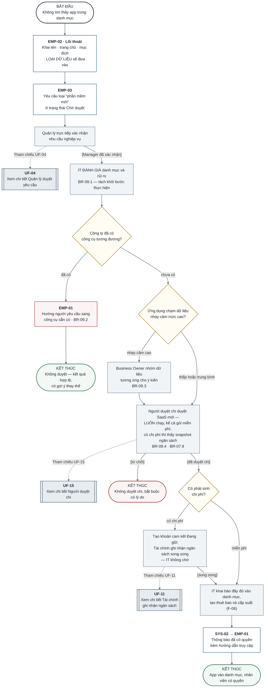

> IT xuất hiện hai lần với hai vai trò khác nhau: đánh giá rủi ro, rồi mới thực hiện.

---

### 11.6. `UF-03` — Nhân viên xem và xuất dữ liệu của chính mình

|                               |                                                                                                                |
| ----------------------------- | -------------------------------------------------------------------------------------------------------------- |
| **Vai trò**                   | Employee                                                                                                       |
| **Ưu tiên trình bày**         | **MỨC 3 · Chỉ mở khi bị hỏi** — Tra cứu — mở khi thầy hỏi về quyền của người lao động với dữ liệu của chính họ |
| **Màn hình đi qua**           | `EMP-01` · `EMP-03` · `SYS-02` · `SYS-03`                                                                      |
| **Luồng nghiệp vụ tương ứng** | `F-40`                                                                                                         |
| **Quy tắc chi phối**          | `BR-40.1` · `BR-40.2` · `BR-40.3` · **`BR-42.6`** _(v0.5)_                                                     |
| **Chuỗi demo**                | —                                                                                                              |
| **Quy mô**                    | 14 nút · 13 cạnh · 1 điểm rẽ nhánh                                                                             |

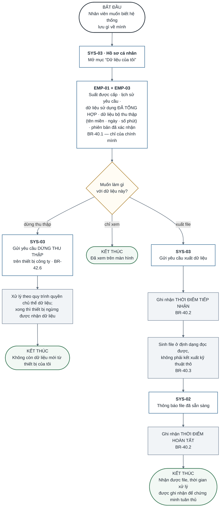

> Hai mốc thời gian ở BR-40.2 là thứ dùng để chứng minh đáp ứng đúng thời hạn quy định.

---

### 11.7. `UF-04` — Quản lý duyệt yêu cầu cấp quyền

|                               |                                                                                                                                             |
| ----------------------------- | ------------------------------------------------------------------------------------------------------------------------------------------- |
| **Vai trò**                   | Manager                                                                                                                                     |
| **Ưu tiên trình bày**         | **MỨC 2 · Trình bày nếu còn thời gian** — Cùng chuỗi D-1 với UF-01 nhưng nhìn từ phía người duyệt; mở khi thầy hỏi về phân tách trách nhiệm |
| **Màn hình đi qua**           | `MGR-02` · `MGR-03` _(v0.6 — bỏ `MGR-06 · Ủy quyền`, `QĐ-27`)_                                                                              |
| **Luồng nghiệp vụ tương ứng** | `F-07`, `F-08`, `F-13`                                                                                                                      |
| **Quy tắc chi phối**          | `BR-02.2` · `BR-07.5` · `BR-07.7` · `BR-13.2` · `BR-13.4` · **`BR-13.6`** · **`BR-13.8`** · **`BR-13.9`** _(v0.6)_                          |
| **Chuỗi demo**                | **D-1** — Xin công cụ có phát sinh chi phí                                                                                                  |
| **Quy mô**                    | 11 nút · 10 cạnh · 2 điểm rẽ nhánh                                                                                                          |

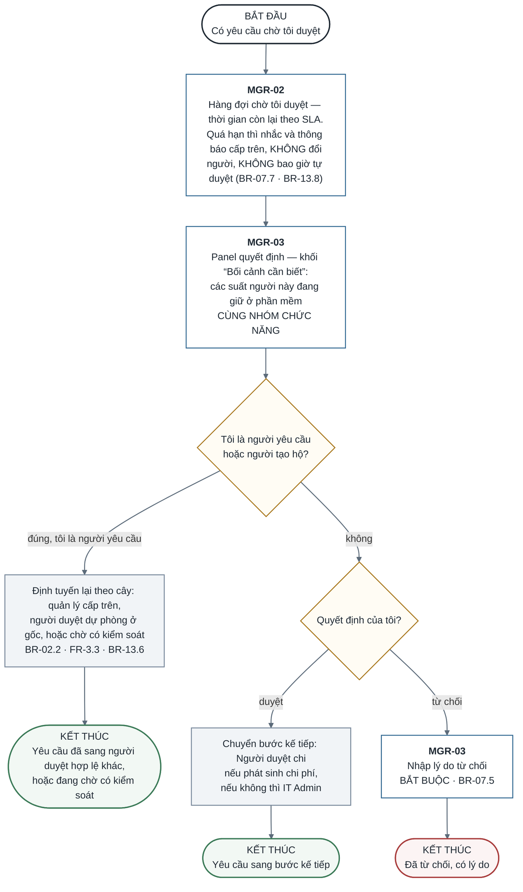

> **Sửa ở v0.6 — `QĐ-27`, `QĐ-28d`.** Bỏ quyết định `d1` _“Tôi sắp vắng mặt?”_, màn hình `a2` _MGR-06 · Ủy quyền_, bước `s1` và kết thúc `e1` _“Người được ủy quyền xử lý”_: **15 → 11 nút, 14 → 10 cạnh, 3 → 2 điểm rẽ nhánh**. Mã nút còn lại giữ nguyên để diff truy được. Quản lý sắp vắng **không** có thao tác nào trong hệ thống; nếu yêu cầu quá hạn thì hệ thống nhắc, thông báo và cảnh báo backlog (`BR-13.8`) — đó là việc của hệ thống, không phải một màn hình của quản lý.

**Ánh xạ kết quả loại trừ nhau của `s2`.** `s2` là xử lý định tuyến sau guard `d2` _“đúng, tôi là người yêu cầu”_; nó không trao quyền duyệt cho Quản trị hệ thống hay Super Admin, và **không phải ủy quyền**.

| Tình huống tại `d2`/`s2`        | Kết quả đến `e2`                                                                                                                                                              | Nguồn truy vết                                       |
| ------------------------------- | ----------------------------------------------------------------------------------------------------------------------------------------------------------------------------- | ---------------------------------------------------- |
| Người duyệt gốc trùng requester | Chuyển lên quản lý cấp trên; nếu cần, dùng người duyệt dự phòng ở gốc với vai Manager.                                                                                        | `BR-02.2` · `FR-3.3` · `FR-3.6` · `SoD-4`            |
| Không còn người duyệt hợp lệ    | Giữ Request **chờ có kiểm soát**, gắn cờ, nhắc và **thông báo**, báo cấu hình lại; chỉ xác định lại sau sự kiện dữ liệu/cấu hình (`BR-13.9`). Không tự duyệt hoặc tự từ chối. | `BR-13.6` · `FR-3.12` · `QĐ-13` · `QĐ-28d` · `SoD-1` |

> “Hỏi thêm” cũng là một hành động ở MGR-03 nhưng không dừng đồng hồ SLA, nên không tạo nhánh riêng.

---

### 11.8. `UF-05` — Quản lý xác nhận license

|                               |                                                                                                                                          |
| ----------------------------- | ---------------------------------------------------------------------------------------------------------------------------------------- |
| **Vai trò**                   | Manager                                                                                                                                  |
| **Ưu tiên trình bày**         | **MỨC 1 · Bắt buộc trình bày** — Màn hình quyết định phân hệ Ghost Seat sống hay chết — nơi hệ thống nói thật về mức độ chắc chắn của nó |
| **Màn hình đi qua**           | `MGR-04`                                                                                                                                 |
| **Luồng nghiệp vụ tương ứng** | `F-21`, `F-23`                                                                                                                           |
| **Quy tắc chi phối**          | `BR-21.1` · `BR-21.3` · `BR-21.4` · `BR-21.5` · `BR-23.1`                                                                                |
| **Chuỗi demo**                | **D-2** — Từ file nhật ký tới tiền tiết kiệm                                                                                             |
| **Quy mô**                    | 15 nút · 15 cạnh · 2 điểm rẽ nhánh                                                                                                       |

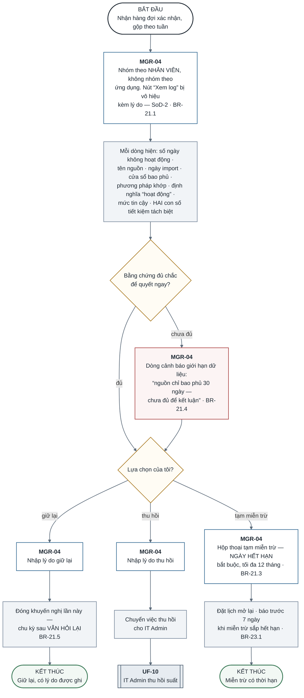

> Cả ba lựa chọn đều bắt buộc nhập lý do. “Giữ lại” là phát biểu có thời hạn, không đóng vĩnh viễn.

---

### 11.9. `UF-06` — IT Admin nạp dữ liệu sử dụng

|                               |                                                                                                                                   |
| ----------------------------- | --------------------------------------------------------------------------------------------------------------------------------- |
| **Vai trò**                   | IT Admin                                                                                                                          |
| **Ưu tiên trình bày**         | **MỨC 2 · Trình bày nếu còn thời gian** — Mở NGAY khi thầy hỏi “dữ liệu sử dụng ở đâu ra” hoặc “có xin phép người lao động không” |
| **Màn hình đi qua**           | `ITA-07` · `ITA-08`                                                                                                               |
| **Luồng nghiệp vụ tương ứng** | `F-17`, `F-42`                                                                                                                    |
| **Quy tắc chi phối**          | `BR-17.1` · `BR-17.6` · `BR-17.8` · `BR-18.1` · `BR-42.2`                                                                         |
| **Chuỗi demo**                | **D-2** — Từ file nhật ký tới tiền tiết kiệm                                                                                      |
| **Quy mô**                    | 24 nút · 26 cạnh · 6 điểm rẽ nhánh                                                                                                |

```mermaid
flowchart TB
    st(["BẮT ĐẦU<br/>IT có file nhật ký sử dụng"])
    a1["<b>ITA-08</b><br/>Chọn ứng dụng và mẫu cấu hình nguồn"]
    d1{"Ứng dụng thuộc nhóm<br/>dịch vụ liên lạc?"}
    b1["<b>ITA-08</b><br/>CHẶN — mặc định không thu thập<br/>dữ liệu hoạt động · BR-17.8 · ADR-10"]
    d2{"Lần đầu import cho<br/>ứng dụng này?"}
    a2["<b>ITA-07 · Cổng F-42</b><br/>Xác nhận đã thông báo<br/>cho người lao động"]
    e1(["KẾT THÚC<br/>Không import — chỉ dùng<br/>danh sách thành viên"])
    a3["<b>ITA-07 · Bước 1</b><br/>Tải file lên, hệ thống tính mã băm"]
    s1["Gửi thông báo tới mọi nhân viên đang<br/>giữ suất · ghi nhật ký thời điểm.<br/>Chưa thông báo thì KHÔNG cho ghi (BR-42.2)"]
    d3{"Mã băm trùng file<br/>đã import trước đó?"}
    a4["<b>ITA-07 · Bước 1</b><br/>Cảnh báo ghi đè có chủ đích —<br/>không chặn cứng"]
    a5["<b>ITA-07 · Bước 2</b><br/>Phân tích file theo mẫu cấu hình"]
    d4{"File tự chứa khoảng<br/>thời gian bao phủ?"}
    a6["<b>ITA-07 · Bước 2</b><br/>Khai tay cửa sổ bao phủ —<br/>không cho bỏ qua · BR-17.1"]
    a7["<b>ITA-07 · Bước 3</b><br/>Khớp danh tính theo thứ tự ưu tiên"]
    d5{"Còn định danh<br/>chưa khớp được?"}
    o2[["<b>UF-16</b><br/>Dữ liệu từ bộ thu thập trên thiết bị<br/>đi qua CÙNG bước khớp danh tính"]]
    o1[["<b>UF-07</b><br/>Hàng đợi chưa khớp danh tính —<br/>bản ghi chưa khớp KHÔNG dùng<br/>để kết luận (BR-18.1)"]]
    a8["<b>ITA-07 · Bước 4</b><br/>XEM TRƯỚC — chưa ghi dòng nào.<br/>Số dòng hợp lệ · lỗi · trùng · chưa khớp ·<br/>cửa sổ bao phủ · năng lực của nguồn"]
    d6{"Xác nhận ghi dữ liệu?"}
    e2(["KẾT THÚC<br/>KHÔNG ghi một dòng nào"])
    s2["<b>ITA-07 · Bước 5</b><br/>Ghi dữ liệu — gắn vào QUYỀN đang hiệu lực<br/>tại ngày xảy ra sự kiện, không gắn vào<br/>con người · BR-17.6"]
    s3["<b>ITA-07 · Bước 6</b><br/>Tính lại tình trạng sử dụng<br/>của các quyền liên quan"]
    e3(["KẾT THÚC<br/>Dữ liệu đã ghi, sẵn sàng cho UF-10"])

    st --> a1
    a1 --> d1
    d1 -->|"thuộc nhóm liên lạc"| b1
    d1 -->|"không"| d2
    b1 --> e1
    d2 -->|"lần đầu"| a2
    d2 -->|"đã thông báo trước đó"| a3
    a2 --> s1
    s1 --> a3
    a3 --> d3
    d3 -->|"trùng mã băm"| a4
    d3 -->|"file mới"| a5
    a4 --> a5
    a5 --> d4
    d4 -->|"không tự chứa"| a6
    d4 -->|"có"| a7
    a6 --> a7
    a7 --> d5
    a7 -. "nguồn thứ hai" .-> o2
    d5 -->|"có"| o1
    d5 -->|"khớp hết"| a8
    a8 --> d6
    d6 -->|"hủy"| e2
    d6 -->|"xác nhận"| s2
    s2 --> s3
    s3 --> e3

    classDef term fill:#FFFFFF,stroke:#1F2933,stroke-width:2px,color:#1F2933
    classDef ok   fill:#F2F8F4,stroke:#3B7A57,stroke-width:2px,color:#1F2933
    classDef bad  fill:#FCF4F4,stroke:#A83C3C,stroke-width:2px,color:#1F2933
    classDef scr  fill:#FFFFFF,stroke:#2F6690,stroke-width:1.5px,color:#1F2933
    classDef sys  fill:#F1F4F7,stroke:#78889B,stroke-width:1.5px,color:#1F2933
    classDef dec  fill:#FFFCF4,stroke:#A8761B,stroke-width:1.5px,color:#1F2933
    classDef blk  fill:#FCF4F4,stroke:#A83C3C,stroke-width:1.5px,color:#1F2933
    classDef off  fill:#E7ECF1,stroke:#4A5C6E,stroke-width:1.5px,color:#1F2933
    class st term
    class a1,a2,a3,a4,a5,a6,a7,a8 scr
    class d1,d2,d3,d4,d5,d6 dec
    class b1 blk
    class e1,e3 ok
    class s1,s2,s3 sys
    class o1,o2 off
    class e2 bad
    linkStyle default stroke:#5C6B7A,stroke-width:1.5px
```

> Bước 4 là chỗ chặn mọi kết luận sai trên dữ liệu thiếu — không được rút gọn (FR-7.2).

---

### 11.10. `UF-07` — IT Admin xử lý hàng đợi chưa khớp danh tính

|                               |                                                                                                                         |
| ----------------------------- | ----------------------------------------------------------------------------------------------------------------------- |
| **Vai trò**                   | IT Admin                                                                                                                |
| **Ưu tiên trình bày**         | **MỨC 3 · Chỉ mở khi bị hỏi** — Tra cứu — mở khi thầy hỏi “khớp tài khoản bên nhà cung cấp với nhân viên bằng cách nào” |
| **Màn hình đi qua**           | `ITA-09`                                                                                                                |
| **Luồng nghiệp vụ tương ứng** | `F-18`                                                                                                                  |
| **Quy tắc chi phối**          | `BR-18.1` · `BR-18.2` · `BR-18.3` · `BR-18.4`                                                                           |
| **Chuỗi demo**                | —                                                                                                                       |
| **Quy mô**                    | 12 nút · 11 cạnh · 2 điểm rẽ nhánh                                                                                      |

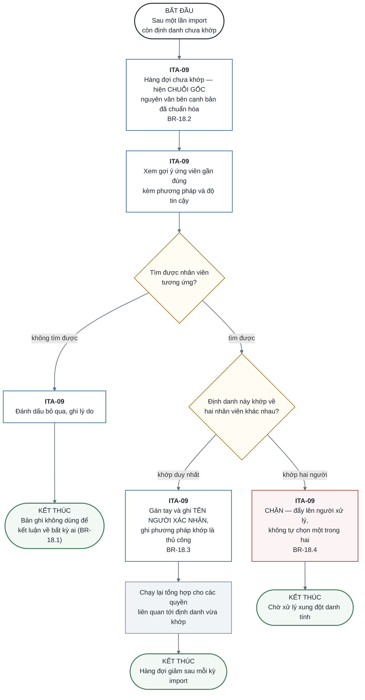

---

### 11.11. `UF-08` — IT Admin xử lý hàng đợi cấp phát

|                               |                                                                                                                               |
| ----------------------------- | ----------------------------------------------------------------------------------------------------------------------------- |
| **Vai trò**                   | IT Admin                                                                                                                      |
| **Ưu tiên trình bày**         | **MỨC 3 · Chỉ mở khi bị hỏi** — Tra cứu — mở khi thầy hỏi “cấp phát lỗi thì sao” hoặc “ứng dụng không có API thì làm thế nào” |
| **Màn hình đi qua**           | `ITA-05`                                                                                                                      |
| **Luồng nghiệp vụ tương ứng** | `F-10`, `F-11`, `F-12`                                                                                                        |
| **Quy tắc chi phối**          | `BR-10.1` · `BR-10.4` · `BR-12.1` · `BR-12.4`                                                                                 |
| **Chuỗi demo**                | —                                                                                                                             |
| **Quy mô**                    | 21 nút · 22 cạnh · 5 điểm rẽ nhánh                                                                                            |

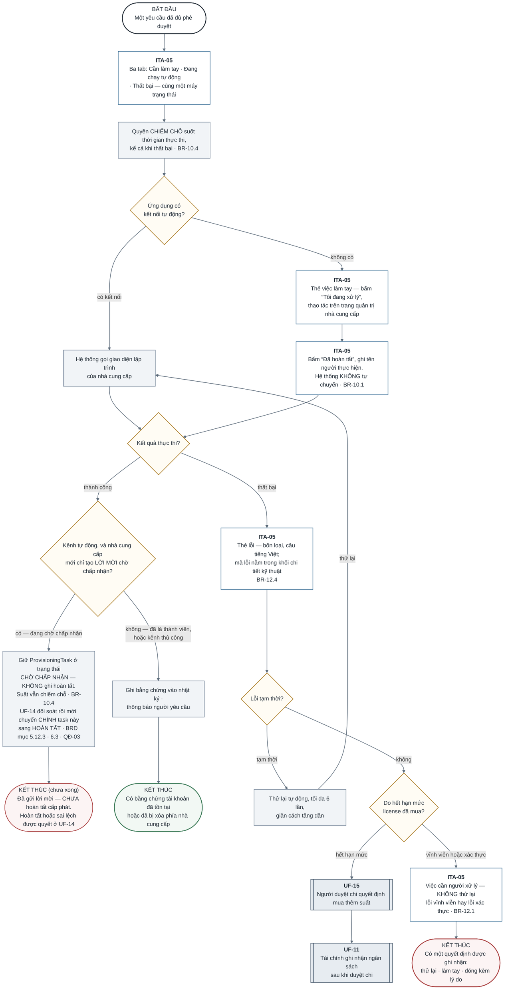

> Phần lớn phần mềm doanh nghiệp Việt Nam không có kết nối tự động, nên nhánh thủ công quan trọng hơn nhánh tự động. Hết hạn mức license quay lại đúng chuỗi `QĐ-22`/`QĐ-29b`: Người duyệt chi **quyết định** mua thêm suất (`UF-15`) trên snapshot ngân sách, rồi Tài chính **ghi nhận** ngân sách (`UF-11`) — không có bước nào ở đây để Tài chính tự duyệt. _(v0.7 — đảo thứ tự `o2` → `o1`; số nút, cạnh không đổi.)_

---

### 11.12. `UF-09` — IT Admin xử lý nhân viên nghỉ việc

|                               |                                                                                                                                |
| ----------------------------- | ------------------------------------------------------------------------------------------------------------------------------ |
| **Vai trò**                   | IT Admin                                                                                                                       |
| **Ưu tiên trình bày**         | **MỨC 1 · Bắt buộc trình bày** — Kịch bản demo giá trị nhất: vừa là chi phí vừa là lỗ hổng bảo mật, và chỉ dùng dữ liệu nội bộ |
| **Màn hình đi qua**           | `ITA-04` · `ITA-10` · `ITA-12` · `ITA-13` · `ITA-14`                                                                           |
| **Luồng nghiệp vụ tương ứng** | `F-05`, `F-41`                                                                                                                 |
| **Quy tắc chi phối**          | `BR-05.1` · `BR-05.2` · `BR-05.3` · `BR-05.4` · `BR-14.2` · `BR-22.2` · `BR-41.1` · `BR-41.3` · **`BR-45.7`** _(v0.5)_         |
| **Chuỗi demo**                | **D-3** — Nhân viên nghỉ việc                                                                                                  |
| **Quy mô**                    | 18 nút · 19 cạnh · 2 điểm rẽ nhánh                                                                                             |

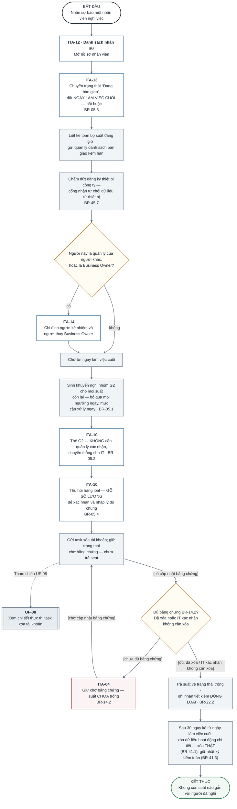

> Đây là kịch bản demo giá trị nhất: vừa là chi phí vừa là lỗ hổng bảo mật, và chỉ dùng dữ liệu nội bộ.

---

### 11.13. `UF-10` — IT Admin xử lý bảng tối ưu license

|                               |                                                                                                                           |
| ----------------------------- | ------------------------------------------------------------------------------------------------------------------------- |
| **Vai trò**                   | IT Admin                                                                                                                  |
| **Ưu tiên trình bày**         | **MỨC 1 · Bắt buộc trình bày** — Chỗ tiền hiện ra — bốn nhóm lãng phí và hai con số tiết kiệm không bao giờ được cộng lại |
| **Màn hình đi qua**           | `ITA-04` · `ITA-10`                                                                                                       |
| **Luồng nghiệp vụ tương ứng** | `F-19`, `F-20`, `F-22`                                                                                                    |
| **Quy tắc chi phối**          | `BR-05.2` · `BR-19.1` · `BR-20.2` · `BR-22.1`                                                                             |
| **Chuỗi demo**                | **D-2** — Từ file nhật ký tới tiền tiết kiệm                                                                              |
| **Quy mô**                    | 18 nút · 18 cạnh · 2 điểm rẽ nhánh                                                                                        |

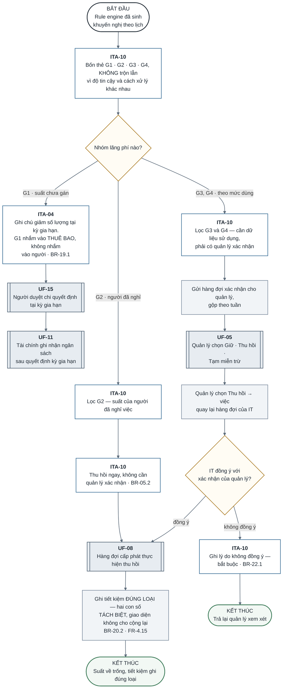

> Tiết kiệm thực hiện ngay chỉ lớn hơn 0 khi gói theo tháng hoặc hợp đồng cho giảm giữa kỳ.
>
> 🔧 **Sửa ở v0.7 — `QĐ-29b`.** Nhánh `G1` nay đi `a2 → o1b → o1`: Người duyệt chi quyết tại kỳ gia hạn (`UF-15`) trước, Tài chính ghi nhận sau (`UF-11`). Số nút, cạnh không đổi.
>
> 🔧 **Sửa ở lượt follow-up 14/09/2026 — `QĐ-22`.** Nhánh `G1` trước đây dẫn thẳng tới một tham chiếu ghi _"Tài chính quyết định tại kỳ gia hạn"_ — sai, vì Tài chính không còn quyết định gì từ `QĐ-22`. Nay `a2 → o1 → o1b`: `o1` chỉ còn ghi ý kiến ngân sách (`UF-11`), `o1b` mới là nơi Người duyệt chi quyết (`UF-15`). Không đổi nghiệp vụ của nhánh `G2`/`G3`/`G4`.
>
> 🔧 **Sửa ở lượt review 09/09/2026.** Trước đó nhánh `G2` đi `a5 → d2` _(“IT đồng ý với xác nhận của quản lý?”)_, mà nhánh `không đồng ý` của `d2` kết thúc ở _“Trả lại quản lý xem xét”_. Với `G2` **không hề có xác nhận của quản lý** để đồng ý hay không, và trả về cho quản lý là điều `BR-05.2` cấm — _“người đã nghỉ thì không có gì để bàn”_. Nay `G2` đi **thẳng `a5 → o3`**, khớp `BR-05.2`, `BR-19.2` và mục 1.7 _(“G2 KHÔNG đi qua bước B3.4”)_. `d2` giữ nguyên ngữ nghĩa `BR-22.1` cho nhánh `G3`/`G4`. Số nút, số cạnh và số điểm rẽ nhánh **không đổi**.

---

### 11.14. `UF-11` — Tài chính kiểm soát ngân sách và theo dõi kỳ gia hạn

|                               |                                                                                                                                                                                                                                                                                  |
| ----------------------------- | -------------------------------------------------------------------------------------------------------------------------------------------------------------------------------------------------------------------------------------------------------------------------------- |
| **Vai trò**                   | Finance                                                                                                                                                                                                                                                                          |
| **Ưu tiên trình bày**         | **MỨC 1 · Bắt buộc trình bày** — Mắt xích biến khuyến nghị thành tiền thật; cảnh báo đếm từ hạn chót báo hủy chứ không từ ngày gia hạn. _(v0.7 — Tài chính **không** nằm trên đường duyệt: trả lời khi Người duyệt chi hỏi, ghi nhận sau duyệt; Người duyệt chi quyết: `UF-15`)_ |
| **Màn hình đi qua**           | `FIN-03` · `FIN-05` · `FIN-06`                                                                                                                                                                                                                                                   |
| **Luồng nghiệp vụ tương ứng** | `F-08`, `F-26`, `F-27`, `F-36`                                                                                                                                                                                                                                                   |
| **Quy tắc chi phối**          | `BR-07.9` · `BR-07.10` · `BR-26.1` · `BR-26.2` · `BR-26.3` · `BR-27.1` · `BR-27.2` · `BR-27.3` · `BR-27.4`                                                                                                                                                                       |
| **Chuỗi demo**                | —                                                                                                                                                                                                                                                                                |
| **Quy mô**                    | 21 nút · 21 cạnh · 3 điểm rẽ nhánh                                                                                                                                                                                                                                               |

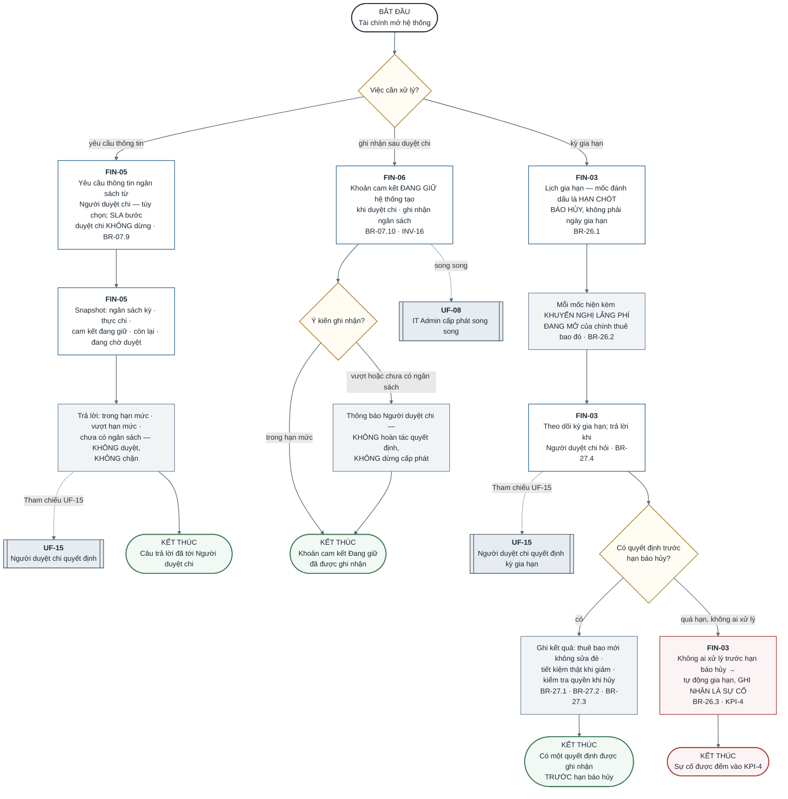

> Cảnh báo trước ngày gia hạn 7 ngày trong khi hợp đồng buộc báo hủy trước 30 ngày là một cảnh báo vô dụng gửi đúng giờ.
>
> **Vẽ lại ở v0.7 — `QĐ-29b`.** Tài chính không còn hàng đợi _ghi ý kiến trước duyệt chi_. Ba việc: **trả lời yêu cầu thông tin** khi Người duyệt chi hỏi (`a1` → `e5`), **ghi nhận ngân sách** trên khoản cam kết hệ thống đã tạo khi duyệt (`a7` → `e4`), và **theo dõi kỳ gia hạn** (`a2` → `e2`/`e3`). Bỏ `s5`, `e1` _(từ chối không còn đi qua Tài chính)_; thêm `e5`, `s7`: **21 nút, 20 → 21 cạnh**, 3 điểm rẽ nhánh.

---

### 11.15. `UF-12` — Phát hiện và hợp thức hóa phần mềm ngoài danh mục

|                               |                                                                                                                            |
| ----------------------------- | -------------------------------------------------------------------------------------------------------------------------- |
| **Vai trò**                   | Finance + IT Admin                                                                                                         |
| **Ưu tiên trình bày**         | **MỨC 1 · Bắt buộc trình bày** — D-4 — đưa Shadow IT vào diện quản trị mà không kết tội; vòng lặp khép kín về lại danh mục |
| **Màn hình đi qua**           | `FIN-04` · `ITA-03` · `ITA-07` · `ITA-15`                                                                                  |
| **Luồng nghiệp vụ tương ứng** | `F-06`, `F-31`, `F-32`, `F-34`, `F-46`                                                                                     |
| **Quy tắc chi phối**          | `BR-31.1` · `BR-31.2` · `BR-31.3` · `BR-31.4` · `BR-34.1` · `BR-34.2` · `BR-46.1` · `BR-46.2`                              |
| **Chuỗi demo**                | **D-4** — Phát hiện chi tiêu ngoài danh mục                                                                                |
| **Quy mô**                    | 22 nút · 24 cạnh · 4 điểm rẽ nhánh                                                                                         |

```mermaid
flowchart TB
    st(["BẮT ĐẦU<br/>Có sao kê hoặc dữ liệu cấp quyền mới"])
    d1{"Nguồn bằng chứng?"}
    a1["<b>FIN-04</b><br/>Tài chính import sao kê,<br/>danh sách hóa đơn"]
    a2["<b>ITA-07</b><br/>IT import dữ liệu cấp quyền<br/>của hệ thống định danh"]
    a8["<b>ITA-15</b><br/>Bộ thu thập: tên miền có trong từ điển<br/>nhưng ngoài danh mục — số nhân viên đã xác nhận<br/>có mở, khoảng ngày; KHÔNG có URL · BR-46.1"]
    s1["Chuẩn hóa mô tả giao dịch về tên nhà cung cấp<br/>— lưu CẢ giá trị thô lẫn giá trị đã chuẩn hóa<br/>kèm phương pháp khớp · BR-31.4"]
    d2{"Phương pháp khớp<br/>nào được dùng?"}
    s2["Khớp chính xác từ điển hoặc theo mẫu<br/>→ tự động chuẩn hóa"]
    a3["<b>ITA-15</b><br/>BẮT BUỘC người xác nhận — kết quả do<br/>mô hình ngôn ngữ gợi ý luôn ở mức<br/>tin cậy thấp · FR-6.5"]
    d3{"Nhà cung cấp đã có trong<br/>danh mục đã duyệt?"}
    e1(["KẾT THÚC<br/>Chi tiêu đã nằm trong danh mục"])
    s3["Sinh bản ghi CẦN XEM XÉT — không phải<br/>kết luận vi phạm (BR-31.1). Mỗi nhà cung cấp<br/>chỉ một bản ghi đang mở (BR-31.2)"]
    a4["<b>ITA-15</b><br/>Phát hiện ngoài danh mục — phân tầng rủi ro<br/>theo mức nhạy cảm dữ liệu, số nhân viên<br/>liên quan, có đăng nhập tập trung không"]
    d4{"Quyết định của IT?"}
    a5["<b>ITA-15</b><br/>Đánh dấu BÁO NHẦM"]
    a6["<b>ITA-15</b><br/>Đánh dấu ĐÃ DUYỆT — hợp thức hóa"]
    a7["<b>ITA-15</b><br/>Đánh dấu CHƯA DUYỆT"]
    e2(["KẾT THÚC<br/>Đóng; xuất hiện lại thì MỞ LẠI<br/>BR-31.3"])
    o1["<b>ITA-03</b><br/>Khai báo đầy đủ vào danh mục,<br/>tạo yêu cầu mua chính thức (F-06)"]
    o2[["<b>UF-08</b><br/>Thu hồi, hướng người dùng<br/>sang công cụ sẵn có"]]
    s4["Ghi nhận người đang dùng thành QUYỀN<br/>CHÍNH THỨC — không bắt xin lại từ đầu<br/>BR-34.2"]
    e3(["KẾT THÚC<br/>“Đã duyệt” là kết cục bình thường<br/>và tích cực · BR-34.1"])

    st --> d1
    d1 -->|"sao kê ngân hàng"| a1
    d1 -->|"hệ thống định danh"| a2
    d1 -->|"bộ thu thập trên thiết bị"| a8
    a8 --> d3
    a1 --> s1
    a2 --> s1
    s1 --> d2
    d2 -->|"từ điển hoặc theo mẫu"| s2
    d2 -->|"khớp mờ hoặc mô hình gợi ý"| a3
    s2 --> d3
    a3 --> d3
    d3 -->|"đã có"| e1
    d3 -->|"chưa có"| s3
    s3 --> a4
    a4 --> d4
    d4 -->|"báo nhầm"| a5
    d4 -->|"đã duyệt"| a6
    d4 -->|"chưa duyệt"| a7
    a5 --> e2
    a6 --> o1
    a7 --> o2
    o1 --> s4
    s4 --> e3

    classDef term fill:#FFFFFF,stroke:#1F2933,stroke-width:2px,color:#1F2933
    classDef ok   fill:#F2F8F4,stroke:#3B7A57,stroke-width:2px,color:#1F2933
    classDef bad  fill:#FCF4F4,stroke:#A83C3C,stroke-width:2px,color:#1F2933
    classDef scr  fill:#FFFFFF,stroke:#2F6690,stroke-width:1.5px,color:#1F2933
    classDef sys  fill:#F1F4F7,stroke:#78889B,stroke-width:1.5px,color:#1F2933
    classDef dec  fill:#FFFCF4,stroke:#A8761B,stroke-width:1.5px,color:#1F2933
    classDef blk  fill:#FCF4F4,stroke:#A83C3C,stroke-width:1.5px,color:#1F2933
    classDef off  fill:#E7ECF1,stroke:#4A5C6E,stroke-width:1.5px,color:#1F2933
    class st term
    class d1,d2,d3,d4 dec
    class a1,a2,a3,a4,a5,a6,a7,a8,o1 scr
    class s1,s2,s3,s4 sys
    class e1,e2,e3 ok
    class o2 off
    linkStyle default stroke:#5C6B7A,stroke-width:1.5px
```

> Bản ghi phát hiện là “có dấu hiệu một phần mềm chưa nằm trong danh mục”, không phải kết luận vi phạm.

---

### 11.16. `UF-13` — Super Admin sửa cấu hình và luồng phê duyệt

|                               |                                                                                                                          |
| ----------------------------- | ------------------------------------------------------------------------------------------------------------------------ |
| **Vai trò**                   | Super Admin                                                                                                              |
| **Ưu tiên trình bày**         | **MỨC 2 · Trình bày nếu còn thời gian** — Vai trò Super Admin chỉ có một flow; mở khi thầy hỏi về cấu hình và phân quyền |
| **Màn hình đi qua**           | `ADM-02` · `ADM-03` · `SYS-04`                                                                                           |
| **Luồng nghiệp vụ tương ứng** | `F-37`, `F-38`, `F-42`                                                                                                   |
| **Quy tắc chi phối**          | `BR-20.1` · `BR-37.1` · `BR-37.2` · `BR-38.1` · `BR-42.5` · `BR-13.9` _(v0.6)_                                           |
| **Chuỗi demo**                | —                                                                                                                        |
| **Quy mô**                    | 17 nút · 19 cạnh · 3 điểm rẽ nhánh                                                                                       |

```mermaid
flowchart TB
    st(["BẮT ĐẦU<br/>Cần đổi ngưỡng phát hiện<br/>hoặc chuỗi người duyệt"])
    d1{"Đổi cái gì?"}
    a1["<b>ADM-02</b><br/>Chọn PHẠM VI áp dụng: từng ứng dụng ><br/>tổ chức > mặc định hệ thống<br/>BR-20.1"]
    a2["<b>ADM-03</b><br/>Sửa điều kiện và chuỗi bước duyệt<br/>của một chính sách"]
    a5["<b>ADM-02</b><br/>Chọn Người duyệt chi (một Employee, mặc định CEO),<br/>người thay thế khi xung đột, ngưỡng backlog<br/>và sửa nội dung thông báo theo dõi<br/>FR-3.13 · FR-3.15 · FR-3.8 · FR-4.18"]
    s5["Cấu hình, KHÔNG phải phê duyệt (SoD-1).<br/>Nội dung đổi ⟹ phiên bản mới,<br/>nhân viên xác nhận lại · BR-42.5"]
    s1["Hiện thứ tự ưu tiên đang áp dụng, ví dụ<br/>“Figma dùng ngưỡng riêng, ghi đè mức tổ chức”"]
    a3["<b>ADM-03</b><br/>KHỐI XEM THỬ — chọn một tình huống<br/>giả định, hệ thống chỉ ra chính sách nào<br/>khớp và chuỗi bước sinh ra"]
    d2{"Thao tác thuộc quyền<br/>quản trị hệ thống?"}
    d3{"Chuỗi bước sinh ra<br/>đúng như ý không?"}
    b1["<b>SYS-04</b><br/>CHẶN — Super Admin không gán suất<br/>và không phê duyệt yêu cầu nghiệp vụ<br/>BR-37.1 · SoD-1"]
    s2["Áp cấu hình mới"]
    a4["<b>ADM-03</b><br/>Sửa lại điều kiện<br/>hoặc chuỗi bước"]
    e1(["KẾT THÚC<br/>Thao tác bị từ chối, có ghi nhật ký"])
    s3["Ghi nhật ký kiểm toán — CHỈ GHI THÊM,<br/>không sửa không xóa · BR-38.1"]
    s4["Yêu cầu ĐANG CHẠY giữ chính sách cũ;<br/>đổi người giữ vai thì bước đang chờ<br/>được xác định lại · BR-37.2 · BR-13.9"]
    e2(["KẾT THÚC<br/>Cấu hình có hiệu lực cho<br/>yêu cầu tạo từ nay"])

    st --> d1
    d1 -->|"ngưỡng phát hiện"| a1
    d1 -->|"luồng phê duyệt"| a2
    d1 -->|"Người duyệt chi, thông báo theo dõi"| a5
    a5 --> s5
    s5 --> s3
    a1 --> s1
    a2 --> a3
    s1 --> d2
    a3 --> d3
    d2 -->|"không thuộc quyền"| b1
    d2 -->|"thuộc quyền"| s2
    b1 --> e1
    d3 -->|"chưa đúng"| a4
    d3 -->|"đúng"| s3
    a4 -->|"sửa rồi xem thử lại"| a3
    s2 --> s3
    s3 --> s4
    s4 --> e2

    classDef term fill:#FFFFFF,stroke:#1F2933,stroke-width:2px,color:#1F2933
    classDef ok   fill:#F2F8F4,stroke:#3B7A57,stroke-width:2px,color:#1F2933
    classDef bad  fill:#FCF4F4,stroke:#A83C3C,stroke-width:2px,color:#1F2933
    classDef scr  fill:#FFFFFF,stroke:#2F6690,stroke-width:1.5px,color:#1F2933
    classDef sys  fill:#F1F4F7,stroke:#78889B,stroke-width:1.5px,color:#1F2933
    classDef dec  fill:#FFFCF4,stroke:#A8761B,stroke-width:1.5px,color:#1F2933
    classDef blk  fill:#FCF4F4,stroke:#A83C3C,stroke-width:1.5px,color:#1F2933
    classDef off  fill:#E7ECF1,stroke:#4A5C6E,stroke-width:1.5px,color:#1F2933
    class st term
    class d1,d2,d3 dec
    class a1,a2,a3,a4,a5 scr
    class s1,s2,s3,s4,s5 sys
    class b1 blk
    class e1 bad
    class e2 ok
    linkStyle default stroke:#5C6B7A,stroke-width:1.5px
```

> Không có khối xem thử thì Super Admin chỉnh chính sách trong bóng tối, sai sót chỉ lộ ra khi một yêu cầu thật đi sai đường.

---

### 11.17. `UF-14` — IT Admin xử lý sai lệch và mâu thuẫn dữ liệu

|                               |                                                                                                         |
| ----------------------------- | ------------------------------------------------------------------------------------------------------- |
| **Vai trò**                   | IT Admin + Finance                                                                                      |
| **Ưu tiên trình bày**         | **MỨC 3 · Chỉ mở khi bị hỏi** — Tra cứu — mở khi thầy hỏi “hai nguồn dữ liệu lệch nhau thì tin cái nào” |
| **Màn hình đi qua**           | `FIN-04` · `ITA-04` · `ITA-05` · `ITA-11` · `ITA-15`                                                    |
| **Luồng nghiệp vụ tương ứng** | `F-28`, `F-35`, `F-43`                                                                                  |
| **Quy tắc chi phối**          | `BR-28.1` · `BR-28.2` · `BR-28.3` · `BR-35.1` · `BR-35.2` · `BR-43.1` · `BR-43.2` · `BR-43.3`           |
| **Chuỗi demo**                | —                                                                                                       |
| **Quy mô**                    | 24 nút · 27 cạnh · 5 điểm rẽ nhánh                                                                      |

```mermaid
flowchart TB
    st(["BẮT ĐẦU<br/>Tác vụ đối soát chạy theo lịch,<br/>hoặc Tài chính import hóa đơn"])
    d1{"Loại đối soát?"}
    a1["<b>ITA-11</b><br/>Đối soát danh sách thành viên<br/>phía nhà cung cấp"]
    a2["<b>FIN-04</b><br/>Ghép dòng hóa đơn về<br/>đúng thuê bao"]
    d2{"Ứng dụng có<br/>kết nối tự động?"}
    s0["Hiện BA con số cạnh nhau: trên hóa đơn ·<br/>khai trong thuê bao · đang thực sự dùng"]
    e0(["KẾT THÚC<br/>Không đối soát — không sinh<br/>sai lệch giả · BR-28.1"])
    dq{"Chênh lệch gắn với một ProvisioningTask<br/>đang CHỜ CHẤP NHẬN?"}
    dq2{"Đã là thành viên active<br/>đúng tài khoản?"}
    eq(["KẾT THÚC<br/>Vẫn chờ chấp nhận — giữ chờ, không sinh sai lệch"])
    s5["Ghi bằng chứng nhà cung cấp · chuyển<br/>ProvisioningTask CHỜ CHẤP NHẬN → HOÀN TẤT<br/>BRD mục 5.12.3 · 6.3 · QĐ-03"]
    e2(["KẾT THÚC<br/>Tác vụ cấp phát ĐÃ LIÊN KẾT hoàn tất,<br/>có bằng chứng phía nhà cung cấp"])
    a3["<b>ITA-11</b><br/>Hai loại sai lệch, phân mức<br/>nghiêm trọng khác nhau"]
    s1["Chênh lệch phải quy được về MỘT trong<br/>ba nguyên nhân: mua thêm chưa cập nhật ·<br/>nhà cung cấp tính sai · dữ liệu nội bộ sai<br/>BR-35.2"]
    s2["Giữ nguyên CẢ HAI giá trị — hệ thống KHÔNG<br/>tự sửa để hai bên khớp nhau<br/>BR-43.1 · BR-28.2 · BR-35.1"]
    s3["Mỗi bản ghi mâu thuẫn có NGƯỜI CHỊU<br/>TRÁCH NHIỆM · không tự đóng theo thời gian<br/>BR-43.2 · BR-43.3"]
    d3{"Loại sai lệch nào?"}
    a4["<b>ITA-05</b><br/>Cấp lại, hoặc xác nhận<br/>không cần cấp lại"]
    a5["<b>ITA-04 / FIN-04</b><br/>Sửa dữ liệu nội bộ theo<br/>nguyên nhân đã xác định"]
    a6["<b>ITA-15</b><br/>Điều tra — CÓ NGƯỜI ĐƯỢC CẤP QUYỀN<br/>NGOÀI QUY TRÌNH, mức rất cao · BR-28.3"]
    o1[["<b>UF-08</b><br/>Cấp lại tài khoản phía nhà cung cấp"]]
    s4["Đóng bản ghi kèm quyết định<br/>của người thật"]
    o2[["<b>UF-12</b><br/>Hợp thức hóa, hoặc thu hồi"]]
    e1(["KẾT THÚC<br/>Mọi sai lệch có một quyết định<br/>của người thật, không cái nào tự đóng"])

    st --> d1
    d1 -->|"với nhà cung cấp"| a1
    d1 -->|"với hóa đơn"| a2
    a1 --> d2
    a2 --> s0
    d2 -->|"không có kết nối"| e0
    d2 -->|"có kết nối"| dq
    dq -->|"không"| a3
    dq -->|"có"| dq2
    dq2 -->|"chưa — vẫn chờ chấp nhận"| eq
    dq2 -->|"đã active, đúng tài khoản"| s5
    dq2 -->|"sai tài khoản, hoặc lời mời<br/>hết hạn / bị từ chối"| a3
    s5 --> e2
    s0 --> s1
    a3 --> s2
    s1 --> s2
    s2 --> s3
    s3 --> d3
    d3 -->|"hệ thống có, NCC không có"| a4
    d3 -->|"dữ liệu nội bộ sai"| a5
    d3 -->|"NCC có, hệ thống không biết"| a6
    a4 --> o1
    a5 --> s4
    a6 --> o2
    o1 --> s4
    o2 --> s4
    s4 --> e1

    classDef term fill:#FFFFFF,stroke:#1F2933,stroke-width:2px,color:#1F2933
    classDef ok   fill:#F2F8F4,stroke:#3B7A57,stroke-width:2px,color:#1F2933
    classDef bad  fill:#FCF4F4,stroke:#A83C3C,stroke-width:2px,color:#1F2933
    classDef scr  fill:#FFFFFF,stroke:#2F6690,stroke-width:1.5px,color:#1F2933
    classDef sys  fill:#F1F4F7,stroke:#78889B,stroke-width:1.5px,color:#1F2933
    classDef dec  fill:#FFFCF4,stroke:#A8761B,stroke-width:1.5px,color:#1F2933
    classDef blk  fill:#FCF4F4,stroke:#A83C3C,stroke-width:1.5px,color:#1F2933
    classDef off  fill:#E7ECF1,stroke:#4A5C6E,stroke-width:1.5px,color:#1F2933
    class st term
    class d1,d2,d3,dq,dq2 dec
    class a1,a2,a3,a4,a5,a6 scr
    class s0,s1,s2,s3,s4,s5 sys
    class e0,e1,e2 ok
    class eq blk
    class o1,o2 off
    linkStyle default stroke:#5C6B7A,stroke-width:1.5px
```

> Ba trong bảy tình huống mâu thuẫn là dấu hiệu của một vấn đề nghiệp vụ thật — tự đồng bộ cho khớp là xóa mất chính bằng chứng.

---

### 11.17a. `UF-15` — Người duyệt chi duyệt khoản chi và quyết định kỳ gia hạn _(mới ở v0.5 — `QĐ-22`)_

|                               |                                                                                                                                                           |
| ----------------------------- | --------------------------------------------------------------------------------------------------------------------------------------------------------- |
| **Vai trò**                   | Người duyệt chi _(mặc định CEO)_ · hoặc **người thay thế khi xung đột** với đúng Request mà Người duyệt chi là người yêu cầu/thụ hưởng                    |
| **Ưu tiên trình bày**         | **MỨC 1 · Bắt buộc trình bày** — Góp ý của mentor: người có thẩm quyền chi quyết cuối; Tài chính báo cáo khi được hỏi và ghi nhận sau _(v0.7 — `QĐ-29b`)_ |
| **Màn hình đi qua**           | `APV-01` · `APV-02` · `APV-03` _(mã dự kiến — UI Spec chưa có, xem ghi chú dưới hình)_                                                                    |
| **Luồng nghiệp vụ tương ứng** | `F-08`, `F-09`, `F-27`                                                                                                                                    |
| **Quy tắc chi phối**          | `BR-07.5` · `BR-07.7` · `BR-07.8` · `BR-07.9` · `BR-07.10` · `BR-09.4` · `BR-13.8` · `BR-13.10` · `BR-27.1` · `BR-27.2` · `BR-27.3` · `BR-27.4`           |
| **Chuỗi demo**                | **D-1** — Xin công cụ có phát sinh chi phí                                                                                                                |
| **Quy mô**                    | 22 nút · 23 cạnh · 4 điểm rẽ nhánh                                                                                                                        |

```mermaid
flowchart TB
    st(["BẮT ĐẦU<br/>Có khoản chi hoặc kỳ gia hạn chờ tôi"])
    a1["<b>APV-01 · Hàng đợi duyệt chi</b><br/>Loại việc · thời hạn còn lại theo SLA<br/>Quá hạn thì nhắc và thông báo, không đổi người · BR-07.7"]
    d1{"Loại việc?"}
    a2["<b>APV-02 · Panel quyết định</b><br/>Nhu cầu đã được quản lý xác nhận ·<br/>SNAPSHOT ngân sách: ngân sách · thực chi ·<br/>cam kết đang giữ · còn lại · đang chờ duyệt ·<br/>đánh giá rủi ro của IT (nếu SaaS mới)"]
    d2{"Tôi là người yêu cầu<br/>hoặc người thụ hưởng?"}
    s1["Không cho tự duyệt — bước thuộc người thay thế<br/>khi xung đột do Quản trị hệ thống cấu hình trước;<br/>chưa cấu hình thì chờ có kiểm soát<br/>SoD-7 · FR-3.15 · BR-13.10"]
    e1(["KẾT THÚC<br/>Bước duyệt chi do người thay thế xử lý<br/>hoặc đang chờ có kiểm soát"])
    d3{"Quyết định của tôi?"}
    s6["Hỏi Tài chính — tùy chọn; bước VẪN của tôi,<br/>SLA KHÔNG dừng; câu trả lời không chặn<br/>BR-07.9 · FR-3.14"]
    o2[["<b>UF-11</b><br/>Tài chính trả lời yêu cầu thông tin"]]
    a3["<b>APV-02</b><br/>Nhập lý do từ chối<br/>BẮT BUỘC · BR-07.5"]
    e2(["KẾT THÚC<br/>Đã từ chối — không sinh khoản cam kết<br/>BR-07.10"])
    s2["Hệ thống tạo khoản cam kết ĐANG GIỮ ·<br/>song song: Tài chính ghi nhận ∥ IT cấp phát<br/>BR-07.10 · INV-16"]
    o1[["<b>UF-08</b><br/>IT Admin thực hiện cấp phát"]]
    e3(["KẾT THÚC<br/>Đã duyệt chi, yêu cầu sang thực thi"])
    e5(["KẾT THÚC<br/>Bước duyệt chi vẫn chờ tôi quyết —<br/>SLA tiếp tục tính, không đổi người"])
    a4["<b>APV-03 · Kỳ gia hạn</b><br/>Hạn chót báo hủy · snapshot ngân sách ·<br/>khuyến nghị lãng phí đang mở · số liệu sử dụng<br/>BR-27.4"]
    d4{"Quyết định kỳ gia hạn?"}
    s3["Gia hạn nguyên trạng — tạo bản ghi<br/>thuê bao mới, không sửa đè · BR-27.1"]
    s4["Giảm số lượng — ghi nhận tiết kiệm thật<br/>khi số suất kỳ mới thấp hơn · BR-27.2"]
    s5["Hủy — kiểm tra quyền còn hiệu lực,<br/>cảnh báo người đang dùng · BR-27.3"]
    e4(["KẾT THÚC<br/>Có một quyết định TRƯỚC hạn báo hủy"])

    st --> a1
    a1 --> d1
    d1 -->|"khoản chi hoặc SaaS mới"| a2
    d1 -->|"kỳ gia hạn"| a4
    a2 --> d2
    d2 -->|"đúng"| s1
    d2 -->|"không"| d3
    s1 --> e1
    d3 -->|"cần thêm thông tin"| s6
    s6 -. "Tham chiếu UF-11" .-> o2
    s6 --> e5
    d3 -->|"từ chối"| a3
    d3 -->|"duyệt chi"| s2
    a3 --> e2
    s2 -. "Tham chiếu UF-08" .-> o1
    s2 --> e3
    a4 --> d4
    d4 -->|"nguyên trạng"| s3
    d4 -->|"giảm số lượng"| s4
    d4 -->|"hủy dịch vụ"| s5
    s3 --> e4
    s4 --> e4
    s5 --> e4

    classDef term fill:#FFFFFF,stroke:#1F2933,stroke-width:2px,color:#1F2933
    classDef ok   fill:#F2F8F4,stroke:#3B7A57,stroke-width:2px,color:#1F2933
    classDef bad  fill:#FCF4F4,stroke:#A83C3C,stroke-width:2px,color:#1F2933
    classDef scr  fill:#FFFFFF,stroke:#2F6690,stroke-width:1.5px,color:#1F2933
    classDef sys  fill:#F1F4F7,stroke:#78889B,stroke-width:1.5px,color:#1F2933
    classDef dec  fill:#FFFCF4,stroke:#A8761B,stroke-width:1.5px,color:#1F2933
    classDef blk  fill:#FCF4F4,stroke:#A83C3C,stroke-width:1.5px,color:#1F2933
    classDef off  fill:#E7ECF1,stroke:#4A5C6E,stroke-width:1.5px,color:#1F2933
    class st term
    class d1,d2,d3,d4 dec
    class a1,a2,a3,a4 scr
    class s1,s2,s3,s4,s5,s6 sys
    class e1,e3,e4,e5 ok
    class e2 bad
    class o1,o2 off
    linkStyle default stroke:#5C6B7A,stroke-width:1.5px
```

> **Ghi chú.** _(v0.7 — `QĐ-29b`)_ Người duyệt chi quyết trên **snapshot ngân sách**; _Chưa có ngân sách_ hoặc Tài chính chưa trả lời vẫn cho quyết (`BR-07.9`). Nhánh `s6` _hỏi Tài chính_ kết thúc ở `e5`: bước duyệt chi **vẫn chờ chính người đó** quyết khi quay lại `APV-01` — không phải ủy quyền, SLA không dừng. Không vẽ cạnh quay lui về `d3` để sơ đồ không cắt nhánh kỳ gia hạn. Người duyệt chi xem tổng hợp suất cấp theo nhánh không chi phí ở báo cáo quy trình `F-47` (`QĐ-29a`), không ở hàng đợi này. Quản lý trực tiếp cũng là Người duyệt chi thì bước quản lý và bước duyệt chi vẫn là **hai bước riêng**, nhật ký gắn cờ _cùng người_ (`BR-07.8`). SaaS chưa có trong danh mục luôn tới `APV-02`, kể cả miễn phí (`BR-09.4`). Nhánh _quá hạn, không ai xử lý_ của kỳ gia hạn vẫn nằm ở `UF-11` vì nó do tác vụ nền ghi nhận, không phải một thao tác của Người duyệt chi.
>
> ⚠️ **Mã màn hình `APV-01`, `APV-02`, `APV-03` là đề xuất** — UI Spec (`Docs/Figma UI-UX/Ui-spec.md`) chưa có vai Người duyệt chi. Chốt mã khi sửa UI Spec, kiểm trùng trước khi dùng.

---

### 11.17b. `UF-16` — IT Admin triển khai bộ thu thập, nhân viên xác nhận theo dõi _(mới ở v0.5 — `QĐ-20`)_

|                               |                                                                                                                       |
| ----------------------------- | --------------------------------------------------------------------------------------------------------------------- |
| **Vai trò**                   | IT Admin + Employee                                                                                                   |
| **Ưu tiên trình bày**         | **MỨC 2 · Trình bày nếu còn thời gian** — Mở khi thầy hỏi _"theo dõi mức sử dụng trên máy công ty có hợp pháp không"_ |
| **Màn hình đi qua**           | `ITA-16` · `EMP-05` _(mã dự kiến — UI Spec chưa có)_                                                                  |
| **Luồng nghiệp vụ tương ứng** | `F-42`, `F-45`                                                                                                        |
| **Quy tắc chi phối**          | `BR-42.4` · `BR-42.5` · `BR-45.1` · `BR-45.2` · `BR-45.3` · `BR-45.4` · `BR-45.6`                                     |
| **Chuỗi demo**                | **D-2** — Từ nhật ký tới tiền tiết kiệm _(nguồn thứ hai)_                                                             |
| **Quy mô**                    | 15 nút · 15 cạnh · 2 điểm rẽ nhánh                                                                                    |

```mermaid
flowchart TB
    st(["BẮT ĐẦU<br/>IT triển khai tiện ích cho một thiết bị công ty"])
    a1["<b>ITA-16 · Thiết bị và bộ thu thập</b><br/>Đăng ký thiết bị ↔ nhân viên,<br/>có ngày hiệu lực"]
    s1["Sinh danh sách cho phép từ danh mục<br/>và từ điển, TRỪ ứng dụng liên lạc<br/>BR-45.4 · ADR-10"]
    s2["Gửi thông báo theo dõi có đánh phiên bản"]
    a2["<b>EMP-05 · Thông báo theo dõi</b><br/>Thu gì · KHÔNG thu gì · mục đích ·<br/>thời hạn lưu · quyền yêu cầu dừng"]
    d1{"Nhân viên bấm<br/>xác nhận đã đọc?"}
    b1["<b>ITA-16</b><br/>Thiết bị ở trạng thái CHƯA XÁC NHẬN —<br/>không nhận dữ liệu · BR-45.1"]
    e1(["KẾT THÚC<br/>Ứng dụng của người này chỉ còn<br/>G1/G2 từ nguồn nhà cung cấp"])
    s3["Lưu phiên bản và thời điểm xác nhận,<br/>mở cổng nhận cho thiết bị · BR-42.4"]
    s4["Tiện ích lọc NGAY TRÊN MÁY, gửi tổng hợp<br/>mỗi ngày: tên miền · ngày · số phút<br/>BR-45.2 · BR-45.3"]
    d2{"Cổng nhận: đã đăng ký,<br/>đã xác nhận, đúng lược đồ?"}
    s5["Từ chối bản ghi và ghi lý do"]
    s6["Khớp danh tính, tính lại<br/>tình trạng sử dụng"]
    a3["<b>ITA-16</b><br/>Trạng thái: đã đăng ký · đã xác nhận ·<br/>lần gửi gần nhất · bản ghi bị từ chối<br/>KHÔNG xếp hạng thời gian theo người · BR-45.6"]
    e2(["KẾT THÚC<br/>Dữ liệu tiện ích sẵn sàng cho UF-10"])

    st --> a1
    a1 --> s1
    s1 --> s2
    s2 --> a2
    a2 --> d1
    d1 -->|"chưa xác nhận"| b1
    d1 -->|"đã xác nhận"| s3
    b1 --> e1
    s3 --> s4
    s4 --> d2
    d2 -->|"sai"| s5
    d2 -->|"đúng"| s6
    s5 --> a3
    s6 --> a3
    a3 --> e2

    classDef term fill:#FFFFFF,stroke:#1F2933,stroke-width:2px,color:#1F2933
    classDef ok   fill:#F2F8F4,stroke:#3B7A57,stroke-width:2px,color:#1F2933
    classDef bad  fill:#FCF4F4,stroke:#A83C3C,stroke-width:2px,color:#1F2933
    classDef scr  fill:#FFFFFF,stroke:#2F6690,stroke-width:1.5px,color:#1F2933
    classDef sys  fill:#F1F4F7,stroke:#78889B,stroke-width:1.5px,color:#1F2933
    classDef dec  fill:#FFFCF4,stroke:#A8761B,stroke-width:1.5px,color:#1F2933
    classDef blk  fill:#FCF4F4,stroke:#A83C3C,stroke-width:1.5px,color:#1F2933
    classDef off  fill:#E7ECF1,stroke:#4A5C6E,stroke-width:1.5px,color:#1F2933
    class st term
    class d1,d2 dec
    class a1,a2,a3 scr
    class s1,s2,s3,s4,s5,s6 sys
    class b1 blk
    class e1 bad
    class e2 ok
    linkStyle default stroke:#5C6B7A,stroke-width:1.5px
```

> **Ghi chú.** Nội dung thông báo đổi ⟹ phiên bản mới, nhân viên phải xác nhận lại (`BR-42.5`). Thiết bị im lặng nhiều ngày **không** suy ra _không hoạt động_ — cửa sổ bao phủ dừng ở ngày gửi cuối. Quy trình nghiệp vụ đầy đủ ở Business Workflows `WF-18`. Agent trên máy (`F-48`) chỉ đặc tả, dùng cùng cổng nhận.
>
> ⚠️ **Mã màn hình `ITA-16`, `EMP-05` là đề xuất** — UI Spec chưa có. Chốt khi sửa UI Spec.

---

### 11.18. Đối chiếu mã — chạy ngày 07/09/2026

| Nhóm mã                                                                                       | Số lượng dùng | Kết quả                                                     |
| --------------------------------------------------------------------------------------------- | ------------- | ----------------------------------------------------------- |
| Mã màn hình `SYS/EMP/MGR/ITA/FIN/ADM`                                                         | 27            | **Toàn bộ tồn tại trong UI Spec mục 4** — không có mã chết  |
| Quy tắc `BR-xx.x`                                                                             | 36            | **Toàn bộ tồn tại trong Phần 2 → 7 của chính tài liệu này** |
| Luồng `F-xx`                                                                                  | 26            | **Toàn bộ tồn tại trong bảng mục 1.2**                      |
| `FR-3.6`, `FR-4.15`, `FR-6.5`, `FR-7.2`                                                       | 4             | Tồn tại trong BRD v3.5                                      |
| `SoD-1`, `SoD-2`, `SoD-4` · `KPI-4` · `ADR-10` · `G1` → `G4` · `PP-2`, `PP-5` · `D-1` → `D-4` | 15            | Tồn tại                                                     |

**Bảy con số dễ vẽ sai nhất đã tra lại tại BRD v3.5:**

| Nội dung trên sơ đồ                                                                                                   | Căn cứ    | Khớp |
| --------------------------------------------------------------------------------------------------------------------- | --------- | ---- |
| Ngưỡng 30–59 / ≥60 / ≥90 ngày; mức “theo dõi” không gửi thông báo                                                     | `FR-4.12` | ✅   |
| Thứ tự ưu tiên ngưỡng: ứng dụng > phòng ban > tổ chức > mặc định _(📁 lịch sử 07/09 — từ v0.5 bỏ phòng ban, `QĐ-23`)_ | `FR-4.13` | ✅   |
| Hai con số tiết kiệm tách biệt, không bao giờ cộng                                                                    | `FR-4.15` | ✅   |
| Nguồn bắt buộc khai định nghĩa “hoạt động”                                                                            | `FR-4.16` | ✅   |
| Miễn trừ bắt buộc có hạn, tối đa 12 tháng                                                                             | `FR-3.10` | ✅   |
| Quá hạn thì nhắc rồi leo cấp, **không tự duyệt** _(📁 lịch sử 07/09 — từ v0.6 escalate chỉ là thông báo, `QĐ-28d`)_   | `FR-3.8`  | ✅   |
| Người duyệt dự phòng ở gốc cây tổ chức                                                                                | `FR-3.6`  | ✅   |

### 11.19. Sáu lỗi tồn phát hiện khi đối chiếu

Xếp theo mức dễ bị hội đồng nhặt ra. **Năm trong sáu nằm ở UI Spec — mà UI Spec là đầu vào trực tiếp của Figma**, nên sửa trước khi dựng rẻ hơn nhiều: mỗi mã sai sẽ được chép vào chú thích Figma, rồi vào bình luận trong mã nguồn.

| #     | Ở đâu                                    | Lỗi                                                                                                                                                 | Sửa thành                                                                                  |
| ----- | ---------------------------------------- | --------------------------------------------------------------------------------------------------------------------------------------------------- | ------------------------------------------------------------------------------------------ |
| **1** | UI Spec `NT-UI-3` và mục 11              | Dẫn `INV-08` cho _“thu hồi seat giữa kỳ không tiết kiệm được đồng nào”_. Trong BRD v3.5, **`INV-08` là “không ai duyệt yêu cầu của chính mình”**    | Dẫn **`FR-4.15`** — không có mã `INV` nào cho nội dung này                                 |
| **2** | UI Spec `MGR-04` và mục 11               | Dẫn `INV-11` cho hộp thoại miễn trừ bắt buộc có hạn. **`INV-11` là “nguồn phải khai định nghĩa hoạt động”**                                         | Dẫn **`INV-09`** — BRD mục 5.12.3, vòng đời `Attestation`                                  |
| **3** | UI Spec `NT-UI-6`                        | Dẫn `INV-14` cho _“đánh dấu `is_service_account` bắt buộc ghi chú”_. **`INV-14` là “một nhân viên gắn với đúng một Cost Center tại mỗi thời điểm”** | Bỏ mã, hoặc tìm đúng mã trong BRD mục 5.12.2                                               |
| **4** | UI Spec `EMP-02` bước 2                  | Dẫn `BR-01.2` cho _“quá 12 tháng cần xác nhận thêm”_. **`BR-01.2` là quy tắc đánh dấu dữ liệu khởi tạo**                                            | Dẫn **`BR-07.4`**                                                                          |
| **5** | UI Spec, dòng nguồn và bốn chỗ dẫn chiếu | Ghi _“Nguồn: BRD v2.0, Domain Spec Phần 1, Phần 1b, Phần 2”_; còn dẫn _“Phần 1b mục 4.5”_, _“Phần 2 mục 5.2”_, _“Phần 2 mục 10”_                    | BRD nay là **v3.5**; bộ Domain Spec **đã gỡ bỏ**, nội dung lõi chuyển vào **BRD mục 5.12** |
| **6** | Tên tệp Business Workflows               | Tệp tên `... v1.0.md` nhưng nội dung bên trong ghi _“Phiên bản 2.0 — thay thế v1.0”_                                                                | Đổi tên tệp thành **v2.0**                                                                 |

**Hai khoản nợ cũ — ✅ CẢ HAI ĐÃ ĐÓNG** _(kiểm lại 09/09/2026)_:

- ~~Định nghĩa Phạm vi mục 5.2 ghi `37 / 5 / 1`~~ → **đã sửa thành `38 / 3 / 2`** ở _Định nghĩa Phạm vi_ **v1.2**.
- ~~Bảng mục 1.10 chưa ghi `F-35` theo cách phân loại mới~~ → mục **1.10** nay ghi **“MF-4 gọi `F-35` qua `WF-16`”**, và `F-35` vẫn giữ chủ sở hữu **`MF-5`**. Đây là quyết định `TR-01` chốt ngày 09/09/2026: `WF-16` sở hữu `F-35` ở tầng workflow _(Business Workflows mục 2.4)_, `MF-5` sở hữu ở tầng main flow — **hai tầng khác nhau, không mâu thuẫn**. `UF-14` vẽ `F-35` cùng `F-28`/`F-43`, khớp `WF-16`.

### 11.20. Việc còn lại

| #      | Việc                                                                                                                                                                                                                                                                                                                                                                                                               | Người       | Mốc                   |
| ------ | ------------------------------------------------------------------------------------------------------------------------------------------------------------------------------------------------------------------------------------------------------------------------------------------------------------------------------------------------------------------------------------------------------------------ | ----------- | --------------------- |
| 1      | Sửa bốn mã sai trong UI Spec (`INV-08`, `INV-11`, `INV-14`, `BR-01.2`) và cập nhật dòng nguồn                                                                                                                                                                                                                                                                                                                      | Phú         | Trước khi dựng Figma  |
| ~~2~~  | ✅ **XONG** — con số phạm vi ở Định nghĩa Phạm vi mục 5.2 đã là `38 / 3 / 2` (v1.2)                                                                                                                                                                                                                                                                                                                                | Phi         | — _(đóng 09/09/2026)_ |
| ~~3~~  | ✅ **XONG** — mục 1.10 đã ghi `F-35` được `MF-4` gọi qua `WF-16`; chủ sở hữu vẫn là `MF-5` (`TR-01`)                                                                                                                                                                                                                                                                                                               | Phi         | — _(đóng 09/09/2026)_ |
| ~~4~~  | ✅ **ĐÃ CHỐT** — `QĐ-02`: một Employee cụ thể do Super Admin cấu hình, duyệt với tư cách vai **Manager**. Đã vẽ trên `UF-01` và `UF-04`                                                                                                                                                                                                                                                                            | Nhóm        | — _(đóng 08/09/2026)_ |
| ~~6~~  | ✅ **XONG** — `WF-09` nay có nút `a4b` “Xác định người duyệt bước quản lý” + ghi chú `FR-3.6`/`QĐ-02`/`BR-13.2`/`BR-13.4`; đã xuất lại và **đã nhìn toàn trang**                                                                                                                                                                                                                                                   | Nhóm        | — _(đóng 09/09/2026)_ |
| ~~7~~  | ✅ **ĐÃ CHỐT (10/09/2026 — `QĐ-14`)** — nhóm trưởng phê duyệt `F-44` theo nội dung hiện hành tại mục 7.6. Giữ `F-44` thuộc `MF-0`, phạm vi `44` / `39 / 3 / 2` và phân loại không tạo workflow riêng; nội dung nghiệp vụ không đổi                                                                                                                                                                                 | Nhóm trưởng | —                     |
| ~~8~~  | ✅ **XONG (09/09/2026)** — phép kiểm parity **Mermaid ↔ `.drawio`** nay là bước bắt buộc, **kèm bốn bước kiểm ngữ nghĩa** đi cùng: `Docs/rules/synchronization.md` mục _Kiểm ngữ nghĩa cho mỗi trang sơ đồ đã đổi_, và Business Workflows **mục 6.3b**. Lý do phải thêm phần ngữ nghĩa: lượt kiểm chéo cho thấy parity **0 khác biệt** vẫn không loại được lỗi làn/guard sai so với BRD (`WF-APP-01`, `WF-CON-01`) | Nhóm        | — _(đóng 09/09/2026)_ |
| **9**  | ✅ **XONG (09/09/2026 — `WF-CON-01`)** — `UF-14` thêm quyết định `dq2` _“Đã là thành viên active đúng tài khoản?”_, bước `s5` _(ghi bằng chứng, chuyển `ProvisioningTask` chờ chấp nhận → hoàn tất)_ và kết thúc `e2`; `UF-08` ghi rõ ở `sp`/`e3` rằng `UF-14` mới là nơi quyết. Đã xuất lại PNG/SVG/HTML/PDF, **đã nhìn ảnh** và **kiểm HTML bằng trình duyệt thật ở sáng và tối**                                | Nhóm        | — _(đóng 09/09/2026)_ |
| **10** | ✅ **XONG (09/09/2026 — `UF-RET-01`)** — mục 7.6 `F-44` tách bạch **bằng chứng discovery từ sao kê/hóa đơn** _(xóa thật ở mốc 24 tháng)_ với **hồ sơ tài chính của phân hệ 5.1/5.5** _(ngoài bảng lưu giữ BRD mục 7.5, job không quét)_; ngoại lệ duy nhất là **nhật ký kiểm toán**. Đồng bộ bước 3, `BR-44.3`, `MF-0`, _Xong khi_ và bảng mục 8                                                                   | Phi         | — _(đóng 09/09/2026)_ |
| 5      | Dùng 16 sơ đồ làm đầu vào Figma: mỗi nút màn hình là một frame, mỗi cạnh là một liên kết prototype                                                                                                                                                                                                                                                                                                                 | Phú, Đăng   | Sau khi có ERD        |
| 6      | Chạy lại phép kiểm mục 11.18 mỗi lần UI Spec đổi phiên bản                                                                                                                                                                                                                                                                                                                                                         | Phú         | Khi UI Spec lên v0.2  |
