# SaaS-Sentry — Business Workflows & Activity Diagrams

> **Phiên bản:** 2.6 — đồng bộ **BRD v3.11** theo `QĐ-30a` *(16/09/2026)*: hỏi Tài chính ở `WF-09`, `WF-10`, `WF-15` đổi từ nhánh quay về bước quyết định thành **luồng phụ độc lập** kết thúc bằng flow final, kèm cạnh thông tin nét đứt — đóng finding `SA-01`; note `BR-09.1` của `WF-10` viết lại cho đúng thẩm quyền — đóng `DA-01`; số đếm workflow ở mục 2 làm rõ — đóng `DA-04`. **Bổ sung closure 16/09/2026**: `WF-09/d4` nay có **đúng ba** lối ra control — thêm nhánh `[quá thời hạn xử lý]` → `a6b` → quay lại chính `d4` *(SLA riêng của bước duyệt chi; `a6` cũ chỉ phục vụ bước quản lý và quay về `m1`)* — đóng `QĐ30-C01`; **toàn bộ 22 PNG được xuất lại** sau khi bỏ cờ `-e` của draw.io vốn ghi hỏng chunk `zTXt`/`IEND` — đóng `QĐ30-C02` · *(2.5 — đồng bộ **BRD v3.10**, User Flows v0.7, Context Diagram v2.3 theo `QĐ-29b`, 15/09/2026)* · *(2.4 — BRD v3.9 theo `QĐ-27`, `QĐ-28a` → `QĐ-28d`, 15/09/2026)* · *(2.3 — BRD v3.8 theo `QĐ-20` → `QĐ-25`, 14/09/2026)* · *(2.2 — vẽ lại theo swimlane dọc, xuất ảnh bằng chính draw.io, và sửa bốn chỗ lệch so với BRD)*
>
> **Thay đổi ở v2.5 — `QĐ-29b`:** Tài chính **không** nằm trên đường duyệt. **`WF-09`**: `d3 [có]` → snapshot ngân sách `a7b` *(Hệ thống)* → `d4`; vòng tùy chọn `d4 [cần thêm thông tin]` → `a7` *(Tài chính trả lời)* → `d4` cùng người, SLA không dừng; `[duyệt]` → `a11` hệ thống tạo khoản cam kết → `fk1` → `a9` Tài chính ghi nhận ∥ cấp phát; ghi chú mới `nt7`. **`WF-10`**: `a6` thành snapshot *(làn Hệ thống)*, thêm `a6b` Tài chính trả lời qua vòng `d4`. **`WF-15`**: thêm snapshot `a6s`, `a6` thành Tài chính trả lời qua vòng `d2`; ghi nhận sau quyết định ở ghi chú `nt3`. **`WF-05`**: ghi chú `nt1` bỏ *bước ý kiến ngân sách*. Manifest parity cập nhật `WF-09`, `WF-10`, `WF-15`.
>
> **Thay đổi ở v2.4:** **(a) `QĐ-27`** — bỏ ủy quyền duyệt khỏi `WF-09`: làn *Người duyệt bước quản lý* không còn gồm người được ủy quyền; bảng quy tắc bỏ `BR-13.3`, `BR-13.5` *(nghỉ hưu ở User Flows v0.6)*, thêm `BR-13.8` → `BR-13.10`. **(b) `QĐ-28d`** — `a6` đổi từ *“Nhắc rồi leo cấp lên người duyệt cấp trên”* thành *“Nhắc, thông báo cấp trên — không đổi người duyệt”*; `a4d` thành sự kiện dữ liệu *vai trò hoặc cây quản lý đã đổi*; `WF-05` `nt1`, `WF-03` `nt1` phân phạm vi *chốt chính sách* với *xác định lại người giữ bước*. **(c) `QĐ-28c`** — `nt6` của `WF-09` ghi người thay thế khi Người duyệt chi xung đột lợi ích. **Topology không đổi**; manifest parity `WF-09` thêm `a6` và hai cạnh của nó.
> **Thay đổi ở v2.3:** **(a) `QĐ-22`** — làn mới **Người duyệt chi** ở `WF-09`, `WF-10`, `WF-15`; Tài chính chuyển từ *duyệt chi phí* sang **ghi ý kiến ngân sách** *(không chặn)*; `WF-09` thêm thanh tách **ghi khoản cam kết ∥ cấp phát**. **(b) `QĐ-20`** — **`WF-18` mới** *Bộ thu thập trên thiết bị công ty* (`F-45`) — tách riêng thay vì làm nhánh của `WF-12`, lý do ở mục 3.22; `WF-17` thêm nguồn bằng chứng thứ ba (`F-46`); `WF-07` thêm nhánh song song *chấm dứt đăng ký thiết bị*. **(c) `QĐ-23`** — `WF-05` đổi tên theo `F-03`; `WF-01` nút cây tổ chức bỏ phòng ban; `BR-20.1` ở `WF-13` bỏ cấp phòng ban. Tổng: **18 workflow + 4 biểu đồ con = 22 activity diagram**; phạm vi User Flows **48** mã `F`.
> **Thay thế:** v1.0, v2.0, v2.1. Mục 0.5 nêu lỗi của v1.0; mục 0.7 nêu lỗi của v2.0 và v2.1.
> **Nội dung:** 18 workflow nghiệp vụ `WF-01` → `WF-18` *(17 tới v2.2)*, 4 biểu đồ con, tổng **22 activity diagram** — mỗi cái có bản Mermaid trong tài liệu này và một trang trong `SaaS-Sentry-Activity-Diagrams.drawio`.
> **Không đụng vào:** 48 mã `F-xx` và các quy tắc `BR-xx.x` của User Flows v0.5; `FR`, `ADR`, `INV` của BRD v3.8; 11 tác nhân của Context Diagram v2.1.

---

## 0. Cách vẽ, và những gì đã sửa

### 0.1. Vẽ đủ 18 workflow và 4 biểu đồ con, cả Mermaid lẫn draw.io

Bộ tài liệu giao ba thứ, tất cả sinh ra từ **một tệp đặc tả duy nhất**:

|                     | Bản draw.io                           | Ảnh PNG                             | Mermaid trong `.md`                    |
| ------------------- | ------------------------------------- | ----------------------------------- | -------------------------------------- |
| Số lượng            | **1 file gộp 22 trang + 22 file rời** | 22 ảnh                              | 22 biểu đồ                             |
| Sinh ra bằng        | Bộ sinh của nhóm                      | **Trình xuất của chính draw.io**    | Bộ sinh của nhóm                       |
| Dùng để             | Sửa, chú thích, xuất hình             | **Chèn thẳng vào báo cáo và slide** | Xem nhanh, soát diff khi sửa nghiệp vụ |
| Swimlane            | Thật, làn thẳng hàng                  | Thật                                | Chỉ mô phỏng bằng khung nhóm           |
| Phân vùng giai đoạn | **Có**                                | **Có**                              | Không                                  |

> **Ảnh PNG được xuất bằng `drawio --export`, không phải render từ Mermaid.** Đây là điểm sửa ở v2.2: các phiên bản trước giao ảnh render từ Mermaid, nên hình trong báo cáo không khớp với file `.drawio` mà nhóm sẽ mở ra sửa.
>
> **Có 22 file `.drawio` rời** *(18 workflow + 4 biểu đồ con)*, mỗi biểu đồ một file, đặt trong thư mục `drawio/`. Không phải tìm tab nữa. File gộp 22 trang vẫn giữ để xem liền mạch.

### 0.2. Nhãn trong nút: cụm động từ, xuống dòng, không dùng dấu chấm phân cách

v1.0 nhồi cả quy tắc nghiệp vụ vào trong nút, ngăn cách bằng dấu chấm giữa dòng. Đó vừa xấu vừa **sai ký pháp**: nút hành động trong activity diagram chỉ được mang **tên của hành động**.

| v1.0 — sai                                                                        | v2.0 — đúng                                                                                          |
| --------------------------------------------------------------------------------- | ---------------------------------------------------------------------------------------------------- |
| `Nhập file nhân sự: mã NV · email · phòng ban · cost center · quản lý · ngày vào` | Nút: `Nhập dữ liệu nhân sự và cơ cấu tổ chức`<br>Ghi chú đính kèm: các trường bắt buộc               |
| `⛔ QT KHÔNG gán suất, KHÔNG duyệt nghiệp vụ BR-37.1`                              | Điều kiện rẽ nhánh trên cạnh: `[gán suất hoặc duyệt nghiệp vụ]` → flow final<br>Ghi chú: `BR-37.1 …` |
| `⭐ HIỆN TRƯỚC KHI GỬI: chi phí quy đổi · chuỗi người duyệt · thời gian dự kiến`   | Nút: `Hiển thị chi phí, chuỗi duyệt và thời gian dự kiến`<br>Ghi chú: `BR-07.1 …`                    |

Ba nguyên tắc áp cho mọi nhãn ở v2.0:

1. **Nút hành động là cụm động từ**, tối đa ba dòng, mỗi dòng dưới sáu từ.
2. **Điều kiện rẽ nhánh nằm trên cạnh**, trong ngoặc vuông — đúng ký pháp guard của UML.
3. **Quy tắc nghiệp vụ nằm trong ghi chú** (hình chữ nhật gấp góc, nối bằng nét đứt), và đầy đủ hơn thì nằm ở bảng dưới mỗi biểu đồ.

### 0.3. Bảng màu đơn sắc, không dùng biểu tượng

v1.0 dùng bảy màu nền cộng với emoji ⛔ ⭐ ⚙ ⏱ 💰. Nhìn rối, và in trắng đen thì các màu nền lẫn vào nhau.

v2.0 chỉ dùng **thang xám**: nền trắng hoặc xám rất nhạt, nét viền xám đậm, nút bắt đầu và kết thúc màu mực đen. **Không có một biểu tượng nào.** Ý nghĩa được truyền tải bằng **hình dạng nút** — đúng cách activity diagram vốn hoạt động — chứ không bằng màu.

Cụ thể: bước tự động của hệ thống không cần màu riêng, vì nó đã nằm trong **làn "Hệ thống"**. Cổng chặn không cần màu đỏ, vì nó đã là một **điểm rẽ nhánh dẫn tới flow final**. Bỏ màu không mất thông tin nào.

### 0.4. Biểu đồ ngắn lại: tách biểu đồ con

v1.0 có biểu đồ 27 nút. Không ai đọc nổi.

v2.0 áp trần **dưới 21 nút**, trong đó nút hình khối thật (hành động, rẽ nhánh) thường dưới 14 — phần còn lại là nút bắt đầu, kết thúc, hợp nhánh, vốn chỉ là ký hiệu nhỏ. Bốn phần chi tiết nhất được tách thành biểu đồ con, nối vào biểu đồ chính bằng **nút gọi hành vi** (hình chữ nhật bo góc nền xám):

> ⚠️ **Trần này là mục tiêu, không phải bất biến — ba biểu đồ hiện vượt trần, ghi rõ để không ai đọc bảng mục 2.2 rồi tưởng trần đang được giữ tuyệt đối:** `WF-16` **25 nút** *(bảy nhánh sai lệch, không tách được thành biểu đồ con dùng lại)*, `WF-13` **21 nút**, và `WF-09` **21 nút** kể từ 10/09/2026 — nút thứ 21 là nút tiếp nhận sự kiện `a4d`, thêm theo `WF-09-CL-01` để biểu diễn trạng thái **chờ có kiểm soát** của `FR-3.12`. Đúng đắn ký pháp được ưu tiên hơn trần đếm nút.

| Biểu đồ con                              | Tách ra từ | Nội dung                                                   | Được gọi từ                                     |
| ---------------------------------------- | ---------- | ---------------------------------------------------------- | ----------------------------------------------- |
| **WF-09a** Thực thi cấp phát và thu hồi  | WF-09      | Hai kênh tự động và thủ công, bốn loại lỗi, cơ chế thử lại | WF-07, WF-08, WF-09, WF-11, WF-13, WF-14, WF-16 |
| **WF-12a** Khớp danh tính                | WF-12      | Chuẩn hóa, khớp theo thứ tự ưu tiên, hàng đợi chưa khớp    | WF-12                                           |
| **WF-13a** Tám cổng lọc                  | WF-13      | Chuỗi tám điều kiện chạy trước mọi đánh giá                | WF-13                                           |
| **WF-17a** Chuẩn hóa và chấm mức tin cậy | WF-17      | Bốn phương pháp khớp và mức tin cậy tương ứng              | WF-17                                           |

**WF-09a được bảy workflow gọi lại** — đó là lý do tách nó ra có lãi nhất: một chỗ sửa, bảy chỗ đúng theo. Nó cũng phản ánh đúng `ADR-07` của BRD, nơi *Assignment* (ý định của tổ chức) và *ProvisioningTask* (thao tác thật phía nhà cung cấp) là hai thực thể có vòng đời riêng.

### 0.5. Bảy lỗi ký pháp của v1.0 đã sửa

Bạn nói vẽ còn sai nhiều. Đây là danh sách cụ thể, để kiểm chứng được.

| #     | Lỗi ở v1.0                                                        | Vì sao sai                                                                                                              | Sửa ở v2.0                                                                                                      |
| ----- | ----------------------------------------------------------------- | ----------------------------------------------------------------------------------------------------------------------- | --------------------------------------------------------------------------------------------------------------- |
| **1** | Tự chế loại nút **“cổng chặn”** hình chữ nhật đỏ                  | UML không có phần tử này. Một điều kiện chặn là **guard trên cạnh** hoặc một **điểm rẽ nhánh**, không phải một loại nút | Chuyển thành `dec` + guard `[…]` + ghi chú mang mã `BR`                                                         |
| **2** | Tự chế loại nút **“mắt xích quan trọng”** ⭐                       | Đây là chú giải của người viết, không phải phần tử mô hình                                                              | Chuyển thành ghi chú, hoặc đưa xuống phần bình luận dưới biểu đồ                                                |
| **3** | Nút bắt đầu và kết thúc là **hình bầu dục có nhãn**               | UML: bắt đầu là **hình tròn đặc không nhãn**; kết thúc là **vòng tròn kép**                                             | Dùng đúng hai ký hiệu đó, thêm **flow final** (vòng tròn có dấu nhân) cho nhánh dừng mà hoạt động vẫn chạy tiếp |
| **4** | Sau mỗi điểm rẽ nhánh, các nhánh **nhập thẳng vào một hành động** | Thiếu **nút hợp nhánh**. Không có nó thì không phân biệt được “gộp luồng” với “hành động cần cả hai nhánh”              | Thêm nút hợp nhánh (hình thoi rỗng) ở mọi chỗ hai nhánh gặp lại                                                 |
| **5** | Nhánh chạy song song vẽ thành **nhiều mũi tên rời**               | Thiếu **thanh tách nhánh và thanh gộp nhánh**. Ba việc song song ở WF-05 và WF-07 trông như ba lựa chọn loại trừ nhau   | Thêm thanh đặc tách và gộp nhánh                                                                                |
| **6** | Bước theo lịch vẽ thành **hành động thường**                      | “Mỗi ngày”, “sau 30 ngày”, “còn 15 ngày” là **sự kiện thời gian**, hệ thống *chờ*, không *làm*                          | Dùng ký hiệu **tiếp nhận sự kiện** (hình năm cạnh lõm). Cùng ký hiệu này dùng cho **sự kiện thay đổi/tín hiệu** — `WF-09` nút `a4d` *“cấu hình người duyệt dự phòng đã được sửa”* — vì bản chất giống nhau: luồng **đứng chờ** cho tới khi sự kiện xảy ra |
| **7** | WF-07 có **cạnh tự nối vào chính nút rẽ nhánh** để diễn tả chờ    | Vòng lặp bận trên một điểm rẽ nhánh là vô nghĩa trong activity diagram                                                  | Thay bằng sự kiện thời gian *Tới ngày làm việc cuối*                                                            |

Ngoài ra, một sai sót **phân loại nghiệp vụ**, không phải ký pháp: v1.0 xếp `F-35` (đối soát hóa đơn) vào `WF-17`. Sai, vì `F-35` là một bài toán **đối soát hai nguồn**, cùng loại với `F-28` và `F-43`, và `BR-35.1` dẫn thẳng sang `F-43`. v2.0 chuyển `F-35` sang **`WF-16`**, và đổi tên `WF-16` thành *Đối soát dữ liệu và xử lý mâu thuẫn*.

### 0.6. `WF-01` có bắt buộc không — **có**

Đúng như bạn nói. `WF-01` là quy trình mà **mọi doanh nghiệp bắt buộc phải chạy một lần** khi đưa hệ thống vào sử dụng. Ba căn cứ:

**① Mô hình triển khai bắt buộc như vậy.** `ADR-01` chốt **dedicated instance** — mỗi doanh nghiệp một bản cài riêng, không có đăng ký tự phục vụ, không có trang quản trị cấp platform (Context Diagram mục 7). Nên không có đường nào khác để một doanh nghiệp bắt đầu dùng hệ thống ngoài `WF-01`.

**② Ba đầu vào của nó đều là bắt buộc, và thiếu cái nào thì mất hẳn một phân hệ.**

| Đầu vào                      | Bước trong WF-01     | Thiếu thì mất gì                                                         |
| ---------------------------- | -------------------- | ------------------------------------------------------------------------ |
| Nhân sự và cơ cấu tổ chức    | Nhập dữ liệu nhân sự | **Toàn bộ luồng phê duyệt không chạy được** — không biết ai duyệt cho ai |
| Danh mục, hợp đồng, thuê bao | Gọi `WF-02`          | Mất cảnh báo gia hạn và **mọi** con số chi phí                           |
| Hiện trạng ai giữ suất nào   | Ghi nhận hiện trạng  | Mất **toàn bộ** phân hệ phát hiện lãng phí                               |

**③ Thứ tự ba bước không đảo được** (`BR-01.1`): không thể gán suất khi chưa có người và chưa có thuê bao.

Nhưng có hai điều nên nói rõ khi bảo vệ, để không bị hỏi vặn:

> **`WF-01` là quy trình *triển khai*, không phải quy trình *vận hành*.** Nó chạy **một lần**, còn 17 workflow còn lại chạy theo sự kiện hoặc theo lịch trong suốt vòng đời hệ thống. Đó là lý do bảng ở mục 2.2 có cột **Nhịp chạy** — nếu không tách cột đó thì `WF-01` trông ngang hàng với `WF-09`, và người đọc sẽ tưởng doanh nghiệp phải khởi tạo lại mỗi lần dùng.
>
> **`WF-01` không gắn với pain point nào, và điều đó là đúng.** Nó là *điều kiện tiên quyết*, không phải *năng lực nghiệp vụ*. Ép nó gắn với một pain point là dấu hiệu bảng đang được làm cho đẹp.

Một hệ quả thiết kế đáng chỉ tay vào: bước cuối của `WF-01` — **chạy đánh giá lãng phí lần đầu** — cho ra kết quả có thật **ngay khi chưa có một dòng nhật ký nào từ nhà cung cấp**. Nó trả lời trước câu hỏi *“nếu không lấy được dữ liệu sử dụng thì hệ thống còn dùng được không?”*, vốn là rủi ro lớn nhất **của phân hệ phát hiện lãng phí** — đúng cách BRD phát biểu ở ghi chú dưới `FR-9.5` — gắn với ràng buộc `RB-3` và ma trận nhà cung cấp ở BRD mục 6.3.1.

### 0.7. Lỗi của v2.0 đã sửa ở v2.1

Bản `.drawio` của v2.0 có **7 trong 21 trang bị hỏng**, và lỗi này không lộ ra ở các phép kiểm cũ.

**Nguyên nhân:** ô tiêu đề của mỗi trang được đặt định danh `t1`, `t2`, `t3`. Bảy workflow có nút *tiếp nhận sự kiện thời gian* cũng mang định danh `t1` hoặc `t2` — `WF-06`, `WF-07`, `WF-08`, `WF-11`, `WF-13`, `WF-14`, `WF-15`. Trong cùng một trang, draw.io gặp hai ô trùng định danh thì **bỏ bớt một ô**, kéo theo các mũi tên trỏ vào ô đó mất đích. Kết quả là bảy trang mở lên thiếu nút và đứt mạch.

Phép kiểm cũ chỉ hỏi *“mọi tham chiếu có trỏ tới một ô đang tồn tại không?”* — và câu trả lời vẫn là **có**, vì ô trùng tên thì tham chiếu vẫn khớp. Đây là loại lỗi mà kiểm tra tính toàn vẹn tham chiếu không bắt được.

**Đã sửa ba việc:**

| Việc                      | Nội dung                                                                                                                                                                                                             |
| ------------------------- | -------------------------------------------------------------------------------------------------------------------------------------------------------------------------------------------------------------------- |
| Tách không gian định danh | Mọi ô hạ tầng do bộ sinh tạo ra được đặt tiền tố gạch dưới — `_ttl`, `_pool`, `_lane_HT`, `_e12`. Định danh lấy từ đặc tả nghiệp vụ không bao giờ bắt đầu bằng gạch dưới, nên hai không gian không thể đụng nhau nữa |
| Thêm phép kiểm thứ 10     | Bộ sinh **từ chối xuất file** nếu một trang có hai ô trùng định danh. Xem mục 6.2                                                                                                                                    |
| Thêm phép kiểm bố cục     | Dựng lại toạ độ từ chính file `.drawio` rồi kiểm hai điều: không khối nào chồng khối nào trong cùng làn, và không khối nào tràn ra ngoài làn. Xem mục 6.3                                                            |

Đồng thời **thu gọn khoảng cách** khoảng 15 phần trăm — cột hẹp lại, khối nhỏ lại — vì sau khi chuyển quy tắc nghiệp vụ ra ghi chú thì nhãn trong nút đã ngắn hơn nhiều.

> **Nếu bạn đã tải file `.drawio` của v2.0 thì cần tải lại.** Bảy trang kia không tự lành.

### 0.8. Ba việc làm lại ở v2.2

| Việc                                                      | Vì sao                                                                                                                                      |
| --------------------------------------------------------- | ------------------------------------------------------------------------------------------------------------------------------------------- |
| **Xuất ảnh bằng chính draw.io** thay vì render từ Mermaid | Ảnh giao ở v2.1 là bản Mermaid, nên hình trong báo cáo không khớp với file `.drawio` nhóm mở ra sửa. Nay dùng `drawio --export -f png -s 2` |
| **Hoán trục sang swimlane dọc**                           | v2.1 xếp làn theo hàng ngang, `WF-09` ra hình 4,2 trên 1. Nay làn là cột, luồng chạy từ trên xuống, tỉ lệ về khoảng 0,45 tới 1,6            |
| **Tách 21 file `.drawio` rời**                            | Mở một file thấy đúng một workflow, không phải tìm tab                                                                                      |

### 0.9. Bốn chỗ lệch so với BRD đã sửa

Rà lại toàn bộ tài liệu với BRD v3.5 và Định nghĩa Phạm vi v1.1 thì tìm được bốn chỗ. Ba chỗ đầu là **thiếu nội dung nguồn**, chỗ thứ tư là **nói quá**.

| #     | Chỗ lệch                                                              | Nguồn                                                                                                      | Đã sửa thành                                                                                                             |
| ----- | --------------------------------------------------------------------- | ---------------------------------------------------------------------------------------------------------- | ------------------------------------------------------------------------------------------------------------------------ |
| **1** | `WF-13a` cổng lọc số 3 chỉ ghi *“Nhân viên đang nghỉ dài?”*           | BRD `FR-4.9` mục 3 ghi *“nghỉ phép dài **hoặc đang bàn giao**”*                                            | *“Nghỉ dài hoặc đang bàn giao?”* — thiếu vế sau thì người vừa nộp đơn nghỉ việc sẽ bị sinh khuyến nghị trùng với `WF-07` |
| **2** | `WF-15` chỉ có mốc cảnh báo T−15                                      | User Flows `F-26` có **hai** mốc: T−15 báo CNTT, tài chính, Business Owner; T−7 báo thêm quản trị hệ thống | Thêm ghi chú nêu đủ hai mốc và người nhận từng mốc                                                                       |
| **3** | Bảng quy tắc chỉ dẫn mã `BR` của User Flows, thiếu mã gốc trong BRD   | `FR-4.7`, `FR-4.9`, `FR-4.10`, `FR-9.4`, `FR-9.5`, `INV-06`, `INV-07`                                      | Bổ sung bảy mã, để tra ngược được về BRD chứ không chỉ về User Flows                                                     |
| **4** | Nói bước đánh giá đầu tiên trả lời *“rủi ro lớn nhất **của đề tài**”* | Ghi chú dưới BRD `FR-9.5` viết là *“rủi ro lớn nhất **của phân hệ Usage**”*                                | Sửa lại đúng phạm vi. Đây là nói quá, và là kiểu chi tiết hội đồng đối chiếu được                                        |

---

## 1. Ký pháp

Dùng **UML 2.5.1 Activity Diagram có partition**, thống nhất với `LT-15` của Định nghĩa Phạm vi (đề tài không dùng ký pháp BPMN).

### 1.1. Mười loại phần tử

| Ký hiệu                       | Tên UML              | Nghĩa trong tài liệu này                                               |
| ----------------------------- | -------------------- | ---------------------------------------------------------------------- |
| Hình tròn đặc                 | Initial node         | Điểm bắt đầu. Mỗi biểu đồ có đúng một, không có nhãn                   |
| Vòng tròn kép                 | Activity final       | Kết thúc **cả** hoạt động, kèm một kết quả nghiệp vụ                   |
| Vòng tròn có dấu nhân         | Flow final           | Kết thúc **một nhánh**; hoạt động vẫn chạy tiếp cho các đối tượng khác |
| Chữ nhật bo góc, nền trắng    | Action               | Một bước làm việc. Nhãn là **cụm động từ**                             |
| Chữ nhật bo góc, nền xám      | Call behavior action | Gọi sang một biểu đồ khác, ghi rõ mã biểu đồ đó                        |
| Hình thoi có nhãn             | Decision node        | Điểm rẽ nhánh. Mỗi cạnh ra mang một **guard** trong ngoặc vuông        |
| Hình thoi không nhãn          | Merge node           | Điểm hai hay nhiều nhánh gặp lại                                       |
| Thanh đặc                     | Fork / Join          | Tách và gộp các nhánh **chạy song song**                               |
| Hình năm cạnh lõm             | Accept time event    | Chờ tới một mốc thời gian, ví dụ *Mỗi ngày*, *Sau 30 ngày*             |
| Chữ nhật gấp góc, nối nét đứt | Note                 | Quy tắc nghiệp vụ chi phối bước đó, mang mã `BR-xx.x`                  |

### 1.2. Làn

| Làn                | Tác nhân                                                 | Tương ứng Context Diagram     |
| ------------------ | -------------------------------------------------------- | ----------------------------- |
| Nhân viên          | Người cần dùng phần mềm                                  | `E1`                          |
| Quản lý trực tiếp *(ở `WF-09`: **Người duyệt bước quản lý**)* | Người xác nhận nhu cầu nghiệp vụ — **vai Manager**, có thể là quản lý trực tiếp, quản lý cấp trên khi người yêu cầu là quản lý, hoặc người duyệt dự phòng ở gốc *(v2.4 — bỏ người được ủy quyền, `QĐ-27`)* | `E2`                          |
| Tài chính          | Người **kiểm soát ngân sách**: trả lời khi Người duyệt chi hỏi, ghi nhận ngân sách và khoản cam kết sau duyệt; **không** nằm trên đường duyệt *(v2.3 — không còn duyệt chi; v2.5 — `QĐ-29b`)* | `E3`                          |
| Người duyệt chi *(mới ở v2.3)* | Người có thẩm quyền chi, mặc định CEO — quyết định khoản chi, SaaS mới, gia hạn/giảm/hủy. *(v2.4)* Với Request mà người này là người yêu cầu/thụ hưởng, làn này do **người thay thế khi xung đột** đảm nhận (`FR-3.15`) | `E11`                         |
| Quản trị viên CNTT | Người duy nhất thực hiện thay đổi quyền                  | `E4`                          |
| Quản trị hệ thống  | Cấu hình, không thao tác nghiệp vụ                       | `E5`                          |
| Hệ thống           | Gồm cả dịch vụ tự động chạy nền, **nằm trong** ranh giới | *(không phải tác nhân ngoài)* |
| Nhà cung cấp       | **Nằm ngoài** ranh giới                                  | `E8`                          |

Tám làn này là **tập con** của 11 tác nhân ở Context Diagram v2.1 *(bảy làn / 10 tác nhân tới v2.2)*. Làn *Người duyệt chi* tương ứng tác nhân `E11` đã có trên Context Diagram, không phải actor tự đẻ.

> **Một ngoại lệ về *nhãn*, không phải về *actor* — `WF-09`, sửa 09/09/2026 (`WF-APP-01`).** Ở `WF-09`, làn `E2` mang nhãn **“Người duyệt bước quản lý”** thay vì “Quản lý trực tiếp”. Lý do: `FR-3.3` đưa **quản lý cấp trên** *(khi người yêu cầu là quản lý)* và `FR-3.6` đưa **người duyệt dự phòng ở gốc** đi qua đúng hai nút `a5`/`d2` của làn đó *(v2.4 — trước đó còn người được ủy quyền theo `FR-3.5` cũ, nay bỏ theo `QĐ-27`)*. Cả ba đều hành xử với **vai Manager** — `FR-3.6` nói rõ *“duyệt với tư cách vai Manager, không phải một vai trò mới”*, và `ADR-08` xếp Manager là vai **phái sinh**. Vì vậy đây vẫn là actor `E2`, **không** phải actor thứ tám. Các workflow khác giữ nhãn “Quản lý trực tiếp” vì ở đó không có bước chọn người duyệt.

> Làn *Hệ thống* tồn tại là có chủ ý. Không tách nó ra thì các bước tự chạy nền — vốn là phần quan trọng nhất của `WF-08`, `WF-13`, `WF-15` — không có chỗ đứng trên hình, và biểu đồ sẽ trông như mọi thứ đều do người bấm nút.

### 1.3. Hướng luồng và phân vùng giai đoạn

**Làn là cột, luồng chạy từ trên xuống.** Đây là bố cục chuẩn của activity diagram có partition, và nó cho tỉ lệ khung hình từ 0,45 tới 1,6 — vừa trang A4 dọc. Bản v2.1 xếp làn theo hàng ngang, cho ra hình tỉ lệ 4,2 trên 1, không đưa vào báo cáo được.

Bản `.drawio` chia mỗi biểu đồ thành **các giai đoạn**, là những dải ngang ngăn bằng vạch đứt, tiêu đề đặt dọc ở lề trái. Ví dụ `WF-09` chia ba: *Lập yêu cầu*, *Phê duyệt*, *Thực thi*. Đây không phải phần tử UML mà là **chú giải bố cục** — nó giúp người đọc nắm mạch trước khi đọc từng nút, và giúp chỉ tay khi trình bày.

**Ghi chú đặt ở cột riêng bên phải pool**, nối vào nút bằng nét đứt. Để trong làn thì ghi chú chiếm mất chỗ của các bước và làm làn phình ra.

Bản Mermaid không có phân vùng giai đoạn, vì Mermaid không đặt được toạ độ tay.

### 1.4. Cách đọc guard

Điều kiện rẽ nhánh luôn nằm **trên cạnh**, trong ngoặc vuông:

```
Đã có quyền đang hiệu lực?  ──[đã có quyền]──>  ◎ kết thúc
                            ──[chưa có]───────>  Hiển thị chi phí…
```

Nếu một điểm rẽ nhánh có cạnh ra không mang guard thì đó là lỗi mô hình. Bộ sinh biểu đồ **kiểm tra tự động** điều này — xem mục 5.2.

---


## 2. Mười tám workflow, vẽ thành hai mươi hai trang

> **Cách đếm** *(làm rõ ở v2.6 — finding `DA-04`)*: **18 workflow** mang mã `WF-01` → `WF-18`, vẽ thành **22 trang** `.drawio`/PNG — bốn trang phụ `WF-09a`, `WF-12a`, `WF-13a`, `WF-17a` là phần tách ra của trang gốc, không phải workflow riêng. 📁 *Tiêu đề cũ ghi "Mười bảy workflow" từ thời chưa có `WF-18`; con số đó không còn đúng.*

### 2.1. Ba phép kiểm để một thứ được gọi là workflow

1. **Có đúng một sự kiện kích hoạt** — một hành động của người, hoặc một lịch chạy.
2. **Có một kết quả nghiệp vụ ghi nhận được** — phát biểu được thành câu *“xong khi…”*.
3. **Có ít nhất một lần bàn giao** giữa hai tác nhân, hoặc giữa người và tác vụ nền.

Thứ nào trượt một phép kiểm thì nằm ở mục 2.3.

### 2.2. Bảng mười tám workflow *(mười bảy tới v2.2)*

| Mã           | Workflow                                          | Thuộc | Nhịp chạy                  | Số nút | Demo    | Flow con                     |
| ------------ | ------------------------------------------------- | ----- | -------------------------- | ------ | ------- | ---------------------------- |
| **WF-01**    | Khởi tạo hệ thống cho tổ chức                     | MF-0  | **Một lần khi triển khai** | 13     | —       | F-01                         |
| **WF-02**    | Khai báo và cập nhật danh mục, thuê bao           | MF-0  | Theo sự kiện               | 16     | —       | F-06                         |
| **WF-03**    | Quản trị tài khoản, vai trò và cấu hình           | MF-0  | Liên tục                   | 12     | —       | F-37, F-38                   |
| **WF-04**    | Nhân viên mới vào                                 | MF-1  | Theo sự kiện               | 14     | —       | F-02                         |
| **WF-05**    | Nhân viên đổi người quản lý hoặc cost center *(đổi tên v2.3)* | MF-1  | Theo sự kiện               | 14     | —       | F-03                         |
| **WF-06**    | Nghỉ dài và quay lại                              | MF-1  | Theo sự kiện               | 13     | —       | F-04                         |
| **WF-07**    | Nghỉ việc và thu hồi toàn bộ quyền                | MF-1  | Theo sự kiện               | 16     | **D-3** | F-05, F-41                   |
| **WF-08**    | Người làm có thời hạn sắp hết hạn                 | MF-1  | Theo lịch, hằng ngày       | 17     | —       | F-39                         |
| **WF-09**    | Yêu cầu, phê duyệt và cấp phát suất               | MF-2  | Theo sự kiện               | 26     | **D-1** | F-07, F-08, F-13             |
| ↳ **WF-09a** | *Thực thi cấp phát và thu hồi*                    | MF-2  | *Biểu đồ con*              | 17     | D-1     | F-10, F-11, F-12             |
| **WF-10**    | Xin phần mềm chưa có trong danh mục               | MF-2  | Theo sự kiện               | 18     | —       | F-09                         |
| **WF-11**    | Hoàn trả và gia hạn quyền                         | MF-2  | Theo sự kiện               | 14     | —       | F-14, F-15, F-16             |
| **WF-12**    | Nạp dữ liệu sử dụng                               | MF-3  | Theo sự kiện               | 17     | D-2     | F-42, F-17                   |
| ↳ **WF-12a** | *Khớp danh tính*                                  | MF-3  | *Biểu đồ con*              | 13     | D-2     | F-18                         |
| **WF-13**    | Phát hiện, xác nhận và thu hồi lãng phí           | MF-3  | Theo lịch                  | 21     | **D-2** | F-19, F-20, F-21, F-22, F-23 |
| ↳ **WF-13a** | *Tám cổng lọc trước khi đánh giá*                 | MF-3  | *Biểu đồ con*              | 15     | D-2     | F-19, F-20                   |
| **WF-14**    | Rà soát quyền truy cập định kỳ                    | MF-3  | Theo lịch *(chỉ đặc tả)*   | 11     | —       | F-24                         |
| **WF-15**    | Chu kỳ gia hạn hợp đồng                           | MF-4  | Theo lịch, hằng ngày       | 20     | —       | F-26, F-27                   |
| **WF-16**    | Đối soát dữ liệu và xử lý mâu thuẫn               | MF-4  | Theo lịch và sự kiện       | 25     | —       | F-28, F-35, F-43             |
| **WF-17**    | Phát hiện và hợp thức hóa phần mềm ngoài danh mục | MF-5  | Theo sự kiện và theo lịch  | 20     | **D-4** | F-31, F-32, F-34, **F-46**   |
| ↳ **WF-17a** | *Chuẩn hóa và chấm mức tin cậy*                   | MF-5  | *Biểu đồ con*              | 11     | D-4     | F-31, F-32                   |
| **WF-18** *(v2.3)* | Bộ thu thập trên thiết bị công ty           | MF-3  | Theo sự kiện, rồi hằng ngày | 18    | D-2     | F-45 *(F-48 📐 trong ghi chú)* |

**Cột Nhịp chạy là cột đáng chú ý nhất.** Nó tách rõ ba loại: một lần khi triển khai (`WF-01`), theo sự kiện do người tạo ra, và theo lịch do tác vụ nền. Bốn workflow chạy theo lịch — `WF-08`, `WF-13`, `WF-14`, `WF-15` — là bốn chỗ hệ thống làm việc **khi không ai đăng nhập**, và cũng là bốn chỗ dễ hỏng trong im lặng nhất nếu `BR-38.2` không được hiện thực.

### 2.3. Chín thứ **không phải** workflow *(bảy tới v2.2)*

| Mã                                             | Là gì                | Trượt phép kiểm                | Xếp vào đâu              |
| ---------------------------------------------- | -------------------- | ------------------------------ | ------------------------ |
| **F-29** Bảng chi tiêu và phân bổ              | Năng lực tra cứu     | ① Không có sự kiện kích hoạt   | UI Spec                  |
| **F-30** Dự báo chi phí ba lớp                 | Năng lực tính toán   | ① Như trên                     | UI Spec, `LT-12`         |
| **F-36** Lập và theo dõi ngân sách             | Năng lực *(✅ từ v0.5; ngân sách còn lại dùng trong `WF-09`)* | ① Như trên | UI Spec                  |
| **F-47** Báo cáo hiệu suất và chất lượng *(v2.3)* | Năng lực tra cứu | ① Như trên                     | UI Spec                  |
| **F-48** Agent trên máy công ty *(v2.3)*       | 📐 Chỉ đặc tả        | —                              | Ghi chú `nt3` của `WF-18` |
| **F-40** Xem và xuất dữ liệu của chính mình    | **User flow**        | ③ Một tác nhân, không bàn giao | Tài liệu user flow       |
| **F-25** Phát hiện G5 hạ gói                   | Ngoài phạm vi        | —                              | Không làm                |
| **F-33** Phát hiện từ nhật ký web, proxy, CASB | Ngoài phạm vi        | —                              | Không làm, BRD mục 5.6.1 |
| **F-44** Xóa dữ liệu quá hạn lưu giữ          | Tác vụ vòng đời dữ liệu | ③ Một tác nhân tự động, không bàn giao | Tài liệu user flow mục 7.6; giám sát qua `F-38`/`WF-03` |

> Nói ra bảy thứ này có lợi khi bảo vệ: nó chứng minh danh sách 18 workflow **được lọc**, không phải gom cho dày. `F-40` là ví dụ sạch nhất cho ranh giới giữa user flow và workflow — nó có thời hạn pháp lý và có ý nghĩa tuân thủ, nhưng chỉ một người tham gia nên vẫn là user flow.
>
> 🆕 **`F-44` thêm ngày 09/09/2026** *(User Flows mục 7.6, hiện thực `FR-10.3`)*. Nó **đạt** phép kiểm ① *(lịch chạy hằng ngày)* và ② *(“xong khi không còn bản ghi nào quá hạn”)*, nhưng **trượt ③**: toàn bộ chuỗi do tác vụ nền làm, không có bàn giao giữa hai tác nhân — cùng lý do với `F-40`. Kết quả và lỗi của nó xuất hiện trên bảng trạng thái tác vụ nền của `F-38` *(`WF-03`)*, nên **không thêm workflow thứ 18 và không thêm biểu đồ thứ 22**.
>
> ✅ **`F-44` ĐÃ ĐƯỢC PHÊ DUYỆT — `QĐ-14`, nhóm trưởng, 10/09/2026.** Phê duyệt theo nội dung hiện hành tại User Flows mục 7.6; giữ `F-44` thuộc `MF-0`, phạm vi `44` — `39 / 3 / 2`, và phân loại không tạo workflow riêng theo mục này. Không thay đổi nội dung nghiệp vụ hoặc thêm workflow/diagram. Xem `QĐ-14` trong `Decisions/project-decisions.md`.

### 2.4. Bảng truy vết `WF` ↔ `MF` ↔ `F-xx`

Mỗi mã `F-xx` có **đúng một `WF` chủ sở hữu**.

| WF     | MF   | `F-xx` thuộc về                                             | Số     | Được gọi lại từ                                 |
| ------ | ---- | ----------------------------------------------------------- | ------ | ----------------------------------------------- |
| WF-01  | MF-0 | F-01                                                        | 1      | —                                               |
| WF-02  | MF-0 | F-06                                                        | 1      | WF-01, WF-10, WF-17                             |
| WF-03  | MF-0 | F-37, F-38                                                  | 2      | WF-01                                           |
| WF-04  | MF-1 | F-02                                                        | 1      | —                                               |
| WF-05  | MF-1 | F-03                                                        | 1      | —                                               |
| WF-06  | MF-1 | F-04                                                        | 1      | —                                               |
| WF-07  | MF-1 | F-05, F-41                                                  | 2      | —                                               |
| WF-08  | MF-1 | F-39                                                        | 1      | —                                               |
| WF-09  | MF-2 | F-07, F-08, F-13                                            | 3      | WF-04, WF-08, WF-10, WF-17                      |
| WF-09a | MF-2 | F-10, F-11, F-12                                            | 3      | WF-07, WF-08, WF-09, WF-11, WF-13, WF-14, WF-16 |
| WF-10  | MF-2 | F-09                                                        | 1      | —                                               |
| WF-11  | MF-2 | F-14, F-15, F-16                                            | 3      | —                                               |
| WF-12  | MF-3 | F-42, F-17                                                  | 2      | —                                               |
| WF-12a | MF-3 | F-18                                                        | 1      | WF-12                                           |
| WF-13  | MF-3 | F-19, F-20, F-21, F-22, F-23                                | 5      | WF-08, WF-16                                    |
| WF-13a | MF-3 | *(chia sẻ F-19, F-20 với WF-13)*                            | 0      | WF-13                                           |
| WF-14  | MF-3 | F-24                                                        | 1      | —                                               |
| WF-15  | MF-4 | F-26, F-27                                                  | 2      | WF-13 kết chuyển tiết kiệm                      |
| WF-16  | MF-4 | F-28, **F-35**, F-43                                        | 3      | WF-17                                           |
| WF-17  | MF-5 | F-31, F-32, F-34, **F-46**                                  | 4      | WF-16                                           |
| WF-17a | MF-5 | *(chia sẻ F-31, F-32 với WF-17)*                            | 0      | WF-17                                           |
| **WF-18** | MF-3 | **F-45**                                                 | 1      | — *(gọi `WF-12a`)*                              |
| —      | —    | **Không phải workflow:** F-25, F-29, F-30, F-33, F-36, F-40, F-44, **F-47, F-48** | 9      | Xem mục 2.3                                     |
|        |      | **Tổng**                                                    | **48** | khớp User Flows v0.5 mục 1.2 *(44 tới v2.2)*    |

> **Thay đổi so với v1.0:** `F-35` chuyển từ `WF-17` sang **`WF-16`**. Lý do ở mục 0.5.

### 2.5. Mỗi workflow phục vụ pain point nào

| WF                                      | Pain point                          | Năng lực   | Chỉ số đo                    |
| --------------------------------------- | ----------------------------------- | ---------- | ---------------------------- |
| WF-01, WF-02, WF-03                     | *(điều kiện tiên quyết)*            | —          | Điều kiện để mọi KPI đo được |
| WF-04, WF-05, WF-06                     | PP-3 quy chi phí đúng đơn vị        | NL-2       | KPI-1                        |
| **WF-07**, WF-08                        | PP-1 và lỗ hổng bảo mật             | NL-2       | KPI-3                        |
| **WF-09**, WF-09a, WF-10, WF-11         | PP-5 quy trình chậm, gián tiếp PP-4 | NL-3       | KPI-2                        |
| WF-12, WF-12a, **WF-13**, WF-13a, WF-14, WF-18 | PP-1 ghost seat              | NL-2, NL-4 | KPI-3, KPI-5, TC-2           |
| **WF-15**, WF-16                        | PP-2 auto-renewal                   | NL-1       | KPI-4                        |
| **WF-17**, WF-17a                       | PP-3 bất đối xứng, PP-4 Shadow IT   | NL-5, NL-6 | KPI-1                        |

---

## 3. Hai mươi hai activity diagram *(hai mươi mốt tới v2.2)*

> Mỗi biểu đồ gồm: hộp thông tin, hình vẽ, và bảng quy tắc nghiệp vụ chi phối.
> Bản Mermaid dưới đây là **bản làm việc**; bản dùng cho báo cáo in nằm ở `SaaS-Sentry-Activity-Diagrams.drawio`, cùng nội dung nhưng swimlane thẳng hàng và có phân vùng giai đoạn.


### 3.1. `WF-01` — Organization Setup

|                   |                                                                                     |
| ----------------- | ----------------------------------------------------------------------------------- |
| **Thuộc**         | MF-0                                                                                |
| **Nhịp chạy**     | Một lần khi triển khai                                                              |
| **Kích hoạt bởi** | Doanh nghiệp bắt đầu đưa hệ thống vào sử dụng                                       |
| **Tác nhân**      | Super Admin · IT Admin · System                                                    |
| **Flow con**      | `F-01`                                                                              |
| **Giai đoạn**     | Platform Setup → Data Import → Acceptance                                          |
| **Xong khi**      | Bảng điều khiển hiển thị tổng chi phí, tổng số suất và ít nhất một cảnh báo có thật |

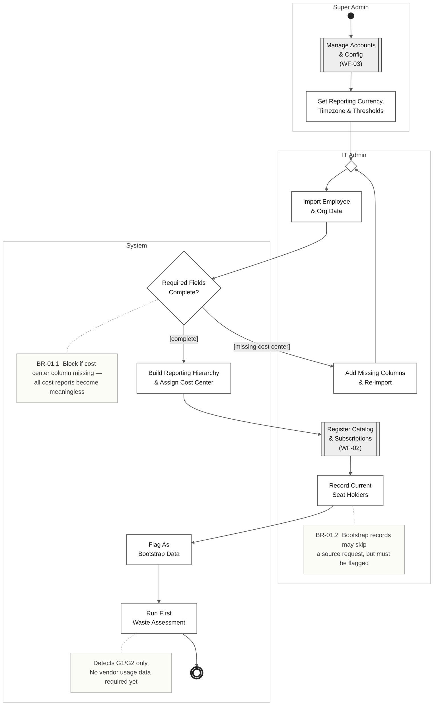
```mermaid
flowchart TB
    subgraph QT["Super Admin"]
        direction TB
        ini((" "))
        c1[["Manage Accounts<br/>& Config<br/>(WF-03)"]]
        a1["Set Reporting Currency,<br/>Timezone & Thresholds"]
    end
    subgraph IT["IT Admin"]
        direction TB
        m1{" "}
        a2["Import Employee<br/>& Org Data"]
        a3["Add Missing Columns<br/>& Re-import"]
        c2[["Register Catalog<br/>& Subscriptions<br/>(WF-02)"]]
        a5["Record Current<br/>Seat Holders"]
        nt1["BR-01.2  Bootstrap records may skip<br/>a source request, but must be flagged"]
    end
    subgraph HT["System"]
        direction TB
        d1{"Required Fields<br/>Complete?"}
        nt0["BR-01.1  Block if cost center column missing —<br/>all cost reports become meaningless"]
        a4["Build Reporting Hierarchy<br/>& Assign Cost Center"]
        a6["Flag As<br/>Bootstrap Data"]
        a7["Run First<br/>Waste Assessment"]
        nt2["Detects G1/G2 only.<br/>No vendor usage data required yet"]
        fin(((" ")))
    end

    ini --> c1
    c1 --> a1
    a1 --> m1
    m1 --> a2
    a2 --> d1
    d1 -->|"[missing cost center]"| a3
    a3 --> m1
    d1 -->|"[complete]"| a4
    a4 --> c2
    c2 --> a5
    a5 --> a6
    a6 --> a7
    a7 --> fin
    d1 -.- nt0
    a5 -.- nt1
    a7 -.- nt2

    classDef ini  fill:#262626,stroke:#262626,stroke-width:2px,color:#262626
    classDef fin  fill:#ffffff,stroke:#262626,stroke-width:4px,color:#262626
    classDef ff   fill:#ffffff,stroke:#262626,stroke-width:2px,color:#262626
    classDef act  fill:#ffffff,stroke:#595959,stroke-width:1.5px,color:#1a1a1a
    classDef subact fill:#eeeeee,stroke:#595959,stroke-width:1.5px,color:#1a1a1a
    classDef dec  fill:#ffffff,stroke:#595959,stroke-width:1.5px,color:#1a1a1a
    classDef mrg  fill:#ffffff,stroke:#595959,stroke-width:1.5px,color:#ffffff
    classDef bar  fill:#262626,stroke:#262626,stroke-width:3px,color:#262626
    classDef time fill:#f7f7f7,stroke:#595959,stroke-width:1.5px,color:#1a1a1a
    classDef note fill:#fcfcf7,stroke:#a6a6a6,stroke-width:1px,color:#404040
    class ini ini
    class c1,c2 subact
    class a1,a2,a3,a4,a5,a6,a7 act
    class m1 mrg
    class d1 dec
    class fin fin
    class nt0,nt1,nt2 note
    style QT fill:#ffffff,stroke:#bfbfbf,stroke-width:1px,color:#404040
    style IT fill:#ffffff,stroke:#bfbfbf,stroke-width:1px,color:#404040
    style HT fill:#ffffff,stroke:#bfbfbf,stroke-width:1px,color:#404040
    linkStyle default stroke:#595959,stroke-width:1.5px
    linkStyle 13,14,15 stroke:#a6a6a6,stroke-width:1px,stroke-dasharray:4 3
```

**Quy tắc nghiệp vụ chi phối**

| Mã        | Nội dung                                                                                 |
| --------- | ---------------------------------------------------------------------------------------- |
| `BR-01.1` | Không cho ghi hiện trạng cấp phát nếu chưa xong dữ liệu nhân sự và thuê bao              |
| `BR-01.2` | Bản ghi cấp quyền nhập ở bước khởi tạo phải đánh dấu là dữ liệu khởi tạo                 |
| `BR-01.3` | Mọi bước dùng chung khung import sáu bước, gồm cả bước xem trước bắt buộc                |
| `BR-01.4` | Trạng thái rỗng của màn hình chính phải dẫn về đúng bước khởi tạo còn thiếu              |
| `FR-9.4`  | Assignment nhập ở bước khởi tạo được phép không có yêu cầu nguồn, và phải đánh dấu       |
| `FR-9.5`  | Sau bước ghi nhận hiện trạng, hệ thống chạy ngay lần đánh giá đầu tiên cho nhóm G1 và G2 |

---

### 3.2. `WF-02` — Catalog & Subscription Setup

|                   |                                                                                           |
| ----------------- | ----------------------------------------------------------------------------------------- |
| **Thuộc**         | MF-0                                                                                      |
| **Nhịp chạy**     | Theo sự kiện                                                                              |
| **Kích hoạt bởi** | Quản trị viên CNTT thêm một ứng dụng hoặc một thuê bao mới                                |
| **Tác nhân**      | IT Admin · System                                                                        |
| **Flow con**      | `F-06`                                                                                    |
| **Giai đoạn**     | App Registration → Legal Classification → Commercial Setup                               |
| **Xong khi**      | Ứng dụng có mặt trong danh mục để nhân viên chọn được, và lịch cảnh báo gia hạn đã có mốc |

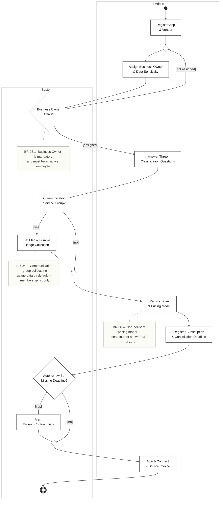
```mermaid
flowchart TB
    subgraph IT["IT Admin"]
        direction TB
        ini((" "))
        a1["Register App<br/>& Vendor"]
        m1{" "}
        a2["Assign Business Owner<br/>& Data Sensitivity"]
        a3["Answer Three<br/>Classification Questions"]
        a5["Register Plan<br/>& Pricing Model"]
        nt2["BR-06.4  Non-per-seat pricing model —<br/>seat counter shows 'n/a', not zero"]
        a6["Register Subscription<br/>& Cancellation Deadline"]
        a8["Attach Contract<br/>& Source Invoice"]
    end
    subgraph HT["System"]
        direction TB
        d1{"Business Owner<br/>Active?"}
        nt0["BR-06.1  Business Owner is mandatory<br/>and must be an active employee"]
        d2{"Communication<br/>Service Group?"}
        a4["Set Flag & Disable<br/>Usage Collection"]
        nt1["BR-06.2  Communication group collects no<br/>usage data by default — membership list only"]
        m2{" "}
        d3{"Auto-renew But<br/>Missing Deadline?"}
        a7["Alert:<br/>Missing Contract Data"]
        m3{" "}
        fin(((" ")))
    end

    ini --> a1
    a1 --> m1
    m1 --> a2
    a2 --> d1
    d1 -->|"[not assigned]"| m1
    d1 -->|"[assigned]"| a3
    a3 --> d2
    d2 -->|"[yes]"| a4
    a4 --> m2
    d2 -->|"[no]"| m2
    m2 --> a5
    a5 --> a6
    a6 --> d3
    d3 -->|"[yes]"| a7
    a7 --> m3
    d3 -->|"[no]"| m3
    m3 --> a8
    a8 --> fin
    d1 -.- nt0
    a4 -.- nt1
    a5 -.- nt2

    classDef ini  fill:#262626,stroke:#262626,stroke-width:2px,color:#262626
    classDef fin  fill:#ffffff,stroke:#262626,stroke-width:4px,color:#262626
    classDef ff   fill:#ffffff,stroke:#262626,stroke-width:2px,color:#262626
    classDef act  fill:#ffffff,stroke:#595959,stroke-width:1.5px,color:#1a1a1a
    classDef subact fill:#eeeeee,stroke:#595959,stroke-width:1.5px,color:#1a1a1a
    classDef dec  fill:#ffffff,stroke:#595959,stroke-width:1.5px,color:#1a1a1a
    classDef mrg  fill:#ffffff,stroke:#595959,stroke-width:1.5px,color:#ffffff
    classDef bar  fill:#262626,stroke:#262626,stroke-width:3px,color:#262626
    classDef time fill:#f7f7f7,stroke:#595959,stroke-width:1.5px,color:#1a1a1a
    classDef note fill:#fcfcf7,stroke:#a6a6a6,stroke-width:1px,color:#404040
    class ini ini
    class a1,a2,a3,a4,a5,a6,a7,a8 act
    class m1,m2,m3 mrg
    class d1,d2,d3 dec
    class fin fin
    class nt0,nt1,nt2 note
    style IT fill:#ffffff,stroke:#bfbfbf,stroke-width:1px,color:#404040
    style HT fill:#ffffff,stroke:#bfbfbf,stroke-width:1px,color:#404040
    linkStyle default stroke:#595959,stroke-width:1.5px
    linkStyle 18,19,20 stroke:#a6a6a6,stroke-width:1px,stroke-dasharray:4 3
```

**Quy tắc nghiệp vụ chi phối**

| Mã        | Nội dung                                                                                  |
| --------- | ----------------------------------------------------------------------------------------- |
| `BR-06.1` | Business Owner bắt buộc và phải là người đang làm việc                                    |
| `BR-06.2` | Cờ nhóm dịch vụ liên lạc quyết định chế độ xử lý dữ liệu                                  |
| `BR-06.3` | Bình luận trong tài liệu, ghi chú công việc, nhận xét bản thiết kế không tính là nhắn tin |
| `BR-06.4` | Mô hình giá không theo đầu người thì phân hệ phát hiện lãng phí không áp dụng             |
| `BR-06.5` | Bật thu thập cho nhóm liên lạc cần xác nhận của quản trị hệ thống, có ghi lý do           |
| `INV-06`  | Mỗi mục danh mục có đúng một Business Owner đang làm việc, không được rỗng                |

---

### 3.3. `WF-03` — Account, Role & Config Administration

|                   |                                                                                                              |
| ----------------- | ------------------------------------------------------------------------------------------------------------ |
| **Thuộc**         | MF-0                                                                                                         |
| **Nhịp chạy**     | Liên tục                                                                                                     |
| **Kích hoạt bởi** | Quản trị hệ thống thay đổi phân quyền, cấu hình, hoặc mở màn hình giám sát                                   |
| **Tác nhân**      | Super Admin · System                                                                                        |
| **Flow con**      | `F-37`, `F-38`                                                                                               |
| **Giai đoạn**     | Select Action → Permission Control → Record                                                                 |
| **Xong khi**      | Mỗi vai trò chỉ làm được việc thuộc vai trò đó, và mọi thay đổi có hậu quả đều truy được về một dòng nhật ký |

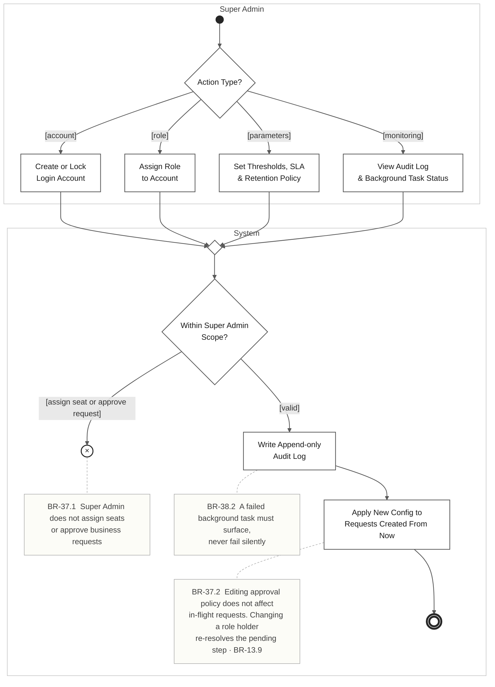
```mermaid
flowchart TB
    subgraph QT["Super Admin"]
        direction TB
        ini((" "))
        d1{"Action Type?"}
        a1["Create or Lock<br/>Login Account"]
        a2["Assign Role<br/>to Account"]
        a3["Set Thresholds, SLA<br/>& Retention Policy"]
        a4["View Audit Log<br/>& Background Task Status"]
    end
    subgraph HT["System"]
        direction TB
        m1{" "}
        d2{"Within Super Admin<br/>Scope?"}
        ff1(("×"))
        nt0["BR-37.1  Super Admin does not assign seats<br/>or approve business requests"]
        a5["Write Append-only<br/>Audit Log"]
        nt2["BR-38.2  A failed background task must surface,<br/>never fail silently"]
        a6["Apply New Config to<br/>Requests Created From Now"]
        nt1["BR-37.2  Editing approval policy does not affect<br/>in-flight requests. Changing a role holder<br/>re-resolves the pending step · BR-13.9"]
        fin(((" ")))
    end

    ini --> d1
    d1 -->|"[account]"| a1
    d1 -->|"[role]"| a2
    d1 -->|"[parameters]"| a3
    d1 -->|"[monitoring]"| a4
    a1 --> m1
    a2 --> m1
    a3 --> m1
    a4 --> m1
    m1 --> d2
    d2 -->|"[assign seat or approve request]"| ff1
    d2 -->|"[valid]"| a5
    a5 --> a6
    a6 --> fin
    ff1 -.- nt0
    a6 -.- nt1
    a5 -.- nt2

    classDef ini  fill:#262626,stroke:#262626,stroke-width:2px,color:#262626
    classDef fin  fill:#ffffff,stroke:#262626,stroke-width:4px,color:#262626
    classDef ff   fill:#ffffff,stroke:#262626,stroke-width:2px,color:#262626
    classDef act  fill:#ffffff,stroke:#595959,stroke-width:1.5px,color:#1a1a1a
    classDef subact fill:#eeeeee,stroke:#595959,stroke-width:1.5px,color:#1a1a1a
    classDef dec  fill:#ffffff,stroke:#595959,stroke-width:1.5px,color:#1a1a1a
    classDef mrg  fill:#ffffff,stroke:#595959,stroke-width:1.5px,color:#ffffff
    classDef bar  fill:#262626,stroke:#262626,stroke-width:3px,color:#262626
    classDef time fill:#f7f7f7,stroke:#595959,stroke-width:1.5px,color:#1a1a1a
    classDef note fill:#fcfcf7,stroke:#a6a6a6,stroke-width:1px,color:#404040
    class ini ini
    class d1,d2 dec
    class a1,a2,a3,a4,a5,a6 act
    class m1 mrg
    class ff1 ff
    class fin fin
    class nt0,nt1,nt2 note
    style QT fill:#ffffff,stroke:#bfbfbf,stroke-width:1px,color:#404040
    style HT fill:#ffffff,stroke:#bfbfbf,stroke-width:1px,color:#404040
    linkStyle default stroke:#595959,stroke-width:1.5px
    linkStyle 14,15,16 stroke:#a6a6a6,stroke-width:1px,stroke-dasharray:4 3
```

**Quy tắc nghiệp vụ chi phối**

| Mã        | Nội dung                                                              |
| --------- | --------------------------------------------------------------------- |
| `BR-37.1` | Quản trị hệ thống không gán suất và không phê duyệt yêu cầu nghiệp vụ |
| `BR-37.2` | Sửa chính sách duyệt không ảnh hưởng các yêu cầu đang chạy; đổi người giữ vai thì bước đang chờ xác định lại theo `BR-13.9` *(v2.4, `QĐ-28d`)* — ghi chú `nt1` |
| `BR-38.1` | Nhật ký kiểm toán chỉ ghi thêm, không sửa không xóa                   |
| `BR-38.2` | Tác vụ nền thất bại phải hiện lên, không im lặng bỏ qua               |

---

### 3.4. `WF-04` — New Employee Onboarding

|                   |                                                                                                                        |
| ----------------- | ---------------------------------------------------------------------------------------------------------------------- |
| **Thuộc**         | MF-1                                                                                                                   |
| **Nhịp chạy**     | Theo sự kiện                                                                                                           |
| **Kích hoạt bởi** | Quản trị viên CNTT tạo hồ sơ nhân viên mới                                                                             |
| **Tác nhân**      | Manager · IT Admin · System                                                                                           |
| **Flow con**      | `F-02`                                                                                                                 |
| **Giai đoạn**     | Create Record → Create Request → Provision                                                                            |
| **Xong khi**      | Nhân viên đăng nhập được vào mọi ứng dụng đã duyệt trong ngày làm việc đầu tiên, và mỗi quyền truy được về một yêu cầu |

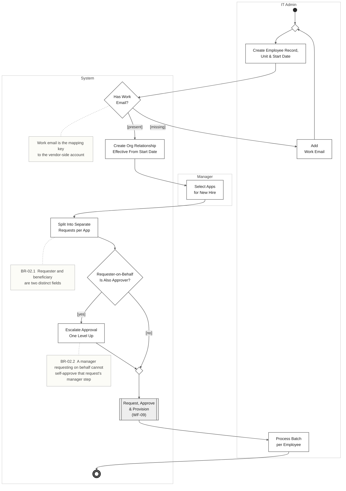
```mermaid
flowchart TB
    subgraph QL["Manager"]
        direction TB
        a4["Select Apps<br/>for New Hire"]
    end
    subgraph IT["IT Admin"]
        direction TB
        ini((" "))
        m1{" "}
        a1["Create Employee Record,<br/>Unit & Start Date"]
        a2["Add<br/>Work Email"]
        a7["Process Batch<br/>per Employee"]
    end
    subgraph HT["System"]
        direction TB
        d1{"Has Work<br/>Email?"}
        nt0["Work email is the mapping key<br/>to the vendor-side account"]
        a3["Create Org Relationship<br/>Effective From Start Date"]
        a5["Split Into Separate<br/>Requests per App"]
        nt1["BR-02.1  Requester and beneficiary<br/>are two distinct fields"]
        d2{"Requester-on-Behalf<br/>Is Also Approver?"}
        a6["Escalate Approval<br/>One Level Up"]
        nt2["BR-02.2  A manager requesting on behalf cannot<br/>self-approve that request's manager step"]
        m2{" "}
        c1[["Request, Approve<br/>& Provision<br/>(WF-09)"]]
        fin(((" ")))
    end

    ini --> m1
    m1 --> a1
    a1 --> d1
    d1 -->|"[missing]"| a2
    a2 --> m1
    d1 -->|"[present]"| a3
    a3 --> a4
    a4 --> a5
    a5 --> d2
    d2 -->|"[yes]"| a6
    a6 --> m2
    d2 -->|"[no]"| m2
    m2 --> c1
    c1 --> a7
    a7 --> fin
    d1 -.- nt0
    a5 -.- nt1
    a6 -.- nt2

    classDef ini  fill:#262626,stroke:#262626,stroke-width:2px,color:#262626
    classDef fin  fill:#ffffff,stroke:#262626,stroke-width:4px,color:#262626
    classDef ff   fill:#ffffff,stroke:#262626,stroke-width:2px,color:#262626
    classDef act  fill:#ffffff,stroke:#595959,stroke-width:1.5px,color:#1a1a1a
    classDef subact fill:#eeeeee,stroke:#595959,stroke-width:1.5px,color:#1a1a1a
    classDef dec  fill:#ffffff,stroke:#595959,stroke-width:1.5px,color:#1a1a1a
    classDef mrg  fill:#ffffff,stroke:#595959,stroke-width:1.5px,color:#ffffff
    classDef bar  fill:#262626,stroke:#262626,stroke-width:3px,color:#262626
    classDef time fill:#f7f7f7,stroke:#595959,stroke-width:1.5px,color:#1a1a1a
    classDef note fill:#fcfcf7,stroke:#a6a6a6,stroke-width:1px,color:#404040
    class ini ini
    class m1,m2 mrg
    class a1,a2,a3,a4,a5,a6,a7 act
    class d1,d2 dec
    class c1 subact
    class fin fin
    class nt0,nt1,nt2 note
    style QL fill:#ffffff,stroke:#bfbfbf,stroke-width:1px,color:#404040
    style IT fill:#ffffff,stroke:#bfbfbf,stroke-width:1px,color:#404040
    style HT fill:#ffffff,stroke:#bfbfbf,stroke-width:1px,color:#404040
    linkStyle default stroke:#595959,stroke-width:1.5px
    linkStyle 15,16,17 stroke:#a6a6a6,stroke-width:1px,stroke-dasharray:4 3
```

**Quy tắc nghiệp vụ chi phối**

| Mã        | Nội dung                                                                                       |
| --------- | ---------------------------------------------------------------------------------------------- |
| `BR-02.1` | Quản lý được tạo yêu cầu hộ, nhưng người thụ hưởng vẫn là nhân viên mới                        |
| `BR-02.2` | Quản lý tạo hộ thì không tự duyệt bước quản lý; yêu cầu chuyển lên cấp trên                    |
| `BR-02.3` | Yêu cầu cho người chưa tới ngày vào được tạo trước, nhưng ngày hiệu lực không sớm hơn ngày vào |

---

### 3.5. `WF-05` — Employee Manager or Cost Center Change *(tới v2.2: “Nhân viên chuyển phòng ban” — đổi tên theo `F-03`, `QĐ-23`)*

|                   |                                                                                                   |
| ----------------- | ------------------------------------------------------------------------------------------------- |
| **Thuộc**         | MF-1                                                                                              |
| **Nhịp chạy**     | Theo sự kiện                                                                                      |
| **Kích hoạt bởi** | Quản trị viên CNTT cập nhật quan hệ tổ chức kèm ngày hiệu lực                                     |
| **Tác nhân**      | Manager · IT Admin · System                                                                      |
| **Flow con**      | `F-03`                                                                                            |
| **Giai đoạn**     | Record Change → Parallel Propagation → Handover                                                  |
| **Xong khi**      | Báo cáo chi phí của tháng trước ngày chuyển vẫn hiển thị đơn vị cũ, tháng sau hiển thị đơn vị mới |

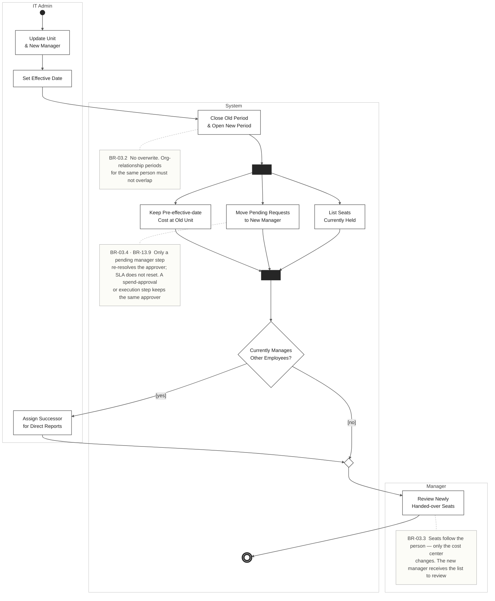
```mermaid
flowchart TB
    subgraph QL["Manager"]
        direction TB
        a5["Review Newly<br/>Handed-over Seats"]
        nt2["BR-03.3  Seats follow the person — only the cost center<br/>changes. The new manager receives the list to review"]
    end
    subgraph IT["IT Admin"]
        direction TB
        ini((" "))
        a1["Update Unit<br/>& New Manager"]
        a2["Set Effective Date"]
        a4["Assign Successor<br/>for Direct Reports"]
    end
    subgraph HT["System"]
        direction TB
        a3["Close Old Period<br/>& Open New Period"]
        nt0["BR-03.2  No overwrite. Org-relationship periods<br/>for the same person must not overlap"]
        fk[" "]
        b1["Keep Pre-effective-date<br/>Cost at Old Unit"]
        b2["Move Pending Requests<br/>to New Manager"]
        b3["List Seats<br/>Currently Held"]
        nt1["BR-03.4 · BR-13.9  Only a pending manager step<br/>re-resolves the approver; SLA does not reset. A spend-approval<br/>or execution step keeps the same approver"]
        jn[" "]
        d1{"Currently Manages<br/>Other Employees?"}
        m1{" "}
        fin(((" ")))
    end

    ini --> a1
    a1 --> a2
    a2 --> a3
    a3 --> fk
    fk --> b1
    fk --> b2
    fk --> b3
    b1 --> jn
    b2 --> jn
    b3 --> jn
    jn --> d1
    d1 -->|"[yes]"| a4
    a4 --> m1
    d1 -->|"[no]"| m1
    m1 --> a5
    a5 --> fin
    a3 -.- nt0
    b2 -.- nt1
    a5 -.- nt2

    classDef ini  fill:#262626,stroke:#262626,stroke-width:2px,color:#262626
    classDef fin  fill:#ffffff,stroke:#262626,stroke-width:4px,color:#262626
    classDef ff   fill:#ffffff,stroke:#262626,stroke-width:2px,color:#262626
    classDef act  fill:#ffffff,stroke:#595959,stroke-width:1.5px,color:#1a1a1a
    classDef subact fill:#eeeeee,stroke:#595959,stroke-width:1.5px,color:#1a1a1a
    classDef dec  fill:#ffffff,stroke:#595959,stroke-width:1.5px,color:#1a1a1a
    classDef mrg  fill:#ffffff,stroke:#595959,stroke-width:1.5px,color:#ffffff
    classDef bar  fill:#262626,stroke:#262626,stroke-width:3px,color:#262626
    classDef time fill:#f7f7f7,stroke:#595959,stroke-width:1.5px,color:#1a1a1a
    classDef note fill:#fcfcf7,stroke:#a6a6a6,stroke-width:1px,color:#404040
    class ini ini
    class a1,a2,a3,b1,b2,b3,a4,a5 act
    class fk,jn bar
    class d1 dec
    class m1 mrg
    class fin fin
    class nt0,nt1,nt2 note
    style QL fill:#ffffff,stroke:#bfbfbf,stroke-width:1px,color:#404040
    style IT fill:#ffffff,stroke:#bfbfbf,stroke-width:1px,color:#404040
    style HT fill:#ffffff,stroke:#bfbfbf,stroke-width:1px,color:#404040
    linkStyle default stroke:#595959,stroke-width:1.5px
    linkStyle 16,17,18 stroke:#a6a6a6,stroke-width:1px,stroke-dasharray:4 3
```

**Quy tắc nghiệp vụ chi phối**

| Mã        | Nội dung                                                                                      |
| --------- | --------------------------------------------------------------------------------------------- |
| `BR-03.1` | Ngày hiệu lực được phép đặt trong quá khứ, nhưng phải cảnh báo ảnh hưởng báo cáo đã phát hành |
| `BR-03.2` | Các giai đoạn quan hệ tổ chức của cùng một nhân viên không được chồng lấn                     |
| `BR-03.3` | Suất đi theo người; chỉ đơn vị chịu chi phí thay đổi                                          |
| `BR-03.4` · `BR-13.9` | Đổi `manager_id` ⟹ chỉ **bước quản lý đang chờ** được xác định lại theo cây mới (`b2`), SLA không đặt lại; yêu cầu đã tới bước duyệt chi hoặc bước thực thi thì không chuyển người duyệt *(sửa ở v2.4 — `QĐ-28d`)* — ghi chú `nt1` |

---

### 3.6. `WF-06` — Extended Leave & Return

|                   |                                                                                                      |
| ----------------- | ---------------------------------------------------------------------------------------------------- |
| **Thuộc**         | MF-1                                                                                                 |
| **Nhịp chạy**     | Theo sự kiện                                                                                         |
| **Kích hoạt bởi** | Quản trị viên CNTT đổi trạng thái nhân viên sang nghỉ dài                                            |
| **Tác nhân**      | IT Admin · System                                                                                   |
| **Flow con**      | `F-04`                                                                                               |
| **Giai đoạn**     | Leave Start → Wait & Remind → Return                                                                 |
| **Xong khi**      | Người vừa quay lại sau kỳ nghỉ dài không xuất hiện trong hàng đợi khuyến nghị trong thời gian ân hạn |

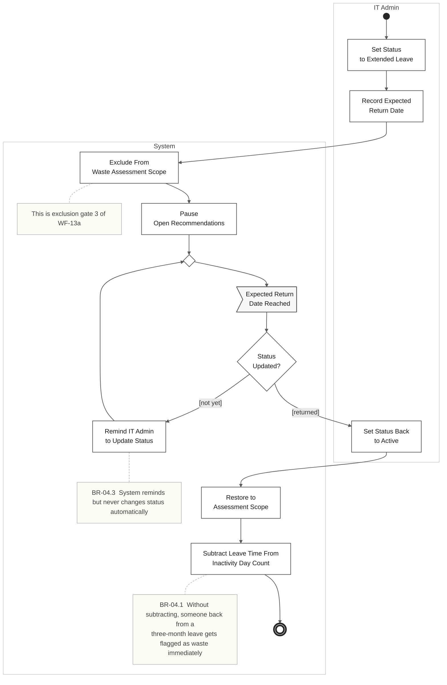
```mermaid
flowchart TB
    subgraph IT["IT Admin"]
        direction TB
        ini((" "))
        a1["Set Status<br/>to Extended Leave"]
        a2["Record Expected<br/>Return Date"]
        a6["Set Status Back<br/>to Active"]
    end
    subgraph HT["System"]
        direction TB
        a3["Exclude From<br/>Waste Assessment Scope"]
        nt0["This is exclusion gate 3 of WF-13a"]
        a4["Pause<br/>Open Recommendations"]
        m1{" "}
        t1>"Expected Return<br/>Date Reached"]
        d1{"Status<br/>Updated?"}
        a5["Remind IT Admin<br/>to Update Status"]
        nt1["BR-04.3  System reminds but never changes status automatically"]
        a7["Restore to<br/>Assessment Scope"]
        a8["Subtract Leave Time From<br/>Inactivity Day Count"]
        nt2["BR-04.1  Without subtracting, someone back from a<br/>three-month leave gets flagged as waste immediately"]
        fin(((" ")))
    end

    ini --> a1
    a1 --> a2
    a2 --> a3
    a3 --> a4
    a4 --> m1
    m1 --> t1
    t1 --> d1
    d1 -->|"[not yet]"| a5
    a5 --> m1
    d1 -->|"[returned]"| a6
    a6 --> a7
    a7 --> a8
    a8 --> fin
    a3 -.- nt0
    a5 -.- nt1
    a8 -.- nt2

    classDef ini  fill:#262626,stroke:#262626,stroke-width:2px,color:#262626
    classDef fin  fill:#ffffff,stroke:#262626,stroke-width:4px,color:#262626
    classDef ff   fill:#ffffff,stroke:#262626,stroke-width:2px,color:#262626
    classDef act  fill:#ffffff,stroke:#595959,stroke-width:1.5px,color:#1a1a1a
    classDef subact fill:#eeeeee,stroke:#595959,stroke-width:1.5px,color:#1a1a1a
    classDef dec  fill:#ffffff,stroke:#595959,stroke-width:1.5px,color:#1a1a1a
    classDef mrg  fill:#ffffff,stroke:#595959,stroke-width:1.5px,color:#ffffff
    classDef bar  fill:#262626,stroke:#262626,stroke-width:3px,color:#262626
    classDef time fill:#f7f7f7,stroke:#595959,stroke-width:1.5px,color:#1a1a1a
    classDef note fill:#fcfcf7,stroke:#a6a6a6,stroke-width:1px,color:#404040
    class ini ini
    class a1,a2,a3,a4,a5,a6,a7,a8 act
    class m1 mrg
    class t1 time
    class d1 dec
    class fin fin
    class nt0,nt1,nt2 note
    style IT fill:#ffffff,stroke:#bfbfbf,stroke-width:1px,color:#404040
    style HT fill:#ffffff,stroke:#bfbfbf,stroke-width:1px,color:#404040
    linkStyle default stroke:#595959,stroke-width:1.5px
    linkStyle 13,14,15 stroke:#a6a6a6,stroke-width:1px,stroke-dasharray:4 3
```

**Quy tắc nghiệp vụ chi phối**

| Mã        | Nội dung                                                                                |
| --------- | --------------------------------------------------------------------------------------- |
| `BR-04.1` | Số ngày không hoạt động tính bằng tổng ngày trừ đi khoảng thời gian nghỉ dài            |
| `BR-04.2` | Trạng thái nghỉ dài do quản trị viên CNTT cập nhật tay; không tích hợp hệ thống nhân sự |
| `BR-04.3` | Nghỉ dài quá thời hạn dự kiến thì hệ thống nhắc, không tự đổi trạng thái                |

---

### 3.7. `WF-07` — Offboarding & Full Access Reclaim  ·  chuỗi demo **D-3**

|                   |                                                                                                                                          |
| ----------------- | ---------------------------------------------------------------------------------------------------------------------------------------- |
| **Thuộc**         | MF-1                                                                                                                                     |
| **Nhịp chạy**     | Theo sự kiện                                                                                                                             |
| **Kích hoạt bởi** | Quản trị viên CNTT chuyển trạng thái nhân viên sang đang bàn giao                                                                        |
| **Tác nhân**      | Manager · IT Admin · System                                                                                                             |
| **Flow con**      | `F-05`, `F-41`                                                                                                                           |
| **Giai đoạn**     | Handover → Reclaim → Data Deletion                                                                                                       |
| **Xong khi**      | Không còn suất nào gắn với người đã nghỉ, số tiết kiệm được ghi nhận, và sau 30 ngày dữ liệu hoạt động chi tiết không còn trong hệ thống |

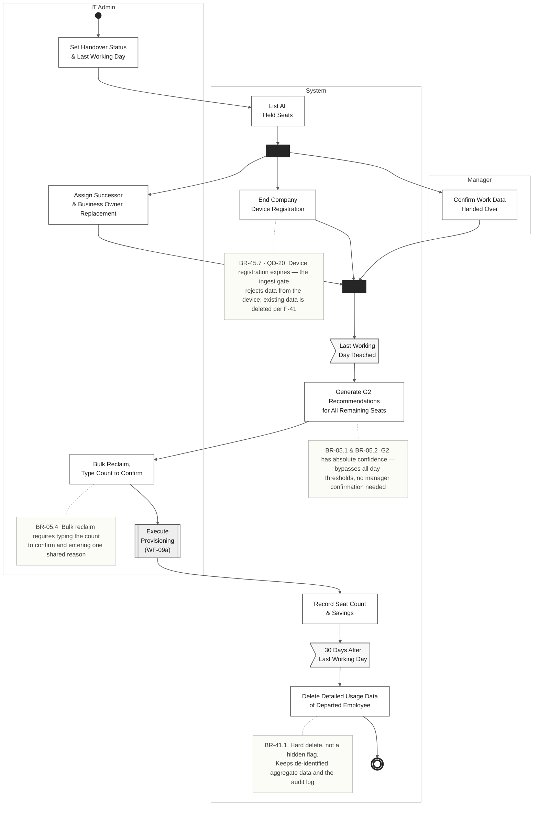
```mermaid
flowchart TB
    subgraph QL["Manager"]
        direction TB
        b1["Confirm Work Data<br/>Handed Over"]
    end
    subgraph IT["IT Admin"]
        direction TB
        ini((" "))
        a1["Set Handover Status<br/>& Last Working Day"]
        b2["Assign Successor<br/>& Business Owner Replacement"]
        a4["Bulk Reclaim,<br/>Type Count to Confirm"]
        nt1["BR-05.4  Bulk reclaim requires typing the count<br/>to confirm and entering one shared reason"]
        c1[["Execute<br/>Provisioning<br/>(WF-09a)"]]
    end
    subgraph HT["System"]
        direction TB
        a2["List All<br/>Held Seats"]
        fk[" "]
        b3["End Company<br/>Device Registration"]
        nt3["BR-45.7 · QĐ-20  Device registration expires — the ingest gate<br/>rejects data from the device; existing data is deleted per F-41"]
        jn[" "]
        t1>"Last Working<br/>Day Reached"]
        a3["Generate G2 Recommendations<br/>for All Remaining Seats"]
        nt0["BR-05.1 & BR-05.2  G2 has absolute confidence —<br/>bypasses all day thresholds, no manager confirmation needed"]
        a5["Record Seat Count<br/>& Savings"]
        t2>"30 Days After<br/>Last Working Day"]
        a6["Delete Detailed Usage Data<br/>of Departed Employee"]
        nt2["BR-41.1  Hard delete, not a hidden flag.<br/>Keeps de-identified aggregate data and the audit log"]
        fin(((" ")))
    end

    ini --> a1
    a1 --> a2
    a2 --> fk
    fk --> b1
    fk --> b2
    fk --> b3
    b1 --> jn
    b2 --> jn
    b3 --> jn
    jn --> t1
    t1 --> a3
    a3 --> a4
    a4 --> c1
    c1 --> a5
    a5 --> t2
    t2 --> a6
    a6 --> fin
    a3 -.- nt0
    a4 -.- nt1
    a6 -.- nt2
    b3 -.- nt3

    classDef ini  fill:#262626,stroke:#262626,stroke-width:2px,color:#262626
    classDef fin  fill:#ffffff,stroke:#262626,stroke-width:4px,color:#262626
    classDef ff   fill:#ffffff,stroke:#262626,stroke-width:2px,color:#262626
    classDef act  fill:#ffffff,stroke:#595959,stroke-width:1.5px,color:#1a1a1a
    classDef subact fill:#eeeeee,stroke:#595959,stroke-width:1.5px,color:#1a1a1a
    classDef dec  fill:#ffffff,stroke:#595959,stroke-width:1.5px,color:#1a1a1a
    classDef mrg  fill:#ffffff,stroke:#595959,stroke-width:1.5px,color:#ffffff
    classDef bar  fill:#262626,stroke:#262626,stroke-width:3px,color:#262626
    classDef time fill:#f7f7f7,stroke:#595959,stroke-width:1.5px,color:#1a1a1a
    classDef note fill:#fcfcf7,stroke:#a6a6a6,stroke-width:1px,color:#404040
    class ini ini
    class a1,a2,b1,b2,b3,a3,a4,a5,a6 act
    class fk,jn bar
    class t1,t2 time
    class c1 subact
    class fin fin
    class nt0,nt1,nt2,nt3 note
    style QL fill:#ffffff,stroke:#bfbfbf,stroke-width:1px,color:#404040
    style IT fill:#ffffff,stroke:#bfbfbf,stroke-width:1px,color:#404040
    style HT fill:#ffffff,stroke:#bfbfbf,stroke-width:1px,color:#404040
    linkStyle default stroke:#595959,stroke-width:1.5px
    linkStyle 17,18,19,20 stroke:#a6a6a6,stroke-width:1px,stroke-dasharray:4 3
```

**Quy tắc nghiệp vụ chi phối**

| Mã        | Nội dung                                                                |
| --------- | ----------------------------------------------------------------------- |
| `BR-05.1` | Khuyến nghị nhóm G2 có độ tin cậy tuyệt đối, bỏ qua mọi ngưỡng ngày     |
| `BR-05.2` | Nhóm G2 không cần quản lý xác nhận, chuyển thẳng cho quản trị viên CNTT |
| `BR-05.3` | Trạng thái đã nghỉ việc bắt buộc có ngày nghỉ                           |
| `BR-05.4` | Thu hồi hàng loạt yêu cầu gõ số lượng để xác nhận và nhập lý do chung   |
| `BR-13.9` *(v2.4, `QĐ-28d`)* | Người nghỉ việc đang là người được giao của bước duyệt đang chờ ⟹ sau khi chỉ định người kế nhiệm (`b2`), bước được xác định lại theo cây mới; SLA không đặt lại. Luồng duyệt nằm ở `WF-09` (`a4d`), không vẽ lại ở đây |
| `BR-05.5` | Dữ liệu hoạt động chi tiết bị xóa sau 30 ngày kể từ ngày làm việc cuối  |
| `BR-41.1` | Xóa là xóa thật, không phải đánh dấu ẩn                                 |
| `BR-41.3` | Nhật ký kiểm toán không bị xóa theo chính sách này                      |
| `BR-45.7` *(v2.3, `QĐ-20`)* | Nghỉ việc ⟹ đăng ký thiết bị công ty hết hiệu lực — nhánh song song thứ ba `b3`; luồng nhận dữ liệu ở `WF-18` |

---

### 3.8. `WF-08` — Fixed-term Worker Expiring

|                   |                                                                                                                        |
| ----------------- | ---------------------------------------------------------------------------------------------------------------------- |
| **Thuộc**         | MF-1                                                                                                                   |
| **Nhịp chạy**     | Theo lịch, hằng ngày                                                                                                   |
| **Kích hoạt bởi** | Tác vụ nền quét ngày kết thúc dự kiến của các quyền có thời hạn                                                        |
| **Tác nhân**      | Manager · IT Admin · System                                                                                           |
| **Flow con**      | `F-39`                                                                                                                 |
| **Giai đoạn**     | Scan & Alert → Decision → Access End                                                                                   |
| **Xong khi**      | Không có quyền nào của người làm có thời hạn tồn tại quá 7 ngày sau ngày kết thúc mà không có quyết định được ghi nhận |

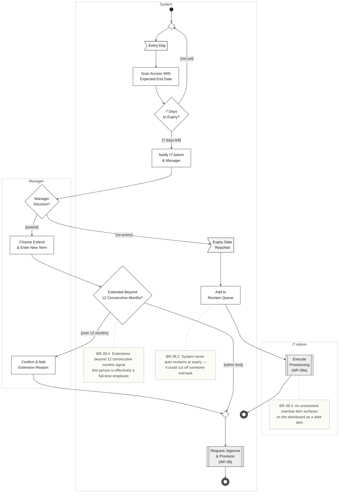
```mermaid
flowchart TB
    subgraph QL["Manager"]
        direction TB
        d2{"Manager<br/>Decision?"}
        a3["Choose Extend<br/>& Enter New Term"]
        a4["Confirm & Add<br/>Extension Reason"]
    end
    subgraph IT["IT Admin"]
        direction TB
        c2[["Execute<br/>Provisioning<br/>(WF-09a)"]]
        nt2["BR-39.3  An unresolved overdue item surfaces<br/>on the dashboard as a debt item"]
    end
    subgraph HT["System"]
        direction TB
        ini((" "))
        m1{" "}
        t1>"Every Day"]
        a1["Scan Access With<br/>Expected End Date"]
        d1{"7 Days<br/>to Expiry?"}
        a2["Notify IT Admin<br/>& Manager"]
        d3{"Extended Beyond<br/>12 Consecutive Months?"}
        nt1["BR-39.4  Extensions beyond 12 consecutive months signal<br/>this person is effectively a full-time employee"]
        t2>"Expiry Date<br/>Reached"]
        a5["Add to<br/>Reclaim Queue"]
        nt0["BR-39.2  System never auto-reclaims at expiry —<br/>it could cut off someone mid-task"]
        m2{" "}
        c1[["Request, Approve<br/>& Provision<br/>(WF-09)"]]
        fin2(((" ")))
        fin1(((" ")))
    end

    ini --> m1
    m1 --> t1
    t1 --> a1
    a1 --> d1
    d1 -->|"[not yet]"| m1
    d1 -->|"[7 days left]"| a2
    a2 --> d2
    d2 -->|"[extend]"| a3
    d2 -->|"[no action]"| t2
    a3 --> d3
    d3 -->|"[over 12 months]"| a4
    a4 --> m2
    d3 -->|"[within limit]"| m2
    m2 --> c1
    c1 --> fin1
    t2 --> a5
    a5 --> c2
    c2 --> fin2
    a5 -.- nt0
    d3 -.- nt1
    c2 -.- nt2

    classDef ini  fill:#262626,stroke:#262626,stroke-width:2px,color:#262626
    classDef fin  fill:#ffffff,stroke:#262626,stroke-width:4px,color:#262626
    classDef ff   fill:#ffffff,stroke:#262626,stroke-width:2px,color:#262626
    classDef act  fill:#ffffff,stroke:#595959,stroke-width:1.5px,color:#1a1a1a
    classDef subact fill:#eeeeee,stroke:#595959,stroke-width:1.5px,color:#1a1a1a
    classDef dec  fill:#ffffff,stroke:#595959,stroke-width:1.5px,color:#1a1a1a
    classDef mrg  fill:#ffffff,stroke:#595959,stroke-width:1.5px,color:#ffffff
    classDef bar  fill:#262626,stroke:#262626,stroke-width:3px,color:#262626
    classDef time fill:#f7f7f7,stroke:#595959,stroke-width:1.5px,color:#1a1a1a
    classDef note fill:#fcfcf7,stroke:#a6a6a6,stroke-width:1px,color:#404040
    class ini ini
    class m1,m2 mrg
    class t1,t2 time
    class a1,a2,a3,a4,a5 act
    class d1,d2,d3 dec
    class c1,c2 subact
    class fin1,fin2 fin
    class nt0,nt1,nt2 note
    style QL fill:#ffffff,stroke:#bfbfbf,stroke-width:1px,color:#404040
    style IT fill:#ffffff,stroke:#bfbfbf,stroke-width:1px,color:#404040
    style HT fill:#ffffff,stroke:#bfbfbf,stroke-width:1px,color:#404040
    linkStyle default stroke:#595959,stroke-width:1.5px
    linkStyle 18,19,20 stroke:#a6a6a6,stroke-width:1px,stroke-dasharray:4 3
```

**Quy tắc nghiệp vụ chi phối**

| Mã        | Nội dung                                                                                     |
| --------- | -------------------------------------------------------------------------------------------- |
| `BR-39.1` | Quyền cấp cho nhà thầu, freelancer, thực tập sinh bắt buộc có ngày kết thúc dự kiến          |
| `BR-39.2` | Hệ thống không tự thu hồi khi tới hạn                                                        |
| `BR-39.3` | Quá hạn mà chưa xử lý thì nổi lên bảng điều khiển như một mục nợ                             |
| `BR-39.4` | Gia hạn quá 12 tháng liên tiếp phải có xác nhận thêm                                         |
| `INV-07`  | Assignment gắn với nhà thầu, freelancer hoặc thực tập sinh bắt buộc có ngày kết thúc dự kiến |

---

### 3.9. `WF-09` — Access Request Approval  ·  chuỗi demo **D-1**

|                   |                                                                                                               |
| ----------------- | ------------------------------------------------------------------------------------------------------------- |
| **Thuộc**         | MF-2                                                                                                          |
| **Nhịp chạy**     | Theo sự kiện                                                                                                  |
| **Kích hoạt bởi** | Nhân viên cần một công cụ đã có trong danh mục đã duyệt                                                       |
| **Tác nhân**      | Employee · **Manager Approver** *(quản lý trực tiếp, quản lý cấp trên, hoặc người duyệt dự phòng ở gốc — đều hành xử với **vai Manager**, `FR-3.3`, `FR-3.6`, `ADR-08`; không ủy quyền — `QĐ-27`)* · Finance *(trả lời khi được hỏi, ghi nhận ngân sách sau duyệt — v2.5, `QĐ-29b`)* · **Spending Approver** *(mới ở v2.3, `QĐ-22`; hoặc người thay thế khi xung đột — `FR-3.15`)* · IT Admin · System |
| **Flow con**      | `F-07`, `F-08`, `F-13`                                                                                        |
| **Giai đoạn**     | Submit Request → Approval → Execution                                                                         |
| **Xong khi**      | Người yêu cầu nhận thông báo có quyền truy cập, và hệ thống ghi được tổng thời gian xử lý tách theo từng bước |

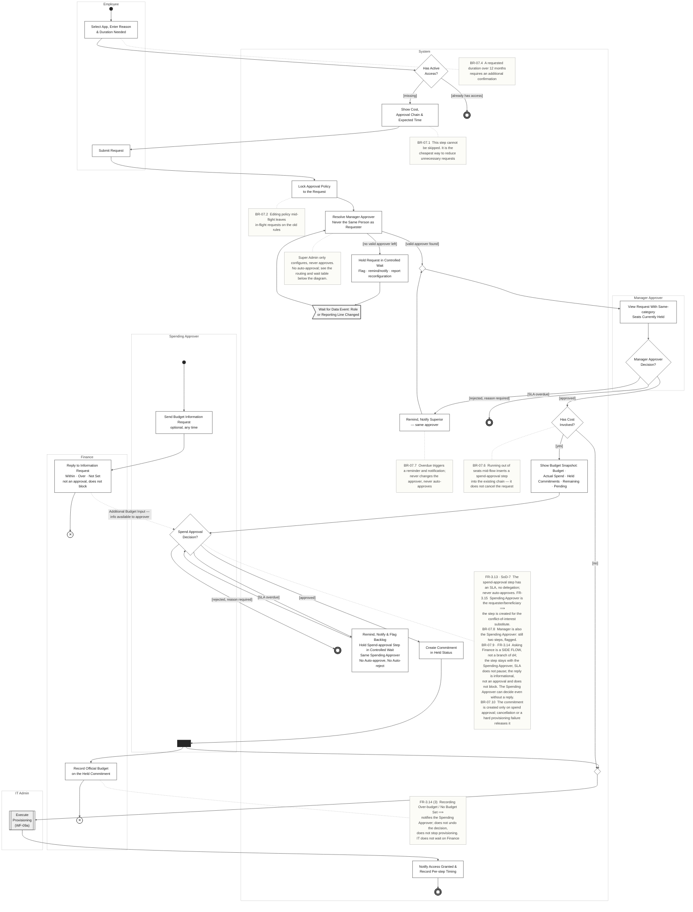
```mermaid
flowchart TB
    subgraph NV["Employee"]
        direction TB
        ini((" "))
        a1["Select App, Enter Reason<br/>& Duration Needed"]
        a3["Submit Request"]
    end
    subgraph QL["Manager Approver"]
        direction TB
        a5["View Request With Same-category<br/>Seats Currently Held"]
        d2{"Manager Approver<br/>Decision?"}
    end
    subgraph TC["Finance"]
        direction TB
        a7["Reply to Information Request<br/>Within · Over · Not Set<br/>not an approval, does not block"]
        ff2(("✕"))
        a9["Record Official Budget<br/>on the Held Commitment"]
        ff1(("✕"))
    end
    subgraph DC["Spending Approver"]
        direction TB
        ini2((" "))
        s1["Send Budget Information Request<br/>optional, any time"]
        d4{"Spend Approval<br/>Decision?"}
        fk1[" "]
    end
    subgraph IT["IT Admin"]
        direction TB
        c1[["Execute<br/>Provisioning<br/>(WF-09a)"]]
    end
    subgraph HT["System"]
        direction TB
        d1{"Has Active<br/>Access?"}
        a2["Show Cost,<br/>Approval Chain & Expected Time"]
        fin0(((" ")))
        nt0["BR-07.1  This step cannot be skipped. It is the<br/>cheapest way to reduce unnecessary requests"]
        a4["Lock Approval Policy<br/>to the Request"]
        nt1["BR-07.2  Editing policy mid-flight leaves<br/>in-flight requests on the old rules"]
        a4b["Resolve Manager Approver<br/>Never the Same Person as Requester"]
        a4c["Hold Request in Controlled Wait<br/>Flag · remind/notify · report reconfiguration"]
        a4d>"Wait for Data Event: Role<br/>or Reporting Line Changed"]
        nt3["Super Admin only configures, never approves.<br/>No auto-approval; see the routing and wait table below the diagram."]
        nt5["BR-07.4  A requested duration over 12 months<br/>requires an additional confirmation"]
        m1{" "}
        a6["Remind, Notify Superior<br/>— same approver"]
        fin1(((" ")))
        nt2["BR-07.7  Overdue triggers a reminder and notification;<br/>never changes the approver, never auto-approves"]
        d3{"Has Cost<br/>Involved?"}
        nt4["BR-07.6  Running out of seats mid-flow inserts a spend-approval step<br/>into the existing chain — it does not cancel the request"]
        a7b["Show Budget Snapshot: Budget ·<br/>Actual Spend · Held Commitments · Remaining · Pending"]
        fin3(((" ")))
        a6b["Remind, Notify & Flag Backlog<br/>Hold Spend-approval Step in Controlled Wait<br/>Same Spending Approver<br/>No Auto-approve, No Auto-reject"]
        a11["Create Commitment<br/>in Held Status"]
        nt6["FR-3.13 · SoD-7  The spend-approval step has an SLA, no delegation;<br/>never auto-approves. FR-3.15  Spending Approver is the requester/beneficiary ⟹<br/>the step is created for the conflict-of-interest substitute.<br/>BR-07.8  Manager is also the Spending Approver: still two steps, flagged.<br/>BR-07.9 · FR-3.14  Asking Finance is a SIDE FLOW, not a branch of d4;<br/>the step stays with the Spending Approver, SLA does not pause; the reply is informational,<br/>not an approval and does not block. The Spending Approver can decide even without a reply.<br/>BR-07.10  The commitment is created only on spend approval; cancellation or a hard provisioning failure releases it"]
        nt7["FR-3.14 (3)  Recording Over-budget / No Budget Set ⟹<br/>notifies the Spending Approver; does not undo the decision,<br/>does not stop provisioning. IT does not wait on Finance"]
        m2{" "}
        a8["Notify Access Granted &<br/>Record Per-step Timing"]
        fin2(((" ")))
    end

    ini --> a1
    a1 --> d1
    d1 -->|"[already has access]"| fin0
    d1 -->|"[missing]"| a2
    a2 --> a3
    a3 --> a4
    a4 --> a4b
    a4b -->|"[valid approver found]"| m1
    a4b -->|"[no valid approver left]"| a4c
    a4c --> a4d
    a4d --> a4b
    m1 --> a5
    a5 --> d2
    d2 -->|"[rejected, reason required]"| fin1
    d2 -->|"[SLA overdue]"| a6
    a6 --> m1
    d2 -->|"[approved]"| d3
    d3 -->|"[yes]"| a7b
    a7b --> d4
    ini2 --> s1
    s1 --> a7
    a7 --> ff2
    d4 -->|"[rejected, reason required]"| fin3
    d4 -->|"[approved]"| a11
    d4 -->|"[SLA overdue]"| a6b
    a6b --> d4
    a11 --> fk1
    fk1 --> a9
    a9 --> ff1
    fk1 --> m2
    d3 -->|"[no]"| m2
    m2 --> c1
    c1 --> a8
    a8 --> fin2
    a2 -.- nt0
    a4 -.- nt1
    a6 -.- nt2
    a4b -.- nt3
    d3 -.- nt4
    a1 -.- nt5
    d4 -.- nt6
    a9 -.- nt7
    a7 -.->|"Additional Budget Input — info available to approver"| d4

    classDef ini  fill:#262626,stroke:#262626,stroke-width:2px,color:#262626
    classDef fin  fill:#ffffff,stroke:#262626,stroke-width:4px,color:#262626
    classDef ff   fill:#ffffff,stroke:#262626,stroke-width:2px,color:#262626
    classDef act  fill:#ffffff,stroke:#595959,stroke-width:1.5px,color:#1a1a1a
    classDef subact fill:#eeeeee,stroke:#595959,stroke-width:1.5px,color:#1a1a1a
    classDef dec  fill:#ffffff,stroke:#595959,stroke-width:1.5px,color:#1a1a1a
    classDef mrg  fill:#ffffff,stroke:#595959,stroke-width:1.5px,color:#ffffff
    classDef bar  fill:#262626,stroke:#262626,stroke-width:3px,color:#262626
    classDef time fill:#f7f7f7,stroke:#595959,stroke-width:1.5px,color:#1a1a1a
    classDef note fill:#fcfcf7,stroke:#a6a6a6,stroke-width:1px,color:#404040
    class ini,ini2 ini
    class a1,a2,a3,a4,a4b,a4c,a5,a6,a6b,a7,a7b,a8,a9,a11,s1 act
    class a4d time
    class d1,d2,d3,d4 dec
    class fin0,fin1,fin2,fin3 fin
    class ff1,ff2 ff
    class fk1 bar
    class m1,m2 mrg
    class c1 subact
    class nt0,nt1,nt2,nt3,nt4,nt5,nt6,nt7 note
    style NV fill:#ffffff,stroke:#bfbfbf,stroke-width:1px,color:#404040
    style QL fill:#ffffff,stroke:#bfbfbf,stroke-width:1px,color:#404040
    style TC fill:#ffffff,stroke:#bfbfbf,stroke-width:1px,color:#404040
    style DC fill:#ffffff,stroke:#bfbfbf,stroke-width:1px,color:#404040
    style IT fill:#ffffff,stroke:#bfbfbf,stroke-width:1px,color:#404040
    style HT fill:#ffffff,stroke:#bfbfbf,stroke-width:1px,color:#404040
    linkStyle default stroke:#595959,stroke-width:1.5px
    linkStyle 34,35,36,37,38,39,40,41,42 stroke:#a6a6a6,stroke-width:1px,stroke-dasharray:4 3
```

**Quy tắc nghiệp vụ chi phối**

| Mã        | Nội dung                                                                                  |
| --------- | ----------------------------------------------------------------------------------------- |
| `BR-07.1` | Bước hiển thị chi phí và chuỗi duyệt trước khi gửi là bắt buộc                            |
| `BR-07.2` | Chính sách duyệt được chốt cứng tại thời điểm gửi                                         |
| `BR-07.3` | Một nhân viên không được có hai quyền đang hiệu lực trên cùng một thuê bao                |
| `BR-07.4` | Thời hạn cần dùng quá 12 tháng phải có xác nhận thêm                                      |
| `BR-07.5` | Từ chối bắt buộc có lý do; duyệt thì không bắt buộc                                       |
| `BR-07.6` | Hết suất giữa luồng thì chèn thêm bước duyệt chi vào chuỗi hiện có, không hủy bắt làm lại *(sửa ở v2.3, v2.5)* |
| `BR-07.7` | Quá hạn xử lý thì nhắc và **thông báo** cấp trên — không đổi người, không bao giờ tự duyệt *(sửa ở v2.4 — `QĐ-28d`)* |
| `BR-07.8` *(v2.3, `SoD-7`)* | Quản lý trực tiếp cũng là Người duyệt chi ⟹ vẫn hai bước riêng, nhật ký gắn cờ *cùng người*; Người duyệt chi là người yêu cầu hoặc thụ hưởng ⟹ không tự duyệt |
| `BR-07.9` *(v2.3; viết lại v2.5 — `FR-3.14`, `QĐ-29b`; **viết lại v2.6 — `QĐ-30a`**)* | Tài chính không nằm trên đường duyệt. Người duyệt chi quyết trên snapshot `a7b`. Việc hỏi Tài chính là **luồng phụ độc lập** `ini2 → s1 → a7 → ff2`, có nút khởi đầu riêng ở làn Người duyệt chi *(hỏi được bất cứ lúc nào)* và kết thúc bằng flow final *(câu trả lời không chặn)*; `a7` nối tới `d4` bằng **cạnh thông tin nét đứt** *Bổ sung ý kiến ngân sách*, **không** phải cạnh control. `d4` giữ **đúng ba** lối ra control: `[approved]`, `[rejected, reason required]`, `[SLA overdue]`. Bước vẫn của cùng người, SLA không dừng; ghi nhận `a9` không chặn. 📁 *Cách vẽ cũ `d4 [more info needed] → a7 → quay về d4` đặt câu trả lời lên đường tới hạn nên đọc thành cửa duyệt — finding `SA-01`, đã bỏ* |
| `BR-07.10` *(v2.3, `FR-5.8`, `INV-16`)* | Khoản cam kết chỉ sinh khi duyệt chi; hủy hoặc cấp phát thất bại hẳn thì giải phóng |
| `BR-13.2` | Xác định lại người duyệt không đặt lại đồng hồ thời hạn; thời hạn thuộc về bước, không thuộc về người *(sửa ở v2.4)* |
| `BR-13.4` | Nhật ký ghi tách người được giao và người quyết thực tế, cộng lịch sử xác định lại; hai người phải trùng nhau lúc quyết *(sửa ở v2.4)* |
| `BR-13.8` *(v2.4, `QĐ-27`, `QĐ-28d`)* | Nghẽn chỉ xử lý bằng nhắc, thông báo, cảnh báo backlog cho Quản trị hệ thống; không ủy quyền, không đổi người, Quản trị hệ thống không duyệt thay — nút `a6`, ghi chú `nt2` |
| `BR-13.6` *(`FR-3.12`, `QĐ-13`)* | Hết người duyệt hợp lệ ⟹ **giữ chờ có kiểm soát**: gắn cờ, nhắc và **thông báo** theo `FR-3.8`, báo Quản trị hệ thống cấu hình lại. Không tự duyệt, không tự từ chối, không giao quyền duyệt cho Quản trị hệ thống (`SoD-1`) |
| `BR-13.9` *(v2.4, `QĐ-28d`)* | Chỉ xác định lại người duyệt khi có sự kiện dữ liệu thật — `manager_id` đổi, người được giao nghỉ việc, Quản trị hệ thống đổi cấu hình vai trò — accept-event `a4d` → `a4b` |
| `BR-13.10` *(v2.4, `QĐ-28c`)* | Người duyệt chi là người yêu cầu/thụ hưởng ⟹ bước duyệt chi tạo cho người thay thế khi xung đột, cấu hình trước; không ai trong luồng chọn, không ứng viên song song, không áp cho backlog — ghi chú `nt6` |

**Ánh xạ tuyến duyệt và chờ có kiểm soát** *(v2.4 — bỏ ủy quyền)*. Bảng thay cho chi tiết dài trong ghi chú `nt3`; control-flow và guard vẫn là nguồn chính để walkthrough.

| Neo trên hình | Hành vi bắt buộc | Nguồn truy vết |
| --- | --- | --- |
| Làn **Người duyệt bước quản lý** + `a4b` | Xác định người duyệt theo `FR-3.3`/`FR-3.6`. **Không** ủy quyền. Người dự phòng là Employee do Super Admin cấu hình và hành xử với vai Manager. | `F-13` · `FR-3.5` · `FR-3.6` · `QĐ-02` · `QĐ-27` |
| `a4b` → `[valid approver found]` → `m1` | Chỉ khi người được xác định không trùng requester mới vào `a5`/`d2`. Nhật ký tách người được giao và người quyết thực tế. | `BR-13.4` · `SoD-4` · `INV-08` |
| `d2` → `[SLA overdue]` → `a6` → `m1` *(v2.4)* | Nhắc người được giao, thông báo cấp trên, cảnh báo backlog cho Quản trị hệ thống; vòng quay lại **cùng người duyệt**. Không đổi người, không tự duyệt. | `BR-07.7` · `BR-13.8` · `FR-3.8` · `QĐ-27` · `QĐ-28d` |
| `d4` → `[SLA overdue]` → `a6b` → `d4` *(v2.6 — `QĐ-30a`)* | SLA riêng của **bước duyệt chi**: nhắc Người duyệt chi, thông báo, cảnh báo tồn đọng, rồi quay lại chính `d4`. Không đổi Người duyệt chi, không tự duyệt, không tự từ chối, **không** quay về bước quản lý; bước tiếp tục ở trạng thái chờ có kiểm soát. Khác với `a6` — `a6` thuộc SLA bước quản lý và quay về `m1`. | `BR-07.7` · `BR-13.8` · `FR-3.13` · `SoD-7` · `QĐ-30a` |
| `a4b` → `[no valid approver left]` → `a4c` → `a4d` | Giữ chờ có kiểm soát; `a4d` là accept-event **sự kiện dữ liệu** — cấu hình vai trò hoặc cây quản lý đã đổi. Chỉ sau sự kiện đó mới quay lại `a4b`; không retry nóng, không tự duyệt/từ chối. SLA không đặt lại. | `BR-13.6` · `BR-13.9` · `BR-13.2` · `FR-3.12` · `FR-3.16` · `QĐ-13` · `QĐ-28d` |
| `nt3` | Super Admin chỉ cấu hình; không có quyền duyệt hay đường vượt SoD. | `SoD-1` · `SoD-5` |

> **Neo quy tắc trên hình** *(rút gọn presentation 12/09/2026; chi tiết tuyến duyệt/chờ nằm trong bảng ngay trên)*:
>
> | Mã | Biểu diễn |
> | --- | --- |
> | `FR-3.6`, `QĐ-02` | Làn **Người duyệt bước quản lý** + `a4b`; bảng trên ghi ba nguồn người duyệt, còn `nt3` chỉ giữ giới hạn quyền Super Admin. |
> | `BR-13.8`, `FR-3.5`, `QĐ-27` *(v2.4)* | Nút `a6` và ghi chú `nt2`: nhắc/thông báo quay về cùng người duyệt. `BR-13.5` *(delegate trùng requester)* đã nghỉ hưu. |
> | `BR-13.6`, `FR-3.12`, `QĐ-13` | Guard `[no valid approver left]` → `a4c` → accept-event `a4d` → `a4b`; event tách khỏi retry ngay. |
> | `BR-13.9`, `FR-3.16`, `QĐ-28d` *(v2.4)* | Accept-event `a4d` *sự kiện dữ liệu* → `a4b`. `SoD-4`, `INV-08` giữ ở mệnh đề **không chọn người trùng requester** của `a4b`. |
> | `BR-13.2`, `BR-13.4` *(và `F-13`)* | Bảng trên: xác định lại người duyệt không đổi SLA; nhật ký tách người được giao và người quyết thực tế. |
> | `BR-07.4` | Ghi chú `nt5` gắn vào nút `a1`, nơi người yêu cầu nhập **thời hạn cần dùng** — đây là ràng buộc trên trường nhập liệu, không phải một nhánh |
> | `FR-3.13`, `FR-3.14`, `SoD-7`, `BR-07.8` → `BR-07.10` *(v2.3; sửa v2.5 — `QĐ-29b`)* | `d3 [yes]` → snapshot `a7b` → làn **Người duyệt chi** `d4`. `d4` có **đúng ba** lối ra control *(`QĐ-30a`)*: `[rejected, reason required]` → `fin3` *(không sinh cam kết)*; `[approved]` → `a11` hệ thống tạo cam kết → thanh tách `fk1` → `a9` Tài chính ghi nhận *(kết thúc nhánh bằng flow final `ff1`; ghi chú `nt7`)* ∥ `m2` → cấp phát; `[SLA overdue]` → `a6b` *(nhắc, thông báo, cảnh báo tồn đọng)* → **quay lại chính `d4`**, giữ bước duyệt chi ở trạng thái chờ có kiểm soát — không đổi Người duyệt chi, không tự duyệt, không tự từ chối, không quay về bước quản lý. Việc hỏi Tài chính **không** phải nhánh của `d4` mà là luồng phụ `ini2 → s1 → a7 → ff2`, nối về `d4` bằng cạnh thông tin nét đứt. **Người thay thế khi xung đột** (`FR-3.15`, `BR-13.10`) vẫn nằm trong ghi chú `nt6` *(v2.4 — trước đó ghi ủy quyền)*. Giải phóng cam kết khi cấp phát thất bại hẳn thuộc `WF-09a` qua ghi chú `nt6` |
> | `BR-07.6` | Ghi chú `nt4` gắn vào quyết định *"Có phát sinh chi phí?"* — hết suất giữa luồng làm quyết định này rẽ sang nhánh `[yes]` trên **chuỗi hiện có**, không sinh nhánh mới |
>
> `BR-07.3` là guard `[already has access]`; `BR-07.5` là guard `[rejected, reason required]`; `BR-07.1`, `BR-07.2`, `BR-07.7` có nút và ghi chú riêng. **Mọi mã trong bảng nay đều truy được về một phần tử trên hình.**
>
> 📁 **Lịch sử — đoạn dưới mô tả `QĐ-12`, đã bị `QĐ-27` thay thế từ 15/09/2026; phần `QĐ-13` còn hiệu lực với chữ *leo cấp* đọc là *thông báo* (`QĐ-28d`).** ✅ **Hai câu từng để ngỏ nay ĐÃ CHỐT — `QĐ-12` và `QĐ-13`, nhóm trưởng, 09/09/2026.** Thứ tự người duyệt vốn **đã** được nguồn quyết một phần: ủy quyền là **phép thay thế theo thời gian áp lên bước đã được giao** *(User Flows `F-13` bước 2, BRD `FR-3.5`)*, nên `a4b` xác định người duyệt theo `FR-3.3`/`FR-3.6` trước rồi mới áp ủy quyền — không phải hai ứng viên song song. Phần thật sự còn hở là **khi ứng viên bị loại vì trùng người yêu cầu**, nay do `QĐ-12` trả lời, và **khi hết người hợp lệ**, nay do `QĐ-13` trả lời. Việc số **9** ở mục 7 đã đóng.

---

### 3.10. `WF-09a` — Provisioning & Reclaim Execution  *(biểu đồ con)*

|                   |                                                                                                                             |
| ----------------- | --------------------------------------------------------------------------------------------------------------------------- |
| **Thuộc**         | MF-2                                                                                                                        |
| **Nhịp chạy**     | Được gọi từ WF-07, WF-08, WF-09, WF-11, WF-13, WF-14, WF-16                                                                 |
| **Kích hoạt bởi** | Một yêu cầu đã đủ phê duyệt, hoặc một quyết định thu hồi đã được ghi nhận                                                   |
| **Tác nhân**      | IT Admin · System · SaaS Vendor                                                                                            |
| **Flow con**      | `F-10`, `F-11`, `F-12`                                                                                                      |
| **Giai đoạn**     | Reserve → Execute — Two Channels → Outcome                                                                                  |
| **Xong khi**      | Có bằng chứng tài khoản đã tồn tại hoặc đã bị xóa phía nhà cung cấp, hoặc có một quyết định được ghi nhận cho việc thất bại. **Nhánh lời mời `pending` KHÔNG kết thúc ở đây** — nó dừng ở trạng thái *chờ chấp nhận* và được `WF-16` đối soát rồi mới chuyển sang hoàn tất |

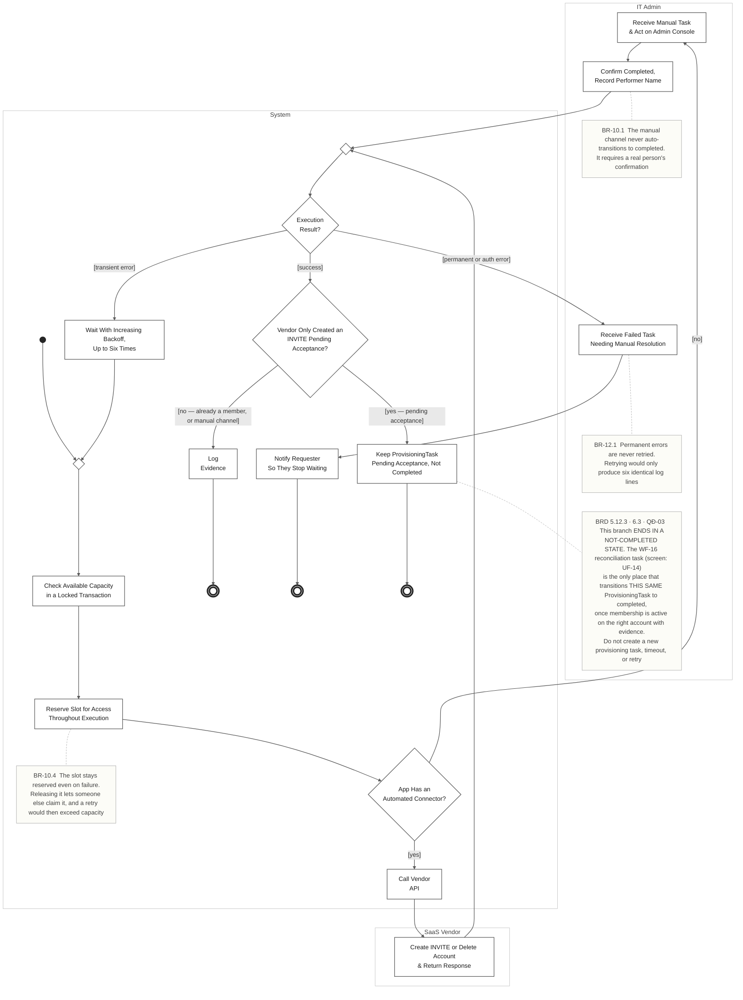
```mermaid
flowchart TB
    subgraph IT["IT Admin"]
        direction TB
        a5["Receive Manual Task<br/>& Act on Admin Console"]
        a6["Confirm Completed,<br/>Record Performer Name"]
        nt1["BR-10.1  The manual channel never auto-transitions to completed.<br/>It requires a real person's confirmation"]
        a9["Receive Failed Task<br/>Needing Manual Resolution"]
        nt2["BR-12.1  Permanent errors are never retried.<br/>Retrying would only produce six identical log lines"]
        nt3["BRD 5.12.3 · 6.3 · QĐ-03  This branch ENDS IN A<br/>NOT-COMPLETED STATE. The WF-16 reconciliation task (screen: UF-14)<br/>is the only place that transitions THIS SAME ProvisioningTask to completed,<br/>once membership is active on the right account with evidence.<br/>Do not create a new provisioning task, timeout, or retry"]
    end
    subgraph HT["System"]
        direction TB
        ini((" "))
        m0{" "}
        a1["Check Available Capacity<br/>in a Locked Transaction"]
        a2["Reserve Slot for Access<br/>Throughout Execution"]
        nt0["BR-10.4  The slot stays reserved even on failure.<br/>Releasing it lets someone else claim it, and a retry would then exceed capacity"]
        d1{"App Has an<br/>Automated Connector?"}
        a3["Call Vendor<br/>API"]
        m1{" "}
        d2{"Execution<br/>Result?"}
        dp{"Vendor Only Created an<br/>INVITE Pending Acceptance?"}
        sp["Keep ProvisioningTask<br/>Pending Acceptance, Not Completed"]
        a7["Log<br/>Evidence"]
        a8["Wait With Increasing Backoff,<br/>Up to Six Times"]
        a10["Notify Requester<br/>So They Stop Waiting"]
        fin1(((" ")))
        fin2(((" ")))
        fin3(((" ")))
    end
    subgraph NCC["SaaS Vendor"]
        direction TB
        a4["Create INVITE or Delete Account<br/>& Return Response"]
    end

    ini --> m0
    m0 --> a1
    a1 --> a2
    a2 --> d1
    d1 -->|"[yes]"| a3
    a3 --> a4
    a4 --> m1
    d1 -->|"[no]"| a5
    a5 --> a6
    a6 --> m1
    m1 --> d2
    d2 -->|"[success]"| dp
    dp -->|"[no — already a member, or manual channel]"| a7
    dp -->|"[yes — pending acceptance]"| sp
    sp --> fin3
    a7 --> fin1
    d2 -->|"[transient error]"| a8
    a8 --> m0
    d2 -->|"[permanent or auth error]"| a9
    a9 --> a10
    a10 --> fin2
    a2 -.- nt0
    a6 -.- nt1
    a9 -.- nt2
    sp -.- nt3

    classDef ini  fill:#262626,stroke:#262626,stroke-width:2px,color:#262626
    classDef fin  fill:#ffffff,stroke:#262626,stroke-width:4px,color:#262626
    classDef ff   fill:#ffffff,stroke:#262626,stroke-width:2px,color:#262626
    classDef act  fill:#ffffff,stroke:#595959,stroke-width:1.5px,color:#1a1a1a
    classDef subact fill:#eeeeee,stroke:#595959,stroke-width:1.5px,color:#1a1a1a
    classDef dec  fill:#ffffff,stroke:#595959,stroke-width:1.5px,color:#1a1a1a
    classDef mrg  fill:#ffffff,stroke:#595959,stroke-width:1.5px,color:#ffffff
    classDef bar  fill:#262626,stroke:#262626,stroke-width:3px,color:#262626
    classDef time fill:#f7f7f7,stroke:#595959,stroke-width:1.5px,color:#1a1a1a
    classDef note fill:#fcfcf7,stroke:#a6a6a6,stroke-width:1px,color:#404040
    class ini ini
    class m0,m1 mrg
    class a1,a2,a3,a4,a5,a6,a7,a8,a9,a10,sp act
    class d1,d2,dp dec
    class fin1,fin2,fin3 fin
    class nt0,nt1,nt2,nt3 note
    style IT fill:#ffffff,stroke:#bfbfbf,stroke-width:1px,color:#404040
    style HT fill:#ffffff,stroke:#bfbfbf,stroke-width:1px,color:#404040
    style NCC fill:#ffffff,stroke:#bfbfbf,stroke-width:1px,color:#404040
    linkStyle default stroke:#595959,stroke-width:1.5px
    linkStyle 21,22,23,24 stroke:#a6a6a6,stroke-width:1px,stroke-dasharray:4 3
```

**Quy tắc nghiệp vụ chi phối**

| Mã        | Nội dung                                                                      |
| --------- | ----------------------------------------------------------------------------- |
| `BR-10.1` | Kênh thủ công phải có tên người thật xác nhận hoàn tất                        |
| `BR-10.2` | Khóa chống gọi trùng sinh từ dữ liệu nghiệp vụ, không sinh ngẫu nhiên         |
| `BR-10.3` | Hai kênh dùng chung một hàng đợi và một cách đo                               |
| `BR-10.4` | Quyền vẫn chiếm chỗ trong suốt thời gian đang thực hiện, kể cả khi thất bại   |
| `BR-12.1` | Không thử lại lỗi vĩnh viễn                                                   |
| `BR-12.2` | Việc thất bại không biến mất khỏi tầm nhìn                                    |
| `BR-12.3` | Thất bại quá 7 ngày chưa xử lý thì nổi lên bảng điều khiển                    |
| `BR-12.4` | Thông báo lỗi cho người dùng cuối bằng tiếng Việt, không hiện mã lỗi kỹ thuật |
| `BR-12.5` | Người yêu cầu cũng được báo khi cấp phát thất bại                             |
| `BR-14.2` | Suất về trạng thái trống chỉ sau khi tài khoản thật đã bị xóa                 |

---

### 3.11. `WF-10` — Request Software Not in Catalog

|                   |                                                                                                     |
| ----------------- | --------------------------------------------------------------------------------------------------- |
| **Thuộc**         | MF-2                                                                                                |
| **Nhịp chạy**     | Theo sự kiện                                                                                        |
| **Kích hoạt bởi** | Nhân viên không tìm thấy phần mềm cần dùng trong danh mục đã duyệt                                  |
| **Tác nhân**      | Employee · Manager · Finance *(trả lời khi được hỏi — v2.5, `QĐ-29b`)* · **Spending Approver** *(mới ở v2.3, `QĐ-22`; hoặc người thay thế khi xung đột — `FR-3.15`)* · IT Admin · System |
| **Flow con**      | `F-09`                                                                                              |
| **Giai đoạn**     | Propose → Assess → Execute                                                                          |
| **Xong khi**      | Ứng dụng được thêm vào danh mục, hoặc có quyết định không duyệt kèm lý do và gợi ý công cụ thay thế |

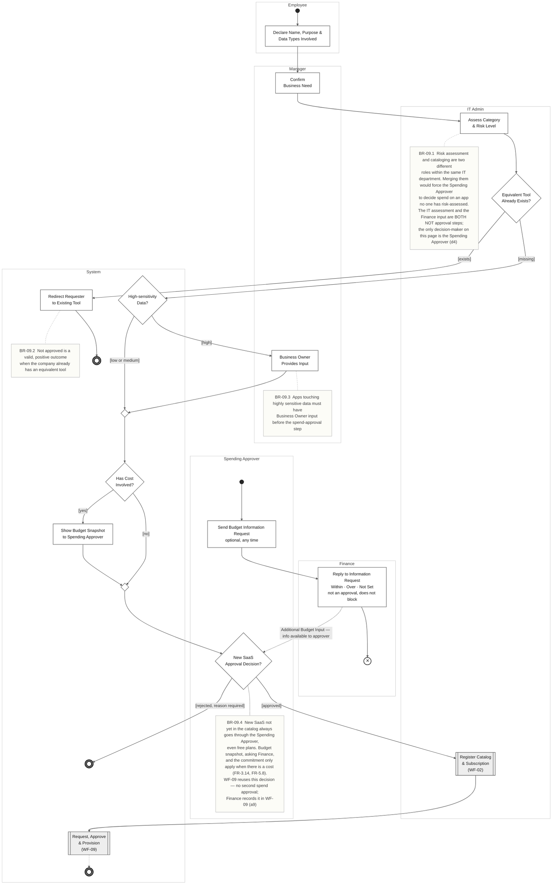
```mermaid
flowchart TB
    subgraph NV["Employee"]
        direction TB
        ini((" "))
        a1["Declare Name, Purpose &<br/>Data Types Involved"]
    end
    subgraph QL["Manager"]
        direction TB
        a2["Confirm<br/>Business Need"]
        a5["Business Owner<br/>Provides Input"]
        nt2["BR-09.3  Apps touching highly sensitive data must have<br/>Business Owner input before the spend-approval step"]
    end
    subgraph TC["Finance"]
        direction TB
        a6b["Reply to Information Request<br/>Within · Over · Not Set<br/>not an approval, does not block"]
        ff2(("✕"))
    end
    subgraph DC["Spending Approver"]
        direction TB
        ini2((" "))
        s1["Send Budget Information Request<br/>optional, any time"]
        d4{"New SaaS<br/>Approval Decision?"}
        nt3["BR-09.4  New SaaS not yet in the catalog always goes through the Spending Approver,<br/>even free plans. Budget snapshot, asking Finance,<br/>and the commitment only apply when there is a cost (FR-3.14, FR-5.8).<br/>WF-09 reuses this decision — no second spend approval;<br/>Finance records it in WF-09 (a9)"]
    end
    subgraph IT["IT Admin"]
        direction TB
        a3["Assess Category<br/>& Risk Level"]
        nt0["BR-09.1  Risk assessment and cataloging are two different<br/>roles within the same IT department. Merging them would force the Spending Approver<br/>to decide spend on an app no one has risk-assessed.<br/>The IT assessment and the Finance input are BOTH NOT approval steps;<br/>the only decision-maker on this page is the Spending Approver (d4)"]
        d1{"Equivalent Tool<br/>Already Exists?"}
        c1[["Register Catalog<br/>& Subscription<br/>(WF-02)"]]
    end
    subgraph HT["System"]
        direction TB
        a4["Redirect Requester<br/>to Existing Tool"]
        d2{"High-sensitivity<br/>Data?"}
        nt1["BR-09.2  Not approved is a valid, positive outcome<br/>when the company already has an equivalent tool"]
        fin1(((" ")))
        m1{" "}
        d3{"Has Cost<br/>Involved?"}
        a6["Show Budget Snapshot<br/>to Spending Approver"]
        m2{" "}
        fin3(((" ")))
        c2[["Request, Approve<br/>& Provision<br/>(WF-09)"]]
        fin2(((" ")))
    end

    ini --> a1
    a1 --> a2
    a2 --> a3
    a3 --> d1
    d1 -->|"[exists]"| a4
    a4 --> fin1
    d1 -->|"[missing]"| d2
    d2 -->|"[high]"| a5
    a5 --> m1
    d2 -->|"[low or medium]"| m1
    m1 --> d3
    d3 -->|"[yes]"| a6
    a6 --> m2
    d3 -->|"[no]"| m2
    m2 --> d4
    ini2 --> s1
    s1 --> a6b
    a6b --> ff2
    d4 -->|"[rejected, reason required]"| fin3
    d4 -->|"[approved]"| c1
    c1 --> c2
    c2 --> fin2
    a3 -.- nt0
    a4 -.- nt1
    a5 -.- nt2
    d4 -.- nt3
    a6b -.->|"Additional Budget Input — info available to approver"| d4

    classDef ini  fill:#262626,stroke:#262626,stroke-width:2px,color:#262626
    classDef fin  fill:#ffffff,stroke:#262626,stroke-width:4px,color:#262626
    classDef ff   fill:#ffffff,stroke:#262626,stroke-width:2px,color:#262626
    classDef act  fill:#ffffff,stroke:#595959,stroke-width:1.5px,color:#1a1a1a
    classDef subact fill:#eeeeee,stroke:#595959,stroke-width:1.5px,color:#1a1a1a
    classDef dec  fill:#ffffff,stroke:#595959,stroke-width:1.5px,color:#1a1a1a
    classDef mrg  fill:#ffffff,stroke:#595959,stroke-width:1.5px,color:#ffffff
    classDef bar  fill:#262626,stroke:#262626,stroke-width:3px,color:#262626
    classDef time fill:#f7f7f7,stroke:#595959,stroke-width:1.5px,color:#1a1a1a
    classDef note fill:#fcfcf7,stroke:#a6a6a6,stroke-width:1px,color:#404040
    class ini,ini2 ini
    class a1,a2,a3,a4,a5,a6,a6b,s1 act
    class d1,d2,d3,d4 dec
    class fin1,fin2,fin3 fin
    class ff2 ff
    class m1,m2 mrg
    class c1,c2 subact
    class nt0,nt1,nt2,nt3 note
    style NV fill:#ffffff,stroke:#bfbfbf,stroke-width:1px,color:#404040
    style QL fill:#ffffff,stroke:#bfbfbf,stroke-width:1px,color:#404040
    style TC fill:#ffffff,stroke:#bfbfbf,stroke-width:1px,color:#404040
    style DC fill:#ffffff,stroke:#bfbfbf,stroke-width:1px,color:#404040
    style IT fill:#ffffff,stroke:#bfbfbf,stroke-width:1px,color:#404040
    style HT fill:#ffffff,stroke:#bfbfbf,stroke-width:1px,color:#404040
    linkStyle default stroke:#595959,stroke-width:1.5px
    linkStyle 21,22,23,24 stroke:#a6a6a6,stroke-width:1px,stroke-dasharray:4 3
```

**Quy tắc nghiệp vụ chi phối**

| Mã        | Nội dung                                                                  |
| --------- | ------------------------------------------------------------------------- |
| `BR-09.1` *(viết lại v2.6 — `QĐ-30a`, finding `DA-01`)* | Đánh giá rủi ro và thực hiện khai báo là hai vai trò khác nhau của **cùng bộ phận CNTT**, không gộp. Gộp lại thì **Người duyệt chi** phải quyết chi cho một ứng dụng chưa ai đánh giá rủi ro. **Người quyết duy nhất ở `WF-10` là Người duyệt chi (`d4`)**; đánh giá của CNTT (`a3`) và ý kiến Tài chính (`a6b`) **không** phải bước duyệt. 📁 *Câu cũ "Gộp lại thì tài chính phải duyệt tiền" gán sai thẩm quyền cho Tài chính, trái `SoD-3` và `QĐ-29b`* |
| `BR-09.2` | Kết quả không duyệt là hợp lệ và tích cực nếu đã có công cụ tương đương   |
| `BR-09.3` | Ứng dụng chạm dữ liệu nhạy cảm cao phải có ý kiến Business Owner          |
| `BR-09.4` *(v2.3, `QĐ-22`; sửa v2.5 — `QĐ-29b`)* | SaaS chưa có trong danh mục **luôn** qua Người duyệt chi, kể cả gói miễn phí; snapshot ngân sách, hỏi Tài chính và khoản cam kết chỉ khi có chi phí |

> **Neo trên hình** *(v2.3; sửa v2.5 — `QĐ-29b`)*: làn **Spending Approver** + quyết định `d4`; guard `[yes]`/`[no]` của `d3` chỉ quyết có **snapshot ngân sách** `a6` *(làn System)* hay không; `d4 [more info needed]` → `a6b` *(Finance trả lời, không chặn)* → `d4` cùng người — **cả hai nhánh đều tới `d4`**, đúng `BR-09.4`. Từ chối ⟹ `fin3`. Khoản cam kết không vẽ thành nút ở trang này: nó sinh khi duyệt chi theo `FR-5.8` và được thể hiện ở `WF-09` (`a9`); ghi chú `nt3` nêu rằng `WF-09` được gọi lại **không duyệt chi lần hai** — ngoại lệ biểu diễn đã khai trong manifest parity.

---

### 3.12. `WF-11` — Return & Renew Access

|                   |                                                                                                  |
| ----------------- | ------------------------------------------------------------------------------------------------ |
| **Thuộc**         | MF-2                                                                                             |
| **Nhịp chạy**     | Theo sự kiện                                                                                     |
| **Kích hoạt bởi** | Nhân viên tự trả quyền, quản lý xác nhận hết nhu cầu, hoặc quyền có thời hạn sắp hết             |
| **Tác nhân**      | Employee · Manager · IT Admin · System                                                          |
| **Flow con**      | `F-14`, `F-15`, `F-16`                                                                           |
| **Giai đoạn**     | Initiate → Record Decision → Access End                                                          |
| **Xong khi**      | Suất về trạng thái trống và tái phân bổ được, hoặc được ghi nhận để giảm số lượng tại kỳ gia hạn |

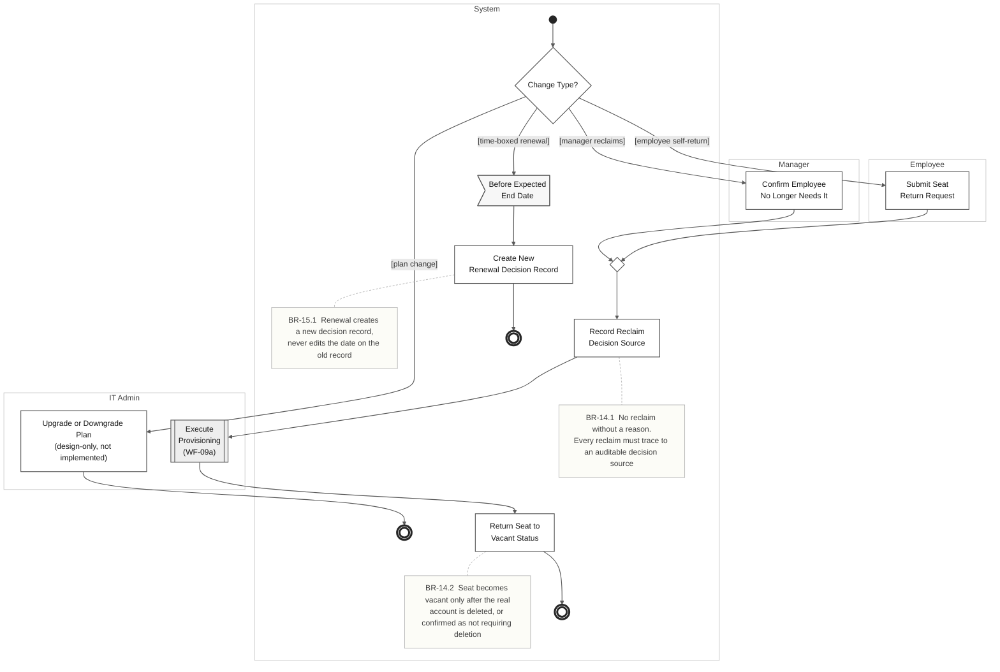
```mermaid
flowchart TB
    subgraph NV["Employee"]
        direction TB
        a1["Submit Seat<br/>Return Request"]
    end
    subgraph QL["Manager"]
        direction TB
        a2["Confirm Employee<br/>No Longer Needs It"]
    end
    subgraph IT["IT Admin"]
        direction TB
        a6["Upgrade or Downgrade Plan<br/>(design-only, not implemented)"]
        c1[["Execute<br/>Provisioning<br/>(WF-09a)"]]
    end
    subgraph HT["System"]
        direction TB
        ini((" "))
        d1{"Change Type?"}
        t1>"Before Expected<br/>End Date"]
        a5["Create New<br/>Renewal Decision Record"]
        fin3(((" ")))
        m1{" "}
        nt2["BR-15.1  Renewal creates a new decision record,<br/>never edits the date on the old record"]
        a3["Record Reclaim<br/>Decision Source"]
        fin2(((" ")))
        nt0["BR-14.1  No reclaim without a reason.<br/>Every reclaim must trace to an auditable decision source"]
        a4["Return Seat to<br/>Vacant Status"]
        nt1["BR-14.2  Seat becomes vacant only after the real<br/>account is deleted, or confirmed as not requiring deletion"]
        fin1(((" ")))
    end

    ini --> d1
    d1 -->|"[employee self-return]"| a1
    d1 -->|"[manager reclaims]"| a2
    d1 -->|"[time-boxed renewal]"| t1
    d1 -->|"[plan change]"| a6
    a1 --> m1
    a2 --> m1
    m1 --> a3
    a3 --> c1
    c1 --> a4
    a4 --> fin1
    t1 --> a5
    a5 --> fin2
    a6 --> fin3
    a3 -.- nt0
    a4 -.- nt1
    a5 -.- nt2

    classDef ini  fill:#262626,stroke:#262626,stroke-width:2px,color:#262626
    classDef fin  fill:#ffffff,stroke:#262626,stroke-width:4px,color:#262626
    classDef ff   fill:#ffffff,stroke:#262626,stroke-width:2px,color:#262626
    classDef act  fill:#ffffff,stroke:#595959,stroke-width:1.5px,color:#1a1a1a
    classDef subact fill:#eeeeee,stroke:#595959,stroke-width:1.5px,color:#1a1a1a
    classDef dec  fill:#ffffff,stroke:#595959,stroke-width:1.5px,color:#1a1a1a
    classDef mrg  fill:#ffffff,stroke:#595959,stroke-width:1.5px,color:#ffffff
    classDef bar  fill:#262626,stroke:#262626,stroke-width:3px,color:#262626
    classDef time fill:#f7f7f7,stroke:#595959,stroke-width:1.5px,color:#1a1a1a
    classDef note fill:#fcfcf7,stroke:#a6a6a6,stroke-width:1px,color:#404040
    class ini ini
    class d1 dec
    class a1,a2,a3,a4,a5,a6 act
    class m1 mrg
    class c1 subact
    class fin1,fin2,fin3 fin
    class t1 time
    class nt0,nt1,nt2 note
    style NV fill:#ffffff,stroke:#bfbfbf,stroke-width:1px,color:#404040
    style QL fill:#ffffff,stroke:#bfbfbf,stroke-width:1px,color:#404040
    style IT fill:#ffffff,stroke:#bfbfbf,stroke-width:1px,color:#404040
    style HT fill:#ffffff,stroke:#bfbfbf,stroke-width:1px,color:#404040
    linkStyle default stroke:#595959,stroke-width:1.5px
    linkStyle 14,15,16 stroke:#a6a6a6,stroke-width:1px,stroke-dasharray:4 3
```

**Quy tắc nghiệp vụ chi phối**

| Mã        | Nội dung                                                      |
| --------- | ------------------------------------------------------------- |
| `BR-14.1` | Mọi thu hồi phải gắn với một nguồn quyết định truy được       |
| `BR-14.2` | Suất về trạng thái trống chỉ sau khi tài khoản thật đã bị xóa |
| `BR-15.1` | Gia hạn quá 12 tháng liên tiếp cần xác nhận thêm              |

---

### 3.13. `WF-12` — Import Usage Data  ·  chuỗi demo **D-2**

|                   |                                                                                                                       |
| ----------------- | --------------------------------------------------------------------------------------------------------------------- |
| **Thuộc**         | MF-3                                                                                                                  |
| **Nhịp chạy**     | Theo sự kiện                                                                                                          |
| **Kích hoạt bởi** | Quản trị viên CNTT tải lên một file nhật ký sử dụng                                                                   |
| **Tác nhân**      | Employee · IT Admin · System                                                                                         |
| **Flow con**      | `F-42`, `F-17`                                                                                                        |
| **Giai đoạn**     | Legal Precondition → Read & Match → Preview & Commit                                                                  |
| **Xong khi**      | Không dòng nào được ghi trước khi người dùng xác nhận, và tình trạng sử dụng của các quyền liên quan đã được tính lại |

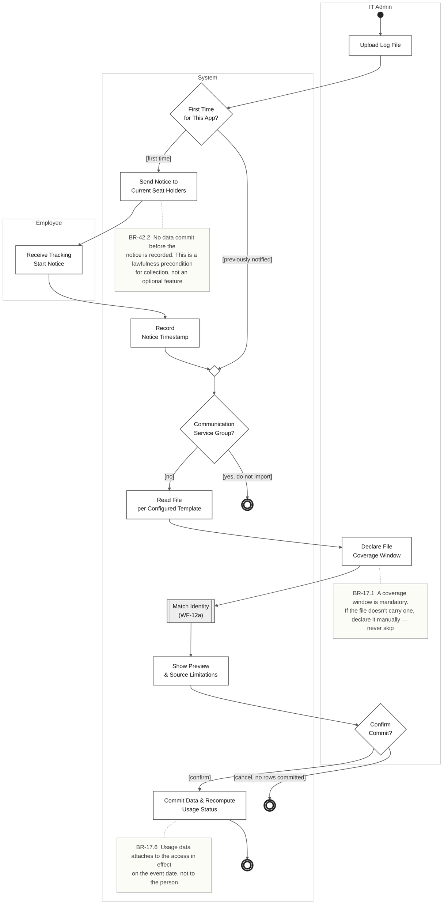
```mermaid
flowchart TB
    subgraph NV["Employee"]
        direction TB
        a3["Receive Tracking<br/>Start Notice"]
    end
    subgraph IT["IT Admin"]
        direction TB
        ini((" "))
        a1["Upload Log File"]
        a6["Declare File<br/>Coverage Window"]
        nt1["BR-17.1  A coverage window is mandatory.<br/>If the file doesn't carry one, declare it manually — never skip"]
        d3{"Confirm<br/>Commit?"}
    end
    subgraph HT["System"]
        direction TB
        d1{"First Time<br/>for This App?"}
        a2["Send Notice to<br/>Current Seat Holders"]
        nt0["BR-42.2  No data commit before the<br/>notice is recorded. This is a lawfulness precondition<br/>for collection, not an optional feature"]
        a4["Record<br/>Notice Timestamp"]
        m1{" "}
        d2{"Communication<br/>Service Group?"}
        a5["Read File<br/>per Configured Template"]
        fin1(((" ")))
        c1[["Match Identity<br/>(WF-12a)"]]
        a7["Show Preview<br/>& Source Limitations"]
        a8["Commit Data & Recompute<br/>Usage Status"]
        fin2(((" ")))
        nt2["BR-17.6  Usage data attaches to the access in effect<br/>on the event date, not to the person"]
        fin3(((" ")))
    end

    ini --> a1
    a1 --> d1
    d1 -->|"[first time]"| a2
    a2 --> a3
    a3 --> a4
    a4 --> m1
    d1 -->|"[previously notified]"| m1
    m1 --> d2
    d2 -->|"[yes, do not import]"| fin1
    d2 -->|"[no]"| a5
    a5 --> a6
    a6 --> c1
    c1 --> a7
    a7 --> d3
    d3 -->|"[cancel, no rows committed]"| fin2
    d3 -->|"[confirm]"| a8
    a8 --> fin3
    a2 -.- nt0
    a6 -.- nt1
    a8 -.- nt2

    classDef ini  fill:#262626,stroke:#262626,stroke-width:2px,color:#262626
    classDef fin  fill:#ffffff,stroke:#262626,stroke-width:4px,color:#262626
    classDef ff   fill:#ffffff,stroke:#262626,stroke-width:2px,color:#262626
    classDef act  fill:#ffffff,stroke:#595959,stroke-width:1.5px,color:#1a1a1a
    classDef subact fill:#eeeeee,stroke:#595959,stroke-width:1.5px,color:#1a1a1a
    classDef dec  fill:#ffffff,stroke:#595959,stroke-width:1.5px,color:#1a1a1a
    classDef mrg  fill:#ffffff,stroke:#595959,stroke-width:1.5px,color:#ffffff
    classDef bar  fill:#262626,stroke:#262626,stroke-width:3px,color:#262626
    classDef time fill:#f7f7f7,stroke:#595959,stroke-width:1.5px,color:#1a1a1a
    classDef note fill:#fcfcf7,stroke:#a6a6a6,stroke-width:1px,color:#404040
    class ini ini
    class a1,a2,a3,a4,a5,a6,a7,a8 act
    class d1,d2,d3 dec
    class m1 mrg
    class fin1,fin2,fin3 fin
    class c1 subact
    class nt0,nt1,nt2 note
    style NV fill:#ffffff,stroke:#bfbfbf,stroke-width:1px,color:#404040
    style IT fill:#ffffff,stroke:#bfbfbf,stroke-width:1px,color:#404040
    style HT fill:#ffffff,stroke:#bfbfbf,stroke-width:1px,color:#404040
    linkStyle default stroke:#595959,stroke-width:1.5px
    linkStyle 17,18,19 stroke:#a6a6a6,stroke-width:1px,stroke-dasharray:4 3
```

**Quy tắc nghiệp vụ chi phối**

| Mã        | Nội dung                                                                                               |
| --------- | ------------------------------------------------------------------------------------------------------ |
| `BR-17.1` | Khoảng thời gian bao phủ là bắt buộc                                                                   |
| `BR-17.2` | Chuẩn hóa múi giờ về múi giờ tổ chức trước khi cắt theo ngày                                           |
| `BR-17.3` | Chuẩn hóa email theo đúng một hàm dùng chung                                                           |
| `BR-17.4` | Sự kiện chỉ mang tính xác thực không tính là hoạt động                                                 |
| `BR-17.5` | Mẫu cấu hình bắt buộc khai báo nguồn hiểu hoạt động là gì                                              |
| `BR-17.6` | Dữ liệu hoạt động gắn vào quyền đang hiệu lực tại ngày xảy ra sự kiện                                  |
| `FR-4.7`  | Nguồn gốc của BR-17.6 trong BRD: log gắn vào Assignment tại thời điểm sự kiện, không gắn vào nhân viên |
| `BR-17.7` | Lỗi ở một dòng không làm hỏng cả file                                                                  |
| `BR-17.8` | Không import dữ liệu hoạt động cho ứng dụng có cờ nhóm dịch vụ liên lạc                                |
| `BR-42.1` | Thông báo người lao động là điều kiện để việc thu thập hợp pháp                                        |
| `BR-42.2` | Không cho ghi dữ liệu trước khi thông báo được ghi nhận                                                |
| `BR-42.3` | Nhân viên được cấp suất sau thời điểm thông báo cũng nhận thông báo                                    |

---

### 3.14. `WF-12a` — Identity Matching  *(biểu đồ con)*

|                   |                                                                                                 |
| ----------------- | ----------------------------------------------------------------------------------------------- |
| **Thuộc**         | MF-3                                                                                            |
| **Nhịp chạy**     | Được gọi từ WF-12                                                                               |
| **Kích hoạt bởi** | Một lô dữ liệu sử dụng đã đọc xong theo mẫu cấu hình                                            |
| **Tác nhân**      | IT Admin · System                                                                               |
| **Flow con**      | `F-18`                                                                                          |
| **Giai đoạn**     | Auto Match → Manual Resolution → Recompute                                                      |
| **Xong khi**      | Hàng đợi chưa khớp giảm sau mỗi kỳ import, và không kết luận nào được sinh từ dữ liệu chưa khớp |

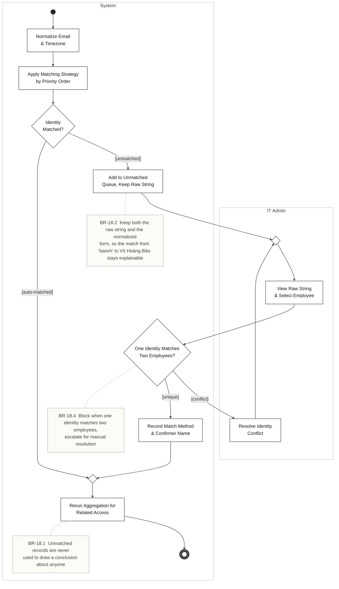
```mermaid
flowchart TB
    subgraph IT["IT Admin"]
        direction TB
        m0{" "}
        a4["View Raw String<br/>& Select Employee"]
        a5["Resolve Identity<br/>Conflict"]
    end
    subgraph HT["System"]
        direction TB
        ini((" "))
        a1["Normalize Email<br/>& Timezone"]
        a2["Apply Matching Strategy<br/>by Priority Order"]
        d1{"Identity<br/>Matched?"}
        a3["Add to Unmatched<br/>Queue, Keep Raw String"]
        nt0["BR-18.2  Keep both the raw string and the normalized<br/>form, so the match from 'baovh' to Vũ Hoàng Bảo stays explainable"]
        d2{"One Identity Matches<br/>Two Employees?"}
        nt1["BR-18.4  Block when one identity matches two employees,<br/>escalate for manual resolution"]
        a6["Record Match Method<br/>& Confirmer Name"]
        m1{" "}
        a7["Rerun Aggregation for<br/>Related Access"]
        nt2["BR-18.1  Unmatched records are never<br/>used to draw a conclusion about anyone"]
        fin(((" ")))
    end

    ini --> a1
    a1 --> a2
    a2 --> d1
    d1 -->|"[unmatched]"| a3
    a3 --> m0
    m0 --> a4
    a4 --> d2
    d2 -->|"[conflict]"| a5
    a5 --> m0
    d2 -->|"[unique]"| a6
    a6 --> m1
    d1 -->|"[auto-matched]"| m1
    m1 --> a7
    a7 --> fin
    a3 -.- nt0
    d2 -.- nt1
    a7 -.- nt2

    classDef ini  fill:#262626,stroke:#262626,stroke-width:2px,color:#262626
    classDef fin  fill:#ffffff,stroke:#262626,stroke-width:4px,color:#262626
    classDef ff   fill:#ffffff,stroke:#262626,stroke-width:2px,color:#262626
    classDef act  fill:#ffffff,stroke:#595959,stroke-width:1.5px,color:#1a1a1a
    classDef subact fill:#eeeeee,stroke:#595959,stroke-width:1.5px,color:#1a1a1a
    classDef dec  fill:#ffffff,stroke:#595959,stroke-width:1.5px,color:#1a1a1a
    classDef mrg  fill:#ffffff,stroke:#595959,stroke-width:1.5px,color:#ffffff
    classDef bar  fill:#262626,stroke:#262626,stroke-width:3px,color:#262626
    classDef time fill:#f7f7f7,stroke:#595959,stroke-width:1.5px,color:#1a1a1a
    classDef note fill:#fcfcf7,stroke:#a6a6a6,stroke-width:1px,color:#404040
    class ini ini
    class a1,a2,a3,a4,a5,a6,a7 act
    class d1,d2 dec
    class m0,m1 mrg
    class fin fin
    class nt0,nt1,nt2 note
    style IT fill:#ffffff,stroke:#bfbfbf,stroke-width:1px,color:#404040
    style HT fill:#ffffff,stroke:#bfbfbf,stroke-width:1px,color:#404040
    linkStyle default stroke:#595959,stroke-width:1.5px
    linkStyle 14,15,16 stroke:#a6a6a6,stroke-width:1px,stroke-dasharray:4 3
```

**Quy tắc nghiệp vụ chi phối**

| Mã        | Nội dung                                               |
| --------- | ------------------------------------------------------ |
| `BR-18.1` | Bản ghi chưa khớp không bao giờ được dùng để kết luận  |
| `BR-18.2` | Giữ cả chuỗi gốc lẫn bản đã chuẩn hóa                  |
| `BR-18.3` | Khớp thủ công bắt buộc ghi tên người xác nhận          |
| `BR-18.4` | Một định danh khớp về hai nhân viên khác nhau thì chặn |

---

### 3.15. `WF-13` — Detect, Confirm & Reclaim Waste  ·  chuỗi demo **D-2**

|                   |                                                                                                |
| ----------------- | ---------------------------------------------------------------------------------------------- |
| **Thuộc**         | MF-3                                                                                           |
| **Nhịp chạy**     | Theo lịch: G1 và G2 hằng ngày, G3 và G4 hằng tuần                                              |
| **Kích hoạt bởi** | Tác vụ nền chạy theo lịch                                                                      |
| **Tác nhân**      | Manager · IT Admin · System                                                                    |
| **Flow con**      | `F-19`, `F-20`, `F-21`, `F-22`, `F-23`                                                         |
| **Giai đoạn**     | Screening → Generate Recommendation → Confirm → Reclaim                                        |
| **Xong khi**      | Mỗi khuyến nghị kèm đủ căn cứ để người nhận phản biện được, và số tiết kiệm được ghi đúng loại |

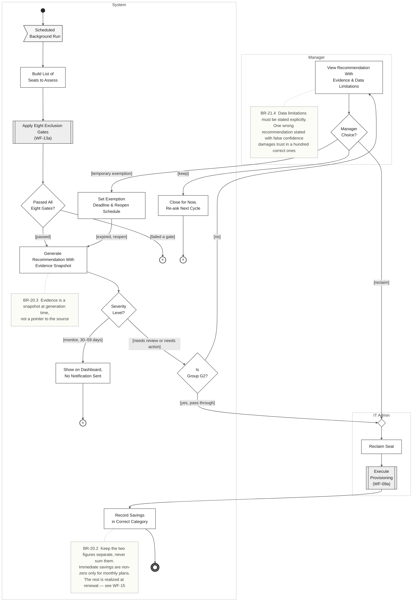
```mermaid
flowchart TB
    subgraph QL["Manager"]
        direction TB
        a4["View Recommendation With<br/>Evidence & Data Limitations"]
        nt1["BR-21.4  Data limitations must be stated explicitly.<br/>One wrong recommendation stated with false confidence<br/>damages trust in a hundred correct ones"]
        d4{"Manager<br/>Choice?"}
    end
    subgraph IT["IT Admin"]
        direction TB
        m1{" "}
        a7["Reclaim Seat"]
        c2[["Execute<br/>Provisioning<br/>(WF-09a)"]]
    end
    subgraph HT["System"]
        direction TB
        ini((" "))
        t1>"Scheduled<br/>Background Run"]
        a1["Build List of<br/>Seats to Assess"]
        c1[["Apply Eight Exclusion Gates<br/>(WF-13a)"]]
        d1{"Passed All<br/>Eight Gates?"}
        a2["Generate Recommendation With<br/>Evidence Snapshot"]
        ff1(("×"))
        nt0["BR-20.3  Evidence is a snapshot at generation time,<br/>not a pointer to the source"]
        d2{"Severity<br/>Level?"}
        a3["Show on Dashboard,<br/>No Notification Sent"]
        d3{"Is<br/>Group G2?"}
        ff2(("×"))
        a5["Close for Now,<br/>Re-ask Next Cycle"]
        a6["Set Exemption<br/>Deadline & Reopen Schedule"]
        ff3(("×"))
        a8["Record Savings<br/>in Correct Category"]
        nt2["BR-20.2  Keep the two figures separate, never sum them.<br/>Immediate savings are non-zero only for monthly plans.<br/>The rest is realized at renewal — see WF-15"]
        fin(((" ")))
    end

    ini --> t1
    t1 --> a1
    a1 --> c1
    c1 --> d1
    d1 -->|"[failed a gate]"| ff1
    d1 -->|"[passed]"| a2
    a2 --> d2
    d2 -->|"[monitor, 30–59 days]"| a3
    a3 --> ff2
    d2 -->|"[needs review or needs action]"| d3
    d3 -->|"[yes, pass through]"| m1
    d3 -->|"[no]"| a4
    a4 --> d4
    d4 -->|"[keep]"| a5
    a5 --> ff3
    d4 -->|"[temporary exemption]"| a6
    a6 -->|"[expired, reopen]"| a2
    d4 -->|"[reclaim]"| m1
    m1 --> a7
    a7 --> c2
    c2 --> a8
    a8 --> fin
    a2 -.- nt0
    a4 -.- nt1
    a8 -.- nt2

    classDef ini  fill:#262626,stroke:#262626,stroke-width:2px,color:#262626
    classDef fin  fill:#ffffff,stroke:#262626,stroke-width:4px,color:#262626
    classDef ff   fill:#ffffff,stroke:#262626,stroke-width:2px,color:#262626
    classDef act  fill:#ffffff,stroke:#595959,stroke-width:1.5px,color:#1a1a1a
    classDef subact fill:#eeeeee,stroke:#595959,stroke-width:1.5px,color:#1a1a1a
    classDef dec  fill:#ffffff,stroke:#595959,stroke-width:1.5px,color:#1a1a1a
    classDef mrg  fill:#ffffff,stroke:#595959,stroke-width:1.5px,color:#ffffff
    classDef bar  fill:#262626,stroke:#262626,stroke-width:3px,color:#262626
    classDef time fill:#f7f7f7,stroke:#595959,stroke-width:1.5px,color:#1a1a1a
    classDef note fill:#fcfcf7,stroke:#a6a6a6,stroke-width:1px,color:#404040
    class ini ini
    class t1 time
    class a1,a2,a3,a4,a5,a6,a7,a8 act
    class c1,c2 subact
    class d1,d2,d3,d4 dec
    class ff1,ff2,ff3 ff
    class m1 mrg
    class fin fin
    class nt0,nt1,nt2 note
    style QL fill:#ffffff,stroke:#bfbfbf,stroke-width:1px,color:#404040
    style IT fill:#ffffff,stroke:#bfbfbf,stroke-width:1px,color:#404040
    style HT fill:#ffffff,stroke:#bfbfbf,stroke-width:1px,color:#404040
    linkStyle default stroke:#595959,stroke-width:1.5px
    linkStyle 22,23,24 stroke:#a6a6a6,stroke-width:1px,stroke-dasharray:4 3
```

**Quy tắc nghiệp vụ chi phối**

| Mã        | Nội dung                                                                                    |
| --------- | ------------------------------------------------------------------------------------------- |
| `BR-19.1` | Nhóm G1 nhắm vào thuê bao, không nhắm vào người                                             |
| `BR-19.2` | Nhóm G2 bỏ qua mọi ngưỡng ngày và không cần quản lý xác nhận                                |
| `BR-20.1` | Ngưỡng phân giải theo thứ tự: ứng dụng, tổ chức, mặc định hệ thống *(v2.3 — bỏ cấp phòng ban, `QĐ-23`)* |
| `BR-20.2` | Số tiết kiệm thực hiện ngay chỉ lớn hơn 0 khi gói theo tháng hoặc hợp đồng cho giảm giữa kỳ |
| `BR-20.3` | Bằng chứng là bản chụp tại thời điểm sinh, không phải con trỏ tới nguồn                     |
| `BR-20.5` | Mức theo dõi không gửi thông báo, và **chỉ hiện trên bảng điều khiển của IT Admin** — không hiện màn hình quản lý (`FR-4.12`, chốt ở `QĐ-09`). Trên sơ đồ: nhánh `[theo dõi, 30 đến 59 ngày]` nằm trọn trong làn *Hệ thống* và kết thúc ở `ff2`, **không** có cạnh nào sang làn *Quản lý trực tiếp* |
| `BR-21.1` | Quản lý không xem được nhật ký hoạt động thô                                                |
| `BR-21.3` | Miễn trừ không có ngày hết hạn bị chặn ở cả ba tầng                                         |
| `BR-21.4` | Hiển thị phải nêu rõ giới hạn dữ liệu                                                       |
| `BR-21.5` | Giữ lại không đóng vĩnh viễn; chu kỳ sau vẫn hỏi lại                                        |
| `BR-21.6` | Khuyến nghị bị dữ liệu mới phủ định thì đóng im lặng                                        |
| `BR-22.1` | Quản trị viên CNTT có quyền không đồng ý với xác nhận của quản lý, nhưng phải ghi lý do     |
| `BR-22.2` | Số tiết kiệm ghi vào báo cáo là số thực tế thu được                                         |
| `BR-23.1` | Thông báo trước 7 ngày khi miễn trừ sắp hết hạn                                             |

---

### 3.16. `WF-13a` — Eight Exclusion Gates Before Assessment  *(biểu đồ con)*

|                   |                                                                          |
| ----------------- | ------------------------------------------------------------------------ |
| **Thuộc**         | MF-3                                                                     |
| **Nhịp chạy**     | Được gọi từ WF-13, mỗi suất một lần                                      |
| **Kích hoạt bởi** | Một suất được đưa vào danh sách cần đánh giá                             |
| **Tác nhân**      | System                                                                   |
| **Flow con**      | `F-19`, `F-20`                                                           |
| **Giai đoạn**     | Filter by Seat Nature → Filter by Timing & Data → Conclusion             |
| **Xong khi**      | Suất được chuyển sang bước đánh giá, hoặc bị bỏ qua kèm lý do đã ghi lại |

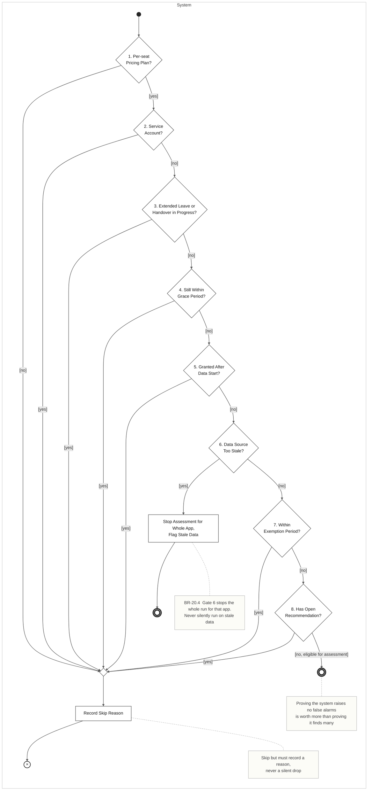
```mermaid
flowchart TB
    subgraph HT["System"]
        direction TB
        ini((" "))
        d1{"1. Per-seat<br/>Pricing Plan?"}
        d2{"2. Service<br/>Account?"}
        d3{"3. Extended Leave or<br/>Handover in Progress?"}
        d4{"4. Still Within<br/>Grace Period?"}
        d5{"5. Granted After<br/>Data Start?"}
        d6{"6. Data Source<br/>Too Stale?"}
        d7{"7. Within<br/>Exemption Period?"}
        d8{"8. Has Open<br/>Recommendation?"}
        a2["Stop Assessment for Whole App,<br/>Flag Stale Data"]
        m1{" "}
        nt1["BR-20.4  Gate 6 stops the whole run for that app.<br/>Never silently run on stale data"]
        a1["Record Skip Reason"]
        fin1(((" ")))
        fin2(((" ")))
        nt0["Skip but must record a reason,<br/>never a silent drop"]
        nt2["Proving the system raises no false alarms<br/>is worth more than proving it finds many"]
        ff1(("×"))
    end

    ini --> d1
    d1 -->|"[no]"| m1
    d1 -->|"[yes]"| d2
    d2 -->|"[yes]"| m1
    d2 -->|"[no]"| d3
    d3 -->|"[yes]"| m1
    d3 -->|"[no]"| d4
    d4 -->|"[yes]"| m1
    d4 -->|"[no]"| d5
    d5 -->|"[yes]"| m1
    d5 -->|"[no]"| d6
    d6 -->|"[yes]"| a2
    a2 --> fin1
    d6 -->|"[no]"| d7
    d7 -->|"[yes]"| m1
    d7 -->|"[no]"| d8
    d8 -->|"[yes]"| m1
    d8 -->|"[no, eligible for assessment]"| fin2
    m1 --> a1
    a1 --> ff1
    a1 -.- nt0
    a2 -.- nt1
    fin2 -.- nt2

    classDef ini  fill:#262626,stroke:#262626,stroke-width:2px,color:#262626
    classDef fin  fill:#ffffff,stroke:#262626,stroke-width:4px,color:#262626
    classDef ff   fill:#ffffff,stroke:#262626,stroke-width:2px,color:#262626
    classDef act  fill:#ffffff,stroke:#595959,stroke-width:1.5px,color:#1a1a1a
    classDef subact fill:#eeeeee,stroke:#595959,stroke-width:1.5px,color:#1a1a1a
    classDef dec  fill:#ffffff,stroke:#595959,stroke-width:1.5px,color:#1a1a1a
    classDef mrg  fill:#ffffff,stroke:#595959,stroke-width:1.5px,color:#ffffff
    classDef bar  fill:#262626,stroke:#262626,stroke-width:3px,color:#262626
    classDef time fill:#f7f7f7,stroke:#595959,stroke-width:1.5px,color:#1a1a1a
    classDef note fill:#fcfcf7,stroke:#a6a6a6,stroke-width:1px,color:#404040
    class ini ini
    class d1,d2,d3,d4,d5,d6,d7,d8 dec
    class m1 mrg
    class a1,a2 act
    class ff1 ff
    class fin1,fin2 fin
    class nt0,nt1,nt2 note
    style HT fill:#ffffff,stroke:#bfbfbf,stroke-width:1px,color:#404040
    linkStyle default stroke:#595959,stroke-width:1.5px
    linkStyle 20,21,22 stroke:#a6a6a6,stroke-width:1px,stroke-dasharray:4 3
```

**Quy tắc nghiệp vụ chi phối**

| Mã        | Nội dung                                                                                                                                                 |
| --------- | -------------------------------------------------------------------------------------------------------------------------------------------------------- |
| `FR-4.9`  | Nguồn gốc của tám cổng lọc; ngưỡng ân hạn ở cổng 4 mặc định 14 ngày, cổng 6 tính quá 7 ngày kể từ ngày bao phủ cuối                                      |
| `FR-4.10` | Phân biệt ba trạng thái của "không có ngày hoạt động": chưa từng hoạt động thì kết luận được; không có dữ liệu và chưa khớp danh tính thì không kết luận |
| `BR-20.4` | Cổng lọc số 6 làm cả lần chạy dừng cho ứng dụng đó, không âm thầm chạy với dữ liệu cũ                                                                    |
| `TC-2`    | Tiêu chí nghiệm thu: số báo động giả trên các hồ sơ đặt bẫy bằng 0                                                                                       |

---

### 3.17. `WF-14` — Periodic Access Review

|                   |                                                                                                              |
| ----------------- | ------------------------------------------------------------------------------------------------------------ |
| **Thuộc**         | MF-3                                                                                                         |
| **Nhịp chạy**     | Theo lịch, chỉ đặc tả thiết kế                                                                               |
| **Kích hoạt bởi** | Tới kỳ rà soát đã cấu hình                                                                                   |
| **Tác nhân**      | Manager · IT Admin · System                                                                                 |
| **Flow con**      | `F-24`                                                                                                       |
| **Giai đoạn**     | Build List → Confirm → Save Evidence                                                                         |
| **Xong khi**      | Mọi quyền trong phạm vi rà soát đều có một xác nhận của người chịu trách nhiệm, lưu làm bằng chứng kiểm toán |

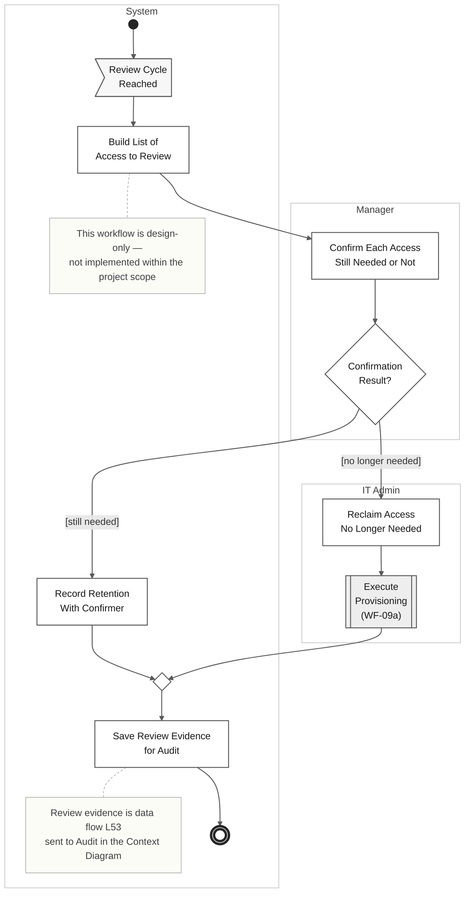
```mermaid
flowchart TB
    subgraph QL["Manager"]
        direction TB
        a2["Confirm Each Access<br/>Still Needed or Not"]
        d1{"Confirmation<br/>Result?"}
    end
    subgraph IT["IT Admin"]
        direction TB
        a4["Reclaim Access<br/>No Longer Needed"]
        c1[["Execute<br/>Provisioning<br/>(WF-09a)"]]
    end
    subgraph HT["System"]
        direction TB
        ini((" "))
        t1>"Review Cycle<br/>Reached"]
        a1["Build List of<br/>Access to Review"]
        nt1["This workflow is design-only —<br/>not implemented within the project scope"]
        a3["Record Retention<br/>With Confirmer"]
        m1{" "}
        a5["Save Review Evidence<br/>for Audit"]
        nt0["Review evidence is data flow L53<br/>sent to Audit in the Context Diagram"]
        fin(((" ")))
    end

    ini --> t1
    t1 --> a1
    a1 --> a2
    a2 --> d1
    d1 -->|"[still needed]"| a3
    a3 --> m1
    d1 -->|"[no longer needed]"| a4
    a4 --> c1
    c1 --> m1
    m1 --> a5
    a5 --> fin
    a5 -.- nt0
    a1 -.- nt1

    classDef ini  fill:#262626,stroke:#262626,stroke-width:2px,color:#262626
    classDef fin  fill:#ffffff,stroke:#262626,stroke-width:4px,color:#262626
    classDef ff   fill:#ffffff,stroke:#262626,stroke-width:2px,color:#262626
    classDef act  fill:#ffffff,stroke:#595959,stroke-width:1.5px,color:#1a1a1a
    classDef subact fill:#eeeeee,stroke:#595959,stroke-width:1.5px,color:#1a1a1a
    classDef dec  fill:#ffffff,stroke:#595959,stroke-width:1.5px,color:#1a1a1a
    classDef mrg  fill:#ffffff,stroke:#595959,stroke-width:1.5px,color:#ffffff
    classDef bar  fill:#262626,stroke:#262626,stroke-width:3px,color:#262626
    classDef time fill:#f7f7f7,stroke:#595959,stroke-width:1.5px,color:#1a1a1a
    classDef note fill:#fcfcf7,stroke:#a6a6a6,stroke-width:1px,color:#404040
    class ini ini
    class t1 time
    class a1,a2,a3,a4,a5 act
    class d1 dec
    class c1 subact
    class m1 mrg
    class fin fin
    class nt0,nt1 note
    style QL fill:#ffffff,stroke:#bfbfbf,stroke-width:1px,color:#404040
    style IT fill:#ffffff,stroke:#bfbfbf,stroke-width:1px,color:#404040
    style HT fill:#ffffff,stroke:#bfbfbf,stroke-width:1px,color:#404040
    linkStyle default stroke:#595959,stroke-width:1.5px
    linkStyle 11,12 stroke:#a6a6a6,stroke-width:1px,stroke-dasharray:4 3
```

**Quy tắc nghiệp vụ chi phối**

| Mã     | Nội dung                                        |
| ------ | ----------------------------------------------- |
| `F-24` | Luồng ở phạm vi chỉ đặc tả thiết kế, không code |

---

### 3.18. `WF-15` — Contract Renewal Cycle

|                   |                                                                                       |
| ----------------- | ------------------------------------------------------------------------------------- |
| **Thuộc**         | MF-4                                                                                  |
| **Nhịp chạy**     | Theo lịch, hằng ngày                                                                  |
| **Kích hoạt bởi** | Tác vụ nền quét hạn chót báo hủy của mọi thuê bao                                     |
| **Tác nhân**      | **Spending Approver** *(mới ở v2.3, `QĐ-22`)* · Finance *(trả lời khi được hỏi, ghi nhận sau quyết định — v2.5, `QĐ-29b`)* · IT Admin · System |
| **Flow con**      | `F-26`, `F-27`                                                                        |
| **Giai đoạn**     | Scan Cancellation Deadline → Alert → Decision                                         |
| **Xong khi**      | Mọi thuê bao có tự động gia hạn đều có một quyết định được ghi nhận trước hạn báo hủy |

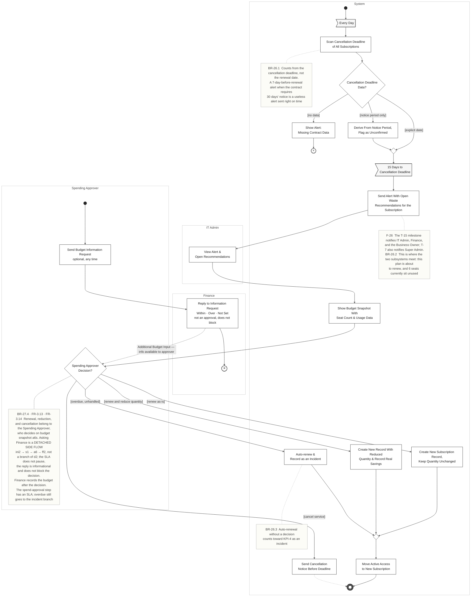
```mermaid
flowchart TB
    subgraph DC["Spending Approver"]
        direction TB
        ini2((" "))
        s1["Send Budget Information Request<br/>optional, any time"]
        d2{"Spending Approver<br/>Decision?"}
        nt3["BR-27.4 · FR-3.13 · FR-3.14  Renewal, reduction, and cancellation belong to the Spending Approver,<br/>who decides on budget snapshot a6s. Asking Finance is a DETACHED SIDE FLOW<br/>ini2 → s1 → a6 → ff2, not a branch of d2; the SLA does not pause,<br/>the reply is informational and does not block the decision.<br/>Finance records the budget after the decision.<br/>The spend-approval step has an SLA; overdue still goes to the incident branch"]
    end
    subgraph TC["Finance"]
        direction TB
        a6["Reply to Information Request<br/>Within · Over · Not Set<br/>not an approval, does not block"]
        ff2(("✕"))
    end
    subgraph IT["IT Admin"]
        direction TB
        a5["View Alert &<br/>Open Recommendations"]
    end
    subgraph HT["System"]
        direction TB
        ini((" "))
        t1>"Every Day"]
        a1["Scan Cancellation Deadline<br/>of All Subscriptions"]
        nt0["BR-26.1  Counts from the cancellation deadline, not the renewal date.<br/>A 7-day-before-renewal alert when the contract requires<br/>30 days' notice is a useless alert sent right on time"]
        d1{"Cancellation Deadline<br/>Data?"}
        a2["Derive From Notice Period,<br/>Flag as Unconfirmed"]
        a3["Show Alert:<br/>Missing Contract Data"]
        ff1(("×"))
        m2{" "}
        t2>"15 Days to<br/>Cancellation Deadline"]
        a4["Send Alert With Open Waste<br/>Recommendations for the Subscription"]
        a6s["Show Budget Snapshot With<br/>Seat Count & Usage Data"]
        nt1["F-26  The T-15 milestone notifies IT Admin, Finance,<br/>and the Business Owner; T-7 also notifies Super Admin.<br/>BR-26.2  This is where the two subsystems meet: this plan is about<br/>to renew, and 6 seats currently sit unused"]
        a10["Auto-renew &<br/>Record as an Incident"]
        a7["Create New Subscription Record,<br/>Keep Quantity Unchanged"]
        a8["Create New Record With Reduced<br/>Quantity & Record Real Savings"]
        a9["Send Cancellation<br/>Notice Before Deadline"]
        nt2["BR-26.3  Auto-renewal without a decision<br/>counts toward KPI-4 as an incident"]
        m3{" "}
        a11["Move Active Access<br/>to New Subscription"]
        fin(((" ")))
    end

    ini --> t1
    t1 --> a1
    a1 --> d1
    d1 -->|"[explicit date]"| m2
    d1 -->|"[notice period only]"| a2
    a2 --> m2
    d1 -->|"[no data]"| a3
    a3 --> ff1
    m2 --> t2
    t2 --> a4
    a4 --> a5
    a5 --> a6s
    a6s --> d2
    ini2 --> s1
    s1 --> a6
    a6 --> ff2
    d2 -->|"[renew as-is]"| a7
    d2 -->|"[renew and reduce quantity]"| a8
    d2 -->|"[cancel service]"| a9
    d2 -->|"[overdue, unhandled]"| a10
    a7 --> m3
    a8 --> m3
    a10 --> m3
    m3 --> a11
    a11 --> fin
    a9 --> fin
    a1 -.- nt0
    a4 -.- nt1
    a10 -.- nt2
    d2 -.- nt3
    a6 -.->|"Additional Budget Input — info available to approver"| d2

    classDef ini  fill:#262626,stroke:#262626,stroke-width:2px,color:#262626
    classDef fin  fill:#ffffff,stroke:#262626,stroke-width:4px,color:#262626
    classDef ff   fill:#ffffff,stroke:#262626,stroke-width:2px,color:#262626
    classDef act  fill:#ffffff,stroke:#595959,stroke-width:1.5px,color:#1a1a1a
    classDef subact fill:#eeeeee,stroke:#595959,stroke-width:1.5px,color:#1a1a1a
    classDef dec  fill:#ffffff,stroke:#595959,stroke-width:1.5px,color:#1a1a1a
    classDef mrg  fill:#ffffff,stroke:#595959,stroke-width:1.5px,color:#ffffff
    classDef bar  fill:#262626,stroke:#262626,stroke-width:3px,color:#262626
    classDef time fill:#f7f7f7,stroke:#595959,stroke-width:1.5px,color:#1a1a1a
    classDef note fill:#fcfcf7,stroke:#a6a6a6,stroke-width:1px,color:#404040
    class ini,ini2 ini
    class t1,t2 time
    class a1,a2,a3,a4,a5,a6,a6s,a7,a8,a9,a10,a11,s1 act
    class d1,d2 dec
    class ff1,ff2 ff
    class m2,m3 mrg
    class fin fin
    class nt0,nt1,nt2,nt3 note
    style DC fill:#ffffff,stroke:#bfbfbf,stroke-width:1px,color:#404040
    style TC fill:#ffffff,stroke:#bfbfbf,stroke-width:1px,color:#404040
    style IT fill:#ffffff,stroke:#bfbfbf,stroke-width:1px,color:#404040
    style HT fill:#ffffff,stroke:#bfbfbf,stroke-width:1px,color:#404040
    linkStyle default stroke:#595959,stroke-width:1.5px
    linkStyle 25,26,27,28 stroke:#a6a6a6,stroke-width:1px,stroke-dasharray:4 3
```

**Quy tắc nghiệp vụ chi phối**

| Mã        | Nội dung                                                                             |
| --------- | ------------------------------------------------------------------------------------ |
| `BR-26.1` | Cảnh báo tính từ hạn chót báo hủy, không tính từ ngày gia hạn                        |
| `BR-26.2` | Mỗi mốc cảnh báo hiển thị kèm các khuyến nghị lãng phí đang mở của chính thuê bao đó |
| `BR-26.3` | Thuê bao tự gia hạn không có quyết định được đếm vào KPI-4 như một sự cố             |
| `BR-27.1` | Gia hạn không sửa đè ngày trên bản ghi cũ                                            |
| `BR-27.2` | Số tiết kiệm thật chỉ ghi nhận khi số suất kỳ mới thấp hơn kỳ cũ                     |
| `BR-27.3` | Hủy dịch vụ phải kiểm tra còn quyền nào đang hiệu lực và cảnh báo người đang dùng    |
| `BR-27.4` *(v2.3, `QĐ-22`, `FR-3.13`; sửa v2.5 — `QĐ-29b`, `FR-3.14`; **viết lại v2.6 — `QĐ-30a`**)* | Quyết định gia hạn, giảm, hủy thuộc **Spending Approver**, trên snapshot ngân sách `a6s`. Hỏi Finance là **luồng phụ độc lập** `ini2 → s1 → a6 → ff2` với nút khởi đầu riêng ở làn Spending Approver, kết thúc bằng flow final; `a6` nối tới `d2` bằng **cạnh thông tin nét đứt**, **không** phải cạnh control. `d2` giữ nguyên **bốn** lối ra control: `[renew as-is]`, `[renew and reduce quantity]`, `[cancel service]`, `[overdue, unhandled]`. SLA không dừng; Finance ghi nhận **sau** quyết định — ghi chú `nt3` *(ngoại lệ biểu diễn, không vẽ nút ghi nhận ở trang này)*. 📁 *Cách vẽ cũ `d2 [more info needed] → a6 → d2` đọc thành cửa duyệt — finding `SA-01`, đã bỏ* |

---

### 3.19. `WF-16` — Data Reconciliation & Discrepancy Handling

|                   |                                                                                              |
| ----------------- | -------------------------------------------------------------------------------------------- |
| **Thuộc**         | MF-4                                                                                         |
| **Nhịp chạy**     | Theo lịch và theo sự kiện                                                                    |
| **Kích hoạt bởi** | Tác vụ đối soát chạy theo lịch, hoặc tài chính import hóa đơn                                |
| **Tác nhân**      | Finance · IT Admin · System · SaaS Vendor                                                    |
| **Flow con**      | `F-28`, `F-35`, `F-43`                                                                       |
| **Giai đoạn**     | Collect Two Sources → Generate Discrepancy → Resolve                                         |
| **Xong khi**      | Mọi sai lệch đều có một quyết định của người thật; không sai lệch nào tự đóng theo thời gian. Với suất còn `ProvisioningTask` **chờ chấp nhận**: hoặc vẫn giữ chờ, hoặc đã ghi bằng chứng và chuyển chính tác vụ đó sang **hoàn tất**, hoặc đã sinh sai lệch thật |

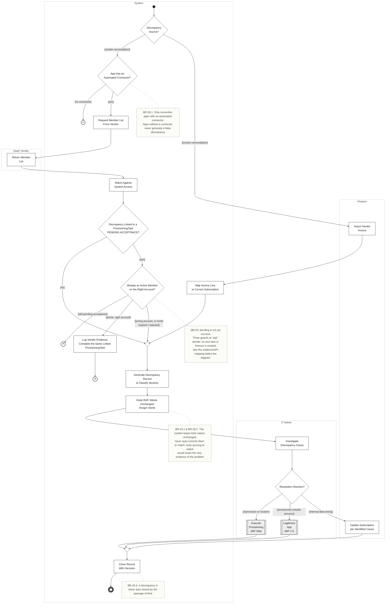
```mermaid
flowchart TB
    subgraph TC["Finance"]
        direction TB
        a4["Import Vendor<br/>Invoice"]
        a9["Update Subscription<br/>per Identified Cause"]
    end
    subgraph IT["IT Admin"]
        direction TB
        a8["Investigate<br/>Discrepancy Cause"]
        d2{"Resolution Direction?"}
        c1[["Execute<br/>Provisioning<br/>(WF-09a)"]]
        c2[["Legitimize<br/>App<br/>(WF-17)"]]
    end
    subgraph HT["System"]
        direction TB
        ini((" "))
        d0{"Discrepancy<br/>Source?"}
        d1{"App Has an<br/>Automated Connector?"}
        nt0["BR-28.1  Only reconciles apps with an automated connector.<br/>Apps without a connector never generate a false discrepancy"]
        a1["Request Member List<br/>From Vendor"]
        a5["Map Invoice Line<br/>to Correct Subscription"]
        ff1(("×"))
        a3["Match Against<br/>System Access"]
        dq{"Discrepancy Linked to a ProvisioningTask<br/>PENDING ACCEPTANCE?"}
        dq2{"Already an Active Member<br/>on the Right Account?"}
        ff2(("✕"))
    a11["Log Vendor Evidence;<br/>Complete the Same Linked ProvisioningTask"]
        ff3(("✕"))
        m1{" "}
        a6["Generate Discrepancy Record<br/>& Classify Severity"]
        a7["Keep Both Values Unchanged,<br/>Assign Owner"]
        nt1["BR-43.1 & BR-28.2  The system keeps both values unchanged,<br/>never auto-corrects them to match. Auto-syncing to match<br/>would erase the very evidence of the problem"]
        m2{" "}
        a10["Close Record<br/>With Decision"]
        nt2["BR-43.3  A discrepancy is never auto-closed by the passage of time"]
    nt3["QĐ-03: pending is not yet success.<br/>Three guards at `dq2` decide; no new task or timeout is created.<br/>See the evidence/API mapping below the diagram."]
        fin(((" ")))
    end
    subgraph NCC["SaaS Vendor"]
        direction TB
        a2["Return Member<br/>List"]
    end

    ini --> d0
    d0 -->|"[vendor reconciliation]"| d1
    d0 -->|"[invoice reconciliation]"| a4
    d1 -->|"[no connector]"| ff1
    d1 -->|"[yes]"| a1
    a1 --> a2
    a2 --> a3
    a3 --> dq
    dq -->|"[no]"| m1
    dq -->|"[yes]"| dq2
    dq2 -->|"[still pending acceptance]"| ff2
    dq2 -->|"[active, right account]"| a11
    dq2 -->|"[wrong account, or invite<br/>expired / rejected]"| m1
    a11 --> ff3
    a4 --> a5
    a5 --> m1
    m1 --> a6
    a6 --> a7
    a7 --> a8
    a8 --> d2
    d2 -->|"[reprovision or reclaim]"| c1
    d2 -->|"[provisioned outside process]"| c2
    d2 -->|"[internal data wrong]"| a9
    c1 --> m2
    c2 --> m2
    a9 --> m2
    m2 --> a10
    a10 --> fin
    d1 -.- nt0
    a7 -.- nt1
    a10 -.- nt2
    dq2 -.- nt3

    classDef ini  fill:#262626,stroke:#262626,stroke-width:2px,color:#262626
    classDef fin  fill:#ffffff,stroke:#262626,stroke-width:4px,color:#262626
    classDef ff   fill:#ffffff,stroke:#262626,stroke-width:2px,color:#262626
    classDef act  fill:#ffffff,stroke:#595959,stroke-width:1.5px,color:#1a1a1a
    classDef subact fill:#eeeeee,stroke:#595959,stroke-width:1.5px,color:#1a1a1a
    classDef dec  fill:#ffffff,stroke:#595959,stroke-width:1.5px,color:#1a1a1a
    classDef mrg  fill:#ffffff,stroke:#595959,stroke-width:1.5px,color:#ffffff
    classDef bar  fill:#262626,stroke:#262626,stroke-width:3px,color:#262626
    classDef time fill:#f7f7f7,stroke:#595959,stroke-width:1.5px,color:#1a1a1a
    classDef note fill:#fcfcf7,stroke:#a6a6a6,stroke-width:1px,color:#404040
    class ini ini
    class d0,d1,d2,dq,dq2 dec
    class ff1,ff2,ff3 ff
    class a1,a2,a3,a4,a5,a6,a7,a8,a9,a10,a11 act
    class m1,m2 mrg
    class c1,c2 subact
    class fin fin
    class nt0,nt1,nt2,nt3 note
    style TC fill:#ffffff,stroke:#bfbfbf,stroke-width:1px,color:#404040
    style IT fill:#ffffff,stroke:#bfbfbf,stroke-width:1px,color:#404040
    style HT fill:#ffffff,stroke:#bfbfbf,stroke-width:1px,color:#404040
    style NCC fill:#ffffff,stroke:#bfbfbf,stroke-width:1px,color:#404040
    linkStyle default stroke:#595959,stroke-width:1.5px
    linkStyle 28,29,30,31 stroke:#a6a6a6,stroke-width:1px,stroke-dasharray:4 3
```

**Quy tắc nghiệp vụ chi phối**

| Mã        | Nội dung                                                                                                                |
| --------- | ----------------------------------------------------------------------------------------------------------------------- |
| `BR-28.1` | Chỉ đối soát ứng dụng có kết nối tự động                                                                                |
| `BR-28.2` | Hệ thống không tự sửa để hai bên khớp nhau                                                                              |
| `BR-28.3` | Sai lệch loại nhà cung cấp có mà hệ thống không biết gửi thông báo mức rất cao                                          |
| `BR-35.1` | Hệ thống không tự sửa thuê bao theo hóa đơn                                                                             |
| `BR-35.2` | Chênh lệch phải quy được về một trong ba nguyên nhân: mua thêm chưa cập nhật, nhà cung cấp tính sai, dữ liệu nội bộ sai |
| `BR-43.1` | Hệ thống giữ nguyên cả hai giá trị khi có mâu thuẫn, không ghi đè                                                       |
| `BR-43.2` | Mỗi bản ghi mâu thuẫn phải có người chịu trách nhiệm xử lý                                                              |
| `BR-43.3` | Mâu thuẫn không được tự đóng theo thời gian                                                                             |
| `QĐ-03` *(BRD mục 5.12.3 và 6.3)* | Lời mời `pending` phải được **đối soát** trước khi `ProvisioningTask` hoàn tất. Ba kết quả tách bạch: vẫn chờ → giữ chờ · đã active đúng tài khoản → ghi bằng chứng rồi chuyển **chính tác vụ đã liên kết** sang hoàn tất · sai tài khoản hoặc lời mời hết hạn/bị từ chối → sai lệch thật. **"Không còn pending" tự nó không phải là thành công** *(sửa 09/09/2026, `WF-CON-01`)* |

**Ánh xạ evidence và ba outcome `QĐ-03`.** Chi tiết provider/API nằm ở đây, không thay thế guard hoặc end state trên hình.

| Neo trên hình | Outcome phải giữ | Nguồn truy vết |
| --- | --- | --- |
| `dq2` → `[still pending acceptance]` → `ff2` | Giữ `ProvisioningTask` chờ chấp nhận; không sinh sai lệch và không đặt timeout mới. | BRD 5.12.3 · 6.3 · `QĐ-03` |
| `dq2` → `[active, right account]` → `a11` → `ff3` | Lấy bằng chứng từ trạng thái membership/`GET .../members`, rồi hoàn tất **chính** ProvisioningTask liên kết. | BRD 5.12.3 · 6.3 · `QĐ-03` |
| `dq2` → `[wrong account, or invite expired / rejected]` → `m1` | Sinh sai lệch thật và đi tuyến `F-28` hiện có; không tạo ProvisioningTask mới. | BRD 5.12.3 · 6.3 · `QĐ-03` |

---

### 3.20. `WF-17` — Detect & Legitimize Shadow IT  ·  chuỗi demo **D-4**

|                   |                                                                                                   |
| ----------------- | ------------------------------------------------------------------------------------------------- |
| **Thuộc**         | MF-5                                                                                              |
| **Nhịp chạy**     | Theo sự kiện                                                                                      |
| **Kích hoạt bởi** | Tài chính import sao kê, quản trị viên CNTT import dữ liệu cấp quyền của hệ định danh, hoặc *(v2.3)* tác vụ tổng hợp dữ liệu bộ thu thập chạy theo lịch |
| **Tác nhân**      | Manager · Finance · IT Admin · System                                                             |
| **Flow con**      | `F-31`, `F-32`, `F-34`, **`F-46`** *(v2.3)*                                                       |
| **Giai đoạn**     | Collect Evidence → Cross-check Catalog → Resolve                                                  |
| **Xong khi**      | Mỗi bản ghi phát hiện có người chịu trách nhiệm và một quyết định cuối; không bản ghi nào tự đóng |

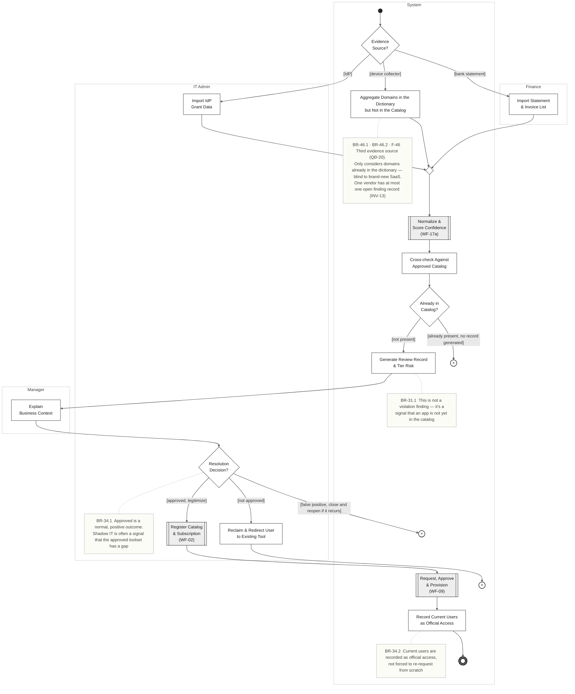
```mermaid
flowchart TB
    subgraph QL["Manager"]
        direction TB
        a5["Explain<br/>Business Context"]
    end
    subgraph TC["Finance"]
        direction TB
        a1["Import Statement<br/>& Invoice List"]
    end
    subgraph IT["IT Admin"]
        direction TB
        a2["Import IdP<br/>Grant Data"]
        d2{"Resolution<br/>Decision?"}
        nt1["BR-34.1  Approved is a normal, positive outcome.<br/>Shadow IT is often a signal that the approved toolset has a gap"]
        a6["Reclaim & Redirect User<br/>to Existing Tool"]
        c2[["Register Catalog<br/>& Subscription<br/>(WF-02)"]]
    end
    subgraph HT["System"]
        direction TB
        ini((" "))
        d0{"Evidence<br/>Source?"}
        a2b["Aggregate Domains in the Dictionary<br/>but Not in the Catalog"]
        nt3["BR-46.1 · BR-46.2 · F-46  Third evidence source (QĐ-20).<br/>Only considers domains already in the dictionary — blind to brand-new SaaS.<br/>One vendor has at most one open finding record (INV-13)"]
        m1{" "}
        c1[["Normalize &<br/>Score Confidence<br/>(WF-17a)"]]
        a3["Cross-check Against<br/>Approved Catalog"]
        d1{"Already in<br/>Catalog?"}
        a4["Generate Review Record<br/>& Tier Risk"]
        ff1(("×"))
        nt0["BR-31.1  This is not a violation finding — it's a<br/>signal that an app is not yet in the catalog"]
        ff2(("×"))
        c3[["Request, Approve<br/>& Provision<br/>(WF-09)"]]
        ff3(("×"))
        a7["Record Current Users<br/>as Official Access"]
        nt2["BR-34.2  Current users are recorded as official access,<br/>not forced to re-request from scratch"]
        fin(((" ")))
    end

    ini --> d0
    d0 -->|"[bank statement]"| a1
    d0 -->|"[IdP]"| a2
    d0 -->|"[device collector]"| a2b
    a1 --> m1
    a2 --> m1
    a2b --> m1
    m1 --> c1
    c1 --> a3
    a3 --> d1
    d1 -->|"[already present, no record generated]"| ff1
    d1 -->|"[not present]"| a4
    a4 --> a5
    a5 --> d2
    d2 -->|"[false positive, close and reopen if it recurs]"| ff2
    d2 -->|"[not approved]"| a6
    a6 --> ff3
    d2 -->|"[approved, legitimize]"| c2
    c2 --> c3
    c3 --> a7
    a7 --> fin
    a4 -.- nt0
    d2 -.- nt1
    a7 -.- nt2
    a2b -.- nt3

    classDef ini  fill:#262626,stroke:#262626,stroke-width:2px,color:#262626
    classDef fin  fill:#ffffff,stroke:#262626,stroke-width:4px,color:#262626
    classDef ff   fill:#ffffff,stroke:#262626,stroke-width:2px,color:#262626
    classDef act  fill:#ffffff,stroke:#595959,stroke-width:1.5px,color:#1a1a1a
    classDef subact fill:#eeeeee,stroke:#595959,stroke-width:1.5px,color:#1a1a1a
    classDef dec  fill:#ffffff,stroke:#595959,stroke-width:1.5px,color:#1a1a1a
    classDef mrg  fill:#ffffff,stroke:#595959,stroke-width:1.5px,color:#ffffff
    classDef bar  fill:#262626,stroke:#262626,stroke-width:3px,color:#262626
    classDef time fill:#f7f7f7,stroke:#595959,stroke-width:1.5px,color:#1a1a1a
    classDef note fill:#fcfcf7,stroke:#a6a6a6,stroke-width:1px,color:#404040
    class ini ini
    class d0,d1,d2 dec
    class a1,a2,a2b,a3,a4,a5,a6,a7 act
    class m1 mrg
    class c1,c2,c3 subact
    class ff1,ff2,ff3 ff
    class fin fin
    class nt0,nt1,nt2,nt3 note
    style QL fill:#ffffff,stroke:#bfbfbf,stroke-width:1px,color:#404040
    style TC fill:#ffffff,stroke:#bfbfbf,stroke-width:1px,color:#404040
    style IT fill:#ffffff,stroke:#bfbfbf,stroke-width:1px,color:#404040
    style HT fill:#ffffff,stroke:#bfbfbf,stroke-width:1px,color:#404040
    linkStyle default stroke:#595959,stroke-width:1.5px
    linkStyle 21,22,23,24 stroke:#a6a6a6,stroke-width:1px,stroke-dasharray:4 3
```

**Quy tắc nghiệp vụ chi phối**

| Mã        | Nội dung                                                                                             |
| --------- | ---------------------------------------------------------------------------------------------------- |
| `BR-31.1` | Bản ghi phát hiện không phải kết luận vi phạm                                                        |
| `BR-31.2` | Mỗi nhà cung cấp chỉ có một bản ghi đang mở                                                          |
| `BR-31.3` | Bản ghi đã đóng ở trạng thái báo nhầm mà xuất hiện lại thì được mở lại                               |
| `BR-31.4` | Lưu cả giá trị thô lẫn giá trị đã chuẩn hóa kèm phương pháp khớp                                     |
| `BR-31.5` | Phân tầng rủi ro theo mức nhạy cảm dữ liệu, số nhân viên liên quan, có đăng nhập tập trung hay không |
| `BR-34.1` | Đã duyệt là kết cục bình thường và tích cực, không phải ngoại lệ                                     |
| `BR-34.2` | Người đang dùng được ghi nhận thành quyền chính thức, không bắt xin lại từ đầu                       |
| `BR-46.1` *(v2.3)* | Chỉ tên miền đã có trong từ điển nhà cung cấp mới được xét — nguồn này mù với SaaS hoàn toàn mới |
| `BR-46.2` *(v2.3, `INV-13`)* | Một nhà cung cấp chỉ có một bản ghi phát hiện đang mở, dù bằng chứng đến từ ba nguồn |

---

### 3.21. `WF-17a` — Normalize & Score Confidence  *(biểu đồ con)*

|                   |                                                                                                            |
| ----------------- | ---------------------------------------------------------------------------------------------------------- |
| **Thuộc**         | MF-5                                                                                                       |
| **Nhịp chạy**     | Được gọi từ WF-17                                                                                          |
| **Kích hoạt bởi** | Một lô giao dịch hoặc bản ghi cấp quyền vừa được import                                                    |
| **Tác nhân**      | IT Admin · System                                                                                          |
| **Flow con**      | `F-31`, `F-32`                                                                                             |
| **Giai đoạn**     | Normalize → Score Confidence → Trace                                                                       |
| **Xong khi**      | Mỗi bản ghi có một tên nhà cung cấp đã chuẩn hóa, một mức tin cậy, và một phương pháp khớp giải trình được |

```mermaid
flowchart TB
    subgraph IT["IT Admin"]
        direction TB
        a6["Manually Confirm<br/>Match Result"]
        nt1["LLM-suggested results<br/>always require human confirmation"]
    end
    subgraph HT["System"]
        direction TB
        ini((" "))
        a1["Normalize Transaction<br/>Description to Vendor Name"]
        d1{"Which Matching<br/>Method?"}
        nt0["Confidence is derived FROM THE MATCHING METHOD,<br/>never from a score the model reports about itself"]
        a2["Assign High Confidence,<br/>Auto-normalized"]
        a3["Assign Fair Confidence,<br/>Allow Review"]
        a4["Assign Medium Confidence,<br/>Queue for Review"]
        a5["Assign Low Confidence"]
        m1{" "}
        a7["Save Raw Value, Normalized Value<br/>& Matching Method"]
        nt2["BR-31.4  Save both the raw and normalized values<br/>to keep the result explainable"]
        fin(((" ")))
    end

    ini --> a1
    a1 --> d1
    d1 -->|"[exact dictionary match]"| a2
    d1 -->|"[pattern match]"| a3
    d1 -->|"[fuzzy match]"| a4
    d1 -->|"[LLM suggestion]"| a5
    a5 --> a6
    a6 --> m1
    a2 --> m1
    a3 --> m1
    a4 --> m1
    m1 --> a7
    a7 --> fin
    d1 -.- nt0
    a6 -.- nt1
    a7 -.- nt2

    classDef ini  fill:#262626,stroke:#262626,stroke-width:2px,color:#262626
    classDef fin  fill:#ffffff,stroke:#262626,stroke-width:4px,color:#262626
    classDef ff   fill:#ffffff,stroke:#262626,stroke-width:2px,color:#262626
    classDef act  fill:#ffffff,stroke:#595959,stroke-width:1.5px,color:#1a1a1a
    classDef subact fill:#eeeeee,stroke:#595959,stroke-width:1.5px,color:#1a1a1a
    classDef dec  fill:#ffffff,stroke:#595959,stroke-width:1.5px,color:#1a1a1a
    classDef mrg  fill:#ffffff,stroke:#595959,stroke-width:1.5px,color:#ffffff
    classDef bar  fill:#262626,stroke:#262626,stroke-width:3px,color:#262626
    classDef time fill:#f7f7f7,stroke:#595959,stroke-width:1.5px,color:#1a1a1a
    classDef note fill:#fcfcf7,stroke:#a6a6a6,stroke-width:1px,color:#404040
    class ini ini
    class a1,a2,a3,a4,a5,a6,a7 act
    class d1 dec
    class m1 mrg
    class fin fin
    class nt0,nt1,nt2 note
    style IT fill:#ffffff,stroke:#bfbfbf,stroke-width:1px,color:#404040
    style HT fill:#ffffff,stroke:#bfbfbf,stroke-width:1px,color:#404040
    linkStyle default stroke:#595959,stroke-width:1.5px
    linkStyle 13,14,15 stroke:#a6a6a6,stroke-width:1px,stroke-dasharray:4 3
```

**Quy tắc nghiệp vụ chi phối**

| Mã        | Nội dung                                                                             |
| --------- | ------------------------------------------------------------------------------------ |
| `BR-31.4` | Lưu cả giá trị thô lẫn giá trị đã chuẩn hóa kèm phương pháp khớp                     |
| `FR-6.5`  | Kết quả do mô hình ngôn ngữ gợi ý luôn ở mức tin cậy thấp và bắt buộc người xác nhận |

---

### 3.22. `WF-18` — Company Device Collector  *(mới ở v2.3 — `QĐ-20`)*

|                   |                                                                                                   |
| ----------------- | ------------------------------------------------------------------------------------------------- |
| **Thuộc**         | MF-3                                                                                              |
| **Nhịp chạy**     | Theo sự kiện *(đăng ký thiết bị)*, rồi theo lịch hằng ngày *(tiện ích gửi bản tổng hợp)*          |
| **Kích hoạt bởi** | Quản trị viên CNTT đăng ký một thiết bị công ty cho một nhân viên                                 |
| **Tác nhân**      | Employee · IT Admin · System *(gồm tiện ích trình duyệt chạy trên thiết bị — **nằm trong** ranh giới, Context Diagram v2.1 mục 7)* |
| **Flow con**      | `F-45`; `F-48` 📐 chỉ nêu trong ghi chú                                                            |
| **Giai đoạn**     | Rollout → On-device Collection → Ingest & Record                                                  |
| **Xong khi**      | Không có bản ghi nào từ thiết bị chưa đăng ký hoặc nhân viên chưa xác nhận, và dữ liệu hợp lệ đã được khớp danh tính và tính lại tình trạng sử dụng |

> **Vì sao là workflow riêng, không phải nhánh của `WF-12`.** Sổ quyết định `QĐ-20` ghi *"`WF-12` — nhánh nhận dữ liệu bộ thu thập"*. Khi vẽ thì nhánh đó trượt phép kiểm ① ở mục 2.1: `WF-12` có **một** sự kiện kích hoạt là *IT tải file lên*, còn bộ thu thập có sự kiện khác hẳn *(IT đăng ký thiết bị, nhân viên bấm xác nhận, rồi mỗi ngày tiện ích gửi dữ liệu)* và có **bàn giao riêng** giữa IT, Nhân viên và Hệ thống. Nên tách thành `WF-18`, **dùng lại** biểu đồ con `WF-12a` để khớp danh tính — cùng một hàm, không có hai đường khớp. Mã `WF-12` giữ nguyên nội dung.

```mermaid
flowchart TB
    subgraph NV["Employee"]
        direction TB
        a3["Read Tracking<br/>Notice"]
        d1{"Click<br/>Acknowledge?"}
        fin1(((" ")))
    end
    subgraph IT["IT Admin"]
        direction TB
        ini((" "))
        a1["Register Company Device<br/>for Employee, With Effective Date"]
        a9["View Collector<br/>Status"]
        nt4["BR-45.6 · SoD-2  No per-person time-ranking screen;<br/>Manager only sees active / inactive"]
    end
    subgraph HT["System"]
        direction TB
        a2["Generate Allowlist,<br/>Excluding Communication Apps"]
        nt0["BR-45.4 · ADR-10  Apps flagged as communication tools<br/>are never in the allowlist"]
        a2b["Send Versioned<br/>Tracking Notice"]
        a4["Save Version & Timestamp,<br/>Open Ingest Gate for Device"]
        nt1["BR-45.1 · INV-17  No acknowledgment, no data.<br/>Notice content changes ⟹ new version, re-acknowledge (BR-42.5)"]
        t1>"Every Day"]
        a5["On Device: Measure Minutes for<br/>Allowlisted Tabs, Drop Everything<br/>Outside the List Immediately"]
        nt2["BR-45.2 · BR-45.3 · ADR-13  Filtering at source is mandatory.<br/>Never collects full URLs, titles, content, keystrokes,<br/>screenshots, location, or domains outside the allowlist"]
        a6["On Device: Send Aggregate<br/>Domain · Date · Minutes"]
        d2{"Ingest Gate: Registered,<br/>Acknowledged, Valid Schema?"}
        a7["Reject Record<br/>& Log Reason"]
        nt3["Stop-collection request (F-40) or offboarding (BR-45.7, WF-07):<br/>registration expires, ingest gate rejects.<br/>A device silent for days does not imply zero usage.<br/>F-48 on-device agent 📐 design-only, uses the same ingest gate"]
        c1[["Match Identity<br/>(WF-12a)"]]
        a8["Commit Usage Data<br/>& Recompute Status"]
        m1{" "}
        fin2(((" ")))
    end

    ini --> a1
    a1 --> a2
    a2 --> a2b
    a2b --> a3
    a3 --> d1
    d1 -->|"[acknowledged]"| a4
    d1 -->|"[not acknowledged]"| fin1
    a4 --> t1
    t1 --> a5
    a5 --> a6
    a6 --> d2
    d2 -->|"[invalid]"| a7
    d2 -->|"[valid]"| c1
    c1 --> a8
    a8 --> m1
    a7 --> m1
    m1 --> a9
    a9 --> fin2
    a2 -.- nt0
    a4 -.- nt1
    a5 -.- nt2
    a7 -.- nt3
    a9 -.- nt4

    classDef ini  fill:#262626,stroke:#262626,stroke-width:2px,color:#262626
    classDef fin  fill:#ffffff,stroke:#262626,stroke-width:4px,color:#262626
    classDef ff   fill:#ffffff,stroke:#262626,stroke-width:2px,color:#262626
    classDef act  fill:#ffffff,stroke:#595959,stroke-width:1.5px,color:#1a1a1a
    classDef subact fill:#eeeeee,stroke:#595959,stroke-width:1.5px,color:#1a1a1a
    classDef dec  fill:#ffffff,stroke:#595959,stroke-width:1.5px,color:#1a1a1a
    classDef mrg  fill:#ffffff,stroke:#595959,stroke-width:1.5px,color:#ffffff
    classDef bar  fill:#262626,stroke:#262626,stroke-width:3px,color:#262626
    classDef time fill:#f7f7f7,stroke:#595959,stroke-width:1.5px,color:#1a1a1a
    classDef note fill:#fcfcf7,stroke:#a6a6a6,stroke-width:1px,color:#404040
    class ini ini
    class a1,a2,a2b,a3,a4,a5,a6,a7,a8,a9 act
    class d1,d2 dec
    class t1 time
    class m1 mrg
    class c1 subact
    class fin1,fin2 fin
    class nt0,nt1,nt2,nt3,nt4 note
    style NV fill:#ffffff,stroke:#bfbfbf,stroke-width:1px,color:#404040
    style IT fill:#ffffff,stroke:#bfbfbf,stroke-width:1px,color:#404040
    style HT fill:#ffffff,stroke:#bfbfbf,stroke-width:1px,color:#404040
    linkStyle default stroke:#595959,stroke-width:1.5px
    linkStyle 18,19,20,21,22 stroke:#a6a6a6,stroke-width:1px,stroke-dasharray:4 3
```

**Quy tắc nghiệp vụ chi phối**

| Mã        | Nội dung |
| --------- | -------- |
| `BR-45.1` *(`INV-17`)* | Chưa xác nhận thì không có dữ liệu — guard `[chưa xác nhận]` → `fin1`; cổng nhận `d2` kiểm lại lần hai |
| `BR-45.2` *(`ADR-13`)* | Lọc tại nguồn là bắt buộc; cổng nhận ở máy chủ là lớp phòng thủ thứ hai |
| `BR-45.3` | Không thu URL đầy đủ, tiêu đề, nội dung, phím bấm, ảnh màn hình, vị trí, tên miền ngoài danh sách |
| `BR-45.4` *(`ADR-10`)* | Ứng dụng mang cờ liên lạc không bao giờ nằm trong danh sách cho phép |
| `BR-45.5` *(`FR-4.16`)* | Hoạt động = đang ở phía trước **và** không rảnh, cộng dồn ≥ N phút/ngày — áp trong `a5` |
| `BR-45.6` *(`SoD-2`)* | Không xếp hạng thời gian dùng theo người; Manager chỉ thấy có / không hoạt động |
| `BR-45.7` | Nghỉ việc ⟹ đăng ký hết hiệu lực — vẽ ở `WF-07` nút `b3` |
| `BR-42.5` | Nội dung thông báo đổi ⟹ phiên bản mới, nhân viên xác nhận lại |

> **Ngoại lệ biểu diễn:** vòng lặp *mỗi ngày* được vẽ **một lượt** — sự kiện thời gian `t1` rồi một lần gửi; lượt sau lặp lại y hệt. Yêu cầu dừng thu thập và thiết bị im lặng nhiều ngày nằm trong ghi chú `nt3`, không vẽ nhánh riêng, vì cả hai đều kết thúc bằng **cổng nhận từ chối** — đúng nhánh `[invalid]` đã có.

---


## 4. Bảy chỗ đáng chỉ tay vào khi bảo vệ

Cả bảy đều **nhìn thấy được trên hình**, không cần đọc tài liệu kèm.

| #     | Ở đâu                                                          | Điểm cần nói                                                                                                                                                                                                                     |
| ----- | -------------------------------------------------------------- | -------------------------------------------------------------------------------------------------------------------------------------------------------------------------------------------------------------------------------- |
| **1** | `WF-01`, hành động cuối trước nút kết thúc                     | Hệ thống cho ra cảnh báo có thật **khi chưa có một dòng nhật ký ngoài nào**. Đây là câu trả lời cho rủi ro lớn nhất **của phân hệ phát hiện lãng phí**, theo ràng buộc `RB-3`                                                    |
| **2** | `WF-09`, đếm số lần mũi tên đổi làn                            | Bốn lần bàn giao qua bốn làn. **Ba loại quyết định, ba người khác nhau** — `SoD-1` đến `SoD-8` và `INV-08` hiện thành hình, không cần giải thích bằng lời                                                                        |
| **3** | `WF-09a`, hai nhánh sau điểm rẽ *Ứng dụng có kết nối tự động?* | Kênh thủ công và kênh tự động **hội tụ vào cùng một nút hợp nhánh**, tức dùng chung một hàng đợi và một cách đo (`BR-10.3`). Phần lớn phần mềm doanh nghiệp Việt Nam không có kết nối tự động, nên nhánh thủ công quan trọng hơn |
| **4** | `WF-12`, ghi chú trên nút ghi dữ liệu                          | `BR-17.6` — nhật ký hoạt động neo vào **quyền**, không neo vào **người**. Lỗi này không báo lỗi, không hiện trong nhật ký, chỉ làm cả phân hệ **âm thầm mất tác dụng**                                                           |
| **5** | `WF-13a`, cả biểu đồ                                           | Tám điều kiện chạy **trước** mọi đánh giá. Chứng minh hệ thống không báo động giả (`TC-2` bằng 0) có giá trị hơn chứng minh nó tìm ra nhiều                                                                                      |
| **6** | `WF-13` nút ghi nhận tiết kiệm, nối sang `WF-15`               | Với hợp đồng cam kết theo năm, thu hồi suất giữa kỳ **không tiết kiệm được đồng nào**. Tiền chỉ thật khi giảm số lượng tại ngày gia hạn                                                                                          |
| **7** | `WF-17`, guard *đã duyệt, hợp thức hóa*                        | `BR-34.1` — đây là **kết cục bình thường và tích cực**, không phải ngoại lệ. Nếu phát hiện Shadow IT chỉ dừng ở ghi nhận rồi để đó thì phân hệ thành một danh sách buộc tội không dẫn tới hành động nào                          |

---

## 5. Kịch bản trình bày

Hai mươi hai biểu đồ là **bộ tài liệu tra cứu**, không phải bộ slide. Mục này chọn ra phần nên chiếu và phần nên để phụ lục.

### 5.1. Điều cần gỡ trước: chuỗi demo **không bằng** workflow

Bốn chuỗi demo `D-1` → `D-4` ở Định nghĩa Phạm vi mục 5.3 được phát biểu theo **giá trị cần chứng minh**, không theo ranh giới quy trình. Nên một chuỗi demo thường đi qua **nhiều** workflow:

| Chuỗi   | Thông điệp cần chứng minh                                | Đi qua những workflow nào                             | Số biểu đồ |
| ------- | -------------------------------------------------------- | ----------------------------------------------------- | ---------- |
| **D-1** | Quy trình chính thức nhanh và có kiểm soát               | `WF-09` → `WF-09a`                                    | 2          |
| **D-2** | Phát hiện có bằng chứng, và trung thực về số tiền        | `WF-12` → `WF-12a` → `WF-13` → `WF-13a` → **`WF-15`** | **5**      |
| **D-3** | Vừa là chi phí vừa là lỗ hổng bảo mật, tin cậy tuyệt đối | `WF-07` → `WF-09a`                                    | 2          |
| **D-4** | Đưa Shadow IT vào diện quản trị, không kết tội           | `WF-17` → `WF-17a` → `WF-02` → `WF-09`                | 4          |

> **Hệ quả quan trọng nhất của bảng này:** nếu nghĩ *“bốn chuỗi demo bằng bốn sơ đồ”* rồi chỉ chiếu `WF-13` cho `D-2`, thì vế **“tới tiền tiết kiệm”** biến mất khỏi bài trình bày — vì phần đó nằm ở `WF-15`. Đúng chỗ hội đồng hay hỏi vặn nhất.

### 5.2. Một slide bản đồ, rồi sáu sơ đồ đi sâu

**Slide mở đầu — chiếu bảng 18 dòng ở mục 2.2, không vẽ gì.** Nói một câu: *“Nhóm xác định 18 quy trình nghiệp vụ, hôm nay đi sâu sáu, phần còn lại ở phụ lục.”* Slide này rẻ nhưng cần thiết: nó chặn trước cảm giác nhóm đang giấu phần chưa làm.

Sau đó sáu sơ đồ, **theo thứ tự kể chuyện, không theo thứ tự mã số**:

| #   | Sơ đồ                                          | Trang `.drawio` | Phút | Vì sao có mặt                                                        | Một câu chốt duy nhất                                                                                      |
| --- | ---------------------------------------------- | --------------- | ---- | -------------------------------------------------------------------- | ---------------------------------------------------------------------------------------------------------- |
| 1   | **WF-01** Khởi tạo hệ thống                    | 1               | ~1,5 | Mở bài. Chặn trước câu hỏi *“lấy đâu ra dữ liệu?”*                   | *“Tới bước cuối này hệ thống đã sinh cảnh báo có thật, mà chưa cần một dòng nhật ký nào từ nhà cung cấp.”* |
| 2   | **WF-09** Yêu cầu, phê duyệt, cấp phát · `D-1` | 9               | ~4   | Xương sống hệ thống, và là chỗ phân tách trách nhiệm hiện thành hình | *“Đếm số lần mũi tên đổi làn: bốn lần. Ba loại quyết định, ba người khác nhau.”*                           |
| 3   | **WF-12** rồi **WF-13** · `D-2`                | 13, 15          | ~5   | Phần lõi học thuật của đề tài                                        | *“Hệ thống không nói suất này lãng phí. Nó nói: không hoạt động 87 ngày, nguồn nào, bao phủ bao lâu.”*     |
| 4   | **WF-15** Chu kỳ gia hạn                       | 18              | ~2   | Chỗ `D-2` thành tiền thật                                            | *“Thu hồi giữa kỳ không tiết kiệm được đồng nào. Tiền chỉ thật ở ngày gia hạn.”*                           |
| 5   | **WF-07** Nghỉ việc · `D-3`                    | 7               | ~2   | Kết bài chắc tay, ai cũng hiểu ngay                                  | *“Vừa là chi phí vừa là lỗ hổng bảo mật, và chỉ dùng dữ liệu nội bộ nên độ chắc chắn tuyệt đối.”*          |

Tổng khoảng **15 phút**. Nếu được 20 đến 25 phút thì thêm **`WF-17`** (trang 20, `D-4`, khoảng 2 phút) với câu chốt: *“Đã duyệt là kết cục bình thường và tích cực, không phải bắt lỗi ai.”*

**Vì sao đúng năm cái này:**

- Phủ **năm trên sáu main flow** — `MF-0` qua `WF-01`, `MF-1` qua `WF-07`, `MF-2` qua `WF-09`, `MF-3` qua `WF-12` và `WF-13`, `MF-4` qua `WF-15`. Chỉ thiếu `MF-5`.
- Phủ **ba trên năm pain point** một cách trực tiếp: `PP-5` ở `WF-09`, `PP-1` ở `WF-13` và `WF-07`, `PP-2` ở `WF-15`.
- Phủ **ba trên bốn chuỗi demo**: `D-1`, `D-2`, `D-3`.

> **`PP-3` và `PP-4` chỉ được phủ khi thêm `WF-17`.** Đây là lý do nên coi `WF-17` là **cái thứ sáu bắt buộc** chứ không phải phần bù giờ, nếu buổi báo cáo có từ 18 phút trở lên. Thêm nó thì bộ sơ đồ phủ **đủ sáu main flow, đủ năm pain point, đủ bốn chuỗi demo**.
>
> **Nếu chỉ có đúng 15 phút thì cắt `WF-01`, đừng cắt `WF-17`.** Ý của `WF-01` — hệ thống tạo giá trị trước khi có dữ liệu nhà cung cấp — nói được bằng một câu khi trình bày `WF-13`, còn `PP-3` và `PP-4` thì không có sơ đồ nào khác gánh thay.

### 5.3. Ba slide dự phòng — chỉ mở khi bị hỏi

Để ở phụ lục, không chiếu trong mạch chính.

| Sơ đồ                        | Trang | Mở ra khi nghe câu hỏi                                                                      |
| ---------------------------- | ----- | ------------------------------------------------------------------------------------------- |
| **WF-13a** Tám cổng lọc      | 16    | *“Làm sao biết hệ thống không báo động giả?”* — đây là câu trả lời mạnh nhất nhóm có        |
| **WF-09a** Thực thi cấp phát | 10    | *“Nhà cung cấp không có API thì sao?”* — chỉ vào hai nhánh hội tụ về cùng một nút hợp nhánh |
| **WF-12a** Khớp danh tính    | 14    | *“Làm sao biết `baovh` là ai?”*                                                             |

### 5.4. Bốn lưu ý về cách nói

1. **Mỗi sơ đồ chỉ nói một điểm chốt.** Đừng đọc từng nút — người nghe đọc nhanh hơn người nói. Chỉ tay vào một chỗ, nói một câu, sang slide tiếp.
2. **Đừng bỏ hẳn `D-4`.** Nó là một trong bốn chuỗi demo đã cam kết ở Định nghĩa Phạm vi mục 5.3. Thiếu thời gian thì nói rõ *“D-4 để phụ lục”* — im lặng bỏ qua sẽ thành lệch với tài liệu đã nộp.
3. **Nếu bị hỏi mười hai cái còn lại đâu:** quay về bảng mục 2.2 và bảng truy vết mục 2.4. Câu trả lời là *“cả 48 mã F đều có chủ sở hữu, không cái nào mồ côi”* — chỉ vào dòng tổng bằng **48** *(khớp User Flows v0.5; 44 tới v2.2)*.
4. **Dùng phân vùng giai đoạn để chỉ tay.** Mỗi biểu đồ trong `.drawio` đã chia sẵn ba tới bốn giai đoạn có tiêu đề. Nói theo giai đoạn thay vì theo nút thì người nghe bám mạch dễ hơn nhiều — ví dụ `WF-09` là *Lập yêu cầu* rồi *Phê duyệt* rồi *Thực thi*.

### 5.5. Dùng ảnh nào cho slide và báo cáo

**Bộ PNG kèm theo đã xuất sẵn bằng chính draw.io**, ở tỉ lệ gấp đôi, dùng được ngay. Không cần tự xuất lại trừ khi muốn cắt nhỏ.

| Thư mục hoặc file                      | Nội dung                                 | Dùng khi                                            |
| -------------------------------------- | ---------------------------------------- | --------------------------------------------------- |
| `png/WF-xx.png`                        | 22 ảnh, xuất bằng `drawio --export -s 2` | **Chèn thẳng vào slide và báo cáo**                 |
| `drawio/WF-xx.drawio`                  | 22 file rời, mỗi biểu đồ một file        | Sửa nội dung, hoặc cắt lấy một phần                 |
| `SaaS-Sentry-Activity-Diagrams.drawio` | File gộp 22 trang                        | Xem liền mạch, chuyển trang bằng thanh tab dưới đáy |

Tỉ lệ khung hình sau khi hoán trục nằm trong khoảng **0,45 tới 1,6** — tức là đều vừa một trang. Ba biểu đồ cao nhất là `WF-13`, `WF-13a` và `WF-02`; ba cái rộng nhất là `WF-17a`, `WF-11` và `WF-03`.

Nếu vẫn muốn chữ to hơn khi trình chiếu, cách hiệu quả nhất là **cắt theo giai đoạn**: mở file rời, chọn các khối trong một dải giai đoạn, rồi **File → Export as → PNG** và bật *Selection Only*. Mỗi giai đoạn thành một slide.

---

## 6. Kiểm chứng

### 6.1. Đối chiếu mã — chạy lại ngày 07/09/2026

| Nhóm mã                                 | Số lượng | Kết quả                                                            |
| --------------------------------------- | -------- | ------------------------------------------------------------------ |
| `BR-xx.x` trong ghi chú và bảng quy tắc | 109      | Toàn bộ tồn tại trong User Flows v0.3 — không có mã chết           |
| `F-xx` được phân bổ                     | 43       | Mỗi mã đúng một `WF` chủ sở hữu; không trùng, không thiếu. 📁 *Số đo của lần chạy 07/09/2026; từ 09/09/2026 là **44** — xem bảng mục 2.4* |
| Làn tác nhân                            | 7        | Tập con của 10 tác nhân Context Diagram v2.0 — không đẻ thêm actor |
| `MF-0` đến `MF-5`                       | 6        | Khớp User Flows mục 1.4 đến 1.9                                    |
| `FR-xx` và `INV-xx` dẫn về BRD          | 9        | Tồn tại trong BRD v3.5 — bổ sung 7 mã ở v2.2, xem mục 0.9          |
| `WF-01` đến `WF-17` cùng 4 biểu đồ con  | 21       | Đặt mới ở tài liệu này                                             |

**Bốn chỗ lệch tìm được và đã sửa** nằm ở mục 0.9. Ba chỗ là thiếu nội dung so với nguồn, một chỗ là nói quá.

### 6.2. Mười phép kiểm ký pháp chạy trên mọi biểu đồ

Bộ sinh **từ chối xuất file** nếu một trong mười điều kiện sau bị vi phạm. Đây là cách bắt lỗi bằng máy thay vì bằng mắt.

| #      | Phép kiểm                                                           | Bắt được lỗi gì                              |
| ------ | ------------------------------------------------------------------- | -------------------------------------------- |
| 1      | Mỗi biểu đồ có ít nhất một initial node                             | Biểu đồ không có điểm vào                    |
| 2      | Mỗi biểu đồ có ít nhất một activity final                           | Quy trình không kết thúc ở đâu cả            |
| 3      | Initial node không có cạnh vào                                      | Dùng nhầm initial làm merge                  |
| 4      | Activity final và flow final không có cạnh ra                       | Vẽ tiếp sau điểm kết thúc                    |
| 5      | Mọi nút khác đều có cạnh vào                                        | Nút mồ côi                                   |
| 6      | Mọi nút khác đều có cạnh ra                                         | Nhánh cụt không dẫn tới đâu                  |
| 7      | **Mọi cạnh ra của decision node đều mang guard**                    | Rẽ nhánh không nói rõ điều kiện              |
| 8      | Decision node có ít nhất hai cạnh ra                                | Hình thoi thừa                               |
| 9      | Merge node có ít nhất hai cạnh vào                                  | Hình thoi thừa                               |
| **10** | **Không ô nào trong cùng một trang trùng định danh** *(mới ở v2.1)* | Đúng lỗi làm vỡ 7 trang ở v2.0 — xem mục 0.7 |

### 6.3. Hai phép kiểm bố cục

Đọc ngược file `.drawio` đã sinh, dựng lại toạ độ từng khối rồi kiểm:

| #   | Phép kiểm                                            | Bắt được lỗi gì                      |
| --- | ---------------------------------------------------- | ------------------------------------ |
| 1   | Không hai khối nào trong cùng một làn chồng lên nhau | Nhãn đè lên nhau, không đọc được     |
| 2   | Không khối nào tràn ra ngoài biên của làn chứa nó    | Khối lọt sang làn khác, sai tác nhân |

### 6.3b. Phép kiểm ngữ nghĩa cho mỗi trang đã đổi *(mới 09/09/2026 — theo §5 báo cáo kiểm chéo của Codex)*

Mười hai phép kiểm trên đều là **kiểm cấu trúc**. Chúng không bắt được loại lỗi mà lượt kiểm chéo tìm ra: hình khớp nhau giữa Mermaid và `.drawio` nhưng **cả hai cùng lệch nguồn nghiệp vụ** — làn `WF-09` mang tên hẹp hơn tập người thật sự đi qua bước đó (`WF-APP-01`), và `WF-16` chỉ có hai kết quả cho một guard mà nguồn quy định ba (`WF-CON-01`). Vì vậy mỗi trang thay đổi phải chạy thêm năm bước sau, **trước khi đóng review**:

| #   | Bước                                                                                                                                                                                      | Bắt được lỗi gì                                                     |
| --- | ------------------------------------------------------------------------------------------------------------------------------------------------------------------------------------------ | ------------------------------------------------------------------- |
| 1   | Lập **bảng hành vi chuẩn** từ BRD/quyết định: actor và làn · tiền điều kiện · hành động · topology · guard và nhãn · end state · ngoại lệ                                                | Không có bảng thì không có gì để đối chiếu                          |
| 2   | Đối chiếu **từng mục** của bảng với Mermaid **và** trang `.drawio` rời lẫn trang trong tệp gộp — gồm **hướng cạnh** và **tác nhân chịu trách nhiệm**                                     | Hai bản khớp nhau nhưng cùng sai so với nguồn                       |
| 3   | Ghi rõ **ngoại lệ biểu diễn hợp lệ**: note thay guard, khác biệt làn/layout/vạch giai đoạn, connector sang trang, định dạng HTML, glyph — vẫn phải giữ topology, guard, nhãn và end state | Nhầm khác biệt trình bày thành lỗi, hoặc ngược lại                  |
| 4   | **Render trang đã đổi và nhìn ảnh**; với HTML kiểm một trang đích và một trang đối chứng ở **sáng và tối trong trình duyệt thật**. Lưu nguồn/kích thước và danh sách phép kiểm đã chạy    | XML hợp lệ không chứng minh hình đọc được                           |
| 5   | **Walkthrough kịch bản biên ngược về BRD** — ví dụ *pending → active*, *Người duyệt chi là người yêu cầu* *(v2.4 — thay ví dụ ủy quyền đã bỏ)*                                                                         | Đường đi tồn tại trên hình nhưng dẫn tới kết cục sai về nghiệp vụ   |

Bước 2 và 5 **bắt buộc** kể cả khi phép so parity Mermaid ↔ `.drawio` báo 0 khác biệt. Quy tắc dùng chung nằm ở `Docs/rules/synchronization.md`, mục *Kiểm ngữ nghĩa cho mỗi trang sơ đồ đã đổi*.

### 6.3c. Gate parity có evidence *(bổ sung 12/09/2026)*

`tools/check-workflow-parity.ps1` đọc `tools/behavior-parity-manifest.json`, kiểm canonical ID/alias, type, lane, label, control edge có hướng, guard và loại final trong **cả Mermaid lẫn `.drawio` rời**. Nó cũng quét 22 source rời tìm cell trùng ngữ nghĩa: cùng type/nhãn/bounds gần trùng nhưng khác parent/ID, đồng thời ghi incoming/outgoing để người đọc phân biệt tín hiệu với lỗi graph thật.

```powershell
powershell -NoProfile -ExecutionPolicy Bypass -File .\tools\check-workflow-parity.ps1
```

Manifest hiện bao phủ **7** trang `WF-07`, `WF-09`, `WF-10`, `WF-15`, `WF-16`, `WF-17`, `WF-18` — ba trang lô 12/09 (`WF-09`, `WF-15`, `WF-16`) cộng các trang đổi theo `QĐ-20`/`QĐ-22` ở v2.3; thêm trang đã đổi vào manifest trước khi dùng gate để kết luận parity cho trang đó. Ngoại lệ trình bày hợp lệ được khai báo theo từng trang, nhưng **không** có allowlist cho actor/lane, topology, guard, nhãn hay end state. `wf15-parity-regression-fixture.json` là mẫu tối thiểu ghi class lỗi trước sửa để detector phải fail với hai instance chia cạnh của cùng graph.

Gate chỉ là bằng chứng cấu trúc có phạm vi. Nó không thay bước 1, 4, 5 ở mục 6.3b: không tự chứng minh nguồn nghiệp vụ, hiệu lực quyền, hoặc khả năng đọc hình.

### 6.4. Kết quả lần chạy cuối

| Hạng mục                                             | Kết quả        |
| ---------------------------------------------------- | -------------- |
| Lỗi ký pháp trên 21 biểu đồ                          | **0**          |
| Trang `.drawio` có định danh trùng                   | **0 trên 21**  |
| Lỗi bố cục — chồng khối hoặc tràn làn                | **0**          |
| Biểu đồ Mermaid render được bằng `mermaid-cli`       | **21 trên 21** |
| Trang `.drawio` xuất được ảnh bằng `drawio --export` | **21 trên 21** |
| Tham chiếu hỏng trong `.drawio`                      | **0**          |
| Tỉ lệ khung hình nằm ngoài khoảng in được            | **0**          |

**Bổ sung lần chạy có evidence ngày 12/09/2026** *(không thay thế các kết quả lịch sử trong bảng trên)*:

| Hạng mục | Phạm vi thực chạy | Kết quả |
| --- | --- | --- |
| `check-workflow-parity.ps1` | Manifest hành vi `WF-09`, `WF-15`, `WF-16` | **pass** — topology/guard/lane/final trong Mermaid và source `.drawio` khớp manifest |
| Quét duplicate semantic cell | **21** source Workflow rời | **0** candidate; fixture lỗi `WF-15` trước sửa kích hoạt detector **1** candidate |
| Export hiện hành | 21 source → 21 PNG + 1 file gộp | **pass**; hash/lệnh/version ở `artifact-manifest.json` |

Output từng trang ở `Diagrams/workflows-activity-diagram/evidence/workflow-parity-check-2026-09-12.json`. Đây không phải tuyên bố đã kiểm ngữ nghĩa lại toàn bộ 21 trang.

**Lần chạy v2.3 ngày 14/09/2026** *(sau `QĐ-20`, `QĐ-22`, `QĐ-23`; không thay kết quả lịch sử ở trên)*:

| Hạng mục | Phạm vi thực chạy | Kết quả |
| --- | --- | --- |
| `check-workflow-parity.ps1` | Manifest mở rộng **7** trang: `WF-07`, `WF-09`, `WF-10`, `WF-15`, `WF-16`, `WF-17`, `WF-18` | **pass**, 0 lỗi |
| Quét duplicate semantic cell | **22** source rời | **0** candidate |
| Export hiện hành | 22 source → 22 PNG + 1 file gộp | **pass**; `artifact-manifest.json` sinh lại |
| Nhìn ảnh sau render | `WF-07`, `WF-09`, `WF-10`, `WF-15`, `WF-17`, `WF-18` | Đã xem toàn trang; sửa ba chỗ cạnh đè nút/nhãn trước khi xuất |
| Walkthrough ngữ nghĩa | *(v2.4, lịch sử — thứ tự Finance trước đã bị `QĐ-29b` thay thế)* `WF-09`: không chi phí → cấp phát thẳng; có chi phí → ý kiến → từ chối ⟹ **không** sinh cam kết; duyệt ⟹ cam kết ∥ cấp phát. `WF-10`: SaaS miễn phí **vẫn** qua `d4`. `WF-15`: quyết định ở làn Người duyệt chi. `WF-18`: chưa xác nhận ⟹ kết thúc, không dữ liệu | Khớp BRD `FR-3.13`, `FR-3.14`, `FR-5.8`, `INV-16`, `INV-17`, User Flows `BR-07.8`–`BR-07.10`, `BR-09.4`, `BR-27.4`, `BR-45.1` |
| Walkthrough ngữ nghĩa *(v2.5 — `QĐ-29b`; lịch sử: chỗ hỏi Tài chính đã đổi cách vẽ ở v2.6)* | `WF-09`: không chi phí → cấp phát thẳng, không có bước Tài chính; có chi phí → snapshot `a7b` → Người duyệt chi `d4`; ~~hỏi Tài chính → `a7` → về `d4` **cùng người**~~ *(cách vẽ này đã bị `QĐ-30a` thay thế)*; từ chối ⟹ **không** sinh cam kết; duyệt ⟹ `a11` tạo cam kết → `a9` Tài chính ghi nhận ∥ cấp phát, IT không chờ Tài chính. `WF-10`: SaaS mới miễn phí vẫn tới `d4`, không snapshot. `WF-15`: snapshot `a6s` → `d2`; nhánh quá hạn vẫn là sự cố. Khớp BRD `FR-3.4`, `FR-3.14`, `FR-5.8`, `BR-07.9`, `BR-27.4` |
| Walkthrough ngữ nghĩa *(v2.6 — `QĐ-30a`)* | **Đường chính không đổi** ở cả ba trang. Việc hỏi Tài chính tách thành **luồng phụ độc lập** `ini2 → s1 → a7/a6b/a6 → ff2`: nút khởi đầu riêng ở làn Người duyệt chi *(hỏi được bất cứ lúc nào)*, kết thúc bằng flow final *(không chặn)*, và **không** có cạnh control nào quay về bước quyết định. Câu trả lời nối tới bước quyết định bằng **cạnh thông tin nét đứt** *Bổ sung ý kiến ngân sách — thông tin sẵn có cho người duyệt*. Số lối ra control giữ nguyên: `WF-09` `d4` **3**, `WF-10` `d4` **2**, `WF-15` `d2` **4**. Ca biên đã đi lại: *Tài chính chưa trả lời mà bước đã quá SLA* ⟹ `d4`/`d2` vẫn quyết được, không có cạnh nào chờ `a7`; *không hỏi Tài chính lần nào* ⟹ luồng phụ không chạy, đường chính vẫn đủ. Khớp BRD `FR-3.14` (2), `QĐ-29b` (3), `QĐ-30a` |

Output ở `Diagrams/workflows-activity-diagram/evidence/workflow-parity-check-2026-09-14.json`. Mặc định của `check-workflow-parity.ps1` nay ghi vào đúng file evidence này; dùng `-OutputPath` khi cần kết quả tạm để không thay baseline. Chưa chạy lại mười phép kiểm ký pháp và hai phép kiểm bố cục của mục 6.2–6.3 — **bộ sinh gốc không có trong kho**, các trang đổi được sửa bằng script vá nguồn `.drawio`.

### 6.5. Vì sao hai bản không thể lệch nhau

Bản Mermaid và bản `.drawio` được cập nhật từ **cùng một tệp đặc tả**, nhưng điều đó không tự chứng minh chúng không lệch nhau. Khi đổi bước nghiệp vụ, phải sửa cả hai, cập nhật manifest hành vi của trang, chạy gate ở mục 6.3c và hoàn tất kiểm ngữ nghĩa ở 6.3b. So node/edge hay số lượng artifact chỉ là tín hiệu cấu trúc.

Đây là cách xử lý trực tiếp bài học đã ghi ở Định nghĩa Phạm vi mục 7.1:

> *“Hai nguồn chân lý mâu thuẫn tốn kém hơn một nguồn chân lý chưa hoàn hảo. Bộ Domain Spec bị gỡ không phải vì nội dung sai, mà vì nó không được cập nhật cùng nhịp với BRD.”*

---

## 7. Việc còn lại

| #   | Việc                                                                                                                                                                                 | Người     | Mốc                      | Chặn gì                                                   |
| --- | ------------------------------------------------------------------------------------------------------------------------------------------------------------------------------------ | --------- | ------------------------ | --------------------------------------------------------- |
| 1   | **Dùng 22 biểu đồ này làm đầu vào cho chín máy trạng thái** (BRD mục 5.12.3). Mỗi guard dẫn tới flow final là một **chuyển trạng thái không hợp lệ**, dùng thẳng làm bộ test phủ định | Phi       | Trước migration đầu tiên | Chặn `ND-5`, tài liệu thiết kế kỹ thuật                   |
| 2   | Đối chiếu 22 biểu đồ với **Use Case Diagram** khi soạn, không đẻ thêm actor ngoài tám làn ở mục 1.2 *(v2.3 — thêm làn Người duyệt chi `E11`)*                                                                                  | Phú       | Trước Tuần 5             | Context Diagram mục 8                                     |
| ~~3~~ | ✅ **ĐÃ CHỐT — `QĐ-02` (08/09/2026):** người duyệt dự phòng ở gốc cây là **một Employee cụ thể do Super Admin cấu hình**, duyệt **với tư cách vai Manager**, không thêm vai trò thứ sáu. Đã ghi vào BRD `FR-3.6`. ⚠️ **Đính chính câu cũ:** `WF-09` **không** có nhánh này — kiểm tại nguồn `drawio/WF-09.drawio` ngày 09/09/2026 cho thấy làn *Quản lý trực tiếp* chỉ có `a5`/`d2` và nhánh leo cấp SLA. Nhánh dự phòng hiện **chỉ được vẽ trên `UF-01` và `UF-04`** → xem việc số 6 | Nhóm | — *(đóng 08/09/2026)* | — |
| ~~4~~ | ✅ **XONG** — *Định nghĩa Phạm vi* **v1.2 mục 5.2** nay ghi **`38 / 3 / 2`**                                                                                                        | Phi       | — *(đóng)*               | —                                                          |
| ~~5~~ | ✅ **XONG** — User Flows **mục 1.10** nay ghi *“`MF-4` gọi `F-35` qua `WF-16`”*. Chủ sở hữu tầng main flow vẫn là **`MF-5`**, chủ sở hữu tầng workflow là **`WF-16`** — hai tầng khác nhau, không mâu thuẫn (`TR-01`) | Phi | — *(đóng 09/09/2026)* | —                                                          |
| ~~6~~ | ✅ **XONG (09/09/2026)** — `WF-09` nay có nút **`a4b` “Xác định người duyệt bước quản lý”** nêu đủ ba trường hợp *(quản lý trực tiếp · người được ủy quyền · người duyệt dự phòng ở gốc)* kèm ghi chú `nt3` dẫn `FR-3.6`, `QĐ-02`, `BR-13.2`, `BR-13.4`; thêm ghi chú `BR-07.4`, `BR-07.6` và mã `BR-13.3`. Đã xuất lại `WF-09`, tệp gộp, PNG và khối Mermaid; **đã nhìn toàn trang sau sửa**. Chuỗi review cũ được rút gọn tại `Docs/Reviews/review-history-summary.md`. | Nhóm | — *(đóng 09/09/2026)* | — |
| 6   | Dựng bộ slide theo kịch bản mục 5.2, xuất hình theo cách cắt giai đoạn ở mục 5.5                                                                                                     | Đăng, Phú | Trước buổi báo cáo       | Không chặn tài liệu                                       |
| 7   | ✅ **XONG (09/09/2026 — `WF-APP-01`, `WF-APP-02`)** — làn chứa `a5`/`d2` của `WF-09` đổi tên thành **“Người duyệt bước quản lý”**, `d2` đổi nhãn theo; nút `a4b` thêm mệnh đề **“không chọn người trùng người yêu cầu”** và ghi chú `nt3` thêm `BR-13.3` · `SoD-4` · `INV-08` kèm cách chọn người hợp lệ kế tiếp. Đã đồng bộ Mermaid, tệp rời, tệp gộp, PNG và **đã nhìn ảnh toàn trang** | Nhóm | — *(đóng 09/09/2026)* | — |
| 8   | ✅ **XONG (09/09/2026 — `WF-CON-01`)** — `WF-16` thêm quyết định `dq2` *“Đã là thành viên active đúng tài khoản?”*, action `a11` *(ghi bằng chứng, chuyển `ProvisioningTask` chờ chấp nhận → hoàn tất)* và flow final `ff3`; `WF-09a` thêm ghi chú `nt3` trỏ tuyến đối soát. Đồng bộ `UF-08` và `UF-14`. Đã xuất lại PNG/SVG/HTML/PDF và **đã nhìn ảnh** | Nhóm | — *(đóng 09/09/2026)* | — |
| ~~9~~ | ✅ **ĐÃ CHỐT (09/09/2026)** — `QĐ-12`: người được ủy quyền trùng người yêu cầu ⟹ bước **quay về chính người ủy quyền**, rồi mới `FR-3.3` *(cấp trên)*, cuối cùng `FR-3.6` *(dự phòng ở gốc)* → BRD **`FR-3.5`**. `QĐ-13`: hết người duyệt hợp lệ ⟹ **giữ chờ có kiểm soát**, gắn cờ, nhắc/leo cấp theo `FR-3.8` và **báo Quản trị hệ thống cấu hình lại** → BRD **`FR-3.12` mới**. Đã vẽ: `WF-09` nút **`a4c`** + hai guard trên cạnh ra của `a4b`; `UF-01` nút `s2`; `UF-04` nút `s2`/`e2`; User Flows `F-13` thêm `BR-13.5`, `BR-13.6`. ⚠️ Thứ tự ưu tiên vốn **đã** được `F-13` bước 2 quyết — vòng kiểm chéo xếp nhầm là chưa quyết vì không đọc `F-13` | Nhóm trưởng | — *(đóng 09/09/2026)* | — |
