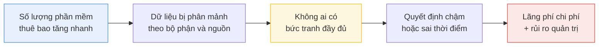
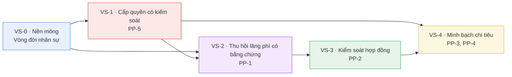

# SaaS-Sentry — WHY / WHAT / WHO và Định hướng nghiên cứu

> **Phiên bản:** 1.7 — đồng bộ **BRD v3.11**. Theo `QĐ-20` → `QĐ-30`. _(Kế hoạch thực hiện v1.1 không còn thuộc baseline theo `QĐ-26`.)_
>
> **Thay đổi ở v1.7 — Owner chốt 16/09/2026** _(sổ quyết định `QĐ-30a` → `QĐ-30c`; nguồn phát hiện: `Docs/Reviews/astra-complete-baseline-verification-2026-09-15.md`)_:
>
> - **Phạm vi bộ thu thập nói lại cho đúng `QĐ-20`** (`SA-07`) — mục 1.5: danh sách cho phép dựng từ **Catalog + `VendorDictionary`**, không phải chỉ SaaS công ty đang trả tiền; trạng thái thanh toán và trạng thái có trong danh mục là **thuộc tính của kết quả**, không phải điều kiện quan sát. Nếu chỉ quan sát thứ đã trả tiền thì không bao giờ thấy SaaS miễn phí hoặc ngoài danh mục — đúng nhóm `PP-4` sinh ra để tìm.
> - **Số bất biến lên 18** và `INV-14` tách thành `INV-14a`/`INV-14b` (`QĐ-30b`, `QĐ-30c`) — Phần VI mục tiêu nghiên cứu, `CN-11`, bảng tài liệu liên quan.
> - **Nguồn phân vai** thôi dẫn Kế hoạch thực hiện v1.1 đã bị `QĐ-26` loại, chuyển về `QĐ-05`/`QĐ-06` (`SA-06`).
> - **UI Spec** ghi rõ **không có** bản hiện hành; file trùng tên là Screen Flows v1.0 legacy (`SA-09`).
>
> **Thay đổi ở v1.6 — Owner chốt 15/09/2026** _(sổ quyết định `QĐ-29a` → `QĐ-29c`)_:
>
> - **Nhánh không phát sinh chi phí không qua Người duyệt chi** — Owner xác nhận (`QĐ-29a`); Người duyệt chi thấy tổng hợp seat cấp theo nhánh này trong báo cáo quy trình. Đóng BRD `OQ-19` — mục 5.3 `D-1`, Phần IV `PP-5`.
> - **Finance không nằm trên đường duyệt** (`QĐ-29b`): Người duyệt chi quyết trên **snapshot ngân sách**, có thể **hỏi Finance** (SLA không dừng); Finance ghi nhận chính thức **sau** duyệt, song song cấp phát. Đóng BRD `OQ-20` — mục 3.2, 3.3, Phần IV `PP-3`, 5.3 `D-1`, `LT-4`, `LT-5`.
> - **Conceptual ERD bỏ `Delegation`** (`QĐ-29c`) — Phần VII.
>
> **Thay đổi ở v1.5 — nhóm trưởng chốt 15/09/2026** _(sổ quyết định `QĐ-27`, `QĐ-28a` → `QĐ-28d`)_:
>
> - **Bỏ ủy quyền duyệt** (`QĐ-27`) — Phần IV dòng `PP-5`, `LT-4`. Nghẽn xử lý bằng SLA, nhắc và cảnh báo backlog; _escalate_ chỉ là thông báo (`QĐ-28d`) — `LT-15`. Xung đột lợi ích của Người duyệt chi giải bằng người thay thế cấu hình trước (`QĐ-28c`) — `LT-4`.
> - **GitHub đo sử dụng bằng lịch sử commit và tiện ích trình duyệt** (`QĐ-28a`) — mục 1.5, `CN-8`, sổ 6.9 dòng 6, nguồn Phần VIII dòng 6. Audit log organization chỉ ghi hành động quản trị nên không còn là nguồn usage.
> - **Tiện ích demo bằng load unpacked**, force-install là thiết kế triển khai (`QĐ-28b`) — mục 1.5, 5.3 `D-2`, `CN-17`. **Chuỗi `D-1`** thêm ca người thay thế khi xung đột (`QĐ-28c`) và ghi hai điểm chờ mentor: BRD `OQ-19`, `OQ-20` _(đã đóng ở v1.6 — `QĐ-29a`, `QĐ-29b`)_.
>
> **Thay đổi ở v1.4 — nhóm trưởng chốt 14/09/2026 sau góp ý của GVHD và mentor** _(sổ quyết định `QĐ-20` → `QĐ-25`; góp ý do nhóm trưởng thuật lại)_:
>
> - **Thêm vai trò Người duyệt chi** — mục 3.1, 3.2, 3.3, Phần IV. Finance chuyển từ _người duyệt chi phí_ sang _người kiểm soát ngân sách_ (`QĐ-22`). Ban giám đốc **có** một người đăng nhập: người giữ vai Người duyệt chi.
> - **Thêm nguồn bằng chứng từ bộ thu thập trên thiết bị công ty** — mục 1.5, 2.2, 2.4, 2.5, 5.3. Tiện ích trình duyệt hiện thực, agent chỉ thiết kế (`QĐ-20`).
> - **Phạm vi luồng `44` → `48` — `43 / 3 / 2`** ở mục 5.2 (`QĐ-20`, `QĐ-22`, `QĐ-24`).
> - **Bỏ phòng ban** khỏi mô hình tổ chức (`QĐ-23`); **hoãn dự báo L2** (`QĐ-25`).
> - Cập nhật `LT-4`, `LT-5`, `LT-10`, `LT-13`, `LT-15`, `LT-16`; thêm **`CN-17`**, **`CN-18`**; đóng dòng 1 của sổ 6.9.
>   **Mục đích:** trả lời bốn câu hỏi nền của đồ án — _vì sao cần_, _làm gì_, _ai dùng_, _cần nghiên cứu gì_ — ở mức đủ để trình bày và bảo vệ.
>   **Quan hệ với BRD:** **BRD v3.10** là **nguồn chân lý duy nhất** về phạm vi, yêu cầu chức năng, mô hình miền nghiệp vụ và quyết định kiến trúc. Tài liệu này **không lặp lại** BRD; nó trả lời phần "vì sao" và "nghiên cứu gì", và dẫn chiếu sang BRD ở những chỗ đã có.
>
> **Thay đổi ở v1.3 — theo quyết định của nhóm trưởng ngày 08/09/2026** _(sổ quyết định: `Docs/Decisions/project-decisions.md`)_:
>
> - **Ánh xạ lại toàn bộ bảng phân công mục 6.2.1** theo bản `.docx` nộp GVHD — nguồn phân vai có hiệu lực (`QĐ-05`). Ân chuyển sang frontend; Bảo nhận toàn bộ backend nền tảng và tích hợp.
> - **Cột `LT` và `CN` ánh xạ lại theo** (`QĐ-06`), giữ nguyên tắc _người nghiên cứu cũng là người hiện thực_. `LT-10` và `LT-13` chuyển sang Bảo; `LT-6` chuyển sang Phi — **đóng `PH-08`**.
> - **Cập nhật cột _Ai_ ở lịch nghiên cứu mục 6.5** theo phân công mới.
>
> **Hiệu chỉnh bổ sung ngày 08/09/2026, sau vòng review độc lập (cùng ngày, vẫn trong v1.3):**
>
> - **Đồng bộ cột _Phụ trách_ của bảng chủ đề kỹ thuật mục 6.3** — vòng v1.3 bỏ sót bảng này nên nó còn giữ phân công trước `QĐ-05`; tám dòng đã sửa. Xem ghi chú dưới bảng 6.2.1.
> - **`LT-6` và `LT-16` được nhóm trưởng xác nhận** thuộc Phi — không còn là điều chỉnh chưa xác nhận của người soạn.
> - **`CN-16` được nhóm trưởng chốt** là **Ân + Phú**.
>
> **Thay đổi ở v1.2 — vòng review tài liệu ngày 08/09/2026:**
>
> - ⚠️ **Sửa con số phạm vi ở mục 5.2:** `37 / 5 / 1` → **`38 / 3 / 2`**, theo bảng chốt phạm vi của User Flows mục 1.2. Ba tài liệu khác đã ghi yêu cầu sửa này. Nguyên nhân lỗi sống lâu: phép đối chiếu ở Phần VII chỉ cộng **tổng** (43) mà không đếm từng nhóm. 📁 _Dòng changelog này thuộc v1.2; con số hiện hành là `44` — `39 / 3 / 2`, cập nhật 09/09/2026, xem mục 5.2._
> - **Nén lại lịch nghiên cứu mục 6.5** theo Kế hoạch v1.0. Lịch cũ bám cửa sổ T1–T13 của Kế hoạch v0.2; cửa sổ thật nay là **T1–T9**, nên Đợt 5 và Đợt 6 vốn rơi vào hoặc sau tuần tính năng phải xong.
> - **Đồng bộ cột `GCV` ở mục 6.2.1** với Kế hoạch v1.0 mục 6 — bổ sung `GCV-3` cho `R1`, `GCV-2` cho `R2`, `GCV-4` cho `R5`.
> - **Sửa dẫn chiếu** "Kế hoạch thực hiện mục 3" → **mục 5 — Phân vai**.
> - **Cập nhật bảng tài liệu liên quan Phần VII:** hai phiên bản lạc hậu và ba tài liệu đang hoạt động nhưng chưa được liệt kê.
>   **Đọc nhanh:** nếu chỉ có 2 phút, đọc **Problem Statement** ở mục 1.1, sơ đồ **Đầu vào → Xử lý → Đầu ra** ở mục 2.2, và **bảng liên kết WHY → WHAT → WHO** ở Phần IV.
>
> **Thay đổi ở v1.1:**
>
> - **Đóng `QĐ-1`** — nhóm chốt **NestJS** làm framework backend ngày 31/08/2026, ghi thành `ADR-11` của BRD. Cập nhật mục 6.7, 6.7.1 và dòng 3 của sổ theo dõi mục 6.9.
> - **Đồng bộ sau khi gỡ bộ Domain Spec.** BRD v3.5 đã gỡ toàn bộ Domain Spec (Phần 1, 1b, 1c, 2, 3, 4) và hợp nhất phần lõi — tám ranh giới ngữ cảnh, mười lăm bất biến `INV-01` → `INV-15`, tám máy trạng thái — vào **BRD mục 5.12**. Mọi dẫn chiếu Domain Spec trong tài liệu này đã được chuyển hướng về BRD.
> - **Đóng ba khoản nợ tài liệu.** `ND-4` (đụng mã `ADR` giữa BRD và Domain Spec) và `ND-1` (Domain Spec còn trích Nghị định 13/2023) **tự tiêu** vì hết đối tượng. `ND-2` chuyển địa chỉ về BRD. Chi tiết ở mục 7.1.
> - **`QĐ-2` chuyển thành việc cần chốt sớm** — nó vốn được đặt cùng mốc với `QĐ-1`; `QĐ-1` đã chốt nên `QĐ-2` không còn lý do chờ. BRD ghi nhận là `OQ-15`.
> - 🔠 _(chú thích thêm 08/09/2026)_ **Hai dòng changelog ngay trên giữ nguyên mã cũ `QĐ-1`, `QĐ-2` vì đó là lịch sử.** Từ 08/09/2026 nhóm mã này đổi thành **`QĐKT-01`, `QĐKT-02`, `QĐKT-03`** để không trùng với sổ quyết định dự án `QĐ-01`→`QĐ-09` — bảng ánh xạ ở **mục 6.7.1**.
> - Vì không còn tài liệu thứ hai dùng dãy mã `ADR`, tài liệu này **không cần ghi kèm "của BRD"** sau mỗi mã nữa; các chỗ ghi kèm được giữ lại chỉ để dễ đọc.
>
> **Thay đổi ở v1.0:** xử lý vòng review cuối — gỡ hai mâu thuẫn nội bộ; chuẩn hóa nguồn văn bản pháp luật về Công báo và cổng Chính phủ; nói mềm quan hệ `PP-5 → PP-4`; đổi _khóa phạm vi_ thành **baseline có điều kiện thay đổi truy được tác động**; bổ sung mục 6.7.1 ba quyết định kỹ thuật chưa chốt; mục 6.9 thêm cột người và hạn cho mọi dòng `Open`.
> **Thay đổi ở v0.5 → v0.9:** bổ sung Problem Statement, mô hình Đầu vào → Xử lý → Đầu ra, bảng liên kết WHY → WHAT → WHO; nâng lên 16 chủ đề lý thuyết và 16 chủ đề kỹ thuật có mã trích dẫn; bổ sung tiêu chí _thế nào là nghiên cứu xong_; viết lại mục 6.9 thành sổ theo dõi bốn trạng thái.

---

## PHẦN I — WHY: Vì sao dự án này cần thiết

### 1.1. Phát biểu vấn đề

> **Problem Statement**
>
> Doanh nghiệp vừa ngày càng phụ thuộc vào phần mềm thuê bao, nhưng thông tin về **hợp đồng, quyền truy cập, mức độ sử dụng và chi phí** lại nằm phân tán ở nhiều bộ phận và nhiều nguồn dữ liệu khác nhau, không nơi nào giữ bức tranh đầy đủ.
>
> Hệ quả là doanh nghiệp không phát hiện được license đang trả tiền mà không ai dùng, bỏ lỡ thời điểm duy nhất có thể tối ưu hợp đồng, không quy được chi phí về đúng đơn vị chịu trách nhiệm, và không kiểm soát được phần mềm được mua ngoài quy trình.

### 1.2. Vấn đề hình thành như thế nào

Vấn đề đi qua năm bước. Đây là mạch nên dùng khi trình bày.



| Bước                      | Biểu hiện cụ thể trong doanh nghiệp                                                                          |
| ------------------------- | ------------------------------------------------------------------------------------------------------------ |
| Phần mềm thuê bao tăng    | Rào cản mua thấp; một trưởng nhóm có thể đưa cả team lên công cụ mới trong mười phút                         |
| Dữ liệu phân mảnh         | Thuê bao ở phòng ban, hợp đồng trong hộp thư người ký, hóa đơn ở kế toán, người dùng thật thì không ở đâu cả |
| Không có bức tranh đầy đủ | Không trả lời được bốn câu hỏi: mua gì, ai được cấp, có dùng không, tiền của ai                              |
| Quyết định chậm hoặc sai  | Gia hạn khi chưa rà soát; cấp quyền trùng lặp; phát hiện lãng phí sau khi đã trả tiền                        |
| Lãng phí và rủi ro        | Tiền trả cho suất không ai dùng; người đã nghỉ còn quyền truy cập; dữ liệu nằm ở dịch vụ chưa ai đánh giá    |

### 1.3. Số liệu tham khảo

Các số liệu dưới đây được tra lại tại nguồn gốc, **ngày truy cập 29/08/2026**. Chúng dùng để cho thấy **cơ chế và xu hướng** của bài toán, không dùng để suy ra con số cho một doanh nghiệp Việt Nam cụ thể — xem lưu ý ở cuối mục.

| Liên quan tới           | Số liệu                                                                                                                                  | Nguồn                  | Nói lên điều gì                                                                                   |
| ----------------------- | ---------------------------------------------------------------------------------------------------------------------------------------- | ---------------------- | ------------------------------------------------------------------------------------------------- |
| **Gốc của mọi vấn đề**  | **81%** chi tiêu SaaS do các bộ phận nghiệp vụ kiểm soát; bộ phận CNTT chỉ trực tiếp quản lý **15%**                                     | Zylo 2026              | Đây chính là phát biểu vấn đề ở mục 1.1, diễn đạt bằng số                                         |
| Quy mô bài toán         | Trung bình **106** ứng dụng SaaS mỗi tổ chức; dự báo **118** cho năm 2026                                                                | BetterCloud 2025, 2026 | Vượt xa ngưỡng quản lý được bằng bảng tính                                                        |
| **PP-1** Ghost seat     | **36%** license SaaS không được sử dụng                                                                                                  | Zylo 2026              | Là **tỷ lệ** nên minh họa quy mô vấn đề tốt hơn con số tuyệt đối — nhưng vẫn là benchmark quốc tế |
| **PP-1** Ghost seat     | Lãng phí trung bình **21 triệu USD/năm**, tăng **14,2%**                                                                                 | Zylo 2025              | Quy mô tuyệt đối, chỉ đúng với tổ chức lớn                                                        |
| **PP-2** Auto-renewal   | **40%** theo dõi ngày gia hạn thủ công · **34%** chỉ dựa vào cảnh báo tự động · **25%** không làm gì và để tự gia hạn                    | BetterCloud 2025       | Một phần tư tổ chức **hoàn toàn không kiểm soát** việc gia hạn                                    |
| **PP-3** Bất đối xứng   | **78%** lãnh đạo CNTT gặp khoản phí ngoài dự kiến từ mô hình tính theo mức dùng hoặc AI; **61%** phải cắt dự án vì chi phí phát sinh     | Zylo 2026              | Hệ quả tài chính có thật, không phải rủi ro lý thuyết                                             |
| **PP-4** Shadow IT      | Chi tiêu SaaS mua qua hình thức hoàn ứng cá nhân tăng **267%** theo năm                                                                  | Zylo 2026              | Shadow IT đang **tăng**, không giảm                                                               |
| **PP-4** Shadow IT      | Gần **60%** nhân sự CNTT vẫn lo ngại về Shadow IT ở mức độ nào đó                                                                        | BetterCloud 2025       | Vấn đề được thừa nhận rộng rãi nhưng chưa giải quyết được                                         |
| **PP-4** Rủi ro AI      | **22%** bộ công cụ hiện là ứng dụng có AI; **67%** coi mất dữ liệu hoặc tác nhân AI mất kiểm soát là rủi ro lớn hơn việc chậm áp dụng AI | BetterCloud 2026       | Công cụ AI làm bài toán kiểm soát cấp thiết hơn                                                   |
| **PP-5** Quy trình chậm | Tỷ lệ **1 nhân sự CNTT trên 108 nhân viên**                                                                                              | BetterCloud 2025       | Áp lực vận hành thật, giải thích vì sao quy trình thủ công không mở rộng được                     |

**Ba con số nên dùng khi trình bày:**

**81% / 15%** — chi tiêu SaaS chủ yếu nằm ngoài tầm quản lý trực tiếp của bộ phận CNTT. Con số này nói đúng cơ chế gây ra cả năm pain point: **quyền mua và quyền quản lý không nằm cùng một chỗ**.

**36% license không được sử dụng** — đây là tỷ lệ nên phù hợp hơn con số tuyệt đối 21 triệu USD khi minh họa quy mô vấn đề. Tuy nhiên, đây **vẫn là benchmark quốc tế** và **không được suy trực tiếp thành tỷ lệ của doanh nghiệp vừa tại Việt Nam**. Nói đúng vế thứ hai này ngay khi đưa con số ra, vì nó thống nhất với lưu ý ở cuối mục — và nó trả lời trước câu _"tại sao số liệu doanh nghiệp lớn lại áp cho doanh nghiệp Việt Nam?"_

**267% tăng trưởng chi tiêu qua hoàn ứng cá nhân** — trả lời trực tiếp câu hỏi _"Shadow IT có còn là vấn đề không hay đã được giải quyết rồi?"_

> **Lưu ý khi trích dẫn — nên chủ động nói ra trước khi bị hỏi.** Toàn bộ số liệu trên là benchmark quốc tế từ dữ liệu và khảo sát của **các nhà cung cấp giải pháp quản trị SaaS**, chủ yếu phản ánh tổ chức lớn ở thị trường Âu Mỹ. Chúng cho thấy bài toán **có thật và đang lớn dần**, nhưng **không** nói được mức chi tiêu hay tỷ lệ lãng phí của bất kỳ doanh nghiệp Việt Nam nào. Dự án không cam kết một tỷ lệ tiết kiệm cố định khi chưa có dữ liệu thực tế của khách hàng.
>
> Một lưu ý kỹ thuật khi trích dẫn: Zylo 2025 công bố chi tiêu **trung bình** 4.830 USD/nhân viên, còn Zylo 2026 công bố **trung vị** 9.455 USD/nhân viên. Hai chỉ số khác nhau về bản chất, **không được so sánh trực tiếp** để suy ra mức tăng trưởng.

### 1.4. Ba mức nhìn vấn đề

Câu trả lời cần đứng được ở cả ba mức. Chỉ có mức 1 thì thành một bài tổng hợp thị trường; chỉ có mức 2 thì thành một công cụ nội bộ không có tính khái quát.

**Mức 1 — Cách doanh nghiệp mua phần mềm đã thay đổi, cách quản lý thì chưa.**

Mười năm trước, mua phần mềm là một quyết định lớn: có hợp đồng, có bên mua sắm, có triển khai. Mô hình thuê bao xóa bỏ toàn bộ ma sát đó. Tốc độ này là ưu điểm thật, nhưng nó khiến quyền sở hữu thông tin bị phân mảnh.

Ở Việt Nam, Quyết định 1121/QĐ-TTg phê duyệt Chương trình hành động quốc gia về chuyển đổi sang nền tảng điện toán đám mây giai đoạn 2025–2030 cho thấy xu hướng này còn tiếp tục tăng.

**Mức 2 — Năm nỗi đau quan sát được, và chúng khác nhau về bản chất.**

Điểm cần nhấn: năm pain point trong BRD mục 2.2 **không cùng một loại vấn đề**, nên không thể xử lý bằng một tính năng duy nhất.

| Pain point                  | Bản chất vấn đề                                                 | Loại giải pháp cần                           |
| --------------------------- | --------------------------------------------------------------- | -------------------------------------------- |
| PP-1 Ghost seat             | Vấn đề **dữ liệu** — không ai biết ai đang dùng gì              | Thu thập và đối chiếu bằng chứng             |
| PP-2 Auto-renewal           | Vấn đề **thời điểm** — biết, nhưng biết quá muộn                | Cảnh báo tính từ đúng mốc                    |
| PP-3 Bất đối xứng thông tin | Vấn đề **ngôn ngữ chung** — Tài chính và CNTT nói hai thứ tiếng | Mô hình dữ liệu chung có đơn vị chịu chi phí |
| PP-4 Shadow IT              | Vấn đề **tầm nhìn** — có thứ tồn tại ngoài hệ thống             | Đối chiếu nhiều nguồn bằng chứng             |
| PP-5 Quy trình chậm         | Vấn đề **quy trình** — đường chính thức chậm hơn đường tắt      | Rút ngắn và đo được thời gian                |

> **Một điểm cần nói rõ khi bảo vệ:** trong phạm vi bài toán mà SaaS-Sentry tập trung xử lý, **PP-5 là một nguyên nhân quan trọng làm phát sinh PP-4**. Nhân viên không đi đường vòng vì muốn phá luật; họ đi vòng vì đường chính thức mất ba ngày còn đăng ký bằng thẻ cá nhân mất ba phút. Vì vậy phân hệ phê duyệt xử lý **một nguyên nhân gốc**, còn phân hệ phát hiện xử lý **phần biểu hiện đã phát sinh** — hai phân hệ bổ trợ nhau chứ không thay thế nhau.
>
> Nói _"một nguyên nhân quan trọng"_ chứ không nói _"nguyên nhân"_, vì Shadow IT còn đến từ những chỗ khác mà hệ thống không xử lý được: nhân viên không biết đã có công cụ tương đương trong danh mục, thói quen mua bằng thẻ cá nhân, nhu cầu thử nhanh một công cụ mới, hoặc doanh nghiệp chưa có chính sách nào về việc này.

**Mức 3 — Vì sao cách làm hiện tại không đủ.**

Phần lớn doanh nghiệp vừa ở Việt Nam quản lý việc này bằng một bảng tính và một hộp thư. Cách đó thất bại ở bốn điểm, và mỗi điểm là một yêu cầu của hệ thống:

| Bảng tính + hộp thư không làm được                    | Hệ thống phải làm được                             |
| ----------------------------------------------------- | -------------------------------------------------- |
| Không biết ai _thực sự_ dùng — chỉ biết ai _được cấp_ | Đối chiếu danh sách cấp phát với dữ liệu hoạt động |
| Không tự nhắc, và nhắc sai mốc                        | Cảnh báo tính từ hạn chót báo hủy                  |
| Không có dấu vết ai quyết định gì, khi nào            | Nhật ký kiểm toán chỉ ghi thêm                     |
| Không phát hiện được thứ nằm ngoài chính nó           | Đối chiếu nhiều nguồn bằng chứng độc lập           |

**Vì sao doanh nghiệp không tự phát hiện được lãng phí, dù rất muốn:** bốn mảnh dữ liệu cần thiết nằm ở bốn nơi khác nhau, thuộc bốn người khác nhau.

| Mảnh dữ liệu            | Nằm ở đâu                                            | Ai giữ                                 |
| ----------------------- | ---------------------------------------------------- | -------------------------------------- |
| Số suất **đã mua**      | Hợp đồng hoặc hóa đơn                                | Tài chính, hoặc người ký hợp đồng      |
| Số suất **đã cấp**      | Trang quản trị của từng nhà cung cấp                 | Bộ phận CNTT, hoặc người tạo tài khoản |
| **Mức độ sử dụng thật** | Bản xuất dữ liệu hoạt động hoặc API của nhà cung cấp | Không ai chủ động lấy về               |
| **Còn cần hay không**   | Trong đầu người quản lý trực tiếp                    | Quản lý của người dùng                 |

Ghép được bốn mảnh này là toàn bộ công việc của phân hệ phát hiện lãng phí. Thiếu một mảnh thì kết luận cuối cùng hoặc sai, hoặc không đưa ra được — và đó là lý do hệ thống có tầng ánh xạ danh tính, cửa sổ dữ liệu bao phủ và vòng xác nhận của quản lý.

### 1.5. Hai câu hỏi thường gặp

**"Đã có Zylo, Torii, Productiv, Microsoft Entra rồi, làm lại để làm gì?"**

Các nền tảng thương mại đó được xây cho doanh nghiệp lớn quốc tế và **giả định** khách hàng đã có sẵn ba thứ: một hệ thống định danh tập trung, quyền truy cập API ở gói cao của từng nhà cung cấp, và một đội CNTT đủ lớn để vận hành. Doanh nghiệp công nghệ vừa ở Việt Nam thường không có đủ cả ba.

Vì vậy đề tài đặt ranh giới ở chỗ khác: **ranh giới giữa hệ thống và thế giới bên ngoài là định dạng dữ liệu, không phải nhà cung cấp**.

Ma trận tra cứu tại BRD mục 6.3.1 củng cố lập luận này bằng số liệu thật: trong **mười một** nhà cung cấp được tra _(v1.4 — tra lại 14/09/2026)_, chỉ **GitHub** cho đọc được bằng chứng sử dụng thật ở gói miễn phí — qua **lịch sử commit** của repo thuộc org, không phải audit log vốn chỉ ghi hành động quản trị _(v1.5 — `QĐ-28a`)_; **Figma, Notion, ChatGPT** chỉ có dữ liệu hoạt động theo người ở gói **Enterprise**; Microsoft cần **Entra ID P1/P2** cho ngày đăng nhập cuối. Một hệ thống dựa hoàn toàn vào API sẽ không thấy được phần lớn danh mục của một doanh nghiệp vừa.

Đó cũng là lý do đề tài thêm **bộ thu thập trên thiết bị công ty** _(v1.4 — `QĐ-20`)_: một tiện ích trình duyệt, cài trên máy công ty cấp, chỉ gửi **tên miền nằm trong danh sách cho phép** cùng số phút dùng mỗi ngày, và chỉ sau khi nhân viên bấm xác nhận. _(Sửa ở v1.7 — finding `SA-07`.)_ Danh sách cho phép dựng từ **Catalog của tổ chức cộng từ điển nhà cung cấp** (`VendorDictionary`, `QĐ-20`), **không** phải chỉ các SaaS công ty đang trả tiền: nếu chỉ quan sát thứ đã trả tiền thì tiện ích **không bao giờ** nhìn thấy SaaS miễn phí hoặc chưa có trong danh mục — đúng nhóm mà phân hệ phát hiện ngoài danh mục (`PP-4`) sinh ra để tìm. **Trạng thái thanh toán và trạng thái có trong danh mục là hai thuộc tính của kết quả, không phải điều kiện để quan sát.** Ranh giới vẫn giữ nguyên: danh sách cho phép là hữu hạn và khai báo được, **không** thu nhật ký truy cập web tùy ý; mọi tên miền ngoài danh sách bị lọc **ngay trên máy** và máy chủ không bao giờ nhận (`ADR-13`). Nó trả lời đúng câu GVHD hỏi — _"nhân viên mua rồi có dùng không"_ — mà không cần doanh nghiệp mua gói cao nhất của từng nhà cung cấp. _(v1.5 — `QĐ-28b`)_ Tại doanh nghiệp, tiện ích được cài bắt buộc qua chính sách trình duyệt được quản lý — đó là **thiết kế triển khai**. Trong demo đồ án, tiện ích chạy bằng **load unpacked** trên máy nhóm; không trình bày là đã force-install.

**"Sao không dùng học máy cho phần phát hiện lãng phí?"**

Bài toán có nhãn xác định (dùng hoặc không dùng), quyết định cuối vẫn do con người, không có tập dữ liệu huấn luyện có nhãn, và điều người dùng cần nhất là **hiểu được lý do để phản biện**.

> Lập luận này còn được củng cố bởi một phát hiện thực tế: Atlassian tính **xem một trang từ 2 giây** là "hoạt động". Với dữ liệu đầu vào có định nghĩa lỏng như vậy, một mô hình học máy sẽ học đúng cái nhiễu đó mà không ai phát hiện được. Hệ dựa trên luật buộc phải khai báo tường minh nguồn hiểu "hoạt động" là gì (BRD FR-4.16, và bất biến `INV-11`) — chính sự tường minh đó giữ được chất lượng kết luận.

### 1.6. Đo bằng gì

Năm chỉ số thành công KPI-1 → KPI-5 và bốn tiêu chí nghiệm thu TC-1 → TC-4 nằm ở **BRD mục 2.4**.

Điểm đáng nhấn khi trình bày: **KPI-5 đo tỷ lệ khuyến nghị bị bác bỏ** — tức là hệ thống tự đo mức độ mình sai. Và **TC-2 yêu cầu số báo động giả trên các hồ sơ đặt bẫy bằng 0**. Hai con số này thể hiện rằng nhóm hiểu mục tiêu không phải "tìm ra nhiều" mà là "tìm ra đúng".

### 1.7. Phiên bản rút gọn dùng khi thuyết trình

**Bản 30 giây:**

> Chi tiêu phần mềm thuê bao của doanh nghiệp phần lớn nằm ngoài tầm quản lý trực tiếp của bộ phận CNTT — dữ liệu về hợp đồng, quyền truy cập, mức sử dụng và chi phí bị chia nhỏ giữa nhiều bộ phận. Hệ quả là trả tiền cho license không ai dùng, bị gia hạn ngoài ý muốn, không quy được chi phí về đúng đơn vị, và không kiểm soát được phần mềm mua ngoài quy trình. SaaS-Sentry tập trung bốn nhóm dữ liệu đó về một chỗ và chuẩn hóa luồng yêu cầu — phê duyệt — cấp quyền, để doanh nghiệp ra quyết định đúng lúc và có bằng chứng.

**Bản 10 giây, khi bị hỏi "đề tài làm gì":**

> Một hệ thống giúp doanh nghiệp biết mình đang mua phần mềm gì, ai được cấp quyền, quyền đó có thực sự được dùng không, và chi phí thuộc về đơn vị nào.

---

## PHẦN II — WHAT: Dự án sẽ làm những gì

### 2.1. Phát biểu một câu

> SaaS-Sentry là **hệ thống quản trị nội bộ doanh nghiệp**, đóng vai trò nơi duy nhất trả lời được bốn câu hỏi: đang mua phần mềm gì, ai được cấp quyền, quyền đó có thực sự được dùng không, và chi phí thuộc về đơn vị nào.

_Về định vị "hệ thống" chứ không phải "nền tảng": xem BRD mục 1 và ADR-01._

### 2.2. Đầu vào → Xử lý → Đầu ra

Mô hình này để người chưa đọc BRD nắm nhanh kiến trúc nghiệp vụ.

```mermaid
flowchart LR
    subgraph IN["ĐẦU VÀO"]
        I1["Nhân sự và<br/>cơ cấu tổ chức"]
        I2["Danh mục, hợp đồng,<br/>thuê bao"]
        I3["Hiện trạng<br/>ai giữ suất nào"]
        I4["Bản xuất dữ liệu<br/>sử dụng"]
        I5["Sao kê,<br/>hóa đơn"]
    end
    subgraph PROC["SaaS-Sentry XỬ LÝ"]
        P1["Chuẩn hóa và<br/>ánh xạ danh tính"]
        P2["Theo dõi vòng đời<br/>quyền truy cập"]
        P3["Điều phối yêu cầu<br/>và phê duyệt"]
        P4["Phát hiện dựa trên luật,<br/>qua 8 cổng lọc"]
        P5["Phân bổ chi phí<br/>và quy đổi tiền tệ"]
        P6["Chấm bằng chứng<br/>và mức tin cậy"]
    end
    subgraph OUT["ĐẦU RA"]
        O1["Danh mục<br/>tập trung"]
        O2["Cảnh báo trước<br/>hạn báo hủy"]
        O3["Khuyến nghị thu hồi<br/>kèm bằng chứng"]
        O4["Bản ghi phần mềm<br/>ngoài danh mục"]
        O5["Bảng chi tiêu<br/>theo đơn vị"]
        O6["Nhật ký<br/>kiểm toán"]
    end

    IN --> PROC --> OUT

    style IN fill:#e8f0fe,stroke:#4285f4
    style PROC fill:#fef7e0,stroke:#fbbc04
    style OUT fill:#e6f4ea,stroke:#34a853
```



**Điều kiện của từng đầu vào:**

| Đầu vào                                           | Bắt buộc    | Nguồn                                                             | Không có thì mất gì                                                 |
| ------------------------------------------------- | ----------- | ----------------------------------------------------------------- | ------------------------------------------------------------------- |
| Nhân sự và cơ cấu tổ chức                         | ✅ Bắt buộc | File xuất từ hệ thống nhân sự                                     | **Toàn bộ luồng phê duyệt không chạy được**                         |
| Danh mục, hợp đồng, thuê bao                      | ✅ Bắt buộc | Nhập tay hoặc file                                                | Mất cảnh báo gia hạn và mọi con số chi phí                          |
| Hiện trạng ai giữ suất nào                        | ✅ Bắt buộc | File hoặc nhập tay                                                | Mất toàn bộ phân hệ phát hiện lãng phí                              |
| Bản xuất dữ liệu sử dụng                          | ⚪ Tùy chọn | File hoặc kết nối tự động                                         | Chỉ mất G3 và G4; **G1 và G2 vẫn chạy**                             |
| **Dữ liệu từ bộ thu thập trên thiết bị** _(v1.4)_ | ⚪ Tùy chọn | Tiện ích trình duyệt trên máy công ty, sau khi nhân viên xác nhận | Ứng dụng không có bản xuất hoạt động ở gói đang dùng chỉ còn G1, G2 |
| Sao kê, hóa đơn                                   | ⚪ Tùy chọn | File từ kế toán                                                   | Mất phân hệ phát hiện ngoài danh mục                                |

> **Điểm đáng chú ý ở mô hình này:** hệ thống tạo được giá trị **chỉ với ba đầu vào bắt buộc**, tất cả đều là dữ liệu nội bộ doanh nghiệp đã có sẵn. Nó biết ngay bao nhiêu suất đã mua chưa gán và bao nhiêu suất còn nằm trong tay người đã nghỉ. Hai đầu vào tùy chọn mở khóa thêm năng lực, nhưng **không phải điều kiện để hệ thống có ích** — và đó là lý do đề tài khả thi trong bối cảnh phần lớn nhà cung cấp không cho truy xuất dữ liệu ở gói doanh nghiệp vừa mua được.

### 2.3. Sáu nhóm năng lực

| #        | Năng lực                                    | Trả lời câu hỏi                                        | Xử lý      |
| -------- | ------------------------------------------- | ------------------------------------------------------ | ---------- |
| **NL-1** | Nắm giữ danh mục và hợp đồng                | Đang mua gì, của ai, điều kiện nào, tới khi nào        | PP-2, PP-3 |
| **NL-2** | Theo dõi ai được cấp quyền gì               | Ai đang giữ suất nào, từ bao giờ, do quyết định nào    | PP-1, PP-3 |
| **NL-3** | Điều phối yêu cầu và phê duyệt có kiểm soát | Ai được duyệt, trong bao lâu, vì lý do gì              | PP-5       |
| **NL-4** | Đối chiếu quyền được cấp với việc dùng thật | Quyền đó có được dùng không, và chắc chắn tới mức nào  | PP-1       |
| **NL-5** | Làm minh bạch chi phí theo đơn vị           | Tiền này của ai, phục vụ việc gì                       | PP-3       |
| **NL-6** | Phát hiện phần mềm ngoài danh mục           | Có thứ gì đang tồn tại mà bộ phận CNTT chưa biết không | PP-4       |

### 2.4. Bốn điểm khác biệt

Nếu chỉ mô tả sáu năng lực trên, đề tài trông giống một hệ thống quản lý danh mục thông thường. Bốn điểm dưới đây là phần khác biệt của đề tài.

**KB-1 — Mọi kết luận đều kèm bằng chứng và mức độ chắc chắn.**
Hệ thống không bao giờ nói "suất này lãng phí". Nó nói: _"Không hoạt động 87 ngày. Nguồn: bản xuất hoạt động Figma nhập ngày 05/08, bao phủ 120 ngày. Khớp danh tính bằng email chính xác. Nguồn này hiểu hoạt động là có sự kiện chỉnh sửa."_ Người quản lý phải phản biện được, không phải tin.

**KB-2 — Xử lý nguyên nhân, không chỉ triệu chứng.**
Phân hệ phê duyệt tồn tại để làm đường chính thức nhanh hơn đường tắt. Hệ thống đo và hiển thị thời gian xử lý từng bước, biến thời hạn xử lý từ con số nội bộ thành một lời hứa nhìn thấy được.

**KB-3 — Trung thực về con số tiết kiệm.**
Với hợp đồng cam kết theo năm, thu hồi suất giữa kỳ **không tiết kiệm được đồng nào**; tiền chỉ thật khi giảm số lượng tại ngày gia hạn. Hệ thống tách hai con số và **không bao giờ cộng chúng lại**.

**KB-4 — Không tạo ra dữ liệu mà mình không cần.**
Hệ thống chủ động **không thu thập** dữ liệu hoạt động của nhóm ứng dụng nhắn tin và họp trực tuyến, vì nhóm đó nằm ở vùng xám pháp lý mà nhóm chưa đủ căn cứ xử lý (BRD `ADR-10`). Cách rẻ nhất để loại một rủi ro là không tạo ra dữ liệu gây rủi ro.

_(v1.4)_ Nguyên tắc này áp luôn cho **bộ thu thập trên thiết bị**: tiện ích **lọc ngay trên máy** — chỉ tên miền trong danh sách cho phép, bỏ mọi ứng dụng liên lạc, không gửi URL, tiêu đề hay nội dung — nên **máy chủ không bao giờ nhận** phần dữ liệu vượt mục đích (BRD `ADR-13`).

### 2.5. Hệ thống KHÔNG làm gì

Danh sách đầy đủ tại BRD mục 3.2 và 5.6.1. Bốn điều đáng nhắc lại khi trình bày:

- Không tự chặn ứng dụng, không tự phê duyệt chi phí, và **không tự quyết định** cấp hay thu hồi quyền
- Không thay thế bộ phận mua sắm — hệ thống ghi nhận quyết định mua, không đàm phán hay thanh toán
- Không cam kết phát hiện 100% Shadow IT — có kịch bản mù hoàn toàn
- Không xử lý nhật ký truy cập web, proxy, CASB **đầy đủ** — nằm ngoài phạm vi vì lý do pháp lý và hạ tầng. _(v1.4)_ Tiện ích trình duyệt lọc theo danh sách cho phép **không** thuộc dòng này; agent trên máy chỉ đặc tả thiết kế

> **Phân biệt hai thứ hay bị gộp làm một: tự quyết định và tự thực thi.** Hệ thống **không tự quyết định** "người này nên được cấp" hay "suất này nên bị thu hồi" — quyết định luôn thuộc về Manager, Người duyệt chi hoặc IT Admin theo ba loại quyết định ở mục 3.2 _(v1.4 — trước đó ghi Finance)_, và `SoD-6` của BRD cấm Automation Service tự cấp hoặc tự thu hồi seat. Nhưng **sau khi đã có một quyết định nghiệp vụ hợp lệ**, bước thực thi hoàn toàn có thể tự động hóa qua cổng cấp phát và `CN-2` SCIM 2.0, ở những nhà cung cấp có hỗ trợ.
>
> Đây chính là `ADR-07` của BRD — _Assignment_ ghi nhận ý định của tổ chức, _ProvisioningTask_ ghi nhận thao tác thật phía nhà cung cấp, hai thực thể có vòng đời riêng (BRD mục 5.12.3). Phát biểu chính xác của BRD mục 3.2 là **"không tự động chặn ứng dụng hoặc thu hồi quyền chỉ dựa trên cảnh báo"** — vế _chỉ dựa trên cảnh báo_ là phần quan trọng nhất và không được lược đi khi tóm tắt.

---

## PHẦN III — WHO: Ai tham gia và ai sử dụng

_Hồ sơ tổ chức mục tiêu — quy mô nhân sự, số ứng dụng, cơ cấu — đã chuyển vào **BRD mục 3.4**. Bảng vai trò chi tiết ở **BRD mục 4.1**._

### 3.1. Phân loại nhóm người liên quan

Câu hỏi _"ai thực sự là người dùng chính của hệ thống?"_ cần trả lời bằng một phân loại, không phải bằng câu "có sáu vai trò".

| Nhóm                              | Ai                                              | Có tài khoản đăng nhập | Giá trị nhận được                                                                  |
| --------------------------------- | ----------------------------------------------- | ---------------------- | ---------------------------------------------------------------------------------- |
| **Người dùng chính**              | IT Admin, Finance                               | ✅                     | Vận hành và quản trị toàn bộ danh mục, hợp đồng và chi phí hằng ngày               |
| **Người dùng không thường xuyên** | Manager, Employee                               | ✅                     | Gửi yêu cầu, phê duyệt, xác nhận khuyến nghị                                       |
| **Người quyết định chi** _(v1.4)_ | Người duyệt chi — mặc định CEO                  | ✅                     | Quyết định cuối cho khoản chi và cho việc thêm SaaS mới; xem tổng chi và tiết kiệm |
| **Người quản trị hệ thống**       | Super Admin                                     | ✅                     | Quản lý tài khoản, vai trò, cấu hình, giám sát nhật ký                             |
| **Tác nhân tự động**              | Automation Service                              | ❌                     | Chạy rule theo lịch, sinh cảnh báo và khuyến nghị                                  |
| **Người hưởng lợi gián tiếp**     | Ban giám đốc, trừ người giữ vai Người duyệt chi | ❌                     | Báo cáo chi tiêu và tiết kiệm                                                      |
| **Bên bảo đảm**                   | Kiểm toán, bộ phận bảo mật                      | ❌                     | Nhật ký kiểm toán, bằng chứng rà soát quyền, cảnh báo người đã nghỉ còn tài khoản  |

> **Ghi chú về cách phân loại.** Nhiều khung phân tích đặt "người ra quyết định" thành một nhóm riêng và gán cho Ban giám đốc. Cách phân loại đó không phù hợp với hệ thống này: Ban giám đốc không đăng nhập và không tham gia bất kỳ quyết định nghiệp vụ nào bên trong SaaS-Sentry. Quyền quyết định nằm ở các nhóm có tài khoản đăng nhập và được phân tách theo **loại quyết định** — trình bày tại mục 3.2.
>
> **Sửa ở v1.4 — `QĐ-22`.** Câu _"Ban giám đốc không đăng nhập"_ **không còn đúng tuyệt đối**. Theo góp ý của mentor, trong doanh nghiệp thật người có thẩm quyền chi — thường là CEO hoặc CTO — mới là người duyệt cuối khoản chi, không phải kế toán. Vì vậy **một** người trong Ban giám đốc giữ vai **Người duyệt chi** và có tài khoản. Phần còn lại của Ban giám đốc vẫn hưởng lợi gián tiếp. Nguyên tắc _phân quyền theo loại quyết định_ không đổi — chỉ đổi người giữ loại quyết định chi phí.

### 3.2. Ba loại quyết định, ba người khác nhau

Đây là cách trả lời câu hỏi "ai là người ra quyết định", và nó khớp với nguyên tắc phân tách trách nhiệm.

| Loại quyết định                               | Ai quyết                     | Quyết cái gì                                                                                                                                                                   |
| --------------------------------------------- | ---------------------------- | ------------------------------------------------------------------------------------------------------------------------------------------------------------------------------ |
| **Quyết định nhu cầu**                        | Manager                      | Nhân viên này có thực sự cần công cụ này không; suất không dùng có nên thu hồi không                                                                                           |
| **Quyết định chi phí**                        | **Người duyệt chi** _(v1.4)_ | Có duyệt khoản chi này không; có thêm SaaS mới vào danh mục không; gia hạn, giảm số lượng hay hủy                                                                              |
| _Kiểm soát ngân sách — không phải quyết định_ | Finance                      | Trả lời khi Người duyệt chi hỏi _còn trong hạn mức không_; ghi nhận ngân sách và khoản cam kết **sau khi** chi được duyệt — **không** nằm trên đường duyệt _(v1.6 — `QĐ-29b`)_ |
| **Quyết định kỹ thuật**                       | IT Admin                     | Cấp từ thuê bao nào; xử lý sai lệch và lỗi cấp phát ra sao                                                                                                                     |

> **Người quyết định nhu cầu, người quyết định chi và người thực hiện kỹ thuật là ba vai khác nhau; Tài chính kiểm soát ngân sách nhưng không quyết chi. Và không ai được duyệt yêu cầu của chính mình.**
>
> Tám nguyên tắc SoD-1 → SoD-8 tại BRD mục 4.2 đều suy ra từ câu này; bất biến `INV-08` là cách nó được ràng buộc ở tầng hệ thống. _(Sửa ở v1.4: thêm `SoD-7`, `SoD-8`. Một ngoại lệ có chủ đích — khi Manager trực tiếp chính là Người duyệt chi, hệ thống vẫn giữ hai bước riêng và gắn cờ, xem BRD mục 4.2.)_

### 3.3. Sáu vai trò nhìn theo nhịp sử dụng _(năm tới v1.3 — thêm Người duyệt chi ở `QĐ-22`)_

| Vai trò                      | Mối quan tâm chính                                         | Tần suất                                     | Hệ quả thiết kế                                                                                                                                                                                                                        |
| ---------------------------- | ---------------------------------------------------------- | -------------------------------------------- | -------------------------------------------------------------------------------------------------------------------------------------------------------------------------------------------------------------------------------------- |
| **IT Admin**                 | Không sót việc, không cấp nhầm, không mất dấu vết          | Hằng ngày                                    | Ưu tiên tốc độ thao tác, chấp nhận giao diện dày                                                                                                                                                                                       |
| **Manager**                  | Cấp dưới có đủ công cụ, và không bị hỏi những câu vô nghĩa | Vài lần một tuần                             | Mỗi lần hỏi phải kèm đủ bằng chứng để quyết ngay                                                                                                                                                                                       |
| **Finance**                  | Chi tiêu trong ngân sách, giải trình được từng khoản       | Hằng tuần, cao điểm cuối tháng               | Số liệu phải truy được về nguồn; trả lời yêu cầu thông tin và ghi nhận sau duyệt phải nhanh, nhưng **không** chặn đường duyệt _(v1.6)_                                                                                                 |
| **Người duyệt chi** _(v1.4)_ | Chi đúng chỗ, không để yêu cầu chờ mình quá lâu            | Vài lần một tuần, theo số yêu cầu có chi phí | Mỗi yêu cầu phải hiện sẵn **snapshot ngân sách** — ngân sách, thực chi, cam kết đang giữ, còn lại, phần đang chờ duyệt — cùng nhu cầu đã được Manager xác nhận; hỏi Finance chỉ khi cần — quyết trong một màn hình _(v1.6 — `QĐ-29b`)_ |
| **Employee**                 | Xin được công cụ cần dùng, nhanh                           | **Vài lần một năm**                          | Màn hình phải tự giải thích, không giả định người dùng nhớ gì                                                                                                                                                                          |
| **Super Admin**              | Hệ thống chạy đúng, phân quyền đúng, có dấu vết            | Hằng tháng                                   | Ưu tiên rõ ràng hơn tiện lợi                                                                                                                                                                                                           |

> **Employee dùng hệ thống vài lần một năm — đây là một ràng buộc thiết kế, không phải chi tiết nhỏ.** Ngược lại, hàng đợi của IT Admin dùng hằng ngày nên có thể đánh đổi sự dễ hiểu lấy tốc độ thao tác.

---

## PHẦN IV — LIÊN KẾT WHY → WHAT → WHO

Bảng này trả lời câu hỏi: _mỗi năng lực tồn tại để giải quyết vấn đề gì, cho ai, và đo bằng gì._ Nó cũng cho thấy nhóm **xuất phát từ vấn đề rồi mới thiết kế tính năng**, không phải làm ngược lại.

| WHY — Vấn đề                                       | WHAT — Năng lực xử lý                                                                                                                                                                                                                                                                                            | WHO — Hưởng lợi chính                                | Đo bằng                                                         |
| -------------------------------------------------- | ---------------------------------------------------------------------------------------------------------------------------------------------------------------------------------------------------------------------------------------------------------------------------------------------------------------- | ---------------------------------------------------- | --------------------------------------------------------------- |
| **PP-1** Trả tiền cho suất không ai dùng           | NL-2 theo dõi quyền + NL-4 đối chiếu sử dụng — từ nhà cung cấp **và từ bộ thu thập trên thiết bị** _(v1.4)_ — khuyến nghị kèm bằng chứng và mức tin cậy                                                                                                                                                          | IT Admin, Manager, Finance                           | **KPI-3** tỷ lệ suất đang hoạt động trên tổng suất đã mua       |
| **PP-2** Bị gia hạn ngoài ý muốn                   | NL-1 vòng đời hợp đồng, cảnh báo tính từ **hạn chót báo hủy** chứ không phải ngày gia hạn                                                                                                                                                                                                                        | IT Admin, Finance                                    | **KPI-4** số thuê bao gia hạn không có quyết định được ghi nhận |
| **PP-3** Tài chính và CNTT không nói cùng ngôn ngữ | NL-5 mô hình chi phí chung có đơn vị chịu chi phí, hai cơ sở ghi nhận, đối soát hóa đơn, **snapshot ngân sách, ghi nhận của Finance và khoản cam kết** _(v1.4; sửa v1.6)_                                                                                                                                        | Finance, **Người duyệt chi**, IT Admin, Ban giám đốc | **KPI-1** tỷ lệ chi tiêu nằm trong danh mục đã duyệt            |
| **PP-4** Phần mềm mua ngoài tầm kiểm soát          | NL-6 đối chiếu nhiều nguồn bằng chứng với danh mục đã duyệt, phân tầng rủi ro                                                                                                                                                                                                                                    | IT Admin, bộ phận bảo mật                            | **KPI-1** như trên                                              |
| **PP-5** Quy trình chính thức quá chậm             | NL-3 yêu cầu và phê duyệt có kiểm soát, thời hạn từng bước, cảnh báo nghẽn **không ủy quyền** _(v1.5 — `QĐ-27`)_, đo thời gian toàn trình; yêu cầu **không phát sinh chi phí không đi qua Người duyệt chi** _(v1.4; Owner xác nhận v1.6 — `QĐ-29a`)_, Finance **không** nằm trên đường duyệt _(v1.6 — `QĐ-29b`)_ | Employee, Manager, IT Admin, Người duyệt chi         | **KPI-2** thời gian trung bình từ gửi yêu cầu tới có tài khoản  |

**Ba điều bảng này cho thấy:**

- Không có năng lực nào không gắn với một pain point — nghĩa là không có tính năng thừa.
- Không có pain point nào không có chỉ số đo — nghĩa là mọi lời hứa đều kiểm chứng được.
- **PP-1 và PP-5 có nhiều người hưởng lợi nhất**, và đó cũng là hai chuỗi demo được ưu tiên phát triển trước trong kế hoạch thực hiện.

> **Phần WHY / WHAT / WHO là baseline phạm vi hiện tại.** Chuỗi lập luận **Vấn đề → Pain point → Năng lực → Người dùng → Chỉ số đo → Chuỗi demo** hiện đã khép kín: mỗi mắt xích đều dẫn được sang mắt xích kế tiếp, và bảng trên là chỗ nối.
>
> Baseline nghĩa là: nhóm **không chủ động mở rộng** thêm pain point, vai trò, năng lực, chỉ số đo, chủ đề lý thuyết hay đối thủ so sánh **nếu không có bằng chứng mới hoặc góp ý mới**. Đây **không phải** tuyên bố "không được thay đổi" — đây là buổi báo cáo đầu, góp ý của giảng viên hướng dẫn hoàn toàn có thể yêu cầu đổi một vai trò, sửa một pain point hoặc bỏ một năng lực, và nhóm sẽ sửa.
>
> **Điều kiện thay đổi sau baseline:** mọi đề xuất thay đổi phải chỉ rõ tác động lan tới đâu theo đúng chuỗi **Pain point → Năng lực → Người dùng → Chỉ số đo → Chuỗi demo**, rồi cập nhật đồng thời mọi mắt xích bị ảnh hưởng. Thêm một phần tử vào một cột mà không cập nhật các cột còn lại sẽ tạo ra phần tử lơ lửng — và đó chính là chỗ dễ bị hỏi nhất. Nói ngắn: **muốn đổi thì phải truy được tác động**, không phải **không được đổi**.

---

## PHẦN V — Phạm vi các luồng nghiệp vụ, bản tóm tắt

_Bảng chốt phạm vi đầy đủ nằm ở tài liệu **User Flows nghiệp vụ**._

### 5.1. Năm luồng giá trị



> **Liên kết VS-2 → VS-3 là chỗ cần chú ý.** Phát hiện lãng phí chỉ thành tiền thật tại ngày gia hạn. Một danh sách khuyến nghị tách rời khỏi lịch hợp đồng thì khó được hành động đúng lúc — đây là lý do nhiều nỗ lực tối ưu license không đi tới đâu.

### 5.2. Quy mô phạm vi

| Nhóm                            | Số luồng | Mã                         |
| ------------------------------- | -------- | -------------------------- |
| Hiện thực đầy đủ                | **43**   | —                          |
| Chỉ đặc tả thiết kế, không code | **3**    | `F-16`, `F-24`, **`F-48`** |
| Ngoài phạm vi                   | 2        | `F-25`, `F-33`             |

> ✅ **Cập nhật 14/09/2026 — `48` = `43 / 3 / 2`** _(v1.4, theo `QĐ-20`, `QĐ-22`, `QĐ-24`)_. Thêm **`F-45`** triển khai và vận hành tiện ích trình duyệt ✅, **`F-46`** phát hiện SaaS ngoài danh mục từ bộ thu thập ✅, **`F-47`** xem báo cáo hiệu suất và chất lượng ✅, **`F-48`** agent trên máy công ty 📐. **`F-36`** lập và theo dõi ngân sách chuyển **📐 → ✅**, vì bước ý kiến ngân sách của Finance cần có ngân sách để so. Hoãn dự báo L2 (`QĐ-25`) **không** đổi số luồng: `F-30` vẫn ✅ với lớp L1 và L3. Con số đếm trên bảng chốt phạm vi của **User Flows v0.5 mục 1.2**.
>
> 📁 _Hai ghi chú dưới đây là lịch sử — con số `39 / 3 / 2` không còn hiện hành._

> 📁 **Lịch sử — sửa ở v1.2:** ba phiên bản trước ghi `37 / 5 / 1`. Con số đúng đếm trên bảng chốt phạm vi của **User Flows nghiệp vụ mục 1.2** là `38 / 3 / 2`. Tổng vẫn là 43 nên lỗi không lộ ra khi cộng. User Flows v0.4, Business Workflows v2.2 và Screen Flows v1.0 đều đã ghi nhận và yêu cầu sửa con số này tại đây.
>
> **Cập nhật 09/09/2026 — `39 / 3 / 2`, tổng 44.** Thêm **`F-44` Xóa dữ liệu quá hạn lưu giữ** _(User Flows mục 7.6)_, hiện thực **`FR-10.3`** vốn đã có trong BRD nhưng chưa luồng nào phủ: `F-41` chỉ phủ nhánh _30 ngày sau nghỉ việc_ của `FR-10.6`, không phủ nhánh **định kỳ 6 tháng / 24 tháng** áp cho cả người đang làm việc. **Không mở rộng phạm vi nghiệp vụ** — chỉ gọi tên một yêu cầu đã chốt.
>
> ✅ **Cập nhật trạng thái 10/09/2026 — `QĐ-14`:** nhóm trưởng phê duyệt `F-44` theo nội dung hiện hành tại User Flows mục 7.6. Con số `39 / 3 / 2` vẫn là **số đếm trên bảng chốt phạm vi của User Flows**; `F-44` giữ thuộc `MF-0` và không tạo workflow riêng. Không thay đổi nội dung nghiệp vụ của luồng.

### 5.3. Bốn chuỗi demo bắt buộc chạy liền mạch

| #       | Chuỗi                              | Thông điệp chứng minh                                                                                                                                                                                                                                                                                                                                                                                                                                               |
| ------- | ---------------------------------- | ------------------------------------------------------------------------------------------------------------------------------------------------------------------------------------------------------------------------------------------------------------------------------------------------------------------------------------------------------------------------------------------------------------------------------------------------------------------- |
| **D-1** | Xin công cụ có phát sinh chi phí   | Quy trình chính thức nhanh và có kiểm soát. _(v1.6 — `QĐ-29b`)_ Chuỗi: Manager xác nhận nhu cầu → **Người duyệt chi** duyệt trên snapshot ngân sách, _tùy chọn hỏi Finance_ → khoản cam kết → Finance ghi nhận ∥ IT Admin cấp seat. _(v1.5)_ Người duyệt chi là người yêu cầu ⟹ bước duyệt chi tạo cho người thay thế Super Admin cấu hình trước (`QĐ-28c`). _(v1.6 — `QĐ-29a`)_ Ca đối chứng: SaaS đã có, còn seat ⟹ Manager → IT Admin, không qua Người duyệt chi |
| **D-2** | Từ file nhật ký tới tiền tiết kiệm | Phát hiện có bằng chứng, và trung thực về số tiền. _(v1.4)_ Thêm nguồn **tiện ích trình duyệt** chạy thật trên máy nhóm **bằng load unpacked** _(v1.5 — `QĐ-28b`; force-install chỉ là thiết kế triển khai)_: một ứng dụng chỉ có G1/G2 từ nhà cung cấp được nâng lên G3/G4. GitHub dùng **lịch sử commit + tiện ích** (`QĐ-28a`); thiếu coverage thì ghi _chưa đánh giá được_, không kết luận _không sử dụng_                                                      |
| **D-3** | Nhân viên nghỉ việc                | Vừa là chi phí vừa là lỗ hổng bảo mật, độ tin cậy tuyệt đối                                                                                                                                                                                                                                                                                                                                                                                                         |
| **D-4** | Phát hiện chi tiêu ngoài danh mục  | Đưa Shadow IT vào diện quản trị, không kết tội                                                                                                                                                                                                                                                                                                                                                                                                                      |

---

## PHẦN VI — LÝ THUYẾT VÀ CÔNG NGHỆ CẦN NGHIÊN CỨU

### 6.1. "Lý thuyết cần nghiên cứu" trong đề tài này là gì

Trong một đề tài phần mềm, **lý thuyết cần nghiên cứu** là các khái niệm, mô hình, nguyên tắc và phương pháp giúp trả lời năm câu hỏi:

- Bài toán nghiệp vụ cần quản lý những gì?
- Dữ liệu nào cần lưu và liên kết với nhau ra sao?
- Ai được làm gì, ai phê duyệt, ai chịu trách nhiệm?
- Hệ thống dựa vào nguyên tắc nào để đưa ra cảnh báo hoặc khuyến nghị?
- Làm sao để dữ liệu đáng tin cậy, an toàn và kiểm toán được?

**Lý thuyết không phải tên công nghệ.** Ví dụ: _kiểm soát truy cập theo vai trò_ là một mô hình phân quyền; _NestJS_ và _PostgreSQL_ là công nghệ dùng để hiện thực mô hình đó.

Đề tài phân biệt **ba tầng**, và trong báo cáo phải trình bày theo đúng thứ tự này:

| Tầng                            | Là gì                                                     | Ví dụ                                                                     | Mã                     |
| ------------------------------- | --------------------------------------------------------- | ------------------------------------------------------------------------- | ---------------------- |
| **1 · Lý thuyết và nguyên tắc** | Khái niệm và mô hình giải thích _vì sao thiết kế như vậy_ | Phân tách trách nhiệm, kiểm soát truy cập theo vai trò, đối sánh thực thể | `LT-x`                 |
| **2 · Chuẩn và giao thức**      | Quy cách kỹ thuật đã được chuẩn hóa để hiện thực tầng 1   | OAuth 2.0, OpenID Connect, SCIM 2.0, JWT                                  | `CN-x` loại _Chuẩn_    |
| **3 · Công nghệ hiện thực**     | Thư viện, nền tảng, hạ tầng cụ thể nhóm chọn dùng         | NestJS, PostgreSQL, Redis, React, MinIO                                   | `CN-x` loại _Kỹ thuật_ |

> **Vì sao phải tách rõ tầng 2 và tầng 3:** SCIM và OAuth thường bị xếp nhầm vào nhóm lý thuyết. Chúng là **chuẩn** — tức là một cách hiện thực đã được đồng thuận, không phải một khái niệm giải thích vấn đề. Nếu trình bày lẫn lộn, câu hỏi _"vậy rốt cuộc SCIM là lý thuyết hay công nghệ?"_ sẽ khó trả lời gọn.

### 6.2. Mười sáu chủ đề lý thuyết

Mỗi chủ đề có mã `LT-x` để trích dẫn chéo với BRD và các tài liệu khác.

> **Cách đọc phần nguồn.** Mỗi chủ đề chỉ có **một nguồn chính** — đó là thứ người phụ trách bắt buộc phải mở ra đọc. Các nguồn còn lại ghi _đọc thêm_ hoặc _nguồn gốc lý thuyết_: dùng khi cần dẫn học thuật trong báo cáo hoặc khi bị hỏi sâu, không bắt buộc đọc hết. Liệt kê nhiều nguồn cho một chủ đề mà không nói cái nào là chính thì trên thực tế không ai đọc cái nào.

#### 6.2.1. Phân công phụ trách

Nguyên tắc phân công: **người nghiên cứu lý thuyết cũng là người hiện thực nó**, để kết quả nghiên cứu đi thẳng vào công việc thay vì nằm lại trong báo cáo. Vai trò `R1`–`R5` theo **`QĐ-05`** _(bảng phân vai có hiệu lực, ánh xạ từ bản `.docx` đã nộp GVHD)_ và **`QĐ-06`** _(ánh xạ cột `LT`/`CN`)_. 📁 _Sửa ở v1.7 (`SA-06`): dòng này trước dẫn **Kế hoạch thực hiện v1.1 mục 5** — tài liệu đã bị `QĐ-26` loại khỏi baseline ngày 15/09/2026, nên không còn được dùng làm nguồn phân vai. Lịch chính thức chờ kế hoạch do GVHD giao._

| Vai trò                             | Thành viên                       | Mã số    | **Phần hệ thống chịu trách nhiệm hiện thực**                                                                                                                                                        | Chủ đề lý thuyết                                    | Chủ đề kỹ thuật                                                                        |
| ----------------------------------- | -------------------------------- | -------- | --------------------------------------------------------------------------------------------------------------------------------------------------------------------------------------------------- | --------------------------------------------------- | -------------------------------------------------------------------------------------- |
| `R1` Nghiệp vụ và tài liệu          | **Phạm Bảo Phi** _(nhóm trưởng)_ | SE185046 | Mô hình dữ liệu; chín vòng đời có máy trạng thái; rule engine tám cổng lọc; cổng kiểm chứng dự báo; từ điển nhà cung cấp — `GCV-2` `GCV-3` `GCV-4` `GCV-5`                                          | `LT-1` `LT-2` `LT-6` `LT-8` `LT-12` `LT-15` `LT-16` | `CN-11`                                                                                |
| `R2` Backend nền tảng và tích hợp   | **Vương Hoài Bảo**               | SE183866 | Xác thực, phân quyền, nhật ký kiểm toán; khung API; hàng đợi tác vụ nền; pipeline import; tầng ánh xạ danh tính; cổng cấp phát hai kênh; phân hệ tuân thủ — `GCV-1` `GCV-2` `GCV-3` `GCV-4` `GCV-6` | `LT-3` `LT-5` `LT-7` `LT-10` `LT-13` `LT-14`        | `CN-1` `CN-2` `CN-3` `CN-4` `CN-5` `CN-6` `CN-7` `CN-8` `CN-9` `CN-10` `CN-12` `CN-13` |
| `R3` Frontend nghiệp vụ             | **Nguyễn Đức Thiên Ân**          | SE182633 | Màn hình của quản lý, của bộ phận tài chính và luồng phê duyệt — `GCV-3` `GCV-5`                                                                                                                    | `LT-4` `LT-9` `LT-11`                               | `CN-16`                                                                                |
| `R4` Frontend nền tảng              | **Nguyễn Hưng Phú**              | SE183939 | Khung ứng dụng; thư viện thành phần dùng chung; màn hình của bộ phận CNTT và của nhân viên — `GCV-1` `GCV-2` `GCV-4`                                                                                | —                                                   | `CN-5` `CN-15` `CN-16`                                                                 |
| `R5` Tài liệu, thiết kế và kiểm thử | **Nguyễn Sỹ Hải Đăng**           | SE183849 | Hỗ trợ tài liệu và sơ đồ; thiết kế Figma; kịch bản kiểm thử; dữ liệu demo; chuẩn bị bảo vệ — `GCV-4` `GCV-6`                                                                                        | —                                                   | `CN-14`                                                                                |

> **Ánh xạ lại toàn bộ ở v1.3 theo `QĐ-05` và `QĐ-06`** _(nhóm trưởng chốt 08/09/2026)_. Nguồn phân vai có hiệu lực là bản **`KE_HOACH_THUC_HIEN_DO_AN_TOT_NGHIEP.docx`**, không phải bản `.md` như vòng đồng bộ trước. Thay đổi lớn nhất: **Ân chuyển sang frontend**, **Bảo nhận toàn bộ backend nền tảng và tích hợp**.
>
> Cột `LT` và `CN` cũng ánh xạ lại theo, để giữ đúng nguyên tắc _người nghiên cứu lý thuyết cũng là người hiện thực nó_. Hai hệ quả đáng chú ý: `LT-10` và `LT-13` (pháp lý) chuyển từ Ân sang **Bảo** vì Bảo hiện thực phân hệ tuân thủ; `LT-6` (Shadow IT) chuyển từ Phú sang **Phi** vì Phi giữ `GCV-5` — **đóng luôn `PH-08`**.
>
> ✅ **`LT-6` và `LT-16` — ĐÃ ĐƯỢC NHÓM TRƯỞNG XÁC NHẬN ngày 08/09/2026.** Phương án gốc ghi `LT-16` cho Phú và `LT-6` cho Đăng; người soạn đề xuất đổi cả hai sang **Phi** vì Phú không giữ mô hình dữ liệu và Đăng không giữ `GCV-5`. Nhóm trưởng **chốt giữ đề xuất này**: cả `LT-6` và `LT-16` thuộc **Phi**, khớp việc Phi giữ thiết kế dữ liệu (`LT-16`) và bộ luật phát hiện lãng phí (`LT-6`). **`PH-08` đóng.** Đây không còn là suy luận của người soạn.
>
> ✅ **Đồng bộ bảng chi tiết mục 6.3 — sửa ngày 08/09/2026 sau review độc lập.** Vòng ánh xạ v1.3 cập nhật bảng này (6.2.1) và lịch nghiên cứu (6.5) nhưng **bỏ sót cột _Phụ trách_ của bảng chủ đề kỹ thuật ở mục 6.3**, khiến bảng đó còn giữ nguyên phân công **trước** `QĐ-05` — toàn bộ chủ đề backend vẫn mang tên Ân, vai `R2` cũ của bạn ấy. Tám dòng đã được đồng bộ theo bảng này: `CN-1`, `CN-3`, `CN-4`, `CN-6`, `CN-10`, `CN-12` chuyển sang **Bảo**; `CN-5` thành **Bảo + Phú**; `CN-16` thành **Ân + Phú** _(nhóm trưởng chốt 08/09/2026)_. Ba bảng 6.2.1, 6.3 và 6.5 nay khớp nhau.
>
> **Phân công hiện thực thực tế mà nhóm trưởng xác nhận 08/09/2026** — dùng để đọc các cột `LT`/`CN` cho đúng: **nghiệp vụ, thiết kế dữ liệu, bộ luật phát hiện lãng phí và toàn bộ tài liệu** do **Phi** giữ vai chính, **cả nhóm cùng tham gia** để mọi người hiểu nghiệp vụ và luồng rồi góp ý tưởng; **backend do Phi và Bảo cùng code**; **frontend web do Ân và Phú**; **Đăng** hỗ trợ tài liệu, sơ đồ và làm Figma UI/UX cùng nhóm frontend, có lúc code cùng frontend. Các mã `LT`/`CN` ghi **người chịu trách nhiệm chính** cho chủ đề đó, không loại trừ người khác cùng làm.
>
> ⚠️ **Rủi ro tải việc:** theo phân vai mới, **Bảo giữ 12 trong 16 chủ đề kỹ thuật và 6 chủ đề lý thuyết** — nặng hơn hẳn bốn người còn lại. Đây là hệ quả trực tiếp của việc `.docx` đặt Bảo làm người backend duy nhất ngoài nhóm trưởng. Việc **Phi cùng code backend** (ghi ở trên) giảm bớt rủi ro này trên thực tế, nhưng cột `CN` vẫn cho thấy tải danh nghĩa lệch. Cần theo dõi ở buổi họp tuần.
>
> **Cách phân công này dựa trên cân đối khối lượng và sự khớp với phần hiện thực, không dựa trên đánh giá năng lực.** Nhóm hoàn toàn có thể hoán đổi trong buổi họp chốt kế hoạch. Hai ràng buộc nên giữ: `LT-10` và `LT-13` phải cùng một người vì hai chủ đề pháp lý này liên quan chặt với nhau; `LT-14` và `CN-13` phải cùng một người vì một bên là lý thuyết và một bên là cách hiện thực của cùng bài toán.
>
> **Nếu bị hỏi vì sao số chủ đề mỗi người không bằng nhau** — `R1` nhiều chủ đề lý thuyết, `R2` nhiều chủ đề kỹ thuật — thì **không trả lời bằng số lượng mã, trả lời bằng cột thứ tư**. Một chủ đề lý thuyết không tương đương một đơn vị khối lượng: `LT-16` thiết kế theo miền nghiệp vụ nặng gấp nhiều lần `CN-3` JWT. Nhóm phân chia theo **chuỗi chức năng mà thành viên chịu trách nhiệm hiện thực**, và các mã `LT`/`CN` chỉ là hệ quả của việc ai sở hữu phần code nào — người viết tầng ánh xạ danh tính thì nhận `LT-14` và `CN-13`, không phải ngược lại.

#### 6.2.2. Chọn nội dung trình bày trong buổi báo cáo

Ba mươi hai chủ đề là **danh sách nghiên cứu**, không phải danh sách trình bày. Đọc hết trong buổi báo cáo sẽ làm loãng phần quan trọng. Đề xuất chia hai mức:

| Mức                   | Nội dung                                                                                                                                                                                                                                                                                                                                                                               | Số mục                    |
| --------------------- | -------------------------------------------------------------------------------------------------------------------------------------------------------------------------------------------------------------------------------------------------------------------------------------------------------------------------------------------------------------------------------------- | ------------------------- |
| **Trình bày miệng** ★ | `LT-1` `LT-2` quản trị SaaS và vòng đời license · `LT-3` `LT-5` quản trị truy cập và phân tách trách nhiệm · `LT-8` hệ dựa trên luật và tính giải thích được · `LT-14` đối sánh thực thể · `LT-10` bảo vệ dữ liệu cá nhân · `LT-16` thiết kế theo miền nghiệp vụ. Về kỹ thuật: `CN-2` SCIM, `CN-7` import có bước chạy thử, `CN-8` định dạng xuất của nhà cung cấp, `CN-9` idempotency | 8 lý thuyết + 4 kỹ thuật  |
| **Để phụ lục**        | Toàn bộ phần còn lại, có bảng đầy đủ để tra khi bị hỏi                                                                                                                                                                                                                                                                                                                                 | 8 lý thuyết + 12 kỹ thuật |

> **Câu cần nói khi trình bày danh sách này:** _"Nhóm chưa nghiên cứu hoàn tất toàn bộ các nội dung này. Đây là research backlog **được xác định từ yêu cầu hệ thống**, và **mỗi chủ đề sẽ được nghiên cứu trước giai đoạn hiện thực tương ứng**."_
>
> Ba ý trong câu đó lần lượt chặn ba câu hỏi khác nhau: _chưa hoàn tất_ chặn giả định nhóm đang khoe thành quả; _xác định từ yêu cầu hệ thống_ chặn nghi ngờ đây là danh sách kiến thức CNTT chung gom lại cho dày; _nghiên cứu trước giai đoạn hiện thực_ chặn câu _"ba mươi hai chủ đề mà làm xong hết trong một kỳ à?"_ — vì thứ tự đã có ở mục 6.5 và tiêu chí hoàn thành ở mục 6.6.

**Lý do chọn tám chủ đề trên để nói:** `LT-1`, `LT-2`, `LT-16` là nền không có không hiểu được đề tài; `LT-3`, `LT-5` là chỗ hội đồng hay hỏi nhất; còn `LT-8`, `LT-10`, `LT-14` là ba chủ đề **ít đồ án gọi tên được** nên đáng dành thời gian nói kỹ. Bốn chủ đề kỹ thuật được chọn cũng theo cùng logic — chúng là đặc trưng của hệ thống có tính tin cậy, không phải công nghệ phổ thông.

---

#### Nhóm A — Nghiệp vụ quản trị SaaS và chi phí

**`LT-1` · Quản lý tài sản phần mềm**

Quản lý tài sản CNTT trong toàn bộ vòng đời. Trong phạm vi đề tài, tài sản không phải máy móc mà là **quyền sử dụng phần mềm**: license, suất dùng, thuê bao.

_Cần nghiên cứu:_ vòng đời tài sản phần mềm; khái niệm quyền sử dụng và tuân thủ license; sự khác biệt giữa phần mềm mua đứt và phần mềm thuê bao.
_Áp dụng:_ nền của phân hệ danh mục và phân bổ suất — BRD mục 5.1, 5.2.
_Kết quả cần tạo ra:_ bảng vòng đời tài sản phần mềm kèm danh sách thuộc tính bắt buộc của một bản ghi license, dùng trực tiếp làm đầu vào cho các bảng `Subscription` và `Assignment` trong ranh giới `C1` và `C3` (BRD mục 5.12.1).
_Nguồn chính:_ **ISO/IEC 19770-1:2017** — hệ thống quản lý tài sản CNTT.

**`LT-2` · Quản trị SaaS, vòng đời license và quản lý tài chính công nghệ**

Vòng đời một suất dùng đi qua tám chặng, và hệ thống phải theo dõi được từng chặng:

```
Nhu cầu phát sinh → Yêu cầu → Phê duyệt → Mua hoặc gia hạn thuê bao
  → Cấp quyền → Theo dõi sử dụng → Thu hồi hoặc gia hạn → Kết thúc
```

_Cần nghiên cứu:_ danh mục SaaS đã phê duyệt; thuê bao, hợp đồng, hóa đơn và quan hệ giữa chúng; hạn chót báo hủy; phân bổ chi phí về đơn vị chịu chi phí; hiển thị chi phí cho đơn vị sử dụng so với quy chi phí thật về đơn vị đó.
_Áp dụng:_ toàn bộ phân hệ BRD 5.1, 5.5 và bảng điều khiển tài chính.
_Kết quả cần tạo ra:_ sơ đồ tám chặng vòng đời suất dùng, mỗi chặng ánh xạ sang một bảng dữ liệu và một luồng `F-x`; kèm bảng phân biệt _hiển thị chi phí cho đơn vị_ và _quy chi phí thật về đơn vị_.
_Nguồn chính:_ **FinOps Framework** của FinOps Foundation — các domain _Understand usage & cost_ và _Quantify business value_.
_Đọc thêm nếu còn thời gian:_ **ITIL 4** thực hành Service Financial Management; báo cáo ngành tại Phần VIII.

**`LT-9` · Kế toán chi phí: cơ sở dòng tiền và cơ sở dồn tích**

Hai cách ghi nhận cùng một khoản chi cho ra hai bức tranh khác nhau.

_Cần nghiên cứu:_ ghi nhận theo ngày phát sinh dòng tiền so với phân bổ đều theo kỳ sử dụng; vì sao báo cáo ngân sách và báo cáo đối soát thanh toán cần hai cơ sở khác nhau.
_Áp dụng:_ **FR-5.3** và quyết định **OQ-06** — hệ thống lưu cả hai, có nhãn phân biệt. Một hóa đơn năm 12.000 USD trả tháng Một sẽ làm vỡ ngân sách tháng Một và để trống mười một tháng còn lại nếu chỉ dùng cơ sở dòng tiền.
_Kết quả cần tạo ra:_ bảng đối chiếu hai cơ sở ghi nhận trên cùng một hóa đơn năm, kèm một test case kiểm tra tổng chi 12 tháng của hai cơ sở phải bằng nhau.
_Nguồn chính:_ **VAS 01 — Chuẩn mực chung**, nguyên tắc cơ sở dồn tích (ban hành theo Quyết định 165/2002/QĐ-BTC). Đây là văn bản tiếng Việt, ngắn, đọc được trong một buổi.
_Đối chiếu quốc tế:_ **IAS 1** _Presentation of Financial Statements_.

**`LT-11` · Đa tiền tệ trong hệ thống tài chính**

_Cần nghiên cứu:_ đồng tiền báo cáo của tổ chức; chốt tỷ giá tại thời điểm ghi nhận giao dịch thay vì quy đổi lại lúc xem báo cáo; vì sao không dùng kiểu số thực dấu phẩy động cho tiền.
_Áp dụng:_ **FR-1.6, FR-5.6** và **ADR-03**. Doanh nghiệp Việt Nam mua phần mềm bằng ngoại tệ nhưng báo cáo bằng đồng nội tệ; không có quy đổi có kiểm soát thì mọi biểu đồ so sánh ngân sách đều vô nghĩa.
_Kết quả cần tạo ra:_ quy ước lưu tiền theo bộ trường của **bất biến `INV-04`** (BRD mục 5.12.2) — số tiền gốc, loại tiền tệ, tỷ giá, ngày áp dụng, giá trị đã quy đổi — kèm test case chứng minh xem lại một báo cáo cũ vẫn ra đúng số cũ vì tỷ giá đã chốt tại thời điểm ghi nhận.
_Nguồn chính:_ **VAS 10** _Ảnh hưởng của việc thay đổi tỷ giá hối đoái_ — quy định về tỷ giá tại thời điểm ghi nhận (cùng Quyết định 165/2002/QĐ-BTC với VAS 01).
_Đọc thêm:_ Martin Fowler, _Patterns of Enterprise Application Architecture_ — mẫu **Money**, cho phần vì sao không dùng số thực dấu phẩy động.

---

#### Nhóm B — Quản trị truy cập và kiểm soát nội bộ

**`LT-3` · Quản trị định danh và quyền truy cập**

_Cần nghiên cứu:_ xác thực và phân quyền là hai việc khác nhau; kiểm soát truy cập theo vai trò; nguyên tắc quyền tối thiểu; cấp phát và thu hồi quyền theo vòng đời nhân sự; **rà soát quyền định kỳ**.
_Áp dụng:_ sáu vai trò của hệ thống _(năm tới v1.3; thêm Người duyệt chi ở v1.4)_, phân quyền ở tầng API, luồng cấp và thu hồi quyền.
_Kết quả cần tạo ra:_ bảng nguyên tắc quản trị truy cập áp dụng cho đề tài, kèm **ma trận ánh xạ Vai trò → Quyền → Endpoint API** đầy đủ, dùng làm đặc tả cho `CN-4` và cho tầng guard của NestJS (`ADR-11`).
_Nguồn chính:_ **NIST SP 800-53 Rev. 5**, họ kiểm soát AC — đặc biệt **AC-2** về phê duyệt, tạo, thay đổi, vô hiệu hóa và rà soát tài khoản định kỳ. Đây là nguồn ánh xạ thẳng sang yêu cầu của hệ thống.
_Đọc thêm nếu cần hiểu mô hình RBAC gốc:_ Sandhu và cộng sự (1996), _Role-Based Access Control Models_, IEEE Computer 29(2) — bài này dễ đọc hơn bản chuẩn ANSI/INCITS 359.

**`LT-4` · Quản lý quyền và phê duyệt nhiều tầng**

_Cần nghiên cứu:_ mô hình người duyệt là quản lý trực tiếp; người duyệt xác định động theo điều kiện; chuỗi phê duyệt nhiều tầng; người duyệt dự phòng; **người duyệt thay thế khi xung đột lợi ích** cấu hình trước. _(v1.5 — `QĐ-27`, `QĐ-28c`: bỏ ủy quyền có thời hạn; phân biệt cấu hình tĩnh theo điều kiện với ủy quyền do người duyệt tự chọn.)_
_Áp dụng:_ **FR-3.3 → FR-3.6**, chính sách duyệt cấu hình được. _(v1.4)_ Thêm **`FR-3.13`** Người duyệt chi — **một** người do Super Admin cấu hình, tham gia khi Request có chi phí hoặc là SaaS mới — và **`FR-3.14`** snapshot ngân sách, quyền hỏi Finance và ghi nhận của Finance sau duyệt, không có hiệu lực chặn _(sửa v1.6 — `QĐ-29b`)_. Mô hình _ma trận nhiều ngưỡng tiền_ của Entra đã cân nhắc và **không chọn** cho MVP (`QĐ-22`).
_Kết quả cần tạo ra:_ bảng chính sách duyệt cấu hình được theo dạng _điều kiện → chuỗi người duyệt_, kèm bốn test case: người duyệt vắng mặt _(không đổi người, chỉ nhắc và cảnh báo)_, Người duyệt chi là người yêu cầu _(chuyển người thay thế khi xung đột)_, chuỗi duyệt vòng, và người duyệt trùng người yêu cầu (bất biến `INV-08`). _(v1.5 — thay test case "ủy quyền hết hạn")_ _(v1.6)_ Thêm test: Người duyệt chi hỏi Finance ⟹ SLA của bước **không** dừng và người được giao **không** đổi.
_Nguồn chính:_ **Microsoft Entra ID Governance** — entitlement management và dynamic approval. Chọn nguồn này vì nó mô tả một hệ thống có thật đang chạy, không phải mô hình lý thuyết.
_Đọc thêm:_ **NIST SP 800-53 Rev. 5** kiểm soát AC-5, AC-6.

**`LT-5` · Phân tách trách nhiệm và kiểm soát nội bộ**

Nguyên tắc: không để một người đồng thời đề xuất, phê duyệt và thực hiện một quyết định quan trọng.

_Cần nghiên cứu:_ mục đích của nguyên tắc — giảm rủi ro lạm quyền, gian lận và sai sót không bị phát hiện; cách kiểm chứng nguyên tắc bằng kiểm thử phân quyền.
_Áp dụng:_ **SoD-1 → SoD-8** _(v1.4)_, bất biến `INV-08`, và ba loại quyết định ở mục 3.2 của tài liệu này.
_Kết quả cần tạo ra:_ ma trận phân tách trách nhiệm dạng _vai trò × hành động_, kèm **tám** test case phủ định — mỗi nguyên tắc `SoD-x` một trường hợp bắt buộc phải bị hệ thống chặn ở tầng guard — cộng một test **dương** cho ngoại lệ _Manager trùng Người duyệt chi được giữ hai bước và gắn cờ_.
_Nguồn chính:_ **ISO/IEC 27001:2022** Annex A, kiểm soát **5.3** _Segregation of duties_. Chỉ khoảng một trang, nhưng đủ để phát biểu nguyên tắc và dẫn được vào `SoD-1 → SoD-8`.
_Đọc thêm nếu bị hỏi sâu:_ **COSO Internal Control — Integrated Framework (2013)**. Không cần đọc COBIT cho phạm vi đề tài.

**`LT-15` · Máy trạng thái hữu hạn và mô hình hóa quy trình phê duyệt**

Thứ đề tài cần **không phải** toàn bộ lĩnh vực quản lý quy trình nghiệp vụ, mà hẹp hơn: cách đặc tả một vòng đời bằng tập trạng thái, tập chuyển trạng thái, điều kiện canh và hiệu ứng kèm theo.

_Cần nghiên cứu:_ máy trạng thái hữu hạn; điều kiện canh và hiệu ứng phụ; vì sao chuyển trạng thái không có trong bảng thì phải coi là không tồn tại; đo thời hạn xử lý và cơ chế nhắc, thông báo khi quá hạn — _escalate chỉ là thông báo, không đổi người duyệt_ _(v1.5 — `QĐ-28d`)_.
_Áp dụng:_ **BRD mục 5.12.3** — **chín** vòng đời cần đặc tả bằng máy trạng thái _(tám tới v1.3; thêm khoản cam kết ngân sách ở v1.4)_. Lưu ý mô hình đúng của hệ thống là **hai tầng**: yêu cầu có vòng đời riêng, còn từng bước duyệt là thực thể riêng có vòng đời riêng. Không gộp hai tầng — đây là một trong hai nguyên tắc bắt buộc ghi tại BRD mục 5.12.3.
_Kết quả cần tạo ra:_ bảng chuyển trạng thái đầy đủ cho chín thực thể — trạng thái nguồn, sự kiện, điều kiện canh, trạng thái đích, hiệu ứng — kèm danh sách các chuyển trạng thái **không hợp lệ** dùng làm bộ test phủ định.
_Nguồn chính:_ **OMG UML 2.5.1**, chương _State Machines_ — dùng được ngay để đặc tả, có sẵn ký pháp cho điều kiện canh và hiệu ứng.
_Nguồn gốc lý thuyết, trích khi cần dẫn học thuật:_ Harel, D. (1987), _Statecharts: A Visual Formalism for Complex Systems_, Science of Computer Programming 8(3).

> Đề tài **không dùng** ký pháp mô hình hóa quy trình nghiệp vụ chuẩn công nghiệp. Nêu rõ điều này để tránh bị hỏi về công cụ mà nhóm không dùng.

---

#### Nhóm C — Dữ liệu, suy luận và độ tin cậy

**`LT-14` · Đối sánh thực thể và liên kết bản ghi**

Bài toán: khớp một định danh lạ từ nguồn ngoài — `baovh`, `bao.pham+figma@cty.vn`, `PAYPAL*CANVA` — về đúng một thực thể nội bộ, khi không có khóa chung.

_Cần nghiên cứu:_ khớp tất định so với khớp xác suất; chuẩn hóa chuỗi trước khi so khớp; ngưỡng quyết định và vùng cần người xem lại; đánh đổi giữa **bỏ sót** và **khớp nhầm**; xử lý trường hợp một định danh khớp về nhiều thực thể.
_Áp dụng:_ **FR-4.5 → FR-4.8** và **FR-6.5**. Đây là nền lý thuyết của toàn bộ tầng ánh xạ danh tính trong ranh giới `C5` (BRD mục 5.12.1), và là điều kiện để bất biến `INV-12` giữ được.
_Kết quả cần tạo ra:_ bộ quy tắc chuẩn hóa chuỗi, chiến lược khớp xếp theo thứ tự ưu tiên, ngưỡng tin cậy đã chốt, và bộ test case gồm cả trường hợp khớp nhầm lẫn trường hợp một định danh khớp nhiều thực thể.
_Nguồn chính:_ Christen, P. (2012), _Data Matching_, Springer — sách giáo khoa, chương về chuẩn hóa và chương về so khớp là đủ cho đề tài.
_Nguồn gốc lý thuyết, trích khi cần dẫn học thuật:_ Fellegi, I. P. và Sunter, A. B. (1969), _A Theory for Record Linkage_, Journal of the American Statistical Association 64(328).

> **Vì sao chủ đề này cần được chú ý:** nếu tầng ánh xạ sai, mọi kết luận phía sau đều sai mà không có dấu hiệu gì. Đây cũng là chủ đề ít đồ án gọi tên được, nên đáng nhấn khi bảo vệ. Lưu ý phân biệt với `LT-7`: đối sánh thực thể là **bài toán khớp**, chất lượng dữ liệu là **bài toán tin cậy được bao nhiêu**.

**`LT-7` · Chất lượng và nguồn gốc dữ liệu**

_Cần nghiên cứu:_ năm chiều chất lượng dữ liệu — đầy đủ, nhất quán, kịp thời, chính xác, truy vết được; khái niệm **cửa sổ dữ liệu bao phủ**; nguồn chân lý khi nhiều nguồn mâu thuẫn; lưu vết kết luận về tới file hoặc lần gọi nào.
_Áp dụng:_ **FR-4.3, FR-4.10, FR-7.7** và luồng **F-43**; hai bất biến `INV-10` và `INV-11`. Nguyên tắc chốt: dữ liệu nội bộ đã qua phê duyệt là chân lý về _ý định_, dữ liệu nhà cung cấp là chân lý về _thực tế_, và khi lệch nhau thì không nguồn nào tự ghi đè nguồn kia.
_Kết quả cần tạo ra:_ định nghĩa vận hành của **cửa sổ dữ liệu bao phủ**, bảng quy tắc ưu tiên nguồn khi mâu thuẫn (`FR-7.7`), và mẫu bản ghi truy vết cho phép lần từ một kết luận về đúng file hoặc lần gọi API đã sinh ra nó.
_Nguồn chính:_ **DAMA-DMBOK** ấn bản 2, chương _Data Quality_ — đây là nơi lấy danh sách các chiều chất lượng dữ liệu dùng trong đề tài.
_Nguồn gốc lý thuyết:_ Wang, R. Y. và Strong, D. M. (1996), _Beyond Accuracy: What Data Quality Means to Data Consumers_, JMIS 12(4) — bài đặt nền cho quan niệm chất lượng dữ liệu là _sự phù hợp với mục đích sử dụng_. Lưu ý khi trích: khung của Wang và Strong không trùng khít với danh sách năm chiều nêu trên, nên dẫn bài này cho **quan niệm**, dẫn DAMA-DMBOK cho **danh sách chiều**.
_Cho phần lưu vết nguồn gốc:_ **W3C PROV-DM**.

**`LT-8` · Hệ ra quyết định dựa trên luật và tính giải thích được**

_Cần nghiên cứu:_ hệ dựa trên luật so với mô hình học máy — khi nào chọn cái nào; tính giải thích được như một yêu cầu chức năng chứ không phải tính năng phụ; cổng lọc điều kiện trước khi đánh giá; đánh đổi giữa báo động giả và bỏ sót.
_Áp dụng:_ tám cổng lọc của **FR-4.9**, công thức mức tin cậy **FR-4.14**, và tiêu chí nghiệm thu **TC-2** yêu cầu số báo động giả bằng không.
_Kết quả cần tạo ra:_ bảng tám cổng lọc ghi rõ đầu vào, điều kiện, đầu ra và **cách xử lý khi không đủ bằng chứng**; kèm công thức mức tin cậy có ít nhất một ví dụ tính tay đầy đủ.
_Nguồn chính:_ Rudin, C. (2019), _Stop Explaining Black Box Machine Learning Models for High Stakes Decisions and Use Interpretable Models Instead_, Nature Machine Intelligence 1. Bài này lập luận đúng cái mà `ADR-09` đã quyết: với quyết định có hậu quả, chọn mô hình giải thích được ngay từ đầu thay vì giải thích ngược một mô hình hộp đen.
_Đọc thêm:_ Molnar, C., _Interpretable Machine Learning_ — sách trực tuyến miễn phí, chương phân biệt mô hình tự giải thích và giải thích hậu kiểm.
_Lập luận chốt:_ xem mục 1.5 của tài liệu này và **ADR-09**.

**`LT-12` · Đánh giá sai số dự báo**

_Cần nghiên cứu:_ kiểm chứng lùi bằng cách chia dữ liệu huấn luyện và kiểm tra; sai số phần trăm tuyệt đối trung bình; cách diễn giải các dải sai số; vì sao mô hình phức tạp không nhất thiết cho sai số tốt hơn trên chuỗi dữ liệu tháng ngắn.
_Áp dụng:_ cổng kiểm chứng **FR-5.7** — hệ thống tự đánh giá và **tự từ chối dự báo** khi sai số vượt ngưỡng.
_Kết quả cần tạo ra:_ hàm kiểm chứng lùi chạy được, kèm báo cáo sai số trên một tập dữ liệu mẫu 12 tháng, ngưỡng đã chốt và mô tả hành vi hệ thống khi vượt ngưỡng.
_Nguồn chính:_ Hyndman, R. J. và Athanasopoulos, G., _Forecasting: Principles and Practice_, ấn bản 3, OTexts — chương đánh giá độ chính xác dự báo và kiểm chứng chéo chuỗi thời gian. Sách miễn phí, đọc trực tuyến, có ví dụ chạy được.

---

#### Nhóm D — Mô hình hóa hệ thống

**`LT-16` · Thiết kế theo miền nghiệp vụ**

Cách tiếp cận thiết kế xoay quanh nghiệp vụ thực tế, giúp cả nhóm dùng chung một bộ thuật ngữ và chia hệ thống thành các vùng có ranh giới rõ.

_Cần nghiên cứu:_ thực thể có định danh và vòng đời riêng; đối tượng giá trị xác định bằng nội dung — ví dụ tiền gồm số tiền và loại tiền tệ; ranh giới ngữ cảnh nghiệp vụ; **bất biến** là quy tắc luôn phải đúng ở tầng dữ liệu; **dữ liệu có hiệu lực theo thời gian** thay vì ghi đè.
_Áp dụng:_ **BRD mục 5.12** — tám ranh giới ngữ cảnh `C1` → `C8`, **mười bảy** bất biến `INV-01` → `INV-17` _(v1.4)_, và các bảng có khoảng hiệu lực theo **ADR-04**. Ranh giới ngữ cảnh cũng là cơ sở chia module ở tầng mã nguồn theo **ADR-11**.
_Kết quả cần tạo ra:_ bảng thuật ngữ nghiệp vụ dùng chung cho cả nhóm (đối chiếu BRD mục 12), sơ đồ tám ranh giới ngữ cảnh, và danh sách **mười tám** bất biến kèm cách ràng buộc từng bất biến ở tầng cơ sở dữ liệu _(v1.7 — thêm `INV-18`, và `INV-14` tách thành `INV-14a`/`INV-14b`, `QĐ-30b`, `QĐ-30c`)_.
_Nguồn chính:_ Evans, E. (2003), _Domain-Driven Design_, Addison-Wesley — phần I và phần IV là đủ; không cần đọc cả sách. Bản tóm tắt miễn phí _DDD Reference_ (2015) dùng để tra nhanh.
_Đọc thêm:_ Vernon, V. (2013), _Implementing Domain-Driven Design_ cho phần ranh giới ngữ cảnh; Fowler, M., _Analysis Patterns_ cho nhóm mẫu dữ liệu có hiệu lực theo thời gian, liên quan trực tiếp `ADR-04`.

> **Chủ đề này vừa tăng trọng số ở v1.1.** Trước đây phần lớn kết quả của `LT-16` nằm ở bộ Domain Spec tách rời. Sau khi Domain Spec bị gỡ và nội dung lõi chuyển vào BRD mục 5.12, người phụ trách `LT-16` chịu trách nhiệm luôn việc **soạn lại tài liệu thiết kế kỹ thuật** ở giai đoạn hiện thực — lược đồ bảng chi tiết và bảng chuyển trạng thái đầy đủ. Xem mục 7.1.

---

#### Nhóm E — Rủi ro, pháp lý và quyền riêng tư

**`LT-6` · Shadow IT và phát hiện dịch vụ đám mây**

_Cần nghiên cứu:_ định nghĩa Shadow IT; các nguồn bằng chứng và **điểm mù của từng nguồn**; phát hiện dựa trên bằng chứng thay vì suy đoán; vì sao không thể cam kết phát hiện toàn bộ.
_Áp dụng:_ phân hệ **BRD 5.6**, ranh giới `C6`, và nguyên tắc bản ghi phát hiện không phải kết luận vi phạm (`FR-6.6`).
_Kết quả cần tạo ra:_ bảng _nguồn bằng chứng × điểm mù của nguồn đó_, kèm quy tắc phân tầng rủi ro áp cho một bản ghi phát hiện.
_Nguồn chính:_ Microsoft Learn về Shadow IT và Cloud Discovery.
_Đọc thêm:_ **ISO/IEC 27001:2022** Annex A, kiểm soát **5.23** _Information security for use of cloud services_.

**`LT-10` · Bảo vệ dữ liệu cá nhân** — **ưu tiên cao**

_Cần nghiên cứu:_ danh mục **mười hai nhóm dữ liệu cá nhân nhạy cảm** tại Điều 4 Nghị định 356/2025; cơ sở pháp lý xử lý dữ liệu người lao động; **điều kiện minh bạch khi áp dụng biện pháp công nghệ để quản lý người lao động**; nghĩa vụ xóa dữ liệu khi chấm dứt hợp đồng lao động; quyền của chủ thể dữ liệu và thời hạn đáp ứng; nguyên tắc thiết kế bảo vệ quyền riêng tư ngay từ đầu.
_Áp dụng:_ **BRD mục 7.7** toàn bộ, **ADR-10**, phân hệ **5.11**, luồng **F-40 → F-42**, và chính sách lưu giữ tại BRD mục 7.5.
_Kết quả cần tạo ra:_ **Ma trận phân loại dữ liệu** — mỗi trường dữ liệu cá nhân trong hệ thống ứng với một mức nhạy cảm, một cơ sở pháp lý xử lý và một thời hạn lưu giữ; kèm bản mẫu thông báo minh bạch gửi người lao động theo yêu cầu của luật. **Ma trận này nay bổ sung vào BRD mục 7.7.2** — xem `ND-2` tại mục 7.1.
_Nguồn chính, đọc bản gốc chứ không đọc bài tóm tắt:_ **Nghị định 356/2025/NĐ-CP** — trọng tâm là **Điều 4** danh mục dữ liệu nhạy cảm; và **Luật Bảo vệ dữ liệu cá nhân số 91/2025/QH15** phần quyền của chủ thể dữ liệu.

_Cập nhật ở v1.4 — `QĐ-20`:_ đã đọc nguyên văn trên PDF Công báo các Điều **3, 7, 8, 9, 11, 19, 21, 25, 32, 38** của Luật 91/2025. Điểm quyết định cho bộ thu thập trên thiết bị là **Điều 25 khoản 3**: biện pháp công nghệ quản lý người lao động chỉ được áp dụng khi phù hợp pháp luật, bảo đảm quyền lợi và _"người lao động biết rõ biện pháp đó"_; cùng **Điều 38 khoản 2**: doanh nghiệp xử lý dữ liệu nhạy cảm **không** được miễn hồ sơ đánh giá tác động. Kết quả đã chuyển thành mười điều kiện `ĐK-01` → `ĐK-10` ở BRD mục 7.7.7 và `ADR-13`. **Còn mở:** thông báo cộng xác nhận có thay được sự đồng ý theo Điều 11 không — `OQ-16`.

> ⚠️ **Nghị định 13/2023/NĐ-CP đã hết hiệu lực từ 01/01/2026.** BRD v3.1 đã sửa hết; bộ Domain Spec — nơi còn sót một trích dẫn — đã được gỡ bỏ ở BRD v3.5, nên khoản nợ `ND-1` không còn đối tượng.

**`LT-13` · Pháp luật viễn thông**

_Cần nghiên cứu:_ khái niệm **dịch vụ viễn thông cơ bản trên Internet** trong Luật Viễn thông 2023 và phạm vi các dịch vụ nhắn tin, gọi thoại, họp trực tuyến qua Internet.
_Áp dụng:_ phân tích vùng xám của nhóm ứng dụng liên lạc tại **BRD mục 7.7.6** và quyết định **ADR-10**. Đây là đường rủi ro pháp lý thật của nhóm ứng dụng này — không phải cụm "dịch vụ truyền thông trực tuyến" như suy đoán ban đầu.
_Kết quả cần tạo ra:_ quy tắc ba câu hỏi gắn cờ `is_communication_service` (`FR-1.8`) áp thử trên danh mục **mười một** nhà cung cấp ở BRD mục 6.3.1 _(tám tới v1.3)_, cho ra kết luận _thu thập_ hoặc _không thu thập_ đối với từng ứng dụng.
_Nguồn chính:_ **Luật Viễn thông số 24/2023/QH15** — phần giải thích từ ngữ và phân loại dịch vụ viễn thông.
_Đọc thêm:_ **Nghị định 163/2024/NĐ-CP** quy định chi tiết một số điều và biện pháp thi hành Luật Viễn thông.

---

### 6.3. Mười tám chủ đề chuẩn, giao thức và công nghệ hiện thực _(mười sáu tới v1.3)_

Cột **Loại** phân biệt tầng 2 và tầng 3 theo bảng ở mục 6.1.

| #                            | Chủ đề                                                                                                                                              | Loại     | Cần để làm gì                                                                                                                                                     | Kết quả cần tạo ra                                                                                                                                                                              | Ưu tiên    | Phụ trách                                        |
| ---------------------------- | --------------------------------------------------------------------------------------------------------------------------------------------------- | -------- | ----------------------------------------------------------------------------------------------------------------------------------------------------------------- | ----------------------------------------------------------------------------------------------------------------------------------------------------------------------------------------------- | ---------- | ------------------------------------------------ |
| CN-1                         | OAuth 2.0 và OpenID Connect                                                                                                                         | Chuẩn    | Xác thực; đọc hiểu dữ liệu cấp quyền phục vụ phát hiện ngoài danh mục                                                                                             | Sơ đồ luồng authorization code + danh sách scope cần xin cho từng nhà cung cấp demo                                                                                                             | Cao        | Bảo                                              |
| CN-2                         | **SCIM 2.0**                                                                                                                                        | Chuẩn    | Cấp phát và thu hồi tài khoản tự động — nền của cổng cấp phát                                                                                                     | Bản đồ thuộc tính SCIM User → bảng nội bộ + một kịch bản tạo và vô hiệu hóa tài khoản chạy được                                                                                                 | Cao        | Bảo                                              |
| CN-3                         | JWT                                                                                                                                                 | Chuẩn    | Biểu diễn phiên đăng nhập                                                                                                                                         | Quy ước claim trong token, thời hạn sống và cơ chế làm mới                                                                                                                                      | Cao        | Bảo                                              |
| CN-4                         | Kiểm soát truy cập theo vai trò ở tầng API                                                                                                          | Kỹ thuật | Enforce phân quyền, không chỉ ẩn ở giao diện — hiện thực bằng **guard của NestJS**                                                                                | Ma trận endpoint × vai trò + bộ test trả về 401 và 403 + tám test phủ định cho `SoD-1` → `SoD-8` _(v1.4)_                                                                                       | Cao        | Bảo                                              |
| CN-5                         | Thiết kế REST API                                                                                                                                   | Kỹ thuật | Hợp đồng giữa frontend và backend                                                                                                                                 | Bản đặc tả OpenAPI cho nhóm endpoint lõi, chốt trước khi frontend bắt đầu; tận dụng chia sẻ kiểu TypeScript giữa hai phía (`ADR-11`)                                                            | Cao        | Bảo + Phú                                        |
| CN-6                         | Hàng đợi và tác vụ nền                                                                                                                              | Kỹ thuật | Chạy rule engine, import, đối soát, thông báo                                                                                                                     | Sơ đồ hàng đợi, danh sách job định kỳ và chính sách thử lại khi thất bại                                                                                                                        | Cao        | Bảo                                              |
| CN-7                         | Pipeline xử lý file có bước chạy thử                                                                                                                | Kỹ thuật | Import sáu bước với xem trước bắt buộc                                                                                                                            | Bộ file mẫu ba loại — hợp lệ, sai định dạng, trùng khóa — kèm bảng quy định hệ thống phản ứng thế nào với từng loại                                                                             | Cao        | Bảo                                              |
| CN-8                         | **Định dạng xuất dữ liệu của nhà cung cấp**                                                                                                         | Kỹ thuật | Lịch sử commit GitHub _(v1.5 — thay nhật ký kiểm toán, `QĐ-28a`)_, báo cáo Microsoft 365, API Atlassian: cấu trúc cột, đơn vị thời gian, **định nghĩa hoạt động** | **Hai đến ba bộ dữ liệu mẫu thật** + bảng ánh xạ cột và định nghĩa "hoạt động" của từng nguồn (bất biến `INV-11`)                                                                               | **Cao**    | Bảo                                              |
| CN-9                         | Idempotency và cơ chế thử lại                                                                                                                       | Kỹ thuật | Không tạo tài khoản hai lần khi thử lại                                                                                                                           | Quy tắc sinh khóa idempotency từ dữ liệu nghiệp vụ + test gọi lặp không sinh bản ghi thứ hai                                                                                                    | Trung bình | Bảo                                              |
| CN-10                        | Lưu trữ đối tượng và URL có thời hạn                                                                                                                | Kỹ thuật | Bảo vệ tệp hợp đồng và hóa đơn                                                                                                                                    | Quy ước đặt tên đối tượng lưu trữ, thời hạn URL và test truy cập sau khi hết hạn                                                                                                                | Trung bình | Bảo                                              |
| CN-11                        | Ràng buộc dữ liệu nâng cao trong PostgreSQL                                                                                                         | Kỹ thuật | Hiện thực các bất biến ở tầng CSDL: chống chồng lấn thời gian, chống vượt số suất, nhật ký chỉ ghi thêm                                                           | Tập migration mẫu có ràng buộc loại trừ theo khoảng và chỉ mục duy nhất có điều kiện + test chèn chồng lấn phải thất bại; phủ `INV-01` `INV-02` `INV-05` `INV-13` `INV-14a` `INV-14b` `INV-15`  | **Cao**    | Phi                                              |
| CN-12                        | Mẫu ghi nhật ký kiểm toán chỉ ghi thêm                                                                                                              | Kỹ thuật | Nhật ký không sửa được (`INV-05`)                                                                                                                                 | Định nghĩa bảng nhật ký + bằng chứng `UPDATE` và `DELETE` bị từ chối ở tầng cơ sở dữ liệu                                                                                                       | Trung bình | Bảo                                              |
| CN-13                        | Chuẩn hóa chuỗi và khớp mờ                                                                                                                          | Kỹ thuật | Hiện thực `LT-14` cho nhận diện nhà cung cấp                                                                                                                      | Hàm chuẩn hóa chuỗi + bảng ngưỡng khớp mờ, chạy thử trên tập tên nhà cung cấp thật                                                                                                              | Trung bình | Bảo                                              |
| CN-14                        | Sinh câu trả lời có truy hồi tài liệu                                                                                                               | Kỹ thuật | Trợ lý tra cứu hợp đồng — **tùy chọn**                                                                                                                            | Bản thử nghiệm nhỏ có trích dẫn đoạn nguồn + kết luận có giữ trong phạm vi hay không                                                                                                            | Thấp       | Đăng                                             |
| CN-15                        | Hệ thống thành phần giao diện, trạng thái rỗng và khả năng tiếp cận                                                                                 | Kỹ thuật | Bốn thành phần mang nghiệp vụ ở UI Spec; bốn loại trạng thái rỗng; tương phản và điều hướng bàn phím                                                              | Thư viện thành phần trong Figma đặt tên thống nhất với UI Spec + checklist tương phản và điều hướng bàn phím áp được cho mọi màn hình                                                           | Cao        | Phú                                              |
| CN-16                        | Trực quan hóa dữ liệu và biểu diễn mức độ không chắc chắn                                                                                           | Kỹ thuật | Hiển thị hai con số tiết kiệm tách biệt, mức tin cậy, và bốn trạng thái đánh giá được — hiện thực `LT-8` ở tầng giao diện                                         | Quy ước hiển thị: màu và nhãn cho bốn trạng thái đánh giá được, cách vẽ mức tin cậy, và bố cục đặt hai con số tiết kiệm cạnh nhau mà giao diện không cho phép cộng lại                          | Trung bình | Ân + Phú                                         |
| **CN-17** _(v1.4; sửa v1.5)_ | **Tiện ích trình duyệt** — demo bằng _load unpacked_; **chính sách cài bắt buộc** là thiết kế triển khai, điều kiện còn mở ở BRD `OQ-18` (`QĐ-28b`) | Kỹ thuật | Hiện thực `FR-4.17`, `FR-4.18`: lọc tại máy theo danh sách cho phép, đo thời gian tab đang dùng khi không rảnh, gửi bản tổng hợp theo ngày                        | Tiện ích chạy được trên máy nhóm + bộ test phủ định: tên miền ngoài danh sách, ứng dụng liên lạc, và dữ liệu trước khi xác nhận **đều không rời khỏi máy**; ghi rõ trình duyệt hỗ trợ (`OQ-17`) | **Cao**    | **Phú** tiện ích · **Bảo** endpoint nhận dữ liệu |
| **CN-18** _(v1.4)_           | Agent kiểm kê và đo thời gian ứng dụng desktop — **chỉ thiết kế**                                                                                   | Kỹ thuật | Đặc tả `FR-4.19`; sẵn sàng hiện thực nếu được nâng lên ✅                                                                                                         | Ghi chú đánh giá ActivityWatch _(MPL-2.0; mặc định ghi tiêu đề cửa sổ)_ và osquery; phác thảo bộ xuất dữ liệu bỏ tiêu đề trước khi gửi                                                          | Thấp       | Chưa giao                                        |

> **CN-2, CN-7, CN-9 và CN-8** là những phần ít gặp trong đồ án thông thường, nên đáng nói khi bảo vệ.
>
> **`CN-11` được nâng lên ưu tiên Cao ở v1.1.** Lý do: `ADR-11` chốt NestJS kèm điều kiện ràng buộc _"lớp truy cập dữ liệu phải cho phép chạy migration SQL thuần"_, vì phần lớn trong **mười tám** bất biến được ràng buộc ở tầng cơ sở dữ liệu (BRD mục 5.12.2, `ADR-11`). Nếu `CN-11` làm muộn, nhóm sẽ phát hiện ORM không hỗ trợ đúng lúc đã viết xong nhiều migration.

### 6.4. Lý thuyết nâng cao hoặc có điều kiện

Các nội dung dưới đây **không** là trọng tâm MVP. Cột cuối ghi rõ quyết định đã chốt trong BRD, để tránh nói nhẹ hơn hoặc nặng hơn thực tế.

| Nội dung                                                  | Điều kiện áp dụng                                                    | Trạng thái trong đề tài                                                                                                                             |
| --------------------------------------------------------- | -------------------------------------------------------------------- | --------------------------------------------------------------------------------------------------------------------------------------------------- |
| Mô hình xu hướng cho dự báo chi phí                       | Tối thiểu 12 tháng dữ liệu **và** sai số kiểm chứng lùi trong ngưỡng | ⏸️ **Hoãn** _(v1.4 — `QĐ-25`)_ — cổng kiểm chứng **FR-5.7** giữ làm đặc tả, **không hiện thực trong MVP**. L1 và L3 vẫn hiện thực                   |
| Học máy cho phát hiện lãng phí                            | —                                                                    | ❌ **Không dùng, có lý do.** Không phải vì thiếu dữ liệu, mà vì nhãn đã xác định sẵn, quyết định cuối do người, và cần giải thích được — **ADR-09** |
| Học máy cho phân loại mô tả giao dịch                     | Kết quả luôn ở mức tin cậy thấp và bắt buộc người xác nhận           | ⚠️ **Tùy chọn** — chỉ chạy cho trường hợp luật không xử lý được, **FR-6.5**                                                                         |
| Sinh câu trả lời có truy hồi tài liệu                     | Tài liệu đã được cấp quyền, bắt buộc trích dẫn đoạn nguồn            | ⚠️ **Tùy chọn**, chỉ làm sau khi phân hệ lõi xong — BRD mục 6.4                                                                                     |
| Phát hiện từ nhật ký truy cập web, proxy, CASB **đầy đủ** | —                                                                    | ❌ **Ngoài phạm vi hoàn toàn.** Ba lý do tại **BRD mục 5.6.1**: vướng khung pháp lý, không có hạ tầng kiểm chứng, giá trị không tương xứng rủi ro   |
| **Tiện ích trình duyệt trên máy công ty** _(v1.4)_        | Máy công ty cấp; nhân viên đã xác nhận; lọc tại máy                  | ✅ **Hiện thực** — `FR-4.17`, `FR-4.18`, `ADR-13`. Khác log web đầy đủ ở chỗ máy chủ không bao giờ nhận truy cập ngoài danh sách cho phép           |
| **Agent trên máy công ty** _(v1.4)_                       | Như trên                                                             | 📐 **Chỉ thiết kế** — `FR-4.19`; nâng lên hiện thực nếu còn thời gian hoặc GVHD yêu cầu                                                             |

> **Nguyên tắc chung của đề tài:** khi dữ liệu hoặc điều kiện kiểm chứng chưa đủ, hệ thống **không đưa ra kết luận trông có vẻ chính xác nhưng không đáng tin cậy**. Nguyên tắc này áp dụng cho cả dự báo, phát hiện lãng phí và phát hiện ngoài danh mục.

### 6.5. Thứ tự ưu tiên nghiên cứu

Bám theo thứ tự phát triển của **bốn chuỗi demo `D-1` → `D-4` tại mục 5.3 của chính tài liệu này**, trong cửa sổ phát triển thật **T1–T9** (`RB-1` — BRD mục 1 và mục 9). 📁 _Sửa ở v1.7 (`SA-06`): dòng này trước dẫn **Kế hoạch thực hiện v1.1 mục 7.1** — tài liệu đã bị `QĐ-26` loại khỏi baseline ngày 15/09/2026, nên không còn được dùng làm nguồn thứ tự. Lịch chính thức chờ kế hoạch do GVHD giao._

| Đợt           | Chủ đề                                                                                                               | Ai           | Cần xong trước                                                                             |
| ------------- | -------------------------------------------------------------------------------------------------------------------- | ------------ | ------------------------------------------------------------------------------------------ |
| 1             | `LT-1`, `LT-2` quản trị SaaS và vòng đời license · `LT-16` thiết kế theo miền nghiệp vụ · **`CN-11` ràng buộc CSDL** | Phi          | **Tuần 1** — trước khi viết migration đầu tiên (GĐ-0 ở T1–T2)                              |
| 2             | `LT-3`, `LT-5` quản trị truy cập và phân tách trách nhiệm · `CN-1`, `CN-3`, `CN-4`                                   | Bảo          | **Tuần 1** — GĐ-0 làm phân quyền ngay ở T1–T2                                              |
| 3             | `LT-4`, `LT-15` phê duyệt nhiều tầng và máy trạng thái · `CN-15` thành phần giao diện                                | Ân, Phi, Phú | **Cuối Tuần 4** — chuỗi D-1 bắt đầu ở T5                                                   |
| 4             | `LT-14` đối sánh thực thể · `LT-7` chất lượng dữ liệu · `CN-7`, `CN-8`, `CN-13`                                      | Bảo          | **Cuối Tuần 7** — chuỗi D-2 bắt đầu ở T8                                                   |
| 5             | `LT-8` hệ dựa trên luật · `LT-12` đánh giá sai số · `CN-16` biểu diễn không chắc chắn                                | Phi, Phú, Ân | **Cuối Tuần 7** — rule engine đầy đủ nằm trong T8–T9                                       |
| 6             | `LT-9`, `LT-11` kế toán và đa tiền tệ · `LT-6` Shadow IT                                                             | Ân, Phi      | **Cuối Tuần 7** — chuỗi D-4 chạy **song song** trong T8–T9                                 |
| **Song song** | **`LT-10` bảo vệ dữ liệu cá nhân · `LT-13` pháp luật viễn thông**                                                    | **Bảo**      | **Chạy song song từ Tuần 1** — không phụ thuộc tiến độ code, cần thời gian đọc văn bản gốc |

> ⚠️ **Căn cứ của hạn Đợt 5 và Đợt 6 — hiệu lực hiện hành.** Cửa sổ phát triển thật là **T1–T9** (`RB-1`), rule engine đầy đủ và bảng tài chính nằm trong **T8–T9**, còn chuỗi `D-4` chạy **song song**. Vì điều kiện 4 của mục 6.6 buộc mỗi đợt nghiên cứu phải _tạo ra artifact dùng khi hiện thực_, hai đợt này phải xong **cuối T7**; đặt muộn hơn thì `LT-8`, `LT-9`, `LT-11` kết thúc **sau** khi tính năng tương ứng đã phải chạy được, tức nghiên cứu không còn sửa được thiết kế.
>
> 📁 _Lịch sử — không dùng làm baseline (`QĐ-26`): bảng trước v1.2 đặt Đợt 5 ở Tuần 9 và Đợt 6 ở Tuần 11 theo cửa sổ T1–T13 của các bản Kế hoạch thực hiện nay đã bị loại khỏi baseline. Giữ lại đoạn này chỉ để giải thích vì sao bảng hiện tại khác bản cũ, không dùng làm nguồn suy ra lịch._
>
> **Đợt song song** đặt cuối bảng chỉ vì nó không nằm trong trình tự phụ thuộc, **không phải vì ưu tiên thấp**. Nó độc lập với tiến độ lập trình nên bắt đầu được ngay từ Tuần 1.
>
> **Hạn thật của đợt này là mốc chốt thiết kế thu thập dữ liệu và quyền riêng tư**, không phải mốc bắt đầu viết code phân hệ 5.11. Lý do: `LT-10` và `LT-13` quyết định **những trường dữ liệu nào được phép tồn tại** và **ứng dụng nào bị gắn cờ không thu thập** (`FR-1.8`, `ADR-10`). Hai thứ đó phải chốt **trước khi** lược đồ dữ liệu và cấu hình nguồn được đóng băng — nghiên cứu xong sau thời điểm đó thì kết quả chỉ còn dùng để viết báo cáo, không sửa được thiết kế nữa. Người nhận việc đã được chỉ định cụ thể tại mục 6.2.1 để tránh tình trạng ai cũng nghĩ người khác làm.
>
> **Thay đổi ở v1.1:** `CN-11` được đưa lên Đợt 1 cùng `LT-16`, vì `ADR-11` đặt điều kiện các bất biến phải ràng buộc ở tầng CSDL — cần biết PostgreSQL làm được gì trước khi viết migration đầu tiên, không phải sau.

### 6.6. Thế nào là nghiên cứu xong một chủ đề

Một chủ đề `LT-x` hoặc `CN-x` chỉ được đánh dấu **hoàn thành** khi đủ cả bốn điều kiện sau. Thiếu một điều kiện thì chủ đề vẫn ở trạng thái _đang làm_, kể cả khi người phụ trách đã đọc xong tài liệu.

| #     | Điều kiện                                                                                                                                         | Kiểm tra bằng cách nào                                                                        |
| ----- | ------------------------------------------------------------------------------------------------------------------------------------------------- | --------------------------------------------------------------------------------------------- |
| **1** | Có **nguồn tham khảo đáng tin cậy** — tiêu chuẩn, văn bản pháp luật, sách chuyên khảo, bài báo khoa học hoặc tài liệu chính thức của nhà cung cấp | Nguồn ghi được vào Phần VIII kèm ngày truy cập; không nhận nguồn là trang tổng hợp trung gian |
| **2** | **Tóm tắt được nguyên tắc áp dụng** bằng ngôn ngữ của người viết, không chép lại định nghĩa                                                       | Người phụ trách trình bày trong 3 phút ở buổi họp tuần, nhóm hỏi lại được                     |
| **3** | **Chỉ ra được quyết định thiết kế hoặc yêu cầu hệ thống chịu ảnh hưởng** — dẫn đúng mã `FR-x`, `ADR-x`, `INV-x`, `BR-x` hoặc `F-x`                | Mã dẫn chiếu tồn tại thật trong BRD hoặc User Flows                                           |
| **4** | **Tạo ra được artifact hoặc test case dùng khi hiện thực** — đúng phần _Kết quả cần tạo ra_ đã ghi ở mục 6.2 và 6.3                               | Artifact nằm trong repo hoặc trong tài liệu nhóm, có thể mở ra xem                            |

**Bốn điều kiện này áp dụng cho ai.** Áp đủ cả bốn cho **16 chủ đề lý thuyết** và cho **13 chủ đề kỹ thuật có yếu tố chưa biết trước**: `CN-1` `CN-2` `CN-7` `CN-8` `CN-9` `CN-11` `CN-12` `CN-13` `CN-14` `CN-15` `CN-16` **`CN-17` `CN-18`** _(hai mã cuối thêm ở v1.4)_.

Năm chủ đề còn lại — `CN-3` JWT, `CN-4` phân quyền tầng API, `CN-5` REST API, `CN-6` hàng đợi, `CN-10` lưu trữ đối tượng — là **công nghệ phổ thông, tài liệu đầy đủ, không phải trọng tâm nghiên cứu độc lập của đề tài**. Với nhóm này, điều kiện 2 không bắt buộc và "artifact" chính là **code chạy được kèm test**, đúng phần _Kết quả cần tạo ra_ đã ghi ở bảng mục 6.3. Bắt viết báo cáo nghiên cứu cho JWT chỉ tạo ra giấy tờ không ai đọc, và làm loãng phần nghiên cứu thật.

> **Vì sao đặt điều kiện 4:** đây là điều kiện phân biệt nghiên cứu phục vụ hiện thực với nghiên cứu chỉ để viết báo cáo. Một chủ đề dừng ở mức "đã đọc và hiểu" nhưng không để lại thứ gì dùng được khi code thì thực tế chưa tạo ra giá trị nào cho dự án.
>
> Điều kiện 3 cũng là cơ chế tự phát hiện chủ đề thừa: nếu một chủ đề không dẫn được về bất kỳ mã yêu cầu nào, hoặc chủ đề đó nằm ngoài phạm vi, hoặc BRD đang thiếu một yêu cầu. Cả hai trường hợp đều cần xử lý chứ không bỏ qua.

### 6.7. Ánh xạ lý thuyết sang công nghệ hiện thực

Bảng này dùng khi viết chương "công nghệ áp dụng" trong báo cáo: mỗi lựa chọn công nghệ phải chỉ ra nó hiện thực lý thuyết nào.

| Lý thuyết                                              | Chuẩn liên quan                | Công nghệ hiện thực                                                                                                              |
| ------------------------------------------------------ | ------------------------------ | -------------------------------------------------------------------------------------------------------------------------------- |
| `LT-3` quản trị truy cập, `LT-5` phân tách trách nhiệm | OAuth 2.0, OpenID Connect, JWT | **NestJS** — guard ở tầng API; nhà cung cấp định danh (`QĐKT-02` chưa chốt)                                                      |
| `LT-4`, `LT-15` phê duyệt và máy trạng thái            | —                              | Bảng chính sách cấu hình được; hàng đợi tác vụ nền trên Redis                                                                    |
| `LT-16` thiết kế theo miền nghiệp vụ                   | —                              | **NestJS** — mỗi ranh giới ngữ cảnh `C1` → `C8` là một module; PostgreSQL; migration; ràng buộc loại trừ và chỉ mục có điều kiện |
| `LT-7` chất lượng dữ liệu, `LT-14` đối sánh thực thể   | —                              | Trình đọc CSV/Excel; chuẩn hóa chuỗi; hàng đợi xử lý; bảng ánh xạ danh tính                                                      |
| `LT-8` hệ dựa trên luật                                | —                              | Rule engine tự viết, cấu hình ngưỡng theo phạm vi                                                                                |
| `LT-1`, `LT-2` quản trị SaaS và cấp phát               | SCIM 2.0, REST API             | Cổng cấp phát hai kênh; kết nối demo                                                                                             |
| `LT-2`, `LT-9`, `LT-11` chi phí và đa tiền tệ          | —                              | PostgreSQL kiểu số thập phân; bảng tỷ giá; React và thư viện biểu đồ                                                             |
| `LT-10` bảo vệ dữ liệu cá nhân                         | —                              | Nhật ký chỉ ghi thêm; URL có thời hạn; tác vụ xóa theo chính sách; quản lý khóa bí mật                                           |
| `LT-12` đánh giá sai số dự báo                         | —                              | Hàm kiểm chứng lùi trong rule engine                                                                                             |

> Trong báo cáo, trình bày **lý thuyết trước, công nghệ sau**. Một lựa chọn công nghệ không gắn được với lý thuyết nào là dấu hiệu lựa chọn theo thói quen chứ không theo yêu cầu.

#### 6.7.1. Quyết định kỹ thuật

> 🔠 **Đổi mã ngày 08/09/2026 — nhóm trưởng chấp nhận.** Ba quyết định kỹ thuật dưới đây trước đây mang mã **một chữ số** `QĐ-1`, `QĐ-2`, `QĐ-3`, **trùng nguy hiểm** với sổ quyết định dự án `QĐ-01`→`QĐ-09` _(`Docs/Decisions/project-decisions.md`)_ — hai hệ chỉ khác nhau ở số 0 đứng đầu. Việc trùng này **đã gây ra một lỗi thật**: BRD mục 6.3 từng dẫn `QĐ-02` cho quyết định connector vốn là `QĐ-03` (xem `CX-05`). Nay nhóm mã kỹ thuật đổi tiền tố thành **`QĐKT-`**:
>
> | Mã cũ  | Mã mới        | Nội dung                  | Trạng thái _(không đổi khi đổi mã)_                    |
> | ------ | ------------- | ------------------------- | ------------------------------------------------------ |
> | `QĐ-1` | **`QĐKT-01`** | Framework backend         | ✅ Đã chốt **NestJS** 31/08/2026, ghi thành `ADR-11`   |
> | `QĐ-2` | **`QĐKT-02`** | Nhà cung cấp định danh    | ⚠️ **Chưa chốt, đã quá hạn** — BRD theo dõi là `OQ-15` |
> | `QĐ-3` | **`QĐKT-03`** | Thư viện biểu đồ frontend | ⏳ **Chưa chọn** — hạn trước Tuần 5                    |
>
> **Chỉ đổi mã, không đổi nội dung hay trạng thái.** Mã cũ được **giữ nguyên trong các khối changelog và báo cáo review cũ** để không viết lại lịch sử; những chỗ đó có chú thích trỏ sang mã mới. Sổ quyết định dự án `QĐ-01`→`QĐ-09` **giữ nguyên**.

`QĐKT-01` đã chốt ngày 31/08/2026. Hai quyết định còn lại vẫn ghi dạng _"A hoặc B"_. Ở buổi báo cáo đầu, chưa chốt là bình thường — nhưng **để nguyên chữ "hoặc" mà không nói khi nào chốt thì tới giữa kỳ sẽ bị hỏi _"cuối cùng em dùng cái nào?"_** và lúc đó không có câu trả lời. Vì vậy mỗi lựa chọn còn treo được quản lý như một quyết định có chủ, có hạn và có tiêu chí.

| #           | Quyết định                | Lựa chọn                                                  | Chủ         | Hạn chốt                                                      | Tiêu chí quyết định                                                                                                                 | Đầu ra                                                          |
| ----------- | ------------------------- | --------------------------------------------------------- | ----------- | ------------------------------------------------------------- | ----------------------------------------------------------------------------------------------------------------------------------- | --------------------------------------------------------------- |
| **QĐKT-01** | Framework backend         | ✅ **Đã chốt: NestJS** (31/08/2026)                       | `R1` + `R2` | _Đã xong — chốt đúng hạn, trước khi dựng khung dự án backend_ | Ba tiêu chí đã áp: năng lực sẵn có của nhóm; hệ sinh thái cho kiểm tra dữ liệu đầu vào, phân quyền và tác vụ nền; mức dễ triển khai | **`ADR-11` của BRD**                                            |
| **QĐKT-02** | Nhà cung cấp định danh    | Tự làm bảng tài khoản **vs** dùng dịch vụ định danh ngoài | `R2`        | ⚠️ **Đã tới hạn** — vốn đặt cùng mốc với `QĐKT-01`            | `CN-1` OAuth/OIDC có cần chạy thật trong demo không; chi phí gói miễn phí; thời gian tích hợp                                       | Một ADR kỹ thuật bổ sung vào BRD mục 8. BRD theo dõi là `OQ-15` |
| **QĐKT-03** | Thư viện biểu đồ frontend | Chưa chọn                                                 | `R4` + `R5` | Trước Tuần 5, khi bắt đầu màn hình báo cáo                    | Hỗ trợ biểu diễn mức không chắc chắn theo `CN-16`; dung lượng gói; khả năng tiếp cận                                                | Ghi vào UI Spec                                                 |

> Các quyết định trên **không chặn** phần nghiệp vụ: mô hình dữ liệu, máy trạng thái và luật phát hiện đều độc lập với framework. Nêu rõ điều này khi bị hỏi, thay vì trả lời "nhóm chưa quyết".
>
> **`QĐKT-02` cần chốt sớm.** Nó vốn được đặt _"cùng mốc với `QĐKT-01`"_. `QĐKT-01` đã chốt, nên nếu `QĐKT-02` để trôi thì nó thành quyết định duy nhất quá hạn mà không có lý do — và đó đúng là kiểu chi tiết hội đồng hay nhặt ra.

### 6.8. Đoạn tóm tắt dùng trong đề cương

> Đề tài nghiên cứu các lý thuyết về quản lý tài sản phần mềm và vòng đời license; quản trị SaaS và quản lý tài chính công nghệ, bao gồm hai cơ sở ghi nhận chi phí và xử lý đa tiền tệ; quản trị định danh, kiểm soát truy cập theo vai trò, phê duyệt nhiều tầng và phân tách trách nhiệm; mô hình hóa quy trình bằng máy trạng thái hữu hạn; đối sánh thực thể và chất lượng dữ liệu; hệ ra quyết định dựa trên luật có tính giải thích được và phương pháp đánh giá sai số dự báo; thiết kế theo miền nghiệp vụ; phát hiện phần mềm ngoài danh mục dựa trên bằng chứng; cùng khung pháp lý về bảo vệ dữ liệu cá nhân của người lao động. Các lý thuyết này là cơ sở để thiết kế một hệ thống quản trị SaaS tập trung, minh bạch chi phí, kiểm soát quyền truy cập và hỗ trợ ra quyết định dựa trên dữ liệu có thể giải trình.

### 6.9. Các vấn đề cần tiếp tục kiểm chứng

Đây không phải danh sách việc chưa làm, mà là **sổ theo dõi trạng thái kiểm chứng**. Bốn trạng thái được dùng thống nhất:

| Trạng thái  | Nghĩa là gì                                                         |
| ----------- | ------------------------------------------------------------------- |
| `Open`      | Chưa có câu trả lời, còn phải làm để biết                           |
| `Validated` | Đã kiểm chứng tại nguồn gốc và ghi lại được nguồn                   |
| `Resolved`  | Đã chốt thành một quyết định trong BRD hoặc tài liệu thiết kế       |
| `Deferred`  | Cố ý gác lại, có lý do, và đã có biện pháp để nó không chặn tiến độ |

| #   | Vấn đề                                                                                                            | Trạng thái     | Người          | **Hạn hoặc mốc quyết định**                                             | Căn cứ hoặc bước tiếp theo                                                                                                                         | Chặn gì                                                             |
| --- | ----------------------------------------------------------------------------------------------------------------- | -------------- | -------------- | ----------------------------------------------------------------------- | -------------------------------------------------------------------------------------------------------------------------------------------------- | ------------------------------------------------------------------- |
| 1   | Zoom và Notion có bản xuất dữ liệu hoạt động theo từng người không                                                | ✅ `Validated` | —              | **Đã xong 14/09/2026**                                                  | Zoom: có từ gói Pro, nhưng mang cờ liên lạc nên không thu. Notion: chỉ gói Enterprise. Ghi ở ma trận BRD 6.3.1, đóng `OQ-14`                       | Không                                                               |
| 2   | Ngưỡng khớp của tầng ánh xạ danh tính đặt ở mức nào                                                               | `Open`         | Bảo            | **Tuần 8**, trước khi bắt đầu chuỗi demo D-2                            | Chỉ chốt được sau khi chạy `LT-14` và `CN-13` trên dữ liệu GitHub thật                                                                             | **Chặn `TC-2`**                                                     |
| 3a  | **Framework backend**                                                                                             | ✅ `Resolved`  | —              | **Đã chốt 31/08/2026**                                                  | **NestJS** — ghi thành `ADR-11` của BRD; BRD mục 6.1 đã cập nhật                                                                                   | Không                                                               |
| 3b  | Nhà cung cấp định danh, thư viện biểu đồ                                                                          | `Open`         | `R2` `R4` `R5` | Theo bảng `QĐKT-02` → `QĐKT-03` tại mục 6.7.1. **`QĐKT-02` đã tới hạn** | Xem tiêu chí quyết định tại mục 6.7.1; BRD theo dõi `QĐKT-02` là `OQ-15`                                                                           | Không chặn phần nghiệp vụ                                           |
| 4   | Microsoft 365 và Atlassian có xuất được ngày hoạt động cuối theo từng người không                                 | `Validated`    | —              | Đã xong 29/08/2026                                                      | Đã tra tại tài liệu chính thức, ghi ở ma trận BRD mục 6.3.1 — nguồn 8 và 9 tại Phần VIII                                                           | Không                                                               |
| 5   | Nghị định 356/2025/NĐ-CP thay thế Nghị định 13/2023/NĐ-CP kể từ 01/01/2026                                        | `Validated`    | —              | Đã xong 29/08/2026                                                      | Đã tra tại Công báo và cổng văn bản Chính phủ — nguồn 11 và 12 tại Phần VIII                                                                       | Không. Khoản nợ `ND-1` phát sinh từ đây **đã hết đối tượng** ở v1.1 |
| 6   | Bộ dữ liệu thật để kiểm chứng tầng ánh xạ danh tính                                                               | `Resolved`     | —              | Đã chốt                                                                 | Dùng **lịch sử commit** các repo của org GitHub dự án _(v1.5 — `QĐ-28a`; trước đó ghi nhật ký kiểm toán, vốn chỉ có hành động quản trị)_           | Không                                                               |
| 7   | Thời hạn lưu giữ dữ liệu bao lâu là phù hợp                                                                       | `Resolved`     | —              | Đã chốt                                                                 | BRD mục 7.5 và `FR-10.6`                                                                                                                           | Không                                                               |
| 8   | Ứng dụng nhắn tin và họp trực tuyến có thuộc nhóm dữ liệu nhạy cảm không                                          | `Deferred`     | Ân             | Mở lại chỉ khi phạm vi thay đổi                                         | Không đóng được bằng đọc văn bản (`OQ-12`). Đã vô hiệu hóa bằng `ADR-10` — mặc định không thu thập, nên câu hỏi không cần trả lời để chạy tiếp     | Không                                                               |
| 9   | Có nên đưa `CN-14` sinh câu trả lời có truy hồi tài liệu vào phạm vi không                                        | `Deferred`     | Nhóm trưởng    | **Mốc kiểm tra Tuần 11**                                                | Chỉ quyết sau khi phân hệ lõi chạy được — BRD mục 6.4                                                                                              | Không                                                               |
| 10  | **Soạn lại tài liệu thiết kế kỹ thuật thay cho bộ Domain Spec đã gỡ** _(mới ở v1.1)_                              | `Open`         | Phi            | **Khi bắt đầu giai đoạn hiện thực**, không cần cho buổi báo cáo đầu     | Khung đã có ở BRD mục 5.12. Việc còn lại là lược đồ bảng chi tiết và bảng chuyển trạng thái đầy đủ cho chín vòng đời _(v1.4)_                      | Không chặn báo cáo; chặn giai đoạn viết migration nếu để quá muộn   |
| 11  | **Thông báo + xác nhận chủ động có thay được sự đồng ý theo Điều 11 Luật 91/2025 cho bộ thu thập không** _(v1.4)_ | `Open`         | Bảo            | **Trước báo cáo cuối** — không chặn hiện thực                           | `OQ-16`. Thiết kế đã chọn mức an toàn: không nhận dữ liệu khi chưa xác nhận, có yêu cầu dừng. Bước tiếp: hỏi GVHD hoặc người có chuyên môn pháp lý | Chặn **phát biểu tuân thủ** trong báo cáo cuối, không chặn code     |
| 12  | **GVHD chấp nhận lệch bản đăng ký** do tiện ích trình duyệt _(v1.4)_                                              | `Open`         | Phi            | **Buổi gặp GVHD gần nhất**                                              | `QĐ-20`: nhóm vẫn làm, ghi lệch ở BRD Phụ lục C.1 dòng 9, báo lại và ghi biên bản                                                                  | Không chặn                                                          |

> **Cách dùng bảng này khi bảo vệ:** nếu bị hỏi một câu chưa có lời giải, chỉ vào đúng dòng và nói **trạng thái, người phụ trách và hạn**. Một vấn đề `Open` có chủ, có hạn và có bước kế tiếp thì không phải lỗ hổng; một vấn đề để mở vô thời hạn mới là lỗ hổng.
>
> Mọi dòng `Open` đều phải có ô hạn được điền. Nếu một vấn đề không đặt được hạn thì nó không thuộc bảng này — hoặc nó là `Deferred` có điều kiện mở lại, hoặc nó chưa đủ rõ để theo dõi.

---

## PHẦN VII — Tài liệu liên quan

| Tài liệu                                        | Vai trò                                                                                                                                                                                                                                                                                                                                                       | Trạng thái                                                 |
| ----------------------------------------------- | ------------------------------------------------------------------------------------------------------------------------------------------------------------------------------------------------------------------------------------------------------------------------------------------------------------------------------------------------------------- | ---------------------------------------------------------- |
| Bản đăng ký `SU26SE166`                         | Ràng buộc gốc, có chữ ký GVHD                                                                                                                                                                                                                                                                                                                                 | Đã nộp                                                     |
| **BRD v3.10**                                   | **Nguồn chân lý duy nhất** — phạm vi, yêu cầu, mô hình miền nghiệp vụ, quyết định kiến trúc                                                                                                                                                                                                                                                                   | Hoàn chỉnh                                                 |
| **Tài liệu này**                                | WHY / WHAT / WHO và định hướng nghiên cứu                                                                                                                                                                                                                                                                                                                     | **v1.6 — đồng bộ BRD v3.10**                               |
| **WHY · WHAT · WHO** (bản nộp A4)               | Bản trình bày rút gọn cho buổi báo cáo                                                                                                                                                                                                                                                                                                                        | v2.4 — ⚠️ **chưa đồng bộ `QĐ-20` → `QĐ-25`**               |
| **User Flows nghiệp vụ**                        | **48** luồng `F-xx` _(`43 / 3 / 2` — xem mục 5.2)_, sáu main flow, luồng màn hình `UF-xx`                                                                                                                                                                                                                                                                     | v0.7                                                       |
| **Nghiên cứu pháp lý và nhà cung cấp** _(v1.4)_ | Điều khoản Luật 91/2025, ma trận 11 nhà cung cấp, danh mục demo — `Research-AI/usage-tracking-legal-vendor-research-2026-09-14.md`                                                                                                                                                                                                                            | 14/09/2026; kiểm chứng lại 15/09/2026                      |
| **Context Diagram**                             | DFD mức 0 — 11 tác nhân; số luồng đếm tại `Diagrams/context-diagram/index.md`                                                                                                                                                                                                                                                                                 | v2.3                                                       |
| **Business Workflows**                          | 22 activity diagram có swimlane, `WF-01` → `WF-18`                                                                                                                                                                                                                                                                                                            | v2.5                                                       |
| **User Flows — luồng màn hình**                 | 16 luồng `UF-01` → `UF-16`, đầu vào để FE dựng Figma. Artifact hiện hành: [index.md](../Diagrams/user-flows/index.md) Phần 11, [HTML](../Diagrams/user-flows/SaaS-Sentry-Luong-man-hinh.html), [PDF](../Diagrams/user-flows/SaaS-Sentry-User-Flows.pdf), [manifest](../Diagrams/user-flows/SaaS-Sentry-User-Flows.export-manifest.json), `drawio/UF-01…UF-16` | User Flows v0.7 _(thay dòng Screen Flows v1.0 / 14 luồng)_ |
| **Kế hoạch thực hiện**                          | Lịch 15 tuần, ba cổng review, gói công việc, phân vai                                                                                                                                                                                                                                                                                                         | 📁 Ngoài baseline (`QĐ-26`)                                |
| UI Spec                                         | **Không có bản đặc tả giao diện chi tiết hiện hành.** File `Figma UI-UX/Ui-spec.md` trùng tên là **Screen Flows v1.0 legacy**, không phải UI Spec — đừng dùng làm nguồn hiện hành _(v1.7 — `SA-09`)_. Việc dựng đặc tả hoãn sang giai đoạn Figma theo `QĐ-08`                                                                                                 | 📁 Legacy / hoãn có chủ đích                               |
| **Conceptual ERD**                              | `ERD/CONCEPTUAL ERD - DANH SÁCH ENTITY.md` — 34 thực thể, 67 quan hệ, **18 bất biến** _(v1.7 — `reserves` thành tùy chọn và `funds` thành bắt buộc, `QĐ-30b`, `QĐ-30c`; v1.6 — bỏ `Delegation`, `QĐ-29c`)_                                                                                                                                                    | Đồng bộ BRD v3.11                                          |
| ~~Domain Spec Phần 1, 1b, 1c, 2, 3, 4~~         | ~~Mô hình dữ liệu, ERD, máy trạng thái~~                                                                                                                                                                                                                                                                                                                      | **Đã gỡ bỏ** — nội dung lõi chuyển vào BRD mục 5.12        |

> **Đối chiếu mã giữa các tài liệu — chạy lại ngày 08/09/2026, phạm vi ba tài liệu** _(BRD v3.6, tài liệu này, User Flows v0.4)_.
>
> **Đạt:** toàn bộ mã `FR`, `ADR`, `OQ`, `KPI`, `TC`, `SoD`, `INV`, `PP` trích dẫn trong tài liệu này đều tồn tại thật trong BRD; toàn bộ mã `F-xx` đều tồn tại trong User Flows; toàn bộ mã `G1`–`G4` đều tồn tại trong BRD — **không có mã chết**. BRD mục 5.12 có đúng **8 ranh giới ngữ cảnh**, **15 bất biến** `INV-01` → `INV-15` và **8 vòng đời** — `Request`, `ApprovalStep`, `Assignment`, `ProvisioningTask`, `GhostSeatRecommendation`, `Attestation`, `Employee`, `DiscoveryFinding` — khớp các con số nêu tại `LT-15` và `LT-16`.
>
> ⚠️ **Không đạt ở lần chạy trước, đã sửa ở v1.2:** ghi chú cũ viết _"số luồng đếm được là 43, khớp mục 5.2 (37 + 5 + 1)"_. Phép đối chiếu khi đó chỉ cộng tổng chứ **không đếm từng nhóm**, nên không phát hiện được phân loại sai. Đếm lại theo cột _Phạm vi_ của User Flows mục 1.2 **tại thời điểm 08/09/2026**: **38 ✅ / 3 📐 / 2 ❌**, tổng 43. 📁 _Con số đó là **lịch sử**_; **con số hiện hành từ 09/09/2026 là `44` — `39 ✅ / 3 📐 / 2 ❌`** sau khi thêm `F-44`, xem mục 5.2. Bài học cho các lần chạy sau: **đối chiếu tổng không thay thế được đối chiếu từng nhóm** — một lỗi phân loại luôn ẩn được sau một tổng đúng.
>
> **Dãy mã `ADR` nay là duy nhất.** Ở các phiên bản trước, khoản nợ `ND-4` ghi nhận việc `ADR-09` và `ADR-10` mang hai nghĩa khác nhau giữa BRD và Domain Spec Phần 1b. Sau khi bộ Domain Spec được gỡ ở BRD v3.5, **chỉ còn một dãy `ADR-01` → `ADR-11` duy nhất, do BRD sở hữu**. Vì vậy tài liệu này không còn cần ghi kèm _"của BRD"_ sau mỗi mã; các chỗ còn ghi kèm chỉ để dễ đọc.
>
> Nên chạy lại phép đối chiếu này mỗi lần một trong ba tài liệu lên phiên bản mới.

### 7.1. Nợ tài liệu — trạng thái sau v1.1

| #          | Nội dung                                                                                                                                                                | Trạng thái                                                                                                                                                           | Người | Hạn                                |
| ---------- | ----------------------------------------------------------------------------------------------------------------------------------------------------------------------- | -------------------------------------------------------------------------------------------------------------------------------------------------------------------- | ----- | ---------------------------------- |
| ~~`ND-1`~~ | ~~Domain Spec Phần 1 còn trích Nghị định 13/2023/NĐ-CP đã hết hiệu lực~~                                                                                                | ✅ **Đóng — hết đối tượng.** Tài liệu chứa lỗi đã được gỡ bỏ ở BRD v3.5. BRD từ v3.1 đã dùng đúng Luật 91/2025 và Nghị định 356/2025                                 | —     | —                                  |
| **`ND-2`** | Chưa có **Ma trận phân loại dữ liệu cá nhân** — mỗi trường dữ liệu ứng với một mức nhạy cảm, một cơ sở pháp lý và một thời hạn lưu                                      | 🔄 **Đổi địa chỉ.** Trước đây dự kiến bổ sung vào Domain Spec Phần 1b; nay bổ sung thẳng vào **BRD mục 7.7.2**, mở rộng bảng phân loại dữ liệu theo mức rủi ro đã có | Ân    | Cùng lúc với `LT-10`, trước Tuần 6 |
| **`ND-3`** | Chưa có bản mẫu thông báo minh bạch cho người lao động                                                                                                                  | ⏳ **Còn mở.** Soạn theo `FR-10.4` — luật yêu cầu người lao động **biết rõ** biện pháp công nghệ được áp dụng. Nội dung tối thiểu đã ghi ở BRD mục 7.7.7             | Ân    | Trước Tuần 6                       |
| ~~`ND-4`~~ | ~~Đụng mã `ADR` giữa BRD và Domain Spec Phần 1b~~                                                                                                                       | ✅ **Đóng — hết đối tượng.** Không còn tài liệu thứ hai dùng dãy `ADR`. Mã `ADR-11` cho quyết định NestJS không xung đột với bất kỳ mã nào                           | —     | —                                  |
| **`ND-5`** | **Soạn tài liệu thiết kế kỹ thuật** thay cho bộ Domain Spec đã gỡ — lược đồ bảng chi tiết, bảng chuyển trạng thái đầy đủ cho chín vòng đời _(mới ở v1.1; chín từ v1.4)_ | ⏳ **Còn mở, không chặn báo cáo.** Khung đã có ở BRD mục 5.12; lần này soạn **sau khi BRD đã ổn định** để không lặp lại tình trạng lệch                              | Phi   | Khi bắt đầu giai đoạn hiện thực    |

> **Nhận xét về hai khoản nợ vừa đóng.** `ND-4` từng được xếp là **gấp nhất** vì mã trùng có khả năng lan theo dây chuyền — comment trong code, tên migration, test case, slide, báo cáo cuối. Việc gỡ bộ Domain Spec đã xử lý nó triệt để hơn cả phương án ban đầu là đánh lại số: không còn hai dãy mã để mà trùng.
>
> Đây là ví dụ cho một nguyên tắc đáng nhớ khi làm tài liệu: **hai nguồn chân lý mâu thuẫn tốn kém hơn một nguồn chân lý chưa hoàn hảo.** Bộ Domain Spec bị gỡ không phải vì nội dung sai, mà vì nó không được cập nhật cùng nhịp với BRD — và một tài liệu thiết kế lệch với tài liệu yêu cầu thì gây hại nhiều hơn là không có.
>
> **Thứ tự xử lý còn lại: `ND-2` → `ND-3` → `ND-5`.** Hai khoản đầu gắn với tiến độ `LT-10` nên đi cùng Đợt song song; `ND-5` chờ tới giai đoạn hiện thực.

---

## PHẦN VIII — Danh mục nguồn tham khảo

Mọi nguồn dưới đây đã được tra lại tại trang gốc. **Ngày truy cập 29/08/2026** áp dụng cho báo cáo ngành, văn bản pháp luật và tài liệu nhà cung cấp; tiêu chuẩn, sách chuyên khảo và bài báo khoa học ghi theo thông tin thư mục.

### 8.1. Báo cáo ngành

| #   | Nguồn                                                                                                     | Dùng ở đâu                                                                  | Ghi chú                                 |
| --- | --------------------------------------------------------------------------------------------------------- | --------------------------------------------------------------------------- | --------------------------------------- |
| 1   | Zylo — _2026 SaaS Management Index_. https://zylo.com/2026-saas-management-index                          | Mục 1.3 — tỷ lệ 81%/15%, 36% license không dùng, 78% và 61%, 267%           | **Nguồn chính**, dữ liệu mới nhất       |
| 2   | Zylo — _2025 SaaS Management Index_. https://zylo.com/news/2025-saas-management-index                     | Mục 1.3 — lãng phí 21 triệu USD/năm                                         | Dùng làm mốc so sánh theo thời gian     |
| 3   | BetterCloud — _2025 State of SaaS Trends_. https://www.bettercloud.com/monitor/2025-state-of-saas-trends/ | Mục 1.3 — 106 ứng dụng, 40/34/25 gia hạn, gần 60% lo Shadow IT, tỷ lệ 1:108 | Khảo sát khoảng 600 chuyên gia CNTT     |
| 4   | BetterCloud — _2026 State of SaaS_. https://www.bettercloud.com/monitor/the-2026-state-of-saas-report/    | Mục 1.3 — dự báo 118 ứng dụng, 22% bộ công cụ có AI, 67% lo mất dữ liệu     | Khảo sát 525 chuyên gia CNTT và bảo mật |

### 8.2. Tài liệu kỹ thuật của nhà cung cấp

| #   | Nguồn                                                                                                                                                                                                                                                                                                                            | Dùng ở đâu                                                                                                                          |
| --- | -------------------------------------------------------------------------------------------------------------------------------------------------------------------------------------------------------------------------------------------------------------------------------------------------------------------------------- | ----------------------------------------------------------------------------------------------------------------------------------- |
| 5   | Microsoft Learn — _Discover applications and Shadow IT_. https://learn.microsoft.com/en-us/entra/global-secure-access/tutorial-internet-access-application-discovery                                                                                                                                                             | Định nghĩa Shadow IT, BRD mục 2.1; `LT-6`                                                                                           |
| 6   | GitHub Docs — _Reviewing the audit log for your organization_. https://docs.github.com/en/organizations/keeping-your-organization-secure/managing-security-settings-for-your-organization/reviewing-the-audit-log-for-your-organization                                                                                          | BRD mục 6.3.1 — _(v1.5)_ chỉ còn là nguồn hành động quản trị, **không** phải nguồn usage; nguồn usage là GitHub REST _List commits_ |
| 7   | Figma Help — _View and export activity logs_. https://help.figma.com/hc/en-us/articles/360040449533-View-and-export-activity-logs                                                                                                                                                                                                | BRD mục 6.3.1 — bằng chứng cho yêu cầu cửa sổ dữ liệu bao phủ                                                                       |
| 8   | Microsoft Learn — _Microsoft 365 Apps Active Users Report_. https://learn.microsoft.com/en-us/microsoft-365/admin/activity-reports/active-users-ww                                                                                                                                                                               | BRD mục 6.3.1 — bằng chứng cho nguyên tắc giả danh hóa                                                                              |
| 9   | Atlassian Developer — _User's last active dates_. https://developer.atlassian.com/cloud/admin/organization/user-last-active-dates/                                                                                                                                                                                               | BRD mục 6.3.1 — bằng chứng cho FR-4.16 và `INV-11`                                                                                  |
| 10  | Microsoft Learn — _Entra ID Governance: dynamic approval_. https://learn.microsoft.com/en-us/entra/id-governance/entitlement-management-dynamic-approval                                                                                                                                                                         | BRD mục 5.3 — mô hình phê duyệt nhiều tầng; `LT-4`                                                                                  |
| 10b | _(v1.4)_ **Nguồn tra cứu 11 nhà cung cấp và bộ thu thập, ngày 14/09/2026** — GitHub, Microsoft Graph, Google Admin SDK, Slack, Atlassian, Figma, Zoom, Notion, OpenAI, Cursor, Chrome Enterprise, ActivityWatch, osquery. Danh sách liên kết đầy đủ: `Docs/Research-AI/usage-tracking-legal-vendor-research-2026-09-14.md` mục 6 | BRD mục 6.3.1, 5.4.4b; `CN-8`, `CN-17`, `CN-18`                                                                                     |

### 8.3. Văn bản pháp luật và chuẩn mực Việt Nam

| #   | Nguồn                                                                                                                                                                                                                                                                                                                                                    | Dùng ở đâu                                                           |
| --- | -------------------------------------------------------------------------------------------------------------------------------------------------------------------------------------------------------------------------------------------------------------------------------------------------------------------------------------------------------- | -------------------------------------------------------------------- |
| 11  | Quốc hội — _Luật Bảo vệ dữ liệu cá nhân số 91/2025/QH15_, hiệu lực 01/01/2026. **Cổng văn bản Chính phủ:** https://vanban.chinhphu.vn/?classid=1&docid=214590&pageid=27160&typegroupid=3 · **PDF Công báo số 971 + 972** _(đọc nguyên văn 14/09/2026)_: https://congbaocdn.chinhphu.vn/CongBaoCP/VanBan/2025/6/45578/57730-1-2025971-97291-2025-qh15.pdf | BRD mục 7.7, `ADR-13`, `LT-10` — Điều 25 khoản 3                     |
| 12  | Chính phủ — _Nghị định 356/2025/NĐ-CP_ quy định chi tiết và biện pháp thi hành Luật Bảo vệ dữ liệu cá nhân. **Cổng văn bản Chính phủ:** https://vanban.chinhphu.vn/?classid=0&docid=216387&pageid=27160                                                                                                                                                  | BRD mục 7.7, `ADR-10` — danh mục 12 nhóm dữ liệu nhạy cảm tại Điều 4 |
| 13  | Thủ tướng Chính phủ — _Quyết định 1121/QĐ-TTg_ về phát triển và chuyển đổi sang nền tảng điện toán đám mây giai đoạn 2025–2030. https://chinhphu.vn/?docid=213903&pageid=27160                                                                                                                                                                           | Mục 1.4 mức 1 — bối cảnh Việt Nam                                    |
| 14  | Quốc hội — _Luật Viễn thông số 24/2023/QH15_, khái niệm _dịch vụ viễn thông cơ bản trên Internet_. **Cổng văn bản Chính phủ:** https://vanban.chinhphu.vn/?docid=209631&pageid=27160                                                                                                                                                                     | BRD mục 7.7.6, `LT-13`                                               |
| 15  | Chính phủ — _Nghị định 163/2024/NĐ-CP_ quy định chi tiết một số điều và biện pháp thi hành Luật Viễn thông. https://vanban.chinhphu.vn/?pageid=27160&docid=212144                                                                                                                                                                                        | `LT-13` — văn bản hướng dẫn của Luật Viễn thông 2023                 |
| 16  | Bộ Tài chính — _Quyết định 165/2002/QĐ-BTC_ ngày 31/12/2002, ban hành sáu chuẩn mực kế toán Việt Nam đợt 2, trong đó có **VAS 01** _Chuẩn mực chung_ và **VAS 10** _Ảnh hưởng của việc thay đổi tỷ giá hối đoái_. https://vanban.chinhphu.vn/default.aspx?docid=11581&pageid=27160                                                                       | `LT-9`, `LT-11`                                                      |

> **Quy tắc nguồn — hai vế phải giữ nhất quán trong nhóm khi viết báo cáo.**
>
> **Quy tắc 1 — số liệu.** Không trích số liệu từ các trang tổng hợp thống kê trung gian. Nếu một con số không tìm được tại trang gốc của tổ chức công bố, **bỏ con số đó** thay vì trích lại từ nguồn thứ cấp.
>
> **Quy tắc 2 — văn bản pháp luật.** Nguồn chính là **Công báo Chính phủ, cổng văn bản Chính phủ hoặc cổng Quốc hội**. Các trang tra cứu luật của tư nhân — thuvienphapluat.vn, luatvietnam.vn — rất tiện để đọc và tìm điều khoản, nhưng chỉ được xếp là **nguồn hỗ trợ**, không dùng làm căn cứ chứng minh nội dung pháp lý trong báo cáo.
>
> _Vì sao tách thành hai quy tắc:_ bản v0.9 chỉ có quy tắc 1, viết cho số liệu, nên các trích dẫn văn bản pháp luật lọt qua và vẫn trỏ về trang tra cứu tư nhân. Về hình thức thì không vi phạm câu chữ của quy tắc 1, nhưng đi ngược đúng tinh thần của nó — và `LT-10` thì đã yêu cầu "đọc bản gốc chứ không đọc bài tóm tắt". `LT-10` và `LT-13` là hai chỗ dễ bị hỏi sâu nhất, nên đây là điểm đáng làm cho sạch.

### 8.4. Tiêu chuẩn và khung kỹ thuật

| #   | Nguồn                                                                                                                                                                                                             | Dùng ở đâu                  |
| --- | ----------------------------------------------------------------------------------------------------------------------------------------------------------------------------------------------------------------- | --------------------------- |
| 17  | **ISO/IEC 19770-1:2017** — Information technology, IT asset management, Part 1. https://www.iso.org/standard/68531.html _(trang mục lục — tiêu chuẩn có phí)_                                                     | `LT-1`                      |
| 18  | **ISO/IEC 27001:2022** Annex A — kiểm soát 5.3 _Segregation of duties_, kiểm soát 5.23 _Information security for use of cloud services_. https://www.iso.org/standard/27001 _(trang mục lục — tiêu chuẩn có phí)_ | `LT-5`, `LT-6`              |
| 19  | **NIST SP 800-53 Rev. 5** — họ kiểm soát AC. https://csrc.nist.gov/pubs/sp/800/53/r5/upd1/final · DOI: https://doi.org/10.6028/NIST.SP.800-53r5                                                                   | `LT-3`, `LT-4`; BRD mục 5.3 |
| 20  | **ANSI/INCITS 359** — _Role Based Access Control_                                                                                                                                                                 | `LT-3`                      |
| 21  | **OMG UML 2.5.1** — chương _State Machines_. https://www.omg.org/spec/UML/2.5.1                                                                                                                                   | `LT-15`                     |
| 22  | **W3C PROV-DM** — mô hình dữ liệu về nguồn gốc dữ liệu                                                                                                                                                            | `LT-7`                      |
| 23  | **RFC 7643** _SCIM Core Schema_ https://www.rfc-editor.org/rfc/rfc7643.html · **RFC 7644** _SCIM Protocol_ https://www.rfc-editor.org/rfc/rfc7644.html                                                            | `CN-2`                      |
| 24  | **RFC 6749** _The OAuth 2.0 Authorization Framework_ https://www.rfc-editor.org/rfc/rfc6749.html · **OpenID Connect Core 1.0** https://openid.net/specs/openid-connect-core-1_0.html                              | `CN-1`                      |
| 25  | **FinOps Framework** — FinOps Foundation. https://www.finops.org/framework/                                                                                                                                       | `LT-2`                      |
| 26  | **COSO** — _Internal Control — Integrated Framework_ (2013); **COBIT 2019**                                                                                                                                       | `LT-5` — đọc thêm           |
| 27  | **IAS 1**, **IAS 21** — đối chiếu quốc tế cho VAS 01 và VAS 10                                                                                                                                                    | `LT-9`, `LT-11`             |

### 8.5. Sách chuyên khảo và bài báo khoa học

| #   | Nguồn                                                                                                                                                                                                                                                                    | Dùng ở đâu                               |
| --- | ------------------------------------------------------------------------------------------------------------------------------------------------------------------------------------------------------------------------------------------------------------------------ | ---------------------------------------- |
| 28  | Fellegi, I. P. và Sunter, A. B. (1969). _A Theory for Record Linkage_. Journal of the American Statistical Association, 64(328)                                                                                                                                          | `LT-14` — nguồn gốc lý thuyết            |
| 29  | Christen, P. (2012). _Data Matching: Concepts and Techniques for Record Linkage, Entity Resolution, and Duplicate Detection_. Springer. https://link.springer.com/book/10.1007/978-3-642-31164-2                                                                         | `LT-14`, `CN-13`                         |
| 30  | Wang, R. Y. và Strong, D. M. (1996). _Beyond Accuracy: What Data Quality Means to Data Consumers_. Journal of Management Information Systems, 12(4)                                                                                                                      | `LT-7` — quan niệm chất lượng dữ liệu    |
| 31  | DAMA International. _DAMA-DMBOK: Data Management Body of Knowledge_, ấn bản 2 — chương _Data Quality_. https://dama.org/order-dama-dmbok/                                                                                                                                | `LT-7` — danh sách các chiều chất lượng  |
| 32  | Rudin, C. (2019). _Stop Explaining Black Box Machine Learning Models for High Stakes Decisions and Use Interpretable Models Instead_. Nature Machine Intelligence, 1. DOI: https://doi.org/10.1038/s42256-019-0048-x · bản toàn văn mở: https://arxiv.org/abs/1811.10154 | `LT-8`, `ADR-09`                         |
| 33  | Hyndman, R. J. và Athanasopoulos, G. _Forecasting: Principles and Practice_, ấn bản 3. OTexts. https://otexts.com/fpp3/                                                                                                                                                  | `LT-12`, `FR-5.7`                        |
| 34  | Harel, D. (1987). _Statecharts: A Visual Formalism for Complex Systems_. Science of Computer Programming, 8(3)                                                                                                                                                           | `LT-15` — nguồn gốc lý thuyết            |
| 35  | Evans, E. (2003). _Domain-Driven Design: Tackling Complexity in the Heart of Software_. Addison-Wesley. ISBN 978-0321125217. Bản tóm tắt miễn phí: _DDD Reference_ (2015). https://www.domainlanguage.com/ddd/reference/                                                 | `LT-16`                                  |
| 36  | Vernon, V. (2013). _Implementing Domain-Driven Design_. Addison-Wesley                                                                                                                                                                                                   | `LT-16` — đọc thêm về ranh giới ngữ cảnh |
| 37  | Fowler, M. _Patterns of Enterprise Application Architecture_ — mẫu **Money**; _Analysis Patterns_ — nhóm mẫu về dữ liệu có hiệu lực theo thời gian                                                                                                                       | `LT-11`, `LT-16`, `ADR-04`               |
| 38  | Sandhu, R. và cộng sự (1996). _Role-Based Access Control Models_. IEEE Computer, 29(2)                                                                                                                                                                                   | `LT-3`                                   |
| 39  | Molnar, C. _Interpretable Machine Learning_. Sách trực tuyến miễn phí. https://christophm.github.io/interpretable-ml-book/                                                                                                                                               | `LT-8` — đọc thêm                        |

> **Nguồn 17–39 được ghi theo thông tin thư mục chuẩn.** Trước khi trích một câu hoặc một số trang cụ thể vào báo cáo cuối, người phụ trách chủ đề tương ứng phải mở bản gốc để đối chiếu — thư viện trường có quyền truy cập phần lớn các đầu sách và tạp chí trên. Hai tiêu chuẩn ISO là tài liệu có phí; link chỉ mở tới trang mục lục, không phải toàn văn.
